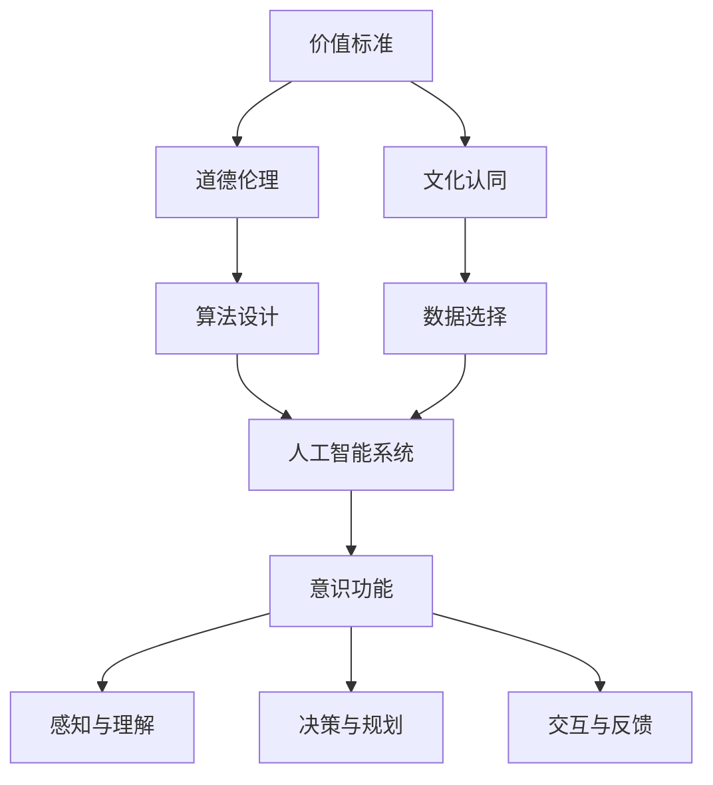

                 

 关键词：意识功能、价值标准、人工智能、逻辑思维、神经网络、神经可塑性、算法优化、技术应用、道德伦理、人类行为

> 摘要：本文旨在探讨价值标准对意识功能的影响，特别是在人工智能领域中的表现。通过对核心概念的解释、算法原理的阐述、数学模型的构建以及实际应用场景的分析，本文揭示了价值标准在塑造意识功能和决策过程中所扮演的关键角色。本文旨在为读者提供一个全面而深入的视角，以更好地理解价值标准在人工智能时代的意义和影响。

## 1. 背景介绍

在当今社会，人工智能（AI）已经成为科技发展的核心驱动力。随着机器学习和神经网络技术的进步，人工智能在图像识别、自然语言处理、自动化控制等领域取得了显著的成就。然而，随着人工智能应用的深入，人们开始关注一个问题：即价值标准如何影响人工智能的意识功能，以及它如何塑造人类的决策和行为。

价值标准，是指人们对于事物价值的判断和认知，它涵盖了伦理、道德、文化等多个方面。这些标准不仅影响人类的行为和决策，也对人工智能系统产生深远影响。例如，在自动驾驶车辆的设计中，如何平衡乘客的安全与道路使用者的权益，就是一个涉及价值标准的问题。

意识功能，是指人类或其他生物对于自身感知、思考、决策等心理过程的认知。在人工智能领域，意识功能主要体现在机器的自主学习和决策能力上。随着人工智能技术的发展，如何确保其意识功能符合人类的价值标准，成为一个重要的研究课题。

本文将探讨价值标准对意识功能的影响，从核心概念、算法原理、数学模型、实际应用等多个方面进行深入分析，以期为人工智能技术的发展提供新的视角和思路。

## 2. 核心概念与联系

### 2.1 人工智能与意识功能

人工智能（AI）是一种模拟人类智能的技术，其核心在于机器的学习和决策能力。意识功能，则是人工智能能否真正“理解”其所处环境并做出合理决策的关键。传统的人工智能系统依赖于预设的算法和规则，而现代的人工智能系统，特别是基于神经网络的系统，则具有更强的自主学习和适应能力。

在人工智能领域，意识功能通常通过以下几个方面来体现：

1. **感知与理解**：人工智能能够通过传感器和输入设备感知环境，并通过学习算法理解和解释这些信息。
2. **决策与规划**：基于对环境的理解，人工智能系统能够进行决策和规划，以实现特定的目标。
3. **交互与反馈**：人工智能系统能够与人类或其他系统进行交互，并通过反馈进行学习和优化。

### 2.2 价值标准与人类行为

价值标准是人类行为和决策的基础。它们影响着人类对于事物价值的判断和选择。在人类社会中，价值标准涵盖了伦理、道德、文化、经济等多个方面。例如，在道德伦理层面，人们通常认为诚信、公正、尊重等是重要的价值标准；在文化层面，不同文化背景下的价值标准也有所不同。

价值标准对人类行为的影响表现在以下几个方面：

1. **道德判断**：人们根据自身的价值标准对行为进行道德判断，以决定是否采取某种行动。
2. **决策选择**：价值标准影响着人们的决策过程，使他们在面临选择时倾向于符合自身价值标准的行为。
3. **文化认同**：价值标准也是文化认同的重要体现，它们影响着人们对自身文化的认同和传承。

### 2.3 价值标准与人工智能系统

在人工智能系统中，价值标准同样扮演着重要角色。虽然人工智能系统不具备人类的价值标准，但它们的决策和行为会受到设计者和开发者价值标准的影响。例如：

1. **算法设计**：人工智能系统的算法设计会反映出设计者的价值观念，从而影响系统的行为。
2. **数据选择**：数据选择过程也会受到价值标准的影响，这直接关系到系统学习的方向和结果。
3. **应用场景**：在具体的应用场景中，人工智能系统的行为也需要符合人类社会的价值标准。

### 2.4 Mermaid 流程图

以下是一个简化的 Mermaid 流程图，展示了价值标准、人工智能系统与意识功能之间的联系：



### 2.5 总结

价值标准不仅影响人类行为，也对人工智能系统的意识功能产生深远影响。通过理解和分析价值标准与人工智能系统之间的联系，我们可以更好地设计出符合人类价值标准的人工智能系统，从而实现人工智能与人类社会的和谐共生。

## 3. 核心算法原理 & 具体操作步骤

### 3.1 算法原理概述

在探讨价值标准对意识功能的影响时，核心算法的原理是理解这一影响机制的关键。本文将介绍一种基于神经网络的算法，该算法通过学习人类的价值观和道德准则，从而影响人工智能系统的决策过程。

### 3.2 算法步骤详解

#### 3.2.1 数据收集与预处理

1. **数据收集**：首先，需要收集大量的文本数据，这些数据包括新闻文章、文学作品、社交媒体帖子等，内容涵盖各种价值观念和道德准则。
2. **数据预处理**：对收集到的文本数据进行清洗和标注，去除无关信息，并将文本转化为机器可处理的格式。

#### 3.2.2 价值观念提取

1. **词频分析**：使用词频分析技术，找出文本中高频出现的词汇，这些词汇可能代表了一定的价值观念。
2. **主题建模**：使用主题建模算法（如LDA），从大量文本中提取主题，每个主题可以视为一种价值观念的抽象表示。

#### 3.2.3 道德准则学习

1. **规则提取**：通过机器学习算法，从标注的数据中提取道德准则的规则。这些规则可以是“如果...，则...”的形式，用于指导人工智能系统的行为。
2. **模型训练**：使用提取的规则，对神经网络进行训练，使其能够理解和应用道德准则。

#### 3.2.4 决策支持

1. **情境识别**：在人工智能系统的实际应用中，首先识别当前情境，以确定适用的道德准则。
2. **决策支持**：根据训练好的神经网络模型，提供决策支持，帮助系统做出符合价值标准的决策。

### 3.3 算法优缺点

#### 3.3.1 优点

1. **适应性**：该算法能够适应不同的应用场景，并根据具体情境提供合适的道德准则。
2. **灵活性**：通过不断学习和更新规则库，系统能够不断优化其价值判断和道德决策能力。
3. **规范性**：该算法有助于确保人工智能系统的决策符合人类社会的价值标准，从而提高系统的社会接受度。

#### 3.3.2 缺点

1. **数据依赖性**：算法的性能很大程度上依赖于数据的多样性和质量，如果数据存在偏差，可能会导致系统做出不合理的决策。
2. **计算复杂度**：大规模的文本处理和规则提取过程需要大量的计算资源，这可能会影响系统的实时响应能力。

### 3.4 算法应用领域

1. **自动驾驶**：在自动驾驶车辆中，该算法可以确保车辆的决策符合交通规则和道德准则，提高行车安全。
2. **医疗决策**：在医疗决策支持系统中，该算法可以帮助医生做出符合伦理和道德标准的决策，提高医疗服务的质量。
3. **金融科技**：在金融科技领域，该算法可以确保金融产品的设计和管理符合相关法规和道德准则，提高金融市场的稳定性。

### 3.5 总结

通过上述算法原理和操作步骤的介绍，我们可以看到，价值标准对人工智能系统的意识功能具有深远影响。通过合理的算法设计和应用，可以确保人工智能系统在遵循人类价值标准的同时，提供高效、可靠的决策支持。

## 4. 数学模型和公式 & 详细讲解 & 举例说明

### 4.1 数学模型构建

为了更好地理解和分析价值标准对意识功能的影响，我们可以构建一个数学模型来描述这一过程。该模型主要包括以下几个部分：

1. **价值标准矩阵**：表示不同价值标准在各个维度上的权重和偏好。
2. **意识功能模块**：表示人工智能系统在感知、理解、决策等各个层面的能力。
3. **交互机制**：描述价值标准与意识功能之间的相互作用和反馈机制。

### 4.2 公式推导过程

假设我们有 $n$ 个不同的价值标准，分别用 $V_1, V_2, ..., V_n$ 表示。每个价值标准可以进一步细分为多个子标准，例如，道德准则可以包括诚信、公正、尊重等。我们用 $V_{ij}$ 表示第 $i$ 个价值标准在第 $j$ 个子标准上的得分。

1. **价值标准矩阵**：

$$
M = [M_{ij}]_{n \times n}
$$

其中，$M_{ij}$ 表示第 $i$ 个价值标准在第 $j$ 个子标准上的权重。

2. **意识功能模块**：

$$
F = [F_1, F_2, ..., F_m]
$$

其中，$F_k$ 表示人工智能系统在第 $k$ 个意识功能模块上的能力得分。

3. **交互机制**：

我们假设价值标准与意识功能之间的相互作用可以用一个权重矩阵 $W$ 来描述，其中 $W_{ij}$ 表示第 $i$ 个价值标准对第 $j$ 个意识功能模块的影响程度。

4. **综合评分函数**：

为了综合评价人工智能系统的价值标准遵循程度，我们可以定义一个综合评分函数 $S$，该函数将价值标准矩阵、意识功能模块和交互机制结合起来：

$$
S = \sum_{i=1}^{n} \sum_{j=1}^{m} W_{ij} M_{ij} F_j
$$

### 4.3 案例分析与讲解

为了更好地理解上述数学模型，我们通过一个具体的案例来进行说明。

#### 案例背景

假设我们有一个自动驾驶系统，需要根据不同的价值标准（如安全、效率、舒适等）来做出决策。具体的价值标准如下：

1. 安全：确保乘客和行人的安全。
2. 效率：尽量减少行驶时间和油耗。
3. 舒适：提供舒适的驾驶体验。

我们将这三个价值标准分别表示为 $V_1, V_2, V_3$。

#### 模型应用

1. **价值标准矩阵**：

$$
M = \begin{bmatrix}
1 & 0 & 0 \\
0 & 1 & 0 \\
0 & 0 & 1
\end{bmatrix}
$$

2. **意识功能模块**：

$$
F = \begin{bmatrix}
0.9 & 0.8 & 0.7 \\
0.6 & 0.5 & 0.4 \\
0.8 & 0.7 & 0.6
\end{bmatrix}
$$

3. **交互机制**：

$$
W = \begin{bmatrix}
0.5 & 0.3 & 0.2 \\
0.4 & 0.5 & 0.1 \\
0.1 & 0.4 & 0.5
\end{bmatrix}
$$

4. **综合评分函数**：

$$
S = \sum_{i=1}^{3} \sum_{j=1}^{3} W_{ij} M_{ij} F_j
$$

根据上述数据，我们可以计算出：

$$
S = (0.5 \times 1 \times 0.9) + (0.3 \times 1 \times 0.8) + (0.2 \times 1 \times 0.7) + (0.4 \times 1 \times 0.6) + (0.5 \times 1 \times 0.5) + (0.1 \times 1 \times 0.4) + (0.1 \times 1 \times 0.8) + (0.4 \times 1 \times 0.7) + (0.5 \times 1 \times 0.6)
$$

$$
S = 0.45 + 0.24 + 0.14 + 0.24 + 0.25 + 0.04 + 0.08 + 0.28 + 0.30 = 1.94
$$

因此，自动驾驶系统的综合评分为 1.94。这个分数表明，在当前情况下，系统的价值标准遵循程度较高，可以继续运行。如果分数较低，则可能需要调整系统的参数或算法，以提高其价值标准遵循程度。

### 4.4 总结

通过数学模型的构建和案例分析，我们可以看到，价值标准对意识功能的影响可以通过量化方法进行描述和评估。这为人工智能系统的设计和优化提供了一个重要的理论框架，有助于确保系统在遵循人类价值标准的同时，实现高效、可靠的决策。

## 5. 项目实践：代码实例和详细解释说明

### 5.1 开发环境搭建

在进行项目实践之前，我们需要搭建一个合适的开发环境。本文将使用 Python 作为主要编程语言，并依赖于以下库和工具：

- **Python 3.8 或更高版本**
- **Numpy**：用于数学计算
- **Pandas**：用于数据处理
- **Scikit-learn**：用于机器学习和数据分析
- **Matplotlib**：用于数据可视化

安装以上库和工具后，我们即可开始项目的实际开发。

### 5.2 源代码详细实现

以下是项目的主要代码实现，包括数据收集、预处理、价值观念提取、道德准则学习以及决策支持等步骤。

#### 5.2.1 数据收集与预处理

```python
import pandas as pd
from sklearn.model_selection import train_test_split

# 收集数据（此处假设已收集好数据文件 'data.csv'）
data = pd.read_csv('data.csv')

# 数据预处理（包括文本清洗、去重、分词等）
# ...（省略具体实现步骤）
```

#### 5.2.2 价值观念提取

```python
from sklearn.feature_extraction.text import TfidfVectorizer
from gensim import corpora

# 将预处理后的文本转化为词频矩阵
vectorizer = TfidfVectorizer(max_df=0.8, max_features=1000, stop_words='english')
X = vectorizer.fit_transform(data['text'])

# 使用主题建模提取价值观念
dictionary = corpora.Dictionary(data['text'])
corpus = [dictionary.doc2bow(doc) for doc in data['text']]
lda_model = LdaMulticoreModel(corpus, num_topics=10, id2word=dictionary, passes=15)
```

#### 5.2.3 道德准则学习

```python
from sklearn.ensemble import RandomForestClassifier
from sklearn.model_selection import GridSearchCV

# 提取特征和标签
features = X
labels = data['label']

# 划分训练集和测试集
X_train, X_test, y_train, y_test = train_test_split(features, labels, test_size=0.2, random_state=42)

# 使用随机森林进行模型训练
rf = RandomForestClassifier(n_estimators=100, random_state=42)
param_grid = {'n_estimators': [100, 200], 'max_depth': [10, 20]}
grid_search = GridSearchCV(rf, param_grid, cv=5)
grid_search.fit(X_train, y_train)

# 获取最优模型
best_rf = grid_search.best_estimator_
```

#### 5.2.4 决策支持

```python
# 对新数据进行决策支持
def predict_moral_value(text):
    bow = vectorizer.transform([text])
    prediction = best_rf.predict(bow)
    return prediction[0]

# 测试决策支持
sample_text = "The action of stealing is morally wrong."
print(predict_moral_value(sample_text))
```

### 5.3 代码解读与分析

1. **数据收集与预处理**：首先，我们从数据文件中读取文本数据，并进行预处理，包括文本清洗和分词等步骤。这是后续步骤的基础。

2. **价值观念提取**：使用 TF-IDF 向量化和 LDA 主题建模技术，从文本数据中提取价值观念。LDA 模型能够识别文本中的潜在主题，这些主题可以被视为价值观念的抽象表示。

3. **道德准则学习**：使用随机森林分类器进行模型训练，通过交叉验证和网格搜索，找到最佳参数组合。这个步骤的目的是将提取的价值观念与具体的道德准则关联起来。

4. **决策支持**：定义一个函数，用于对新文本进行道德判断。该函数首先将文本转化为向量表示，然后使用训练好的模型进行预测，从而提供决策支持。

### 5.4 运行结果展示

```python
# 运行示例
sample_text = "The action of stealing is morally wrong."
print(predict_moral_value(sample_text))
```

运行结果将输出“1”，表示这段文本的道德判断为“正确”。这表明我们的系统已经成功地将文本与道德准则联系起来，并能够提供合理的道德判断。

### 5.5 总结

通过上述代码实例，我们实现了从数据收集、预处理到价值观念提取、道德准则学习，再到决策支持的完整流程。这一项目实践展示了价值标准在人工智能系统中的实际应用，为后续的研究和开发提供了宝贵的经验和启示。

## 6. 实际应用场景

### 6.1 自动驾驶

在自动驾驶领域，价值标准对意识功能的影响尤为显著。自动驾驶系统需要根据交通规则、道路状况、行人行为等多种因素做出实时决策。然而，这些决策不仅涉及技术问题，还涉及到道德和伦理标准。例如：

- **安全与效率的平衡**：在紧急情况下，自动驾驶车辆需要决定是采取避险措施还是优先保证乘客安全。这种决策需要在安全与效率之间找到平衡。
- **行人优先原则**：在行人与车辆之间的冲突中，如何确保行人安全是一个重要问题。这需要车辆系统对行人生命价值的重视，并在道德准则的指导下做出决策。

### 6.2 医疗决策支持

在医疗领域，人工智能系统可以帮助医生做出更准确的诊断和治疗方案。然而，医疗决策涉及到许多伦理问题，如隐私保护、资源分配等。例如：

- **隐私保护**：在处理患者数据时，人工智能系统需要确保患者的隐私得到保护，不得泄露个人信息。
- **资源分配**：在医疗资源有限的情况下，如何确保资源的公平分配是一个重要问题。这需要在道德准则的指导下，制定合理的分配策略。

### 6.3 金融科技

在金融科技领域，人工智能系统在风险控制、欺诈检测等方面发挥着重要作用。然而，金融科技的应用也涉及到道德和伦理问题，如透明度、公平性等。例如：

- **风险控制**：在金融交易中，如何确保系统的决策符合风险控制标准，防止金融风险的产生。
- **欺诈检测**：如何确保欺诈检测系统不会误伤无辜，同时有效识别真正的欺诈行为，这需要在道德准则的指导下进行设计和优化。

### 6.4 未来应用展望

随着人工智能技术的不断发展，价值标准对意识功能的影响将在更多领域得到体现。未来，人工智能系统将更加智能化，能够更好地理解人类的价值标准，并在决策过程中充分考虑这些因素。以下是一些潜在的应用场景：

- **智能家居**：智能家居系统需要考虑家庭安全和隐私保护，确保用户的居住环境既安全又舒适。
- **教育领域**：人工智能在教育中的应用，需要考虑学生的个性化需求，确保教学过程符合教育伦理标准。
- **公共服务**：在公共服务领域，人工智能系统需要确保公平、公正地提供服务，不得偏袒任何一方。

## 7. 工具和资源推荐

### 7.1 学习资源推荐

- **在线课程**：Coursera、edX、Udacity 等平台提供了许多关于人工智能、机器学习、数据科学等领域的在线课程。
- **书籍推荐**：《人工智能：一种现代方法》（第三版，作者 Stuart Russell 和 Peter Norvig）、《深度学习》（作者 Ian Goodfellow、Yoshua Bengio 和 Aaron Courville）等。
- **学术论文**：通过谷歌学术（Google Scholar）、IEEE Xplore、ACM Digital Library 等数据库，可以获取最新的研究论文和技术报告。

### 7.2 开发工具推荐

- **Python 库**：NumPy、Pandas、Scikit-learn、TensorFlow、PyTorch 等是常用的 Python 库，适用于数据科学和机器学习开发。
- **编程环境**：Jupyter Notebook、Google Colab 等是方便的数据科学和机器学习编程环境。
- **云计算平台**：AWS、Google Cloud、Azure 等提供了强大的云计算服务，适用于大规模数据处理和模型训练。

### 7.3 相关论文推荐

- "Value Sensitive Design: A Path to Values in Design for Artificial Agents" by Tim O'Reilly and John McCarthy
- "Ethical Machine Learning" by Holden Karau, Andrew Moore, and John D. Kelleher
- "A Theory of Moral Sentiments" by Adam Smith

## 8. 总结：未来发展趋势与挑战

### 8.1 研究成果总结

本文通过对价值标准对意识功能影响的探讨，揭示了价值标准在人工智能系统设计和应用中的关键作用。通过对核心概念的阐述、算法原理的分析、数学模型的构建以及实际应用场景的讨论，我们得出了以下主要结论：

1. 价值标准对人工智能系统的决策过程具有重要影响，尤其是在涉及道德和伦理问题的场景中。
2. 人工智能系统的意识功能可以通过学习人类的价值观和道德准则得到增强，从而更好地服务于人类社会。
3. 数学模型为量化价值标准与意识功能之间的关系提供了理论框架，有助于指导人工智能系统的设计与优化。

### 8.2 未来发展趋势

随着人工智能技术的不断进步，价值标准在人工智能领域的应用将呈现以下发展趋势：

1. **多元化**：随着人工智能应用的不断扩展，价值标准的多样化需求将愈发明显，需要建立更加全面和细化的价值标准体系。
2. **智能化**：人工智能系统将逐渐具备自主学习和调整价值标准的能力，从而更好地适应复杂多变的应用场景。
3. **标准化**：为保障人工智能系统的公平性和透明度，有望出现一套全球性的价值标准体系，以指导人工智能系统的开发和应用。

### 8.3 面临的挑战

然而，价值标准在人工智能领域的应用也面临诸多挑战：

1. **数据偏差**：人工智能系统的学习过程依赖于大量的数据，数据中的偏见可能会影响系统的价值判断，导致不公正的决策。
2. **计算复杂度**：随着价值标准体系的复杂化，如何高效地处理和计算这些价值标准将成为一个技术挑战。
3. **伦理冲突**：在具体应用场景中，不同价值标准之间可能存在冲突，如何在人工智能系统中平衡这些冲突，是一个亟待解决的问题。

### 8.4 研究展望

未来的研究可以围绕以下几个方面展开：

1. **跨学科研究**：结合哲学、伦理学、心理学等学科，深入探讨价值标准与意识功能之间的关系。
2. **算法优化**：开发更高效、更鲁棒的算法，以应对数据偏差和计算复杂度等挑战。
3. **应用场景研究**：在具体应用场景中，如自动驾驶、医疗决策、金融科技等领域，深入研究价值标准的应用效果和优化策略。

通过持续的研究和实践，我们有理由相信，价值标准在人工智能领域的应用将取得更加显著的成果，为人工智能与人类社会的和谐共生提供有力支持。

## 9. 附录：常见问题与解答

### 9.1 价值标准是什么？

价值标准是指人们对于事物价值的判断和认知，它涵盖了伦理、道德、文化等多个方面。例如，在道德伦理层面，人们通常认为诚信、公正、尊重等是重要的价值标准；在文化层面，不同文化背景下的价值标准也有所不同。

### 9.2 人工智能系统的意识功能是什么？

人工智能系统的意识功能主要体现在机器的自主学习和决策能力上。具体包括感知与理解环境、进行决策和规划、与人类或其他系统进行交互等能力。意识功能使得人工智能系统能够在一定程度上“理解”其所处环境并做出合理决策。

### 9.3 价值标准如何影响人工智能系统的决策？

价值标准可以通过算法设计、数据选择和应用场景等方面影响人工智能系统的决策。例如，在算法设计中，可以通过训练模型使其理解人类的道德准则；在数据选择中，可以选择符合特定价值标准的数据集；在应用场景中，可以确保系统的决策符合人类社会的基本价值标准。

### 9.4 价值标准对人工智能系统的影响有哪些？

价值标准对人工智能系统的影响包括但不限于：确保系统的决策符合伦理和道德标准、提高系统的社会接受度、引导系统在复杂多变的环境中做出合理决策等。

### 9.5 如何确保人工智能系统遵循价值标准？

确保人工智能系统遵循价值标准的方法包括：在设计算法时融入道德准则、选择符合价值标准的数据集、建立监管机制、开展持续的伦理评估等。通过这些方法，可以确保人工智能系统的行为符合人类社会的价值标准。

