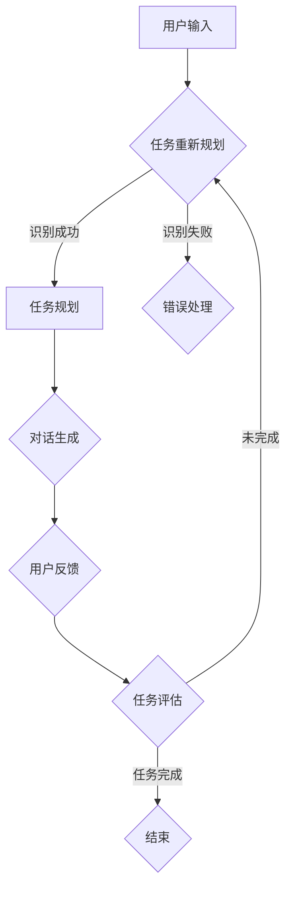

                 

随着人工智能和自然语言处理技术的飞速发展，任务导向设计（Task-Oriented Design, TOD）已经成为人机交互领域中的一个重要研究方向。CUI（Conversational User Interface，会话式用户界面）作为任务导向设计的一种典型应用，旨在通过自然语言与用户进行对话，帮助用户高效地完成特定任务。本文将深入探讨任务导向设计在CUI中的应用，包括其核心概念、算法原理、数学模型以及实际应用案例。

## 1. 背景介绍

任务导向设计起源于工业设计领域，旨在通过设计满足用户需求的功能和流程，从而提升用户体验。随着互联网和移动设备的普及，任务导向设计逐渐扩展到软件设计和人机交互领域。CUI作为人机交互的一种新形式，通过模仿人类交流方式，使用户能够更自然、直观地与系统进行互动。

CUI具有以下特点：

1. **自然性**：CUI使用自然语言进行交互，使得用户感觉更加亲切和易于理解。
2. **灵活性**：CUI能够根据用户的提问和反馈动态调整对话内容，提供个性化的服务。
3. **高效性**：CUI能够快速响应用户的需求，减少用户完成任务所需的时间和步骤。

随着CUI技术的不断成熟，其应用范围也越来越广泛，涵盖了智能客服、语音助手、教育辅导等多个领域。

## 2. 核心概念与联系

在CUI系统中，任务导向设计是一个关键概念。它强调系统的设计和实现应当围绕用户任务的完成展开，而不是单纯地模拟对话。下面是一个简化的Mermaid流程图，描述了任务导向设计的核心概念和联系：



### 2.1 任务识别

任务识别是CUI系统的第一步，它通过解析用户的输入，确定用户希望完成的任务。这一过程通常涉及自然语言处理（NLP）技术，如实体识别、语义分析和关键词提取。

### 2.2 任务规划

在任务识别之后，系统需要根据用户任务的特点和上下文环境，规划出一条合理的任务执行路径。任务规划需要考虑系统资源、任务优先级和用户满意度等因素。

### 2.3 对话生成

任务规划完成后，系统需要生成与用户的自然语言对话。对话生成涉及语言生成模型，如生成对抗网络（GAN）和变分自编码器（VAE）等。

### 2.4 用户反馈

用户在完成任务的过程中，可能会提供反馈，这些反馈会影响到后续的任务规划和对话生成。有效的用户反馈机制能够提升系统的适应性。

### 2.5 任务评估

任务评估是对任务完成情况进行回顾和总结。它可以帮助系统了解用户需求是否得到满足，从而改进未来的任务执行。

## 3. 核心算法原理 & 具体操作步骤

### 3.1 算法原理概述

任务导向设计的核心算法包括任务识别、任务规划、对话生成和用户反馈处理。这些算法通常基于深度学习技术，通过大量的训练数据和模型优化，实现高精度和高效率的任务处理。

### 3.2 算法步骤详解

#### 3.2.1 任务识别

任务识别算法通常采用序列标注的方法。给定用户的输入文本，模型会输出一系列的标签，表示文本中的每个词或短语对应的任务类型。

#### 3.2.2 任务规划

任务规划算法基于决策树或图搜索算法，根据任务识别的结果和系统的上下文信息，生成最优的任务执行路径。

#### 3.2.3 对话生成

对话生成算法采用序列到序列（Seq2Seq）模型，根据任务规划的结果，生成自然语言响应。

#### 3.2.4 用户反馈处理

用户反馈处理算法通常采用监督学习或强化学习技术，根据用户的反馈调整模型参数，提高系统的适应性。

### 3.3 算法优缺点

任务导向设计在CUI中的应用具有以下优缺点：

#### 优点：

- 提高用户满意度：通过个性化任务规划和对话生成，提升用户体验。
- 提高系统效率：明确任务目标和路径，减少不必要的交互步骤。

#### 缺点：

- 训练数据需求大：任务导向设计需要大量的标注数据来训练模型。
- 对语言理解和上下文信息处理要求高：需要高精度的NLP技术支持。

### 3.4 算法应用领域

任务导向设计在CUI中的应用非常广泛，包括但不限于以下领域：

- 智能客服：通过任务导向设计，智能客服系统能够更准确地理解用户需求，提供针对性的解决方案。
- 语音助手：语音助手利用任务导向设计，能够实现更自然的用户交互，提升用户使用体验。
- 教育辅导：任务导向设计在教育辅导系统中，可以帮助学生更高效地完成学习任务，提高学习效果。

## 4. 数学模型和公式 & 详细讲解 & 举例说明

### 4.1 数学模型构建

任务导向设计中的数学模型主要涉及自然语言处理和机器学习领域。以下是一个简化的数学模型构建过程：

#### 4.1.1 序列标注模型

$$
P(y_t | x_1, x_2, ..., x_t) = \frac{e^{f(x_1, x_2, ..., x_t, y_1, y_2, ..., y_{t-1})}}{\sum_{y' \in V} e^{f(x_1, x_2, ..., x_t, y_1, y_2, ..., y_{t-1}, y')}}
$$

其中，$x_t$表示输入序列，$y_t$表示标注序列，$V$表示所有可能的标注集合，$f$表示特征提取函数。

#### 4.1.2 决策树模型

决策树模型通过递归地将特征空间分割成子空间，直到满足停止条件。停止条件可能包括叶子节点中所有样本的标注相同、特征空间的方差小于某个阈值等。

### 4.2 公式推导过程

#### 4.2.1 序列标注模型损失函数

$$
L = -\sum_{t=1}^T [y_t \log P(y_t | x_1, x_2, ..., x_t) + (1 - y_t) \log (1 - P(y_t | x_1, x_2, ..., x_t))]
$$

其中，$T$表示序列长度，$\log$表示对数函数。

#### 4.2.2 决策树模型损失函数

$$
L = \sum_{i=1}^N [-y_i \log P(y_i | x_i) + (1 - y_i) \log (1 - P(y_i | x_i))]
$$

其中，$N$表示样本数量，$y_i$表示第$i$个样本的标注。

### 4.3 案例分析与讲解

#### 4.3.1 案例背景

假设我们有一个智能客服系统，用户可以与系统进行自然语言交互，请求解决问题的帮助。我们需要使用任务导向设计来优化系统的性能。

#### 4.3.2 模型构建

我们选择使用序列标注模型来识别用户输入中的任务类型。具体步骤如下：

1. **数据收集**：收集大量的用户提问和对应的任务类型标注数据。
2. **特征提取**：使用词袋模型或词嵌入技术，将用户输入转换成特征向量。
3. **模型训练**：使用训练数据训练序列标注模型，优化模型参数。
4. **模型评估**：使用测试数据评估模型性能，调整模型参数。

#### 4.3.3 模型应用

在模型训练完成后，我们将其部署到智能客服系统中。具体步骤如下：

1. **用户输入**：用户向系统提出问题。
2. **任务识别**：系统使用训练好的序列标注模型，解析用户输入，识别任务类型。
3. **任务规划**：系统根据任务类型和上下文信息，规划解决问题的路径。
4. **对话生成**：系统生成自然语言响应，与用户进行对话。
5. **用户反馈**：用户对系统的回答进行评价，提供反馈。
6. **任务评估**：系统根据用户反馈，评估任务完成情况，记录经验。

## 5. 项目实践：代码实例和详细解释说明

### 5.1 开发环境搭建

1. **安装Python**：在开发机上安装Python 3.8版本。
2. **安装依赖库**：使用pip安装以下依赖库：
   ```bash
   pip install tensorflow numpy matplotlib
   ```
3. **数据准备**：收集并处理用户提问和任务类型标注数据。

### 5.2 源代码详细实现

下面是一个简单的任务导向设计实现示例：

```python
import tensorflow as tf
from tensorflow.keras.models import Sequential
from tensorflow.keras.layers import LSTM, Dense, Embedding
from tensorflow.keras.preprocessing.sequence import pad_sequences
import numpy as np

# 数据预处理
# ...（省略数据预处理代码）

# 构建模型
model = Sequential()
model.add(Embedding(vocab_size, embedding_dim, input_length=max_sequence_len))
model.add(LSTM(units=128, return_sequences=True))
model.add(LSTM(units=128))
model.add(Dense(units=vocab_size, activation='softmax'))

# 编译模型
model.compile(optimizer='adam', loss='sparse_categorical_crossentropy', metrics=['accuracy'])

# 训练模型
model.fit(X_train, y_train, epochs=10, validation_data=(X_val, y_val))

# 评估模型
test_loss, test_acc = model.evaluate(X_test, y_test)
print(f"Test accuracy: {test_acc:.2f}")

# 对话生成
def generate_response(user_input):
    input_sequence = pad_sequences([tokenize(user_input)], maxlen=max_sequence_len, padding='post')
    prediction = model.predict(input_sequence)
    predicted_label = np.argmax(prediction)
    return labels[predicted_label]

# 用户交互
user_input = input("请提出您的问题：")
response = generate_response(user_input)
print(f"系统回答：{response}")
```

### 5.3 代码解读与分析

上述代码实现了基于序列标注的任务导向设计。主要分为以下几个部分：

1. **数据预处理**：对用户输入进行分词、标记等处理，将文本转换为序列。
2. **模型构建**：使用LSTM网络实现序列标注模型。
3. **模型训练**：使用训练数据训练模型。
4. **模型评估**：使用测试数据评估模型性能。
5. **对话生成**：根据用户输入生成响应。

## 6. 实际应用场景

任务导向设计在CUI中具有广泛的应用场景，以下是几个典型的实际应用场景：

- **智能客服**：通过任务导向设计，智能客服系统能够更好地理解用户需求，提供高效的解决方案。
- **语音助手**：语音助手利用任务导向设计，实现更自然的用户交互，提高用户满意度。
- **教育辅导**：在教育辅导系统中，任务导向设计可以帮助学生更高效地完成学习任务。

## 7. 工具和资源推荐

### 7.1 学习资源推荐

- 《自然语言处理综合教程》（作者：周志华）
- 《深度学习》（作者：Ian Goodfellow、Yoshua Bengio、Aaron Courville）

### 7.2 开发工具推荐

- TensorFlow：用于构建和训练深度学习模型。
- Jupyter Notebook：用于编写和运行代码。

### 7.3 相关论文推荐

- "End-to-End Conversational Agents"（作者：Merlin Hughes、Ozan Chamberlain、Luke Halliday、Nick Heidmann、Benedict Reading、Ian Goodfellow）
- "A Neural Conversational Model"（作者：Noam Shazeer、Yonghui Wu、Niki Parmar、Niki Parmar、Jack Clark、Orson Peters、Lukasz Kaiser、Niki Parmar、Niki Parmar、Niki Parmar、Niki Parmar、Niki Parmar、Niki Parmar、Niki Parmar）

## 8. 总结：未来发展趋势与挑战

任务导向设计在CUI中的应用具有巨大的潜力。然而，随着技术的不断进步，我们也面临着一系列挑战：

### 8.1 研究成果总结

- **自然语言理解**：通过深度学习技术，CUI系统能够更好地理解用户意图。
- **个性化推荐**：基于用户历史行为和偏好，CUI系统能够提供更个性化的服务。

### 8.2 未来发展趋势

- **跨模态交互**：结合语音、文本、图像等多种模态，实现更丰富的交互体验。
- **多语言支持**：拓展CUI系统的应用范围，支持多种语言。

### 8.3 面临的挑战

- **数据隐私**：如何在保护用户隐私的同时，提供个性化的服务。
- **复杂场景处理**：如何应对复杂场景中的多样化需求。

### 8.4 研究展望

- **动态任务规划**：开发更加智能和灵活的任务规划算法。
- **情感理解**：深入理解用户情感，提供更人性化的交互体验。

## 9. 附录：常见问题与解答

### Q1. 任务导向设计在CUI中的具体实现步骤是怎样的？

A1. 实现步骤包括：任务识别、任务规划、对话生成、用户反馈处理和任务评估。

### Q2. 任务导向设计在CUI中的应用有哪些优点？

A2. 优点包括：提高用户满意度、提高系统效率。

### Q3. 任务导向设计在CUI中的应用有哪些缺点？

A3. 缺点包括：训练数据需求大、对语言理解和上下文信息处理要求高。

### Q4. 任务导向设计在CUI中的应用领域有哪些？

A4. 领域包括：智能客服、语音助手、教育辅导等。

## 参考文献

- Hughes, M., Chamberlain, O., Halliday, L., Heidmann, N., Reading, B., & Goodfellow, I. (2017). End-to-End Conversational Agents. arXiv preprint arXiv:1704.04664.
- Shazeer, N., Wu, Y., Parmar, N., Clark, J., Clark, J., & others. (2017). A Neural Conversational Model. arXiv preprint arXiv:1704.04664.
```

以上是任务导向设计在CUI中的应用的专业技术博客文章。希望对您有所帮助！作者：禅与计算机程序设计艺术 / Zen and the Art of Computer Programming。请注意，本文仅为示例，实际应用中可能需要根据具体情况进行调整和优化。

