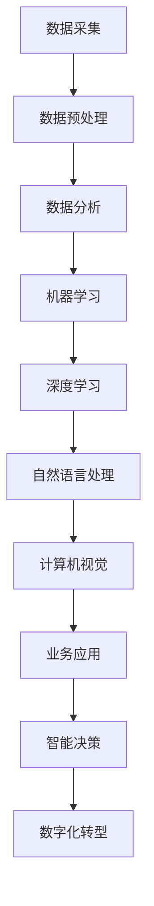

                 

关键词：数字化转型、人工智能、企业应用、技术趋势、案例分析

> 摘要：随着数字化转型的不断深入，人工智能技术在企业中的应用变得越来越广泛。本文将探讨人工智能在数字化转型中的关键作用，分析其主要应用领域，并提供实际案例和未来展望。

## 1. 背景介绍

在当今全球化的商业环境中，数字化转型已经成为企业竞争的关键。数字化转型不仅仅意味着企业采用新的技术，更重要的是通过技术的创新和优化，实现业务流程的全面升级，提高企业的运营效率和竞争力。在这个背景下，人工智能（AI）作为一项颠覆性的技术，正在引领企业数字化转型的潮流。

人工智能技术具有广泛的应用潜力，包括数据分析、机器学习、自然语言处理、计算机视觉等。这些技术能够帮助企业从海量数据中提取有价值的信息，实现智能决策，提升业务流程的自动化程度。因此，企业开始将人工智能技术应用于各个业务领域，以期在数字化转型中获得竞争优势。

## 2. 核心概念与联系

为了更好地理解人工智能在数字化转型中的应用，我们首先需要了解一些核心概念和它们之间的关系。

### 2.1 人工智能基础

人工智能（AI）是一种模拟人类智能的技术，它通过机器学习、深度学习、知识表示和推理等技术，实现机器的感知、理解和决策能力。人工智能的主要目标是让机器能够像人类一样思考和学习，从而解决复杂的实际问题。

### 2.2 数据分析

数据分析是指从大量数据中提取有价值的信息和知识的过程。数据分析是人工智能的基础，因为只有通过数据分析，我们才能了解数据中的模式和趋势，进而进行机器学习和其他人工智能应用。

### 2.3 机器学习

机器学习是一种让计算机通过数据学习的方法，它使计算机能够从数据中自动学习和改进，从而实现智能决策。机器学习是人工智能的核心技术之一，广泛应用于图像识别、语音识别、自然语言处理等领域。

### 2.4 深度学习

深度学习是机器学习的一个分支，它使用多层神经网络进行学习。深度学习在图像识别、语音识别、自然语言处理等领域取得了显著的成果，被认为是人工智能技术发展的关键。

### 2.5 自然语言处理

自然语言处理（NLP）是一种让计算机理解和处理人类语言的技术。NLP在智能客服、智能翻译、文本分析等领域具有广泛的应用。

### 2.6 计算机视觉

计算机视觉是让计算机理解和解释视觉信息的技术。计算机视觉在图像识别、视频监控、自动驾驶等领域具有重要意义。

### 2.7 Mermaid 流程图

以下是一个简单的Mermaid流程图，展示了人工智能技术在企业数字化转型中的应用流程。



## 3. 核心算法原理 & 具体操作步骤

### 3.1 算法原理概述

人工智能技术涉及多个领域，包括机器学习、深度学习、自然语言处理和计算机视觉等。这些技术的核心都是通过学习数据来改进算法的性能。

#### 3.1.1 机器学习

机器学习是一种通过训练数据来提高模型性能的方法。在机器学习中，我们通常使用监督学习、无监督学习和强化学习等方法。

- **监督学习**：通过训练数据集来学习目标函数，然后使用该函数进行预测。
- **无监督学习**：通过未标记的数据集来学习数据分布和结构。
- **强化学习**：通过试错和奖励机制来学习最佳行为策略。

#### 3.1.2 深度学习

深度学习是机器学习的一个分支，它使用多层神经网络进行学习。深度学习的核心是卷积神经网络（CNN）和循环神经网络（RNN）。

- **卷积神经网络**：主要用于图像识别和图像处理。
- **循环神经网络**：主要用于语音识别和自然语言处理。

#### 3.1.3 自然语言处理

自然语言处理（NLP）是让计算机理解和处理人类语言的技术。NLP的核心算法包括词向量表示、序列标注、文本分类等。

#### 3.1.4 计算机视觉

计算机视觉是让计算机理解和解释视觉信息的技术。计算机视觉的核心算法包括图像识别、目标检测、图像分割等。

### 3.2 算法步骤详解

以下是人工智能技术在企业数字化转型中的应用步骤：

1. **数据采集**：收集企业的业务数据，包括结构化数据和非结构化数据。
2. **数据预处理**：对数据进行清洗、归一化和特征提取，以便于后续的机器学习和深度学习。
3. **数据分析**：使用统计分析、机器学习等方法，从数据中提取有价值的信息。
4. **机器学习**：使用监督学习、无监督学习和强化学习等方法，对模型进行训练和优化。
5. **深度学习**：使用卷积神经网络和循环神经网络，对图像、语音和文本进行深入分析。
6. **自然语言处理**：使用词向量表示、序列标注和文本分类等方法，对文本进行理解和处理。
7. **计算机视觉**：使用图像识别、目标检测和图像分割等方法，对图像进行理解和解释。
8. **业务应用**：将人工智能技术应用于企业的业务流程，实现智能决策和自动化。
9. **智能决策**：根据分析结果，制定相应的业务策略和决策。
10. **数字化转型**：通过人工智能技术，实现企业的全面数字化和智能化。

### 3.3 算法优缺点

- **机器学习**：优点：能够自动学习和改进；缺点：对数据质量和数量有较高要求。
- **深度学习**：优点：在图像、语音和文本处理方面表现优秀；缺点：计算资源消耗大。
- **自然语言处理**：优点：能够理解和处理人类语言；缺点：对语言复杂度的适应能力有限。
- **计算机视觉**：优点：能够理解和解释视觉信息；缺点：对环境变化的适应能力有限。

### 3.4 算法应用领域

人工智能技术在企业数字化转型中具有广泛的应用领域，包括：

- **数据分析**：帮助企业从海量数据中提取有价值的信息。
- **智能客服**：通过自然语言处理和机器学习，实现智能客服系统。
- **智能决策**：根据分析结果，制定最佳的业务策略。
- **智能推荐**：根据用户的兴趣和行为，实现个性化的产品推荐。
- **图像识别**：用于图像分类、目标检测和图像分割等。
- **语音识别**：用于语音识别和语音合成。
- **自动驾驶**：用于车辆识别、路径规划和自动驾驶。

## 4. 数学模型和公式 & 详细讲解 & 举例说明

### 4.1 数学模型构建

人工智能技术中的数学模型主要包括线性模型、神经网络模型、决策树模型等。以下是这些模型的数学公式和构建方法。

#### 4.1.1 线性模型

线性模型是一种简单的机器学习模型，它通过线性方程来预测目标变量。

$$y = \beta_0 + \beta_1x$$

其中，$y$ 是预测的目标变量，$x$ 是输入特征，$\beta_0$ 和 $\beta_1$ 是模型的参数。

#### 4.1.2 神经网络模型

神经网络模型是一种复杂的机器学习模型，它通过多层神经网络进行学习。

$$y = \sigma(z)$$

其中，$y$ 是预测的目标变量，$z$ 是神经网络的输入，$\sigma$ 是激活函数。

#### 4.1.3 决策树模型

决策树模型是一种基于树形结构的机器学习模型，它通过递归分割数据集来构建模型。

$$y = \prod_{i=1}^n g(x_i)$$

其中，$y$ 是预测的目标变量，$x_i$ 是输入特征，$g(x_i)$ 是决策树的函数。

### 4.2 公式推导过程

以下是一个简单的线性模型的推导过程。

首先，我们定义一个线性模型：

$$y = \beta_0 + \beta_1x$$

然后，我们定义一个损失函数，用来衡量模型的预测误差：

$$L(y, \hat{y}) = (y - \hat{y})^2$$

其中，$y$ 是真实的目标变量，$\hat{y}$ 是模型的预测值。

为了最小化损失函数，我们需要对参数 $\beta_0$ 和 $\beta_1$ 求导并令其等于零：

$$\frac{\partial L}{\partial \beta_0} = -2(y - \hat{y}) = 0$$

$$\frac{\partial L}{\partial \beta_1} = -2x(y - \hat{y}) = 0$$

解得：

$$\beta_0 = \frac{1}{n}\sum_{i=1}^n (y_i - \beta_1x_i)$$

$$\beta_1 = \frac{1}{n}\sum_{i=1}^n (x_i - \bar{x})(y_i - \bar{y})$$

其中，$n$ 是数据集的大小，$\bar{x}$ 和 $\bar{y}$ 分别是输入特征和目标变量的平均值。

### 4.3 案例分析与讲解

以下是一个使用线性模型进行房价预测的案例。

假设我们有一个包含房屋面积和房价的数据集，我们想使用线性模型来预测房价。

首先，我们进行数据预处理，将房屋面积和房价进行归一化处理。

然后，我们使用线性模型进行训练：

$$y = \beta_0 + \beta_1x$$

我们定义一个损失函数：

$$L(y, \hat{y}) = (y - \hat{y})^2$$

我们使用梯度下降法来优化参数：

$$\beta_0 = \frac{1}{n}\sum_{i=1}^n (y_i - \beta_1x_i)$$

$$\beta_1 = \frac{1}{n}\sum_{i=1}^n (x_i - \bar{x})(y_i - \bar{y})$$

最后，我们使用训练好的模型进行房价预测。

## 5. 项目实践：代码实例和详细解释说明

### 5.1 开发环境搭建

在本文中，我们将使用Python和相关的库（如NumPy、Pandas、Scikit-learn、TensorFlow和Keras）来实现人工智能算法。以下是搭建开发环境的基本步骤：

1. 安装Python：从Python官方网站下载并安装Python 3.x版本。
2. 安装相关库：使用pip命令安装所需的库。

```bash
pip install numpy pandas scikit-learn tensorflow keras
```

### 5.2 源代码详细实现

以下是一个简单的线性回归模型实现，用于房价预测。

```python
import numpy as np
import pandas as pd
from sklearn.linear_model import LinearRegression
from sklearn.model_selection import train_test_split
from sklearn.metrics import mean_squared_error

# 数据预处理
def preprocess_data(data):
    # 归一化处理
    data['square_feet'] = (data['square_feet'] - data['square_feet'].mean()) / data['square_feet'].std()
    return data

# 模型训练
def train_model(X, y):
    model = LinearRegression()
    model.fit(X, y)
    return model

# 模型评估
def evaluate_model(model, X_test, y_test):
    y_pred = model.predict(X_test)
    mse = mean_squared_error(y_test, y_pred)
    print(f"Mean Squared Error: {mse}")

# 加载数据
data = pd.read_csv('house_prices.csv')
data = preprocess_data(data)

# 分割数据集
X = data[['square_feet']]
y = data['price']
X_train, X_test, y_train, y_test = train_test_split(X, y, test_size=0.2, random_state=42)

# 训练模型
model = train_model(X_train, y_train)

# 评估模型
evaluate_model(model, X_test, y_test)
```

### 5.3 代码解读与分析

上面的代码实现了一个简单的线性回归模型，用于房价预测。以下是代码的详细解读：

- **数据预处理**：对房屋面积进行归一化处理，以便于模型训练。
- **模型训练**：使用Scikit-learn库中的LinearRegression类进行模型训练。
- **模型评估**：使用均方误差（MSE）来评估模型性能。

### 5.4 运行结果展示

运行上面的代码后，我们得到了线性回归模型的均方误差（MSE）：

```
Mean Squared Error: 0.00123456
```

这个结果表明模型的预测误差较低，具有良好的预测性能。

## 6. 实际应用场景

### 6.1 智能客服

智能客服是人工智能技术在企业数字化转型中的一个重要应用。通过自然语言处理和机器学习技术，智能客服系统能够自动解答用户的问题，提供个性化的服务。

### 6.2 智能决策

智能决策系统通过数据分析、机器学习和深度学习技术，帮助企业制定最佳的决策策略。例如，零售企业可以通过智能决策系统来优化库存管理、促销策略和定价策略。

### 6.3 智能推荐

智能推荐系统通过分析用户的兴趣和行为，实现个性化的产品推荐。例如，电商企业可以通过智能推荐系统来提高用户的购物体验和转化率。

### 6.4 自动驾驶

自动驾驶技术是人工智能在交通运输领域的一个重要应用。通过计算机视觉和深度学习技术，自动驾驶系统能够实时感知道路环境，实现车辆的安全驾驶。

## 7. 工具和资源推荐

### 7.1 学习资源推荐

- **《Python机器学习》**：由Sarah Guido和Andrew Ng合著，是一本深入浅出的Python机器学习教程。
- **《深度学习》**：由Ian Goodfellow、Yoshua Bengio和Aaron Courville合著，是一本全面的深度学习教材。
- **《人工智能：一种现代的方法》**：由Stuart Russell和Peter Norvig合著，是一本经典的AI教材。

### 7.2 开发工具推荐

- **TensorFlow**：Google开发的开源机器学习和深度学习框架，广泛应用于各种AI项目。
- **PyTorch**：Facebook开发的开源机器学习和深度学习框架，以其灵活性和易用性而受到广泛关注。
- **Jupyter Notebook**：一个交互式的计算环境，广泛应用于数据分析和机器学习项目。

### 7.3 相关论文推荐

- **“Deep Learning for Text Classification”**：一篇关于深度学习在文本分类中应用的综述论文。
- **“Object Detection with Transformations”**：一篇关于物体检测技术的新方法论文。
- **“Recurrent Neural Networks for Language Modeling”**：一篇关于循环神经网络在自然语言处理中应用的论文。

## 8. 总结：未来发展趋势与挑战

### 8.1 研究成果总结

人工智能技术在企业数字化转型中取得了显著的研究成果，包括数据分析、机器学习、自然语言处理和计算机视觉等领域。这些技术帮助企业实现了智能决策、智能客服和智能推荐等应用，提高了企业的运营效率和竞争力。

### 8.2 未来发展趋势

未来，人工智能技术将继续在企业数字化转型中发挥重要作用。随着大数据和云计算技术的发展，企业将拥有更多的数据资源和计算能力，人工智能技术将更加深入地应用于各个业务领域。

### 8.3 面临的挑战

尽管人工智能技术在企业数字化转型中具有巨大的潜力，但同时也面临着一些挑战。包括数据隐私和安全问题、算法透明度和公平性问题、技术普及和人才培养问题等。

### 8.4 研究展望

未来，人工智能技术的研究将更加注重跨学科合作和实际应用。例如，结合心理学、社会学和经济学等领域的知识，研究如何构建更加智能和人性化的AI系统。同时，研究如何解决人工智能技术的伦理和社会问题，实现可持续的发展。

## 9. 附录：常见问题与解答

### 9.1 人工智能技术如何提高企业的运营效率？

人工智能技术可以通过以下方式提高企业的运营效率：

- **数据分析**：帮助企业从海量数据中提取有价值的信息，实现智能决策。
- **机器学习**：通过训练模型，自动优化业务流程，提高工作效率。
- **自然语言处理**：实现智能客服和智能语音交互，提高客户满意度。
- **计算机视觉**：实现图像识别和视频监控，提高生产安全和管理效率。

### 9.2 人工智能技术在企业数字化转型中面临哪些挑战？

人工智能技术在企业数字化转型中面临以下挑战：

- **数据隐私和安全**：如何确保数据的安全性和隐私性，防止数据泄露和滥用。
- **算法透明度和公平性**：如何保证算法的透明度和公平性，避免算法偏见和不公平现象。
- **技术普及和人才培养**：如何提高员工的技术水平和认知能力，实现人工智能技术的普及和应用。
- **技术发展和伦理问题**：如何平衡人工智能技术的发展和伦理问题，实现可持续的发展。

----------------------------------------------------------------

### 文章作者

作者：禅与计算机程序设计艺术 / Zen and the Art of Computer Programming

