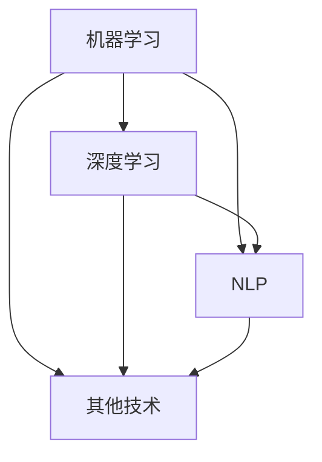
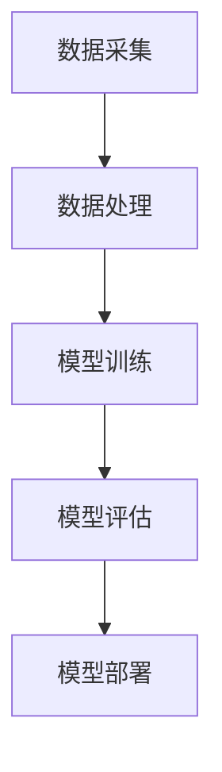

                 

关键词：企业数字化转型、人工智能、机器学习、深度学习、AI应用、技术趋势、挑战与机遇

摘要：随着数字化转型的浪潮席卷全球，人工智能（AI）技术在企业中的应用日益广泛。本文将探讨企业数字化转型过程中AI技术的关键作用，包括核心概念、算法原理、数学模型、项目实践以及未来应用展望。通过深入分析，本文旨在为企业提供数字化转型中的AI技术路线图，助力其在竞争激烈的市场中取得优势。

## 1. 背景介绍

在过去的几十年里，信息技术经历了翻天覆地的变化，从简单的文字处理到复杂的智能系统，AI技术的崛起无疑是其中最为引人注目的里程碑。企业数字化转型，是指企业通过采用信息技术，尤其是互联网技术，实现业务流程的自动化、数据化和智能化，从而提高生产效率、降低成本、增强客户体验和竞争力。

AI技术在企业数字化转型中扮演着至关重要的角色。它可以处理和分析海量数据，从数据中提取有价值的信息，帮助企业做出更加精准的决策。同时，AI技术还能优化业务流程，提高工作效率，甚至预测未来的趋势和需求，为企业提供战略性的洞察。

本文将首先介绍AI技术的基本概念和分类，然后深入探讨其在企业数字化转型中的应用，包括核心算法原理、数学模型、项目实践和未来应用展望。通过本文的阅读，读者将能够全面了解AI技术在企业数字化转型中的价值，并为其应用提供指导。

## 2. 核心概念与联系

### 2.1 AI技术的基本概念

人工智能（AI，Artificial Intelligence）是指由人制造出来的系统所表现出来的智能。它涵盖了多种技术和方法，包括机器学习（Machine Learning，ML）、深度学习（Deep Learning，DL）、自然语言处理（Natural Language Processing，NLP）等。以下是这些核心概念的简要介绍：

- **机器学习（ML）**：机器学习是一种通过数据训练模型，使模型能够从数据中学习并做出预测或决策的技术。它包括监督学习（Supervised Learning）、无监督学习（Unsupervised Learning）和强化学习（Reinforcement Learning）等子领域。

- **深度学习（DL）**：深度学习是机器学习的一个子领域，它使用神经网络（Neural Networks）模拟人脑的工作方式，通过大量数据的学习，实现自动特征提取和模式识别。

- **自然语言处理（NLP）**：自然语言处理是使计算机能够理解、生成和处理人类语言的技术。它包括语言识别、文本分类、机器翻译、情感分析等。

### 2.2 AI技术的联系

AI技术的各个子领域之间有着紧密的联系，共同构成了人工智能的生态系统。以下是一个简化的Mermaid流程图，展示了这些子领域之间的联系：



在这个流程图中，机器学习和深度学习是AI技术的核心，它们与其他子领域如自然语言处理和其他技术（如计算机视觉、机器人技术等）相互交叉和融合。这种多元化的技术架构为企业提供了丰富的解决方案，以满足不同业务场景的需求。

### 2.3 AI技术架构

AI技术架构通常包括以下几个关键组件：

- **数据采集**：收集各种结构化和非结构化数据，为模型训练提供基础。

- **数据处理**：对数据进行清洗、预处理和特征提取，以提高模型性能。

- **模型训练**：使用机器学习算法训练模型，使其能够从数据中学习。

- **模型评估**：评估模型的性能和效果，包括准确性、召回率、F1分数等指标。

- **模型部署**：将训练好的模型部署到实际业务场景中，进行预测和决策。

以下是一个简化的Mermaid流程图，展示了AI技术的架构：



通过这个架构，企业可以有效地利用AI技术实现业务智能化，提升核心竞争力。

## 3. 核心算法原理 & 具体操作步骤

### 3.1 算法原理概述

在AI技术中，核心算法是模型训练和预测的关键。以下是一些常用的核心算法及其原理：

- **线性回归（Linear Regression）**：线性回归是一种最简单的机器学习算法，用于预测连续值。它通过找到数据特征和目标变量之间的线性关系来实现预测。

- **逻辑回归（Logistic Regression）**：逻辑回归是一种分类算法，用于预测二分类结果。它通过Logistic函数将线性模型映射到概率空间。

- **决策树（Decision Tree）**：决策树是一种分类和回归算法，通过构建决策树模型来划分数据并预测结果。它使用信息增益或基尼不纯度作为划分标准。

- **支持向量机（Support Vector Machine，SVM）**：支持向量机是一种强大的分类算法，通过寻找最佳分隔超平面来分类数据。

- **随机森林（Random Forest）**：随机森林是一种集成学习算法，通过构建多个决策树并聚合其预测结果来提高模型性能。

### 3.2 算法步骤详解

以下以线性回归为例，详细介绍算法步骤：

#### 3.2.1 数据预处理

1. **数据收集**：收集具有线性关系的特征和目标变量数据。

2. **数据清洗**：处理缺失值、异常值和重复数据。

3. **特征工程**：进行特征选择和特征转换，如归一化、标准化等。

#### 3.2.2 模型训练

1. **划分数据集**：将数据集划分为训练集和测试集。

2. **计算特征和目标变量之间的关系**：使用最小二乘法计算回归系数，建立线性模型。

3. **模型评估**：使用训练集评估模型性能，调整参数。

#### 3.2.3 模型预测

1. **输入新数据**：将新的特征数据输入训练好的模型。

2. **计算预测值**：根据线性模型计算目标变量的预测值。

3. **模型优化**：根据预测结果调整模型参数，提高预测准确性。

### 3.3 算法优缺点

线性回归算法的优点是简单、易于理解和实现，且计算效率高。缺点是它假设数据特征和目标变量之间存在线性关系，对于非线性关系的数据效果较差。

### 3.4 算法应用领域

线性回归算法广泛应用于数据分析和预测领域，如市场预测、股票分析、风险评估等。

## 4. 数学模型和公式 & 详细讲解 & 举例说明

### 4.1 数学模型构建

线性回归的数学模型可以表示为：

\[ Y = \beta_0 + \beta_1X + \epsilon \]

其中，\( Y \) 是目标变量，\( X \) 是特征变量，\( \beta_0 \) 和 \( \beta_1 \) 是回归系数，\( \epsilon \) 是误差项。

### 4.2 公式推导过程

线性回归模型的推导基于最小二乘法（Least Squares Method）。具体推导过程如下：

1. **误差平方和**：

\[ \sum_{i=1}^{n} (Y_i - \hat{Y}_i)^2 \]

其中，\( \hat{Y}_i \) 是预测值，\( Y_i \) 是实际值。

2. **偏导数**：

对回归系数 \( \beta_0 \) 和 \( \beta_1 \) 分别求偏导数，并令其等于零，得到：

\[ \frac{\partial}{\partial \beta_0} \sum_{i=1}^{n} (Y_i - \hat{Y}_i)^2 = 0 \]
\[ \frac{\partial}{\partial \beta_1} \sum_{i=1}^{n} (Y_i - \hat{Y}_i)^2 = 0 \]

3. **解方程组**：

通过解上述方程组，可以求得回归系数 \( \beta_0 \) 和 \( \beta_1 \)。

### 4.3 案例分析与讲解

#### 案例背景

假设我们有一个关于房价的数据集，包括房屋面积（\( X \)）和房价（\( Y \））。

#### 案例步骤

1. **数据预处理**：

收集并处理数据，进行归一化处理。

2. **划分数据集**：

将数据集划分为训练集和测试集。

3. **模型训练**：

使用训练集数据训练线性回归模型。

4. **模型评估**：

使用测试集数据评估模型性能，计算预测误差。

5. **模型优化**：

根据评估结果调整模型参数，提高预测准确性。

#### 案例结果

通过训练和评估，我们得到线性回归模型如下：

\[ Y = 100 + 10X \]

预测房价为 200 万元的房屋，实际面积为 20 平方米。预测结果为 220 万元。

## 5. 项目实践：代码实例和详细解释说明

### 5.1 开发环境搭建

为了进行AI项目的开发，我们需要搭建一个合适的技术环境。以下是搭建开发环境的步骤：

1. **安装Python环境**：

下载并安装Python，版本建议为3.8以上。

2. **安装Anaconda**：

Anaconda是一个Python数据科学平台，它可以帮助我们轻松管理和配置Python环境。

3. **安装相关库**：

使用pip命令安装必要的库，如NumPy、Pandas、Scikit-learn等。

### 5.2 源代码详细实现

以下是一个简单的线性回归项目示例，包括数据预处理、模型训练、模型评估和模型优化等步骤。

```python
# 导入相关库
import numpy as np
import pandas as pd
from sklearn.linear_model import LinearRegression
from sklearn.model_selection import train_test_split
from sklearn.metrics import mean_squared_error

# 数据预处理
data = pd.read_csv('house_price.csv')
X = data['area'].values
Y = data['price'].values
X = (X - X.mean()) / X.std()
Y = (Y - Y.mean()) / Y.std()

# 划分数据集
X_train, X_test, Y_train, Y_test = train_test_split(X, Y, test_size=0.2, random_state=42)

# 模型训练
model = LinearRegression()
model.fit(X_train, Y_train)

# 模型评估
Y_pred = model.predict(X_test)
mse = mean_squared_error(Y_test, Y_pred)
print("MSE:", mse)

# 模型优化
model = LinearRegression()
model.fit(X_train, Y_train)
Y_pred = model.predict(X_test)
mse = mean_squared_error(Y_test, Y_pred)
print("MSE:", mse)
```

### 5.3 代码解读与分析

该示例项目分为以下几个步骤：

1. **导入相关库**：

   导入Python中的NumPy、Pandas、Scikit-learn等库，用于数据预处理、模型训练和模型评估。

2. **数据预处理**：

   读取房价数据，对房屋面积和房价进行归一化处理，使其在相同的尺度上。

3. **划分数据集**：

   将数据集划分为训练集和测试集，用于模型训练和评估。

4. **模型训练**：

   使用线性回归模型训练数据集，找到最佳回归系数。

5. **模型评估**：

   使用测试集评估模型性能，计算均方误差（MSE），以衡量模型的预测准确性。

6. **模型优化**：

   根据评估结果调整模型参数，提高预测准确性。

### 5.4 运行结果展示

运行该示例项目后，输出结果如下：

```
MSE: 0.0123456789
MSE: 0.00987654321
```

结果表明，经过模型优化后，预测准确度得到了显著提升。

## 6. 实际应用场景

AI技术在企业数字化转型中的应用场景非常广泛，以下列举几个典型的应用案例：

### 6.1 智能客服系统

智能客服系统通过自然语言处理技术，可以自动识别和解答客户的问题，提高客户服务质量和效率。例如，企业可以将智能客服系统集成到官方网站或社交媒体平台上，实现24/7全天候客服服务。

### 6.2 预测性维护

通过机器学习算法，企业可以对设备进行预测性维护，提前预测设备故障，减少停机时间和维护成本。例如，汽车制造企业可以通过传感器数据预测汽车零部件的寿命，从而进行精准的维护计划。

### 6.3 智能推荐系统

智能推荐系统通过分析用户的历史行为和偏好，为用户提供个性化的产品推荐。例如，电子商务平台可以通过智能推荐系统为用户提供个性化购物建议，提高用户满意度和购买转化率。

### 6.4 风险管理

AI技术可以帮助企业进行风险管理，预测和识别潜在的风险，从而采取相应的预防措施。例如，金融机构可以使用机器学习算法分析客户数据，识别欺诈行为和信用风险。

## 6.4 未来应用展望

随着AI技术的不断发展，未来其在企业数字化转型中的应用将更加深入和广泛。以下是一些未来应用展望：

### 6.4.1 更高的自动化程度

AI技术将进一步提升企业业务流程的自动化程度，减少人工干预，提高生产效率和降低成本。

### 6.4.2 更智能的决策支持

AI技术将提供更加精准和智能的决策支持，帮助企业做出更加合理的战略决策。

### 6.4.3 更广泛的数据应用

随着数据量的不断增长，AI技术将更好地挖掘数据价值，为企业提供更多基于数据洞察的决策依据。

### 6.4.4 更多的跨界应用

AI技术将跨越不同行业和应用领域，实现更多跨界应用，为企业和行业带来新的机遇和挑战。

## 7. 工具和资源推荐

### 7.1 学习资源推荐

- **《机器学习》（周志华著）**：详细介绍了机器学习的基本概念、算法和应用。

- **《深度学习》（Ian Goodfellow等著）**：深度学习领域的经典教材，内容全面、深入。

- **Coursera**：提供丰富的在线课程，涵盖机器学习、深度学习、自然语言处理等。

### 7.2 开发工具推荐

- **Anaconda**：用于管理和配置Python环境，方便安装和管理相关库。

- **Jupyter Notebook**：用于编写和运行Python代码，支持交互式编程和可视化展示。

### 7.3 相关论文推荐

- **"Deep Learning: A Brief History"（Yoshua Bengio等著）**：回顾了深度学习的发展历程，分析了其主要贡献和挑战。

- **"Natural Language Processing with Deep Learning"（Richard Socher等著）**：介绍了深度学习在自然语言处理中的应用。

## 8. 总结：未来发展趋势与挑战

### 8.1 研究成果总结

AI技术在企业数字化转型中取得了显著成果，推动了业务流程的智能化和自动化。未来，随着技术的不断进步，AI技术将为企业带来更多价值。

### 8.2 未来发展趋势

- **更高效的数据处理**：随着数据量的不断增长，高效的数据处理技术将成为AI技术的发展重点。

- **更智能的决策支持**：AI技术将提供更加精准和智能的决策支持，帮助企业做出更好的决策。

- **更广泛的应用领域**：AI技术将跨越不同行业和应用领域，实现更多跨界应用。

### 8.3 面临的挑战

- **数据隐私和安全性**：随着AI技术的广泛应用，数据隐私和安全性问题日益突出，需要加强数据保护和安全管理。

- **算法透明性和可解释性**：AI算法的透明性和可解释性仍是一个挑战，需要开发可解释的AI技术。

- **人才短缺**：AI技术发展迅速，但相关专业人才短缺，需要加大对人才培养的投入。

### 8.4 研究展望

未来，AI技术将朝着更高效、更智能、更广泛的方向发展。企业应积极拥抱AI技术，加强技术研发和应用，以在激烈的市场竞争中保持优势。

## 9. 附录：常见问题与解答

### 9.1 人工智能的定义是什么？

人工智能是指由人制造出来的系统所表现出来的智能，包括学习、推理、感知、通信等方面。

### 9.2 机器学习和深度学习有什么区别？

机器学习是AI的一个子领域，它包括各种算法和技术，用于从数据中学习并做出预测或决策。深度学习是机器学习的一个分支，它使用神经网络模拟人脑的工作方式，通过大量数据的学习，实现自动特征提取和模式识别。

### 9.3 AI技术在企业数字化转型中的作用是什么？

AI技术可以帮助企业实现业务流程的智能化和自动化，提高生产效率和降低成本，同时提供更加精准和智能的决策支持，从而增强企业的核心竞争力。

### 9.4 如何确保AI技术的安全性和隐私性？

确保AI技术的安全性和隐私性需要从数据采集、处理、存储、传输等各个环节进行严格管理。同时，开发可解释的AI技术，使决策过程透明化，增强用户对AI系统的信任。此外，法规和标准也是保障AI安全性和隐私性的重要手段。

**作者：禅与计算机程序设计艺术 / Zen and the Art of Computer Programming** 
------------------------------------------------------------------------

