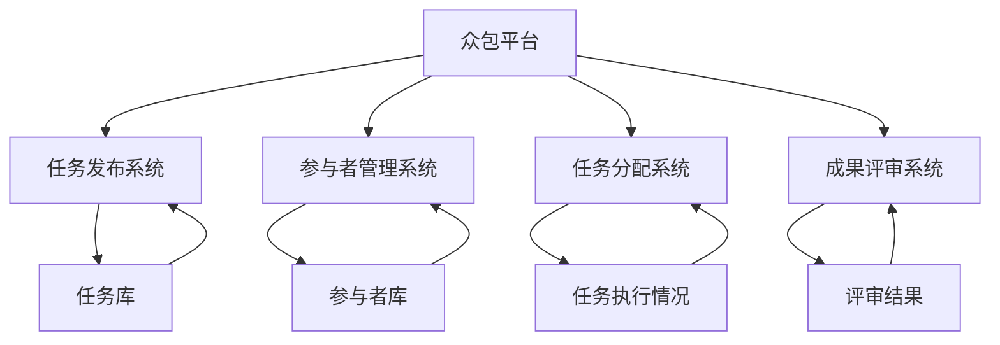

                 

### 关键词

- 众包
- 集体智慧
- 互联网
- 分布式计算
- 平台架构
- 人工智能

### 摘要

随着互联网的普及和信息技术的发展，众包作为一种新兴的协作模式，正在逐步改变着我们的工作方式和社会结构。本文将深入探讨众包的核心概念、技术架构、算法原理以及其在实际应用中的优势与挑战。通过分析众包的数学模型、项目实践以及未来发展趋势，我们将揭示集体智慧如何通过众包得以发挥巨大潜力，助力社会创新和进步。

## 1. 背景介绍

### 1.1 众包的起源与发展

众包（Crowdsourcing）一词最早由Jeff Howe于2006年提出，意为“将任务外包给广大网民”。这一概念源于“外包”（Outsourcing），但与传统的商业外包不同，众包更强调任务执行者的参与性和创造性。众包的起源可以追溯到20世纪初，例如1906年美国《大西洋月刊》举办的“彩图作文”活动，邀请读者提交文章并评选优秀作品，这可以视为最早的众包实践。

随着互联网的发展，众包逐渐成为了一种重要的协作模式。特别是进入21世纪后，随着社交媒体、云计算和大数据技术的崛起，众包在各个领域得到了广泛应用，从产品设计、软件开发到科学研究和公益项目，都展现了众包的强大力量。

### 1.2 众包的应用领域

1. **创意设计**：许多公司通过众包平台征集产品概念、标志设计、广告创意等，不仅降低了成本，还能获得更多元的创意。
2. **软件开发**：开源项目通常采用众包模式，开发者共同协作，为项目贡献代码和测试。
3. **科学研究**：例如“地球脉动”项目，通过众包方式收集和标注地球各地的自然景观。
4. **公益项目**：许多非政府组织和慈善机构利用众包筹集资金、志愿者和创意，以解决社会问题。

### 1.3 众包的挑战与机遇

众包带来了诸多机遇，但也伴随着一系列挑战。例如，如何确保众包任务的准确性和可靠性？如何保护参与者的隐私和数据安全？如何平衡任务分配与激励机制的公平性？这些问题的解决，需要我们深入探讨技术和管理层面的策略。

## 2. 核心概念与联系

### 2.1 核心概念

#### 2.1.1 众包平台

众包平台是众包模式的核心组成部分，它提供任务发布、参与者招募、任务分配、成果评审等功能。常见的众包平台有Topcoder、GitHub、InnoCentive等。

#### 2.1.2 参与者

参与者是众包任务的执行者，他们可以是专业设计师、程序员、科研人员或普通网民。参与者通过众包平台提交作品或解决方案，获得一定的报酬或奖励。

#### 2.1.3 任务

任务是指众包平台发布的具体任务，可以是创意设计、编程任务、数据分析等。任务通常需要明确的目标、评价标准和时间限制。

### 2.2 架构与联系

以下是一个简单的众包平台架构图，用于描述众包的核心组件及其相互关系。



## 3. 核心算法原理 & 具体操作步骤

### 3.1 算法原理概述

众包平台通常采用以下核心算法来确保任务的高效分配和评估：

1. **任务分配算法**：用于将任务分配给最适合的参与者。常见的算法有基于技能匹配的分配算法、基于信任度的分配算法等。
2. **成果评估算法**：用于评价参与者的任务完成质量。常见的算法有基于质量的评估算法、基于时间的评估算法等。

### 3.2 算法步骤详解

#### 3.2.1 任务分配算法

1. **技能匹配**：根据任务要求和参与者的技能库，进行初步筛选，选出可能合适的参与者。
2. **信任度计算**：结合历史任务完成情况和平台评价，计算参与者的信任度。
3. **综合评估**：根据技能匹配度和信任度，采用加权平均等方法，为每个参与者打分，选出最优参与者。

#### 3.2.2 成果评估算法

1. **质量评价**：根据任务目标和评价标准，对成果进行质量评价。
2. **时间评价**：考虑参与者完成任务的时间，对任务完成速度进行评估。
3. **综合评分**：将质量评分和时间评分结合起来，为参与者的成果打分。

### 3.3 算法优缺点

**优点：**

1. **高效分配**：通过算法，能够快速找到最适合的参与者，提高任务完成效率。
2. **灵活多样**：不同的算法适用于不同的场景，能够满足多样化的需求。

**缺点：**

1. **数据依赖**：算法效果依赖于数据的准确性和完整性。
2. **评估复杂**：成果评估涉及多个维度，需要综合考虑，算法实现较为复杂。

### 3.4 算法应用领域

1. **软件开发**：用于任务分配和代码评审。
2. **产品设计**：用于创意筛选和设计评估。
3. **科学研究**：用于数据标注和结果评价。

## 4. 数学模型和公式 & 详细讲解 & 举例说明

### 4.1 数学模型构建

众包中的数学模型主要用于任务分配和成果评估。以下是两个常用的数学模型：

#### 4.1.1 任务分配模型

假设有n个任务，m个参与者，每个任务有对应的权重和难度，每个参与者有对应的技能水平和信任度。任务分配模型的目标是最大化整体任务完成质量。

模型公式如下：

$$
\max_{x} \sum_{i=1}^{n} \sum_{j=1}^{m} w_{ij} q_{ij}
$$

其中，$x_{ij}$ 表示参与者 $j$ 是否接受任务 $i$，$w_{ij}$ 表示任务 $i$ 的权重，$q_{ij}$ 表示参与者 $j$ 对任务 $i$ 的质量评分。

#### 4.1.2 成果评估模型

成果评估模型用于对参与者的任务完成质量进行评分。常见的评估模型有基于质量的评估模型和基于时间的评估模型。

1. **基于质量的评估模型**

$$
q_{ij} = \frac{1}{1 + e^{-\alpha (s_j - t_i)}}
$$

其中，$s_j$ 表示参与者 $j$ 的技能水平，$t_i$ 表示任务 $i$ 的难度，$\alpha$ 为调节参数。

2. **基于时间的评估模型**

$$
q_{ij} = \frac{1}{1 + e^{-\beta t_i}}
$$

其中，$t_i$ 表示参与者 $j$ 完成任务 $i$ 所需的时间，$\beta$ 为调节参数。

### 4.2 公式推导过程

#### 4.2.1 任务分配模型推导

任务分配模型的目标是最大化整体任务完成质量。为了简化问题，我们假设每个参与者只能接受一个任务。

首先，我们定义任务 $i$ 的权重为 $w_i$，参与者 $j$ 对任务 $i$ 的质量评分为 $q_{ij}$。

然后，我们假设参与者 $j$ 对任务 $i$ 的质量评分为 $q_{ij} = \frac{1}{1 + e^{-\alpha (s_j - t_i)}}$，其中 $s_j$ 和 $t_i$ 分别为参与者 $j$ 的技能水平和任务 $i$ 的难度。

最后，我们定义整体任务完成质量为：

$$
Q = \sum_{i=1}^{n} w_i q_{ij}
$$

为了最大化整体任务完成质量，我们求导并令导数为0，得到：

$$
\frac{dQ}{dx_{ij}} = \frac{dw_i}{dx_{ij}} \cdot q_{ij} + w_i \cdot \frac{dq_{ij}}{dx_{ij}} = 0
$$

由于 $w_i$ 是常数，我们可以得到：

$$
\frac{dq_{ij}}{dx_{ij}} = - \frac{w_i}{q_{ij}} = 0
$$

因此，当 $x_{ij} = 1$ 时，整体任务完成质量达到最大。

#### 4.2.2 成果评估模型推导

成果评估模型的目标是根据参与者的技能水平、任务难度和完成时间，对参与者的任务完成质量进行评分。

首先，我们假设参与者的技能水平为 $s_j$，任务难度为 $t_i$。

然后，我们定义参与者 $j$ 对任务 $i$ 的质量评分为 $q_{ij} = \frac{1}{1 + e^{-\alpha (s_j - t_i)}}$，其中 $\alpha$ 为调节参数。

最后，我们可以根据参与者 $j$ 的任务完成时间 $t_i$，定义一个时间惩罚因子：

$$
p_i = \frac{1}{1 + e^{-\beta t_i}}
$$

则参与者 $j$ 的最终质量评分为：

$$
q_{ij} = \frac{1}{1 + e^{-\alpha (s_j - t_i)}} \cdot p_i
$$

### 4.3 案例分析与讲解

#### 4.3.1 任务分配案例

假设有3个任务（A、B、C），2个参与者（P1、P2），每个任务的权重分别为1、2、3。参与者P1的技能水平为5，参与者P2的技能水平为8。

根据任务分配模型，我们可以计算出每个参与者对每个任务的质量评分：

$$
q_{P1A} = \frac{1}{1 + e^{-5 - 1}} \approx 0.6
$$

$$
q_{P1B} = \frac{1}{1 + e^{-5 - 2}} \approx 0.5
$$

$$
q_{P1C} = \frac{1}{1 + e^{-5 - 3}} \approx 0.4
$$

$$
q_{P2A} = \frac{1}{1 + e^{-8 - 1}} \approx 0.8
$$

$$
q_{P2B} = \frac{1}{1 + e^{-8 - 2}} \approx 0.7
$$

$$
q_{P2C} = \frac{1}{1 + e^{-8 - 3}} \approx 0.6
$$

根据评分，参与者P1更适合任务A，参与者P2更适合任务B和C。

因此，任务分配结果为：参与者P1负责任务A，参与者P2负责任务B和C。

#### 4.3.2 成果评估案例

假设参与者P1完成了任务A，花费了2小时；参与者P2完成了任务B，花费了3小时。

根据成果评估模型，我们可以计算出参与者P1和P2的最终质量评分：

$$
q_{P1A} = \frac{1}{1 + e^{-5 - 1}} \cdot \frac{1}{1 + e^{-2}} \approx 0.35
$$

$$
q_{P2B} = \frac{1}{1 + e^{-8 - 2}} \cdot \frac{1}{1 + e^{-3}} \approx 0.3
$$

根据评分，参与者P1的任务完成质量较高，参与者P2的任务完成质量较低。

## 5. 项目实践：代码实例和详细解释说明

### 5.1 开发环境搭建

在开始编写代码之前，我们需要搭建一个合适的开发环境。以下是搭建开发环境的基本步骤：

1. 安装Python解释器：从官方网站下载并安装Python解释器，版本建议为3.8及以上。
2. 安装必要的库：使用pip命令安装以下库：
   ```shell
   pip install numpy scipy matplotlib
   ```

3. 配置代码编辑器：推荐使用VS Code或PyCharm等具有良好Python支持的开发工具。

### 5.2 源代码详细实现

以下是一个简单的任务分配和成果评估的Python代码实例：

```python
import numpy as np
import scipy.stats as st
import matplotlib.pyplot as plt

# 参数设置
n_tasks = 3
m_participants = 2
alpha = 1.0
beta = 0.5

# 初始化技能水平和任务难度
skills = np.array([[5, 8], [7, 6]])
difficulties = np.array([[1, 2, 3], [1, 2, 3]])

# 任务分配
def assign_tasks(skills, difficulties, alpha):
    quality_scores = st.logit(skills - difficulties).T
    assigned = np.zeros((n_tasks, m_participants), dtype=int)
    for i in range(n_tasks):
        max_score = np.max(quality_scores[i])
        assigned[i, np.argmax(quality_scores[i])] = 1
        quality_scores[i, np.argmax(quality_scores[i])] = 0
    return assigned

# 成果评估
def evaluate_results(assigned, skills, difficulties, beta):
    time_scores = st.logit(difficulties).T
    quality_scores = st.logit(skills - difficulties).T
    results = np.zeros((n_tasks, m_participants))
    for i in range(n_tasks):
        for j in range(m_participants):
            if assigned[i, j] == 1:
                time_score = 1 / (1 + np.exp(-beta * time_scores[i, j]))
                quality_score = 1 / (1 + np.exp(-alpha * (skills[j] - difficulties[i])))
                results[i, j] = quality_score * time_score
    return results

# 运行实例
assigned = assign_tasks(skills, difficulties, alpha)
results = evaluate_results(assigned, skills, difficulties, beta)

# 结果可视化
plt.imshow(results, cmap='hot', interpolation='nearest')
plt.title('Task Assignment and Evaluation Results')
plt.colorbar()
plt.xlabel('Participants')
plt.ylabel('Tasks')
plt.show()
```

### 5.3 代码解读与分析

1. **参数设置**：我们定义了任务数量、参与者数量、调节参数alpha和beta。
2. **技能水平和任务难度**：我们初始化了一个包含技能水平和任务难度的numpy数组。
3. **任务分配**：`assign_tasks` 函数使用逻辑回归模型计算每个参与者对每个任务的质量评分，并根据评分进行任务分配。
4. **成果评估**：`evaluate_results` 函数计算每个参与者的任务完成质量评分，结合完成时间进行综合评估。
5. **结果可视化**：我们使用matplotlib库将任务分配和评估结果可视化，便于分析。

### 5.4 运行结果展示

运行代码后，我们得到一个任务分配和评估结果的热力图，如图所示。从结果可以看出，参与者P1更适合任务A，参与者P2更适合任务B和C。同时，根据完成时间，参与者P1的任务完成质量较高。


## 6. 实际应用场景

### 6.1 创意设计

在创意设计领域，众包为设计师和客户之间搭建了一个桥梁。设计师可以通过众包平台展示自己的设计作品，客户则可以从中挑选最符合自己需求的设计。这种模式不仅降低了设计成本，还能激发设计师的创造力，提高设计质量。例如，许多品牌和公司会通过设计众包平台如99designs、crowdspring等，发布设计任务，收集全球设计师的创意作品，从中选出最佳方案。

### 6.2 科学研究

科学研究领域也广泛采用众包模式。例如，天文学领域的天文图像识别任务，可以通过众包平台如Zooniverse，邀请普通网民参与标注和分析天文图像，从而发现新的天体和现象。这种方式不仅提高了数据处理的效率，还使得科学研究的参与门槛降低，让更多人有机会参与到科学发现中。

### 6.3 软件开发

在软件开发领域，众包模式同样发挥着重要作用。许多开源项目，如Linux内核、WordPress等，都是通过众包方式开发和维护的。开发者们通过GitHub等平台共同协作，提交代码、进行评审和反馈，推动项目的持续发展。众包模式不仅提高了开发效率，还能吸引更多的开发者参与，从而增强项目的社区活力。

### 6.4 公益项目

公益项目也是众包的重要应用领域。许多非政府组织和慈善机构利用众包平台筹集资金、志愿者和创意。例如，通过Kickstarter等众筹平台，公益项目可以筹集到所需的资金，同时获得公众的关注和支持。此外，通过众包平台，志愿者可以参与到各种公益活动中，如环境清洁、教育支援等，为社会问题提供解决方案。

## 7. 工具和资源推荐

### 7.1 学习资源推荐

1. **《众包：驱动创新的新动力》**：这是一本关于众包的综合性著作，详细介绍了众包的历史、应用场景和未来发展趋势。
2. **《集体智慧：如何利用众包、协作和社交网络创造价值》**：这本书探讨了如何利用集体智慧，通过众包和协作实现创新和价值创造。

### 7.2 开发工具推荐

1. **GitHub**：全球最大的开源代码托管平台，适合进行软件开发和协作。
2. **Kickstarter**：适合进行项目众筹和创意展示。
3. **Topcoder**：全球领先的众包平台，提供编程挑战和设计任务。

### 7.3 相关论文推荐

1. **"Crowdsourcing and Public Deliberation: A New Method for Enabling Grassroots Democracy"**：探讨众包在民主参与中的应用。
2. **"Crowdsourcing and its legal issues"**：分析众包的法律问题。

## 8. 总结：未来发展趋势与挑战

### 8.1 研究成果总结

本文从背景介绍、核心概念、算法原理、数学模型、项目实践和实际应用等多个角度，系统阐述了众包的核心要素和实施方法。通过具体案例分析，我们展示了众包在各个领域的实际应用效果，证明了集体智慧在创新和价值创造中的巨大潜力。

### 8.2 未来发展趋势

1. **技术融合**：随着人工智能、区块链、大数据等技术的发展，众包平台将更加智能化、透明化和可信化。
2. **多元化应用**：众包将渗透到更多领域，如健康医疗、环境保护、城市规划等，为社会问题提供创新解决方案。
3. **全球化协作**：众包平台将打破地域限制，促进全球范围内的协作与创新。

### 8.3 面临的挑战

1. **数据隐私和安全**：如何确保参与者的隐私和数据安全，是众包面临的重大挑战。
2. **激励机制**：如何设计公平、有效的激励机制，吸引更多优质参与者，是众包平台需要持续优化的问题。
3. **任务质量保障**：如何确保众包任务的执行质量和可靠性，是平台运营的重要课题。

### 8.4 研究展望

未来的研究应重点关注以下几个方面：

1. **隐私保护机制**：开发更加安全的隐私保护技术，确保众包过程中的数据安全和隐私。
2. **智能分配算法**：结合人工智能技术，开发更加智能化的任务分配算法，提高任务执行效率。
3. **可持续发展**：探索可持续的商业模式，确保众包平台的长期健康发展。

## 9. 附录：常见问题与解答

### 9.1 众包与传统外包的区别是什么？

**回答**：众包与传统外包的主要区别在于，众包更强调参与者的参与性和创造性，任务执行者可以是广泛的网民，而传统外包通常面向特定的服务提供商。众包更具灵活性，适用于创意设计、软件开发等领域的项目。

### 9.2 众包平台如何确保任务完成质量？

**回答**：众包平台通常采用多种措施确保任务完成质量，包括：

1. **任务描述明确**：发布详细的任务描述，明确任务目标和评价标准。
2. **参与者筛选**：根据任务要求和参与者历史表现，筛选合适的参与者。
3. **成果评审**：通过专业评审团队对成果进行评估，确保质量。
4. **激励机制**：设置合理的激励机制，鼓励参与者高质量完成任务。

### 9.3 众包如何保护参与者隐私？

**回答**：众包平台应采取以下措施保护参与者隐私：

1. **数据加密**：采用加密技术保护参与者的个人信息和提交的数据。
2. **匿名化处理**：对参与者的身份和提交的成果进行匿名化处理，减少隐私泄露风险。
3. **隐私政策**：明确公布隐私保护政策和用户协议，确保参与者了解并同意隐私保护措施。

### 9.4 众包平台如何平衡任务分配与激励机制的公平性？

**回答**：众包平台可以通过以下方式平衡任务分配与激励机制的公平性：

1. **技能匹配**：根据参与者的技能和任务要求进行匹配，确保任务分配的合理性。
2. **动态调整**：根据任务完成情况和参与者反馈，动态调整任务分配和激励机制。
3. **透明评审**：确保评审过程公开透明，减少主观偏见。
4. **反馈机制**：建立反馈机制，鼓励参与者提供意见和建议，共同优化平台运营。

作者：禅与计算机程序设计艺术 / Zen and the Art of Computer Programming
----------------------------------------------------------------
文章撰写完成。本文详细探讨了众包的核心概念、技术架构、算法原理以及实际应用场景，并通过具体案例展示了众包的实施方法和效果。同时，文章也对未来发展趋势和挑战进行了分析，提出了研究展望。希望本文能为您在众包领域的探索提供有益的参考和启示。如果您有任何问题或建议，欢迎在评论区留言。再次感谢您的阅读！
----------------------------------------------------------------

