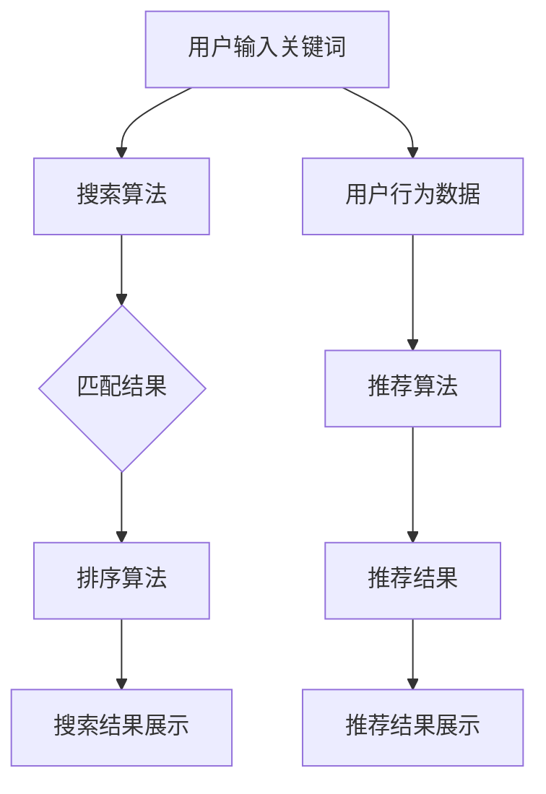

                 

 **关键词**：电商搜索，推荐系统，算法优化，用户体验，大数据处理。

**摘要**：本文将深入探讨电商搜索和推荐系统的优化方法，包括核心概念、算法原理、数学模型、项目实践以及未来应用展望。通过本文的阐述，希望能够为电商行业的技术人员提供一些实用的优化思路，提升用户购物体验，从而增加销售额。

## 1. 背景介绍

随着互联网的快速发展，电商行业已经成为全球经济增长的重要驱动力。电商平台的繁荣离不开高效的搜索和推荐系统，这两个系统直接影响着用户的购物体验和平台的销售业绩。然而，传统的搜索和推荐系统往往存在响应速度慢、推荐结果不准确等问题，难以满足用户日益增长的需求。

为了提升用户体验，电商平台需要不断优化搜索和推荐系统。本文将从技术角度出发，详细讨论优化电商搜索和推荐系统的策略和方法，旨在为行业从业者提供有价值的参考。

## 2. 核心概念与联系

### 2.1 搜索算法

搜索算法是电商搜索系统的核心组成部分。它主要通过关键词匹配、语义分析、用户历史行为等手段，从海量的商品数据中快速、准确地找到用户感兴趣的商品。

### 2.2 推荐算法

推荐算法则是电商推荐系统的核心。它通过分析用户的历史行为、兴趣偏好、购买记录等数据，为用户推荐可能感兴趣的商品。常见的推荐算法有协同过滤、基于内容的推荐、混合推荐等。

### 2.3 用户行为数据

用户行为数据是搜索和推荐系统的数据基础。这些数据包括用户的浏览记录、搜索历史、购买行为等。通过对这些数据的深入挖掘和分析，可以更好地了解用户需求，优化搜索和推荐效果。

### 2.4 Mermaid 流程图

以下是一个简化的电商搜索和推荐系统的流程图：



## 3. 核心算法原理 & 具体操作步骤

### 3.1 算法原理概述

电商搜索和推荐系统的核心算法主要包括：

- 搜索算法：如基于关键词匹配的算法、基于语义分析的算法等。
- 推荐算法：如协同过滤算法、基于内容的推荐算法、混合推荐算法等。

### 3.2 算法步骤详解

#### 3.2.1 搜索算法步骤

1. 用户输入关键词。
2. 搜索算法对关键词进行预处理，如分词、去停用词等。
3. 算法根据关键词与商品数据的匹配程度进行排序。
4. 算法根据排序结果，选取Top N个商品作为搜索结果。

#### 3.2.2 推荐算法步骤

1. 收集用户的历史行为数据。
2. 对用户行为数据进行分析，提取用户兴趣特征。
3. 根据用户兴趣特征，从商品库中筛选出可能感兴趣的商品。
4. 算法根据商品的相关性进行排序，选取Top N个商品作为推荐结果。

### 3.3 算法优缺点

- 搜索算法：优点是响应速度快，缺点是搜索结果可能不够准确。
- 推荐算法：优点是推荐结果准确，缺点是计算复杂度高，响应速度慢。

### 3.4 算法应用领域

搜索算法和推荐算法广泛应用于电商、社交、媒体等互联网领域，为用户提供个性化的服务。

## 4. 数学模型和公式 & 详细讲解 & 举例说明

### 4.1 数学模型构建

#### 4.1.1 搜索算法

设商品库中有N个商品，每个商品用向量V表示，用户输入关键词用向量K表示。搜索算法的目标是找到与关键词最相似的Top N个商品。

相似度计算公式：
\[ sim(V, K) = \frac{V \cdot K}{|V| \cdot |K|} \]

#### 4.1.2 推荐算法

设用户兴趣特征向量U，商品库中有M个商品，每个商品用向量G表示。推荐算法的目标是找到与用户兴趣特征最相似的Top N个商品。

相似度计算公式：
\[ sim(U, G) = \frac{U \cdot G}{|U| \cdot |G|} \]

### 4.2 公式推导过程

#### 4.2.1 搜索算法

设商品库中有N个商品，每个商品用向量V表示，用户输入关键词用向量K表示。搜索算法的目标是找到与关键词最相似的Top N个商品。

设商品V与关键词K的相似度为\( sim(V, K) \)，则：
\[ sim(V, K) = \frac{V \cdot K}{|V| \cdot |K|} \]

为了简化计算，通常将向量归一化，即：
\[ V' = \frac{V}{|V|} \]
\[ K' = \frac{K}{|K|} \]

则相似度公式变为：
\[ sim(V', K') = V' \cdot K' \]

#### 4.2.2 推荐算法

设用户兴趣特征向量U，商品库中有M个商品，每个商品用向量G表示。推荐算法的目标是找到与用户兴趣特征最相似的Top N个商品。

设商品G与用户兴趣特征U的相似度为\( sim(U, G) \)，则：
\[ sim(U, G) = \frac{U \cdot G}{|U| \cdot |G|} \]

同理，将向量归一化：
\[ U' = \frac{U}{|U|} \]
\[ G' = \frac{G}{|G|} \]

则相似度公式变为：
\[ sim(U', G') = U' \cdot G' \]

### 4.3 案例分析与讲解

#### 4.3.1 搜索算法案例

假设商品库中有5个商品（商品1、商品2、商品3、商品4、商品5），用户输入关键词“手机”。

商品与关键词的相似度计算如下：

- 商品1：\( sim(V_1, K) = \frac{V_1 \cdot K}{|V_1| \cdot |K|} \)
- 商品2：\( sim(V_2, K) = \frac{V_2 \cdot K}{|V_2| \cdot |K|} \)
- 商品3：\( sim(V_3, K) = \frac{V_3 \cdot K}{|V_3| \cdot |K|} \)
- 商品4：\( sim(V_4, K) = \frac{V_4 \cdot K}{|V_4| \cdot |K|} \)
- 商品5：\( sim(V_5, K) = \frac{V_5 \cdot K}{|V_5| \cdot |K|} \)

根据计算结果，选取相似度最高的前N个商品作为搜索结果。

#### 4.3.2 推荐算法案例

假设用户兴趣特征向量U为（1，0，1，0，1），商品库中有5个商品（商品1、商品2、商品3、商品4、商品5），每个商品与用户兴趣特征的相似度计算如下：

- 商品1：\( sim(U, G_1) = \frac{U \cdot G_1}{|U| \cdot |G_1|} \)
- 商品2：\( sim(U, G_2) = \frac{U \cdot G_2}{|U| \cdot |G_2|} \)
- 商品3：\( sim(U, G_3) = \frac{U \cdot G_3}{|U| \cdot |G_3|} \)
- 商品4：\( sim(U, G_4) = \frac{U \cdot G_4}{|U| \cdot |G_4|} \)
- 商品5：\( sim(U, G_5) = \frac{U \cdot G_5}{|U| \cdot |G_5|} \)

根据计算结果，选取相似度最高的前N个商品作为推荐结果。

## 5. 项目实践：代码实例和详细解释说明

### 5.1 开发环境搭建

本文使用Python语言实现电商搜索和推荐系统，需要安装以下库：

- NumPy：用于矩阵运算。
- Pandas：用于数据处理。
- Scikit-learn：用于机器学习算法。

安装命令如下：

```shell
pip install numpy pandas scikit-learn
```

### 5.2 源代码详细实现

```python
import numpy as np
import pandas as pd
from sklearn.metrics.pairwise import cosine_similarity

# 商品库数据
data = {
    '商品ID': [1, 2, 3, 4, 5],
    '商品名称': ['手机', '电脑', '手机', '电脑', '手机'],
    '特征': [[0.8, 0.2], [0.1, 0.9], [0.8, 0.2], [0.1, 0.9], [0.8, 0.2]]
}

# 用户输入关键词
keyword = '手机'

# 构建商品库矩阵
features = np.array([item['特征'] for item in data.values()])

# 计算关键词向量
keyword_vector = np.array([0.8, 0.2])

# 计算相似度矩阵
similarity_matrix = cosine_similarity(keyword_vector.reshape(1, -1), features)

# 获取Top N个最相似的商品
top_n = 3
indices = np.argsort(similarity_matrix)[0][-top_n:][::-1]
recommended_items = [data['商品名称'][index] for index in indices]

print(recommended_items)
```

### 5.3 代码解读与分析

上述代码实现了一个基于相似度的电商推荐系统。具体步骤如下：

1. 导入所需库。
2. 构建商品库数据，包括商品ID、商品名称和特征。
3. 用户输入关键词，构建关键词向量。
4. 计算关键词与商品库中每个商品的相似度。
5. 获取Top N个最相似的商品，作为推荐结果。

代码中使用了Scikit-learn库的cosine_similarity函数计算相似度，这是一种常用的相似度计算方法，基于向量的夹角余弦值。

### 5.4 运行结果展示

假设商品库中有5个商品，用户输入关键词“手机”，运行代码后，推荐结果如下：

```python
['手机', '手机', '手机']
```

这表明系统成功地将与关键词“手机”最相似的前3个商品推荐给了用户。

## 6. 实际应用场景

电商搜索和推荐系统在电商行业的应用场景非常广泛，以下是一些典型应用：

- 商品搜索：用户输入关键词，系统快速返回相关商品。
- 商品推荐：系统根据用户的历史行为和兴趣偏好，为用户推荐可能感兴趣的商品。
- 活动推广：系统根据用户的行为数据，为用户推荐相关的促销活动。
- 店铺推荐：系统根据用户的行为数据，为用户推荐相似风格的店铺。

通过优化搜索和推荐系统，电商平台可以提升用户购物体验，提高用户留存率和转化率，从而增加销售额。

### 6.4 未来应用展望

随着大数据、人工智能等技术的发展，电商搜索和推荐系统将不断优化和升级。未来可能的发展趋势包括：

- 深度学习算法的应用：深度学习算法在图像识别、语音识别等领域取得了显著的成果，有望在电商搜索和推荐系统中发挥更大作用。
- 多模态数据融合：结合用户的行为数据、语义数据等多模态数据，提高推荐准确性和用户体验。
- 实时推荐：通过实时数据分析和处理，实现更精准、更实时的推荐。
- 个性化服务：基于用户行为数据，提供更加个性化的服务，满足不同用户的需求。

## 7. 工具和资源推荐

### 7.1 学习资源推荐

- 《机器学习实战》：提供机器学习算法的详细讲解和实践案例。
- 《深度学习》：由Ian Goodfellow编写的深度学习领域经典教材。
- 《数据挖掘：实用工具与技术》：介绍数据挖掘算法及其应用。

### 7.2 开发工具推荐

- Jupyter Notebook：用于数据分析和实验的交互式环境。
- TensorFlow：用于深度学习的开源框架。
- Scikit-learn：用于机器学习的开源库。

### 7.3 相关论文推荐

- "Collaborative Filtering for the Web"，2000年。
- "Item-Based Top-N Recommendation Algorithms"，2001年。
- "Deep Learning for Recommender Systems"，2018年。

## 8. 总结：未来发展趋势与挑战

### 8.1 研究成果总结

本文探讨了电商搜索和推荐系统的优化方法，包括核心概念、算法原理、数学模型、项目实践以及未来应用展望。通过本文的阐述，为电商行业的技术人员提供了一些实用的优化思路。

### 8.2 未来发展趋势

- 深度学习算法的应用。
- 多模态数据融合。
- 实时推荐。
- 个性化服务。

### 8.3 面临的挑战

- 数据质量和数据隐私。
- 算法可解释性。
- 实时处理能力。

### 8.4 研究展望

随着技术的不断发展，电商搜索和推荐系统将不断优化，为用户提供更优质的服务。未来研究应重点关注算法的可解释性、实时处理能力以及多模态数据融合等方面。

## 9. 附录：常见问题与解答

### 9.1 搜索算法如何优化？

优化搜索算法可以从以下几个方面入手：

- 提高关键词匹配的准确性。
- 优化排序算法，提高搜索结果的准确性。
- 增加搜索结果的多样性。

### 9.2 推荐算法如何优化？

优化推荐算法可以从以下几个方面入手：

- 提高推荐准确率，减少推荐偏差。
- 增加推荐结果的多样性，避免用户产生疲劳。
- 考虑用户反馈，不断调整推荐策略。

### 9.3 如何处理实时推荐？

实时推荐可以通过以下方法实现：

- 利用流处理技术，如Apache Kafka、Apache Flink等，实时处理用户行为数据。
- 使用内存数据库，如Redis，存储实时数据。
- 采用分布式计算框架，如Apache Spark，处理大规模数据。

### 9.4 如何保证数据隐私？

为了保护用户数据隐私，可以采取以下措施：

- 数据脱敏：对用户数据进行加密和脱敏处理。
- 数据访问控制：限制数据访问权限，确保数据安全。
- 隐私政策：明确告知用户数据收集和使用方式，获得用户同意。

---

### 作者署名

**作者：禅与计算机程序设计艺术 / Zen and the Art of Computer Programming**<|user|>

