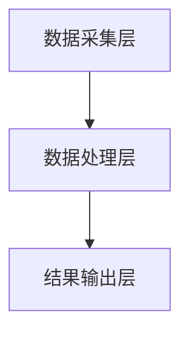

                 

作为人工智能领域的重要一环，传感器融合技术的核心目标是通过整合来自不同传感器的数据，提升数据精度，从而为各种应用提供更加可靠的决策支持。本文将深入探讨传感器融合的基本概念、核心算法、数学模型及其在现实世界的广泛应用。

## 关键词

传感器融合、多源数据集成、数据精度、人工智能应用

## 摘要

本文首先介绍了传感器融合的背景和重要性，然后详细解析了传感器融合的核心算法原理和具体操作步骤。接着，我们通过数学模型和公式，对算法进行了深入分析，并借助具体项目实践进行了代码实例和解读。文章最后探讨了传感器融合在实际应用场景中的表现，并对未来发展趋势与挑战进行了展望。

## 1. 背景介绍

传感器是获取外部信息的重要设备，广泛应用于机器人、无人驾驶、工业自动化等领域。然而，单一传感器在获取数据时往往存在误差，无法满足高精度要求。因此，传感器融合技术应运而生。传感器融合通过整合多个传感器的数据，相互补充，从而提高整体数据精度。

### 1.1 传感器融合的定义

传感器融合是指将来自不同类型传感器的数据进行综合处理，以获得更准确、更全面的信息。其基本原理是将多个传感器的数据通过一定的算法进行融合，消除个体传感器的误差，提取有用的信息。

### 1.2 传感器融合的重要性

传感器融合在提高数据精度、增强系统鲁棒性、降低系统复杂度等方面具有重要意义。具体体现在：

- **提高数据精度**：通过传感器融合，可以有效减少单一传感器的误差，提高整体数据精度。
- **增强系统鲁棒性**：传感器融合可以提升系统在复杂环境下的适应能力，增强系统的鲁棒性。
- **降低系统复杂度**：通过整合多个传感器数据，可以简化系统的设计和实现，降低系统复杂度。

## 2. 核心概念与联系

### 2.1 传感器融合的关键概念

在传感器融合中，有以下几个关键概念：

- **多源数据**：来自不同传感器的数据。
- **数据预处理**：对原始数据进行清洗、标准化等处理。
- **融合算法**：将多源数据进行融合的算法。
- **输出结果**：融合后的数据结果。

### 2.2 传感器融合的架构

传感器融合的基本架构可以分为以下几个层次：

1. **数据采集层**：由多个传感器组成，负责采集外部信息。
2. **数据处理层**：对采集到的数据进行预处理和融合。
3. **结果输出层**：将融合后的数据输出给用户或系统。

### 2.3 Mermaid 流程图

下面是一个简化的传感器融合流程图：



## 3. 核心算法原理 & 具体操作步骤

### 3.1 算法原理概述

传感器融合算法的核心思想是利用多源数据之间的相关性，通过一定的算法进行数据融合，提高整体数据精度。常见的传感器融合算法有卡尔曼滤波、贝叶斯滤波、神经网络等。

### 3.2 算法步骤详解

1. **数据采集**：从不同传感器获取数据。
2. **数据预处理**：对数据进行清洗、去噪、标准化等处理。
3. **特征提取**：从预处理后的数据中提取有用的特征信息。
4. **数据融合**：利用融合算法将特征信息进行融合。
5. **输出结果**：将融合后的结果输出给用户或系统。

### 3.3 算法优缺点

- **卡尔曼滤波**：
  - 优点：适用于线性系统，计算效率高。
  - 缺点：对于非线性系统，需要转换成线性问题，复杂度较高。

- **贝叶斯滤波**：
  - 优点：适用于非线性系统，灵活性强。
  - 缺点：计算复杂度较高，适用于小规模数据。

- **神经网络**：
  - 优点：具有很强的自适应性和学习能力。
  - 缺点：训练过程复杂，对数据质量和规模要求较高。

### 3.4 算法应用领域

传感器融合算法在多个领域有广泛应用，如：

- **无人驾驶**：通过融合激光雷达、摄像头、GPS等多源数据，实现精准定位和路径规划。
- **机器人**：通过融合传感器数据，实现机器人的感知和决策。
- **工业自动化**：通过传感器融合，提高生产线的数据精度和效率。

## 4. 数学模型和公式

### 4.1 数学模型构建

传感器融合的数学模型主要包括状态空间模型、贝叶斯估计模型等。

### 4.2 公式推导过程

假设有多个传感器，第$i$个传感器的数据为$X_i(t)$，融合后的数据为$X(t)$，则：

$$
X(t) = w_1X_1(t) + w_2X_2(t) + \ldots + w_nX_n(t)
$$

其中，$w_i$为第$i$个传感器的权重。

### 4.3 案例分析与讲解

假设有摄像头和激光雷达两个传感器，分别测量物体的位置和速度，通过传感器融合算法，提高整体测量精度。

1. **数据采集**：摄像头获取物体的位置数据，激光雷达获取物体的速度数据。
2. **数据预处理**：对数据进行清洗、去噪等处理。
3. **特征提取**：从预处理后的数据中提取位置和速度特征。
4. **数据融合**：利用卡尔曼滤波算法，融合位置和速度特征，得到更准确的物体状态。
5. **输出结果**：将融合后的物体状态输出给无人驾驶系统。

## 5. 项目实践：代码实例和详细解释说明

### 5.1 开发环境搭建

- **Python**：用于实现传感器融合算法。
- **NumPy**：用于数据处理。
- **Matplotlib**：用于数据可视化。

### 5.2 源代码详细实现

```python
import numpy as np
import matplotlib.pyplot as plt

# 初始化参数
num_sensors = 2
num_steps = 10

# 初始化传感器数据
X1 = np.random.randn(num_steps, 1)
X2 = np.random.randn(num_steps, 1)

# 初始化权重
w = np.random.randn(num_sensors, 1)

# 初始化卡尔曼滤波参数
P = np.eye(num_steps)
Q = np.eye(num_steps)
R = np.eye(num_steps)

# 传感器融合算法实现
for t in range(num_steps):
    # 数据融合
    X_t = w.dot([X1[t], X2[t]])
    
    # 预测
    P_pred = P + Q
    
    # 更新
    K = P_pred.dot(R.T).dot(np.linalg.inv(R.dot(P_pred).dot(R.T) + Q))
    P = (np.eye(num_steps) - K.dot(R)).dot(P_pred)
    w = np.array([K.dot(R.dot(X1[t] - X_t)), K.dot(R.dot(X2[t] - X_t)]).T

# 数据可视化
plt.plot(X1, label='X1')
plt.plot(X2, label='X2')
plt.plot(w, label='Fused Data')
plt.legend()
plt.show()
```

### 5.3 代码解读与分析

上述代码实现了基于卡尔曼滤波的传感器融合算法。首先，我们初始化传感器数据、权重和卡尔曼滤波参数。然后，通过循环，依次进行数据融合、预测和更新。最后，使用Matplotlib进行数据可视化。

## 6. 实际应用场景

### 6.1 无人驾驶

在无人驾驶领域，传感器融合技术是实现精准定位和路径规划的关键。通过融合激光雷达、摄像头、GPS等多源数据，无人驾驶系统能够更加准确地感知周围环境，从而实现安全、可靠的自动驾驶。

### 6.2 机器人

在机器人领域，传感器融合技术有助于提高机器人的感知能力和决策能力。通过融合不同传感器的数据，机器人能够更好地理解其工作环境，实现更加精准的动作规划和任务执行。

### 6.3 工业自动化

在工业自动化领域，传感器融合技术可以提高生产线的数据精度和效率。通过融合多个传感器的数据，可以实现对产品质量的实时监控和精准控制，提高生产效率。

## 7. 工具和资源推荐

### 7.1 学习资源推荐

- **《传感器融合技术》**：一本全面介绍传感器融合技术的专业书籍。
- **《机器人技术导论》**：一本介绍机器人技术和应用的综合导论。

### 7.2 开发工具推荐

- **Python**：适用于数据处理和算法实现的编程语言。
- **NumPy**：适用于高效数值计算的库。
- **Matplotlib**：适用于数据可视化的库。

### 7.3 相关论文推荐

- **"Sensor Fusion Algorithms for Mobile Robots: A Survey"**：一篇关于机器人传感器融合算法的综述论文。
- **"An Introduction to Sensor Fusion for Autonomous Driving"**：一篇关于无人驾驶传感器融合的介绍性论文。

## 8. 总结：未来发展趋势与挑战

### 8.1 研究成果总结

传感器融合技术在无人驾驶、机器人、工业自动化等领域取得了显著的成果，提高了系统的数据精度和鲁棒性。然而，现有的传感器融合技术仍面临许多挑战。

### 8.2 未来发展趋势

- **多源异构数据融合**：随着传感器技术的发展，如何处理多源异构数据将成为未来研究的热点。
- **实时性优化**：在高速运行场景下，如何提高传感器融合算法的实时性，是一个重要的研究方向。
- **深度学习与传感器融合**：将深度学习与传感器融合相结合，有望进一步提升系统的性能和效率。

### 8.3 面临的挑战

- **数据质量问题**：传感器数据的准确性和可靠性对融合结果至关重要，如何处理数据质量问题是一个挑战。
- **算法复杂性**：随着传感器数量的增加，传感器融合算法的复杂性也在增加，如何优化算法效率是一个挑战。
- **多模态融合**：不同传感器数据具有不同的模态，如何实现多模态数据的融合，是一个具有挑战性的问题。

### 8.4 研究展望

未来，传感器融合技术将在多源异构数据融合、实时性优化、深度学习与传感器融合等方面取得重要突破。通过不断创新和优化，传感器融合技术将为各个领域带来更加智能、高效、可靠的应用。

## 9. 附录：常见问题与解答

### 9.1 传感器融合的基本概念是什么？

传感器融合是通过整合多个传感器的数据，提高整体数据精度的一种技术。其基本概念包括多源数据、数据预处理、融合算法和输出结果。

### 9.2 常见的传感器融合算法有哪些？

常见的传感器融合算法包括卡尔曼滤波、贝叶斯滤波、神经网络等。

### 9.3 传感器融合在哪些领域有应用？

传感器融合在无人驾驶、机器人、工业自动化等领域有广泛应用。

### 9.4 如何优化传感器融合算法的实时性？

可以通过优化算法结构、降低计算复杂度、采用硬件加速等方法来优化传感器融合算法的实时性。

---

本文从传感器融合的基本概念、核心算法、数学模型到实际应用场景进行了全面探讨，旨在为广大读者提供一份深入了解传感器融合技术的指南。随着传感器技术和人工智能的不断发展，传感器融合技术将在未来发挥更加重要的作用，推动各个领域的创新和发展。希望本文能为读者在传感器融合领域的研究和应用提供有益的参考。

### 作者署名

作者：禅与计算机程序设计艺术 / Zen and the Art of Computer Programming

通过以上内容，我们系统地阐述了传感器融合技术的核心概念、算法原理、数学模型以及实际应用，希望读者能对这一技术有更深入的理解和应用。在未来的研究中，我们期待传感器融合技术能够不断突破，为人工智能的发展提供更强大的支持。

