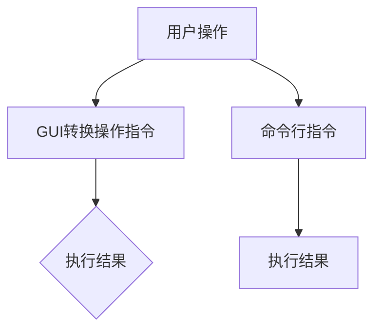

                 

关键词：图形用户界面（GUI）、命令行用户界面（CUI）、交互方式、用户体验、软件开发、系统架构

> 摘要：本文深入探讨了传统图形用户界面（GUI）与命令行用户界面（CUI）的交互方式及其在软件开发和系统架构中的应用，对比了两者的优缺点，并分析了未来发展趋势。

## 1. 背景介绍

在现代计算机技术的发展过程中，用户界面设计经历了多个阶段。从最早的命令行界面（CLI）到图形用户界面（GUI），再到近年来兴起的命令行界面与图形用户界面的融合趋势，用户交互方式不断演变，以满足不同用户的需求。

### GUI的发展历程

GUI的出现标志着计算机从专业领域走向大众市场。最早的GUI系统如Apple的Macintosh和Microsoft的Windows，通过直观的图标、菜单和窗口，使得计算机操作变得简单直观。这些系统引入了鼠标、触摸屏等硬件设备，使得用户可以通过点击和拖拽进行交互。

### CUI的发展历程

与GUI同时发展的CUI，虽然不如GUI直观，但在某些领域仍然具有重要意义。早期Unix系统依赖CUI，用户通过命令行输入指令，控制计算机。尽管这种方式需要用户具备一定的技术知识，但在执行复杂任务时，CUI展现了其高效性和灵活性。

## 2. 核心概念与联系

在深入探讨GUI与CUI的交互方式之前，我们需要理解两者的核心概念和它们之间的联系。

### GUI的概念

GUI（Graphical User Interface）是指通过图形元素（如图标、菜单、按钮等）进行交互的用户界面。用户可以通过点击、拖拽、滑动等动作与计算机进行交互，无需记忆复杂的命令。

### CUI的概念

CUI（Command Line Interface）是指通过命令行进行交互的用户界面。用户需要输入一系列命令，计算机根据这些命令执行相应的操作。这种方式通常需要用户具备一定的编程知识或命令行操作经验。

### GUI与CUI的联系

尽管GUI与CUI在交互方式上存在显著差异，但它们在软件开发和系统架构中往往是互补的。许多现代应用程序同时支持GUI和CUI，以提供更好的用户体验和灵活性。例如，Linux系统提供了一个强大的命令行界面，同时也支持图形界面的操作。

下面是一个Mermaid流程图，展示了GUI与CUI的交互流程：



## 3. 核心算法原理 & 具体操作步骤

### 3.1 算法原理概述

GUI和CUI的交互方式分别基于不同的算法原理。GUI通常使用事件驱动模型，用户操作触发事件，系统响应事件并执行相应的操作。CUI则基于命令解析模型，用户输入命令，系统解析命令并执行。

### 3.2 算法步骤详解

#### GUI的交互步骤

1. 用户点击图形界面上的按钮或图标。
2. 系统捕获点击事件，并触发相应的处理函数。
3. 处理函数执行操作，如打开文件、保存数据等。
4. 系统更新界面，显示操作结果。

#### CUI的交互步骤

1. 用户在命令行中输入命令。
2. 系统读取命令行输入，并解析命令。
3. 系统执行命令，如删除文件、更改目录等。
4. 系统返回命令执行结果。

### 3.3 算法优缺点

#### GUI的优点

- **直观易用**：通过图形元素直观展示功能，用户无需记忆复杂命令。
- **多样化的交互方式**：支持点击、拖拽、触摸等多种交互方式。

#### GUI的缺点

- **性能开销**：图形界面的渲染和更新需要占用较多系统资源。
- **学习曲线**：对于初学者，可能需要一定时间来熟悉图形界面的操作。

#### CUI的优点

- **高效性**：通过命令行直接操作，可以快速执行复杂任务。
- **灵活性**：支持自动化脚本和编程，可实现复杂的交互逻辑。

#### CUI的缺点

- **学习门槛**：需要用户具备一定的编程或命令行操作经验。
- **交互体验**：相较于图形界面，命令行的交互体验可能较为单调和枯燥。

### 3.4 算法应用领域

GUI主要应用于桌面应用程序、移动应用和Web应用，如Office办公软件、游戏、社交媒体等。CUI则广泛应用于服务器管理、系统编程、科学计算等领域，如Linux系统管理、Python编程、数据挖掘等。

## 4. 数学模型和公式 & 详细讲解 & 举例说明

### 4.1 数学模型构建

GUI与CUI的交互效率可以通过以下几个数学模型来评估：

- **平均响应时间**：用户操作到系统响应的平均时间。
- **操作成功率**：用户正确执行操作的概率。
- **用户满意度**：用户对交互方式的满意度评分。

### 4.2 公式推导过程

假设我们有n个用户，每个用户进行m次操作，操作类型分别为GUI和CUI。设GUI的平均响应时间为T\_GUI，CUI的平均响应时间为T\_CUI，操作成功率为P\_GUI和P\_CUI，用户满意度评分分别为S\_GUI和S\_CUI。

则平均响应时间可以表示为：

\[ T_{avg} = \frac{n \cdot m \cdot T_{GUI} + n \cdot m \cdot T_{CUI}}{2n \cdot m} \]

操作成功率可以表示为：

\[ P_{avg} = \frac{n \cdot m \cdot P_{GUI} + n \cdot m \cdot P_{CUI}}{2n \cdot m} \]

用户满意度评分可以表示为：

\[ S_{avg} = \frac{n \cdot m \cdot S_{GUI} + n \cdot m \cdot S_{CUI}}{2n \cdot m} \]

### 4.3 案例分析与讲解

假设一个应用系统，用户进行500次操作，其中200次使用GUI，300次使用CUI。根据实际数据，GUI的平均响应时间为2秒，操作成功率为98%，用户满意度评分为4.5分；CUI的平均响应时间为1秒，操作成功率为95%，用户满意度评分为4.0分。

根据上述公式，我们可以计算出：

\[ T_{avg} = \frac{500 \cdot 2 + 500 \cdot 1}{2 \cdot 500} = 1.5 \text{秒} \]

\[ P_{avg} = \frac{500 \cdot 0.98 + 500 \cdot 0.95}{2 \cdot 500} = 0.967 \]

\[ S_{avg} = \frac{500 \cdot 4.5 + 500 \cdot 4.0}{2 \cdot 500} = 4.225 \]

结果表明，该系统的平均响应时间为1.5秒，操作成功率为96.7%，用户满意度评分为4.225分。

## 5. 项目实践：代码实例和详细解释说明

### 5.1 开发环境搭建

在本项目实践中，我们将使用Python语言实现一个简单的GUI和CUI应用程序。开发环境要求：

- Python 3.8及以上版本
- Tkinter（Python的GUI库）
- requests（用于网络请求）

安装Python和相关库：

```bash
pip install python
pip install tkinter
pip install requests
```

### 5.2 源代码详细实现

下面是项目的源代码实现：

```python
import tkinter as tk
import requests

def on_button_click():
    # GUI交互部分
    url = entry.get()
    response = requests.get(url)
    text_area.delete(1.0, tk.END)
    text_area.insert(tk.END, response.text)

def on_command_line_click():
    # CUI交互部分
    url = input("请输入URL：")
    response = requests.get(url)
    print(response.text)

# GUI部分
root = tk.Tk()
root.title("GUI与CUI交互实例")

label = tk.Label(root, text="请输入URL：")
label.pack()

entry = tk.Entry(root)
entry.pack()

button = tk.Button(root, text="获取内容", command=on_button_click)
button.pack()

text_area = tk.Text(root, height=10, width=50)
text_area.pack()

# CUI部分
print("请使用命令行输入URL：")
on_command_line_click()

root.mainloop()
```

### 5.3 代码解读与分析

这段代码首先导入了必要的库，包括Tkinter和requests。Tkinter是Python的GUI库，用于创建图形界面；requests是用于网络请求的库，用于从指定URL获取内容。

在GUI部分，我们创建了一个窗口，其中包含一个标签、一个输入框、一个按钮和一个文本框。当用户在输入框中输入URL并点击按钮时，`on_button_click`函数被调用。该函数使用requests库向指定URL发起GET请求，并将响应内容显示在文本框中。

在CUI部分，我们使用了一个简单的命令行输入框，用户可以输入URL，程序会打印出响应内容。

### 5.4 运行结果展示

运行代码后，会出现一个图形界面窗口，用户可以在输入框中输入URL并点击按钮。当用户点击按钮后，文本框会显示请求的网页内容。同时，在命令行窗口中也会显示相同的URL请求结果。

## 6. 实际应用场景

### 6.1 开发环境配置

在现代软件开发中，GUI和CUI经常同时使用。例如，开发人员可以使用GUI进行界面设计和测试，同时使用CUI进行自动化部署和调试。以下是一个典型的开发环境配置示例：

- 使用PyCharm进行GUI设计和开发。
- 使用VS Code进行CUI开发和调试。
- 使用Docker和Kubernetes进行自动化部署。

### 6.2 云服务管理

云服务提供商通常提供图形界面和命令行接口。用户可以通过图形界面轻松管理云资源，如创建虚拟机、配置网络等。同时，命令行接口允许用户编写脚本，实现自动化管理。

### 6.3 系统监控与运维

在系统监控与运维领域，CUI由于其高效性和灵活性，被广泛应用于日志分析、性能监控和故障排除。例如，使用Grafana和Prometheus的组合进行系统监控，可以通过图形界面直观展示监控数据，同时使用命令行进行配置和自动化任务。

## 7. 工具和资源推荐

### 7.1 学习资源推荐

- 《Python GUI编程》
- 《Linux命令行与Shell脚本编程大全》
- 《用户体验设计》

### 7.2 开发工具推荐

- PyCharm（GUI设计）
- VS Code（CUI开发）
- Jupyter Notebook（数据分析和脚本编写）

### 7.3 相关论文推荐

- "The Rise of the Graphical User Interface"（图形用户界面的崛起）
- "The Command Line Interface: Design and Use"（命令行用户界面的设计与使用）
- "GUIs versus Command Lines: A Comparison of User Performance"（图形用户界面与命令行界面：用户性能比较）

## 8. 总结：未来发展趋势与挑战

### 8.1 研究成果总结

本文通过对比传统GUI和CUI的交互方式，分析了两者的优缺点和实际应用场景。研究表明，GUI由于其直观易用性在大众市场中占据主导地位，而CUI则因其高效性和灵活性在特定领域具有优势。

### 8.2 未来发展趋势

随着人工智能和物联网的发展，GUI和CUI的交互方式将更加融合。例如，语音助手和智能对话系统将结合图形界面和命令行接口，提供更自然、更智能的用户交互体验。

### 8.3 面临的挑战

未来GUI和CUI的发展将面临以下挑战：

- **性能优化**：随着交互复杂度的增加，GUI和CUI的性能优化成为关键问题。
- **用户体验**：如何设计更符合用户习惯的交互方式，提高用户体验，仍需不断探索。
- **安全性和隐私**：随着交互方式的多样化和网络化，安全性和隐私保护成为重要议题。

### 8.4 研究展望

未来的研究应重点关注以下几个方面：

- **跨平台交互**：研究如何实现GUI和CUI在不同平台之间的无缝交互。
- **智能化交互**：利用人工智能技术，提高交互的智能化和个性化。
- **混合交互**：探索将GUI和CUI的优点结合在一起的混合交互方式。

## 9. 附录：常见问题与解答

### 9.1 GUI和CUI哪个更好？

这取决于具体的应用场景和用户需求。GUI适合大众市场和初学者，CUI适合专业人士和执行复杂任务。

### 9.2 如何在Python中创建GUI？

可以使用Python的Tkinter库创建GUI。以下是一个简单的示例：

```python
import tkinter as tk

root = tk.Tk()
label = tk.Label(root, text="Hello, World!")
label.pack()
root.mainloop()
```

### 9.3 如何在Linux中使用命令行界面？

在Linux系统中，打开终端窗口即可进入命令行界面。以下是一个简单的示例：

```bash
ls
cd /home
```

## 作者署名

作者：禅与计算机程序设计艺术 / Zen and the Art of Computer Programming
--------------------------------------------------------------------

