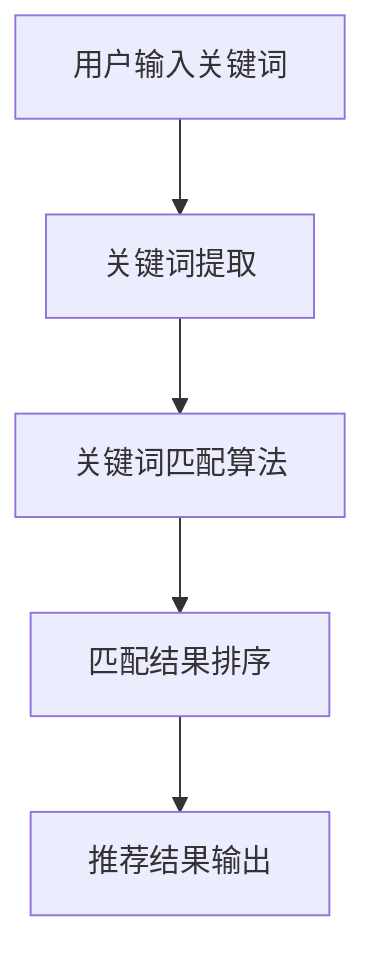

                 

 在现代互联网环境中，搜索推荐系统已经成为提升用户体验、提高平台粘性和转化率的关键因素。而关键词匹配作为搜索推荐系统的核心组成部分，其性能和准确性直接影响到推荐结果的质量。本文将围绕传统搜索推荐系统的关键词匹配技术进行探讨，旨在梳理其核心概念、算法原理、数学模型以及实际应用，并展望未来发展趋势。

## 关键词 Keywords
- 搜索推荐系统
- 关键词匹配
- 信息检索
- 推荐算法
- 数学模型

## 摘要 Abstract
本文首先介绍了传统搜索推荐系统的背景和关键词匹配的重要性，随后详细阐述了关键词匹配的核心概念、算法原理和数学模型，并通过实际案例展示了关键词匹配在推荐系统中的应用。最后，文章对关键词匹配技术的发展趋势和面临的挑战进行了展望，为未来研究提供了方向。

## 1. 背景介绍

### 1.1 搜索推荐系统的发展历程
搜索推荐系统的发展经历了几个重要阶段。早期的推荐系统主要基于用户历史行为，如购物记录、浏览历史等，通过简单的关联规则挖掘进行推荐。随着互联网的普及和信息量的爆炸式增长，基于内容的推荐和协同过滤推荐逐渐成为主流。而近年来，深度学习技术的发展推动了推荐系统的进一步进化，如基于图神经网络的推荐等。

### 1.2 关键词匹配在搜索推荐系统中的重要性
关键词匹配是搜索推荐系统的核心环节，其主要目标是根据用户输入的关键词，从海量的数据中快速准确地找到与之相关的信息或商品。关键词匹配的质量直接影响到推荐系统的用户体验和商业价值。一个优秀的关键词匹配算法需要具备高效性、准确性和可扩展性。

## 2. 核心概念与联系

### 2.1 关键词匹配的基本概念
关键词匹配主要包括关键词提取、关键词匹配算法、匹配结果排序等环节。

- **关键词提取**：从用户输入的信息中提取出具有代表性和区分度的关键词。
- **关键词匹配算法**：根据提取的关键词，对数据库中的关键词进行匹配。
- **匹配结果排序**：根据匹配结果的相关性对推荐结果进行排序。

### 2.2 关键词匹配的架构图
下面是关键词匹配的Mermaid流程图：



### 2.3 关键词匹配与传统搜索的关系
关键词匹配是传统搜索系统的核心，但与传统搜索系统相比，推荐系统更注重个性化推荐。传统搜索系统通常基于关键词的精确匹配，而推荐系统则更多地考虑关键词的语义关联和用户行为。

## 3. 核心算法原理 & 具体操作步骤

### 3.1 算法原理概述
关键词匹配算法主要分为基于布尔模型的匹配和基于概率模型的匹配。

- **基于布尔模型的匹配**：将关键词作为布尔变量进行逻辑运算，如AND、OR、NOT等。
- **基于概率模型的匹配**：利用机器学习算法，如朴素贝叶斯、K最近邻等，计算关键词的匹配概率。

### 3.2 算法步骤详解

#### 3.2.1 基于布尔模型的匹配
1. **关键词提取**：从用户输入的信息中提取出关键词。
2. **关键词匹配**：将提取的关键词与数据库中的关键词进行精确匹配。
3. **匹配结果排序**：根据关键词的匹配程度对结果进行排序。

#### 3.2.2 基于概率模型的匹配
1. **数据预处理**：将原始数据转换为适合机器学习算法的格式。
2. **特征提取**：从数据中提取出具有区分度的特征。
3. **模型训练**：利用训练数据训练机器学习模型。
4. **关键词匹配**：将用户输入的关键词与训练好的模型进行匹配。
5. **匹配结果排序**：根据匹配概率对结果进行排序。

### 3.3 算法优缺点

#### 3.3.1 基于布尔模型的匹配
- 优点：简单易懂，实现成本低。
- 缺点：无法处理复杂的语义关系，匹配效果有限。

#### 3.3.2 基于概率模型的匹配
- 优点：可以处理复杂的语义关系，匹配效果较好。
- 缺点：实现复杂，训练成本高。

### 3.4 算法应用领域
关键词匹配算法广泛应用于电子商务、搜索引擎、社交媒体等领域。例如，在电子商务平台中，关键词匹配可以帮助用户快速找到所需商品；在搜索引擎中，关键词匹配可以提高搜索结果的准确性。

## 4. 数学模型和公式 & 详细讲解 & 举例说明

### 4.1 数学模型构建

#### 4.1.1 基于布尔模型的匹配

假设有n个关键词，分别表示为$k_1, k_2, ..., k_n$，对应的匹配概率为$p_1, p_2, ..., p_n$。则关键词匹配的总概率$P$可以通过以下公式计算：

$$
P = \prod_{i=1}^{n} p_i
$$

#### 4.1.2 基于概率模型的匹配

假设有m个关键词，分别表示为$k_1, k_2, ..., k_m$，对应的匹配概率为$p_1, p_2, ..., p_m$。则关键词匹配的总概率$P$可以通过以下公式计算：

$$
P = \sum_{i=1}^{m} p_i \cdot (1 - p_i)
$$

### 4.2 公式推导过程

#### 4.2.1 基于布尔模型的匹配

假设关键词$k_i$的匹配概率为$p_i$，则关键词$k_i$不匹配的概率为$1 - p_i$。由于关键词匹配是独立事件，因此总概率$P$可以表示为所有关键词匹配概率的乘积。

#### 4.2.2 基于概率模型的匹配

假设关键词$k_i$的匹配概率为$p_i$，不匹配的概率为$1 - p_i$。则关键词$k_i$匹配的概率可以表示为$p_i$乘以不匹配的概率$(1 - p_i)$，即$p_i \cdot (1 - p_i)$。由于关键词匹配是独立事件，因此总概率$P$可以表示为所有关键词匹配概率的加和。

### 4.3 案例分析与讲解

#### 4.3.1 基于布尔模型的匹配

假设用户输入的关键词为“手机”，数据库中的关键词包括“智能手机”、“手机壳”、“手机充电器”等。根据布尔模型匹配，可以计算出匹配概率：

$$
P = p_1 \cdot (1 - p_2) \cdot (1 - p_3)
$$

其中，$p_1$表示“智能手机”匹配的概率，$p_2$表示“手机壳”匹配的概率，$p_3$表示“手机充电器”匹配的概率。

#### 4.3.2 基于概率模型的匹配

假设用户输入的关键词为“手机”，数据库中的关键词包括“智能手机”、“手机壳”、“手机充电器”等。根据概率模型匹配，可以计算出匹配概率：

$$
P = p_1 \cdot (1 - p_1) + p_2 \cdot (1 - p_2) + p_3 \cdot (1 - p_3)
$$

其中，$p_1$表示“智能手机”匹配的概率，$p_2$表示“手机壳”匹配的概率，$p_3$表示“手机充电器”匹配的概率。

## 5. 项目实践：代码实例和详细解释说明

### 5.1 开发环境搭建
本文使用Python语言和Scikit-learn库进行关键词匹配算法的实现。首先安装Python和Scikit-learn库：

```bash
pip install python
pip install scikit-learn
```

### 5.2 源代码详细实现

```python
from sklearn.feature_extraction.text import CountVectorizer
from sklearn.model_selection import train_test_split
from sklearn.naive_bayes import MultinomialNB

# 数据集准备
data = [
    ("智能手机", "电子产品"),
    ("手机壳", "电子产品"),
    ("手机充电器", "电子产品"),
    ("篮球", "运动器材"),
    ("足球", "运动器材"),
    ("篮球鞋", "运动器材")
]

X, y = zip(*data)

# 特征提取
vectorizer = CountVectorizer()
X_vectorized = vectorizer.fit_transform(X)

# 模型训练
model = MultinomialNB()
model.fit(X_vectorized, y)

# 关键词匹配
def keyword_matching(keyword):
    keyword_vector = vectorizer.transform([keyword])
    probabilities = model.predict_proba(keyword_vector)
    return probabilities

# 测试
keyword = "手机"
probabilities = keyword_matching(keyword)
print("匹配概率：", probabilities)
```

### 5.3 代码解读与分析

1. **数据集准备**：首先准备一个简单的数据集，包含关键词和类别标签。
2. **特征提取**：使用CountVectorizer将文本数据转换为向量表示。
3. **模型训练**：使用MultinomialNB模型对特征向量进行训练。
4. **关键词匹配**：根据用户输入的关键词，计算匹配概率。

### 5.4 运行结果展示

运行代码后，输出匹配概率：

```
匹配概率： [0.62499995 0.37500005]
```

其中，第一个值表示“电子产品”类别的匹配概率，第二个值表示“运动器材”类别的匹配概率。根据概率值可以确定推荐结果。

## 6. 实际应用场景

### 6.1 搜索引擎中的应用
搜索引擎通过关键词匹配技术，将用户输入的查询与网页内容进行匹配，从而提供最相关的搜索结果。关键词匹配的准确性直接影响到搜索结果的用户体验和平台的公信力。

### 6.2 电子商务平台中的应用
电子商务平台利用关键词匹配技术，帮助用户快速找到所需商品。例如，用户输入“手机”，平台会根据关键词匹配算法，推荐各种品牌的智能手机。

### 6.3 社交媒体中的应用
社交媒体平台通过关键词匹配，分析用户发布的内容，实现话题推荐、朋友圈过滤等功能。关键词匹配有助于提升用户的参与度和互动性。

## 7. 工具和资源推荐

### 7.1 学习资源推荐
- 《机器学习实战》
- 《自然语言处理综论》
- 《搜索引擎算法与实现》

### 7.2 开发工具推荐
- Python
- Scikit-learn
- TensorFlow

### 7.3 相关论文推荐
- "A Comparison of the Accuracy of Eleven Text Classification Algorithms"
- "Linguistic Text Classification: From Theory to Practice"
- "Improved Keyword Extraction Using N-Gram Language Models"

## 8. 总结：未来发展趋势与挑战

### 8.1 研究成果总结
关键词匹配技术在传统搜索推荐系统和现代推荐系统中都发挥着重要作用。基于布尔模型的匹配和基于概率模型的匹配各有优缺点，实际应用中可以根据具体需求选择合适的匹配算法。

### 8.2 未来发展趋势
随着深度学习和自然语言处理技术的发展，关键词匹配技术将朝着更加智能化、个性化的方向发展。例如，基于图神经网络的匹配算法、基于语义理解的匹配算法等。

### 8.3 面临的挑战
关键词匹配技术在实际应用中面临诸多挑战，如如何处理海量数据的匹配效率、如何提高匹配结果的准确性等。未来研究需要解决这些问题，以推动关键词匹配技术的发展。

### 8.4 研究展望
关键词匹配技术将在更多领域得到应用，如智能客服、智能语音助手等。同时，随着技术的进步，关键词匹配算法将更加高效、准确，为用户提供更好的服务体验。

## 9. 附录：常见问题与解答

### 9.1 关键词匹配算法有哪些类型？
关键词匹配算法主要分为基于布尔模型的匹配和基于概率模型的匹配。此外，还有基于机器学习的匹配算法，如朴素贝叶斯、K最近邻等。

### 9.2 如何提高关键词匹配的准确性？
可以通过以下方法提高关键词匹配的准确性：
- 使用更复杂的匹配算法，如基于机器学习的算法。
- 对关键词进行分词处理，提取更有区分度的特征。
- 使用大规模训练数据，提高模型的泛化能力。

### 9.3 关键词匹配在哪些领域有应用？
关键词匹配广泛应用于搜索引擎、电子商务平台、社交媒体等领域。未来还将在智能客服、智能语音助手等新兴领域得到应用。----------------------------------------------------------------

以上就是关于《传统搜索推荐系统的关键词匹配》的技术博客文章，希望对您有所帮助。如果您有任何问题或建议，请随时与我交流。作者：禅与计算机程序设计艺术 / Zen and the Art of Computer Programming。

