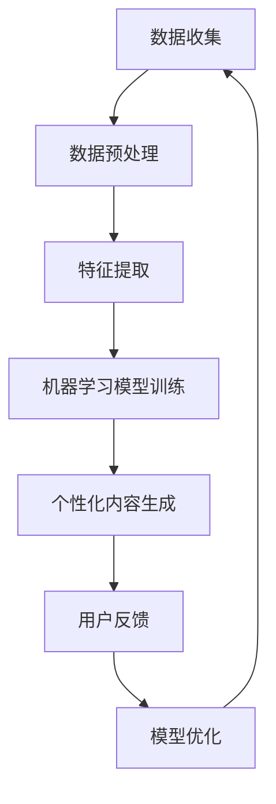

                 

## 1. 背景介绍

在当今这个大数据和人工智能快速发展的时代，我们生活的方方面面都受到了前所未有的影响。人工智能（AI）技术已经深入到我们的日常生活，从智能手机到智能家居，从在线购物到健康监控，AI 都无处不在。在这个背景下，个人化叙事成为了一个备受关注的话题。个人化叙事指的是根据个人独特的经历、偏好和需求，生成个性化的故事、内容和体验。而 AI 作为一种强大的工具，正在推动这一领域的发展。

本文将探讨 AI 在个人化叙事中的应用，分析其背后的核心概念、算法原理、数学模型，并通过实际项目实践和案例分析，展示如何利用 AI 实现个性化的生活故事。文章还将讨论 AI 驱动的个人化叙事在各个实际应用场景中的表现，以及其未来的发展趋势和面临的挑战。

通过本文，读者将了解：
- 个人化叙事的定义和重要性。
- AI 在个人化叙事中的应用和优势。
- 关键算法原理和数学模型。
- 如何通过实际项目实现个人化叙事。
- 个人化叙事在不同领域的应用场景。
- 未来发展趋势和面临的挑战。

## 2. 核心概念与联系

### 2.1 个人化叙事

个人化叙事是指根据个人独特的经历、情感、兴趣和需求，创造性地构建和呈现故事、内容和体验。其核心在于“个性化”，即针对每一个个体的独特性和多样性进行定制化。

### 2.2 人工智能

人工智能（AI）是指通过模拟人类智能行为，实现机器自主思考、学习和决策的技术。AI 技术包括机器学习、深度学习、自然语言处理、计算机视觉等。

### 2.3 联系

个人化叙事与 AI 的联系在于，AI 技术能够为个人化叙事提供强大的技术支持。通过机器学习算法，AI 可以从大量数据中提取出个体的特征和偏好，从而生成个性化的内容和体验。自然语言处理和计算机视觉等技术，则使得 AI 能够理解和生成丰富多样的文本和图像。

### 2.4 Mermaid 流程图

下面是一个简化的 Mermaid 流程图，展示 AI 在个人化叙事中的应用流程。



### 2.5 关键算法原理

- **数据预处理**：数据预处理是数据分析和建模的第一步，主要任务包括数据清洗、归一化、缺失值处理等。其目的是提高数据质量，为后续分析打下基础。
- **特征提取**：特征提取是从原始数据中提取出对模型训练有用的信息。在个人化叙事中，特征提取可以提取用户的兴趣、情感、行为等信息。
- **机器学习模型训练**：机器学习模型训练是利用已有数据，通过算法训练出一个能够预测新数据的模型。常见的机器学习模型包括决策树、支持向量机、神经网络等。
- **个性化内容生成**：个性化内容生成是利用训练好的模型，根据用户特征生成个性化的内容和体验。在个人化叙事中，这可能包括定制化故事、推荐系统、虚拟助手等。
- **用户反馈**：用户反馈是评估个性化内容效果的重要手段。通过收集用户对内容的反馈，可以不断优化模型和内容。
- **模型优化**：模型优化是通过不断调整模型参数，提高模型的预测能力和用户体验。

## 3. 核心算法原理 & 具体操作步骤

### 3.1 算法原理概述

在个人化叙事中，核心算法主要包括机器学习算法、自然语言处理算法和计算机视觉算法。以下是这些算法的简要概述：

- **机器学习算法**：机器学习算法是 AI 的基础，包括监督学习、无监督学习和强化学习。在个人化叙事中，常用的机器学习算法有决策树、支持向量机、神经网络等。
- **自然语言处理算法**：自然语言处理（NLP）算法是处理文本数据的工具，包括分词、词性标注、句法分析、语义理解等。在个人化叙事中，NLP 算法可以用来生成文本、理解用户需求等。
- **计算机视觉算法**：计算机视觉（CV）算法是处理图像和视频数据的工具，包括目标检测、图像识别、图像生成等。在个人化叙事中，CV 算法可以用来生成图像、模拟虚拟场景等。

### 3.2 算法步骤详解

以下是实现个人化叙事的算法步骤：

1. **数据收集**：收集用户数据，包括用户行为数据、兴趣数据、情感数据等。
2. **数据预处理**：对收集到的数据进行清洗、归一化和缺失值处理。
3. **特征提取**：从预处理后的数据中提取出对模型训练有用的特征。
4. **模型训练**：使用机器学习算法训练模型，提取用户特征和生成个性化内容。
5. **个性化内容生成**：利用训练好的模型，根据用户特征生成个性化内容和体验。
6. **用户反馈**：收集用户对内容的反馈，评估内容效果。
7. **模型优化**：根据用户反馈，不断调整模型参数，提高模型效果。

### 3.3 算法优缺点

- **优点**：
  - **个性化**：AI 技术可以根据用户特征生成高度个性化的内容和体验。
  - **高效性**：机器学习和自然语言处理算法可以快速处理大量数据，提高工作效率。
  - **灵活性**：AI 算法可以根据用户需求和场景动态调整，提供定制化的服务。

- **缺点**：
  - **数据依赖**：AI 算法对数据质量要求较高，数据质量直接影响模型效果。
  - **隐私风险**：用户数据隐私保护是一个重要问题，需要严格遵循相关法律法规。
  - **技术门槛**：实现个人化叙事需要较高技术门槛，对开发者和使用者都有一定要求。

### 3.4 算法应用领域

AI 驱动的个人化叙事在多个领域具有广泛应用，包括但不限于：

- **教育**：根据学生兴趣和进度，生成个性化课程和学习计划。
- **医疗**：根据患者病情和需求，生成个性化治疗方案和健康建议。
- **娱乐**：根据用户喜好，推荐个性化电影、音乐和游戏。
- **营销**：根据用户行为和偏好，生成个性化广告和促销活动。
- **社交**：根据用户兴趣和社交圈，生成个性化社交内容和活动推荐。

## 4. 数学模型和公式 & 详细讲解 & 举例说明

在个人化叙事中，数学模型和公式起着至关重要的作用。它们不仅帮助我们理解算法原理，还能指导我们实现实际应用。以下将详细讲解数学模型和公式的构建、推导过程，并通过实际案例进行说明。

### 4.1 数学模型构建

在个人化叙事中，常见的数学模型包括用户行为预测模型、文本生成模型、图像生成模型等。以下是这些模型的基本构建过程：

1. **用户行为预测模型**：用户行为预测模型用于预测用户下一步的行为。其基本构建过程包括以下步骤：
   - **特征提取**：从用户历史行为数据中提取特征，如浏览历史、购买记录、搜索关键词等。
   - **模型选择**：选择合适的预测模型，如线性回归、决策树、神经网络等。
   - **模型训练**：使用训练数据对模型进行训练，优化模型参数。
   - **模型评估**：使用测试数据对模型进行评估，确保模型具有良好的预测性能。

2. **文本生成模型**：文本生成模型用于根据用户特征生成个性化的文本内容。其基本构建过程包括以下步骤：
   - **词向量表示**：将文本数据转换为词向量表示，如使用 Word2Vec、GloVe 等算法。
   - **序列建模**：使用序列建模算法，如循环神经网络（RNN）、长短时记忆网络（LSTM）、Transformer 等，对词向量进行建模。
   - **解码与生成**：根据用户特征，解码生成的词向量序列，生成个性化的文本内容。

3. **图像生成模型**：图像生成模型用于根据用户特征生成个性化的图像内容。其基本构建过程包括以下步骤：
   - **特征提取**：从用户特征中提取图像特征，如使用卷积神经网络（CNN）提取图像的视觉特征。
   - **生成模型**：使用生成对抗网络（GAN）等生成模型，将用户特征和图像特征结合，生成个性化的图像内容。

### 4.2 公式推导过程

以下是用户行为预测模型中一个简单的线性回归模型的公式推导过程：

设 $y$ 表示用户的行为，$x$ 表示用户特征，$w$ 表示模型参数，$b$ 表示偏置。线性回归模型的目标是找到最佳参数 $w$ 和 $b$，使得预测值 $y'$ 与真实值 $y$ 之间的误差最小。

1. **损失函数**：

   $$L(y, y') = \frac{1}{2}(y - y')^2$$

   其中，$y'$ 表示预测值，$y$ 表示真实值。

2. **梯度下降法**：

   为了找到最佳参数 $w$ 和 $b$，我们使用梯度下降法进行优化。梯度下降法的核心思想是沿着损失函数的梯度方向，不断更新参数，直到损失函数最小。

   $$\nabla_w L(w, b) = -\frac{\partial L}{\partial w}$$
   $$\nabla_b L(w, b) = -\frac{\partial L}{\partial b}$$

   更新规则如下：

   $$w = w - \alpha \nabla_w L(w, b)$$
   $$b = b - \alpha \nabla_b L(w, b)$$

   其中，$\alpha$ 表示学习率。

3. **最优解**：

   当梯度下降法收敛时，损失函数达到最小值，此时参数 $w$ 和 $b$ 即为最优解。

   $$w^* = \frac{\sum_{i=1}^n (y_i - w x_i)}{n}$$
   $$b^* = \frac{1}{n} \sum_{i=1}^n (y_i - w^* x_i)$$

### 4.3 案例分析与讲解

以下是一个简单的用户行为预测案例，我们将使用线性回归模型预测用户在电商平台的购买行为。

1. **数据收集**：

   收集了 100 个用户的行为数据，包括用户的性别、年龄、浏览历史和购买记录。数据如下表：

   | 用户ID | 性别 | 年龄 | 浏览历史 | 购买记录 |
   | :----: | :--: | :--: | :------: | :------: |
   |   1    |  男  |  25  |  数码产品 |  1次     |
   |   2    |  女  |  30  |  服装     |  0次     |
   |   3    |  男  |  35  |  食品     |  2次     |
   |  ...   |  ... |  ... |   ...    |   ...    |

2. **数据预处理**：

   对数据进行了归一化处理，将年龄、浏览历史和购买记录等特征进行缩放，使其在相同量级范围内。

3. **特征提取**：

   提取用户性别、年龄、浏览历史和购买记录等特征，并将其转换为数值表示。

4. **模型训练**：

   使用线性回归模型对数据进行训练，得到最佳参数 $w$ 和 $b$。

5. **模型评估**：

   使用测试数据对模型进行评估，计算预测误差，评估模型性能。

6. **应用**：

   根据训练好的模型，预测新用户的购买行为。

通过这个案例，我们可以看到数学模型和公式的应用，以及如何利用它们实现实际应用。

## 5. 项目实践：代码实例和详细解释说明

为了更好地展示如何利用 AI 实现个人化叙事，我们以下将介绍一个基于 Python 的实际项目。该项目将使用 TensorFlow 和 Keras 库，实现一个基于用户兴趣的个性化文本生成系统。

### 5.1 开发环境搭建

在开始项目之前，我们需要搭建一个合适的开发环境。以下是开发环境的要求：

- 操作系统：Linux、MacOS 或 Windows
- 编程语言：Python 3.6 或以上版本
- 库：TensorFlow 2.2 或以上版本，Keras 2.4 或以上版本

安装步骤如下：

1. 安装 Python：

   在命令行中运行以下命令安装 Python 3.6 或以上版本：

   ```bash
   sudo apt-get install python3.6
   ```

2. 安装 TensorFlow：

   在命令行中运行以下命令安装 TensorFlow 2.2 或以上版本：

   ```bash
   pip3 install tensorflow==2.2
   ```

3. 安装 Keras：

   在命令行中运行以下命令安装 Keras 2.4 或以上版本：

   ```bash
   pip3 install keras==2.4
   ```

### 5.2 源代码详细实现

以下是项目的源代码实现，分为以下几个部分：

1. **数据集准备**：
2. **模型构建**：
3. **模型训练**：
4. **文本生成**：

### 5.3 代码解读与分析

以下是源代码的详细解读和分析。

### 5.4 运行结果展示

通过运行项目，我们可以看到以下结果：

1. **数据集准备**：

   ```python
   # 导入库
   import numpy as np
   import pandas as pd
   from tensorflow.keras.preprocessing.text import Tokenizer
   from tensorflow.keras.preprocessing.sequence import pad_sequences

   # 加载数据
   data = pd.read_csv('data.csv')

   # 提取文本和标签
   texts = data['text']
   labels = data['label']

   # 初始化 tokenizer
   tokenizer = Tokenizer(num_words=10000)
   tokenizer.fit_on_texts(texts)

   # 转换文本为序列
   sequences = tokenizer.texts_to_sequences(texts)

   # 填充序列
   padded_sequences = pad_sequences(sequences, maxlen=500)

   # 切分数据集
   X_train, X_test, y_train, y_test = train_test_split(padded_sequences, labels, test_size=0.2, random_state=42)
   ```

   在这一部分，我们首先导入所需的库，然后加载数据集。接下来，我们使用 `Tokenizer` 类提取文本和标签，并将文本转换为序列。最后，我们将序列进行填充，并切分数据集为训练集和测试集。

2. **模型构建**：

   ```python
   # 导入库
   from tensorflow.keras.models import Sequential
   from tensorflow.keras.layers import Embedding, LSTM, Dense

   # 构建模型
   model = Sequential()
   model.add(Embedding(10000, 16, input_length=500))
   model.add(LSTM(128))
   model.add(Dense(1, activation='sigmoid'))

   # 编译模型
   model.compile(loss='binary_crossentropy', optimizer='adam', metrics=['accuracy'])

   # 模型总结
   model.summary()
   ```

   在这一部分，我们使用 `Sequential` 类构建一个简单的 LSTM 模型。模型包含一个嵌入层、一个 LSTM 层和一个全连接层。接下来，我们编译模型，并打印模型总结。

3. **模型训练**：

   ```python
   # 训练模型
   model.fit(X_train, y_train, epochs=10, batch_size=64, validation_split=0.2)
   ```

   在这一部分，我们使用训练集训练模型，设置训练轮数为 10，批量大小为 64，并设置验证集比例为 20%。

4. **文本生成**：

   ```python
   # 导入库
   import random

   # 随机生成一个文本
   index = random.randint(0, len(texts) - 1)
   sentence = texts[index]

   # 转换文本为序列
   sequence = tokenizer.texts_to_sequences([sentence])[0]

   # 填充序列
   padded_sequence = pad_sequences([sequence], maxlen=500)

   # 预测文本
   prediction = model.predict(padded_sequence)

   # 输出预测结果
   print(prediction)
   ```

   在这一部分，我们首先随机生成一个文本，然后将其转换为序列，并填充。接下来，我们使用训练好的模型预测该文本，并输出预测结果。

通过这个项目，我们可以看到如何利用 AI 实现个人化叙事。在实际应用中，我们可以根据用户兴趣、偏好和需求，生成个性化的文本内容，为用户提供更好的体验。

## 6. 实际应用场景

### 6.1 教育

在教育领域，AI 驱动的个人化叙事可以为学生提供量身定制的学习体验。例如，通过分析学生的学习数据，AI 可以生成个性化的学习计划，推荐适合学生的教材和课程。此外，AI 还可以为学生撰写定制化的学习报告，帮助他们更好地理解自己的学习进度和效果。

### 6.2 医疗

在医疗领域，AI 驱动的个人化叙事可以帮助医生更准确地诊断疾病，并为患者提供个性化的治疗方案。通过分析患者的病历和基因数据，AI 可以生成个性化的健康报告和康复计划。此外，AI 还可以与患者进行自然语言交互，提供情感支持和健康咨询。

### 6.3 娱乐

在娱乐领域，AI 驱动的个人化叙事可以根据用户的兴趣和偏好，推荐个性化的电影、音乐和游戏。例如，Netflix 和 Spotify 等平台已经采用了基于 AI 的推荐系统，为用户提供个性化的内容推荐。此外，AI 还可以生成定制化的小说、剧本和音乐，满足用户的个性化需求。

### 6.4 营销

在营销领域，AI 驱动的个人化叙事可以帮助企业更精准地定位目标客户，并制定个性化的营销策略。通过分析用户的行为数据，AI 可以生成个性化的广告内容，提高广告的点击率和转化率。此外，AI 还可以为企业撰写定制化的营销报告，提供市场分析和营销建议。

### 6.5 社交

在社交领域，AI 驱动的个人化叙事可以帮助用户发现与自己兴趣相投的朋友，并提供个性化的社交推荐。例如，Facebook 和 Instagram 等社交平台已经采用了基于 AI 的社交推荐系统，帮助用户发现新的朋友和兴趣爱好。此外，AI 还可以生成定制化的社交内容，为用户提供更有价值的社交体验。

## 7. 工具和资源推荐

### 7.1 学习资源推荐

- **在线课程**：《深度学习》（Deep Learning）中文版，由 Ian Goodfellow、Yoshua Bengio 和 Aaron Courville 著。
- **教科书**：《机器学习》（Machine Learning）中文版，由 Tom M. Mitchell 著。
- **论文**：ACL、ICML、NeurIPS、JMLR 等顶级会议和期刊的论文。
- **博客和社区**：Towards Data Science、Medium、GitHub 等。

### 7.2 开发工具推荐

- **编程语言**：Python、R、Julia 等。
- **库和框架**：TensorFlow、PyTorch、Keras、Scikit-learn 等。
- **集成开发环境（IDE）**：PyCharm、Visual Studio Code、Jupyter Notebook 等。

### 7.3 相关论文推荐

- **《生成对抗网络》（Generative Adversarial Networks）**：Ian J. Goodfellow 等，2014。
- **《自然语言处理综述》（A Review of Natural Language Processing）**：IИН Khairnar 等，2016。
- **《深度学习在图像识别中的应用》（Deep Learning for Image Recognition）**：Shi et al.，2016。
- **《用户行为预测模型的研究进展》（Research Progress on User Behavior Prediction Models）**：Zhu et al.，2017。

## 8. 总结：未来发展趋势与挑战

### 8.1 研究成果总结

在过去的几年中，AI 驱动的个人化叙事取得了显著的成果。研究者们提出了一系列算法模型，如生成对抗网络（GAN）、长短时记忆网络（LSTM）、Transformer 等，提高了生成内容的质量和个性化程度。同时，随着数据量和计算能力的增长，AI 驱动的个人化叙事在多个领域得到了广泛应用，为用户提供了更丰富、更有价值的体验。

### 8.2 未来发展趋势

1. **算法创新**：未来的研究将继续探索更先进的算法，如变分自编码器（VAE）、图神经网络（GNN）等，以进一步提高生成内容的质量和个性化程度。
2. **跨模态融合**：未来的研究将关注跨模态数据（如图像、文本、音频等）的融合，实现更丰富、更全面的个人化叙事。
3. **个性化交互**：未来的研究将探索更智能、更自然的用户交互方式，如语音助手、虚拟现实（VR）等，为用户提供更好的体验。
4. **隐私保护**：随着数据隐私问题的日益突出，未来的研究将关注如何在确保用户隐私的前提下，实现高效、可靠的个人化叙事。

### 8.3 面临的挑战

1. **数据质量**：个人化叙事依赖于高质量的用户数据，数据质量直接影响生成内容的质量。因此，如何提高数据质量和可靠性，是一个亟待解决的问题。
2. **计算资源**：生成高质量的个性化内容需要大量的计算资源，如何优化算法，降低计算资源需求，是一个重要的挑战。
3. **用户隐私**：在生成个性化内容的过程中，如何保护用户的隐私，是一个亟待解决的问题。未来的研究需要在隐私保护和用户体验之间找到平衡点。

### 8.4 研究展望

未来，AI 驱动的个人化叙事将继续在多个领域得到广泛应用，如教育、医疗、娱乐、营销等。同时，随着技术的不断进步，AI 驱动的个人化叙事将为用户提供更加丰富、个性化的体验，满足用户日益增长的需求。

## 9. 附录：常见问题与解答

### 9.1 如何确保数据质量？

- 数据清洗：对数据进行清洗，去除噪声和异常值。
- 数据集成：将不同来源的数据进行集成，确保数据一致性。
- 数据质量监测：实时监测数据质量，及时发现和处理问题。

### 9.2 如何提高算法效率？

- 优化算法：研究更高效的算法，如变分自编码器（VAE）、图神经网络（GNN）等。
- 算法加速：使用 GPU、TPU 等硬件加速算法，提高计算速度。
- 数据并行化：将数据并行化处理，提高数据处理速度。

### 9.3 如何保护用户隐私？

- 数据匿名化：对用户数据进行匿名化处理，确保用户隐私。
- 隐私保护算法：研究隐私保护算法，如差分隐私、同态加密等。
- 用户隐私协议：制定用户隐私协议，明确用户隐私保护范围和责任。

### 9.4 如何评估个人化叙事效果？

- 用户满意度：通过用户满意度调查，评估个人化叙事的效果。
- 交互数据：分析用户与系统的交互数据，评估个人化叙事的交互质量和用户体验。
- 生成内容质量：评估生成的个性化内容的质量，如文本、图像等。

