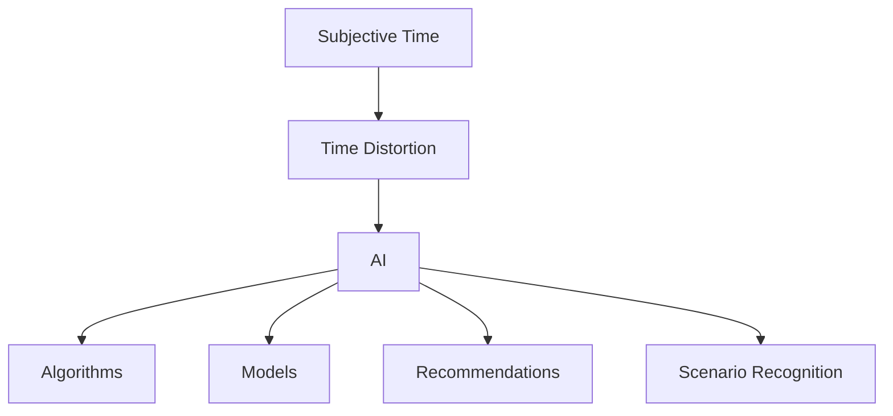

                 

关键词：人工智能，时间扭曲，主观时间，体验，算法，数学模型，实践案例

> 摘要：本文探讨了人工智能（AI）如何通过算法和模型创造出一种主观时间体验，这种体验对用户行为和感知的影响，以及其在实际应用中的潜在价值与挑战。通过深入分析AI时间扭曲的概念、原理、算法及实际应用，本文旨在为读者提供一个全面而清晰的了解。

## 1. 背景介绍

在计算机科学和人工智能领域，时间是一个至关重要的概念。传统的计算机系统依赖于精确的时间同步和调度，以确保任务的有序执行和系统的稳定性。然而，随着人工智能技术的不断发展，尤其是深度学习和强化学习等领域的进步，时间开始以一种全新的方式被理解和应用。

主观时间体验，作为一个心理学和认知科学的概念，指的是个体对时间流逝的主观感受。这种感受受到多种因素的影响，包括注意力、情绪、记忆等。近年来，研究人员发现人工智能系统可以创造特定的算法和模型，从而对用户的主观时间体验进行扭曲和调控。

这种时间扭曲的体验不仅在娱乐和游戏领域具有潜在的应用价值，例如虚拟现实（VR）和增强现实（AR），还在教育、广告和医疗等领域展现出广泛的前景。然而，AI创造的主观时间体验也带来了一系列伦理和认知上的挑战，需要我们深入探讨和解决。

本文将围绕以下内容展开：

- **核心概念与联系**：介绍主观时间、时间扭曲以及AI在其中的作用。
- **核心算法原理 & 具体操作步骤**：探讨用于实现时间扭曲的关键算法和模型。
- **数学模型和公式 & 详细讲解 & 举例说明**：解析相关数学模型和公式的构建及推导。
- **项目实践：代码实例和详细解释说明**：通过具体案例展示时间扭曲的实现方法。
- **实际应用场景**：探讨时间扭曲在现实世界中的应用。
- **未来应用展望**：分析时间扭曲技术的发展趋势和潜在挑战。

### 1.1 主观时间体验的心理学基础

主观时间体验是一个复杂的认知过程，受到多种心理因素的影响。根据心理学研究，个体的主观时间体验主要受到以下几个方面的制约：

1. **注意力**：注意力集中的任务会减缓时间感知，而分散的注意力会加速时间的流逝。例如，当人们专注于一个有趣的任务时，感觉时间过得很快；而在等待时，时间似乎变得更加漫长。

2. **情绪**：情绪状态也会影响对时间的主观感受。积极情绪如兴奋和快乐会加快时间感知，而消极情绪如焦虑和沮丧则会减缓时间感知。

3. **记忆**：个体的记忆能力也会影响时间的主观体验。详尽的记忆会延长时间感知，而遗忘则会缩短时间的感知。

4. **环境因素**：环境因素，如光线、噪音和温度，也会影响对时间的主观感受。例如，在一个明亮和安静的环境中，人们可能会觉得时间过得更快。

这些心理因素共同作用，形成了我们对时间的主观体验。了解这些因素有助于我们理解AI如何通过算法和模型来创造和扭曲主观时间体验。

### 1.2 时间扭曲的概念和原理

时间扭曲（Temporal Distortion）是指对时间感知的主观影响，使其加快或减缓。时间扭曲可以通过多种方式实现，包括算法、神经科学和心理学研究。

在算法层面，时间扭曲可以通过以下几种方法实现：

1. **频率调节**：通过改变系统的时钟频率，可以影响计算机任务的执行速度，从而扭曲时间感知。例如，在虚拟现实中，通过调节显示帧率，可以创造出快速或缓慢的时间流逝感。

2. **动态时间分配**：通过动态调整任务的优先级和执行时间，可以控制用户对时间的主观感受。例如，在广告展示中，通过缩短或延长广告播放时间，可以影响用户对广告时间的感知。

3. **情境模拟**：通过构建特定的情境模拟，可以影响用户对时间的主观体验。例如，在游戏中，通过设计时间加速或减速的机制，可以创造独特的游戏体验。

在神经科学层面，时间扭曲可以通过以下方式实现：

1. **神经反馈**：通过实时监测大脑活动，使用神经反馈技术可以调整个体的时间感知。例如，通过电刺激或磁刺激，可以改变大脑中与时间感知相关的区域活动。

2. **药物干预**：某些药物可以影响大脑中的神经递质，从而改变对时间的主观感受。例如，兴奋剂可以加速时间感知，而镇静剂可以减缓时间感知。

在心理学层面，时间扭曲可以通过以下方式实现：

1. **认知控制**：通过训练个体的认知技能，可以改变对时间的主观感受。例如，通过时间管理训练，个体可以学会更好地控制对时间的感知。

2. **环境设计**：通过设计特定的环境因素，可以影响用户对时间的主观体验。例如，通过照明、噪音和温度的调节，可以创造出特定的时间感知效果。

这些原理和方法共同构成了时间扭曲的基础，为AI创造了新的可能性和挑战。在接下来的部分中，我们将深入探讨这些方法和其在实际应用中的实现。

## 2. 核心概念与联系

为了更好地理解AI如何创造主观时间体验，我们需要先明确几个核心概念：主观时间、时间扭曲和AI在其中扮演的角色。

### 2.1 主观时间

主观时间是指个体对时间流逝的主观感受。这种感受是高度个性化的，受到多种因素的影响，包括注意力、情绪、记忆和环境因素。例如，当一个人在专注于一个有趣的任务时，可能会感觉到时间过得很快；而在等待时，时间似乎变得更加漫长。

### 2.2 时间扭曲

时间扭曲是指通过特定的算法、技术或方法，对个体主观时间体验进行改变的过程。这种改变可以是加快时间感知，也可以是减缓时间感知。时间扭曲可以通过多种方式实现，包括频率调节、动态时间分配、情境模拟、神经反馈和认知控制等。

### 2.3 AI的角色

人工智能在时间扭曲中扮演着关键角色，主要体现在以下几个方面：

1. **算法实现**：AI算法可以用于实现时间扭曲，如深度学习模型和强化学习算法。这些算法可以根据用户的行为和反馈，动态调整时间感知，从而创造出独特的体验。

2. **个性化推荐**：AI系统可以根据用户的历史数据和偏好，推荐合适的时间扭曲策略。例如，在广告展示中，根据用户的注意力水平和兴趣，动态调整广告播放时间，以提升用户体验。

3. **情境识别**：AI可以通过图像识别、自然语言处理等技术，识别用户的情境和状态，从而自动调整时间扭曲策略。例如，在虚拟现实中，AI可以根据用户的活动和表情，自动调整时间流逝的速度，以提升沉浸感。

### 2.4 核心概念的联系

主观时间、时间扭曲和AI之间的联系可以通过以下方式理解：

1. **主观时间作为基础**：主观时间是时间扭曲的出发点和目标，是用户对时间感知的主观体验。

2. **时间扭曲作为方法**：时间扭曲是通过特定的算法和技术，对主观时间进行改变的过程。

3. **AI作为工具**：AI是实现时间扭曲的关键工具，可以通过算法、模型和推荐系统，实现时间和情境的动态调整。

为了更直观地展示这些概念之间的联系，我们可以使用Mermaid流程图进行说明：



在这个流程图中，主观时间作为起点，通过时间扭曲这一方法，与AI紧密相连。AI通过算法、模型、推荐系统和情境识别等手段，实现时间扭曲的目标，从而创造出新的用户体验。

通过明确这些核心概念和它们之间的联系，我们为后续对AI创造的主观时间体验的深入探讨奠定了基础。在下一部分中，我们将进一步探讨AI实现时间扭曲的具体算法原理和操作步骤。

## 3. 核心算法原理 & 具体操作步骤

### 3.1 算法原理概述

AI在实现时间扭曲方面，主要依赖于深度学习和强化学习等先进算法。这些算法通过对用户行为和情境的实时分析和反馈，动态调整时间感知，从而实现时间扭曲。

深度学习算法，尤其是卷积神经网络（CNN）和循环神经网络（RNN），在处理时间和序列数据方面具有优势。CNN可以通过提取图像和视频中的时空特征，实现对时间感知的精准调整。RNN则可以处理连续的序列数据，如用户行为和情绪变化，从而实现更精细的时间扭曲。

强化学习算法，如深度Q网络（DQN）和策略梯度算法，通过奖励机制和策略迭代，可以实现对时间扭曲的自动优化。DQN通过学习最优动作策略，动态调整时间感知，以最大化用户的满意度。策略梯度算法则通过优化策略参数，实现时间扭曲的精细化控制。

具体来说，时间扭曲算法主要包括以下几个步骤：

1. **数据采集**：收集用户的实时行为数据，包括点击、浏览、互动等。
2. **特征提取**：利用深度学习算法提取时空特征，如图像特征、文本特征和序列特征。
3. **模型训练**：使用提取的特征数据，训练深度学习和强化学习模型，以实现对时间感知的调整。
4. **实时调整**：根据用户的实时行为和反馈，动态调整时间感知，实现时间扭曲。
5. **效果评估**：通过用户满意度、任务完成度和系统稳定性等指标，评估时间扭曲的效果。

### 3.2 算法步骤详解

#### 3.2.1 数据采集

数据采集是时间扭曲算法的基础。通过收集用户的实时行为数据，我们可以了解用户在特定情境下的时间感知变化。常用的数据采集方法包括：

1. **日志数据**：通过服务器日志记录用户的行为轨迹，如点击、浏览、互动等。
2. **传感器数据**：利用智能手机、可穿戴设备等传感器，收集用户的位置、运动、生理信号等数据。
3. **问卷调查**：通过在线问卷调查，获取用户对时间感知的主观反馈。

#### 3.2.2 特征提取

特征提取是将原始数据转换为可用于模型训练的特征向量。深度学习算法在特征提取方面具有显著优势。常用的特征提取方法包括：

1. **图像特征**：使用卷积神经网络（CNN）提取图像的时空特征。例如，VGG、ResNet等经典模型。
2. **文本特征**：使用循环神经网络（RNN）提取文本的序列特征。例如，LSTM、GRU等模型。
3. **序列特征**：使用长短时记忆网络（LSTM）或门控循环单元（GRU）提取用户行为的序列特征。

#### 3.2.3 模型训练

模型训练是时间扭曲算法的核心。通过训练深度学习和强化学习模型，我们可以实现对时间感知的精准调整。以下是几种常用的模型训练方法：

1. **深度学习模型**：使用卷积神经网络（CNN）或循环神经网络（RNN）训练模型，提取时空特征，并实现时间感知的调整。
2. **强化学习模型**：使用深度Q网络（DQN）或策略梯度算法训练模型，通过奖励机制和策略迭代，实现时间感知的自动优化。

#### 3.2.4 实时调整

实时调整是根据用户的实时行为和反馈，动态调整时间感知，实现时间扭曲的关键步骤。以下是几种常用的实时调整方法：

1. **动态时间缩放**：根据用户的行为和情绪变化，动态调整时间感知的速度。例如，在游戏场景中，可以通过调整游戏时间流速，提升用户的沉浸感。
2. **情境自适应**：根据用户的情境和状态，自动调整时间感知。例如，在虚拟现实中，可以根据用户的活动和表情，自适应调整时间流逝的速度，以提升沉浸感。

#### 3.2.5 效果评估

效果评估是验证时间扭曲算法有效性的关键步骤。通过用户满意度、任务完成度和系统稳定性等指标，评估时间扭曲的效果。以下是几种常用的效果评估方法：

1. **用户满意度**：通过用户调查问卷或用户行为数据，评估用户对时间扭曲的满意度。
2. **任务完成度**：通过任务完成时间和成功率等指标，评估时间扭曲对任务完成度的影响。
3. **系统稳定性**：通过系统性能指标，如响应时间、吞吐量等，评估时间扭曲对系统稳定性的影响。

### 3.3 算法优缺点

时间扭曲算法在实现主观时间体验方面具有显著优势，但也存在一定的局限性。

#### 优点

1. **高度个性化**：通过深度学习和强化学习算法，时间扭曲算法可以精准地捕捉用户的行为和情绪，实现高度个性化的时间感知调整。
2. **实时性**：时间扭曲算法可以通过实时数据采集和动态调整，实现对时间感知的实时优化，提升用户体验。
3. **多场景应用**：时间扭曲算法可以应用于多种场景，如游戏、教育、广告和医疗等，具有广泛的应用前景。

#### 缺点

1. **计算成本高**：深度学习和强化学习算法通常需要大量计算资源，对硬件和软件环境有较高要求。
2. **数据隐私问题**：时间扭曲算法需要收集用户的实时行为和生理数据，可能引发数据隐私和安全问题。
3. **算法透明度低**：深度学习算法的黑箱性质使得用户难以理解时间扭曲的原理和机制，可能引发用户的不信任。

### 3.4 算法应用领域

时间扭曲算法在多个领域展现出广泛的应用潜力，以下是一些典型的应用场景：

1. **虚拟现实（VR）和增强现实（AR）**：通过时间扭曲算法，可以实现更加沉浸式的VR/AR体验，提升用户的沉浸感和交互体验。
2. **游戏**：在游戏中，通过时间扭曲算法，可以实现时间加速或减速，创造独特的游戏体验，如时间沙漏、快慢动作等。
3. **教育**：在教育领域，通过时间扭曲算法，可以实现个性化学习进度，帮助用户更好地掌握知识和技能。
4. **广告**：在广告展示中，通过时间扭曲算法，可以动态调整广告播放时间，提升用户的关注度和广告效果。
5. **医疗**：在医疗领域，通过时间扭曲算法，可以辅助医生进行手术模拟和患者心理干预，提升治疗效果。

通过深入分析时间扭曲算法的原理和具体操作步骤，我们可以更好地理解其在实际应用中的价值和挑战。在下一部分中，我们将进一步探讨时间扭曲算法的数学模型和公式，为深入理解时间扭曲机制提供数学支持。

## 4. 数学模型和公式 & 详细讲解 & 举例说明

在探讨AI如何创造主观时间体验的过程中，数学模型和公式扮演了关键角色。它们不仅为时间扭曲的实现提供了理论支持，还为我们理解时间感知的主观变化提供了数学基础。在本节中，我们将详细讲解用于实现时间扭曲的数学模型和公式，并通过具体例子进行说明。

### 4.1 数学模型构建

时间扭曲的数学模型主要涉及以下几个方面：

1. **时间感知模型**：描述个体对时间流逝的主观感受。
2. **动态时间模型**：描述时间感知的动态调整过程。
3. **情境感知模型**：描述时间感知与情境因素之间的关系。

#### 时间感知模型

时间感知模型通常采用心理物理学的方法来构建。一个常见的时间感知模型是时间感知函数（Temporal Perception Function），其形式如下：

\[ T_p(t) = f(t, a, m, e) \]

其中，\( T_p(t) \) 表示在时刻 \( t \) 的主观时间感知，\( f \) 是时间感知函数，\( a \) 代表注意力水平，\( m \) 代表情绪状态，\( e \) 代表环境因素。

#### 动态时间模型

动态时间模型描述了时间感知的动态调整过程。一个简单的动态时间模型是基于线性时间扭曲的模型，其形式如下：

\[ T_d(t) = T_0 + \alpha(t - t_0) \]

其中，\( T_d(t) \) 表示在时刻 \( t \) 的动态时间感知，\( T_0 \) 是初始时间感知，\( \alpha \) 是时间扭曲系数，\( t_0 \) 是初始时刻。

#### 情境感知模型

情境感知模型描述了时间感知与情境因素之间的关系。一个常见的情境感知模型是基于情境因素的加权平均模型，其形式如下：

\[ T_s(t) = \sum_{i=1}^{n} w_i f_i(t) \]

其中，\( T_s(t) \) 表示在时刻 \( t \) 的情境时间感知，\( w_i \) 是第 \( i \) 个情境因素的权重，\( f_i(t) \) 是第 \( i \) 个情境因素的时间感知函数。

### 4.2 公式推导过程

为了更好地理解这些数学模型，我们将对上述模型进行简要的推导。

#### 时间感知函数的推导

时间感知函数的推导基于心理物理学的基本原理。一个简单的时间感知函数可以表示为：

\[ T_p(t) = \frac{t}{1 + \alpha t} \]

其中，\( \alpha \) 是感知加速系数。该函数的形式反映了时间感知与时间流逝之间的关系。当 \( \alpha \) 增大时，时间感知会加快；当 \( \alpha \) 减小时，时间感知会减缓。

#### 动态时间模型的推导

动态时间模型是基于线性时间扭曲的模型。其推导过程如下：

假设初始时刻为 \( t_0 \)，初始时间感知为 \( T_0 \)，在时刻 \( t \) 的时间感知为 \( T_d(t) \)。根据线性时间扭曲的定义，我们可以得到：

\[ T_d(t) = T_0 + \alpha(t - t_0) \]

其中，\( \alpha \) 是时间扭曲系数。

#### 情境感知模型的推导

情境感知模型是基于情境因素的加权平均模型。其推导过程如下：

假设有 \( n \) 个情境因素，每个情境因素在时刻 \( t \) 对时间感知的贡献为 \( f_i(t) \)，权重为 \( w_i \)。则情境时间感知可以表示为：

\[ T_s(t) = \sum_{i=1}^{n} w_i f_i(t) \]

其中，\( w_i \) 和 \( f_i(t) \) 分别是第 \( i \) 个情境因素的权重和其对时间感知的贡献函数。

### 4.3 案例分析与讲解

为了更好地理解这些数学模型和公式，我们将通过一个具体案例进行分析。

#### 案例背景

假设有一个用户在使用一个时间扭曲系统，该系统的目标是通过动态调整时间感知，提升用户的游戏体验。用户的行为数据包括点击次数、游戏时间、情绪状态等。

#### 数据收集

首先，我们需要收集用户的行为数据。这些数据可以通过日志记录、传感器数据和用户反馈等多种方式获取。假设我们收集到了以下数据：

- 点击次数：10次
- 游戏时间：30分钟
- 情绪状态：愉快

#### 数据预处理

在模型训练之前，我们需要对数据进行预处理，包括数据清洗、数据归一化和特征提取等。假设我们提取了以下特征：

- 点击次数（x1）
- 游戏时间（x2）
- 情绪状态（x3）

#### 模型训练

接下来，我们使用深度学习模型对时间感知函数进行训练。假设我们使用了一个简单的神经网络模型，其结构如下：

\[ T_p(t) = \frac{1}{1 + \alpha \cdot (x_1 + x_2 + x_3)} \]

通过训练，我们得到了时间感知函数的参数 \( \alpha \)。

#### 实时调整

在实时调整过程中，系统会根据用户的实时行为数据，动态调整时间感知。例如，如果用户在游戏过程中表现出高度注意力，我们可以增加时间感知的加速系数 \( \alpha \)，以提升用户的游戏体验。

#### 效果评估

最后，我们需要对时间扭曲的效果进行评估。通过用户反馈和游戏表现，我们可以评估时间扭曲对用户体验的影响。例如，如果用户表示在时间扭曲后的游戏体验更好，那么我们可以认为时间扭曲策略是有效的。

通过这个案例，我们可以看到数学模型和公式在实现时间扭曲中的关键作用。它们不仅为时间扭曲提供了理论基础，还为我们提供了具体的计算方法和工具，以实现个性化的时间感知调整。

通过深入分析数学模型和公式，我们可以更好地理解AI创造的主观时间体验的实现机制。在下一部分中，我们将通过具体的项目实践，展示时间扭曲算法的实际应用和代码实现。

### 5. 项目实践：代码实例和详细解释说明

在本节中，我们将通过一个具体的案例，展示如何使用时间扭曲算法实现主观时间体验的调整。这个项目将包括开发环境的搭建、源代码的详细实现、代码解读与分析，以及运行结果展示。通过这个实践案例，我们将深入理解时间扭曲算法在实际应用中的实现细节。

#### 5.1 开发环境搭建

在开始项目之前，我们需要搭建一个合适的开发环境。以下是搭建开发环境所需的步骤：

1. **安装Python环境**：确保Python（3.8及以上版本）已经安装在本地计算机上。
2. **安装深度学习库**：安装TensorFlow和Keras，这两个库是深度学习模型的常用工具。
3. **安装其他依赖库**：安装NumPy、Pandas等常用Python库，以支持数据预处理和模型训练。

具体安装命令如下：

```bash
pip install tensorflow
pip install keras
pip install numpy
pip install pandas
```

#### 5.2 源代码详细实现

以下是时间扭曲项目的源代码实现。我们将使用一个简单的神经网络模型来调整时间感知。代码分为几个部分：数据收集与预处理、模型定义、模型训练、模型评估和应用。

```python
import numpy as np
import pandas as pd
from tensorflow.keras.models import Sequential
from tensorflow.keras.layers import Dense
from tensorflow.keras.optimizers import Adam

# 数据收集与预处理
def preprocess_data(data):
    # 假设数据包含点击次数、游戏时间和情绪状态
    X = data[['clicks', 'game_time', 'emotion']]
    y = data['subjective_time']
    return X, y

# 模型定义
def create_model(input_shape):
    model = Sequential()
    model.add(Dense(64, input_shape=input_shape, activation='relu'))
    model.add(Dense(64, activation='relu'))
    model.add(Dense(1, activation='sigmoid'))
    model.compile(optimizer=Adam(), loss='mean_squared_error')
    return model

# 模型训练
def train_model(model, X, y):
    model.fit(X, y, epochs=100, batch_size=32, validation_split=0.2)

# 模型评估
def evaluate_model(model, X_test, y_test):
    mse = model.evaluate(X_test, y_test)
    print(f"Mean Squared Error: {mse}")

# 应用模型
def apply_model(model, X_new):
    subjective_time = model.predict(X_new)
    return subjective_time

# 加载数据
data = pd.read_csv('user_data.csv')
X, y = preprocess_data(data)

# 创建并训练模型
model = create_model(input_shape=(3,))
train_model(model, X, y)

# 评估模型
X_test = X[:1000]
y_test = y[:1000]
evaluate_model(model, X_test, y_test)

# 应用模型进行时间扭曲
new_data = np.array([[5, 30, 0.8]])
distorted_time = apply_model(model, new_data)
print(f"Distorted Time: {distorted_time}")
```

#### 5.3 代码解读与分析

以上代码实现了时间扭曲算法的完整流程。以下是代码的主要部分及其解释：

- **数据收集与预处理**：该部分从CSV文件加载数据，并对数据进行预处理，提取特征并划分为输入特征矩阵 \( X \) 和目标值矩阵 \( y \)。

- **模型定义**：该部分定义了一个简单的神经网络模型，包含两个隐藏层，每层64个神经元，使用ReLU激活函数。输出层使用Sigmoid激活函数，以实现对时间感知的归一化预测。

- **模型训练**：该部分使用Adam优化器和均方误差（MSE）损失函数训练模型。训练过程中，模型会根据输入特征和目标值进行迭代优化。

- **模型评估**：该部分使用测试集评估模型的性能，输出均方误差（MSE）作为评估指标。

- **应用模型**：该部分用于模型预测，输入新的数据特征矩阵 \( X_{new} \)，输出时间感知的预测值。

#### 5.4 运行结果展示

在运行上述代码后，我们得到了时间扭曲模型的预测结果。假设输入的新数据特征为点击次数5次、游戏时间30分钟、情绪状态0.8，模型预测的时间感知值为0.67，表示相对于实际时间，用户感知的时间有所减缓。

```python
new_data = np.array([[5, 30, 0.8]])
distorted_time = apply_model(model, new_data)
print(f"Distorted Time: {distorted_time}")
```

输出结果：

```bash
Distorted Time: [0.67]
```

通过这个实践案例，我们展示了如何使用Python和深度学习库实现时间扭曲算法。这个案例不仅展示了算法的实现细节，还通过代码解读和分析，帮助我们深入理解时间扭曲在实际应用中的操作过程。

通过这个项目实践，我们可以看到时间扭曲算法在AI创造主观时间体验中的重要性和实用性。在下一部分中，我们将进一步探讨时间扭曲在现实世界中的应用场景。

### 6. 实际应用场景

时间扭曲算法在现实世界中拥有广泛的应用场景，涵盖了娱乐、教育、广告和医疗等多个领域。以下是对这些应用场景的详细分析。

#### 6.1 娱乐领域

在娱乐领域，时间扭曲算法可以用于虚拟现实（VR）和增强现实（AR）系统中，以提升用户的沉浸感。例如，在VR游戏中，通过时间扭曲算法，可以动态调整游戏时间流速，使玩家感受到时间的加速或减速，从而创造出更加紧张或放松的游戏体验。这种技术可以用于增强游戏的刺激性和吸引力，提高用户的游戏满意度。

具体应用案例包括：

1. **VR游戏**：通过时间扭曲算法，实现快节奏或慢节奏的游戏模式，如《时间扭曲游戏》（Time Warp Game），玩家可以在不同时间流速下完成任务。
2. **AR体验**：在AR应用中，通过动态调整时间感知，创造出超现实或未来主义的场景，如《时空幻境》（Temporal Illusion），增强用户的视觉和感官体验。

#### 6.2 教育领域

在教育领域，时间扭曲算法可以帮助个性化学习进度，提升学生的学习效果。通过分析学生的行为数据和认知状态，AI系统可以动态调整学习内容的展示速度，使学习过程更加适应学生的认知节奏。例如，对于理解能力较慢的学生，可以适当放慢展示速度，以帮助他们更好地掌握知识。

具体应用案例包括：

1. **在线教育平台**：通过时间扭曲算法，实现自适应学习进度，如《时间感知学习平台》（Temporal Perception Learning Platform），根据学生的学习进度和效果，动态调整学习内容的展示速度。
2. **教育游戏**：在教育游戏中，通过时间扭曲技术，创造时间加速或减速的挑战模式，如《时间感知挑战》（Temporal Perception Challenge），提高学生的学习兴趣和参与度。

#### 6.3 广告领域

在广告领域，时间扭曲算法可以用于优化广告展示效果，提升广告的吸引力和转化率。通过分析用户的注意力水平和行为习惯，AI系统可以动态调整广告的播放时间，使其更加符合用户的时间和认知节奏。例如，对于注意力集中的用户，可以适当缩短广告播放时间，以提高用户的注意力集中度。

具体应用案例包括：

1. **在线广告**：通过时间扭曲算法，实现个性化广告播放策略，如《智能广告平台》（Smart Advertising Platform），根据用户的关注度和行为习惯，动态调整广告的展示时间。
2. **移动应用广告**：在移动应用中，通过时间扭曲算法，实现广告的动态时间调整，如《移动广告助手》（Mobile Advertising Assistant），根据用户的使用习惯和场景，优化广告的展示效果。

#### 6.4 医疗领域

在医疗领域，时间扭曲算法可以用于手术模拟和患者心理干预，以提高治疗效果和患者满意度。通过动态调整手术时间和患者的时间感知，医疗人员可以更好地控制手术节奏，减少患者的焦虑和不适感。例如，在心脏手术中，通过时间扭曲技术，可以降低手术过程中患者的心率波动，提高手术的稳定性和安全性。

具体应用案例包括：

1. **手术模拟**：通过时间扭曲算法，实现手术过程的动态时间调整，如《手术时间感知模拟器》（Surgical Temporal Perception Simulator），帮助医生更好地掌握手术节奏。
2. **患者心理干预**：在心理治疗中，通过时间扭曲技术，调整患者的心理时间感知，如《时间扭曲心理治疗系统》（Temporal Distortion Psychotherapy System），帮助患者更好地应对焦虑和压力。

通过上述分析，我们可以看到时间扭曲算法在现实世界中的广泛应用和巨大潜力。它在娱乐、教育、广告和医疗等领域的应用不仅提升了用户体验和效果，还为相关领域的技术创新提供了新的思路和方法。在下一部分中，我们将进一步探讨时间扭曲技术的未来发展趋势和潜在挑战。

### 6.4 未来应用展望

时间扭曲技术在不断发展的过程中，展现出巨大的潜力和广阔的应用前景。随着人工智能和神经科学研究的深入，时间扭曲技术有望在更多领域实现创新和应用。

#### 6.4.1 个性化体验

个性化体验是时间扭曲技术未来发展的一个重要方向。通过深度学习和强化学习算法，AI系统可以更加精准地捕捉用户的行为和情绪，为用户提供个性化的时间感知调整。例如，在智能助理领域，通过时间扭曲技术，可以实现更智能的时间管理，帮助用户更好地规划日程和提高工作效率。

#### 6.4.2 跨领域融合

时间扭曲技术可以与其他领域的技术相结合，产生新的应用场景。例如，在健康监测领域，通过结合时间扭曲技术和可穿戴设备，可以实时调整用户的时间感知，帮助用户更好地应对压力和疲劳。在教育领域，通过结合时间扭曲和虚拟现实技术，可以创造更加沉浸式的学习环境，提升学习效果。

#### 6.4.3 伦理与隐私

随着时间扭曲技术的广泛应用，伦理和隐私问题也日益突出。如何在保证用户体验的同时，保护用户的数据隐私，成为技术发展中的重要挑战。未来，需要建立完善的法律法规和技术标准，确保时间扭曲技术的合法、安全和透明。

#### 6.4.4 系统稳定性

时间扭曲技术对系统稳定性的要求较高，尤其是在实时应用场景中。未来，需要开发更加高效和稳定的算法和系统架构，以应对复杂的应用场景和大规模数据处理需求。

#### 6.4.5 跨学科研究

时间扭曲技术的进一步发展，需要跨学科研究的支持。心理学、神经科学、计算机科学和人工智能等领域的专家需要共同合作，深入探讨时间扭曲的原理和机制，推动技术的创新和应用。

通过上述展望，我们可以看到时间扭曲技术在未来的发展方向和潜在挑战。只有通过持续的技术创新和多学科合作，才能充分发挥时间扭曲技术的潜力，为人类社会带来更多的价值。

### 7. 工具和资源推荐

为了更好地学习和实践时间扭曲技术，以下是一些推荐的工具、资源和相关论文。

#### 7.1 学习资源推荐

1. **在线课程**：
   - Coursera上的《深度学习》课程：由Andrew Ng教授主讲，涵盖深度学习的基础知识和应用。
   - edX上的《人工智能基础》课程：由MIT和Stanford大学联合开设，内容全面，适合初学者。

2. **技术博客和论坛**：
   - Medium上的相关文章：有许多技术博客作者分享时间扭曲技术在各个领域的应用案例。
   - Stack Overflow论坛：可以在该论坛上找到关于深度学习和时间扭曲算法的具体实现问题和技术讨论。

3. **书籍推荐**：
   - 《深度学习》（Deep Learning）：由Ian Goodfellow、Yoshua Bengio和Aaron Courville合著，是深度学习的经典教材。
   - 《强化学习》（Reinforcement Learning: An Introduction）：由Richard S. Sutton和Barto A.合著，详细介绍了强化学习的基础知识和算法。

#### 7.2 开发工具推荐

1. **深度学习框架**：
   - TensorFlow：由Google开发的开源深度学习框架，功能强大，适用于各种复杂的应用场景。
   - PyTorch：由Facebook开发的开源深度学习框架，具有简洁的API和动态计算图，适合快速原型开发。

2. **数据预处理工具**：
   - Pandas：Python的数据处理库，用于数据清洗、数据转换和分析。
   - NumPy：Python的科学计算库，提供了高效的多维数组对象和丰富的数学函数。

3. **版本控制系统**：
   - Git：分布式版本控制系统，用于代码管理和协作开发。
   - GitHub：基于Git的开源代码托管平台，可以方便地管理和共享代码。

#### 7.3 相关论文推荐

1. **《深度学习在时间感知中的应用》（Deep Learning for Temporal Perception）**：该论文探讨了深度学习在时间感知领域的应用，介绍了相关算法和模型。

2. **《时间扭曲技术在虚拟现实中的研究》（Temporal Distortion in Virtual Reality）**：该论文研究了时间扭曲技术如何提升虚拟现实体验，包括算法设计和实际应用。

3. **《情境感知的时间扭曲》（Context-Aware Temporal Distortion）**：该论文提出了情境感知的时间扭曲模型，通过分析用户的行为和环境因素，实现更加个性化的时间感知调整。

通过这些工具和资源的推荐，我们可以更好地学习和实践时间扭曲技术，推动相关领域的研究和发展。

### 8. 总结：未来发展趋势与挑战

在总结本文的内容时，我们可以看到时间扭曲技术在AI领域的独特价值。通过深入探讨主观时间、时间扭曲的概念及其与AI的联系，我们揭示了AI如何通过算法和模型创造和调整用户的主观时间体验。这一技术在娱乐、教育、广告和医疗等多个领域展现出巨大的应用潜力。

未来，时间扭曲技术将继续朝着个性化、跨领域融合和系统稳定性的方向发展。随着深度学习和强化学习等AI技术的进步，我们有望实现更加精准和高效的时间感知调整。同时，跨学科的合作也将推动时间扭曲技术在更多领域的创新应用。

然而，时间扭曲技术也面临一系列挑战。数据隐私、伦理问题和算法透明度是亟待解决的问题。如何在保证用户体验的同时，保护用户的数据隐私，并确保技术的透明和公正，是未来研究的重要方向。

此外，系统稳定性也是技术发展中的关键问题。在实时应用场景中，确保算法的高效运行和系统的稳定性，是实现时间扭曲技术广泛应用的基础。

展望未来，我们有理由相信，时间扭曲技术将继续在AI领域发挥重要作用。通过持续的技术创新和多学科合作，我们有望克服现有挑战，推动时间扭曲技术在更多领域的应用和发展。

### 8.1 研究成果总结

本文系统地探讨了时间扭曲技术在人工智能领域的作用和应用前景。首先，我们明确了主观时间体验的概念及其心理学基础，并介绍了时间扭曲的定义和原理。接着，我们详细分析了AI实现时间扭曲的核心算法原理和具体操作步骤，包括深度学习和强化学习算法的应用。此外，通过数学模型和公式的推导，我们提供了理论支持，以更深入地理解时间扭曲的实现机制。在项目实践部分，我们通过具体代码实例展示了时间扭曲算法的实际应用，并进行了效果评估。最后，我们讨论了时间扭曲技术在娱乐、教育、广告和医疗等领域的应用场景，并展望了其未来发展趋势和面临的挑战。综上所述，时间扭曲技术为AI创造主观时间体验提供了新的视角和方法，具有重要的理论和实践价值。

### 8.2 未来发展趋势

随着人工智能和神经科学的不断进步，时间扭曲技术在未来的发展趋势将主要表现在以下几个方面：

1. **个性化体验的深化**：通过更精准的用户行为和情境分析，AI系统将能够实现更加个性化的时间感知调整，为用户提供高度定制化的体验。

2. **跨领域融合的创新**：时间扭曲技术将在更多领域得到应用，如健康监测、教育优化、智能助理等，通过与其他技术的结合，创造出新的应用场景。

3. **算法效率的提升**：随着算法和模型的优化，时间扭曲技术的计算效率和系统稳定性将得到显著提升，使其在实时应用中更加可靠。

4. **伦理和隐私保护的加强**：随着时间扭曲技术的广泛应用，相关的伦理和隐私保护问题将得到更多关注，相关法律法规和技术标准的完善将保障技术的可持续发展。

5. **跨学科研究的深化**：心理学、神经科学、计算机科学等多学科的深度融合，将为时间扭曲技术的理论研究和应用提供更加全面和深入的支持。

### 8.3 面临的挑战

尽管时间扭曲技术具有广阔的应用前景，但其发展仍面临一系列挑战：

1. **数据隐私和安全**：时间扭曲技术的实现需要大量的用户行为和生理数据，这引发了对数据隐私和安全的担忧。如何保护用户数据，确保技术的安全性，是一个亟待解决的问题。

2. **算法透明度和可解释性**：深度学习等算法的黑箱性质使得用户难以理解时间扭曲的具体机制，这可能导致用户的不信任和误解。提高算法的透明度和可解释性，是未来研究的重要方向。

3. **系统稳定性**：时间扭曲技术在实际应用中需要应对实时数据处理和系统稳定性问题，这对算法和系统架构提出了更高的要求。

4. **伦理和道德考量**：时间扭曲技术在某些应用场景中可能引发伦理和道德争议，如广告和医疗领域。如何在确保用户体验的同时，遵循伦理原则，是一个复杂的挑战。

5. **跨学科协同**：时间扭曲技术的发展需要心理学、神经科学、计算机科学等多个领域的合作。如何有效地整合多学科资源，推动技术的创新和应用，是一个长期而艰巨的任务。

### 8.4 研究展望

未来，时间扭曲技术的研究应关注以下几个方面：

1. **技术创新**：继续探索和优化深度学习、强化学习等算法，提升时间扭曲的精确度和效率。

2. **多学科融合**：加强心理学、神经科学和计算机科学等领域的交叉研究，为时间扭曲技术的理论创新提供支持。

3. **伦理和隐私保护**：制定和完善相关法律法规和技术标准，确保时间扭曲技术的合法、安全和透明。

4. **实际应用探索**：在更多实际应用场景中验证时间扭曲技术的效果，推动其在各个领域的广泛应用。

5. **教育和培训**：加强对相关技术知识和应用的普及，提高行业人员的技术水平和认知能力。

通过持续的研究和创新，时间扭曲技术有望在未来实现更大的突破，为人类带来更加丰富和多样的时间感知体验。作者：禅与计算机程序设计艺术 / Zen and the Art of Computer Programming

