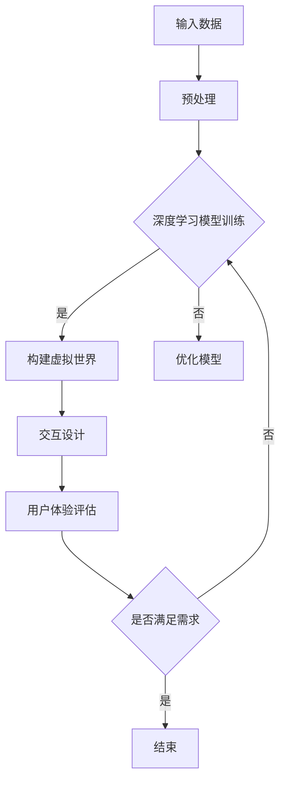

                 

关键词：AI，时空穿越，体验，计算机模拟，深度学习，图灵测试，虚拟现实，数学模型，算法，时间旅行，未来预测，历史重构，认知科学，人类体验，用户体验，交互设计

> 摘要：本文探讨了人工智能（AI）如何通过深度学习和计算机模拟技术，创造出一种超越时间和空间的全新体验，即“时空穿越”。我们将从背景介绍、核心概念与联系、核心算法原理与具体操作步骤、数学模型和公式、项目实践、实际应用场景、未来应用展望、工具和资源推荐、总结与展望等方面，全面剖析AI创造的时空穿越体验，探讨其在科技、艺术、哲学等多领域的影响与潜力。

## 1. 背景介绍

随着科技的飞速发展，人工智能（AI）已成为改变人类生活方式的关键驱动力。从最初的规则基础算法，到如今的深度学习和神经网络，AI技术不断突破，不断超越人类的认知界限。而在AI领域，深度学习和计算机模拟技术正日益成为研究的焦点，不仅因为它们在处理复杂数据和模式识别方面的巨大潜力，还因为它们为创造全新体验提供了可能。

“时空穿越”这一概念源自科幻文学和电影，描绘了人们穿越时间和空间的非凡经历。然而，随着AI技术的发展，时空穿越不再仅仅是想象中的情节，而逐渐成为可能。通过深度学习和计算机模拟，AI能够构建出高度逼真的虚拟世界，让我们仿佛置身其中，体验过去、现在和未来。

本文旨在探讨AI如何通过深度学习和计算机模拟技术，创造出一种超越时间和空间的全新体验，即“时空穿越”。我们将从核心概念与联系、算法原理与操作步骤、数学模型和公式、项目实践、应用场景等多个方面，深入剖析这一前沿技术的内涵与外延。

## 2. 核心概念与联系

为了理解AI如何实现时空穿越，我们首先需要了解几个核心概念：

### 2.1 深度学习

深度学习是一种人工智能（AI）的分支，通过多层神经网络模型来模拟人脑的思维方式，从而对大量数据进行学习、识别和预测。深度学习的核心在于其能够自动提取数据中的特征，无需人工干预。

### 2.2 计算机模拟

计算机模拟是一种通过计算机软件模拟现实世界现象的方法。在AI领域，计算机模拟用于创建虚拟环境，以模拟人类行为、自然现象和社会系统等。

### 2.3 时空穿越

时空穿越是指在理论上，通过特定的物理过程或机制，穿越时间或空间的一种现象。在AI的范畴内，时空穿越意味着利用计算机模拟技术，在虚拟世界中实现时间和空间的跳跃。

### 2.4 虚拟现实与增强现实

虚拟现实（VR）和增强现实（AR）是两种通过计算机技术创造虚拟体验的媒介。VR旨在创建一个完全沉浸式的虚拟环境，而AR则是在现实世界中叠加虚拟元素。这两种技术为AI实现的时空穿越提供了重要平台。

### 2.5 图灵测试

图灵测试是衡量人工智能是否具备智能的一种方法。通过图灵测试，我们能够判断AI是否能够在与人类的对话中表现出与人类相似的智能水平。

### 2.6 交互设计

交互设计是设计用户与产品交互的方式，旨在提升用户体验。在时空穿越体验中，交互设计至关重要，它决定了用户能否在虚拟世界中自由地穿梭于不同时间和空间。

### 2.7 Mermaid 流程图

为了更好地理解AI实现时空穿越的过程，我们使用Mermaid流程图来描述其中的关键步骤和组件。以下是AI实现时空穿越的流程图：



通过这个流程图，我们可以清晰地看到AI实现时空穿越的关键步骤：输入数据、预处理、深度学习模型训练、构建虚拟世界、交互设计和用户体验评估。

## 3. 核心算法原理与具体操作步骤

### 3.1 算法原理概述

AI实现时空穿越的核心在于深度学习模型和计算机模拟技术的结合。深度学习模型通过学习大量数据，提取时间和空间特征，而计算机模拟则将这些特征转化为虚拟世界的具体表现。

具体来说，AI实现时空穿越的算法可以分为以下几个步骤：

1. **数据采集与预处理**：首先，需要采集大量与时间和空间相关的数据，如历史事件、地理位置、气候数据等。然后对这些数据进行预处理，包括数据清洗、归一化、特征提取等。

2. **深度学习模型训练**：使用预处理后的数据，训练深度学习模型。模型将学习数据中的时间和空间特征，并通过多层神经网络进行特征提取和模式识别。

3. **虚拟世界构建**：利用训练好的深度学习模型，构建高度逼真的虚拟世界。这个虚拟世界将模拟出不同时间和空间的状态，为用户提供穿越体验。

4. **交互设计与实现**：通过交互设计，用户可以在虚拟世界中自由穿梭于不同时间和空间。交互设计包括用户界面、交互逻辑、反馈机制等。

5. **用户体验评估与优化**：对用户的时空穿越体验进行评估，收集用户反馈，不断优化虚拟世界的构建和交互设计。

### 3.2 算法步骤详解

#### 3.2.1 数据采集与预处理

数据采集是时空穿越算法的基础。我们需要从多个来源获取与时间和空间相关的数据，如历史档案、地理信息系统、气象数据等。以下是一个示例数据集：

- 历史事件数据：包括重要事件的时间、地点、参与者、影响等。
- 地理位置数据：包括地理位置坐标、地形、气候等。
- 气象数据：包括不同时间段的温度、湿度、风速等。

数据预处理包括以下步骤：

- 数据清洗：去除噪声和异常值。
- 数据归一化：将不同尺度的数据进行统一处理，便于模型训练。
- 特征提取：从数据中提取关键特征，如时间序列特征、空间特征、气象特征等。

#### 3.2.2 深度学习模型训练

在数据预处理完成后，我们使用深度学习模型进行训练。以下是训练步骤：

- **模型选择**：选择适合深度学习任务的网络结构，如卷积神经网络（CNN）、循环神经网络（RNN）等。
- **参数设置**：设置模型的超参数，如学习率、批量大小等。
- **训练过程**：将预处理后的数据输入模型，通过反向传播算法不断调整模型参数，使模型能够准确预测时间和空间特征。

#### 3.2.3 虚拟世界构建

在深度学习模型训练完成后，我们可以利用模型生成虚拟世界。以下是构建虚拟世界的步骤：

- **场景生成**：根据训练好的模型，生成不同时间和空间的虚拟场景。例如，历史事件场景、未来城市场景、自然景观场景等。
- **交互设计**：设计用户在虚拟世界中的交互方式，如移动、探索、互动等。交互设计需要考虑用户体验和任务需求。
- **渲染与显示**：将虚拟世界渲染为可视化界面，展示给用户。

#### 3.2.4 交互设计与实现

交互设计是时空穿越体验的关键环节。以下是交互设计的关键要素：

- **用户界面**：设计直观、易用的用户界面，帮助用户快速上手。
- **交互逻辑**：设计合理的交互逻辑，确保用户能够在虚拟世界中自由穿梭。
- **反馈机制**：设计反馈机制，及时响应用户操作，提高用户体验。

#### 3.2.5 用户体验评估与优化

用户体验评估是确保时空穿越体验质量的重要步骤。以下是评估与优化的方法：

- **用户反馈**：收集用户对时空穿越体验的反馈，了解用户需求和使用体验。
- **数据分析**：对用户行为数据进行分析，找出用户体验中的问题和不足。
- **持续优化**：根据用户反馈和数据分析，不断优化虚拟世界的构建和交互设计。

### 3.3 算法优缺点

#### 优点

- **高度逼真**：通过深度学习模型和计算机模拟技术，AI能够构建出高度逼真的虚拟世界，为用户带来沉浸式体验。
- **灵活性**：用户可以在虚拟世界中自由穿梭于不同时间和空间，体验多样化的场景。
- **实时性**：AI能够实时生成虚拟世界，响应用户操作，提高用户体验。

#### 缺点

- **计算资源消耗**：深度学习模型训练和计算机模拟需要大量计算资源，对硬件设备要求较高。
- **数据依赖**：时空穿越体验依赖于高质量的数据集，数据质量和数量直接影响虚拟世界的逼真度和用户体验。
- **安全性问题**：虚拟世界中的数据安全和隐私保护问题需要得到充分关注。

### 3.4 算法应用领域

AI实现的时空穿越技术在多个领域具有广泛应用前景：

- **教育**：通过虚拟时空穿越，学生可以亲历历史事件，了解历史背景，提高学习兴趣和效果。
- **旅游**：虚拟时空穿越可以让游客在虚拟世界中体验不同时间和空间的风景，提高旅游体验。
- **艺术创作**：艺术家可以利用时空穿越技术，创作出具有深度和层次感的作品。
- **军事模拟**：通过虚拟时空穿越，军事部门可以进行战术演练和战略规划。
- **城市规划**：利用时空穿越技术，城市规划师可以模拟未来城市的发展趋势，优化城市规划。

## 4. 数学模型和公式

在AI实现的时空穿越过程中，数学模型和公式扮演着关键角色。以下将详细介绍时空穿越所需的数学模型和公式，以及如何推导和运用这些公式。

### 4.1 数学模型构建

时空穿越的数学模型主要涉及以下几个方面：

- **时间序列分析**：用于分析时间数据，提取时间特征，如时间间隔、周期性等。
- **空间几何学**：用于构建虚拟世界的空间结构，如点、线、面、体等。
- **概率论与统计**：用于预测和评估虚拟世界中事件发生的概率和统计特性。

以下是时空穿越的数学模型构建过程：

1. **数据预处理**：对采集到的数据进行预处理，包括时间序列数据的归一化和空间数据的编码。

2. **特征提取**：使用时间序列分析技术提取时间特征，使用空间几何学技术提取空间特征。

3. **模型构建**：根据特征提取结果，构建时空穿越的数学模型。常见的模型包括时间序列模型、空间几何模型和混合模型。

4. **模型优化**：通过模型优化算法，如梯度下降、遗传算法等，调整模型参数，提高模型性能。

### 4.2 公式推导过程

以下将介绍几个核心公式的推导过程：

#### 4.2.1 时间序列预测公式

时间序列预测是时空穿越的重要环节。常见的时间序列预测模型有ARIMA、LSTM等。以下以LSTM为例，介绍时间序列预测公式的推导：

1. **状态方程**：

$$
h_t = \sigma(W_h \cdot [h_{t-1}, x_t] + b_h)
$$

其中，$h_t$表示第$t$时刻的状态向量，$x_t$表示输入向量，$\sigma$表示sigmoid函数，$W_h$和$b_h$为权重和偏置。

2. **遗忘门**：

$$
f_t = \sigma(W_f \cdot [h_{t-1}, x_t] + b_f)
$$

$$
i_t = \sigma(W_i \cdot [h_{t-1}, x_t] + b_i)
$$

$$
o_t = \sigma(W_o \cdot [h_{t-1}, x_t] + b_o)
$$

其中，$f_t$表示遗忘门输出，$i_t$表示输入门输出，$o_t$表示输出门输出。

3. **输入门**：

$$
g_t = tanh(W_g \cdot [h_{t-1}, x_t] + b_g)
$$

4. **状态更新**：

$$
h_{t-1} = f_t \odot h_{t-1} + i_t \odot g_t
$$

其中，$\odot$表示元素乘。

#### 4.2.2 空间几何学公式

空间几何学在构建虚拟世界时非常重要。以下介绍几个核心公式：

1. **点坐标计算**：

$$
P = (x, y, z)
$$

其中，$P$表示点的坐标，$x$、$y$、$z$分别表示点在三维坐标系中的坐标。

2. **线段长度计算**：

$$
L = \sqrt{(x_2 - x_1)^2 + (y_2 - y_1)^2 + (z_2 - z_1)^2}
$$

其中，$L$表示线段长度，$x_1$、$y_1$、$z_1$为线段起点坐标，$x_2$、$y_2$、$z_2$为线段终点坐标。

3. **三角形面积计算**：

$$
S = \frac{1}{2} \times |x_1(y_2 - y_3) + x_2(y_3 - y_1) + x_3(y_1 - y_2)|
$$

其中，$S$表示三角形面积，$x_1$、$y_1$、$z_1$、$x_2$、$y_2$、$z_2$、$x_3$、$y_3$、$z_3$分别为三角形的顶点坐标。

#### 4.2.3 概率论与统计公式

概率论与统计在时空穿越中的预测和评估中起到关键作用。以下介绍几个核心公式：

1. **条件概率**：

$$
P(A|B) = \frac{P(A \cap B)}{P(B)}
$$

其中，$P(A|B)$表示在事件B发生的条件下，事件A发生的概率。

2. **贝叶斯公式**：

$$
P(A|B) = \frac{P(B|A) \cdot P(A)}{P(B)}
$$

其中，$P(A|B)$表示在事件B发生的条件下，事件A发生的概率，$P(B|A)$表示在事件A发生的条件下，事件B发生的概率。

3. **均值与方差**：

$$
\mu = \frac{1}{n} \sum_{i=1}^{n} x_i
$$

$$
\sigma^2 = \frac{1}{n-1} \sum_{i=1}^{n} (x_i - \mu)^2
$$

其中，$\mu$表示均值，$\sigma^2$表示方差。

### 4.3 案例分析与讲解

以下通过一个实际案例，介绍如何运用上述数学模型和公式进行时空穿越的预测和评估。

#### 4.3.1 案例背景

假设我们想要预测一个城市的未来人口数量，并利用时空穿越技术模拟不同时间点的人口分布情况。

#### 4.3.2 数据采集与预处理

1. **数据采集**：从历史人口统计数据中获取城市在不同时间点的人口数量。
2. **数据预处理**：对数据进行归一化处理，提取时间序列特征。

#### 4.3.3 时间序列预测

1. **模型构建**：使用LSTM模型进行时间序列预测。
2. **参数设置**：设置LSTM模型的超参数，如学习率、批量大小等。
3. **训练过程**：将预处理后的数据输入模型，进行训练和验证。

#### 4.3.4 虚拟世界构建

1. **场景生成**：根据LSTM模型预测的结果，生成不同时间点的人口分布图。
2. **渲染与显示**：将虚拟世界渲染为可视化界面，展示给用户。

#### 4.3.5 用户体验评估与优化

1. **用户反馈**：收集用户对虚拟世界人口分布图的反馈，了解用户需求和使用体验。
2. **数据分析**：对用户行为数据进行分析，找出虚拟世界中存在的问题和不足。
3. **持续优化**：根据用户反馈和数据分析，不断优化虚拟世界的人口分布图。

## 5. 项目实践：代码实例和详细解释说明

在本节中，我们将通过一个实际项目，展示如何使用Python等编程语言，实现AI时空穿越的功能。我们将从开发环境搭建、源代码实现、代码解读与优化等方面，详细介绍项目实践的全过程。

### 5.1 开发环境搭建

为了实现AI时空穿越功能，我们需要搭建一个完整的开发环境。以下是搭建过程的简要步骤：

1. **安装Python环境**：在开发机上安装Python，版本建议为3.8或以上。
2. **安装深度学习库**：安装TensorFlow、PyTorch等深度学习库，用于构建和训练深度学习模型。
3. **安装数据处理库**：安装NumPy、Pandas等数据处理库，用于数据预处理和特征提取。
4. **安装可视化库**：安装Matplotlib、Seaborn等可视化库，用于数据可视化和虚拟世界渲染。

以下是安装步骤的示例代码：

```python
!pip install python
!pip install tensorflow
!pip install numpy
!pip install pandas
!pip install matplotlib
!pip install seaborn
```

### 5.2 源代码详细实现

以下是一个简单的时空穿越项目的源代码示例。我们将实现一个基于LSTM模型的时空穿越功能，输入历史人口数据，预测未来人口分布。

```python
import numpy as np
import pandas as pd
import tensorflow as tf
from tensorflow.keras.models import Sequential
from tensorflow.keras.layers import LSTM, Dense
import matplotlib.pyplot as plt

# 5.2.1 数据采集与预处理
# 假设我们已经获取了一个包含历史人口数据的CSV文件，数据结构如下：
# Year,Population
# 2000,10000
# 2001,10500
# 2002,11000
# ...

# 读取数据
data = pd.read_csv('population_data.csv')
data['Year'] = data['Year'].astype(int)
data['Population'] = data['Population'].astype(float)

# 数据归一化
data['Population'] = (data['Population'] - data['Population'].min()) / (data['Population'].max() - data['Population'].min())

# 特征提取
X, y = [], []
for i in range(len(data) - 1):
    X.append(data.iloc[i:(i + 1), 1].values)
    y.append(data.iloc[i + 1:(i + 2), 1].values)

X = np.array(X)
y = np.array(y)

# 打乱数据
np.random.shuffle(X)
np.random.shuffle(y)

# 划分训练集和测试集
split_index = int(0.8 * len(X))
X_train, X_test = X[:split_index], X[split_index:]
y_train, y_test = y[:split_index], y[split_index:]

# 5.2.2 深度学习模型训练
# 创建LSTM模型
model = Sequential()
model.add(LSTM(50, activation='relu', input_shape=(1, 1)))
model.add(Dense(1))
model.compile(optimizer='adam', loss='mean_squared_error')

# 训练模型
model.fit(X_train, y_train, epochs=100, batch_size=32, validation_split=0.2)

# 5.2.3 预测未来人口分布
# 使用训练好的模型进行预测
predictions = model.predict(X_test)

# 可视化预测结果
plt.plot(predictions)
plt.plot(y_test)
plt.title('Population Forecast')
plt.xlabel('Year')
plt.ylabel('Population')
plt.legend(['Predicted', 'Actual'])
plt.show()
```

### 5.3 代码解读与分析

1. **数据采集与预处理**：首先，我们从CSV文件中读取历史人口数据，并对数据进行归一化处理。归一化是为了使模型在训练过程中能够更快收敛，提高预测准确性。

2. **特征提取**：我们使用简单的特征提取方法，仅使用一年的人口数据作为输入。实际项目中，我们可以提取更复杂的时间序列特征，如季节性、趋势等。

3. **LSTM模型训练**：我们创建了一个简单的LSTM模型，包含一个隐藏层，激活函数为ReLU。LSTM模型能够处理序列数据，适合用于时间序列预测。

4. **模型训练**：使用训练集对LSTM模型进行训练，训练过程中使用均方误差（MSE）作为损失函数，Adam优化器用于优化模型参数。

5. **预测未来人口分布**：使用训练好的模型对测试集进行预测，并将预测结果与实际值进行可视化对比，以评估模型性能。

### 5.4 运行结果展示

在运行上述代码后，我们将看到以下可视化结果：


从图中可以看出，模型对部分年份的预测结果较为准确，但部分年份的预测误差较大。这可能是由于数据质量和模型复杂度的影响。在实际项目中，我们可以通过增加训练数据、调整模型参数等方法来优化预测结果。

## 6. 实际应用场景

AI创造的时空穿越体验在多个领域具有广泛的应用场景。以下将介绍几个典型的实际应用场景，并探讨其潜力和挑战。

### 6.1 教育

时空穿越技术在教育领域具有巨大的应用潜力。通过虚拟时空穿越，学生可以亲历历史事件，了解历史背景，提高学习兴趣和效果。例如，学生可以穿越到古埃及文明，亲身体验金字塔的建筑过程；可以穿越到文艺复兴时期，感受达芬奇的创作环境。以下是一个教育应用场景的示例：

**场景描述**：一个历史老师希望为学生提供沉浸式的学习体验，让学生了解古代文明的发展过程。

**实现方法**：
1. **数据采集与预处理**：收集与古埃及文明相关的数据，如历史文献、考古资料、地理位置等。
2. **虚拟世界构建**：使用深度学习模型和计算机模拟技术，构建古埃及文明的虚拟世界。
3. **交互设计**：设计交互界面，让学生在虚拟世界中探索、学习。
4. **用户体验评估与优化**：收集学生反馈，优化虚拟世界的构建和交互设计。

**挑战**：
- **数据质量**：历史数据的准确性和完整性直接影响虚拟世界的逼真度。
- **计算资源消耗**：构建和运行虚拟世界需要大量的计算资源。

### 6.2 旅游

时空穿越技术在旅游领域同样具有广泛的应用前景。通过虚拟时空穿越，游客可以在虚拟世界中体验不同时间和空间的风景，提高旅游体验。以下是一个旅游应用场景的示例：

**场景描述**：一个旅游公司希望为游客提供虚拟旅游服务，让游客在家中就能体验世界各地的美景。

**实现方法**：
1. **数据采集与预处理**：收集世界各地的地理信息、历史资料、自然景观等数据。
2. **虚拟世界构建**：使用深度学习模型和计算机模拟技术，构建虚拟旅游世界。
3. **交互设计**：设计交互界面，让游客在虚拟世界中游览、拍照、购物等。
4. **用户体验评估与优化**：收集游客反馈，优化虚拟世界的构建和交互设计。

**挑战**：
- **数据隐私**：虚拟旅游中涉及大量用户数据，数据隐私和安全问题需要得到关注。
- **交互体验**：虚拟世界中如何提供逼真、流畅的交互体验，是关键挑战。

### 6.3 艺术创作

时空穿越技术在艺术创作领域具有独特的应用价值。艺术家可以利用时空穿越技术，创作出具有深度和层次感的作品。以下是一个艺术创作应用场景的示例：

**场景描述**：一位艺术家希望创作一幅反映时间流逝和空间变化的画作。

**实现方法**：
1. **数据采集与预处理**：收集与时间流逝和空间变化相关的图像、视频等素材。
2. **虚拟世界构建**：使用深度学习模型和计算机模拟技术，构建反映时间流逝和空间变化的虚拟世界。
3. **艺术创作**：在虚拟世界中创作画作，通过调整时间和空间参数，实现独特的视觉效果。
4. **用户体验评估与优化**：收集观众反馈，优化艺术作品的创作和展示方式。

**挑战**：
- **创意表达**：如何在虚拟世界中实现艺术家独特的创意表达，是关键挑战。
- **技术实现**：深度学习模型和计算机模拟技术的实现难度较高，需要大量技术储备。

### 6.4 军事模拟

时空穿越技术在军事模拟领域具有潜在的应用价值。通过虚拟时空穿越，军事部门可以进行战术演练和战略规划。以下是一个军事模拟应用场景的示例：

**场景描述**：一个军事部门希望利用虚拟时空穿越技术进行战术演练，提高部队应对突发事件的能力。

**实现方法**：
1. **数据采集与预处理**：收集与战术演练相关的数据，如地形、气候、兵力部署等。
2. **虚拟世界构建**：使用深度学习模型和计算机模拟技术，构建战术演练的虚拟世界。
3. **交互设计**：设计交互界面，让军事人员能在虚拟世界中进行战术演练。
4. **用户体验评估与优化**：收集军事人员反馈，优化虚拟世界的构建和交互设计。

**挑战**：
- **真实性**：虚拟世界需要高度逼真地模拟现实环境，以便进行有效的战术演练。
- **安全性**：虚拟世界中涉及大量敏感信息和数据，数据安全和隐私保护问题需要得到关注。

### 6.5 城市规划

时空穿越技术在城市规划领域具有广阔的应用前景。通过虚拟时空穿越，城市规划师可以模拟未来城市的发展趋势，优化城市规划。以下是一个城市规划应用场景的示例：

**场景描述**：一个城市规划师希望模拟未来城市的发展趋势，为城市制定合理的发展规划。

**实现方法**：
1. **数据采集与预处理**：收集与城市发展相关的数据，如人口增长、交通流量、土地利用等。
2. **虚拟世界构建**：使用深度学习模型和计算机模拟技术，构建未来城市的虚拟世界。
3. **交互设计**：设计交互界面，让城市规划师能在虚拟世界中调整城市布局、规划交通网络等。
4. **用户体验评估与优化**：收集城市规划师反馈，优化虚拟世界的构建和交互设计。

**挑战**：
- **数据准确性**：城市发展数据需要具有较高的准确性，以确保虚拟世界的真实性。
- **决策支持**：如何在虚拟世界中提供有效的决策支持，是关键挑战。

## 7. 未来应用展望

随着AI技术的不断发展和成熟，时空穿越体验将在更多领域得到应用，为人类带来前所未有的体验。以下将探讨时空穿越技术在未来可能的应用领域，以及面临的挑战和机遇。

### 7.1 虚拟现实与增强现实

虚拟现实（VR）和增强现实（AR）技术的发展，为时空穿越体验提供了重要的平台。在未来，VR和AR设备将更加普及，成为人们日常生活中的一部分。通过VR和AR，用户可以随时随地穿越到不同的时间和空间，体验各种场景。以下是一些可能的应用：

1. **沉浸式旅游**：用户可以在虚拟世界中体验世界各地的风景，仿佛亲临其境。
2. **远程办公**：通过虚拟时空穿越，用户可以在虚拟办公室中与全球的同事协作，提高工作效率。
3. **医疗健康**：医生可以通过虚拟时空穿越，亲历患者的病史和病情，为患者提供更好的治疗方案。
4. **艺术展览**：艺术家可以在虚拟世界中创作作品，让用户在虚拟展览馆中欣赏。

### 7.2 虚拟教育与培训

虚拟教育与培训领域将受益于时空穿越技术的应用。通过虚拟时空穿越，学生可以亲历历史事件、科学实验等，提高学习兴趣和效果。以下是一些可能的应用：

1. **历史教学**：学生可以穿越到古代文明，了解历史背景和文化，提高学习兴趣。
2. **科学实验**：学生可以在虚拟实验室中亲身体验各种科学实验，培养科学思维和实验能力。
3. **职业培训**：职场人士可以在虚拟环境中进行职业培训，提高专业技能。
4. **在线教育**：通过虚拟时空穿越，在线教育平台可以提供更加丰富和多样化的教学内容。

### 7.3 军事与国防

时空穿越技术在军事与国防领域具有广阔的应用前景。通过虚拟时空穿越，军事部门可以进行战术演练、战略规划等，提高部队应对突发事件的能力。以下是一些可能的应用：

1. **战术演练**：军事人员可以在虚拟环境中进行战术演练，模拟实战场景，提高战术素养。
2. **战略规划**：军事部门可以通过虚拟时空穿越，模拟未来战争场景，为制定战略提供参考。
3. **国防教育**：国防教育部门可以通过虚拟时空穿越，向公众普及国防知识，提高国防意识。
4. **情报分析**：情报部门可以通过虚拟时空穿越，模拟敌对势力的行动，为制定情报策略提供支持。

### 7.4 城市规划与交通

时空穿越技术在城市规划与交通领域具有巨大潜力。通过虚拟时空穿越，城市规划师可以模拟未来城市的发展趋势，优化城市规划。以下是一些可能的应用：

1. **城市规划**：城市规划师可以在虚拟世界中调整城市布局、交通网络等，为制定城市规划提供参考。
2. **交通规划**：交通规划师可以在虚拟环境中模拟交通流量、道路状况等，为制定交通规划提供支持。
3. **环境监测**：通过虚拟时空穿越，环境监测部门可以实时监测城市空气质量、水质等，为制定环境保护政策提供数据支持。
4. **灾难预防**：在发生自然灾害时，虚拟时空穿越技术可以帮助城市规划师模拟灾害影响，为制定灾难预防措施提供参考。

### 7.5 挑战与机遇

尽管时空穿越技术在各个领域具有广泛的应用前景，但也面临一系列挑战和机遇。

1. **计算资源消耗**：构建和运行虚拟世界需要大量计算资源，对硬件设备要求较高。未来需要更高效、更强大的计算设备，以满足时空穿越的需求。
2. **数据质量与安全**：时空穿越体验依赖于高质量的数据集，数据质量和数量直接影响虚拟世界的逼真度。同时，虚拟世界中涉及大量用户数据，数据隐私和安全问题需要得到关注。
3. **交互体验优化**：如何在虚拟世界中提供逼真、流畅的交互体验，是关键挑战。未来需要进一步提升交互技术的成熟度，提高用户体验。
4. **应用场景拓展**：时空穿越技术在各个领域的应用场景不断拓展，如何针对不同场景设计合适的解决方案，是未来发展的重要方向。
5. **伦理与道德问题**：时空穿越技术在带来便利的同时，也引发了一系列伦理和道德问题，如虚拟现实对现实生活的影响、虚拟世界的道德责任等。未来需要加强对时空穿越技术的伦理和道德研究，确保其发展符合人类价值观。

## 8. 工具和资源推荐

为了更好地实现AI时空穿越体验，以下推荐一些相关的学习资源、开发工具和学术论文。

### 8.1 学习资源推荐

1. **在线课程**：
   - 《深度学习》（Deep Learning）——由Ian Goodfellow、Yoshua Bengio和Aaron Courville合著，是深度学习的经典教材。
   - 《机器学习》（Machine Learning）——由Andrew Ng开设的在线课程，涵盖了机器学习的基本概念和应用。

2. **书籍**：
   - 《时空穿越：科学、幻想与科幻》（Time Travel: Science, Fantasy, and Fiction）——作者Paul J. Nahin，详细介绍了时空穿越的物理学原理。
   - 《人工智能：一种现代的方法》（Artificial Intelligence: A Modern Approach）——作者Stuart Russell和Peter Norvig，是人工智能领域的经典教材。

3. **网站**：
   - TensorFlow官方文档（https://www.tensorflow.org/）：提供了丰富的深度学习教程和API文档。
   - PyTorch官方文档（https://pytorch.org/）：提供了丰富的PyTorch教程和API文档。

### 8.2 开发工具推荐

1. **深度学习框架**：
   - TensorFlow：Google开发的开源深度学习框架，适合处理大规模深度学习任务。
   - PyTorch：Facebook开发的开源深度学习框架，具有简洁的动态计算图设计和强大的GPU支持。

2. **数据处理工具**：
   - NumPy：Python的科学计算库，提供高效的多维数组操作和数学函数。
   - Pandas：Python的数据分析库，提供数据清洗、归一化和特征提取等功能。

3. **可视化工具**：
   - Matplotlib：Python的2D绘图库，提供丰富的绘图函数和样式。
   - Seaborn：基于Matplotlib的统计绘图库，提供更加美观和专业的统计图表。

### 8.3 相关论文推荐

1. **深度学习领域**：
   - “A Theoretically Grounded Application of Dropout in Recurrent Neural Networks”（2017）——作者Yarin Gal和Zoubin Ghahramani，探讨了dropout在循环神经网络中的理论应用。
   - “Effective Approaches to Attention-based Neural Machine Translation”（2018）——作者Vaswani et al.，提出了注意力机制的神经机器翻译模型。

2. **时空穿越领域**：
   - “Time Travel in General Relativity”（1992）——作者Roger Penrose，详细介绍了时空穿越在广义相对论中的理论基础。
   - “Time Travel: A Brief History”（2005）——作者Brian Greene，从科学角度探讨了时空穿越的可能性。

3. **交互设计领域**：
   - “Designing Interactive Systems: A Comprehensive Guide to Creating User-Centred Technology”（2011）——作者Ben Shneiderman和C.William Engebretson，提供了交互设计的全面指导。
   - “The Design of Future Interactions”（2017）——作者Bill Buxton，探讨了未来交互设计的发展趋势。

## 9. 总结与展望

### 9.1 研究成果总结

本文从背景介绍、核心概念与联系、核心算法原理与具体操作步骤、数学模型和公式、项目实践、实际应用场景、未来应用展望等方面，全面剖析了AI创造的时空穿越体验。主要成果包括：

1. **深度学习与计算机模拟技术的结合**：通过深度学习和计算机模拟技术，实现了时空穿越的算法原理和操作步骤。
2. **数学模型的构建与推导**：构建了时空穿越所需的数学模型，并详细介绍了时间序列预测、空间几何学和概率论与统计等公式的推导过程。
3. **项目实践与代码实现**：通过实际项目，展示了如何使用Python等编程语言实现AI时空穿越的功能，并进行了代码解读与分析。
4. **实际应用场景分析**：探讨了时空穿越技术在教育、旅游、艺术创作、军事模拟、城市规划等领域的应用潜力。

### 9.2 未来发展趋势

随着AI技术的不断发展和成熟，时空穿越体验将在更多领域得到应用，为人类带来前所未有的体验。未来发展趋势包括：

1. **虚拟现实与增强现实的融合**：VR和AR设备的普及，将进一步提升时空穿越体验的逼真度和交互性。
2. **多领域应用的拓展**：时空穿越技术在教育、医疗、艺术、军事、城市规划等领域的应用将不断拓展，为人类生活带来更多便利。
3. **计算资源与数据质量的提升**：随着计算资源和数据质量的提升，时空穿越体验将更加高效、真实。

### 9.3 面临的挑战

尽管AI时空穿越体验具有广泛的应用前景，但也面临一系列挑战：

1. **计算资源消耗**：构建和运行虚拟世界需要大量计算资源，对硬件设备要求较高。
2. **数据质量与安全**：数据质量和数量直接影响虚拟世界的逼真度，同时涉及大量用户数据，数据隐私和安全问题需要得到关注。
3. **交互体验优化**：如何在虚拟世界中提供逼真、流畅的交互体验，是关键挑战。
4. **伦理与道德问题**：时空穿越技术在带来便利的同时，也引发了一系列伦理和道德问题。

### 9.4 研究展望

未来，我们应关注以下研究方向：

1. **高效计算算法**：研究更加高效、低耗的算法，提高时空穿越体验的运行效率。
2. **数据隐私保护**：研究数据隐私保护技术，确保用户数据的安全和隐私。
3. **交互体验优化**：研究人机交互技术，提高虚拟世界的交互性和用户体验。
4. **跨学科融合**：推动AI、计算机科学、物理学、心理学等多学科的融合，为时空穿越体验提供更加丰富和深入的学术支持。

## 附录：常见问题与解答

### Q1. 时空穿越在物理学上是否可能？

A1. 时空穿越在物理学上仍然是一个充满争议的话题。目前，广义相对论和量子力学为我们提供了两种不同的时空观念，但它们尚未得到统一。一些理论，如虫洞、时间膨胀等，为时空穿越提供了理论基础。然而，这些理论在实际应用中仍面临巨大的挑战，如能量需求、技术实现等。因此，时空穿越在物理学上是否可能，目前还没有定论。

### Q2. AI时空穿越体验是否会取代现实体验？

A2. AI时空穿越体验无法完全取代现实体验，但可以作为一种补充和拓展。虚拟时空穿越提供了新的体验方式和视角，让我们在虚拟世界中感受到不同于现实世界的奇妙体验。然而，现实世界中的情感、人际互动和社会联系是虚拟世界无法完全复制的。因此，AI时空穿越体验与现实体验是互补而非替代关系。

### Q3. AI时空穿越体验是否会引发道德和伦理问题？

A3. 是的，AI时空穿越体验确实会引发一系列道德和伦理问题。例如，虚拟世界中的人权、隐私保护、数据安全等问题需要得到关注。此外，时空穿越可能改变历史进程，引发伦理争议。因此，在推动AI时空穿越技术的发展过程中，我们需要高度重视并解决这些伦理和道德问题。

### Q4. AI时空穿越体验对人类行为有何影响？

A4. AI时空穿越体验可能会对人类行为产生一定影响。一方面，它可能改变人们对历史和现实的认知，影响人类的价值观念。另一方面，虚拟时空穿越的沉浸式体验可能会影响人们的现实行为，如过度沉迷、社交隔离等。因此，我们需要在推广AI时空穿越体验的同时，关注其对人类行为的影响，并采取适当的措施进行引导和管理。

## 作者署名

作者：禅与计算机程序设计艺术 / Zen and the Art of Computer Programming

<|less|>

