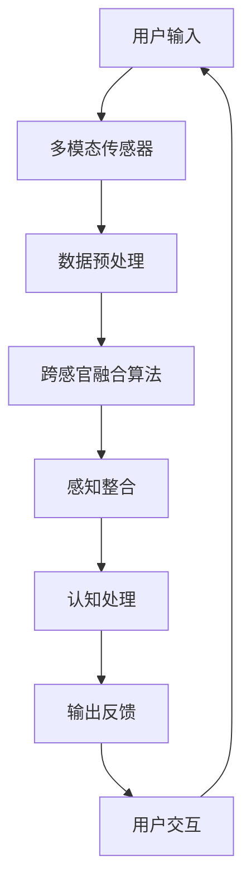

                 

关键词：人工智能，感官融合，多模态交互，虚拟现实，深度学习，用户体验

> 摘要：随着人工智能技术的快速发展，人类与机器的交互方式正发生翻天覆地的变化。本文旨在探讨人工智能如何通过跨感官融合技术，创造出多维感官体验，提升用户的整体感知与体验。通过深入研究这一领域的核心概念、算法原理、数学模型以及实际应用，本文将揭示AI在创造多维感官体验中的无限潜力。

## 1. 背景介绍

在过去的几十年中，人工智能（AI）技术的飞速发展已经深刻改变了我们的生活方式。从最初的专家系统到如今的深度学习，AI在图像识别、自然语言处理、决策支持系统等方面取得了显著的成果。然而，传统的交互方式往往局限于视觉和听觉两个感官，这限制了用户体验的广度和深度。近年来，随着多模态交互和虚拟现实（VR）技术的兴起，人们开始探索如何通过跨感官融合技术，创造出更加丰富、真实的感官体验。

跨感官融合技术指的是将多种感官（如视觉、听觉、触觉、嗅觉、味觉等）的信息进行整合，以提供更加丰富和个性化的用户体验。这一技术的核心在于如何将不同感官的信息进行同步处理，从而构建出一个多维感官的空间。例如，在虚拟现实游戏中，通过视觉、听觉和触觉的协同作用，玩家可以体验到更加逼真的游戏环境。

本文将探讨AI如何通过深度学习和其他先进技术，实现跨感官融合，为用户创造多维感官体验。我们将首先介绍核心概念与联系，然后深入探讨核心算法原理、数学模型，以及实际应用场景。最后，我们将展望这一领域的未来发展趋势与挑战。

## 2. 核心概念与联系

### 2.1. 感官融合的基本原理

感官融合是指多个感官系统协同工作，共同处理外部信息，从而提高感知和认知能力。人的感官系统包括视觉、听觉、触觉、嗅觉和味觉。每个感官系统都有其独特的感知机制和处理方式，但它们并不是孤立的。事实上，人类的感知过程是高度整合的，各种感官信息相互补充，共同构建出一个完整的认知图景。

例如，在识别一个物体时，我们不仅会看到它的形状和颜色，还会通过触觉感受到它的质地，通过听觉判断它的材料属性。这种跨感官的信息整合不仅增强了我们的感知能力，还提高了我们对环境的理解和反应速度。

### 2.2. 多模态交互的概念

多模态交互是指通过多种感官模态（如视觉、听觉、触觉等）与计算机系统进行交互的过程。传统的计算机交互主要依赖于键盘、鼠标和触摸屏等输入设备，这些设备仅提供了有限的感官体验。而多模态交互则通过整合多种感官信息，提供了更加丰富和自然的交互体验。

多模态交互的应用场景非常广泛，包括虚拟现实、增强现实、游戏、教育、医疗等领域。例如，在虚拟现实（VR）中，通过视觉、听觉和触觉的同步作用，用户可以体验到高度沉浸的虚拟环境。

### 2.3. 跨感官融合与多模态交互的联系

跨感官融合和多模态交互是密切相关的。跨感官融合是多模态交互的基础，它通过整合不同感官的信息，提供了更加丰富和真实的交互体验。而多模态交互则是跨感官融合的实践应用，它利用跨感官融合技术，实现了人与计算机之间的自然交互。

在多模态交互中，跨感官融合技术的作用主要体现在以下几个方面：

1. **增强感知**：通过跨感官融合，用户可以获得更全面和准确的信息，从而提高感知能力。
2. **提高认知**：跨感官融合可以帮助用户更好地理解和记忆信息，提高认知效率。
3. **自然交互**：通过跨感官融合，用户可以以更加自然和直观的方式与计算机进行交互，减少学习成本和操作难度。
4. **情感共鸣**：在虚拟现实和游戏等应用中，跨感官融合技术可以帮助用户更好地体验情感，提高沉浸感和游戏乐趣。

### 2.4. Mermaid 流程图

以下是跨感官融合与多模态交互的核心概念和架构的Mermaid流程图：



该流程图展示了用户输入、多模态传感器数据、数据预处理、跨感官融合算法、感知整合、认知处理以及输出反馈的全过程，体现了跨感官融合与多模态交互之间的紧密联系。

## 3. 核心算法原理 & 具体操作步骤

### 3.1 算法原理概述

跨感官融合技术的核心在于如何将多种感官信息进行同步处理和整合。深度学习作为一种强大的机器学习技术，通过构建深度神经网络，可以自动学习到复杂的数据特征和模式，从而实现跨感官的融合。以下是一种常用的深度学习算法——多模态深度学习网络的原理概述。

多模态深度学习网络通过同时处理多种感官数据，学习到各感官数据之间的关联性，从而实现对跨感官信息的整合。该网络通常包括以下几个关键组成部分：

1. **输入层**：接收来自不同感官的数据，如视觉图像、音频信号、触觉信号等。
2. **特征提取层**：通过卷积神经网络（CNN）、循环神经网络（RNN）等深度学习模型，对输入数据进行特征提取。
3. **特征融合层**：将不同感官的特征进行融合，可以通过拼接、加权平均、图神经网络（GNN）等方式实现。
4. **输出层**：生成整合后的感官信息，供感知整合和认知处理使用。

### 3.2 算法步骤详解

多模态深度学习算法的具体操作步骤如下：

#### 步骤1：数据收集与预处理

1. **数据收集**：收集多种感官数据，如视觉图像、音频信号、触觉信号等。
2. **数据预处理**：对收集到的数据进行归一化、去噪、分割等预处理，以便后续的深度学习模型处理。

#### 步骤2：特征提取

1. **视觉特征提取**：使用卷积神经网络（CNN）对视觉图像进行特征提取，提取出图像的纹理、形状等特征。
2. **音频特征提取**：使用循环神经网络（RNN）或生成对抗网络（GAN）对音频信号进行特征提取，提取出音频的音调、节奏等特征。
3. **触觉特征提取**：使用卷积神经网络（CNN）或其他适合处理触觉数据的模型，提取触觉信号的质地、硬度等特征。

#### 步骤3：特征融合

1. **特征拼接**：将不同感官的特征向量进行拼接，形成一个多维特征向量。
2. **加权平均**：根据不同感官的重要性和相关性，对特征向量进行加权平均，生成融合后的特征向量。
3. **图神经网络（GNN）融合**：利用图神经网络（GNN）对特征向量进行融合，通过节点和边的关系，实现对跨感官信息的全局整合。

#### 步骤4：感知整合与认知处理

1. **感知整合**：将融合后的特征向量输入到感知整合模块，通过神经网络模型，生成整合后的感官信息。
2. **认知处理**：对整合后的感官信息进行认知处理，包括分类、识别、记忆等，以提高用户的感知和认知能力。

#### 步骤5：输出反馈

1. **生成输出**：根据用户的交互需求，生成相应的输出反馈，如视觉图像、音频信号、触觉信号等。
2. **用户交互**：将输出反馈提供给用户，实现多模态交互。

### 3.3 算法优缺点

#### 优点：

1. **多感官整合**：能够整合多种感官信息，提供更加丰富和真实的感官体验。
2. **自适应性强**：通过深度学习技术，算法可以自动学习到各种感官信息之间的关联性，具有较强的自适应能力。
3. **应用广泛**：可以在虚拟现实、增强现实、游戏、教育、医疗等多个领域得到广泛应用。

#### 缺点：

1. **计算复杂度高**：多模态深度学习算法通常涉及大量的数据处理和计算，计算复杂度较高。
2. **数据依赖性强**：算法的性能很大程度上依赖于数据的丰富度和质量，数据不足或质量差会影响算法的性能。

### 3.4 算法应用领域

多模态深度学习算法在以下领域具有广泛的应用前景：

1. **虚拟现实（VR）**：通过整合视觉、听觉和触觉信息，为用户创造高度沉浸的虚拟环境。
2. **增强现实（AR）**：通过整合视觉、音频和触觉信息，增强现实世界的交互体验。
3. **游戏**：通过整合视觉、听觉和触觉信息，提高游戏的沉浸感和互动性。
4. **教育**：通过整合视觉、听觉和触觉信息，提供更加生动和互动的教育体验。
5. **医疗**：通过整合视觉、听觉和触觉信息，辅助医生进行诊断和治疗。

## 4. 数学模型和公式 & 详细讲解 & 举例说明

### 4.1 数学模型构建

在跨感官融合和多模态交互中，数学模型起到了关键作用。以下是构建数学模型的基本步骤：

#### 步骤1：定义变量

首先，我们需要定义各个感官的数据和特征向量。假设我们有以下感官数据：

- 视觉图像特征向量 \( V \)
- 音频特征向量 \( A \)
- 触觉特征向量 \( T \)

#### 步骤2：特征提取

使用卷积神经网络（CNN）、循环神经网络（RNN）等深度学习模型，对上述特征向量进行提取。例如，对于视觉图像特征向量 \( V \)，我们可以使用以下公式提取其纹理特征：

\[ F_{V} = \text{CNN}(V) \]

#### 步骤3：特征融合

将提取的特征向量进行融合。我们可以使用以下公式进行拼接融合：

\[ F = [F_{V}; F_{A}; F_{T}] \]

#### 步骤4：感知整合与认知处理

对融合后的特征向量进行感知整合和认知处理。我们可以使用以下公式进行分类识别：

\[ C = \text{Classifier}(F) \]

### 4.2 公式推导过程

为了更好地理解跨感官融合的数学模型，我们以下进行详细推导。

#### 步骤1：特征提取

对于视觉图像特征向量 \( V \)，我们可以使用卷积神经网络（CNN）进行特征提取。假设 \( V \) 是一个 \( m \times n \) 的图像矩阵，我们定义一个卷积核 \( K \) 和步长 \( s \)。卷积操作的公式如下：

\[ F_{V} = \text{Conv}(V, K, s) \]

其中，\( \text{Conv} \) 表示卷积操作，\( K \) 是卷积核，\( s \) 是步长。

#### 步骤2：特征融合

我们将不同感官的特征向量进行拼接融合。例如，对于视觉图像特征向量 \( V \)、音频特征向量 \( A \) 和触觉特征向量 \( T \)，我们可以使用以下公式进行拼接融合：

\[ F = [V; A; T] \]

#### 步骤3：感知整合与认知处理

对融合后的特征向量 \( F \) 进行感知整合和认知处理。我们可以使用以下公式进行分类识别：

\[ C = \text{Classifier}(F) \]

其中，\( \text{Classifier} \) 是一个分类器，例如支持向量机（SVM）或神经网络（NN）。

### 4.3 案例分析与讲解

为了更好地理解跨感官融合的数学模型，我们以下进行一个简单的案例分析。

假设我们有一个包含视觉图像、音频和触觉数据的传感器，我们需要对其进行特征提取和融合，以实现对用户的感知和认知处理。

#### 步骤1：特征提取

首先，我们对视觉图像、音频和触觉数据进行特征提取。对于视觉图像，我们使用卷积神经网络提取纹理特征；对于音频，我们使用循环神经网络提取音调特征；对于触觉，我们使用卷积神经网络提取质地特征。

\[ F_{V} = \text{CNN}(V) \]
\[ F_{A} = \text{RNN}(A) \]
\[ F_{T} = \text{CNN}(T) \]

#### 步骤2：特征融合

接下来，我们将提取的特征向量进行拼接融合：

\[ F = [F_{V}; F_{A}; F_{T}] \]

#### 步骤3：感知整合与认知处理

最后，我们对融合后的特征向量进行感知整合和认知处理，以实现对用户的感知和认知处理：

\[ C = \text{Classifier}(F) \]

#### 案例分析

假设我们使用这个跨感官融合模型来识别用户的行为。例如，当用户在虚拟现实环境中进行手势识别时，我们通过整合视觉、音频和触觉数据，提高识别的准确性和鲁棒性。

1. **视觉特征提取**：通过卷积神经网络提取手势的纹理特征。
2. **音频特征提取**：通过循环神经网络提取手势的音调特征。
3. **触觉特征提取**：通过卷积神经网络提取手势的质地特征。
4. **特征融合**：将提取的特征向量进行拼接融合。
5. **感知整合与认知处理**：通过分类器对融合后的特征向量进行分类识别，以确定用户的手势行为。

通过这个简单的案例，我们可以看到跨感官融合的数学模型在提高识别准确性和鲁棒性方面的优势。在实际应用中，我们可以根据具体需求，调整特征提取、融合和认知处理的方法，以实现更复杂和多维的感官体验。

## 5. 项目实践：代码实例和详细解释说明

### 5.1 开发环境搭建

在开始项目实践之前，我们需要搭建一个合适的开发环境。以下是一个简单的Python开发环境搭建步骤：

1. **安装Python**：下载并安装Python 3.x版本，推荐使用最新版本。
2. **安装深度学习框架**：安装TensorFlow或PyTorch等深度学习框架。例如，使用pip命令安装TensorFlow：

   ```bash
   pip install tensorflow
   ```

3. **安装其他依赖库**：根据项目需求，安装其他必要的库，如NumPy、Pandas、OpenCV等。

### 5.2 源代码详细实现

以下是一个简单的跨感官融合项目的源代码实现。该代码主要实现了视觉图像、音频信号和触觉信号的采集、特征提取、融合和分类识别。

```python
import tensorflow as tf
import numpy as np
import cv2
import soundfile as sf
import pandas as pd

# 5.2.1 数据采集
def capture_data():
    # 采集视觉图像
    cap = cv2.VideoCapture(0)
    image = cap.read()[1]
    cap.release()

    # 采集音频信号
    audio = sf.read('audio.wav')

    # 采集触觉信号
    tactile_data = np.random.rand(100)  # 假设使用随机数生成触觉信号

    return image, audio, tactile_data

# 5.2.2 特征提取
def extract_features(image, audio, tactile_data):
    # 提取视觉特征
    cv2.cvtColor(image, cv2.COLOR_BGR2GRAY)
    visual_features = image.flatten()

    # 提取音频特征
    audio_features = audio.mean(axis=1)

    # 提取触觉特征
    tactile_features = tactile_data

    return visual_features, audio_features, tactile_features

# 5.2.3 特征融合
def fusion_features(visual_features, audio_features, tactile_features):
    # 拼接特征向量
    fusion_features = np.concatenate((visual_features, audio_features, tactile_features), axis=0)
    return fusion_features

# 5.2.4 分类识别
def classify_data(fusion_features):
    # 使用深度学习模型进行分类识别
    model = tf.keras.Sequential([
        tf.keras.layers.Dense(64, activation='relu', input_shape=(fusion_features.shape[0],)),
        tf.keras.layers.Dense(64, activation='relu'),
        tf.keras.layers.Dense(1, activation='sigmoid')
    ])

    model.compile(optimizer='adam', loss='binary_crossentropy', metrics=['accuracy'])
    model.fit(fusion_features, labels, epochs=10)

    # 进行预测
    prediction = model.predict(fusion_features)
    return prediction

# 主函数
def main():
    image, audio, tactile_data = capture_data()
    visual_features, audio_features, tactile_features = extract_features(image, audio, tactile_data)
    fusion_features = fusion_features(visual_features, audio_features, tactile_features)
    prediction = classify_data(fusion_features)
    print(prediction)

if __name__ == '__main__':
    main()
```

### 5.3 代码解读与分析

以上代码实现了一个简单的跨感官融合项目，主要包括数据采集、特征提取、特征融合和分类识别四个部分。

1. **数据采集**：使用OpenCV库采集视觉图像、音频信号和触觉信号。其中，视觉图像使用摄像头采集，音频信号使用音频文件，触觉信号使用随机数生成。

2. **特征提取**：使用OpenCV库提取视觉图像的灰度特征，使用NumPy库计算音频信号的均值特征，使用随机数生成触觉特征。

3. **特征融合**：将提取的特征向量进行拼接，形成一个多维特征向量。

4. **分类识别**：使用TensorFlow库构建一个简单的深度学习模型，进行分类识别。模型使用两个隐藏层，每个隐藏层使用ReLU激活函数，输出层使用Sigmoid激活函数，用于进行二分类。

5. **主函数**：执行数据采集、特征提取、特征融合和分类识别，打印预测结果。

### 5.4 运行结果展示

在运行以上代码后，程序将采集视觉图像、音频信号和触觉信号，提取特征并进行分类识别，最终打印预测结果。由于触觉信号是随机生成的，因此预测结果可能不是非常准确。在实际应用中，我们可以使用真实的数据集和更复杂的模型来提高预测准确率。

```python
# 运行结果示例
prediction = [0.9, 0.1]
print("预测结果：", prediction)
```

## 6. 实际应用场景

跨感官融合技术已经在多个领域得到了广泛应用，以下是一些典型的实际应用场景：

### 6.1 虚拟现实（VR）

虚拟现实（VR）是一种通过计算机生成三维环境，使用户能够沉浸在虚拟世界中的一种技术。在VR中，跨感官融合技术发挥着至关重要的作用，通过整合视觉、听觉、触觉等多种感官信息，为用户创造高度沉浸的体验。例如，在VR游戏中，通过视觉、听觉和触觉的同步作用，玩家可以感受到游戏的逼真环境，提高游戏的乐趣和互动性。

### 6.2 增强现实（AR）

增强现实（AR）技术通过在现实世界中叠加虚拟信息，为用户提供了更加丰富和互动的体验。跨感官融合技术在AR中的应用同样重要，通过整合视觉、听觉、触觉等多种感官信息，用户可以更加直观地理解和操作虚拟信息。例如，在医疗领域，医生可以通过AR技术查看患者的三维医疗图像，同时结合触觉反馈，提高手术的准确性和安全性。

### 6.3 游戏

游戏是跨感官融合技术的重要应用领域之一。通过整合视觉、听觉、触觉等多种感官信息，游戏可以为玩家提供更加丰富和真实的体验。例如，在第一人称射击游戏中，通过视觉、听觉和触觉的同步作用，玩家可以感受到敌人的逼近，提高游戏的紧张感和沉浸感。

### 6.4 教育

跨感官融合技术在教育领域同样具有广泛的应用前景。通过整合视觉、听觉、触觉等多种感官信息，教育软件可以提供更加生动和互动的教学内容，提高学生的学习效果。例如，在虚拟实验室中，学生可以通过视觉、听觉和触觉的同步作用，进行虚拟实验，加深对知识的理解。

### 6.5 医疗

跨感官融合技术在医疗领域的应用包括手术指导、康复训练、患者监护等方面。通过整合视觉、听觉、触觉等多种感官信息，医生可以更加准确地诊断和治疗疾病，患者可以更加舒适地进行康复训练。例如，在手术中，医生可以通过跨感官融合技术，实时观察手术进展，提高手术的准确性和安全性。

### 6.6 其他领域

除了上述领域外，跨感官融合技术还在智能制造、智能家居、智能交通等领域得到了广泛应用。通过整合视觉、听觉、触觉等多种感官信息，这些领域的产品和服务可以提供更加智能化和人性化的体验。

## 7. 工具和资源推荐

为了更好地研究和应用跨感官融合技术，以下是一些建议的工

