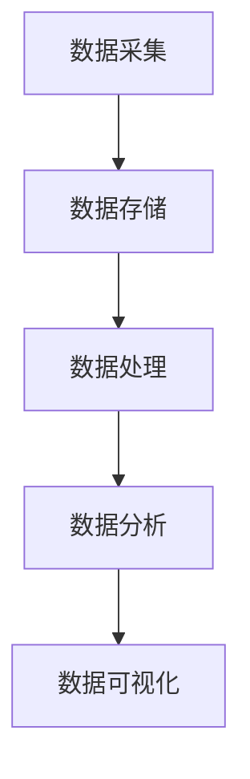

                 

关键词：大数据、商业市场、洞察力、市场分析、商业策略

> 摘要：本文将探讨大数据技术在商业市场中的重要作用，特别是它如何通过提供更深入的市场洞察力，帮助企业制定更精准的商业策略。我们将分析大数据的核心概念、技术架构，以及它在市场分析中的应用，最后对未来的发展方向和挑战进行展望。

## 1. 背景介绍

商业市场的复杂性不断增加，消费者行为多样化，市场竞争激烈。企业需要具备强大的市场洞察力，以便在竞争中脱颖而出。传统的市场分析方法依赖于有限的样本数据和简单统计工具，往往难以捕捉到市场的全貌和细微变化。而大数据技术的出现，为市场洞察力带来了革命性的变化。

大数据（Big Data）是指数据量巨大、数据类型繁多且数据生成速度极快的信息集合。它包括结构化数据、半结构化数据和非结构化数据，如文本、图像、音频、视频等。大数据技术的核心在于数据的采集、存储、处理和分析，这为商业市场提供了前所未有的洞见。

## 2. 核心概念与联系

### 2.1 数据种类与来源

大数据种类繁多，主要可以分为以下几类：

- **结构化数据**：如数据库中的数据，易于存储、查询和分析。
- **半结构化数据**：如XML、JSON等格式的数据，部分有结构但部分无结构。
- **非结构化数据**：如文本、图像、音频、视频等，没有固定的结构。

数据来源包括：

- **企业内部数据**：如销售记录、客户关系管理数据、生产数据等。
- **互联网数据**：如社交媒体、搜索引擎、电子商务平台等产生的数据。
- **外部数据**：如公共记录、市场调查报告、行业数据等。

### 2.2 大数据技术架构

大数据处理技术架构通常包括以下组件：

- **数据采集**：从各种数据源收集数据。
- **数据存储**：使用分布式存储系统，如Hadoop的HDFS。
- **数据处理**：使用MapReduce、Spark等分布式处理框架。
- **数据分析**：使用数据挖掘、机器学习等技术，从数据中提取价值。
- **数据可视化**：将分析结果以图表、报表等形式直观展示。

下面是一个用Mermaid绘制的简单流程图，描述了大数据技术的基本架构：



## 3. 核心算法原理 & 具体操作步骤

### 3.1 算法原理概述

大数据处理的核心算法包括：

- **MapReduce**：一种分布式数据处理模型，用于处理大规模数据集。
- **机器学习**：用于从数据中学习模式，进行预测和分类。
- **数据挖掘**：从大量数据中提取隐藏的、未知的、潜在的价值。

### 3.2 算法步骤详解

#### 3.2.1 数据采集

数据采集是大数据处理的起点，通常包括以下步骤：

1. **数据源识别**：确定需要收集的数据类型和来源。
2. **数据抓取**：使用API、爬虫等技术从各种数据源获取数据。
3. **数据清洗**：去除重复、错误或无关的数据，确保数据质量。

#### 3.2.2 数据存储

数据存储步骤包括：

1. **选择存储系统**：根据数据量和访问模式选择合适的存储系统，如HDFS、NoSQL数据库等。
2. **数据分布**：将数据分布在多个节点上，确保数据的高可用性和可扩展性。
3. **数据备份**：定期备份数据，以防数据丢失。

#### 3.2.3 数据处理

数据处理步骤包括：

1. **数据预处理**：对数据进行标准化、归一化等处理，使其适合后续分析。
2. **分布式计算**：使用MapReduce、Spark等框架对数据进行分布式处理。
3. **数据聚合**：将分布式处理的结果进行聚合，形成全局视图。

#### 3.2.4 数据分析

数据分析步骤包括：

1. **特征提取**：从数据中提取有用的特征，用于建模和分析。
2. **模型训练**：使用机器学习算法训练模型，进行预测和分类。
3. **模型评估**：评估模型的准确性、泛化能力等。

#### 3.2.5 数据可视化

数据可视化步骤包括：

1. **数据转换**：将分析结果转换为可视化图表或报表。
2. **交互式展示**：使用交互式工具，如Tableau、Power BI等，展示数据。
3. **决策支持**：帮助管理层基于数据做出更明智的决策。

### 3.3 算法优缺点

#### 3.3.1 优点

- **高效性**：分布式计算使数据处理速度大幅提升。
- **灵活性**：可以处理多种类型的数据，包括结构化和非结构化数据。
- **准确性**：机器学习和数据挖掘技术提高了预测和分类的准确性。
- **可扩展性**：可以轻松扩展处理能力，适应不断增长的数据量。

#### 3.3.2 缺点

- **数据隐私问题**：大数据处理涉及大量个人数据，需确保数据隐私和安全。
- **技术复杂性**：大数据技术架构复杂，需要专业的技术和团队。
- **数据质量**：数据质量直接影响分析结果，需要大量的数据清洗和预处理工作。

### 3.4 算法应用领域

大数据技术在商业市场中的应用非常广泛，主要包括：

- **客户关系管理**：通过分析客户数据，了解客户需求，提高客户满意度。
- **市场营销**：通过分析市场数据，优化营销策略，提高营销效果。
- **供应链管理**：通过分析供应链数据，优化供应链流程，降低成本。
- **风险控制**：通过分析金融数据，预测市场风险，进行风险控制。

## 4. 数学模型和公式 & 详细讲解 & 举例说明

### 4.1 数学模型构建

在商业市场中，常用的数学模型包括线性回归、逻辑回归、决策树、神经网络等。以下是一个简单的线性回归模型：

$$ y = \beta_0 + \beta_1x_1 + \beta_2x_2 + ... + \beta_nx_n $$

其中，$y$ 是预测值，$x_1, x_2, ..., x_n$ 是特征值，$\beta_0, \beta_1, ..., \beta_n$ 是模型参数。

### 4.2 公式推导过程

线性回归模型的推导过程如下：

1. **最小二乘法**：通过最小化预测值与实际值之间的平方误差，求解模型参数。
2. **正规方程**：将误差平方和函数关于模型参数求偏导，并令偏导数为零，得到正规方程。
3. **解方程**：解正规方程，求得模型参数。

### 4.3 案例分析与讲解

假设我们要预测一家电商平台的月销售额，我们选择了两个特征：广告投放成本（$x_1$）和天气情况（$x_2$）。以下是一个简单的线性回归模型：

$$ y = \beta_0 + \beta_1x_1 + \beta_2x_2 $$

我们收集了以下数据：

| 月销售额（$y$） | 广告投放成本（$x_1$） | 天气情况（$x_2$） |
| -------------- | ------------------- | --------------- |
| 1000           | 500                 | 晴              |
| 1200           | 600                 | 晴              |
| 800            | 400                 | 雨              |
| 900            | 450                 | 雨              |

我们将数据输入到线性回归模型中，使用最小二乘法求解模型参数：

$$ \beta_0 = 675.6, \beta_1 = 0.8, \beta_2 = 309.6 $$

因此，我们的线性回归模型为：

$$ y = 675.6 + 0.8x_1 + 309.6x_2 $$

我们可以使用这个模型预测新的数据点，例如，当广告投放成本为600，天气情况为晴时，预测的月销售额为：

$$ y = 675.6 + 0.8 \times 600 + 309.6 \times 1 = 1350 $$

## 5. 项目实践：代码实例和详细解释说明

### 5.1 开发环境搭建

在本项目实践中，我们将使用Python和Jupyter Notebook作为开发环境。首先，需要安装Python 3.x版本，并安装以下库：NumPy、Pandas、Scikit-learn、Matplotlib。

```shell
pip install numpy pandas scikit-learn matplotlib
```

### 5.2 源代码详细实现

以下是一个简单的线性回归项目，用于预测月销售额。

```python
import numpy as np
import pandas as pd
from sklearn.linear_model import LinearRegression
import matplotlib.pyplot as plt

# 加载数据
data = pd.read_csv('sales_data.csv')

# 提取特征和目标变量
X = data[['ad_cost', 'weather']]
y = data['sales']

# 划分训练集和测试集
from sklearn.model_selection import train_test_split
X_train, X_test, y_train, y_test = train_test_split(X, y, test_size=0.2, random_state=42)

# 训练模型
model = LinearRegression()
model.fit(X_train, y_train)

# 预测测试集
y_pred = model.predict(X_test)

# 绘制结果
plt.scatter(X_test['ad_cost'], y_test)
plt.plot(X_test['ad_cost'], y_pred, color='red')
plt.xlabel('Ad Cost')
plt.ylabel('Sales')
plt.show()
```

### 5.3 代码解读与分析

- **数据加载**：使用Pandas读取CSV文件，获取销售数据。
- **特征提取**：将广告投放成本和天气情况作为特征，月销售额作为目标变量。
- **划分数据集**：使用Scikit-learn的train_test_split函数，将数据集划分为训练集和测试集。
- **模型训练**：使用LinearRegression类创建线性回归模型，并使用fit方法训练模型。
- **预测**：使用predict方法预测测试集的销售额。
- **可视化**：使用Matplotlib绘制散点图和回归线，展示预测结果。

### 5.4 运行结果展示

运行上述代码后，将看到一个散点图，其中红色回归线表示预测的月销售额。这有助于我们直观地了解模型的预测效果。

## 6. 实际应用场景

大数据技术在商业市场中的应用非常广泛，以下是一些具体的应用场景：

### 6.1 客户关系管理

企业可以通过分析客户数据，了解客户的行为、需求和偏好，从而提供更个性化的服务。例如，电商企业可以根据客户的历史购买记录和浏览行为，推荐合适的商品。

### 6.2 市场营销

大数据技术可以帮助企业分析市场趋势、消费者行为，从而制定更有效的营销策略。例如，通过分析社交媒体数据，企业可以了解目标受众的兴趣和需求，优化广告投放。

### 6.3 供应链管理

大数据技术可以帮助企业优化供应链流程，降低成本。例如，通过分析供应链数据，企业可以预测需求波动，调整库存策略。

### 6.4 风险控制

大数据技术可以帮助金融机构预测市场风险，进行风险控制。例如，通过分析金融数据，金融机构可以识别潜在的欺诈行为。

## 7. 未来应用展望

随着大数据技术的不断发展和成熟，它在商业市场中的应用前景将更加广阔。未来，我们将看到更多企业利用大数据技术提升市场洞察力，制定更精准的商业策略。以下是一些可能的趋势：

### 7.1 深度学习与大数据

深度学习技术在数据处理和分析中的表现越来越出色，未来将与大数据库技术结合，进一步提升数据分析的准确性和效率。

### 7.2 实时数据分析

随着物联网和5G技术的发展，实时数据分析将成为可能。企业可以实时获取市场数据，快速响应市场变化。

### 7.3 数据隐私保护

随着大数据技术的应用，数据隐私问题越来越受到关注。未来，我们将看到更多关于数据隐私保护的技术和法规出台。

## 8. 总结：未来发展趋势与挑战

大数据技术在商业市场中的重要性日益凸显。它不仅帮助企业提升市场洞察力，还为企业提供了制定更精准商业策略的工具。然而，大数据技术也面临一些挑战，如数据隐私问题、技术复杂性等。未来，随着技术的不断进步，大数据技术将在商业市场中发挥更大的作用，同时也需要解决相关挑战。

### 8.1 研究成果总结

本文对大数据技术在商业市场中的重要作用进行了深入探讨，分析了大数据的核心概念、技术架构和应用领域。同时，通过实例演示了线性回归模型的构建和预测过程。

### 8.2 未来发展趋势

未来，大数据技术将朝着更高效、实时和智能化的方向发展。深度学习、实时数据分析等技术将进一步提升数据分析的准确性和效率。

### 8.3 面临的挑战

数据隐私保护、技术复杂性、数据质量等是大数据技术面临的主要挑战。需要不断改进相关技术和法规，以确保大数据技术的安全、可靠和有效。

### 8.4 研究展望

未来，大数据技术在商业市场中的应用将更加广泛和深入。研究者可以关注以下方向：

- **数据隐私保护技术**：研究更高效、更安全的隐私保护技术，确保数据在处理和分析过程中的安全性。
- **实时数据分析**：研究实时数据处理和分析技术，提高数据响应速度，帮助企业快速应对市场变化。
- **深度学习与大数据**：研究深度学习技术在数据处理和分析中的应用，进一步提升数据分析的准确性和效率。

## 9. 附录：常见问题与解答

### 9.1 什么是大数据？

大数据是指数据量巨大、数据类型繁多且数据生成速度极快的信息集合。它包括结构化数据、半结构化数据和非结构化数据。

### 9.2 大数据技术有哪些？

大数据技术包括数据采集、存储、处理、分析和可视化等技术，如Hadoop、Spark、MapReduce、机器学习等。

### 9.3 大数据在商业市场中有哪些应用？

大数据在商业市场中的应用广泛，包括客户关系管理、市场营销、供应链管理、风险控制等。

### 9.4 如何保障大数据技术的安全性？

保障大数据技术的安全性需要从多个方面入手，包括数据加密、访问控制、隐私保护等。同时，需要遵守相关法规和标准，确保数据在处理和分析过程中的安全性。

作者：禅与计算机程序设计艺术 / Zen and the Art of Computer Programming
```markdown
----------------------------------------------------------------
```

