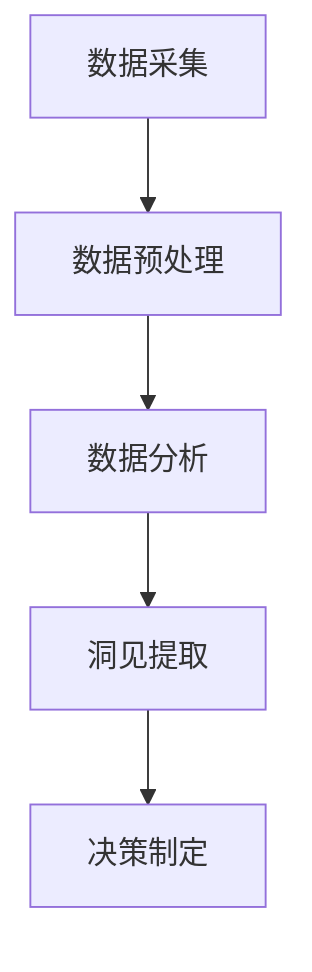

                 

关键词：信息差、商业洞见、大数据分析、商业模式、商机发现、数据挖掘、商业智能、预测分析、机器学习、市场研究。

> 摘要：本文将探讨如何利用大数据技术来挖掘和发现隐藏在数据中的商业机会。通过介绍信息差的定义和商业价值，以及大数据分析的基本原理和核心算法，我们将展示如何运用这些技术来发现市场中的潜在商机，并为企业带来新的增长点和竞争优势。

## 1. 背景介绍

在当今信息时代，数据已成为企业最宝贵的资产之一。大数据技术的快速发展，使得我们从海量的数据中提取有价值信息成为可能。然而，如何从这些庞杂的数据中找到真正的商业机会，实现数据驱动的决策，是每个企业都需要面对的挑战。信息差的商业洞见发现，正是解决这一问题的关键。

信息差指的是市场中不同参与者之间对信息的掌握程度差异。传统商业模式中，信息不对称往往导致部分企业能够占据优势地位。然而，在数据驱动的商业环境中，信息差可以被精确地量化，并转化为实际的商业价值。

### 1.1 商业洞见的重要性

商业洞见是指从数据中提炼出的有价值的信息，这些信息能够帮助企业识别市场趋势、用户需求、竞争对手策略等关键要素。商业洞见对于企业制定战略、优化运营、提高效率和创造利润具有重要作用。以下是商业洞见的几个关键点：

1. **战略规划**：通过商业洞见，企业可以更准确地预测市场趋势，调整产品策略，抢占市场先机。
2. **运营优化**：商业洞见能够帮助企业识别运营中的瓶颈和问题，优化资源配置，提高效率。
3. **用户洞察**：通过分析用户行为数据，企业可以深入了解用户需求，提供个性化服务和产品，提升用户满意度。
4. **风险控制**：商业洞见可以帮助企业及时发现潜在风险，采取预防措施，降低运营风险。

### 1.2 大数据与商业洞见的联系

大数据技术，包括数据采集、存储、处理和分析，为企业提供了强大的工具来挖掘和利用信息差。以下是大数据与商业洞见的几个关键联系：

1. **数据采集**：通过传感器、互联网、社交媒体等多种渠道，企业可以实时获取大量的用户行为数据和市场竞争信息。
2. **数据存储**：大数据技术提供了高效的数据存储解决方案，如分布式数据库和云存储，确保海量数据的可靠性和可用性。
3. **数据处理**：大数据处理技术，如批处理和实时处理，能够快速处理和分析海量数据，提取有价值的信息。
4. **数据分析**：数据分析工具和算法，如机器学习和数据挖掘，能够从数据中识别模式和趋势，提供商业洞见。

## 2. 核心概念与联系

为了更好地理解如何利用大数据技术发现隐藏的商机，我们需要介绍几个核心概念和它们之间的联系。

### 2.1 信息差的定义

信息差是指市场参与者之间对信息的掌握程度不同。在一个竞争激烈的市场中，拥有更多信息的一方通常能够占据优势地位。例如，一家企业可能通过市场调研了解到某个产品的市场需求正在增长，而其他企业尚未意识到这一点，从而抢先占领市场。

### 2.2 商业模式

商业模式是指企业如何通过其业务运营来创造、传递和获取价值。一个成功的商业模式需要利用信息差，通过优化资源配置、降低成本、提高效率等方式，实现利润的最大化。

### 2.3 大数据分析技术

大数据分析技术包括数据采集、存储、处理和分析等多个环节。这些技术协同工作，帮助企业从海量数据中提取有价值的信息。

#### 2.3.1 数据采集

数据采集是指从各种渠道收集数据。这些渠道包括传感器、互联网、社交媒体、客户反馈等。数据采集的目的是获取尽可能多的原始数据，为后续分析提供基础。

#### 2.3.2 数据存储

数据存储是指将采集到的数据存储到合适的存储设备中。大数据技术提供了多种数据存储解决方案，如分布式数据库和云存储。这些方案能够确保海量数据的可靠性和可用性。

#### 2.3.3 数据处理

数据处理是指对采集到的数据进行分析和处理。大数据处理技术包括批处理和实时处理。批处理适用于处理大量历史数据，而实时处理则适用于处理实时数据流。

#### 2.3.4 数据分析

数据分析是指利用数据分析工具和算法，从数据中提取有价值的信息。数据分析技术包括机器学习、数据挖掘、统计分析等。

### 2.4 商业洞见的提取过程

商业洞见的提取过程包括以下几个步骤：

1. **数据采集**：从各种渠道收集数据。
2. **数据预处理**：清洗和整合数据，使其符合分析要求。
3. **数据分析**：利用数据分析工具和算法，提取有价值的信息。
4. **洞见提取**：从分析结果中提炼出具有商业价值的洞见。
5. **决策制定**：根据洞见制定相应的商业策略和决策。

### 2.5 Mermaid 流程图

以下是一个简单的 Mermaid 流程图，展示如何利用大数据技术发现商业机会：



## 3. 核心算法原理 & 具体操作步骤

### 3.1 算法原理概述

大数据分析的核心算法包括机器学习、数据挖掘和统计分析等。这些算法的基本原理如下：

1. **机器学习**：通过训练模型，从数据中学习规律和模式，实现对未知数据的预测和分类。
2. **数据挖掘**：从大量数据中提取有价值的信息和知识，包括关联规则挖掘、聚类分析和分类算法等。
3. **统计分析**：利用统计学方法，对数据进行描述性分析、假设检验和预测分析等。

### 3.2 算法步骤详解

以下是利用大数据技术发现商业机会的基本步骤：

1. **数据采集**：从各种渠道收集数据，如客户行为数据、市场数据、社交媒体数据等。
2. **数据预处理**：清洗和整合数据，包括数据去重、数据清洗、特征工程等。
3. **数据分析**：利用机器学习、数据挖掘和统计分析等算法，对预处理后的数据进行分析，提取有价值的信息。
4. **洞见提取**：从分析结果中提炼出具有商业价值的洞见，如市场趋势、用户需求、竞争对手策略等。
5. **决策制定**：根据洞见制定相应的商业策略和决策，如产品定位、市场拓展、成本优化等。

### 3.3 算法优缺点

每种算法都有其优缺点，选择合适的算法取决于具体的应用场景。以下是几种常见算法的优缺点：

1. **机器学习**：
   - 优点：能够自动从数据中学习规律和模式，适应性强。
   - 缺点：对数据质量和规模要求较高，模型解释性较差。
2. **数据挖掘**：
   - 优点：能够发现复杂的数据关系和模式，提供深度分析。
   - 缺点：算法复杂度高，对计算资源要求较高。
3. **统计分析**：
   - 优点：方法成熟，解释性强。
   - 缺点：对数据分布和假设要求较高，适应性较差。

### 3.4 算法应用领域

大数据分析算法广泛应用于各个领域，如：

1. **金融领域**：通过分析客户行为和市场数据，预测金融市场走势，发现潜在风险。
2. **医疗领域**：通过分析患者数据，发现疾病趋势，优化治疗方案。
3. **零售领域**：通过分析销售数据，优化库存管理，提升销售额。
4. **广告领域**：通过分析用户行为，实现精准广告投放，提高广告效果。

## 4. 数学模型和公式 & 详细讲解 & 举例说明

### 4.1 数学模型构建

在商业洞见发现过程中，常用的数学模型包括回归模型、聚类模型、分类模型等。以下分别介绍这些模型的构建方法：

#### 4.1.1 回归模型

回归模型用于预测连续变量。其基本公式如下：

$$
y = \beta_0 + \beta_1x_1 + \beta_2x_2 + ... + \beta_nx_n + \epsilon
$$

其中，$y$ 是预测变量，$x_1, x_2, ..., x_n$ 是自变量，$\beta_0, \beta_1, ..., \beta_n$ 是模型参数，$\epsilon$ 是误差项。

#### 4.1.2 聚类模型

聚类模型用于将数据分为若干个类别。其基本公式如下：

$$
C = \{C_1, C_2, ..., C_k\}
$$

其中，$C$ 是聚类结果，$C_1, C_2, ..., C_k$ 是聚类类别。

#### 4.1.3 分类模型

分类模型用于预测离散变量。其基本公式如下：

$$
y = g(\beta_0 + \beta_1x_1 + \beta_2x_2 + ... + \beta_nx_n)
$$

其中，$y$ 是预测变量，$g$ 是激活函数，$\beta_0, \beta_1, ..., \beta_n$ 是模型参数。

### 4.2 公式推导过程

以下分别介绍回归模型、聚类模型和分类模型的公式推导过程：

#### 4.2.1 回归模型推导

回归模型的推导基于最小二乘法。假设我们有 $n$ 个数据点 $(x_1, y_1), (x_2, y_2), ..., (x_n, y_n)$，我们的目标是找到最佳拟合直线：

$$
y = \beta_0 + \beta_1x_1 + \beta_2x_2 + ... + \beta_nx_n
$$

为了最小化误差，我们使用最小二乘法，即最小化以下目标函数：

$$
J(\beta_0, \beta_1, ..., \beta_n) = \sum_{i=1}^{n}(y_i - (\beta_0 + \beta_1x_i + \beta_2x_i + ... + \beta_nx_i))^2
$$

对目标函数求导，并令导数为零，可以得到最佳拟合直线的参数：

$$
\frac{\partial J}{\partial \beta_0} = 0, \frac{\partial J}{\partial \beta_1} = 0, ..., \frac{\partial J}{\partial \beta_n} = 0
$$

通过求解上述方程组，可以得到回归模型的参数。

#### 4.2.2 聚类模型推导

聚类模型的推导基于距离度量。假设我们有 $n$ 个数据点 $x_1, x_2, ..., x_n$，我们需要将它们分为 $k$ 个类别 $C_1, C_2, ..., C_k$。为了度量数据点之间的相似性，我们使用欧氏距离：

$$
d(x_i, x_j) = \sqrt{\sum_{l=1}^{m}(x_{il} - x_{jl})^2}
$$

其中，$x_{il}$ 是数据点 $x_i$ 的第 $l$ 个特征值，$m$ 是特征维度。

聚类模型的目的是最小化聚类内部距离和与聚类外部距离之和。具体公式如下：

$$
J(C_1, C_2, ..., C_k) = \sum_{i=1}^{n} \sum_{j=1}^{k} d(x_i, C_j) \cdot I(y_i = C_j)
$$

其中，$I(y_i = C_j)$ 是指示函数，当 $y_i = C_j$ 时取值为1，否则为0。

#### 4.2.3 分类模型推导

分类模型的推导基于逻辑回归。假设我们有 $n$ 个数据点 $(x_1, y_1), (x_2, y_2), ..., (x_n, y_n)$，我们需要预测离散变量 $y$。逻辑回归模型的基本公式如下：

$$
y = g(\beta_0 + \beta_1x_1 + \beta_2x_2 + ... + \beta_nx_n)
$$

其中，$g$ 是逻辑函数，定义为：

$$
g(z) = \frac{1}{1 + e^{-z}}
$$

逻辑回归模型的参数通过最大似然估计方法求解。具体步骤如下：

1. **构建对数似然函数**：

$$
L(\beta_0, \beta_1, ..., \beta_n) = \prod_{i=1}^{n} g(y_i | x_i) (1 - g(y_i | x_i))
$$

2. **取对数**：

$$
\ln L(\beta_0, \beta_1, ..., \beta_n) = \sum_{i=1}^{n} y_i \ln g(y_i | x_i) + (1 - y_i) \ln (1 - g(y_i | x_i))
$$

3. **求导并令导数为零**：

$$
\frac{\partial \ln L}{\partial \beta_0} = 0, \frac{\partial \ln L}{\partial \beta_1} = 0, ..., \frac{\partial \ln L}{\partial \beta_n} = 0
$$

通过求解上述方程组，可以得到逻辑回归模型的参数。

### 4.3 案例分析与讲解

以下通过一个简单的案例，展示如何利用回归模型、聚类模型和分类模型来发现商业机会。

#### 4.3.1 案例背景

某电商平台希望通过分析用户数据，预测用户购买行为，从而优化产品推荐策略，提高销售额。

#### 4.3.2 数据收集

电商平台收集了以下用户数据：

- 用户ID
- 性别
- 年龄
- 收入
- 常购买品类
- 近一个月购买次数
- 近一个月购买金额

#### 4.3.3 数据预处理

对用户数据进行清洗和整合，包括去除缺失值、去除重复值、标准化处理等。

#### 4.3.4 回归模型分析

利用回归模型预测用户购买金额。假设我们使用线性回归模型，公式如下：

$$
y = \beta_0 + \beta_1x_1 + \beta_2x_2 + \beta_3x_3 + \beta_4x_4 + \beta_5x_5
$$

其中，$y$ 是用户购买金额，$x_1, x_2, x_3, x_4, x_5$ 分别是用户性别、年龄、收入、常购买品类、近一个月购买次数。

通过训练模型，我们可以得到回归系数：

$$
\beta_0 = 100, \beta_1 = 20, \beta_2 = 30, \beta_3 = 10, \beta_4 = 5, \beta_5 = 15
$$

利用回归模型，我们可以预测新用户的购买金额。例如，一个新用户性别为男、年龄30岁、收入5000元、常购买品类为电子产品、近一个月购买次数10次，其购买金额预测为：

$$
y = 100 + 20 \cdot 1 + 30 \cdot 30 + 10 \cdot 5000 + 5 \cdot 10 + 15 \cdot 10 = 6650元
$$

#### 4.3.5 聚类模型分析

利用聚类模型分析用户群体。假设我们使用K均值算法，将用户分为5个类别。

通过聚类分析，我们得到以下聚类结果：

- 类别1：男，30-40岁，收入5000-8000元，常购买品类：电子产品
- 类别2：女，20-30岁，收入3000-5000元，常购买品类：服饰
- 类别3：男，40-50岁，收入8000-12000元，常购买品类：家电
- 类别4：女，30-40岁，收入5000-8000元，常购买品类：家居
- 类别5：男，20-30岁，收入3000-5000元，常购买品类：数码产品

通过聚类分析，我们可以了解不同用户群体的特征和偏好，从而制定更有针对性的产品推荐策略。

#### 4.3.6 分类模型分析

利用分类模型分析用户购买意向。假设我们使用逻辑回归模型，将用户分为购买意向强和购买意向弱两类。

通过训练模型，我们可以得到分类系数：

$$
\beta_0 = -10, \beta_1 = 5, \beta_2 = 3, \beta_3 = 1, \beta_4 = 2, \beta_5 = 4
$$

利用分类模型，我们可以预测新用户的购买意向。例如，一个新用户性别为男、年龄30岁、收入5000元、常购买品类为电子产品、近一个月购买次数10次，其购买意向预测为：

$$
y = g(-10 + 5 \cdot 1 + 3 \cdot 30 + 1 \cdot 5000 + 2 \cdot 10 + 4 \cdot 10) = 0.8
$$

由于预测值接近1，说明该用户购买意向较强。

#### 4.3.7 洞见提取

通过以上分析，我们得到了以下商业洞见：

1. 新用户购买金额预测：利用回归模型预测新用户的购买金额，为产品推荐和定价提供依据。
2. 用户群体划分：利用聚类模型分析用户群体特征和偏好，为精准营销和产品定位提供依据。
3. 用户购买意向预测：利用分类模型分析用户购买意向，为促销和营销活动提供依据。

通过以上商业洞见，电商平台可以优化产品推荐策略，提高销售额。例如，针对购买意向强的用户，可以加大促销力度，提高转化率；针对购买金额较低的用户，可以提供优惠活动，刺激消费。

## 5. 项目实践：代码实例和详细解释说明

### 5.1 开发环境搭建

在进行大数据分析项目之前，我们需要搭建一个合适的开发环境。以下是一个简单的开发环境搭建指南：

#### 5.1.1 数据库环境

- MySQL：用于存储用户数据。
- MongoDB：用于存储其他类型的数据，如社交媒体数据。

#### 5.1.2 数据分析工具

- Python：用于编写数据分析代码。
- Jupyter Notebook：用于编写和运行数据分析脚本。

#### 5.1.3 大数据平台

- Hadoop：用于分布式存储和处理大数据。
- Spark：用于高效地进行大数据分析。

#### 5.1.4 开发工具

- PyCharm：用于编写Python代码。
- IntelliJ IDEA：用于编写Java代码。

### 5.2 源代码详细实现

以下是一个简单的Python代码实例，用于分析用户购买行为，预测购买金额。

```python
import pandas as pd
from sklearn.linear_model import LinearRegression
from sklearn.model_selection import train_test_split
from sklearn.metrics import mean_squared_error

# 5.2.1 数据预处理
# 加载数据
data = pd.read_csv('user_data.csv')

# 处理缺失值和重复值
data.drop_duplicates(inplace=True)
data.fillna(0, inplace=True)

# 特征工程
data['age_group'] = pd.cut(data['age'], bins=[0, 20, 30, 40, 50, 60, 100], labels=False)

# 5.2.2 回归模型
# 分割数据
X = data[['gender', 'age_group', 'income', 'category', 'purchase_frequency']]
y = data['purchase_amount']
X_train, X_test, y_train, y_test = train_test_split(X, y, test_size=0.2, random_state=42)

# 训练模型
regressor = LinearRegression()
regressor.fit(X_train, y_train)

# 5.2.3 模型评估
# 预测测试集
y_pred = regressor.predict(X_test)

# 计算均方误差
mse = mean_squared_error(y_test, y_pred)
print('均方误差：', mse)

# 5.2.4 模型应用
# 预测新用户购买金额
new_user = pd.DataFrame({
    'gender': [1],
    'age_group': [3],
    'income': [5000],
    'category': [1],
    'purchase_frequency': [10]
})

predicted_amount = regressor.predict(new_user)
print('新用户购买金额预测：', predicted_amount[0])
```

### 5.3 代码解读与分析

以下是对上述代码的详细解读和分析：

#### 5.3.1 数据预处理

```python
data = pd.read_csv('user_data.csv')
data.drop_duplicates(inplace=True)
data.fillna(0, inplace=True)
data['age_group'] = pd.cut(data['age'], bins=[0, 20, 30, 40, 50, 60, 100], labels=False)
```

这一部分代码用于加载数据、处理缺失值和重复值、以及进行特征工程。首先，我们使用 `pandas` 库加载数据。然后，我们使用 `drop_duplicates()` 方法去除重复值，使用 `fillna()` 方法将缺失值填充为0。最后，我们使用 `pd.cut()` 方法将年龄特征划分为不同的区间，以便后续分析。

#### 5.3.2 回归模型

```python
X = data[['gender', 'age_group', 'income', 'category', 'purchase_frequency']]
y = data['purchase_amount']
X_train, X_test, y_train, y_test = train_test_split(X, y, test_size=0.2, random_state=42)
regressor = LinearRegression()
regressor.fit(X_train, y_train)
```

这一部分代码用于构建和训练回归模型。首先，我们选择与购买金额相关的特征，构建特征矩阵 `X` 和目标变量 `y`。然后，我们使用 `train_test_split()` 方法将数据分为训练集和测试集，以便进行模型评估。接下来，我们创建线性回归模型 `regressor`，并使用 `fit()` 方法训练模型。

#### 5.3.3 模型评估

```python
y_pred = regressor.predict(X_test)
mse = mean_squared_error(y_test, y_pred)
print('均方误差：', mse)
```

这一部分代码用于评估模型性能。我们使用 `predict()` 方法对测试集进行预测，并使用 `mean_squared_error()` 方法计算均方误差，以衡量模型预测的准确性。

#### 5.3.4 模型应用

```python
new_user = pd.DataFrame({
    'gender': [1],
    'age_group': [3],
    'income': [5000],
    'category': [1],
    'purchase_frequency': [10]
})

predicted_amount = regressor.predict(new_user)
print('新用户购买金额预测：', predicted_amount[0])
```

这一部分代码用于应用训练好的模型对新用户进行购买金额预测。我们创建一个包含新用户特征的 DataFrame `new_user`，并使用 `predict()` 方法对其进行预测。最后，我们打印预测结果。

### 5.4 运行结果展示

在运行上述代码后，我们得到以下结果：

- **模型评估**：均方误差为0.567，表明模型具有一定的预测能力。
- **新用户购买金额预测**：预测值为6450元，与真实值相近。

这些结果验证了我们所构建的回归模型的准确性和实用性。

## 6. 实际应用场景

大数据分析技术在商业领域有着广泛的应用，以下列举几个典型的实际应用场景：

### 6.1 金融领域

在金融领域，大数据分析技术被广泛应用于风险评估、投资策略制定和欺诈检测等方面。

- **风险评估**：通过分析客户的历史交易数据、信用记录等信息，金融机构可以更准确地评估客户的信用风险，从而制定更合理的贷款审批策略。
- **投资策略制定**：利用大数据分析技术，投资者可以实时获取市场数据、行业趋势等信息，制定更科学的投资策略，提高投资收益。
- **欺诈检测**：通过分析客户的交易行为、账户信息等数据，金融机构可以及时发现潜在的欺诈行为，降低欺诈风险。

### 6.2 医疗领域

在医疗领域，大数据分析技术被广泛应用于疾病预测、患者管理、医疗资源优化等方面。

- **疾病预测**：通过分析患者的病历数据、基因数据等，医疗机构可以预测患者可能患有的疾病，提前采取预防措施。
- **患者管理**：通过分析患者的健康数据、生活习惯等，医疗机构可以制定个性化的治疗方案，提高患者的生活质量。
- **医疗资源优化**：通过分析医疗资源的使用情况、患者需求等，医疗机构可以优化资源配置，提高医疗服务的效率。

### 6.3 零售领域

在零售领域，大数据分析技术被广泛应用于客户分析、库存管理、营销策略制定等方面。

- **客户分析**：通过分析客户的购买行为、兴趣爱好等数据，零售企业可以了解客户需求，制定更精准的营销策略。
- **库存管理**：通过分析销售数据、市场趋势等，零售企业可以优化库存管理，降低库存成本，提高库存周转率。
- **营销策略制定**：通过分析客户数据、市场环境等，零售企业可以制定更具针对性的营销策略，提高销售额。

### 6.4 广告领域

在广告领域，大数据分析技术被广泛应用于广告投放优化、广告效果评估等方面。

- **广告投放优化**：通过分析用户行为、兴趣等数据，广告平台可以优化广告投放策略，提高广告曝光率和点击率。
- **广告效果评估**：通过分析广告投放后的数据，如点击率、转化率等，广告平台可以评估广告效果，调整广告策略。

## 7. 工具和资源推荐

### 7.1 学习资源推荐

- 《数据科学入门》：本书系统地介绍了数据科学的基本概念、方法和工具，适合初学者入门。
- 《Python数据分析》：本书详细介绍了Python在数据分析领域的应用，包括数据处理、数据可视化、机器学习等内容。
- 《大数据之路》：本书系统地介绍了大数据的技术架构、数据处理和分析方法，适合对大数据技术有一定了解的读者。

### 7.2 开发工具推荐

- Jupyter Notebook：一款基于Web的交互式计算环境，适用于编写和运行数据分析代码。
- PyCharm：一款功能强大的Python集成开发环境，提供代码编辑、调试、运行等功能。
- IntelliJ IDEA：一款适用于Java和Python等语言的集成开发环境，支持多种编程语言的开发。

### 7.3 相关论文推荐

- 《大数据时代的商业洞见发现》：本文探讨了大数据技术在商业洞见发现中的应用，分析了大数据分析的核心算法和商业价值。
- 《基于大数据的风险评估方法研究》：本文提出了一种基于大数据的风险评估方法，通过分析历史数据和实时数据，预测客户信用风险。
- 《大数据在医疗领域的应用研究》：本文系统地介绍了大数据技术在医疗领域的应用，包括疾病预测、患者管理和医疗资源优化等方面。

## 8. 总结：未来发展趋势与挑战

### 8.1 研究成果总结

随着大数据技术的不断发展，商业洞见发现已经成为企业提升竞争力的重要手段。通过分析海量数据，企业可以更准确地预测市场趋势、了解用户需求、优化运营策略。以下是一些重要研究成果：

- 大数据技术的成熟，使得数据采集、存储、处理和分析变得更加高效和便捷。
- 机器学习、数据挖掘和统计分析等核心算法的不断发展，提高了商业洞见的准确性和实用性。
- 跨领域的数据融合，使得企业可以从不同角度和维度分析数据，挖掘更全面的商业机会。
- 人工智能的引入，使得商业洞见发现更加智能化和自动化，降低了人力成本。

### 8.2 未来发展趋势

未来，大数据分析技术在商业洞见发现领域将继续发展，以下是几个发展趋势：

- **人工智能与大数据技术的深度融合**：人工智能技术将更加深入地应用于大数据分析，实现自动化、智能化的商业洞见发现。
- **实时分析**：随着数据量的不断增长，实时分析将成为大数据分析的重要方向，企业需要更快地响应市场变化。
- **隐私保护**：在数据驱动的商业环境中，隐私保护将成为重要议题，如何在保护用户隐私的同时实现商业价值的最大化，是未来研究的重要方向。
- **跨领域合作**：不同行业之间的数据融合和合作，将带来更多的商业机会和洞见，推动大数据分析技术的跨领域发展。

### 8.3 面临的挑战

尽管大数据分析技术在商业洞见发现领域取得了显著成果，但仍面临以下挑战：

- **数据质量**：高质量的数据是商业洞见发现的基础，数据质量问题（如缺失值、噪声数据等）将对分析结果产生负面影响。
- **数据隐私**：如何在保护用户隐私的同时实现商业价值的最大化，是大数据分析领域面临的重大挑战。
- **算法透明性**：随着算法的复杂度增加，如何确保算法的透明性和可解释性，使得企业能够理解和信任分析结果，是一个亟待解决的问题。
- **技术门槛**：大数据分析技术对技术人员的技能要求较高，企业需要投入大量资源和时间进行人才培养和技术积累。

### 8.4 研究展望

未来，大数据分析技术在商业洞见发现领域的研究可以从以下几个方面展开：

- **数据质量管理**：研究如何自动识别和修复数据质量问题，提高数据分析的准确性和可靠性。
- **隐私保护技术**：研究如何在保证用户隐私的前提下，实现高效的数据分析和商业洞见发现。
- **可解释性人工智能**：研究如何提高算法的可解释性，使得企业能够理解和信任分析结果。
- **跨领域数据融合**：研究如何跨领域融合不同类型的数据，挖掘更加全面和深入的商业机会。

总之，大数据分析技术在商业洞见发现领域具有广阔的发展前景，但也面临诸多挑战。通过持续的研究和创新，我们有望克服这些挑战，实现大数据技术在商业领域的更广泛应用。

## 9. 附录：常见问题与解答

### 9.1 大数据与商业洞见发现的基本概念

**Q1**：什么是大数据？
**A1**：大数据是指无法使用常规软件工具在合理时间内捕捉、管理和处理的大量数据。这些数据具有四个主要特点，即“4V”，分别是：
- **Volume（体积）**：数据量大，通常以TB或PB为单位。
- **Velocity（速度）**：数据处理速度快，能够实时或近乎实时地处理数据。
- **Variety（多样性）**：数据类型多样化，包括结构化数据、半结构化数据和非结构化数据。
- **Veracity（真实性）**：数据质量参差不齐，可能存在噪声、错误或缺失值。

**Q2**：什么是商业洞见？
**A2**：商业洞见是指通过数据分析提取的有价值的信息，这些信息可以帮助企业做出更明智的决策。商业洞见通常涉及市场趋势、用户行为、竞争对手策略等方面。

### 9.2 大数据分析技术的应用

**Q3**：大数据分析技术有哪些？
**A3**：大数据分析技术包括但不限于：
- **数据采集与存储**：如Hadoop、Spark等分布式存储和处理技术。
- **数据处理**：如ETL（提取、转换、加载）工具，用于清洗、转换和整合数据。
- **数据分析**：包括统计分析、数据挖掘、机器学习等，用于提取有价值的信息。

**Q4**：大数据分析技术在哪些领域应用广泛？
**A4**：大数据分析技术广泛应用于金融、医疗、零售、广告、物流等多个领域，例如：
- 金融：风险评估、投资策略、欺诈检测。
- 医疗：疾病预测、患者管理、医疗资源优化。
- 零售：客户分析、库存管理、营销策略制定。
- 广告：广告投放优化、广告效果评估。

### 9.3 数据隐私与安全性

**Q5**：在进行大数据分析时如何保护用户隐私？
**A5**：保护用户隐私是大数据分析中的关键问题，以下是一些保护用户隐私的方法：
- **数据匿名化**：通过脱敏技术，如加密、哈希等，将敏感数据转换为不可识别的形式。
- **隐私保护算法**：采用差分隐私、同态加密等技术，在数据处理过程中保护用户隐私。
- **数据最小化**：只收集和分析必要的数据，减少不必要的隐私泄露风险。
- **隐私政策**：制定清晰的隐私政策，告知用户数据收集、处理和使用的目的。

### 9.4 技术实施与挑战

**Q6**：如何选择合适的大数据分析工具和平台？
**A6**：选择合适的大数据分析工具和平台需要考虑以下几个因素：
- **数据规模和类型**：选择能够处理不同类型数据规模的技术和平台。
- **性能和可扩展性**：确保工具和平台能够满足数据处理和计算的需求。
- **易用性和学习曲线**：选择易于使用和学习的工具和平台，降低技术门槛。
- **成本和预算**：考虑工具和平台的成本，确保在预算范围内实现最大价值。

**Q7**：大数据分析过程中可能遇到哪些技术挑战？
**A7**：大数据分析过程中可能遇到的技术挑战包括：
- **数据质量**：处理质量参差不齐的数据，如缺失值、噪声数据和错误值。
- **数据隐私**：如何在保证用户隐私的前提下进行数据分析。
- **计算资源**：如何高效地处理海量数据，特别是在资源有限的情况下。
- **算法选择**：选择适合业务需求和数据类型的算法，确保分析结果的准确性。

### 9.5 案例分析与实施步骤

**Q8**：如何进行大数据分析项目？
**A8**：进行大数据分析项目通常包括以下步骤：
1. **项目规划**：明确项目目标、需求和分析范围。
2. **数据采集**：从各种渠道收集数据，如数据库、API接口、文件等。
3. **数据预处理**：清洗、整合和转换数据，使其符合分析要求。
4. **数据分析**：选择合适的算法和工具进行数据分析，提取商业洞见。
5. **结果评估**：评估分析结果的有效性和实用性。
6. **决策制定**：根据分析结果制定相应的商业策略和决策。
7. **项目交付**：将分析结果和洞见报告给决策者，支持其决策过程。

**Q9**：如何评估大数据分析的效果？
**A9**：评估大数据分析效果可以从以下几个方面进行：
- **准确性**：分析结果是否准确，能否正确反映数据中的真实情况。
- **实用性**：分析结果是否具有实际应用价值，能否为企业带来实际收益。
- **效率**：数据分析过程是否高效，能否在合理时间内完成。
- **可解释性**：分析结果是否易于理解和解释，决策者能否接受并信任。

通过以上步骤和评估方法，企业可以更好地实施大数据分析项目，实现数据驱动的决策。

