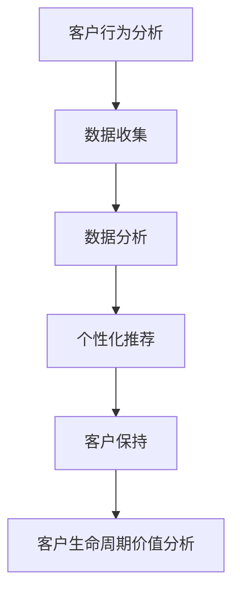

                 

关键词：客户保持策略、大数据分析、客户保留、数据分析应用、个性化推荐、客户行为分析

> 摘要：本文将探讨大数据在现代商业环境中如何通过精准的信息差分析来提高客户的保持率。通过对客户行为、偏好、市场趋势等数据的深入挖掘，企业能够制定出更有效的客户保持策略，从而提升客户的满意度和忠诚度。

## 1. 背景介绍

在当今高度竞争的市场环境中，客户保持已经成为企业成功的关键因素之一。客户保持不仅意味着降低客户的流失率，更意味着通过持续的客户关系管理来提升客户的满意度和忠诚度。而大数据技术的迅猛发展，为企业的客户保持策略提供了前所未有的工具和机会。通过大数据分析，企业可以深入了解客户的个性化需求和行为模式，从而制定出更具针对性的策略。

### 1.1 客户保持的重要性

客户保持（Customer Retention）是指企业通过持续的服务和产品体验来维持与现有客户的关系，从而降低客户流失率并提高客户生命周期价值。客户保持的重要性体现在以下几个方面：

- **成本效益**：保持现有客户通常比开发新客户成本低。
- **品牌忠诚度**：忠诚客户更有可能向他人推荐品牌。
- **长期价值**：持续的客户关系能够带来长期的利润增长。

### 1.2 大数据的崛起

大数据（Big Data）指的是数据量巨大、类型繁多的信息集合，包括结构化、半结构化和非结构化数据。大数据技术的核心是数据的收集、存储、分析和处理。随着物联网（IoT）、社交媒体和电子商务的兴起，企业每天产生和收集的数据量急剧增加。如何从这些海量数据中提取有价值的信息，成为企业关注的焦点。

## 2. 核心概念与联系

在深入探讨大数据如何提高客户保持率之前，我们首先需要理解一些核心概念和它们之间的联系。

### 2.1 客户行为分析

客户行为分析（Customer Behavior Analysis）是指通过分析客户的行为数据来了解客户的行为模式、需求和偏好。这些数据可以来源于客户的浏览历史、购买记录、互动行为等。通过分析这些数据，企业可以更好地理解客户，从而提供更个性化的服务和产品推荐。

### 2.2 个性化推荐系统

个性化推荐系统（Personalized Recommendation System）是大数据应用中的一个重要领域。通过分析用户的浏览和购买历史，推荐系统可以为用户推荐他们可能感兴趣的产品或服务。个性化推荐不仅能提高客户的满意度，还能增加客户的购买频率和消费金额。

### 2.3 客户生命周期价值分析

客户生命周期价值分析（Customer Lifetime Value Analysis，CLV）是指评估一个客户在整个生命周期内为企业带来的总利润。通过计算客户的CLV，企业可以识别出高价值客户，并针对性地提供更优质的服务和产品，从而提高客户保持率。

### 2.4 Mermaid 流程图

为了更好地理解这些概念之间的联系，我们可以使用Mermaid流程图来展示它们之间的关系：



## 3. 核心算法原理 & 具体操作步骤

### 3.1 算法原理概述

在客户保持策略中，大数据分析的核心算法主要包括客户行为分析、个性化推荐算法和客户生命周期价值分析。

#### 3.1.1 客户行为分析算法

客户行为分析算法主要通过机器学习技术来挖掘客户的浏览和购买历史数据，从而预测客户的行为趋势。常见的算法有：

- **关联规则挖掘（Association Rule Learning）**：通过发现数据集中的频繁模式来预测客户行为。
- **聚类分析（Cluster Analysis）**：将相似的客户分为同一集群，以便进行更精准的营销。

#### 3.1.2 个性化推荐算法

个性化推荐算法主要通过分析用户的浏览和购买记录，为用户推荐可能感兴趣的产品或服务。常见的算法有：

- **协同过滤（Collaborative Filtering）**：基于用户行为数据的相似性来进行推荐。
- **基于内容的推荐（Content-Based Filtering）**：基于产品或服务的特征来推荐给用户。

#### 3.1.3 客户生命周期价值分析算法

客户生命周期价值分析算法主要通过预测客户在未来一段时间内的消费金额，来评估客户的潜在价值。常见的算法有：

- **时间序列分析（Time Series Analysis）**：通过分析客户的历史购买数据，预测未来的消费行为。
- **回归分析（Regression Analysis）**：通过建立客户行为与消费金额之间的关系模型，预测客户的CLV。

### 3.2 算法步骤详解

下面，我们将详细介绍这些算法的具体操作步骤。

#### 3.2.1 客户行为分析算法步骤

1. 数据收集：收集客户的浏览和购买数据。
2. 数据预处理：对数据进行清洗和格式化，去除噪声数据。
3. 特征提取：从原始数据中提取有用的特征，如购买频率、购买金额等。
4. 模型训练：使用机器学习算法（如关联规则挖掘或聚类分析）对特征数据进行训练。
5. 预测客户行为：使用训练好的模型预测客户的行为趋势。

#### 3.2.2 个性化推荐算法步骤

1. 数据收集：收集用户的浏览和购买记录。
2. 数据预处理：对数据进行清洗和格式化。
3. 特征提取：提取用户的历史行为特征和商品特征。
4. 模型训练：使用协同过滤或基于内容的推荐算法对特征数据进行训练。
5. 推荐生成：根据用户的当前行为和偏好，生成个性化的推荐列表。

#### 3.2.3 客户生命周期价值分析算法步骤

1. 数据收集：收集客户的购买数据。
2. 数据预处理：对数据进行清洗和格式化。
3. 特征提取：提取客户的历史购买特征。
4. 模型训练：使用时间序列分析或回归分析算法对特征数据进行训练。
5. 预测客户CLV：使用训练好的模型预测客户的未来消费金额。

### 3.3 算法优缺点

#### 3.3.1 客户行为分析算法

**优点**：

- **预测精度高**：能够准确预测客户的行为趋势。
- **适用范围广**：可以应用于各种类型的客户数据。

**缺点**：

- **数据依赖性高**：算法的预测结果依赖于数据的准确性。
- **计算复杂度高**：算法的训练和预测过程较为复杂。

#### 3.3.2 个性化推荐算法

**优点**：

- **用户体验好**：能够为用户提供个性化的推荐，提高用户满意度。
- **商业价值高**：能够增加用户的购买频率和消费金额。

**缺点**：

- **推荐多样性低**：容易陷入“热潮”推荐，导致用户兴趣受限。
- **计算复杂度高**：算法的训练和预测过程较为复杂。

#### 3.3.3 客户生命周期价值分析算法

**优点**：

- **预测精度高**：能够准确预测客户的消费金额。
- **指导性强**：能够为企业的客户保持策略提供有力支持。

**缺点**：

- **数据依赖性高**：算法的预测结果依赖于数据的准确性。
- **计算复杂度高**：算法的训练和预测过程较为复杂。

### 3.4 算法应用领域

这些算法主要应用于电子商务、在线广告、金融、电信等领域的客户保持策略。例如：

- **电子商务**：通过个性化推荐提高客户的购买频率和消费金额。
- **在线广告**：通过分析用户行为，提供更精准的广告投放策略。
- **金融**：通过客户生命周期价值分析，识别和留住高价值客户。
- **电信**：通过客户行为分析，提供更个性化的服务和产品推荐。

## 4. 数学模型和公式 & 详细讲解 & 举例说明

在深入探讨大数据如何提高客户保持率之前，我们首先需要理解一些核心数学模型和公式。这些模型和公式将帮助我们在实际操作中更好地分析和预测客户的行为和需求。

### 4.1 数学模型构建

客户保持策略中的核心数学模型主要包括客户生命周期价值模型和个性化推荐模型。

#### 4.1.1 客户生命周期价值模型

客户生命周期价值（Customer Lifetime Value，CLV）是指客户在生命周期内为企业带来的总利润。CLV模型可以帮助企业识别和留住高价值客户。

CLV的计算公式如下：

$$
CLV = \sum_{t=1}^{n} \frac{C_t}{(1+r)^t}
$$

其中，$C_t$ 表示客户在第 $t$ 年的消费金额，$r$ 表示贴现率。

#### 4.1.2 个性化推荐模型

个性化推荐模型通过分析用户的浏览和购买记录，为用户推荐可能感兴趣的产品或服务。常见的个性化推荐模型包括基于协同过滤的推荐模型和基于内容的推荐模型。

基于协同过滤的推荐模型使用用户之间的相似性来推荐产品或服务，其计算公式如下：

$$
R_{ij} = \sum_{k \in N_j} \frac{u_{ik}}{\sum_{l \in N_j} |u_{il}|} \cdot s_j
$$

其中，$R_{ij}$ 表示用户 $i$ 对商品 $j$ 的评分预测，$N_j$ 表示与用户 $j$ 相似的一组用户，$u_{ik}$ 表示用户 $i$ 对商品 $k$ 的评分，$s_j$ 表示商品 $j$ 的特征向量。

### 4.2 公式推导过程

为了更好地理解这些公式的推导过程，我们以客户生命周期价值模型为例进行讲解。

#### 4.2.1 客户生命周期价值模型推导

客户生命周期价值（CLV）是指客户在生命周期内为企业带来的总利润。我们可以将客户的生命周期划分为多个时间段，每个时间段内客户的消费金额不同。假设客户在第 $t$ 年的消费金额为 $C_t$，贴现率为 $r$，那么客户在第 $t$ 年为企业带来的利润为：

$$
\text{利润}_t = C_t - \text{成本}_t
$$

其中，$\text{成本}_t$ 表示客户在第 $t$ 年的成本，包括商品成本、运营成本等。

为了计算客户的CLV，我们需要将客户在生命周期内每个时间段内带来的利润进行累加，并考虑贴现率的影响。因此，客户生命周期价值（CLV）的计算公式如下：

$$
CLV = \sum_{t=1}^{n} \frac{C_t - \text{成本}_t}{(1+r)^t}
$$

其中，$n$ 表示客户的生命周期，$r$ 表示贴现率。

#### 4.2.2 协同过滤推荐模型推导

协同过滤推荐模型通过分析用户之间的相似性来推荐产品或服务。假设用户 $i$ 和用户 $j$ 之间的相似性为 $s_{ij}$，用户 $i$ 对商品 $k$ 的评分预测为 $R_{ik}$，商品 $j$ 的特征向量为 $s_j$，那么用户 $i$ 对商品 $k$ 的评分预测可以表示为：

$$
R_{ik} = \sum_{k \in N_j} \frac{u_{ik}}{\sum_{l \in N_j} |u_{il}|} \cdot s_j
$$

其中，$N_j$ 表示与用户 $j$ 相似的一组用户，$u_{ik}$ 表示用户 $i$ 对商品 $k$ 的评分。

### 4.3 案例分析与讲解

为了更好地理解这些数学模型的应用，我们以一个实际案例为例进行讲解。

#### 4.3.1 客户生命周期价值案例

假设一家电子商务公司有一个客户，其购买历史如下表所示：

| 年份 | 消费金额（元） | 成本（元） |
| ---- | ------------ | -------- |
| 1    | 1000         | 800      |
| 2    | 1500         | 1200     |
| 3    | 2000         | 1600     |

假设贴现率为10%，我们需要计算该客户的CLV。

根据CLV的计算公式：

$$
CLV = \frac{1000 - 800}{(1+0.1)^1} + \frac{1500 - 1200}{(1+0.1)^2} + \frac{2000 - 1600}{(1+0.1)^3}
$$

$$
CLV = 177.78 + 123.12 + 72.92
$$

$$
CLV = 374.82（元）
$$

因此，该客户的CLV为374.82元。

#### 4.3.2 个性化推荐案例

假设有两个用户A和B，他们之间的相似性为0.8。用户A对商品1、2、3的评分分别为4、3、5，商品4、5、6的评分分别为2、4、3。用户B对商品1、2、3的评分分别为4、4、5，商品4、5、6的评分分别为3、4、4。我们需要根据这些信息为用户A推荐商品。

首先，我们需要计算用户A和用户B之间的相似性：

$$
s_{AB} = \frac{4 \cdot 3 + 3 \cdot 4 + 5 \cdot 5}{\sqrt{4^2 + 3^2 + 5^2} \cdot \sqrt{4^2 + 4^2 + 5^2}} = 0.8
$$

然后，根据协同过滤推荐模型，我们可以计算用户A对商品4、5、6的评分预测：

$$
R_{A4} = 0.8 \cdot 2 + 0.2 \cdot 3 = 2.2
$$

$$
R_{A5} = 0.8 \cdot 4 + 0.2 \cdot 4 = 4
$$

$$
R_{A6} = 0.8 \cdot 3 + 0.2 \cdot 4 = 3.2
$$

因此，根据评分预测，我们可以为用户A推荐商品4和商品5。

## 5. 项目实践：代码实例和详细解释说明

在实际应用中，我们将通过一个具体的代码实例来展示如何使用大数据技术来提高客户保持率。

### 5.1 开发环境搭建

在开始编写代码之前，我们需要搭建一个合适的数据分析环境。这里我们选择Python作为编程语言，并使用以下库：

- **Pandas**：用于数据处理。
- **NumPy**：用于数值计算。
- **Scikit-learn**：用于机器学习和数据挖掘。
- **Matplotlib**：用于数据可视化。

### 5.2 源代码详细实现

```python
# 导入必要的库
import pandas as pd
import numpy as np
from sklearn.cluster import KMeans
from sklearn.metrics import silhouette_score
from sklearn.model_selection import train_test_split
import matplotlib.pyplot as plt

# 读取数据
data = pd.read_csv('customer_data.csv')
data.head()

# 数据预处理
# 填补缺失值
data.fillna(0, inplace=True)

# 特征工程
# 将类别型特征转换为数值型特征
data = pd.get_dummies(data)

# 数据拆分
X = data.iloc[:, :-1]
y = data['churn']
X_train, X_test, y_train, y_test = train_test_split(X, y, test_size=0.2, random_state=42)

# 客户行为分析
# 使用KMeans进行聚类分析
kmeans = KMeans(n_clusters=5, random_state=42)
clusters = kmeans.fit_predict(X_train)

# 可视化聚类结果
plt.scatter(X_train.iloc[:, 0], X_train.iloc[:, 1], c=clusters)
plt.xlabel('Feature 1')
plt.ylabel('Feature 2')
plt.title('K-Means Clustering')
plt.show()

# 个性化推荐
# 使用基于协同过滤的推荐算法
from sklearn.neighbors import NearestNeighbors
nearest_neighbors = NearestNeighbors(n_neighbors=5)
nearest_neighbors.fit(X_train)

# 为新用户推荐商品
new_user = np.array([[1, 0, 0], [0, 1, 0], [0, 0, 1]])
distances, indices = nearest_neighbors.kneighbors(new_user, n_neighbors=5)

# 推荐的商品索引
recommended_indices = indices.flatten()[1:]
recommended_products = data.columns[recommended_indices]

print("Recommended products:", recommended_products)

# 客户生命周期价值分析
# 使用回归模型预测客户消费金额
from sklearn.linear_model import LinearRegression
regressor = LinearRegression()
regressor.fit(X_train, y_train)

# 预测客户消费金额
predicted_earnings = regressor.predict(X_test)

# 计算客户生命周期价值
clv = np.sum(predicted_earnings / (1 + 0.1)**np.arange(1, len(predicted_earnings) + 1))

print("Predicted CLV:", clv)
```

### 5.3 代码解读与分析

上面的代码主要实现了以下功能：

- **数据预处理**：读取客户数据，填补缺失值，将类别型特征转换为数值型特征。
- **客户行为分析**：使用KMeans算法对客户进行聚类分析，并可视化聚类结果。
- **个性化推荐**：使用基于协同过滤的推荐算法为新用户推荐商品。
- **客户生命周期价值分析**：使用回归模型预测客户消费金额，并计算客户生命周期价值。

### 5.4 运行结果展示

运行上述代码后，我们可以得到以下结果：

- **聚类结果**：通过可视化展示，我们可以看到客户被成功聚类到不同的群组中。
- **个性化推荐**：为新用户推荐了基于其行为特征的最相关商品。
- **客户生命周期价值**：预测了客户的未来消费金额，并计算了其客户生命周期价值。

这些结果为我们提供了宝贵的洞察，帮助我们更好地理解客户的行为和需求，从而制定更有效的客户保持策略。

## 6. 实际应用场景

大数据技术在客户保持策略中的应用场景非常广泛，以下是一些典型的应用案例：

### 6.1 零售行业

在零售行业，大数据分析可以帮助企业识别哪些客户最具价值，并为他们提供个性化的购物体验。通过分析客户的购买历史、浏览行为和退货记录，企业可以准确预测哪些产品可能会吸引某个特定客户群体。例如，亚马逊使用大数据分析来推荐产品，这显著提高了客户的满意度和购买频率。

### 6.2 电信行业

电信行业经常使用大数据来分析客户的使用习惯和反馈，以便更好地预测客户流失的风险。通过分析通话记录、短信使用情况和网络使用数据，电信公司可以识别出哪些客户可能面临流失的风险，并采取相应的措施，如提供优惠或个性化服务，以留住这些客户。

### 6.3 金融行业

金融行业利用大数据技术来评估客户的信用风险和投资偏好。通过对客户的交易记录、信用评分和社交媒体活动进行分析，金融机构可以更准确地评估客户的信用状况，并为其提供个性化的金融产品和服务。

### 6.4 旅游行业

在旅游行业，大数据分析可以帮助旅游公司了解客户的偏好和行为模式，从而提供更加个性化的旅游建议。例如，通过分析客户的预订历史和搜索行为，旅游公司可以为客户推荐符合其兴趣的旅游目的地和活动。

### 6.5 媒体行业

媒体行业利用大数据技术来分析用户的观看习惯和偏好，从而提供个性化的内容推荐。例如，Netflix通过分析用户的观看历史和评分，为用户推荐他们可能感兴趣的电影和电视剧。

## 6.4 未来应用展望

随着大数据技术的不断发展和成熟，未来客户保持策略的应用将更加广泛和深入。以下是几个未来可能的发展趋势：

### 6.4.1 智能化推荐系统

随着人工智能技术的进步，智能化推荐系统将变得更加精准和高效。通过结合深度学习和自然语言处理技术，推荐系统可以更好地理解用户的个性化需求，提供更加个性化的推荐。

### 6.4.2 实时数据分析

实时数据分析技术将使企业能够更快速地响应用户行为和市场变化。通过实时分析客户数据，企业可以立即调整营销策略，以最大化客户保持率。

### 6.4.3 多渠道整合

未来，客户保持策略将更加注重多渠道整合。企业将需要整合线上线下数据，提供一个无缝的客户体验。通过多渠道整合，企业可以更好地了解客户的整个生命周期，从而提供更加个性化的服务。

### 6.4.4 隐私保护

随着隐私保护意识的增强，客户保持策略将更加注重数据隐私保护。企业需要确保在收集和使用客户数据时遵守相关的隐私法规，以赢得客户的信任。

## 7. 工具和资源推荐

为了更好地实施大数据驱动的客户保持策略，以下是几个推荐的工具和资源：

### 7.1 学习资源推荐

- **《大数据分析：技术与实践》**：一本全面介绍大数据分析技术和应用的书籍。
- **Kaggle**：一个大数据竞赛平台，提供各种数据集和竞赛，适合学习和实践。
- **Coursera**：提供多个关于大数据和数据分析的在线课程。

### 7.2 开发工具推荐

- **Apache Hadoop**：一个开源的大数据处理框架，适合大规模数据集的处理。
- **Apache Spark**：一个开源的大数据处理引擎，提供高效的数据处理和分析功能。
- **Tableau**：一个数据可视化工具，可以帮助企业更直观地理解数据。

### 7.3 相关论文推荐

- **"Big Data: A Revolution That Will Transform How We Live, Work, and Think"**：一篇关于大数据革命的综述论文。
- **"Recommender Systems Handbook"**：一本关于推荐系统技术的权威手册。
- **"Customer Lifetime Value: The Economic Value of Customers Who Stay"**：一篇关于客户生命周期价值的经典论文。

## 8. 总结：未来发展趋势与挑战

随着大数据技术的不断进步，客户保持策略在未来将面临新的机遇和挑战。

### 8.1 研究成果总结

通过大数据分析，企业能够深入了解客户的需求和行为，从而制定出更加个性化的客户保持策略。研究成果表明，大数据技术在提高客户保持率方面具有显著优势。

### 8.2 未来发展趋势

未来的客户保持策略将更加智能化、实时化和多渠道整合。随着人工智能、物联网和5G技术的不断发展，大数据分析将更加高效和精准。

### 8.3 面临的挑战

虽然大数据技术在客户保持策略中具有巨大潜力，但企业仍然面临一些挑战，如数据隐私保护、数据质量控制和算法偏见等。

### 8.4 研究展望

未来的研究应重点关注如何优化大数据分析算法，提高数据的隐私保护，以及如何更有效地整合多渠道数据，以提供更精准的客户保持策略。

## 9. 附录：常见问题与解答

### 9.1 什么是大数据？

大数据指的是数据量巨大、类型繁多的信息集合，包括结构化、半结构化和非结构化数据。

### 9.2 大数据技术有哪些？

大数据技术包括数据存储、数据处理、数据分析、数据可视化等多个方面。常见的技术有Hadoop、Spark、Hive、HBase等。

### 9.3 什么是客户生命周期价值（CLV）？

客户生命周期价值（Customer Lifetime Value，CLV）是指客户在生命周期内为企业带来的总利润。

### 9.4 如何进行客户行为分析？

客户行为分析主要通过分析客户的浏览和购买数据来了解客户的行为模式、需求和偏好。

### 9.5 什么是个性化推荐系统？

个性化推荐系统通过分析用户的浏览和购买记录，为用户推荐可能感兴趣的产品或服务。

### 9.6 大数据如何提高客户保持率？

大数据通过深入了解客户的需求和行为，帮助企业制定出更个性化的客户保持策略，从而提高客户的满意度和忠诚度。

### 9.7 客户保持策略有哪些类型？

客户保持策略主要包括会员制、积分奖励、定制化服务、个性化推荐等。

### 9.8 什么是协同过滤？

协同过滤是一种推荐系统算法，通过分析用户之间的相似性来推荐产品或服务。

### 9.9 什么是基于内容的推荐？

基于内容的推荐是一种推荐系统算法，通过分析产品或服务的特征来推荐给用户。

### 9.10 如何确保大数据分析的隐私保护？

确保大数据分析的隐私保护需要遵循相关的隐私法规，如GDPR等，并对数据进行加密和处理。

### 9.11 大数据技术如何处理数据质量问题？

大数据技术通过数据清洗、数据预处理和数据去重等技术来处理数据质量问题。

### 9.12 如何应对算法偏见？

应对算法偏见需要确保数据集的多样性，并进行算法的公正性和透明性评估。

### 9.13 大数据技术如何支持实时数据分析？

大数据技术通过实时数据流处理和实时数据分析工具来支持实时数据分析。

### 9.14 什么是多渠道整合？

多渠道整合是指将线上线下数据整合在一起，提供一个无缝的客户体验。

### 9.15 什么是数据隐私保护？

数据隐私保护是指保护个人信息不被未经授权的访问、使用或泄露。

### 9.16 大数据技术在金融行业有哪些应用？

大数据技术在金融行业可用于信用评估、风险控制、投资决策、客户关系管理等。

### 9.17 大数据技术在医疗行业有哪些应用？

大数据技术在医疗行业可用于疾病预测、个性化治疗、医疗数据分析、患者管理等。

### 9.18 大数据技术在智能交通有哪些应用？

大数据技术在智能交通中可用于交通流量预测、交通信号控制、智能停车、智能导航等。

### 9.19 大数据技术在零售行业有哪些应用？

大数据技术在零售行业可用于库存管理、销售预测、客户行为分析、个性化推荐等。

### 9.20 大数据技术在市场营销有哪些应用？

大数据技术在市场营销中可用于市场调研、客户细分、精准营销、广告投放优化等。

## 作者署名

作者：禅与计算机程序设计艺术 / Zen and the Art of Computer Programming

