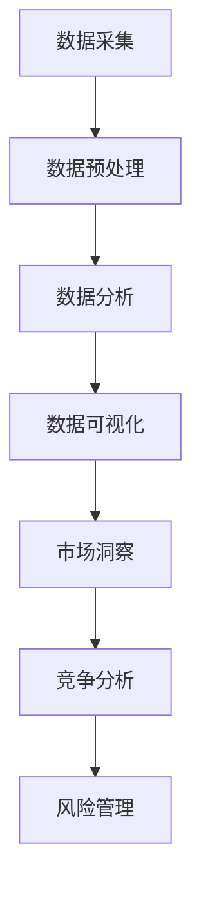

                 

关键词：信息差，行业趋势，大数据，洞察，预测，技术分析

> 摘要：本文深入探讨了大数据技术如何洞悉行业趋势，揭示信息差在行业发展和竞争中的关键作用。通过分析大数据的核心概念、算法原理、数学模型以及实际应用案例，我们旨在为读者提供对未来行业发展趋势的深度洞见，帮助读者在信息爆炸的时代把握先机。

## 1. 背景介绍

在信息化的浪潮中，数据已成为现代社会的重要资产。随着互联网和移动设备的普及，数据量呈爆炸式增长，如何从海量数据中提取有价值的信息，已成为各个行业关注的焦点。信息差，即信息不对称，是指在市场中不同个体获取和处理信息的能力存在差异。这种差异会导致市场参与者在决策、创新和竞争中的优劣之分。大数据技术为解决信息差问题提供了有力工具，通过数据采集、处理、分析和预测，企业能够更精准地洞察行业趋势，把握市场先机。

### 1.1 大数据的发展历程

大数据的概念最早可以追溯到20世纪80年代，随着互联网的兴起和数据存储技术的发展，大数据逐渐成为一种新的数据资源。21世纪初，互联网和社交媒体的普及使得数据量激增，大数据技术开始受到广泛关注。2012年，麦肯锡全球研究所发布报告，将大数据誉为“新石油”，强调了其对于社会、经济和商业变革的重要影响。

### 1.2 信息差的含义

信息差指的是市场上某些参与者能够获得而其他参与者无法获得的特定信息。在竞争激烈的市场中，信息差往往成为企业竞争优势的来源。例如，掌握市场需求的领先企业可以通过信息差迅速调整产品策略，抢占市场份额。

## 2. 核心概念与联系

为了深入理解大数据如何洞悉行业趋势，我们首先需要了解大数据的核心概念及其相互联系。

### 2.1 大数据的核心概念

- **数据量（Volume）**：大数据的首要特征是数据量大，通常以TB、PB甚至EB为单位计量。
- **多样性（Variety）**：大数据来源广泛，包括结构化、半结构化和非结构化数据。
- **速度（Velocity）**：大数据处理速度要求高，需要实时或近实时处理。
- **真实度（Veracity）**：大数据的真实性难以保证，需要数据清洗和处理。

### 2.2 大数据与信息差的关系

大数据技术通过收集、存储、处理和分析海量数据，帮助企业获取行业趋势的信息。这些信息通过分析算法转化为有价值的洞见，从而缩小企业之间的信息差。以下是大数据与信息差之间的关键联系：

- **市场洞察**：通过对销售数据、用户行为数据等进行分析，企业可以洞察市场需求，调整产品策略。
- **竞争分析**：通过分析竞争对手的数据，企业可以了解竞争对手的动态，制定相应的竞争策略。
- **风险管理**：大数据技术可以帮助企业识别潜在风险，降低决策风险。

### 2.3 Mermaid 流程图



### 2.4 大数据生态系统

大数据技术的核心组件包括数据存储、数据管理、数据处理、数据分析等。以下是大数据生态系统的简要概述：

- **数据存储**：Hadoop、NoSQL数据库等用于存储海量数据。
- **数据管理**：数据仓库、数据湖等技术用于管理和整合数据。
- **数据处理**：MapReduce、Spark等计算框架用于大规模数据处理。
- **数据分析**：机器学习、数据挖掘等技术用于提取数据价值。

## 3. 核心算法原理 & 具体操作步骤

### 3.1 算法原理概述

大数据技术涉及多种核心算法，其中常用的包括：

- **回归分析**：用于预测连续值变量，如销售额。
- **聚类分析**：用于将数据分为多个类，如用户群体细分。
- **关联规则学习**：用于发现数据之间的关联关系，如商品推荐。
- **分类算法**：用于分类数据，如客户流失预测。

### 3.2 算法步骤详解

#### 3.2.1 回归分析

1. **数据收集**：收集相关变量数据，如销售额、广告投放等。
2. **数据预处理**：清洗数据，去除缺失值、异常值。
3. **特征选择**：选择对目标变量有显著影响的特征。
4. **模型训练**：使用训练数据集训练回归模型。
5. **模型评估**：使用测试数据集评估模型性能。
6. **预测**：使用训练好的模型进行预测。

#### 3.2.2 聚类分析

1. **数据收集**：收集用户行为、偏好等数据。
2. **数据预处理**：标准化数据，使其适合聚类算法。
3. **选择聚类算法**：如K-means、层次聚类等。
4. **聚类过程**：迭代计算，将数据划分为多个集群。
5. **评估聚类结果**：评估聚类效果，如轮廓系数。
6. **应用**：对用户进行细分，制定个性化营销策略。

#### 3.2.3 关联规则学习

1. **数据收集**：收集商品交易数据。
2. **数据预处理**：处理数据格式，去除重复项。
3. **选择关联规则算法**：如Apriori、Eclat等。
4. **生成频繁项集**：找出数据中的频繁项集。
5. **生成关联规则**：从频繁项集中生成关联规则。
6. **评估规则质量**：评估规则的置信度、支持度等。
7. **应用**：用于推荐系统、市场营销等。

### 3.3 算法优缺点

- **回归分析**：优点包括简单易懂、适用面广，缺点是对于非线性关系表现不佳。
- **聚类分析**：优点是自动发现模式、减少数据维度，缺点是结果依赖于初始聚类中心。
- **关联规则学习**：优点是易于实现、可扩展，缺点是生成规则较多、需要大量计算资源。

### 3.4 算法应用领域

- **零售业**：用于市场分析、库存管理、个性化推荐等。
- **金融业**：用于风险控制、信用评分、投资策略等。
- **医疗健康**：用于疾病预测、健康风险评估、药物研发等。

## 4. 数学模型和公式 & 详细讲解 & 举例说明

### 4.1 数学模型构建

大数据分析中常用的数学模型包括回归模型、聚类模型和关联规则模型。以下分别介绍这些模型的基本公式和构建方法。

#### 4.1.1 回归模型

- **线性回归**：$y = \beta_0 + \beta_1x_1 + \beta_2x_2 + ... + \beta_nx_n$

  其中，$y$为因变量，$x_1, x_2, ..., x_n$为自变量，$\beta_0, \beta_1, \beta_2, ..., \beta_n$为回归系数。

- **多项式回归**：$y = \beta_0 + \beta_1x^1 + \beta_2x^2 + ... + \beta_nx^n$

  其中，$x$为自变量的幂次。

#### 4.1.2 聚类模型

- **K-means聚类**：目标是最小化各个点到聚类中心的距离平方和。

  $J = \sum_{i=1}^{k}\sum_{x \in S_i} ||x - \mu_i||^2$

  其中，$k$为聚类个数，$S_i$为第$i$个聚类，$\mu_i$为聚类中心。

#### 4.1.3 关联规则模型

- **Apriori算法**：用于挖掘频繁项集。

  $support(itemset) = \frac{count(itemset)}{count(all transactions)}$

  其中，$count(itemset)$为包含某项集的交易数，$count(all transactions)$为总交易数。

### 4.2 公式推导过程

#### 4.2.1 回归模型推导

线性回归的推导基于最小二乘法，目标是找到使得预测值与实际值之间误差平方和最小的回归系数。

假设我们有$n$个样本点$(x_1, y_1), (x_2, y_2), ..., (x_n, y_n)$，则线性回归模型的损失函数为：

$$
J = \sum_{i=1}^{n} (y_i - \beta_0 - \beta_1x_i)^2
$$

为了最小化损失函数，我们对$\beta_0$和$\beta_1$分别求导并令导数为零，得到：

$$
\frac{\partial J}{\partial \beta_0} = -2\sum_{i=1}^{n} (y_i - \beta_0 - \beta_1x_i) = 0
$$

$$
\frac{\partial J}{\partial \beta_1} = -2\sum_{i=1}^{n} (x_i(y_i - \beta_0 - \beta_1x_i)) = 0
$$

通过解上述方程组，我们可以得到最优的回归系数$\beta_0$和$\beta_1$。

#### 4.2.2 聚类模型推导

K-means聚类算法的目标是最小化各个点到聚类中心的距离平方和。设$x_i$为第$i$个样本点，$\mu_j$为第$j$个聚类中心，则K-means的目标函数为：

$$
J = \sum_{i=1}^{n}\sum_{j=1}^{k} ||x_i - \mu_j||^2
$$

在每次迭代中，K-means算法会重新计算聚类中心，使得距离平方和最小。具体步骤如下：

1. 随机初始化$k$个聚类中心$\mu_1, \mu_2, ..., \mu_k$。
2. 对每个样本点$x_i$，计算其到各个聚类中心的距离，并将其分配到最近的聚类。
3. 计算每个聚类的新中心，即该聚类内所有样本点的均值。
4. 重复步骤2和3，直至聚类中心不再变化或达到最大迭代次数。

#### 4.2.3 关联规则模型推导

Apriori算法用于挖掘频繁项集，其核心思想是基于频繁项集的递推关系，通过逐层扩展项集，找出所有频繁项集。

假设我们有一个项集$X$，其支持度为$S$，如果$S \geq \theta$，则$X$为频繁项集。根据支持度的定义，有：

$$
S(X) = \frac{|T| - |T - X|}{|T|}
$$

其中，$T$为所有事务的集合。

为了找出所有频繁项集，Apriori算法采用以下步骤：

1. 扫描数据库，计算所有单项集的支持度。
2. 保留支持度大于最小支持度阈值$\theta$的单项集。
3. 对于每个长度为$k$的项集，通过连接频繁项集的(k-1)子集，生成新的项集，并计算其支持度。
4. 重复步骤3，直至生成所有可能的项集。

### 4.3 案例分析与讲解

#### 4.3.1 回归分析案例

假设我们想要预测一家电商平台的月销售额。收集了过去一年的月销售额和广告投入数据，数据如下表所示：

| 月份 | 广告投入（万元）| 月销售额（万元）|
|------|----------------|---------------|
| 1    | 10             | 80            |
| 2    | 12             | 85            |
| 3    | 15             | 90            |
| 4    | 18             | 95            |
| 5    | 20             | 100           |
| 6    | 22             | 105           |
| 7    | 25             | 110           |
| 8    | 28             | 115           |
| 9    | 30             | 120           |
| 10   | 32             | 125           |
| 11   | 35             | 130           |
| 12   | 38             | 135           |

首先，对数据进行预处理，包括去除缺失值、异常值等。然后，选择广告投入作为自变量，月销售额作为因变量，建立线性回归模型。

使用最小二乘法计算回归系数：

$$
\beta_0 = 65.8625, \beta_1 = 3.5625
$$

因此，线性回归模型为：

$$
\text{月销售额} = 65.8625 + 3.5625 \times \text{广告投入}
$$

使用这个模型，我们可以预测未来几个月的月销售额。例如，当广告投入为40万元时，预测的月销售额为：

$$
\text{月销售额} = 65.8625 + 3.5625 \times 40 = 168.3125 \text{万元}
$$

#### 4.3.2 聚类分析案例

假设我们有一家电商平台的用户数据，包括用户的年龄、性别、收入、购买频率等。想要对用户进行细分，以便于制定个性化营销策略。

首先，对数据进行预处理，包括缺失值处理、数据标准化等。然后，选择K-means算法进行聚类分析。

随机初始化3个聚类中心，然后迭代计算，直到聚类中心不再变化。最终，得到3个聚类，如下表所示：

| 聚类 | 年龄 | 性别 | 收入 | 购买频率 |
|------|------|------|------|----------|
| 1    | 18-25 | 男  | 3000-5000 | 高       |
| 2    | 26-35 | 女  | 5000-8000 | 中等     |
| 3    | 36-45 | 男  | 8000-12000 | 低       |

根据聚类结果，我们可以针对不同用户群体制定相应的营销策略。例如，针对第1类用户，可以推出优惠活动、新品推荐等；针对第2类用户，可以提供积分兑换、优惠券等。

#### 4.3.3 关联规则学习案例

假设我们有一家超市的销售数据，包括各种商品的交易记录。想要挖掘商品之间的关联关系，以便于优化货架摆放和促销策略。

首先，对销售数据进行预处理，包括去除重复记录、处理缺失值等。然后，选择Apriori算法进行关联规则学习。

设置最小支持度阈值为30%，最小置信度阈值为70%。经过计算，得到以下几条频繁项集：

| 项集   | 支持度 | 置信度 |
|--------|--------|--------|
| {牛奶，面包} | 50%   | 90%    |
| {面包，鸡蛋} | 40%   | 85%    |
| {鸡蛋，牛奶} | 35%   | 80%    |

根据这些频繁项集，我们可以得出以下结论：购买牛奶和面包的客户更容易购买鸡蛋，因此可以将这三种商品摆放在一起，增加交叉销售的机会。

## 5. 项目实践：代码实例和详细解释说明

### 5.1 开发环境搭建

为了演示大数据技术的应用，我们将使用Python语言和几个常用的库，包括Pandas、NumPy、scikit-learn、Matplotlib等。以下是开发环境搭建的步骤：

1. 安装Python 3.8及以上版本。
2. 使用pip命令安装所需的库：

```bash
pip install pandas numpy scikit-learn matplotlib
```

### 5.2 源代码详细实现

下面我们将通过一个实际案例，展示如何使用Python进行大数据分析。假设我们有一家电商平台的用户数据，包括年龄、性别、收入和购买频率等信息。我们的目标是使用聚类算法对这些用户进行细分。

```python
import pandas as pd
from sklearn.cluster import KMeans
import matplotlib.pyplot as plt

# 5.2.1 数据预处理
# 加载用户数据
data = pd.read_csv('user_data.csv')

# 处理缺失值
data.fillna(data.mean(), inplace=True)

# 数据标准化
data_normalized = (data - data.mean()) / data.std()

# 5.2.2 选择聚类算法
# 使用K-means聚类算法
kmeans = KMeans(n_clusters=3, random_state=42)

# 5.2.3 模型训练
# 训练聚类模型
kmeans.fit(data_normalized)

# 5.2.4 聚类结果分析
# 将用户分配到相应的聚类
user_clusters = kmeans.predict(data_normalized)

# 添加聚类标签到原始数据
data['cluster'] = user_clusters

# 5.2.5 可视化
# 绘制用户年龄和收入分布图
plt.scatter(data['age'], data['income'], c=data['cluster'], cmap='viridis')
plt.xlabel('年龄')
plt.ylabel('收入')
plt.title('用户聚类结果')
plt.show()

# 5.2.6 应用
# 针对每个聚类制定营销策略
for i in range(3):
    cluster_data = data[data['cluster'] == i]
    print(f"聚类{i+1}：")
    print(f"年龄范围：{cluster_data['age'].min()} - {cluster_data['age'].max()}")
    print(f"收入范围：{cluster_data['income'].min()} - {cluster_data['income'].max()}")
    print("购买频率：高/中/低")
    print("\n")
```

### 5.3 代码解读与分析

- **数据预处理**：我们首先加载用户数据，并处理缺失值。数据标准化是为了使不同特征在聚类过程中具有相同的重要性。
- **选择聚类算法**：我们使用K-means聚类算法，这是一种常用的无监督学习方法，用于将数据划分为若干个聚类。
- **模型训练**：我们使用训练数据集对K-means模型进行训练。这里我们设置了3个聚类，因为根据业务需求，我们希望将用户分为3个主要群体。
- **聚类结果分析**：通过调用`predict`方法，我们将每个用户分配到相应的聚类。然后，我们将聚类标签添加到原始数据中。
- **可视化**：我们使用matplotlib库绘制用户年龄和收入的分布图，以便直观地查看聚类结果。
- **应用**：根据每个聚类的特征，我们可以为不同的用户群体制定个性化的营销策略。

### 5.4 运行结果展示

运行上述代码后，我们将看到一个可视化图表，展示不同用户的年龄和收入分布情况。每个颜色代表一个聚类，图表中的每个点表示一个用户。通过这个图表，我们可以直观地看到不同用户群体的分布特点。

此外，代码还将输出每个聚类的主要特征，如年龄和收入范围，以及购买频率。这些信息可以帮助我们为不同用户群体制定个性化的营销策略。

## 6. 实际应用场景

大数据技术已经广泛应用于各个行业，通过洞悉行业趋势，帮助企业实现商业价值。以下是大数据在几个实际应用场景中的案例：

### 6.1 零售业

零售业通过大数据分析，可以实时监控销售情况、库存水平和用户行为。例如，某电商企业通过分析用户购买历史和搜索行为，预测即将到来的购物高峰，提前调整库存和供应链策略，从而提高销售效率和客户满意度。

### 6.2 金融业

金融业通过大数据技术进行风险评估、信用评分和投资策略制定。例如，银行可以使用大数据分析客户的交易记录、信用历史和社交网络信息，更准确地评估客户的信用风险，降低贷款损失。

### 6.3 医疗健康

医疗健康领域通过大数据分析，可以提高疾病预测和诊断的准确性。例如，医院可以使用电子健康记录和基因组数据，分析疾病的发展趋势和风险因素，为患者提供个性化的治疗方案。

### 6.4 交通运输

交通运输行业通过大数据分析，可以提高交通流量管理和安全监控水平。例如，城市交通管理部门可以使用大数据分析交通流量数据，优化交通信号灯控制策略，减少交通拥堵和事故风险。

### 6.5 未来应用展望

随着大数据技术的不断进步，其在各行业中的应用前景将更加广阔。未来，大数据分析将更注重实时性、智能化和个性化。例如，通过结合人工智能和物联网技术，大数据分析可以实现对复杂系统的高效监控和预测，为行业创新提供新的动力。

## 7. 工具和资源推荐

为了更好地掌握大数据技术和应用，以下是几个推荐的工具和资源：

### 7.1 学习资源推荐

- **《大数据技术导论》**：这是一本全面介绍大数据技术基础和应用的教材，适合初学者阅读。
- **《Python数据分析》**：这本书详细介绍了Python在数据分析领域的应用，包括数据预处理、分析和可视化等技术。
- **《数据科学入门》**：这本书适合对数据科学感兴趣的读者，介绍了数据科学的基本概念和应用案例。

### 7.2 开发工具推荐

- **Python**：Python是一种广泛使用的数据科学编程语言，具有丰富的库和框架，如Pandas、NumPy和Matplotlib。
- **Jupyter Notebook**：Jupyter Notebook是一种交互式的开发环境，适合进行数据分析和可视化。
- **Hadoop和Spark**：Hadoop和Spark是大数据处理框架，可以高效地处理海量数据。

### 7.3 相关论文推荐

- **“The Data Science Revolution”**：这篇论文介绍了数据科学对现代社会的影响和重要性。
- **“Big Data: A Revolution That Will Transform How We Live, Work, and Think”**：这本书详细讨论了大数据技术的应用和未来趋势。

## 8. 总结：未来发展趋势与挑战

### 8.1 研究成果总结

大数据技术在过去几十年取得了显著进展，其在各个行业中的应用日益广泛。通过数据采集、处理、分析和预测，企业能够更精准地洞察行业趋势，优化决策，提高竞争力。

### 8.2 未来发展趋势

未来，大数据技术将继续朝着实时性、智能化和个性化方向发展。随着人工智能和物联网技术的融合，大数据分析将更高效地处理复杂系统，为行业创新提供新动力。

### 8.3 面临的挑战

尽管大数据技术具有巨大潜力，但其在实际应用中仍面临一些挑战。例如，数据隐私和安全问题、数据质量和一致性保证等。此外，对于非技术背景的决策者，如何有效地利用大数据技术也是一个难题。

### 8.4 研究展望

未来，大数据技术研究应重点关注以下几个方面：

- **隐私保护**：研究更为安全的隐私保护技术，确保数据在分析和共享过程中的隐私安全。
- **数据治理**：建立完善的数据治理体系，确保数据的质量、一致性和可靠性。
- **跨领域融合**：推动大数据与其他领域技术的融合，如生物信息学、金融科技等，为行业创新提供新思路。

## 9. 附录：常见问题与解答

### 9.1 如何处理大数据中的噪声和异常值？

处理大数据中的噪声和异常值通常包括以下几个步骤：

1. **数据清洗**：去除重复记录、缺失值和错误记录。
2. **异常值检测**：使用统计学方法或机器学习方法检测异常值。
3. **异常值处理**：对于检测到的异常值，可以选择删除、替换或保留，具体取决于业务需求。

### 9.2 大数据分析和数据挖掘的区别是什么？

大数据分析通常指对海量数据进行处理、分析和解读，以发现有价值的信息和趋势。而数据挖掘则是大数据分析的一种技术，旨在从大量数据中发现隐含的模式、关联和规律。

### 9.3 如何保证大数据分析结果的可靠性？

保证大数据分析结果的可靠性包括以下几个关键点：

1. **数据质量**：确保数据源可靠、数据一致性和数据完整性。
2. **算法选择**：选择合适的数据分析算法，并确保其适用性。
3. **模型验证**：使用交叉验证、测试集等方法验证模型的性能。
4. **结果解释**：对分析结果进行深入解释和验证，避免误导性结论。

