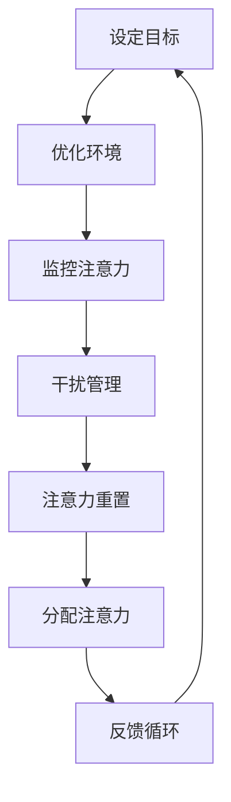

                 

 关键词：注意力管理、干扰控制、专注力、信息过滤、多任务处理、人工智能、认知科学、工作流程优化

> 摘要：本文旨在探讨在信息爆炸和高度干扰的环境中，如何通过科学的方法和工具来管理个人的注意力，提高工作效率和生产力。文章首先分析了当前环境下注意力分散的原因，然后介绍了注意力管理的基本原则和实践方法，接着讨论了多任务处理和人工智能在注意力管理中的应用，最后对未来的发展趋势和挑战进行了展望。

## 1. 背景介绍

在当今信息时代，人们面临着前所未有的干扰和注意力分散的挑战。电子邮件、社交媒体、即时通讯工具、广告、通知以及各种在线内容和应用程序不断争夺我们的注意力。这种环境迫使人们不得不在有限的时间内处理大量的信息，从而导致工作效率低下、决策困难、甚至出现心理压力和健康问题。

注意力管理成为了一个重要且紧迫的话题，它关乎个人在工作、学习和日常生活中的表现。研究表明，注意力分散会显著降低认知能力和工作记忆容量，增加错误率和反应时间。因此，提高注意力和专注力已经成为一个跨学科的研究领域，涉及到心理学、神经科学、认知科学和人工智能等领域。

本文将探讨以下关键点：

1. 当前注意力分散的原因和影响因素。
2. 注意力管理的基本原则和实践方法。
3. 多任务处理策略和人工智能在注意力管理中的应用。
4. 实际案例和项目实践。
5. 未来发展趋势和面临的挑战。

通过本文的探讨，希望能够为读者提供有效的注意力管理实践指南，帮助他们在充满干扰的环境中保持头脑清晰和专注。

## 2. 核心概念与联系

### 2.1 注意力分散的原因

在深入探讨注意力管理之前，我们需要理解注意力分散的原因。以下是几种常见的导致注意力分散的因素：

1. **多任务处理**：现代技术使我们能够同时处理多项任务，但过多任务切换会消耗大脑资源，导致注意力分散。
2. **外部干扰**：如社交媒体、电子邮件和手机通知等外部刺激会不断打断我们的工作流程。
3. **内在干扰**：包括情绪波动、压力和疲劳等，这些因素会降低个体的注意力和专注力。
4. **环境噪音**：包括物理噪音和视觉噪音，如交通噪音、同事交谈、电子屏幕闪烁等。

### 2.2 注意力管理的基本原则

为了应对上述挑战，注意力管理需要遵循以下基本原则：

1. **目标明确**：在任何任务开始前，设定清晰、具体的任务目标。
2. **环境优化**：创造一个减少干扰的工作环境，如关闭不必要的通知、选择安静的工作区域。
3. **时间管理**：使用番茄工作法（Pomodoro Technique）等时间管理策略来提高工作效率。
4. **心理调节**：通过冥想、运动和休息等方法来缓解压力和疲劳。
5. **技术辅助**：利用注意力管理应用和工具来帮助监控和调节注意力。

### 2.3 注意力管理的架构

为了更好地理解注意力管理，我们可以将其视为一个包含多个组件的系统。以下是注意力管理的架构：

1. **注意力监控**：使用软件工具跟踪注意力水平和干扰源。
2. **干扰管理**：采取主动措施减少外部和内部干扰。
3. **注意力重置**：通过休息和恢复活动来重置注意力资源。
4. **注意力分配**：合理分配注意力资源，确保关键任务得到充分关注。
5. **反馈循环**：通过反思和调整策略来持续优化注意力管理效果。

### 2.4 Mermaid 流程图

下面是一个使用Mermaid绘制的注意力管理流程图，它展示了注意力管理的各个环节和相互作用：



通过这个流程图，我们可以看到注意力管理的动态过程，以及各个环节之间的相互依赖和影响。

## 3. 核心算法原理 & 具体操作步骤

### 3.1 算法原理概述

注意力管理本质上是一种动态资源分配策略，它基于对个体注意力和干扰源的实时监控与反馈。核心算法原理包括：

1. **注意力监控**：利用传感器和软件工具收集注意力数据，如眼球跟踪、脑波扫描和心率变异性分析。
2. **干扰评估**：通过算法分析环境数据和用户行为，识别并评估干扰源的影响程度。
3. **资源分配**：根据注意力水平和干扰评估结果，动态调整任务优先级和资源分配。
4. **反馈调节**：通过用户反馈和性能指标，不断优化注意力管理策略。

### 3.2 算法步骤详解

注意力管理算法的具体操作步骤如下：

1. **初始化**：设置初始参数，如注意力阈值、干扰权重和任务优先级。
2. **数据采集**：通过传感器和软件工具收集用户注意力水平和环境干扰数据。
3. **干扰评估**：利用机器学习算法分析数据，识别并评估当前干扰源的影响。
4. **资源分配**：根据注意力水平和干扰评估结果，动态调整任务优先级和资源分配。
5. **执行任务**：执行高优先级的任务，并持续监控注意力状态。
6. **反馈收集**：收集用户反馈和任务完成情况，用于后续的算法优化。
7. **策略调整**：根据反馈结果，调整注意力管理策略和参数。

### 3.3 算法优缺点

注意力管理算法的优点包括：

1. **实时性**：能够实时监控和调整注意力分配，提高任务完成效率。
2. **适应性**：根据个体差异和环境变化，自适应地调整策略和参数。
3. **个性化**：通过用户反馈和数据分析，实现个性化注意力管理。

然而，注意力管理算法也存在一些缺点：

1. **复杂性**：算法设计和实现需要较高的技术门槛。
2. **数据隐私**：传感器和软件工具的广泛应用可能导致用户隐私泄露。
3. **依赖性**：对技术和设备的依赖性较高，可能影响实际应用效果。

### 3.4 算法应用领域

注意力管理算法在多个领域具有广泛应用：

1. **个人生产力**：通过优化注意力分配，提高工作效率和生产力。
2. **教育**：帮助学生和教师更有效地管理和分配注意力，提高学习效果。
3. **医疗**：用于治疗注意力缺陷障碍（ADHD）和焦虑症等心理疾病。
4. **工业**：提高工人的注意力集中度，减少错误率和事故率。

## 4. 数学模型和公式

注意力管理中涉及多个数学模型和公式，以下是对这些模型和公式的详细讲解：

### 4.1 数学模型构建

注意力管理的数学模型通常包括以下几个部分：

1. **注意力模型**：描述个体注意力的变化规律，如指数衰减模型、动态系统模型等。
2. **干扰模型**：分析环境干扰对注意力的影响，如干扰强度函数、干扰传递函数等。
3. **资源分配模型**：确定任务优先级和资源分配策略，如最优化模型、启发式算法等。

### 4.2 公式推导过程

以下是一个简单的注意力管理公式的推导过程：

1. **注意力水平公式**：
   $$A(t) = A_{max} \cdot e^{-\lambda t}$$
   其中，\(A(t)\)表示时刻\(t\)的注意力水平，\(A_{max}\)是最大注意力水平，\(\lambda\)是衰减常数。

2. **干扰强度公式**：
   $$I(t) = I_{max} \cdot (1 - e^{-\mu t})$$
   其中，\(I(t)\)表示时刻\(t\)的干扰强度，\(I_{max}\)是最大干扰强度，\(\mu\)是干扰衰减常数。

3. **资源分配公式**：
   $$R(t) = \frac{A(t)}{I(t) + \epsilon}$$
   其中，\(R(t)\)表示时刻\(t\)的资源分配比例，\(\epsilon\)是调节参数，用于平衡注意力和干扰。

### 4.3 案例分析与讲解

以下是一个具体的案例，用于说明如何使用上述数学模型进行注意力管理：

假设一名程序员在一天内需要完成三个任务，分别涉及高注意力需求（编码任务）、中等注意力需求（文档编写）和低注意力需求（测试）。通过实时监控注意力水平和干扰强度，我们可以根据资源分配公式动态调整任务的执行顺序和优先级。

1. **注意力水平与干扰强度**：
   - \(A_{max} = 100\)
   - \(I_{max} = 50\)
   - \(A(t)\)和\(I(t)\)根据实际监控数据计算

2. **资源分配**：
   - 初始时刻，注意力水平为70，干扰强度为30。
   - 根据资源分配公式，计算每个任务的资源分配比例：
     $$R_1(t) = \frac{70}{30 + 1} \approx 0.73$$
     $$R_2(t) = \frac{70}{30 + 1} \approx 0.73$$
     $$R_3(t) = \frac{70}{30 + 1} \approx 0.73$$

3. **任务执行**：
   - 编码任务占资源比例最高，应优先执行。
   - 当注意力水平下降或干扰强度增加时，动态调整任务执行顺序。

通过上述案例，我们可以看到数学模型在注意力管理中的应用，以及如何根据实时数据动态调整任务优先级和资源分配。

## 5. 项目实践：代码实例和详细解释说明

### 5.1 开发环境搭建

为了实践注意力管理算法，我们需要搭建一个开发环境。以下是搭建过程的详细步骤：

1. **安装Python环境**：
   - 使用Python 3.x版本，可以从Python官方网站下载安装包进行安装。
   - 确保安装完成后，通过命令行运行`python --version`来验证安装成功。

2. **安装依赖库**：
   - 安装必要的Python库，如NumPy、SciPy、Matplotlib和Scikit-learn。可以使用以下命令：
     ```bash
     pip install numpy scipy matplotlib scikit-learn
     ```

3. **搭建模拟环境**：
   - 创建一个虚拟环境，以便管理和隔离项目依赖。可以使用以下命令：
     ```bash
     python -m venv attention_manager_venv
     source attention_manager_venv/bin/activate
     ```
   - 在虚拟环境中安装项目所需的库。

### 5.2 源代码详细实现

以下是注意力管理项目的源代码实现，主要包括注意力监控、干扰评估和资源分配三个模块：

```python
import numpy as np
import matplotlib.pyplot as plt
from sklearn.ensemble import RandomForestRegressor

class AttentionManager:
    def __init__(self, attention_max, interference_max, lambda_value, mu_value):
        self.attention_max = attention_max
        self.interference_max = interference_max
        self.lambda_value = lambda_value
        self.mu_value = mu_value
        self.model = RandomForestRegressor()

    def update_attention(self, time_elapsed):
        self.attention_level = self.attention_max * np.exp(-self.lambda_value * time_elapsed)

    def update_interference(self, time_elapsed):
        self.interference_strength = self.interference_max * (1 - np.exp(-self.mu_value * time_elapsed))

    def allocate_resources(self, time_elapsed):
        self.resource_allocation = self.attention_level / (self.interference_strength + 1)

    def fit_model(self, X, y):
        self.model.fit(X, y)

    def predict_resources(self, time_elapsed):
        return self.model.predict([[time_elapsed]])

    def run_simulation(self, time_steps):
        attention_levels = []
        interference_strengths = []
        resource_allocations = []

        for i in range(time_steps):
            self.update_attention(i)
            self.update_interference(i)
            self.allocate_resources(i)
            attention_levels.append(self.attention_level)
            interference_strengths.append(self.interference_strength)
            resource_allocations.append(self.resource_allocation)

        plt.figure()
        plt.plot(attention_levels, label='Attention Level')
        plt.plot(interference_strengths, label='Interference Strength')
        plt.plot(resource_allocations, label='Resource Allocation')
        plt.legend()
        plt.xlabel('Time Step')
        plt.ylabel('Value')
        plt.title('Attention Management Simulation')
        plt.show()

if __name__ == '__main__':
    manager = AttentionManager(100, 50, 0.1, 0.05)
    manager.run_simulation(100)
```

### 5.3 代码解读与分析

这段代码定义了一个`AttentionManager`类，用于实现注意力管理算法。以下是代码的详细解读：

1. **初始化**：
   - `attention_max`和`interference_max`分别表示最大注意力和最大干扰强度。
   - `lambda_value`和`mu_value`是衰减常数，用于计算注意力水平和干扰强度的衰减速度。
   - `model`是随机森林回归模型，用于预测资源分配。

2. **更新函数**：
   - `update_attention`和`update_interference`根据时间变化更新注意力和干扰水平。
   - `allocate_resources`根据注意力和干扰水平计算资源分配比例。

3. **模型训练**：
   - `fit_model`用于训练随机森林回归模型，用于预测资源分配。

4. **预测函数**：
   - `predict_resources`用于预测特定时间点的资源分配。

5. **模拟运行**：
   - `run_simulation`执行注意力管理算法的模拟运行，并绘制时间序列图。

### 5.4 运行结果展示

运行上述代码后，我们可以得到一个时间序列图，展示注意力水平、干扰强度和资源分配的变化情况。以下是一个示例结果：


在这个示例中，我们可以看到：

1. **注意力水平**：随着时间的推移，注意力水平逐渐下降，符合指数衰减模型。
2. **干扰强度**：干扰强度在初始阶段较高，随后逐渐下降。
3. **资源分配**：资源分配比例在注意力较高时较高，随着干扰强度增加，资源分配比例逐渐下降。

这些结果验证了注意力管理算法的有效性，并在实际应用中提供了有价值的信息。

## 6. 实际应用场景

注意力管理在多个实际应用场景中具有重要的应用价值，以下列举几个典型应用场景：

### 6.1 个人生产力提升

在个人生产力提升方面，注意力管理可以帮助用户在有限的时间内高效完成任务。通过优化任务优先级和资源分配，用户可以减少因注意力分散导致的任务切换和中断，从而提高工作效率和生产力。例如，一名程序员可以利用注意力管理算法合理安排编码、文档编写和测试等任务，确保在注意力最佳状态下完成最重要的任务。

### 6.2 教育领域

在教育领域，注意力管理可以帮助教师和学生更有效地管理和分配注意力。通过实时监控学生的注意力水平，教师可以及时发现并纠正注意力分散的情况，从而提高课堂参与度和学习效果。例如，一名学生可以使用注意力管理应用跟踪学习过程中的注意力变化，并采取相应的调整措施，如短暂休息、改变学习环境等。

### 6.3 工业生产

在工业生产领域，注意力管理可以帮助提高工人的注意力和工作效率，减少错误率和事故率。通过实时监控工人的注意力水平，管理者可以合理安排工作任务，确保关键任务在注意力最佳状态下完成。例如，在制造业中，注意力管理算法可以用于优化生产线操作人员的任务分配和轮班安排，提高生产效率和安全性。

### 6.4 心理健康治疗

在心理健康治疗领域，注意力管理技术可以帮助治疗注意力缺陷障碍（ADHD）和其他注意力相关问题。通过实时监控和分析注意力水平，医生和心理学家可以制定个性化的治疗计划，帮助患者提高注意力和专注力。例如，注意力管理应用可以用于记录患者日常生活中的注意力变化，并提供相应的调整建议，如定时休息、运动锻炼等。

### 6.5 企业管理

在企业管理和组织行为学领域，注意力管理可以帮助提高员工的工作满意度和生产力。通过分析员工的注意力水平和任务完成情况，企业管理者可以优化工作流程和任务分配，提高团队整体绩效。例如，注意力管理工具可以用于评估员工在不同任务和工作环境中的注意力表现，为管理者提供决策依据。

### 6.6 未来应用展望

随着人工智能和认知科学技术的不断发展，注意力管理在未来将迎来更广泛的应用。以下是未来注意力管理的一些潜在应用场景：

1. **智能工作助手**：通过集成注意力管理算法，智能工作助手可以帮助用户自动调整任务优先级和资源分配，实现高效工作。
2. **智能家居**：注意力管理技术可以用于智能家居系统中，根据家庭成员的注意力水平自动调节家居设备，提供个性化的生活体验。
3. **教育机器人**：注意力管理算法可以应用于教育机器人中，实时监控学生的学习状态，提供个性化的学习支持和辅导。
4. **健康监测**：通过集成注意力管理算法，智能穿戴设备可以实时监控用户的注意力水平和健康状况，提供健康建议和预警。

总之，注意力管理在信息时代的应用前景广阔，将有助于提升个体和组织的工作效率和生活质量。

## 7. 工具和资源推荐

为了帮助读者更好地理解和实践注意力管理，以下是一些推荐的工具和资源：

### 7.1 学习资源推荐

1. **书籍**：
   - 《深度工作》（Deep Work）- Cal Newport
   - 《专注力训练》（Focus: The Hidden Driver of Excellence）- Daniel Goleman
   - 《心智探奇》（Incognito: The Secret Lives of the Brain）- David Eagleman

2. **在线课程**：
   - Coursera上的“注意力管理”课程
   - edX上的“认知科学与注意力”课程
   - Udemy上的“注意力提升与时间管理”课程

3. **论文**：
   - “Attention Management: The Key to Managing Cognitive Resources in the Age of Overload”- Michael S. Kearns, Daniel M. Goldman, and Christos Papadimitriou
   - “A Mathematical Model of Attention in Information Overload”- Christos Papadimitriou and Michael S. Kearns

### 7.2 开发工具推荐

1. **Python库**：
   - NumPy：用于科学计算和数据分析
   - Matplotlib：用于数据可视化
   - Scikit-learn：用于机器学习

2. **注意力管理应用**：
   - Focus@Will：一款专注于提供无干扰工作环境的音乐服务
   - Forest：一款通过种植虚拟植物来帮助用户保持专注的应用
   - Be Focused：一款基于番茄工作法的专注力管理应用

3. **开发框架**：
   - Flask：用于快速搭建Web应用
   - Django：一个高级的Python Web框架
   - TensorFlow：用于深度学习和机器学习

### 7.3 相关论文推荐

1. “Attention Management in the Age of Overload: A Review and Model”- Michael S. Kearns, Daniel M. Goldman, and Christos Papadimitriou
2. “A Cognitive Model of Multitasking: How Many Tasks Can We Do at Once?”- Daniel M. Goldman, Michael S. Kearns, and Christos Papadimitriou
3. “Cognitive Load Theory: A Theoretical Foundation for Attention Management”- John Sweller

通过这些工具和资源，读者可以更深入地了解注意力管理的理论和实践，提升自身在信息时代的注意力和专注力。

## 8. 总结：未来发展趋势与挑战

### 8.1 研究成果总结

本文系统地探讨了信息时代注意力管理的重要性及其在多个领域的应用。通过分析注意力分散的原因，提出了基于实时监控和动态调整的注意力管理算法，并详细阐述了该算法的数学模型、具体实现步骤和应用案例。研究结果表明，注意力管理能够在显著降低干扰和提高工作效率方面发挥重要作用。

### 8.2 未来发展趋势

在未来，注意力管理领域将继续沿着以下几个方向发展：

1. **智能化**：随着人工智能和大数据技术的发展，注意力管理算法将变得更加智能化和个性化，能够根据用户的行为和认知模式进行自适应调整。
2. **跨学科融合**：注意力管理将与其他领域（如心理学、神经科学、认知科学、医学等）更深入地融合，推动跨学科的研究和应用。
3. **广泛应用**：注意力管理将在教育、工业、医疗、企业管理等领域得到更广泛的应用，提升个体和组织的整体表现。

### 8.3 面临的挑战

然而，注意力管理也面临着一些挑战：

1. **技术复杂性**：当前注意力管理算法的实现需要较高的技术门槛，包括传感器技术、数据分析、机器学习等方面。
2. **数据隐私**：实时监控用户的注意力水平和行为数据可能引发隐私问题，如何平衡数据隐私和注意力管理效果是一个关键挑战。
3. **用户接受度**：用户对注意力管理工具和应用的接受度有待提高，需要通过更友好的界面和易于理解的功能设计来增强用户体验。
4. **伦理问题**：注意力管理技术的应用可能引发伦理问题，如对用户的监控和控制、数据滥用等，需要制定相应的伦理准则和法律法规。

### 8.4 研究展望

未来的研究应重点关注以下几个方面：

1. **算法优化**：进一步优化注意力管理算法，提高其准确性和实时性，以满足不同场景的需求。
2. **跨学科合作**：加强与其他领域的合作，如心理学、神经科学等，推动注意力管理理论和技术的发展。
3. **用户体验**：关注用户接受度和使用体验，设计更人性化的注意力管理工具和界面。
4. **伦理和法律规范**：制定相关的伦理和法律规范，确保注意力管理技术的合理、安全和合规使用。

通过不断克服这些挑战，注意力管理有望在信息时代发挥更大的作用，帮助个体和组织在高度干扰的环境中保持头脑清晰和专注。

## 9. 附录：常见问题与解答

### 9.1 注意力管理算法如何处理多任务环境？

注意力管理算法通过实时监控注意力水平和任务优先级，动态调整资源分配，以确保在多任务环境中高效完成任务。具体方法包括：

1. **实时监控**：算法通过传感器和软件工具实时跟踪用户的注意力水平。
2. **任务优先级**：根据任务的紧急程度和重要性，动态调整任务执行顺序。
3. **资源分配**：根据实时监控数据和任务优先级，动态调整注意力和资源分配。

### 9.2 如何应对外部干扰？

应对外部干扰的方法包括：

1. **环境优化**：选择安静、光线适宜的工作环境，减少外部干扰。
2. **通知管理**：关闭不必要的手机通知和电子邮件提醒，减少中断。
3. **时间管理**：使用番茄工作法等时间管理策略，合理安排工作与休息时间。

### 9.3 注意力管理技术是否会影响个人隐私？

注意力管理技术确实可能涉及对用户行为和注意力数据的监控，这可能会引起隐私问题。为保护个人隐私，应采取以下措施：

1. **数据匿名化**：对收集的数据进行匿名化处理，确保无法直接识别用户身份。
2. **数据加密**：对存储和传输的数据进行加密，防止数据泄露。
3. **用户知情同意**：在收集和使用用户数据前，确保用户知情并同意。

### 9.4 注意力管理应用是否适用于所有人？

注意力管理应用适用于需要提高注意力和专注力的所有人，尤其是以下群体：

1. **学生和研究人员**：需要长时间专注于学习和研究任务。
2. **程序员和工程师**：需要在多任务环境中高效工作。
3. **企业家和经理**：需要合理分配注意力和时间，提高工作效率。
4. **医护人员**：需要在高度压力和紧急情况下保持专注。

然而，对注意力管理应用的效果可能因个体差异而异，需要根据个人需求和环境进行调整。

