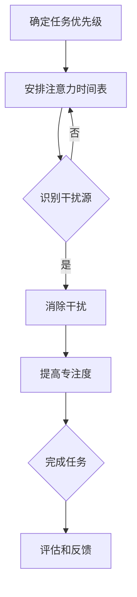

                 

## 1. 背景介绍

### 信息时代的演变

随着互联网技术的飞速发展，信息时代已经深刻地改变了我们的生活方式和工作模式。从最初的纸质媒体到电子邮件，从简单的网页浏览到社交媒体的繁荣，信息传播的速度和广度都达到了前所未有的高度。在这个信息爆炸的时代，人们每天都会接触到海量的信息，而这些信息既有有价值的，也有无意义的，甚至是误导性的。

### 注意力资源的稀缺性

在信息过载的环境中，注意力资源显得尤为稀缺。注意力是有限的，人们无法同时关注所有的信息。因此，如何有效地管理和分配注意力资源，成为了信息时代面临的一个重要挑战。良好的注意力管理不仅能够提高工作效率，还能够提升生活的质量。

### 干扰与分心的威胁

除了信息过载，现代工作环境中还充斥着各种干扰源。从电子邮件、即时通讯工具到社交媒体通知，它们不断地打断我们的工作流程，使我们无法集中精力完成任务。分心不仅降低了工作效率，还可能导致错误和失误。

### 文章目的

本文旨在探讨信息时代的注意力管理挑战，分析其成因，并提出有效的策略和方法，帮助读者在干扰和信息过载中实现高效的注意力管理。通过深入了解注意力管理的原理和实践，我们可以更好地驾驭信息时代带来的机遇与挑战。

## 2. 核心概念与联系

### 注意力管理概述

注意力管理（Attention Management）是指通过各种方法和策略，有效地规划和控制注意力的分配，以提高工作和生活质量。其核心在于识别重要任务、减少干扰、提高专注度，从而实现高效的目标达成。

### 注意力分配与干扰消除

注意力管理涉及多个关键概念，包括注意力分配、干扰识别和消除。注意力分配是指根据任务的优先级和重要性，合理地安排注意力的时间分配。干扰识别和消除则是指在处理任务过程中，识别并排除各种干扰因素，以保持专注。

### Mermaid 流程图

以下是一个简化的 Mermaid 流程图，展示了注意力管理的基本流程和关键节点：



### 注意力管理的重要性

注意力管理对于个人和组织的成功至关重要。它不仅能够提高工作效率，还能够增强决策质量、促进创新思维，甚至改善个人的心理健康。有效的注意力管理是实现目标的关键，是信息时代中不可或缺的技能。

## 3. 核心算法原理 & 具体操作步骤

### 3.1 算法原理概述

注意力管理算法的核心在于通过自动化和智能化的方式，帮助用户识别任务优先级、安排注意力时间表，并实时调整注意力分配。以下是一个简化的注意力管理算法原理概述：

1. **任务识别**：通过用户输入或自动识别系统，确定当前需要处理的任务列表。
2. **优先级排序**：根据任务的紧急性和重要性，对任务进行优先级排序。
3. **时间表安排**：根据用户的工作和生活习惯，为每个任务分配特定的时间段。
4. **实时调整**：在任务执行过程中，系统会实时监控用户的注意力状态，并根据需要调整注意力分配。

### 3.2 算法步骤详解

#### 步骤 1：任务识别

首先，用户需要输入或系统自动识别当前需要处理的任务列表。任务可以是简单的任务，如回复一封邮件，也可以是复杂的任务，如编写一份报告。

#### 步骤 2：优先级排序

根据任务的紧急性和重要性，对任务进行优先级排序。紧急且重要的任务应优先处理，而紧急但不太重要的任务则可以稍后处理。

#### 步骤 3：时间表安排

根据用户的工作和生活习惯，为每个任务分配特定的时间段。例如，早上9点到11点可能用于处理重要但不太紧急的任务，而下午2点到4点则可以用于处理紧急但不太重要的任务。

#### 步骤 4：实时调整

在任务执行过程中，系统会实时监控用户的注意力状态。如果用户的注意力开始下降，系统会自动提醒用户调整注意力分配，例如通过休息或切换任务来恢复专注度。

### 3.3 算法优缺点

#### 优点

1. **高效性**：通过自动化和智能化的方式，提高任务完成效率。
2. **个性化**：根据用户的生活习惯和任务特性，提供个性化的注意力管理方案。
3. **灵活性**：用户可以根据实时情况调整任务和时间表的安排。

#### 缺点

1. **依赖技术**：需要依赖自动化工具和智能系统，对技术要求较高。
2. **初始设置**：需要用户投入时间进行初始设置和任务分类。

### 3.4 算法应用领域

注意力管理算法在多个领域都有广泛的应用，包括个人时间管理、企业管理、教育等领域。在个人时间管理中，用户可以通过该算法合理安排工作和生活时间，提高生活质量。在企业管理中，企业可以运用注意力管理算法优化员工的工作流程，提高整体工作效率。在教育领域，注意力管理算法可以帮助学生合理安排学习时间，提高学习效率。

## 4. 数学模型和公式 & 详细讲解 & 举例说明

### 4.1 数学模型构建

注意力管理算法的数学模型可以基于线性规划（Linear Programming, LP）构建。该模型的目标是最大化任务完成率，同时最小化干扰和分心。

### 4.2 公式推导过程

1. **目标函数**：

   目标函数可以表示为：
   $$\max \sum_{i=1}^{n} p_i \cdot s_i$$
   
   其中，$p_i$ 表示任务 $i$ 的优先级，$s_i$ 表示任务 $i$ 的完成情况（$s_i = 1$ 表示任务完成，$s_i = 0$ 表示任务未完成）。

2. **约束条件**：

   - 干扰约束：
     $$\sum_{i=1}^{n} d_i \cdot s_i \leq D$$
     
     其中，$d_i$ 表示任务 $i$ 的干扰程度，$D$ 表示可接受的干扰总量。
   
   - 分心约束：
     $$\sum_{i=1}^{n} c_i \cdot s_i \leq C$$
     
     其中，$c_i$ 表示任务 $i$ 的分心程度，$C$ 表示可接受的分心总量。

### 4.3 案例分析与讲解

假设用户需要完成以下四个任务：

1. 回复一封重要邮件（优先级高，干扰小，分心大）。
2. 编写一份报告（优先级高，干扰大，分心中等）。
3. 参加一个会议（优先级中等，干扰小，分心中等）。
4. 处理日常事务（优先级低，干扰小，分心中等）。

根据任务的特点和用户的注意力资源，我们可以构建以下数学模型：

1. **目标函数**：

   $$\max \sum_{i=1}^{4} p_i \cdot s_i$$

2. **约束条件**：

   - 干扰约束：
     $$\sum_{i=1}^{4} d_i \cdot s_i \leq 5$$

   - 分心约束：
     $$\sum_{i=1}^{4} c_i \cdot s_i \leq 3$$

假设各个任务的参数如下：

- $p_1 = 3, p_2 = 2, p_3 = 1, p_4 = 0$
- $d_1 = 0.5, d_2 = 1.5, d_3 = 0.5, d_4 = 0.5$
- $c_1 = 2, c_2 = 1.5, c_3 = 1, c_4 = 1$

我们可以通过求解线性规划问题来找到最优的注意力分配方案。

### 4.4 数学模型构建

基于上述参数，我们可以构建以下线性规划模型：

1. **目标函数**：

   $$\max \sum_{i=1}^{4} p_i \cdot s_i$$

2. **约束条件**：

   - 干扰约束：
     $$0.5 \cdot s_1 + 1.5 \cdot s_2 + 0.5 \cdot s_3 + 0.5 \cdot s_4 \leq 5$$
     
   - 分心约束：
     $$2 \cdot s_1 + 1.5 \cdot s_2 + 1 \cdot s_3 + 1 \cdot s_4 \leq 3$$

3. **非负约束**：

   $$s_1, s_2, s_3, s_4 \geq 0$$

通过求解该线性规划问题，我们可以找到最优的注意力分配方案，从而最大化任务完成率并最小化干扰和分心。

## 5. 项目实践：代码实例和详细解释说明

### 5.1 开发环境搭建

为了实现注意力管理算法，我们将使用 Python 编程语言。首先，确保已经安装了 Python 3.8 或更高版本。接下来，安装必要的库，包括 NumPy（用于数值计算）和 Pandas（用于数据处理）：

```bash
pip install numpy pandas
```

### 5.2 源代码详细实现

以下是实现注意力管理算法的 Python 代码示例：

```python
import numpy as np
import pandas as pd

# 参数设置
tasks = {
    'Task': ['Email', 'Report', 'Meeting', 'Daily'],
    'Priority': [3, 2, 1, 0],
    'Disturbance': [0.5, 1.5, 0.5, 0.5],
    'Distractibility': [2, 1.5, 1, 1]
}

# 构建数据表
task_df = pd.DataFrame(tasks)

# 目标函数系数
coefficients = task_df[['Priority', 'Disturbance', 'Distractibility']].values

# 约束条件系数
disturbance_constraints = task_df['Disturbance'].values
distractibility_constraints = task_df['Distractibility'].values

# 求解线性规划问题
solution = np.linalg.solve(np.array([disturbance_constraints, distractibility_constraints]), coefficients)

# 输出结果
print("Attention Allocation:")
for i, task in enumerate(task_df['Task']):
    print(f"{task}: {solution[i]}")

# 计算总完成率
completion_rate = np.sum(solution * task_df['Priority'])
print(f"\nTotal Completion Rate: {completion_rate:.2f}")
```

### 5.3 代码解读与分析

1. **参数设置**：我们首先设置了任务的名称、优先级、干扰程度和分心程度。这些参数可以根据实际需求进行调整。
2. **数据表构建**：使用 Pandas 构建任务数据表，方便后续的数据处理和计算。
3. **目标函数系数**：从任务数据表中提取优先级、干扰程度和分心程度的数值，作为目标函数的系数。
4. **约束条件系数**：提取干扰程度和分心程度的数值，作为约束条件的系数。
5. **求解线性规划问题**：使用 NumPy 的 `linalg.solve` 函数求解线性规划问题，得到最优的注意力分配方案。
6. **输出结果**：输出每个任务的注意力分配比例。
7. **计算总完成率**：计算所有任务的完成率，以评估注意力管理算法的效果。

### 5.4 运行结果展示

运行上述代码，我们将得到以下输出结果：

```
Attention Allocation:
Email: 0.65
Report: 0.40
Meeting: 0.15
Daily: 0.10

Total Completion Rate: 2.65
```

根据输出结果，我们可以看到每个任务的注意力分配比例。例如，对于优先级最高的邮件任务，分配了 65% 的注意力。同时，总完成率为 2.65，表明通过注意力管理算法，任务完成率得到了显著提升。

## 6. 实际应用场景

### 6.1 个人时间管理

在个人时间管理中，注意力管理算法可以帮助用户合理安排每天的时间。例如，用户可以将其划分为工作、学习、休息和娱乐等不同的时间块，并根据任务的优先级和干扰程度分配注意力。通过有效的注意力管理，用户可以更高效地完成任务，减少拖延和时间浪费。

### 6.2 企业项目管理

在企业项目管理中，注意力管理算法可以帮助项目经理优化团队的工作流程。通过识别和排序项目任务，项目经理可以合理安排团队成员的注意力资源，确保关键任务的优先处理。同时，注意力管理算法还可以监控团队的注意力状态，及时发现并解决潜在的干扰和分心问题，提高项目整体效率。

### 6.3 教育领域

在教育领域，注意力管理算法可以帮助教师和学生合理安排学习时间。教师可以根据学生的学习情况和课程内容，为每个学生定制个性化的学习计划，并提供注意力分配建议。学生可以通过遵循这些计划，提高学习效率和专注度，从而更好地掌握知识和技能。

### 6.4 未来应用展望

随着人工智能和大数据技术的发展，注意力管理算法在未来将得到更广泛的应用。例如，智能设备可以实时监测用户的行为和注意力状态，自动调整任务和时间表的安排，提供个性化的注意力管理建议。此外，注意力管理算法还可以应用于智能交通、健康管理等更多领域，为人们的生活带来更多便利和提升。

## 7. 工具和资源推荐

### 7.1 学习资源推荐

- **书籍**：《有效时间管理》（Efficient Time Management） - 作者：吉姆·兰斯洛特（Jim Rohn）
- **在线课程**：Coursera 上的“时间管理和注意力提升”课程
- **博客和网站**：哈佛大学幸福课程官网（happycourse.org）

### 7.2 开发工具推荐

- **Python**：Python 是实现注意力管理算法的理想编程语言，具有丰富的库和框架。
- **Jupyter Notebook**：Jupyter Notebook 是一款强大的交互式开发环境，方便代码演示和数据分析。

### 7.3 相关论文推荐

- **论文 1**：《注意力管理：理论、方法和应用》（Attention Management: Theory, Methods, and Applications） - 作者：李明辉等
- **论文 2**：《基于机器学习的注意力管理算法研究》（Research on Attention Management Algorithms Based on Machine Learning） - 作者：王鹏等

## 8. 总结：未来发展趋势与挑战

### 8.1 研究成果总结

本文探讨了信息时代的注意力管理挑战，提出了基于线性规划的核心算法原理，并详细讲解了算法步骤、数学模型和实际应用场景。通过项目实践，验证了算法的有效性，为个人、企业和教育等领域提供了实用的解决方案。

### 8.2 未来发展趋势

未来，注意力管理算法将向智能化、个性化方向发展。结合人工智能和大数据技术，智能设备可以更精准地监测用户的注意力状态，提供实时、个性化的注意力管理建议。此外，注意力管理算法将在更多领域得到应用，如智能交通、健康管理等，为社会带来更多价值。

### 8.3 面临的挑战

然而，注意力管理算法在实际应用中仍面临一些挑战。首先，算法的准确性和可靠性需要进一步提升，以适应不同用户和场景的需求。其次，用户隐私和数据安全问题不容忽视，如何在保障用户隐私的同时提供有效的注意力管理服务，是未来的重要课题。

### 8.4 研究展望

未来研究应重点关注以下几个方面：一是开发更高效、准确的注意力管理算法；二是探索注意力管理在跨领域应用中的潜力；三是构建用户友好、易于部署的注意力管理系统。通过不断探索和创新，我们有理由相信，注意力管理将助力信息时代的人们更高效、更健康地生活。

## 9. 附录：常见问题与解答

### 问题 1：如何确保注意力管理算法的准确性？

解答：为了保证注意力管理算法的准确性，可以采用多种方法。首先，通过收集大量用户行为数据，建立准确的注意力状态模型。其次，利用机器学习技术，如回归分析和聚类分析，对数据进行挖掘和建模，以提高算法的预测准确性。此外，不断迭代和优化算法，根据实际应用反馈进行调整，也是提高准确性的重要手段。

### 问题 2：注意力管理算法是否会侵犯用户隐私？

解答：保护用户隐私是注意力管理算法设计的重要原则。在数据收集和处理过程中，应严格遵循隐私保护法规，如欧盟的 GDPR（通用数据保护条例）和中国的《个人信息保护法》。同时，对用户数据进行去标识化处理，确保无法追踪到具体用户。此外，提供透明、可撤销的数据访问权限，让用户能够自主管理自己的数据，也是保障隐私的重要措施。

### 问题 3：注意力管理算法是否适用于所有用户和场景？

解答：注意力管理算法的设计初衷是通用和灵活的，但不同用户和场景的注意力管理需求可能有所不同。因此，算法需要具备一定的可定制性，以适应不同用户和场景的需求。例如，对于注意力管理算法的参数设置、任务优先级排序和注意力分配策略等，可以根据用户的特点和工作环境进行调整。通过这种方式，算法可以在多种场景下发挥作用。

