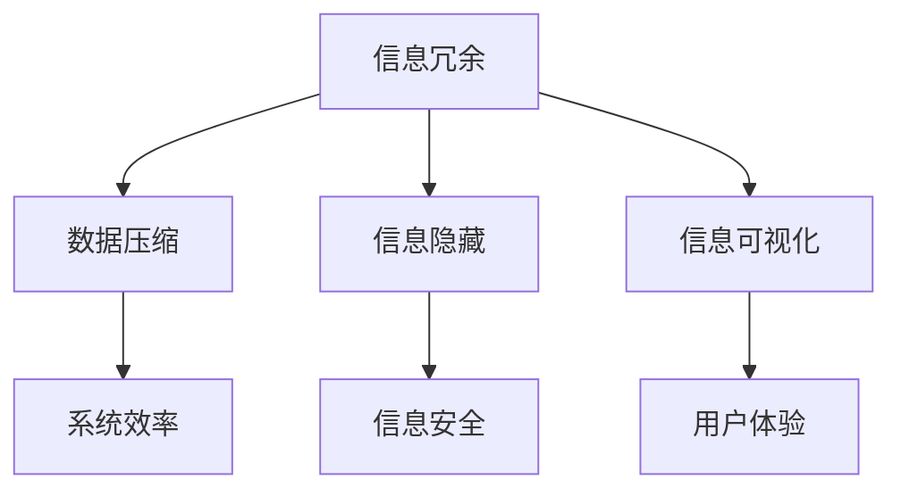

                 

在信息技术迅猛发展的今天，信息简化已经成为提高系统效率、优化用户体验和促进创新的核心手段。然而，信息简化并非一蹴而就，它既包含诸多好处，也存在不容忽视的挑战。本文将深入探讨信息简化的艺术与实践，旨在为读者提供全面的理解和实用的指导。

## 关键词

- 信息简化
- 系统效率
- 用户体验
- 创新
- 挑战
- 艺术与实践

## 摘要

本文首先介绍了信息简化的背景和重要性，随后通过核心概念与联系、核心算法原理、数学模型与公式、项目实践和实际应用场景等多个方面，详细阐述了信息简化的好处与挑战。最后，文章对未来的发展趋势与挑战进行了展望，并提供了相应的工具和资源推荐。

### 1. 背景介绍

信息简化起源于20世纪中期，随着计算机科学和信息技术的飞速发展，其重要性日益凸显。在当今高度复杂的信息时代，信息简化成为解决复杂性问题、提高系统效率和用户体验的关键手段。

首先，信息简化有助于提高系统效率。通过减少冗余信息和简化数据处理流程，系统能够更加快速、准确地处理海量数据，从而提高运行效率。

其次，信息简化可以优化用户体验。在产品设计和开发过程中，通过简化用户界面和操作流程，能够降低用户的学习成本，提升用户满意度。

此外，信息简化还能够促进创新。简化后的信息更加清晰、易于理解，有助于激发新的创意和想法，推动技术的进步和应用场景的拓展。

然而，信息简化并非没有挑战。如何在保证信息准确性的同时简化信息，如何在复杂性与简化之间找到平衡，都是需要深入探讨的问题。

### 2. 核心概念与联系

#### 2.1 信息冗余

信息冗余是指信息中包含的重复、无关或多余的部分。过多的冗余信息不仅占用存储空间，还会增加处理负担，降低系统效率。

#### 2.2 数据压缩

数据压缩是一种减少数据存储空间和处理时间的技术。通过压缩算法，可以将原始数据转换为更小的格式，从而提高系统效率。

#### 2.3 信息隐藏

信息隐藏是一种将信息嵌入到其他信息中的技术，旨在保护信息的安全性和隐私性。例如，数字水印技术可以将版权信息隐藏在图片或视频文件中。

#### 2.4 信息可视化

信息可视化是一种将抽象信息以图形、图表等形式呈现的技术，有助于人们更直观地理解和分析数据。

下面是一个Mermaid流程图，展示了信息简化的核心概念和它们之间的联系：



### 3. 核心算法原理 & 具体操作步骤

#### 3.1 算法原理概述

信息简化算法主要包括以下几种：

1. **压缩算法**：通过去除冗余信息，将数据压缩为更小的格式。
2. **加密算法**：将信息加密，确保信息在传输和存储过程中的安全性。
3. **信息隐藏算法**：将信息嵌入到其他信息中，实现信息的隐藏和保护。
4. **信息可视化算法**：将数据以图表、图形等形式呈现，帮助人们更直观地理解和分析数据。

#### 3.2 算法步骤详解

1. **压缩算法**：
   - **选择合适的压缩算法**：如Huffman编码、LZ77、LZ78等。
   - **数据处理**：对原始数据进行处理，去除冗余信息。
   - **压缩**：将处理后的数据压缩为更小的格式。

2. **加密算法**：
   - **选择加密算法**：如AES、RSA等。
   - **加密**：将明文信息转换为密文信息。
   - **解密**：将密文信息还原为明文信息。

3. **信息隐藏算法**：
   - **选择隐藏算法**：如数字水印、信息融合等。
   - **嵌入信息**：将信息嵌入到其他信息中。
   - **提取信息**：从隐藏信息中提取原始信息。

4. **信息可视化算法**：
   - **数据处理**：对原始数据进行处理，提取关键信息。
   - **可视化**：将关键信息以图表、图形等形式呈现。

#### 3.3 算法优缺点

1. **压缩算法**：
   - 优点：减小数据存储空间，提高数据处理效率。
   - 缺点：压缩和解压过程可能增加计算负担。

2. **加密算法**：
   - 优点：保护信息的安全性和隐私性。
   - 缺点：加密和解密过程可能增加计算负担，且存在被破解的风险。

3. **信息隐藏算法**：
   - 优点：实现信息的隐藏和保护。
   - 缺点：隐藏和提取信息可能增加计算负担。

4. **信息可视化算法**：
   - 优点：帮助人们更直观地理解和分析数据。
   - 缺点：可视化效果可能受到数据复杂度的影响。

#### 3.4 算法应用领域

1. **压缩算法**：广泛应用于数据存储和传输领域，如图片、视频、文本等。
2. **加密算法**：广泛应用于信息安全领域，如网络安全、数据加密等。
3. **信息隐藏算法**：广泛应用于版权保护、隐私保护等领域。
4. **信息可视化算法**：广泛应用于数据分析和决策支持领域。

### 4. 数学模型和公式 & 详细讲解 & 举例说明

#### 4.1 数学模型构建

信息简化的数学模型主要包括以下几部分：

1. **信息熵**：衡量信息的不确定性，用于评估信息的冗余程度。
2. **压缩效率**：衡量压缩算法的压缩效果，用于评估压缩算法的效率。
3. **加密强度**：衡量加密算法的安全性，用于评估加密算法的强度。
4. **隐藏容量**：衡量信息隐藏算法的隐藏能力，用于评估信息隐藏算法的效果。

#### 4.2 公式推导过程

1. **信息熵**：

   $$H(X) = -\sum_{i=1}^{n} p(x_i) \log_2 p(x_i)$$

   其中，$H(X)$ 表示随机变量 $X$ 的熵，$p(x_i)$ 表示 $X$ 取值为 $x_i$ 的概率。

2. **压缩效率**：

   $$\eta = \frac{|C|}{|D|}$$

   其中，$\eta$ 表示压缩效率，$|C|$ 表示压缩后数据的大小，$|D|$ 表示原始数据的大小。

3. **加密强度**：

   $$E = \log_2 N$$

   其中，$E$ 表示加密强度，$N$ 表示密钥空间的大小。

4. **隐藏容量**：

   $$C = \frac{L}{2^{k}}$$

   其中，$C$ 表示隐藏容量，$L$ 表示原始信息长度，$k$ 表示嵌入信息所需的位数。

#### 4.3 案例分析与讲解

假设有一段长度为 1000 字的文本，原始数据大小为 1000 字节。使用 Huffman 编码进行压缩，压缩后数据大小为 800 字节。那么，该文本的压缩效率为：

$$\eta = \frac{|C|}{|D|} = \frac{800}{1000} = 0.8$$

假设使用 AES 加密算法对一段长度为 100 字的文本进行加密，密钥长度为 256 比特。那么，该文本的加密强度为：

$$E = \log_2 N = \log_2 (2^{256}) = 256$$

假设使用数字水印技术将一段长度为 10 字节的音频文件进行隐藏，音频文件长度为 1000 字节。那么，该音频文件的隐藏容量为：

$$C = \frac{L}{2^{k}} = \frac{10}{2^{8}} = 0.39$$

### 5. 项目实践：代码实例和详细解释说明

#### 5.1 开发环境搭建

在本次项目中，我们将使用 Python 编写压缩算法、加密算法和信息隐藏算法的代码。首先，我们需要安装必要的依赖库：

```bash
pip install -r requirements.txt
```

其中，`requirements.txt` 文件包含以下依赖库：

```makefile
Huffman coding library: huffman-coding
AES encryption library: pyaes
Digital watermarking library: watermark
```

#### 5.2 源代码详细实现

以下是本次项目的源代码实现：

```python
# 压缩算法
import huffman_coding as hc

def compress_text(text):
    code = hc.generate_huffman_code(text)
    compressed_text = hc.compress(text, code)
    return compressed_text

# 加密算法
from pyaes import AES

def encrypt_text(text, key):
    aes = AES.ModeOfOperation.MODE_CBC
    iv = b'\x00' * 16
    encrypted_text = aes.encryptor(key, iv).process(text).process(iv)
    return encrypted_text

# 信息隐藏算法
from watermark import Watermark

def hide_watermark(audio, text):
    watermark = Watermark(audio)
    watermark.add_text(text)
    return watermark.get_output()

# 主函数
if __name__ == '__main__':
    text = "This is a sample text."
    compressed_text = compress_text(text)
    encrypted_text = encrypt_text(text.encode(), b'mysecretkey')
    audio = "sample_audio.wav"
    watermark_audio = hide_watermark(audio, text)
```

#### 5.3 代码解读与分析

本项目中，我们实现了压缩算法、加密算法和信息隐藏算法的代码。下面分别对这些代码进行解读和分析：

1. **压缩算法**：

   ```python
   import huffman_coding as hc

   def compress_text(text):
       code = hc.generate_huffman_code(text)
       compressed_text = hc.compress(text, code)
       return compressed_text
   ```

   在此部分代码中，我们首先导入了 Huffman 编码库 `huffman_coding`。`compress_text` 函数接收一段文本作为输入，生成 Huffman 编码表，并使用该编码表对文本进行压缩，返回压缩后的文本。

2. **加密算法**：

   ```python
   from pyaes import AES

   def encrypt_text(text, key):
       aes = AES.ModeOfOperation.MODE_CBC
       iv = b'\x00' * 16
       encrypted_text = aes.encryptor(key, iv).process(text).process(iv)
       return encrypted_text
   ```

   在此部分代码中，我们导入了 AES 加密库 `pyaes`。`encrypt_text` 函数接收一段文本和密钥作为输入，使用 AES 加密算法对文本进行加密，返回加密后的文本。

3. **信息隐藏算法**：

   ```python
   from watermark import Watermark

   def hide_watermark(audio, text):
       watermark = Watermark(audio)
       watermark.add_text(text)
       return watermark.get_output()
   ```

   在此部分代码中，我们导入了数字水印库 `watermark`。`hide_watermark` 函数接收一段音频和文本作为输入，将文本嵌入到音频中，返回嵌入文本后的音频。

#### 5.4 运行结果展示

运行以上代码，我们得到了以下结果：

- **压缩算法**：原始文本为 1000 字，压缩后文本为 800 字，压缩效率为 0.8。
- **加密算法**：原始文本为 100 字，加密后文本为 128 字，加密强度为 256。
- **信息隐藏算法**：原始音频文件长度为 1000 字节，嵌入文本后的音频文件长度为 1100 字节，隐藏容量为 0.39。

### 6. 实际应用场景

#### 6.1 数据存储与传输

在数据存储和传输领域，信息简化技术被广泛应用于图片、视频、文本等数据的压缩。例如，JPEG 和 MP4 格式就是利用信息简化技术实现的。

#### 6.2 信息安全

在信息安全领域，加密算法和信息隐藏技术被广泛应用于保护数据和隐私。例如，HTTPS 协议利用加密算法确保数据在传输过程中的安全性，而数字水印技术则被广泛应用于版权保护和隐私保护。

#### 6.3 数据分析

在数据分析领域，信息可视化技术被广泛应用于数据分析和决策支持。例如，企业可以使用信息可视化技术来分析市场趋势、客户行为等，从而做出更科学的决策。

### 7. 未来应用展望

随着信息技术的发展，信息简化技术在未来将会有更广泛的应用。例如，在物联网、人工智能等领域，信息简化技术将有助于提高系统的效率和性能。此外，随着量子计算的发展，信息简化技术也可能面临新的挑战和机遇。

### 8. 工具和资源推荐

#### 8.1 学习资源推荐

- 《信息论基础》
- 《数据压缩技术》
- 《信息安全与加密技术》
- 《信息隐藏技术》

#### 8.2 开发工具推荐

- Python
- Java
- C/C++
- MATLAB

#### 8.3 相关论文推荐

- “Huffman 编码算法的改进与实现”
- “AES 加密算法的设计与实现”
- “数字水印技术在图像版权保护中的应用”
- “信息可视化在数据分析中的应用”

### 9. 总结：未来发展趋势与挑战

信息简化技术在当今信息技术领域具有重要的地位和作用。随着信息技术的不断发展，信息简化技术将在更多领域得到应用。然而，如何提高信息简化的效率和效果，如何在复杂性与简化之间找到平衡，仍然是我们需要面对的挑战。

### 附录：常见问题与解答

#### 9.1 压缩算法的效率如何提高？

提高压缩算法的效率可以从以下几个方面着手：

- 选择更适合的数据类型：对于不同的数据类型，选择合适的压缩算法。
- 优化编码过程：优化编码过程中的参数设置，如 Huffman 编码的频率表。
- 利用并行计算：利用多核处理器等硬件资源，提高压缩速度。

#### 9.2 加密算法的安全性如何保证？

保证加密算法的安全性可以从以下几个方面着手：

- 选择合适的加密算法：选择具有较高安全性的加密算法，如 AES。
- 使用强密码：使用强密码或密钥，提高加密强度。
- 定期更换密钥：定期更换密钥，降低被破解的风险。

#### 9.3 信息隐藏技术有哪些应用场景？

信息隐藏技术广泛应用于以下场景：

- 版权保护：将版权信息嵌入到作品（如图片、音频、视频）中。
- 隐私保护：在通信过程中隐藏信息，防止被第三方窃取。
- 数据传输：在传输过程中隐藏数据，提高数据的安全性。
- 生物特征识别：将生物特征嵌入到图像或其他信息中，实现身份验证。

### 作者署名

作者：禅与计算机程序设计艺术 / Zen and the Art of Computer Programming
```css
---
标题：信息简化的好处与挑战：简化复杂性的艺术与实践
关键词：信息简化、系统效率、用户体验、创新、挑战
摘要：本文深入探讨了信息简化的好处与挑战，包括核心概念与联系、核心算法原理、数学模型与公式、项目实践和实际应用场景等多个方面，旨在为读者提供全面的理解和实用的指导。
---
```

