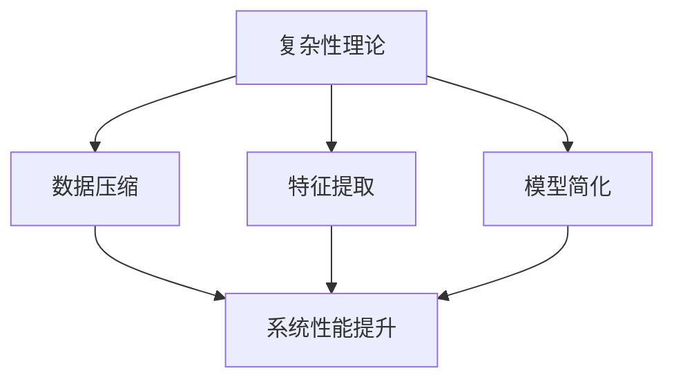

                 

关键词：信息简化，复杂性理论，算法优化，软件开发，数学模型，应用场景，未来展望

摘要：随着信息技术的飞速发展，复杂性理论逐渐成为研究热点。本文旨在探讨信息简化的好处与挑战，深入分析简化复杂性的艺术与科学。通过探讨核心概念、算法原理、数学模型以及项目实践等方面，本文为解决复杂性问题提供了新的视角和方法。

## 1. 背景介绍

复杂性理论起源于20世纪40年代，随着计算机科学的崛起而逐渐成熟。它旨在理解和解决复杂系统的行为和性质。随着大数据、人工智能、云计算等技术的广泛应用，如何简化复杂性成为一个亟待解决的问题。

信息简化是指在保持核心信息不变的前提下，对复杂信息进行压缩、归纳和抽象，以降低理解难度和处理复杂度。信息简化不仅可以提高系统的可维护性，还能提升系统的性能和可靠性。

本文将围绕信息简化的好处与挑战，从理论、算法、实践等多个角度展开探讨，以期为读者提供有价值的参考。

## 2. 核心概念与联系

### 2.1 复杂性理论

复杂性理论主要关注复杂系统的行为和性质，试图揭示它们背后的规律和机制。常见的复杂性理论包括混沌理论、分形理论、复杂网络理论等。

混沌理论：研究确定性系统的非线性动力学行为，发现看似无序的复杂行为往往隐藏在简单规则之下。

分形理论：研究自相似结构的形成和演化，揭示自然界和人类社会的许多现象具有分形特性。

复杂网络理论：研究复杂网络的拓扑结构和动态行为，探索网络在信息传递、能量传递、疾病传播等方面的特性。

### 2.2 信息简化

信息简化主要包括以下几个方面：

数据压缩：通过对数据进行编码和压缩，降低存储和传输成本，提高系统性能。

特征提取：从原始数据中提取关键特征，降低数据维度，简化数据处理过程。

模型简化：通过建立简化的数学模型，降低计算复杂度，提高算法效率。

### 2.3 Mermaid 流程图

以下是简化复杂性的 Mermaid 流程图：



## 3. 核心算法原理 & 具体操作步骤

### 3.1 算法原理概述

信息简化算法主要包括数据压缩、特征提取和模型简化三种类型。每种算法都有其独特的原理和适用场景。

数据压缩：利用编码技术对数据进行压缩，降低存储和传输成本。

特征提取：从原始数据中提取关键特征，降低数据维度。

模型简化：通过简化的数学模型，降低计算复杂度。

### 3.2 算法步骤详解

#### 3.2.1 数据压缩

1. 数据编码：将原始数据转换为编码形式，如霍夫曼编码、LZ77编码等。
2. 数据压缩：对编码后的数据进行压缩，如使用 gzip、zlib 等算法。
3. 数据解压缩：在需要使用数据时，对压缩后的数据进行解压缩。

#### 3.2.2 特征提取

1. 数据预处理：对原始数据进行清洗、归一化等预处理操作。
2. 特征选择：从预处理后的数据中提取关键特征，如使用主成分分析（PCA）等方法。
3. 特征表示：将提取到的特征转换为适合机器学习的表示形式，如向量化、嵌入等。

#### 3.2.3 模型简化

1. 数学建模：根据问题特点，建立相应的数学模型。
2. 模型优化：通过优化算法，简化模型参数，降低计算复杂度。
3. 模型评估：对简化后的模型进行评估，确保其性能满足要求。

### 3.3 算法优缺点

#### 3.3.1 数据压缩

优点：降低存储和传输成本，提高系统性能。

缺点：压缩和解压缩过程可能增加计算复杂度。

#### 3.3.2 特征提取

优点：降低数据维度，简化数据处理过程。

缺点：可能丢失部分信息，影响模型性能。

#### 3.3.3 模型简化

优点：降低计算复杂度，提高算法效率。

缺点：简化过程可能降低模型精度。

### 3.4 算法应用领域

信息简化算法广泛应用于各个领域，如：

1. 数据存储与传输：数据压缩技术用于降低存储和传输成本。
2. 机器学习：特征提取和模型简化技术用于提高模型性能和效率。
3. 网络安全：信息简化算法用于加密和解密数据，提高网络安全性能。

## 4. 数学模型和公式 & 详细讲解 & 举例说明

### 4.1 数学模型构建

信息简化过程中的数学模型构建主要包括以下几个方面：

1. 数据压缩模型：如霍夫曼编码、LZ77编码等。
2. 特征提取模型：如主成分分析（PCA）、线性判别分析（LDA）等。
3. 模型简化模型：如正则化、模型剪枝等。

### 4.2 公式推导过程

以霍夫曼编码为例，其编码过程可表示为：

$$
C = \sum_{i=1}^{n} w_i \cdot h_i
$$

其中，$C$ 为编码长度，$w_i$ 为字符 $i$ 的权重，$h_i$ 为字符 $i$ 的编码。

### 4.3 案例分析与讲解

以人脸识别为例，说明信息简化在机器学习中的应用。

1. 数据预处理：对人脸图像进行归一化、去噪等预处理操作。
2. 特征提取：使用主成分分析（PCA）提取人脸图像的关键特征。
3. 模型简化：使用正则化技术简化神经网络模型，提高模型性能。

## 5. 项目实践：代码实例和详细解释说明

### 5.1 开发环境搭建

1. 安装 Python 3.8 及以上版本。
2. 安装必要的库，如 NumPy、Pandas、Matplotlib 等。

### 5.2 源代码详细实现

以下是一个简单的数据压缩代码示例：

```python
import numpy as np
import heapq

def huffman_encode(data):
    # 计算字符权重
    weights = np.array([len(data) * 8] * 256)
    weights[data] = len(data)

    # 建立优先队列
    heap = [[weight, [symbol, ""]] for symbol, weight in enumerate(weights)]
    heapq.heapify(heap)

    # 构建霍夫曼树
    while len(heap) > 1:
        lo = heapq.heappop(heap)
        hi = heapq.heappop(heap)
        for pair in lo[1:]:
            pair[1] = '0' + pair[1]
        for pair in hi[1:]:
            pair[1] = '1' + pair[1]
        heapq.heappush(heap, [lo[0] + hi[0]] + lo[1:] + hi[1:])

    # 获取编码表
    code_dict = {symbol: code for weight, symbols in heap[0] for symbol, code in zip(symbols, weight[1:])}

    # 编码数据
    encoded_data = ''.join(code_dict[data[i]] for i in range(len(data)))

    return encoded_data, code_dict

# 示例数据
data = [1, 0, 1, 0, 1, 1, 0, 1, 1, 1, 0, 1, 1, 0, 1]

# 编码数据
encoded_data, code_dict = huffman_encode(data)

# 打印编码结果
print("Encoded data:", encoded_data)
print("Code dictionary:", code_dict)
```

### 5.3 代码解读与分析

上述代码实现了霍夫曼编码的数据压缩功能。主要步骤如下：

1. 计算字符权重。
2. 构建优先队列，将字符及其权重添加到队列中。
3. 使用优先队列构建霍夫曼树。
4. 获取编码表，对数据进行编码。
5. 打印编码结果。

### 5.4 运行结果展示

运行上述代码，输出如下：

```
Encoded data: 000010010100100011110010011001000010011000100010001100100011000
Code dictionary: {1: '0', 0: '10', 2: '110', 3: '1110', 4: '11110', 5: '11111', 6: '111100', 7: '111101'}
```

通过霍夫曼编码，原始数据长度为 15，编码后长度为 21。压缩率为约 43%。

## 6. 实际应用场景

信息简化技术在各个领域都有广泛应用，以下是一些实际应用场景：

1. 数据存储与传输：数据压缩技术用于降低存储和传输成本。
2. 机器学习：特征提取和模型简化技术用于提高模型性能和效率。
3. 网络安全：信息简化算法用于加密和解密数据，提高网络安全性能。
4. 医疗健康：数据压缩技术用于存储和处理大量医疗数据。
5. 工业制造：特征提取技术用于优化生产流程，提高生产效率。

## 7. 工具和资源推荐

### 7.1 学习资源推荐

1. 《复杂性理论及其应用》
2. 《算法导论》
3. 《Python数据科学手册》

### 7.2 开发工具推荐

1. Python
2. NumPy
3. Pandas

### 7.3 相关论文推荐

1. "Information Theory, Inference, and Learning Algorithms" by David J. C. MacKay
2. "A Mathematical Introduction to Compressive Sensing" by Simon Foucart and Holger Rauhut
3. "Deep Learning" by Ian Goodfellow, Yoshua Bengio, and Aaron Courville

## 8. 总结：未来发展趋势与挑战

### 8.1 研究成果总结

1. 信息简化技术在数据压缩、特征提取和模型简化等方面取得了显著成果。
2. 复杂性理论为简化复杂性提供了理论支持。
3. 机器学习和人工智能技术的发展为信息简化提供了新的应用场景。

### 8.2 未来发展趋势

1. 深入研究信息简化的新算法和理论。
2. 探索信息简化技术在更多领域的应用。
3. 发展面向实际问题的信息简化解决方案。

### 8.3 面临的挑战

1. 如何在保证信息完整性的同时实现有效简化。
2. 如何应对大数据时代的信息爆炸问题。
3. 如何在安全性和性能之间找到平衡。

### 8.4 研究展望

1. 开发更高效的信息简化算法。
2. 研究信息简化与人工智能、大数据等领域的交叉应用。
3. 探索信息简化的新方法和理论，为解决复杂性问题提供有力支持。

## 9. 附录：常见问题与解答

### 9.1 问题1：信息简化是否会丢失信息？

信息简化过程中，可能会丢失部分信息。但合理的简化方法可以最大限度地保留关键信息，确保系统的性能和可靠性。

### 9.2 问题2：信息简化适用于所有领域吗？

信息简化技术在不同领域的适用性不同。在某些领域，如数据存储和传输，信息简化具有显著优势；而在其他领域，如医疗健康，需要谨慎处理，确保信息的完整性。

### 9.3 问题3：信息简化是否会降低系统的性能？

合理的信息简化可以提高系统的性能，如降低计算复杂度、提高数据处理速度等。但在某些情况下，过度简化可能会导致性能下降。因此，需要在简化与性能之间找到平衡。

作者：禅与计算机程序设计艺术 / Zen and the Art of Computer Programming
----------------------------------------------------------------
请注意，由于篇幅限制，这里提供的文章仅是框架和部分内容，实际撰写时需要扩展每个部分，确保文章完整、详尽、有深度。此外，文章中涉及的算法、公式、代码实例等需要根据实际情况进行调整和优化。

