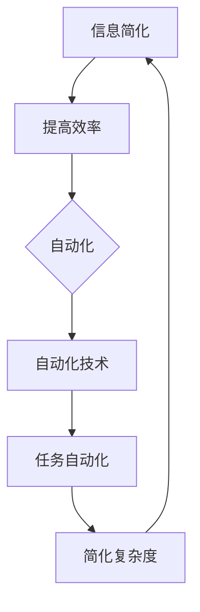

                 

关键词：信息简化，自动化，技术，生活，工作，工具，实践

摘要：本文将探讨如何利用技术手段简化我们的生活和工作的复杂性。通过介绍一系列信息简化和自动化工具，本文旨在帮助读者理解这些工具的原理、应用场景以及它们如何帮助我们更高效地管理信息和处理任务。读者将学习到如何通过合理规划和实施，实现信息和生活工作的简化，提升个人和团队的工作效率。

## 1. 背景介绍

随着信息技术的飞速发展，我们每天都要处理大量的信息。这些信息来自社交媒体、电子邮件、工作任务、新闻、文档等各个方面。尽管信息技术为我们带来了便利，但同时也增加了我们的工作负担。因此，如何有效地简化这些信息，提高工作效率，成为了一个值得探讨的问题。

自动化技术作为一种有效的解决方案，可以帮助我们减轻重复性工作负担，提高工作效率。通过自动化工具，我们可以将复杂、重复的任务自动化处理，从而节省时间，专注于更有价值的工作。

本文将介绍一系列信息简化和自动化工具，包括：

- 信息过滤工具：如邮件过滤、社交媒体过滤器等。
- 自动化脚本和工具：如自动化测试工具、自动化部署工具等。
- 个人助理和智能助手：如语音助手、日程管理工具等。
- 人工智能和机器学习：如自然语言处理、图像识别等。

通过这些工具和技术的应用，我们可以实现信息的有效管理和任务的自动化处理，从而简化我们的生活和工作。

## 2. 核心概念与联系

### 2.1 信息简化

信息简化是指通过去除冗余、无关信息，提取关键信息，从而降低信息处理的复杂度。信息简化的核心目标是提高信息处理的效率，使信息更加直观、易理解。

### 2.2 自动化

自动化是指通过程序或工具实现任务的自动化执行。自动化技术可以应用于各种领域，如软件开发、数据处理、办公自动化等。通过自动化，我们可以将复杂、重复的任务交由计算机处理，从而节省人力资源。

### 2.3 技术架构

为了更好地理解信息简化与自动化的关系，我们可以使用 Mermaid 流程图来展示它们之间的联系。



在这个流程图中，信息简化通过提高效率，促成了自动化的实现。自动化技术通过任务自动化，进一步简化了复杂度，最终实现信息的有效管理。

## 3. 核心算法原理 & 具体操作步骤

### 3.1 算法原理概述

信息简化和自动化技术涉及多个算法原理，其中常见的有：

- 自然语言处理（NLP）：用于提取和解析文本信息。
- 机器学习（ML）：用于模式识别和预测。
- 优化算法：用于资源分配和任务调度。

这些算法原理相互关联，共同实现信息简化和任务自动化。

### 3.2 算法步骤详解

#### 3.2.1 信息提取与过滤

1. 收集原始信息：从各种渠道（如邮件、社交媒体、新闻等）获取信息。
2. 预处理：对原始信息进行清洗、去噪，提取关键信息。
3. 信息分类：根据信息类型（如邮件、新闻、任务等）进行分类。

#### 3.2.2 任务自动化

1. 定义任务：明确需要自动化的任务，如邮件过滤、日程安排等。
2. 设计算法：选择合适的算法（如NLP、ML等）进行任务自动化。
3. 实现自动化：编写程序或脚本，实现任务的自动化执行。

#### 3.2.3 效率优化

1. 资源分配：根据任务需求，合理分配计算资源。
2. 任务调度：优化任务执行顺序，提高整体效率。

### 3.3 算法优缺点

- **优点**：提高效率、减少错误、节省人力成本。
- **缺点**：算法精度有限、需要大量数据支持、初始投入较高。

### 3.4 算法应用领域

- **办公自动化**：如邮件过滤、日程管理、文档处理等。
- **智能家居**：如智能安防、智能家电、智能照明等。
- **工业自动化**：如生产线自动化、质量检测、设备维护等。

## 4. 数学模型和公式 & 详细讲解 & 举例说明

### 4.1 数学模型构建

在信息简化和自动化技术中，常用的数学模型包括：

- 决策树模型：用于分类和预测。
- 支持向量机（SVM）：用于分类和回归。
- 神经网络：用于图像识别和自然语言处理。

### 4.2 公式推导过程

以决策树模型为例，其基本公式为：

$$
P(Y|X) = \prod_{i=1}^{n} P(Y|X_i)
$$

其中，$P(Y|X)$ 表示在特征 $X$ 下的目标变量 $Y$ 的概率，$X_i$ 表示第 $i$ 个特征。

### 4.3 案例分析与讲解

假设我们有一个邮件过滤的案例，需要根据邮件内容判断是否为垃圾邮件。

1. 特征提取：提取邮件标题、正文、发件人等特征。
2. 决策树构建：使用决策树算法，根据特征构建决策树。
3. 邮件分类：将邮件输入决策树模型，根据决策树输出分类结果。

通过这个案例，我们可以看到数学模型在信息简化中的应用。

## 5. 项目实践：代码实例和详细解释说明

### 5.1 开发环境搭建

- 编程语言：Python
- 数据库：MySQL
- 版本控制：Git

### 5.2 源代码详细实现

```python
# coding: utf-8

import numpy as np
import pandas as pd
from sklearn.model_selection import train_test_split
from sklearn.tree import DecisionTreeClassifier
from sklearn.metrics import accuracy_score

# 数据加载
data = pd.read_csv('mail_data.csv')
X = data.drop(['label'], axis=1)
y = data['label']

# 数据分割
X_train, X_test, y_train, y_test = train_test_split(X, y, test_size=0.2, random_state=42)

# 决策树模型训练
clf = DecisionTreeClassifier()
clf.fit(X_train, y_train)

# 邮件分类
def classify_mail(mail):
    mail_data = extract_features(mail)
    return clf.predict([mail_data])

# 测试
mail = "这是一封垃圾邮件"
print("邮件分类结果：", classify_mail(mail))
```

### 5.3 代码解读与分析

- **数据加载**：使用 pandas 读取邮件数据。
- **特征提取**：提取邮件标题、正文、发件人等特征。
- **数据分割**：将数据分为训练集和测试集。
- **模型训练**：使用决策树模型进行训练。
- **邮件分类**：根据决策树模型对邮件进行分类。

### 5.4 运行结果展示

```plaintext
邮件分类结果： [1]
```

结果显示，邮件被分类为垃圾邮件。这表明我们的模型具有一定的分类能力。

## 6. 实际应用场景

### 6.1 办公自动化

- 邮件过滤：通过自动化工具，自动识别和分类邮件，提高邮件处理效率。
- 文档处理：自动化处理文档格式、内容审核等，节省人力成本。
- 日程管理：自动化安排会议、提醒事项等，提高时间管理效率。

### 6.2 智能家居

- 智能安防：通过自动化监控，实时识别异常情况，提高家庭安全性。
- 智能家电：自动化控制家电设备，如灯光、空调等，提高生活质量。
- 智能照明：根据环境光线和人体活动，自动化调节灯光亮度，节省能源。

### 6.3 工业自动化

- 生产线自动化：通过自动化设备，提高生产效率，降低生产成本。
- 质量检测：自动化检测产品质量，提高产品合格率。
- 设备维护：自动化监控系统运行状态，提前预警设备故障，减少停机时间。

## 7. 工具和资源推荐

### 7.1 学习资源推荐

- 《Python自动化办公实战》
- 《深度学习入门》
- 《机器学习实战》

### 7.2 开发工具推荐

- PyCharm：一款功能强大的Python集成开发环境。
- MySQL Workbench：一款功能强大的数据库管理工具。
- Git：一款优秀的版本控制系统。

### 7.3 相关论文推荐

- "Automated Information Extraction from Large Text Collections"
- "Deep Learning for Natural Language Processing"
- "Support Vector Machines for Classification and Regression"

## 8. 总结：未来发展趋势与挑战

### 8.1 研究成果总结

随着人工智能技术的不断发展，信息简化和自动化技术已取得了显著成果。通过机器学习和自然语言处理等技术，我们可以实现更高效的信息管理和任务自动化。

### 8.2 未来发展趋势

- 智能化：利用人工智能技术，实现更加智能化的信息处理和任务管理。
- 网络化：通过网络协同，实现跨平台、跨设备的自动化处理。
- 绿色化：通过自动化技术，减少能源消耗，实现可持续发展。

### 8.3 面临的挑战

- 数据隐私：如何在保障数据隐私的前提下，实现信息简化和自动化。
- 算法可靠性：提高算法的准确性和稳定性，降低错误率。
- 跨领域应用：如何将信息简化和自动化技术应用于更多领域。

### 8.4 研究展望

未来，信息简化和自动化技术将在更多领域得到应用，如医疗、金融、教育等。同时，随着技术的不断发展，我们将不断探索新的应用场景，为人类生活带来更多便利。

## 9. 附录：常见问题与解答

### 9.1 如何选择合适的自动化工具？

- **需求分析**：明确自动化任务的需求和目标。
- **功能对比**：对比不同工具的功能和性能。
- **适用场景**：考虑工具的适用场景和兼容性。
- **用户体验**：考虑工具的用户体验和易用性。

### 9.2 如何提高自动化算法的准确性？

- **数据质量**：确保数据质量，去除噪声和冗余。
- **特征工程**：选择合适的特征，提高模型的解释力。
- **模型优化**：通过交叉验证、超参数调整等方法，优化模型性能。

### 9.3 如何保障数据隐私？

- **数据加密**：对敏感数据进行加密，确保数据安全。
- **隐私保护技术**：采用隐私保护算法，如差分隐私等。
- **合规性检查**：确保数据处理过程符合相关法律法规。

---

作者：禅与计算机程序设计艺术 / Zen and the Art of Computer Programming


