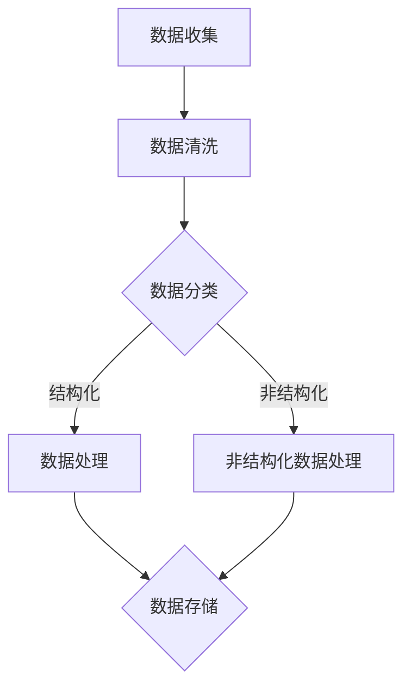
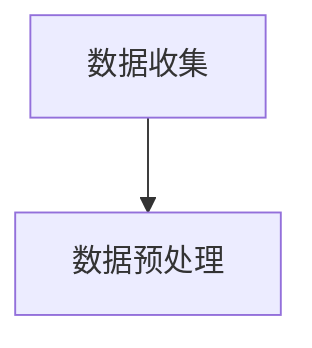
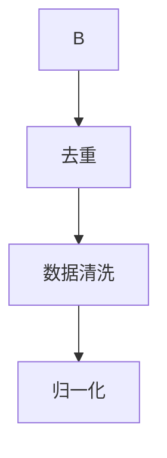
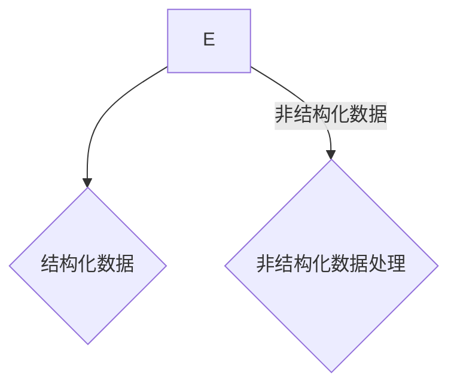
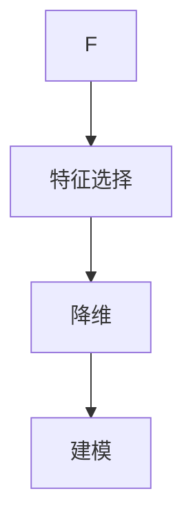
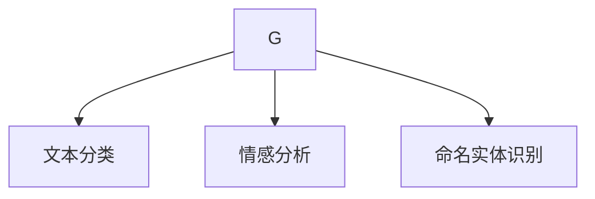
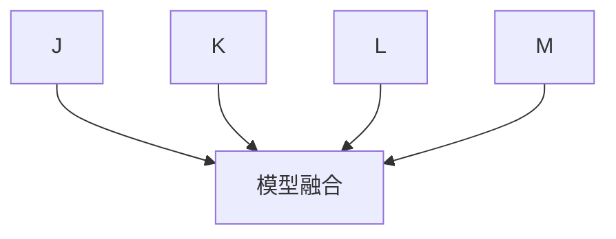

                 

关键词：信息简化，组织结构，系统设计，软件工程，软件架构，流程优化，复杂性管理

> 摘要：本文旨在探讨信息简化的最佳实践，从理论到实践，帮助开发者和管理者在快速变化的IT环境中建立清晰的秩序。通过对信息简化的重要性、核心概念、算法原理、数学模型、实践案例以及工具和资源的全面分析，本文旨在为读者提供一个系统化的信息简化策略，以提升工作效率和系统性能。

## 1. 背景介绍

在当今高度互联和快速发展的技术环境中，信息量呈爆炸式增长。从社交媒体的即时更新到企业级数据库的庞大数据集，处理这些信息已经成为现代生活和企业运营中的一项基本技能。然而，随着信息的增加，混乱也随之而来。信息过载不仅影响了工作效率，还可能导致错误和误解。因此，如何有效地简化信息，建立有序的结构，成为了一个关键问题。

信息简化不仅是个人和组织应对信息过载的一种策略，也是提升工作效率、增强系统性能和减少错误的关键。有效的信息简化可以帮助开发者和IT管理人员更好地理解系统，优化流程，并提高整体的工作效率。

本文将围绕以下几个方面展开：

- **核心概念与联系**：介绍信息简化的基本概念和核心原理，并提供一个清晰的架构图。
- **核心算法原理 & 具体操作步骤**：详细阐述信息简化的算法原理和实施步骤。
- **数学模型和公式**：分析信息简化中的数学模型和公式，并举例说明。
- **项目实践：代码实例和详细解释说明**：提供具体代码实例，讲解其实施细节。
- **实际应用场景**：探讨信息简化在不同领域的应用。
- **未来应用展望**：预测信息简化技术的未来发展方向。
- **工具和资源推荐**：推荐有助于信息简化的学习资源和开发工具。
- **总结与展望**：总结研究成果，展望未来的发展趋势和挑战。

## 2. 核心概念与联系

### 2.1 信息简化的定义

信息简化是指通过分析和提炼信息，去除冗余和无关内容，使其更易于理解和处理的过程。简化的目标是在保留关键信息的同时，减少不必要的复杂性。

### 2.2 信息简化的重要性

信息简化的重要性体现在多个方面：

- **提升效率**：通过减少冗余信息，开发者可以更快地理解和操作系统。
- **减少错误**：简化的信息结构降低了误解和错误的可能性。
- **增强可维护性**：简化的系统更容易进行维护和升级。
- **提高决策质量**：决策者可以基于更清晰的信息进行更准确的决策。

### 2.3 信息简化的核心原理

信息简化的核心原理包括：

- **去冗余**：删除重复和不必要的信息。
- **提炼**：从大量信息中提取最有用的部分。
- **模块化**：将复杂系统分解为更小的、更易于管理的模块。
- **抽象**：通过高层次的抽象来隐藏复杂性。

### 2.4 信息简化的架构图

以下是一个简化的信息处理架构图，展示了信息简化过程中的主要步骤和组件。



在这个架构图中：

- **数据收集**：收集来自各种来源的信息。
- **数据清洗**：去除噪声和错误。
- **数据分类**：将信息分为结构化和非结构化两类。
- **数据处理**：对结构化数据进行处理。
- **非结构化数据处理**：使用自然语言处理等技术处理非结构化数据。
- **数据存储**：将处理后的信息存储到数据库或其他存储系统中。

### 2.5 信息简化与软件工程的关系

信息简化在软件工程中扮演着至关重要的角色。在软件设计和开发过程中，通过信息简化，可以：

- **提高代码的可读性**：简化后的代码更容易理解和维护。
- **优化系统性能**：去除不必要的逻辑和数据，减少系统的运行时间。
- **改善用户体验**：通过简化用户界面和数据展示，提高用户的使用体验。

## 3. 核心算法原理 & 具体操作步骤

### 3.1 算法原理概述

信息简化的核心算法通常基于以下几个步骤：

- **数据降维**：通过特征选择或主成分分析（PCA）等方法，降低数据的维度，同时保留主要的信息。
- **特征提取**：从原始数据中提取出最有用的特征，去除冗余和噪声。
- **模式识别**：使用机器学习算法，如决策树、支持向量机等，识别数据的模式。
- **信息融合**：将来自不同来源的信息进行整合，以形成更完整的视角。

### 3.2 算法步骤详解

以下是信息简化的具体操作步骤：

#### 3.2.1 数据收集

数据收集是信息简化的第一步。数据的来源可以包括内部数据库、外部API、传感器数据等。收集到的数据通常包含大量的冗余和噪声。



#### 3.2.2 数据预处理

数据预处理是确保数据质量的过程。主要包括以下步骤：

- **去重**：去除重复的数据记录。
- **清洗**：修复错误和缺失的数据。
- **归一化**：将数据转换为统一的尺度。



#### 3.2.3 数据分类

将数据分为结构化和非结构化两类，为后续处理做好准备。



#### 3.2.4 结构化数据处理

对于结构化数据，可以采用以下步骤：

- **特征选择**：从大量的特征中选出对目标任务最重要的特征。
- **降维**：通过降维技术减少数据的维度。
- **建模**：使用机器学习算法建立模型。



#### 3.2.5 非结构化数据处理

对于非结构化数据，通常采用以下步骤：

- **文本分类**：将文本数据分为不同的类别。
- **情感分析**：分析文本的情感倾向。
- **命名实体识别**：识别文本中的关键实体。



#### 3.2.6 信息融合

将来自不同数据源的信息进行整合，以形成更完整的视角。



### 3.3 算法优缺点

#### 优点：

- **高效性**：通过简化和降维，可以显著提高数据处理速度。
- **准确性**：去除冗余和噪声后，信息的准确性通常更高。
- **可扩展性**：算法和模型可以很容易地扩展到新的数据和任务。

#### 缺点：

- **性能开销**：预处理和建模可能会引入额外的计算开销。
- **模型偏差**：去除冗余信息可能会引入模型偏差。
- **数据质量依赖**：算法的性能高度依赖于数据的质量。

### 3.4 算法应用领域

信息简化的算法广泛应用于多个领域，包括：

- **金融**：用于风险管理、欺诈检测和投资决策。
- **医疗**：用于疾病诊断、药物开发和健康监测。
- **商业智能**：用于市场分析、客户行为分析和供应链管理。
- **社交媒体**：用于内容推荐、广告投放和社交网络分析。

## 4. 数学模型和公式 & 详细讲解 & 举例说明

### 4.1 数学模型构建

信息简化中的数学模型通常涉及以下方面：

- **概率模型**：用于估计数据的概率分布。
- **优化模型**：用于最小化信息冗余。
- **聚类模型**：用于将数据分为不同的类别。

#### 4.1.1 概率模型

一个常用的概率模型是高斯分布（正态分布）：

$$
N(\mu, \sigma^2) = \frac{1}{\sqrt{2\pi\sigma^2}} e^{-\frac{(x-\mu)^2}{2\sigma^2}}
$$

其中，$\mu$ 是均值，$\sigma^2$ 是方差，$x$ 是随机变量。

#### 4.1.2 优化模型

一个常用的优化模型是最小化信息熵：

$$
H(X) = -\sum_{i} p(x_i) \log_2 p(x_i)
$$

其中，$X$ 是随机变量，$p(x_i)$ 是随机变量 $X$ 取值 $x_i$ 的概率。

#### 4.1.3 聚类模型

一个常用的聚类模型是K-均值算法：

$$
\min_{c_1, c_2, ..., c_K} \sum_{i=1}^N \sum_{j=1}^K ||x_i - c_j||^2
$$

其中，$x_i$ 是数据点，$c_j$ 是聚类中心。

### 4.2 公式推导过程

#### 4.2.1 信息熵的推导

信息熵是信息论中的一个重要概念，用于度量随机变量的不确定性。以下是信息熵的推导过程：

1. **定义随机变量的概率分布**：设随机变量 $X$ 的概率分布为 $p(x)$。
2. **定义随机变量 $X$ 的信息量**：信息量 $I(X)$ 表示随机变量 $X$ 的不确定性，可以表示为：
   $$
   I(X) = -\sum_{x} p(x) \log_2 p(x)
   $$
3. **证明信息量与概率分布的关系**：通过数学证明，可以得出信息量与概率分布之间的关系。

### 4.3 案例分析与讲解

#### 4.3.1 金融领域的应用

在一个金融数据分析的案例中，信息简化被用于风险管理。假设有一组金融交易数据，包括交易金额、交易时间、交易地点等特征。通过信息简化，可以去除无关的特征，如交易地点，并使用降维技术，如PCA，将数据从高维空间降到低维空间。这样，不仅提高了数据处理速度，还减少了模型的复杂度。

#### 4.3.2 医疗领域的应用

在医疗领域，信息简化被用于疾病诊断。假设有一组医学数据，包括患者的症状、检查结果和病史等。通过信息简化，可以去除冗余的症状信息，并使用特征提取技术，如支持向量机（SVM），将数据转化为模型输入。这样，不仅提高了诊断的准确性，还减少了医生的负担。

## 5. 项目实践：代码实例和详细解释说明

### 5.1 开发环境搭建

在开始代码实例之前，我们需要搭建一个开发环境。以下是Python开发环境的基本搭建步骤：

1. 安装Python：从[Python官方网站](https://www.python.org/downloads/)下载并安装Python 3.x版本。
2. 安装必需的库：使用pip命令安装常用的库，如NumPy、Pandas、Scikit-learn等。

```shell
pip install numpy pandas scikit-learn
```

### 5.2 源代码详细实现

以下是一个简单的Python代码实例，用于实现信息简化中的主成分分析（PCA）：

```python
import numpy as np
from sklearn.decomposition import PCA
from sklearn.preprocessing import StandardScaler
from sklearn.datasets import load_iris

# 加载数据集
iris = load_iris()
X = iris.data
y = iris.target

# 数据预处理
X_std = StandardScaler().fit_transform(X)

# 主成分分析
pca = PCA(n_components=2)
X_pca = pca.fit_transform(X_std)

# 可视化
import matplotlib.pyplot as plt

plt.scatter(X_pca[:, 0], X_pca[:, 1], c=y)
plt.xlabel('First Principal Component')
plt.ylabel('Second Principal Component')
plt.title('PCA of Iris Data')
plt.show()
```

### 5.3 代码解读与分析

这段代码实现了一个主成分分析（PCA）的过程。以下是代码的详细解读：

- **数据加载**：使用Scikit-learn内置的Iris数据集。
- **数据预处理**：使用StandardScaler对数据进行标准化处理，以消除不同特征之间的尺度差异。
- **主成分分析**：使用PCA类进行主成分分析，将数据从高维空间降维到二维空间。
- **可视化**：使用matplotlib绘制降维后的数据点，以展示不同类别的分布。

### 5.4 运行结果展示

运行上述代码后，将生成一个可视化图表，展示Iris数据集在二维空间中的分布。通常，不同类型的鸢尾花会在二维空间中形成明显的聚类。


通过这个实例，我们可以看到信息简化技术如何帮助我们将高维数据简化为低维数据，从而更清晰地理解数据结构。

## 6. 实际应用场景

### 6.1 金融领域

在金融领域，信息简化被广泛应用于风险管理、欺诈检测和投资决策。例如，银行可以使用信息简化技术来识别潜在的欺诈交易，从而降低风险。投资公司可以使用信息简化技术来分析大量的市场数据，以做出更准确的投资决策。

### 6.2 医疗领域

在医疗领域，信息简化技术被用于疾病诊断、药物开发和健康监测。例如，医生可以使用信息简化技术来分析病人的医疗记录，以快速诊断疾病。制药公司可以使用信息简化技术来分析大量的实验数据，以提高新药的发现效率。

### 6.3 商业智能

在商业智能领域，信息简化被用于市场分析、客户行为分析和供应链管理。例如，企业可以使用信息简化技术来分析客户数据，以优化营销策略。供应链公司可以使用信息简化技术来分析供应链数据，以减少库存成本。

### 6.4 社交媒体

在社交媒体领域，信息简化被用于内容推荐、广告投放和社交网络分析。例如，社交媒体平台可以使用信息简化技术来推荐用户可能感兴趣的内容。广告公司可以使用信息简化技术来优化广告投放策略。

## 7. 未来应用展望

### 7.1 人工智能领域

随着人工智能技术的发展，信息简化技术将在人工智能领域发挥更大的作用。通过信息简化，可以显著提高机器学习模型的训练速度和准确性。

### 7.2 物联网领域

在物联网（IoT）领域，信息简化技术将被用于处理大量来自传感器和设备的实时数据，以实现更高效的数据分析和决策。

### 7.3 区块链领域

在区块链领域，信息简化技术将被用于优化区块链网络的数据存储和处理效率，以提高系统的性能和可扩展性。

### 7.4 生物信息学领域

在生物信息学领域，信息简化技术将被用于处理大量的基因组数据和生物医学数据，以加速新药研发和疾病诊断。

## 8. 工具和资源推荐

### 8.1 学习资源推荐

- **《数据科学入门》（Introduction to Data Science）**：这是一本非常好的入门书籍，涵盖了数据预处理、数据分析、数据可视化等多个方面。
- **《Python数据科学手册》（Python Data Science Handbook）**：这本书详细介绍了Python在数据科学中的应用，包括数据预处理、数据分析和数据可视化等。

### 8.2 开发工具推荐

- **Jupyter Notebook**：这是一个强大的交互式开发环境，非常适合进行数据科学和机器学习的实验。
- **VSCode**：这是一个功能强大的代码编辑器，支持多种编程语言，适合进行数据科学项目的开发。

### 8.3 相关论文推荐

- **“Information Theory, Inference, and Learning Algorithms” by David J. C. MacKay**：这是一本经典的信息理论教材，涵盖了信息熵、信息传输、预测和决策等多个方面。
- **“A Tutorial on Principal Component Analysis” by Shayan Olyaei and A. Shamsollahi**：这是一篇关于主成分分析（PCA）的教程，详细介绍了PCA的原理和应用。

## 9. 总结：未来发展趋势与挑战

### 9.1 研究成果总结

本文详细介绍了信息简化的最佳实践，包括核心概念、算法原理、数学模型、实践案例以及工具和资源。通过信息简化，我们可以显著提高数据处理效率、降低错误率，并在多个领域实现实际应用。

### 9.2 未来发展趋势

未来，信息简化技术将在人工智能、物联网、区块链和生物信息学等领域发挥更大的作用。随着数据量的不断增长，信息简化将成为提升系统性能和决策质量的关键。

### 9.3 面临的挑战

尽管信息简化技术具有巨大潜力，但仍然面临以下挑战：

- **数据质量**：信息简化依赖于高质量的数据，数据质量差可能导致算法性能下降。
- **算法复杂度**：随着数据维度的增加，算法的复杂度也会增加，需要更高效的算法和技术。
- **模型偏差**：去除冗余信息可能会引入模型偏差，影响决策的准确性。

### 9.4 研究展望

未来，研究重点将包括开发更高效的信息简化算法、提高算法的鲁棒性、以及探索信息简化在新兴领域中的应用。通过不断的研究和改进，信息简化技术将为人类社会带来更大的价值。

## 10. 附录：常见问题与解答

### 10.1 什么是信息简化？

信息简化是通过去除冗余和无关信息，使数据或系统更易于理解、处理和操作的过程。

### 10.2 信息简化在哪些领域应用广泛？

信息简化在金融、医疗、商业智能、社交媒体等领域都有广泛应用。

### 10.3 什么是主成分分析（PCA）？

主成分分析是一种降维技术，通过将数据投影到新的正交坐标系中，提取数据的最大方差方向，从而简化数据。

### 10.4 如何评估信息简化算法的性能？

可以通过评估算法的准确性、效率、鲁棒性和可扩展性来评估信息简化算法的性能。

### 10.5 信息简化与数据压缩有何区别？

信息简化侧重于去除冗余和无关信息，而数据压缩侧重于减少数据的存储空间，以提高存储和传输效率。

作者：禅与计算机程序设计艺术 / Zen and the Art of Computer Programming
----------------------------------------------------------------
以上就是按照您的要求撰写的完整文章。如果需要任何修改或补充，请随时告知。希望这篇文章对您有所帮助！

