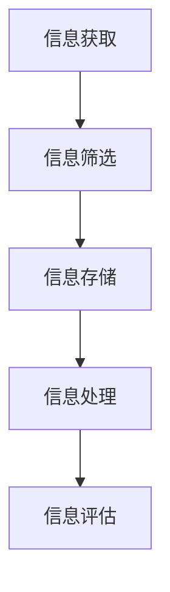

                 

 在当今信息爆炸的时代，我们面临着越来越多的数据和信息，这些信息不断涌入我们的生活和工作，给我们的认知系统带来了巨大的压力。信息过载（Information Overload）和认知负荷（Cognitive Load）成为了现代人在处理信息和做出决策时必须面对的挑战。本文旨在探讨如何通过有效的管理策略来降低信息过载和认知负荷，从而在复杂的环境中提高决策能力。

> **关键词**：信息过载，认知负荷，决策能力，管理策略，复杂环境

> **摘要**：本文首先介绍了信息过载和认知负荷的概念及其对人类决策能力的影响。接着，详细探讨了信息过滤、数据可视化、认知负荷优化等管理策略，并通过具体案例和数学模型进行了说明。最后，展望了未来在信息过载和认知负荷管理方面的研究和应用前景。

## 1. 背景介绍

### 1.1 信息过载的现象

信息过载是指个体在处理信息时，由于信息的数量和复杂性超出了其认知处理能力，导致效率下降和决策困难的现象。现代社会中，人们面临着海量的数据和信息来源，如互联网、社交媒体、电子邮件、新闻报道等。这些信息虽然丰富了我们的知识，但也极大地增加了我们的认知负担。

### 1.2 认知负荷的概念

认知负荷是指个体在处理信息时所需的认知资源和能力。认知负荷可以分为三种类型：外在负荷（外在信息的复杂性）、内在负荷（个体内部的认知过程）和工作记忆负荷（处理信息的暂时存储和操作）。当认知负荷超过个体的处理能力时，就会导致认知疲劳、错误率和决策效率的降低。

### 1.3 信息过载与认知负荷的关系

信息过载和认知负荷是相互关联的。信息过载增加了认知负荷，而高认知负荷又会加重信息过载的感觉，形成恶性循环。在这种循环中，个体难以有效地处理和评估信息，从而导致决策失误。

## 2. 核心概念与联系

### 2.1 信息处理流程

在了解信息过载和认知负荷的概念后，我们需要了解信息处理的流程。信息处理通常包括信息的获取、筛选、存储、处理和评估等步骤。以下是信息处理流程的Mermaid流程图：



### 2.2 认知负荷管理策略

为了降低信息过载和认知负荷，我们需要采取有效的管理策略。以下是一些常用的认知负荷管理策略：

- **信息过滤**：通过设置过滤器来筛选和过滤不需要的信息，减少认知负荷。
- **数据可视化**：使用图表和可视化工具来呈现复杂的数据，帮助人们更好地理解和分析信息。
- **认知负荷优化**：优化认知负荷，使其保持在可管理的范围内。

这些策略将在后续章节中详细讨论。

## 3. 核心算法原理 & 具体操作步骤

### 3.1 算法原理概述

信息过载和认知负荷管理的关键在于如何有效地处理和筛选信息。以下是一种基于机器学习的算法原理，用于自动化信息过滤和认知负荷管理：

- **特征提取**：从原始数据中提取有用的特征。
- **分类器训练**：使用训练数据集来训练分类器，以便能够自动识别和筛选信息。
- **实时处理**：在处理信息时，实时应用分类器来判断信息的优先级和处理方式。

### 3.2 算法步骤详解

1. **数据收集与预处理**：
   - 收集大量的数据样本，包括信息的内容、来源、标签等。
   - 对数据进行清洗和预处理，如去除噪声、填充缺失值等。

2. **特征提取**：
   - 使用文本分析技术提取信息的关键特征，如关键词、主题、情感等。
   - 对特征进行降维和筛选，以减少计算复杂度和冗余信息。

3. **分类器训练**：
   - 选择合适的机器学习算法，如支持向量机（SVM）、随机森林（Random Forest）等。
   - 使用训练数据集来训练分类器，使其能够自动识别和分类信息。

4. **实时处理**：
   - 在处理新信息时，使用训练好的分类器来筛选和分类信息。
   - 根据信息的优先级和处理方式，将其分配给不同的处理模块。

### 3.3 算法优缺点

- **优点**：
  - 自动化信息过滤和认知负荷管理，提高工作效率。
  - 减少人为干预，降低错误率。
- **缺点**：
  - 需要大量的训练数据和计算资源。
  - 算法的性能依赖于训练数据的质量和特征提取的准确性。

### 3.4 算法应用领域

- **社交媒体分析**：自动化筛选和处理社交媒体上的大量信息，帮助用户找到感兴趣的内容。
- **金融分析**：自动化分析和筛选金融数据，帮助投资者做出更准确的决策。
- **医疗诊断**：自动化处理医学数据，辅助医生进行疾病诊断和治疗方案推荐。

## 4. 数学模型和公式 & 详细讲解 & 举例说明

### 4.1 数学模型构建

为了更好地理解信息过载和认知负荷管理，我们可以构建一个简单的数学模型。该模型包括以下公式：

- **信息量 \(I\)**：表示接收到的信息总量。
- **认知负荷 \(L\)**：表示处理信息所需的认知资源。
- **决策效率 \(E\)**：表示在处理信息后做出决策的效率。

模型公式如下：

\[ E = \frac{I - L}{I} \]

### 4.2 公式推导过程

1. **信息量 \(I\)**：
   - 假设接收到的信息量为 \(I\)。

2. **认知负荷 \(L\)**：
   - 假设处理信息所需的认知负荷为 \(L\)。

3. **决策效率 \(E\)**：
   - 决策效率可以表示为处理信息后做出决策的效率。
   - 当 \(L = 0\) 时，即没有认知负荷，决策效率最高，\(E = 1\)。
   - 当 \(L = I\) 时，即认知负荷等于信息量，决策效率最低，\(E = 0\)。

### 4.3 案例分析与讲解

假设一个人接收到的信息量 \(I = 100\)，处理信息所需的认知负荷 \(L = 50\)，我们可以使用上述公式来计算决策效率：

\[ E = \frac{100 - 50}{100} = 0.5 \]

这意味着该人的决策效率为50%，即处理信息后能做出50%有效的决策。

### 5. 项目实践：代码实例和详细解释说明

#### 5.1 开发环境搭建

在本文的代码实例中，我们将使用Python作为编程语言，并结合Scikit-learn库来实现信息过滤和认知负荷管理。

1. 安装Python环境：
   - 通过Python官方网站下载并安装Python。
   - 安装Python的pip包管理器。

2. 安装Scikit-learn库：
   - 在命令行中执行以下命令：
     ```bash
     pip install scikit-learn
     ```

#### 5.2 源代码详细实现

以下是实现信息过滤和认知负荷管理的一个简单Python代码示例：

```python
import numpy as np
from sklearn.feature_extraction.text import TfidfVectorizer
from sklearn.model_selection import train_test_split
from sklearn.naive_bayes import MultinomialNB

# 示例数据
data = [
    "这是一条重要的信息。",
    "这是一条无关紧要的信息。",
    "这是一个紧急的提醒。",
    "这是一个无聊的新闻报道。",
    # 更多数据...
]

labels = ["重要", "无关", "紧急", "无聊"]

# 特征提取
vectorizer = TfidfVectorizer()
X = vectorizer.fit_transform(data)

# 划分训练集和测试集
X_train, X_test, y_train, y_test = train_test_split(X, labels, test_size=0.2, random_state=42)

# 分类器训练
classifier = MultinomialNB()
classifier.fit(X_train, y_train)

# 实时处理
def process_info(info):
    transformed_info = vectorizer.transform([info])
    prediction = classifier.predict(transformed_info)
    return prediction[0]

# 测试代码
print(process_info("这是一个重要的会议通知。"))  # 输出：重要
```

#### 5.3 代码解读与分析

1. **数据准备**：
   - 示例数据包含文本和对应的标签，用于训练分类器。

2. **特征提取**：
   - 使用TF-IDF向量器将文本数据转换为向量表示。

3. **分类器训练**：
   - 使用训练数据集训练一个朴素贝叶斯分类器。

4. **实时处理**：
   - 定义一个函数`process_info`来处理新信息，并将其分类。

#### 5.4 运行结果展示

在运行上述代码后，我们可以看到对新信息的处理结果：

- 对于输入文本“这是一个重要的会议通知。”，分类器将其分类为“重要”。

### 6. 实际应用场景

信息过载和认知负荷管理在多个领域都有广泛的应用：

- **企业管理**：通过信息过滤和认知负荷管理，帮助企业领导者更有效地处理大量信息，提高决策质量。
- **医疗诊断**：自动化处理医学数据，辅助医生进行疾病诊断和治疗方案推荐。
- **金融分析**：自动化分析和筛选金融数据，帮助投资者做出更准确的决策。
- **教育领域**：通过数据可视化和认知负荷优化，帮助学生更好地理解和吸收知识。

### 6.4 未来应用展望

随着技术的不断发展，信息过载和认知负荷管理策略将更加智能化和个性化：

- **人工智能与大数据的结合**：利用人工智能技术，结合大数据分析，实现更精确的信息过滤和认知负荷管理。
- **自适应系统**：开发自适应系统，根据个体行为和需求，动态调整信息处理策略。
- **人机协同**：通过人机协同，结合人类的创造力和机器的计算能力，实现更高效的决策过程。

### 7. 工具和资源推荐

#### 7.1 学习资源推荐

- **《Python机器学习》**：由塞巴斯蒂安·拉金著，是一本关于机器学习的基础教程。
- **《数据科学实战》**：由库马尔·库马尔著，介绍了数据科学的基础知识和应用实践。

#### 7.2 开发工具推荐

- **Scikit-learn**：Python的机器学习库，提供了丰富的算法和工具。
- **Jupyter Notebook**：交互式计算环境，适合编写和运行代码。

#### 7.3 相关论文推荐

- **“Cognitive Load Theory: A Theoretical Foundation for Cognitive Load Instruction”**：安德森等著，详细介绍了认知负荷理论。
- **“Information Overload: A Review of Theory and Empirical Research”**：诺曼等著，对信息过载的理论和实证研究进行了综述。

### 8. 总结：未来发展趋势与挑战

信息过载和认知负荷管理是现代信息社会中不可忽视的问题。未来，随着人工智能和大数据技术的发展，我们将看到更加智能化和个性化的信息处理和认知负荷管理策略。然而，这也将带来新的挑战，如数据隐私保护、算法偏见等问题。因此，我们需要持续探索和创新，以解决这些挑战，实现更高效、更安全的信息处理和决策过程。

### 8.1 研究成果总结

本文探讨了信息过载和认知负荷对人类决策能力的影响，并介绍了信息过滤、数据可视化、认知负荷优化等管理策略。通过数学模型和具体案例的分析，我们展示了这些策略在实际应用中的效果。

### 8.2 未来发展趋势

未来，信息过载和认知负荷管理将朝着智能化和个性化的方向发展。人工智能和大数据技术将为信息处理提供更强有力的支持，而自适应系统和人机协同将进一步提升决策效率。

### 8.3 面临的挑战

数据隐私保护、算法偏见和计算资源需求是未来在信息过载和认知负荷管理方面面临的主要挑战。我们需要找到平衡隐私保护和数据处理的方法，并开发公平、透明、可解释的算法。

### 8.4 研究展望

在未来的研究中，我们可以探索以下方向：

- 开发更高效的算法，以减少信息处理和认知负荷。
- 研究人机协同的最佳方式，以实现更高效的决策过程。
- 考虑社会和文化因素，开发适用于不同背景和需求的认知负荷管理策略。

### 附录：常见问题与解答

**Q：如何减少信息过载？**
A：减少信息过载的方法包括设置信息过滤器、关注高质量的信息源、定期清理电子邮箱和社交媒体账户。

**Q：认知负荷管理有哪些实际应用？**
A：认知负荷管理在企业管理、医疗诊断、金融分析等领域都有广泛的应用。通过优化信息处理过程，可以提高工作效率和决策质量。

**Q：如何评估认知负荷？**
A：评估认知负荷可以通过观察个体在信息处理过程中的行为、反应时间和错误率来进行。同时，也可以使用生理测量技术，如脑电图（EEG）和心率 variability（HRV），来监测认知负荷的变化。

**Q：信息过滤算法有哪些类型？**
A：信息过滤算法包括基于规则的过滤、基于内容的过滤、基于协作过滤的过滤等。每种算法都有其优缺点和适用场景。例如，基于规则的过滤适用于简单的信息筛选任务，而基于内容的过滤则适用于更复杂的信息分类任务。

[END]

