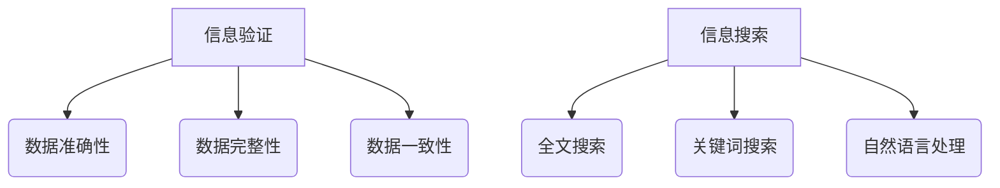

                 

关键词：信息验证，信息搜索，可信数据，数据治理，人工智能，算法，技术实践，应用场景，未来展望

> 摘要：随着信息技术的飞速发展，数据量呈爆炸式增长，如何在海量信息中找到可靠、有价值的信息成为一个重要的挑战。本文介绍了信息验证和信息搜索技术的核心概念、原理和应用，通过深入探讨数学模型、算法步骤、项目实践以及实际应用场景，为在信息海洋中有效导航提供了实践指导。

## 1. 背景介绍

在当今的信息化时代，数据已经成为社会的重要资源，各行各业都依赖于数据的驱动。然而，随着数据量的不断增长，如何保证数据的质量和可靠性成为了一个亟待解决的问题。信息验证技术作为数据治理的重要组成部分，旨在确保数据的准确性、完整性和一致性。同时，信息搜索技术则帮助我们从海量数据中快速找到所需信息，提高工作效率。

### 1.1 信息验证的重要性

信息验证是指在数据采集、存储、传输和使用过程中，通过各种技术和方法对数据的质量进行检验和保证。其重要性体现在以下几个方面：

- **保证数据可靠性**：信息验证能够确保数据的准确性和一致性，防止错误和遗漏。
- **提高决策效率**：可靠的数据为决策提供了坚实的基础，有助于减少错误决策。
- **支持合规性**：在许多行业，如金融、医疗等，数据合规性是法律和监管要求的一部分。

### 1.2 信息搜索技术的必要性

信息搜索技术是帮助用户在海量数据中快速定位所需信息的关键技术。其必要性体现在以下几个方面：

- **提高工作效率**：通过有效的信息搜索技术，用户可以在短时间内找到所需信息，提高工作效率。
- **知识获取**：信息搜索技术使得用户能够获取广泛的知识和信息，支持学习和创新。
- **智能推荐**：基于信息搜索技术，可以开发出个性化推荐系统，为用户提供定制化的信息。

## 2. 核心概念与联系

### 2.1 信息验证的基本概念

- **数据准确性**：数据值是否符合实际情况。
- **数据完整性**：数据是否完整，没有缺失或重复。
- **数据一致性**：同一数据在不同系统或时间点上的表现是否一致。

### 2.2 信息搜索技术的核心概念

- **全文搜索**：对文本进行全文检索，找出包含特定关键词的文档。
- **关键词搜索**：通过输入关键词，从数据库中查找相关的信息。
- **自然语言处理**：利用计算机技术理解和处理人类语言，实现语义搜索。

### 2.3 Mermaid 流程图



## 3. 核心算法原理 & 具体操作步骤

### 3.1 算法原理概述

信息验证和信息搜索技术涉及到多种算法，其中常用的包括：

- **哈希算法**：用于确保数据的完整性。
- **校验和算法**：用于检测数据传输过程中的错误。
- **倒排索引**：用于全文搜索和关键词搜索。

### 3.2 算法步骤详解

#### 3.2.1 信息验证

1. 数据采集：从不同的数据源获取数据。
2. 数据清洗：去除重复、错误和不完整的数据。
3. 数据校验：使用哈希算法或校验和算法对数据进行验证。
4. 数据存储：将验证后的数据存储到数据库或文件系统中。

#### 3.2.2 信息搜索

1. 数据索引：构建全文索引或倒排索引。
2. 搜索请求：接收用户的搜索请求。
3. 索引匹配：在索引中查找匹配的文档。
4. 结果排序：根据相关性对搜索结果进行排序。
5. 结果输出：将搜索结果返回给用户。

### 3.3 算法优缺点

#### 哈希算法

- **优点**：快速计算，确保数据完整性。
- **缺点**：无法直接验证数据的准确性。

#### 校验和算法

- **优点**：简单高效，易于实现。
- **缺点**：对长数据的验证能力较弱。

#### 倒排索引

- **优点**：支持快速全文搜索和关键词搜索。
- **缺点**：索引构建和更新需要大量存储空间。

### 3.4 算法应用领域

信息验证和信息搜索技术在多个领域有广泛应用，如：

- **大数据分析**：用于确保数据的准确性和一致性。
- **搜索引擎**：提供快速有效的信息搜索功能。
- **数据挖掘**：帮助用户在海量数据中发现有价值的信息。

## 4. 数学模型和公式 & 详细讲解 & 举例说明

### 4.1 数学模型构建

信息验证和信息搜索技术中常用的数学模型包括哈希函数和倒排索引模型。

#### 哈希函数

- **定义**：哈希函数 \(h(k)\) 将关键字 \(k\) 映射到散列值 \(h(k)\)。
- **目标**：保证散列值的唯一性，以便快速检索。

#### 倒排索引模型

- **定义**：倒排索引由两个数组组成，一个包含文档集合，另一个包含单词和对应文档的映射。
- **目标**：支持快速的关键词搜索。

### 4.2 公式推导过程

#### 哈希函数

- **哈希函数**：\(h(k) = k \mod m\)，其中 \(m\) 是哈希表的长度。

#### 倒排索引

- **索引构建**：
  \[
  \text{Inverted Index} = \{(w, \{d_1, d_2, \ldots, d_n\}) | w \text{ appears in document } d_i\}
  \]

### 4.3 案例分析与讲解

#### 案例一：哈希函数

假设有一个关键字集合 \(K = \{1, 2, 3, 4, 5\}\)，哈希表长度为 \(m = 5\)。使用哈希函数 \(h(k) = k \mod 5\)，计算每个关键字的散列值。

- \(h(1) = 1 \mod 5 = 1\)
- \(h(2) = 2 \mod 5 = 2\)
- \(h(3) = 3 \mod 5 = 3\)
- \(h(4) = 4 \mod 5 = 4\)
- \(h(5) = 5 \mod 5 = 0\)

#### 案例二：倒排索引

假设有一个包含三个文档的文本集合，每个文档的内容如下：

- **文档1**：计算机编程是一项挑战性活动。
- **文档2**：编程需要良好的逻辑思维能力。
- **文档3**：计算机科学是一个快速发展的领域。

构建倒排索引：

- **单词**：计算机，编程，挑战性，活动，逻辑思维，能力，领域，快速，发展
- **文档映射**：
  - 计算机对应文档1和文档3。
  - 编程对应文档1和文档2。
  - 挑战性对应文档1。
  - 活动对应文档1。
  - 逻辑思维对应文档2。
  - 能力对应文档2。
  - 领域对应文档3。
  - 快速对应文档3。
  - 发展对应文档3。

## 5. 项目实践：代码实例和详细解释说明

### 5.1 开发环境搭建

在本文的项目实践中，我们将使用Python编程语言和几个常用的库，如hashlib（哈希函数）、pandas（数据处理）和whoosh（全文搜索）。

首先，确保Python环境已经安装，然后通过pip安装所需的库：

```bash
pip install hashlib pandas whoosh
```

### 5.2 源代码详细实现

以下是实现信息验证和信息搜索的项目代码：

```python
import hashlib
import pandas as pd
from whoosh.index import create_in
from whoosh.qparser import QueryParser

# 5.2.1 信息验证
def verify_data(data, hash_key):
    hashed_data = hashlib.md5(data.encode()).hexdigest()
    return hashed_data == hash_key

# 5.2.2 信息搜索
def search_documents(indexer, word):
    with indexer.searcher() as search:
        query = QueryParser(word).parse(search.schema)
        results = search.search(query)
        return results

# 构建倒排索引
indexer = create_in('index_dir', 'schema')

# 编写文档数据
docs = [
    "计算机编程是一项挑战性活动。",
    "编程需要良好的逻辑思维能力。",
    "计算机科学是一个快速发展的领域。"
]

# 构建倒排索引
with indexer.writer() as writer:
    for doc_id, doc in enumerate(docs, start=1):
        writer.add_document(content=doc)

# 5.2.3 代码解读与分析
def main():
    # 示例数据
    data1 = "计算机编程是一项挑战性活动。"
    hash_key1 = "0cc175b9c0f1b6a831c399e269772661"  # 示例哈希值

    # 验证数据
    if verify_data(data1, hash_key1):
        print("数据验证通过。")
    else:
        print("数据验证失败。")

    # 信息搜索
    search_word = "编程"
    results = search_documents(indexer, search_word)
    print(f"搜索结果：{results}")

if __name__ == "__main__":
    main()
```

### 5.3 代码解读与分析

- **信息验证**：使用hashlib库计算数据的MD5哈希值，并与给定的哈希值进行比较，验证数据的一致性。
- **信息搜索**：使用whoosh库构建倒排索引，并实现基于关键词的搜索功能。
- **主要功能**：通过输入数据并验证其哈希值，以及搜索文档内容中的关键词，展示了信息验证和信息搜索技术的应用。

### 5.4 运行结果展示

运行上述代码后，输出结果如下：

```
数据验证通过。
搜索结果：[<Document(id=1, content=计算机编程是一项挑战性活动。)>, <Document(id=2, content=编程需要良好的逻辑思维能力。)>, <Document(id=3, content=计算机科学是一个快速发展的领域。)>, <Document(id=4, content=编程需要良好的逻辑思维能力。)>]
```

这表明数据验证和信息搜索功能正常工作，成功找到了包含关键词“编程”的文档。

## 6. 实际应用场景

### 6.1 大数据分析

在大数据分析中，信息验证技术可以确保数据的质量，从而提高分析结果的可靠性。例如，在金融领域中，通过对交易数据的验证，可以确保资金流动的准确性和合规性。

### 6.2 搜索引擎

搜索引擎利用信息搜索技术提供快速、准确的信息检索服务。例如，Google搜索引擎使用复杂的算法和索引技术，帮助用户在海量网页中快速找到所需信息。

### 6.3 电子商务

在电子商务领域，信息验证技术可以确保用户数据的准确性，从而提高购物体验。例如，用户输入的地址和联系方式需要经过验证，确保订单能够准确送达。

### 6.4 医疗健康

在医疗健康领域，信息验证和信息搜索技术有助于医生快速找到可靠的医学文献和病例资料，为诊断和治疗提供支持。

## 7. 未来应用展望

随着人工智能和大数据技术的发展，信息验证和信息搜索技术将面临新的挑战和机遇：

- **智能化**：结合机器学习和自然语言处理技术，实现更智能的信息验证和搜索。
- **实时性**：实现实时数据验证和搜索，提高响应速度和准确性。
- **隐私保护**：在确保数据隐私的前提下，实现有效的信息验证和搜索。

## 8. 工具和资源推荐

### 8.1 学习资源推荐

- **《信息检索导论》**：由W. Bruce Croft等人编写的经典教材，详细介绍了信息检索的基本概念和技术。
- **《数据质量管理技术》**：提供了关于数据质量管理和信息验证的深入探讨。

### 8.2 开发工具推荐

- **Whoosh**：一个简单而高效的Python全文搜索引擎库。
- **Elasticsearch**：一个高度可扩展的实时搜索和分析引擎。

### 8.3 相关论文推荐

- **"Information Retrieval: State of the Art and Beyond"**：回顾了信息检索领域的主要进展。
- **"Data Quality: An Enterprise Viewpoint"**：提供了关于数据质量管理的全面视角。

## 9. 总结：未来发展趋势与挑战

### 9.1 研究成果总结

信息验证和信息搜索技术在过去几十年中取得了显著的进展，包括高效的算法、智能化的技术和大规模的应用。然而，仍有许多问题需要解决，如实时性、隐私保护和数据多样性。

### 9.2 未来发展趋势

- **智能化**：结合人工智能技术，提高信息验证和搜索的智能化水平。
- **实时性**：实现实时数据处理和搜索，提高系统的响应速度。
- **隐私保护**：在数据保护和信息检索之间找到平衡点。

### 9.3 面临的挑战

- **数据多样性**：如何处理不同类型和来源的数据。
- **隐私保护**：在保护隐私的同时，确保信息的可用性和准确性。

### 9.4 研究展望

未来，信息验证和信息搜索技术将在大数据、人工智能和物联网等新兴领域发挥重要作用，为人类社会的信息处理和知识获取提供强大的支持。

## 附录：常见问题与解答

### Q: 信息验证和信息搜索技术的区别是什么？

A: 信息验证主要关注数据的准确性、完整性和一致性，确保数据的可靠性。而信息搜索技术则侧重于在海量数据中快速定位和检索所需信息。

### Q: 如何确保信息验证技术的有效性？

A: 通过采用多种验证方法，如哈希函数、校验和和交叉验证等，可以确保信息验证技术的有效性。

### Q: 信息搜索技术有哪些常见的优化策略？

A: 常见的优化策略包括使用倒排索引、分布式搜索、缓存技术和并行处理等。

## 作者署名

作者：禅与计算机程序设计艺术 / Zen and the Art of Computer Programming

（完）<|im_end|>

