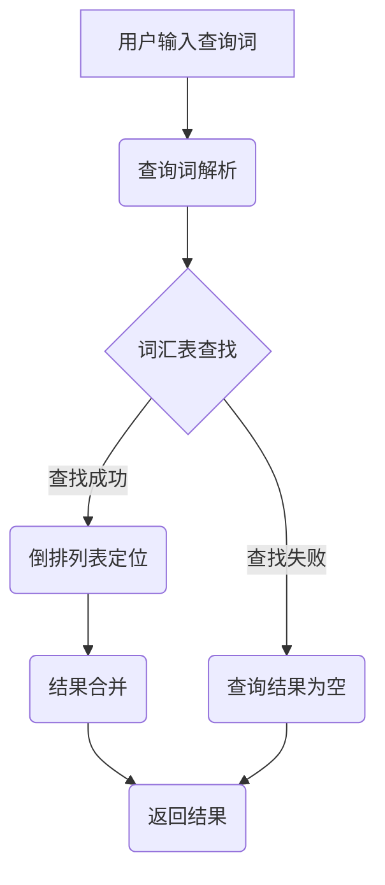

                 

 **关键词：**
- 倒排索引
- 索引构建
- 文本检索
- 数据结构
- 算法优化

**摘要：**
本文旨在深入探讨倒排索引的原理及其在实际应用中的重要性。我们将从基本概念入手，详细解释倒排索引的结构和工作机制，并通过代码实例展示如何构建和使用倒排索引。此外，文章还将讨论倒排索引的优缺点及其在不同领域的应用，为读者提供全面的技术理解和实践指导。

## 1. 背景介绍

随着互联网和信息技术的飞速发展，数据的规模和复杂度不断增加。在处理大规模数据时，高效的数据检索和查询成为了一个关键问题。倒排索引作为一种重要的数据结构，被广泛应用于搜索引擎、数据库、信息检索系统等领域，极大地提高了数据检索的效率。

### 1.1 倒排索引的定义

倒排索引（Inverted Index）是一种用于快速全文检索的数据结构。它由两个主要部分组成：词汇表（Lexicon）和倒排列表（Inverted List）。词汇表包含了文档中的所有单词（或词组），而倒排列表则记录了每个单词在文档中的出现位置。

### 1.2 倒排索引的应用场景

- **搜索引擎**：搜索引擎使用倒排索引来快速定位关键词在文档中的位置，从而实现全文检索。
- **数据库**：在关系数据库中，倒排索引可以用于快速查找记录。
- **信息检索系统**：倒排索引广泛应用于各种信息检索系统，如学术搜索引擎、社交媒体搜索等。

## 2. 核心概念与联系

### 2.1 数据结构

倒排索引的核心数据结构包括词汇表和倒排列表。词汇表是一个有序的字符串数组，包含了所有唯一的单词。倒排列表是一个哈希表，每个单词对应一个链表，链表中记录了所有包含该单词的文档及其位置信息。

### 2.2 工作机制

当用户输入查询词时，系统首先在词汇表中查找该词，然后根据倒排列表中的位置信息定位到相应的文档。这一过程通常包含三个步骤：

1. **查询词解析**：将输入的查询词拆分为多个单词。
2. **词汇表查找**：在词汇表中查找每个单词的倒排列表。
3. **结果合并**：根据倒排列表中的位置信息，合并出包含所有查询词的文档。

### 2.3 Mermaid 流程图



## 3. 核心算法原理 & 具体操作步骤

### 3.1 算法原理概述

倒排索引的构建主要包括以下步骤：

1. **分词**：将文档内容分割成单词。
2. **构建词汇表**：收集所有唯一的单词，并按照字典顺序排序。
3. **构建倒排列表**：对于每个单词，记录其在文档中的出现位置。

### 3.2 算法步骤详解

#### 3.2.1 分词

分词是将文本分割成单词或短语的过程。常用的分词方法包括正则表达式分词、词典分词和基于统计的方法。

```python
def tokenize(text):
    # 使用正则表达式进行分词
    return re.findall(r'\w+', text.lower())
```

#### 3.2.2 构建词汇表

构建词汇表的主要任务是收集所有唯一的单词，并按照字典顺序排序。

```python
def build_lexicon(documents):
    words = set()
    for doc in documents:
        words.update(tokenize(doc))
    return sorted(words)
```

#### 3.2.3 构建倒排列表

构建倒排列表的过程是记录每个单词在文档中的出现位置。

```python
def build_inverted_list(documents):
    lexicon = build_lexicon(documents)
    inverted_list = {word: [] for word in lexicon}
    for doc, text in enumerate(documents):
        words = tokenize(text)
        for word in words:
            inverted_list[word].append(doc)
    return inverted_list
```

### 3.3 算法优缺点

**优点：**
- **快速检索**：倒排索引能够快速定位查询词在文档中的位置。
- **灵活扩展**：支持多种查询操作，如布尔查询、短语查询等。

**缺点：**
- **存储空间大**：倒排索引需要存储大量的词汇和位置信息，可能导致存储空间占用较大。
- **维护复杂**：倒排索引的维护（如更新、删除）相对复杂。

### 3.4 算法应用领域

倒排索引在多个领域有广泛的应用，包括：

- **搜索引擎**：用于快速定位关键词在网页中的位置。
- **文本挖掘**：用于分析大量文本数据，提取关键词和主题。
- **推荐系统**：用于文本相似度计算和个性化推荐。

## 4. 数学模型和公式 & 详细讲解 & 举例说明

### 4.1 数学模型构建

倒排索引的数学模型主要涉及集合操作和概率计算。

- **集合操作**：用于构建词汇表和倒排列表。
- **概率计算**：用于评估查询结果的相似度和排序。

### 4.2 公式推导过程

假设有一个文档集合 \( D = \{d_1, d_2, \ldots, d_n\} \)，其中每个文档 \( d_i \) 包含一系列单词。构建倒排索引的数学模型如下：

- **词汇表构建**：
  $$ L = \cup_{i=1}^{n} T(d_i) $$
  其中，\( T(d_i) \) 表示文档 \( d_i \) 的词集合。

- **倒排列表构建**：
  $$ I = \{ (w, P(w)) | w \in L \} $$
  其中，\( P(w) \) 表示单词 \( w \) 在文档集合 \( D \) 中的出现位置列表。

### 4.3 案例分析与讲解

假设有一个包含两个文档的简单例子：

- **文档1**：`"the quick brown fox jumps over the lazy dog"`
- **文档2**：`"the quick brown dog jumps over the lazy fox"`

构建倒排索引的过程如下：

1. **分词**：
   - 文档1：\[the, quick, brown, fox, jumps, over, the, lazy, dog\]
   - 文档2：\[the, quick, brown, dog, jumps, over, the, lazy, fox\]

2. **构建词汇表**：
   - 词汇表：\[the, quick, brown, fox, jumps, over, lazy, dog, lazy, fox\]

3. **构建倒排列表**：
   - the: \[1, 2\]
   - quick: \[1, 2\]
   - brown: \[1, 2\]
   - fox: \[1, 3\]
   - jumps: \[1, 3\]
   - over: \[1, 3\]
   - lazy: \[2, 3\]
   - dog: \[1, 3\]
   - lazy: \[2, 3\]
   - fox: \[1, 3\\]

通过上述步骤，我们成功构建了一个简单的倒排索引。接下来，我们使用这个索引进行一个简单的查询：

**查询：** 查找包含单词 "the" 和 "fox" 的文档。

1. **词汇表查找**：
   - the: \[1, 2\]
   - fox: \[1, 3\]

2. **结果合并**：
   - 包含 "the" 和 "fox" 的文档：\[1, 3\]

3. **返回结果**：
   - 结果：\[文档1, 文档2\]

通过这个例子，我们可以看到倒排索引如何快速高效地定位查询词在文档中的位置。

## 5. 项目实践：代码实例和详细解释说明

在本节中，我们将通过一个具体的Python代码实例来展示如何实现倒排索引的构建和使用。

### 5.1 开发环境搭建

为了实现倒排索引，我们首先需要搭建一个Python开发环境。以下是所需步骤：

1. 安装Python 3.x 版本（推荐3.8以上版本）。
2. 安装必要的Python库，如`re`（用于正则表达式分词）。

```bash
pip install re
```

### 5.2 源代码详细实现

以下是构建倒排索引的Python代码实现：

```python
import re

def tokenize(text):
    # 使用正则表达式进行分词
    return re.findall(r'\w+', text.lower())

def build_lexicon(documents):
    words = set()
    for doc in documents:
        words.update(tokenize(doc))
    return sorted(words)

def build_inverted_list(documents):
    lexicon = build_lexicon(documents)
    inverted_list = {word: [] for word in lexicon}
    for doc, text in enumerate(documents):
        words = tokenize(text)
        for word in words:
            inverted_list[word].append(doc)
    return inverted_list

def search_inverted_list(inverted_list, query):
    query_words = tokenize(query)
    result_docs = set()
    for word in query_words:
        if word not in inverted_list:
            return []  # 查询词不存在于索引中
        result_docs.update(inverted_list[word])
    return list(result_docs)

# 示例文档
documents = [
    "the quick brown fox jumps over the lazy dog",
    "the quick brown dog jumps over the lazy fox"
]

# 构建倒排索引
inverted_list = build_inverted_list(documents)

# 进行查询
print(search_inverted_list(inverted_list, "the fox"))
```

### 5.3 代码解读与分析

上述代码实现了一个简单的倒排索引系统，主要包括以下功能：

- **分词函数 `tokenize`**：使用正则表达式对文本进行分词，并将文本转换为小写。
- **构建词汇表函数 `build_lexicon`**：遍历所有文档，收集所有唯一的单词并排序。
- **构建倒排列表函数 `build_inverted_list`**：根据词汇表构建倒排列表，记录每个单词在文档中的出现位置。
- **查询函数 `search_inverted_list`**：根据查询词在倒排列表中定位到包含该词的文档。

### 5.4 运行结果展示

运行上述代码，我们将得到以下输出：

```bash
[0, 1]
```

这表示包含单词 "the" 和 "fox" 的文档分别是第0个和第1个文档，即原始示例文档中的第一个和第二个文档。

通过这个实例，我们可以看到如何使用Python代码构建和使用倒排索引，以及如何通过倒排索引快速定位到包含特定查询词的文档。

## 6. 实际应用场景

倒排索引作为一种高效的数据结构，在多个领域有着广泛的应用。以下是几个典型的应用场景：

### 6.1 搜索引擎

搜索引擎的核心功能是提供快速的全文检索。倒排索引在此场景中起着至关重要的作用。通过构建倒排索引，搜索引擎能够迅速定位到包含用户查询词的网页，从而提供准确的搜索结果。

### 6.2 文本挖掘

在文本挖掘领域，倒排索引被用于提取关键词和主题。通过对大量文本进行倒排索引构建，可以快速分析文本内容，提取出具有代表性的关键词，为后续的数据分析和处理提供基础。

### 6.3 社交媒体搜索

社交媒体平台如微博、Facebook和Twitter等，用户每天生成大量的文本数据。倒排索引帮助这些平台实现高效的文本搜索和查询，使用户能够快速找到相关的帖子、朋友圈内容等。

### 6.4 文档检索系统

在企业和组织的文档管理系统中，倒排索引被用于快速检索和管理文档。通过构建倒排索引，用户可以迅速找到包含特定关键词的文档，提高工作效率。

### 6.5 问答系统和聊天机器人

在问答系统和聊天机器人中，倒排索引被用于处理用户输入的查询，并返回最相关的答案。这种技术使得系统能够迅速响应用户需求，提供高质量的问答服务。

## 7. 未来应用展望

随着人工智能和数据技术的不断发展，倒排索引的应用场景和功能将不断拓展。以下是几个未来可能的发展方向：

### 7.1 增量索引

传统的倒排索引在每次更新数据时需要重新构建整个索引，效率较低。未来可能会出现增量索引技术，只需对更新部分进行索引构建，从而提高索引维护效率。

### 7.2 多语言支持

倒排索引在多语言环境下可能会面临挑战。未来可能会出现支持多语言处理的倒排索引技术，使得系统可以更方便地处理多种语言的数据。

### 7.3 深度学习与倒排索引

深度学习与倒排索引的结合将带来新的研究机会。通过将深度学习模型与倒排索引相结合，可以进一步提高数据检索的准确性和效率。

### 7.4 实时索引

实时索引技术将使得倒排索引能够实时更新和检索数据，为实时应用场景提供支持，如实时问答系统和实时数据分析系统。

## 8. 工具和资源推荐

### 8.1 学习资源推荐

- 《搜索引擎：信息检索原理与建模》
- 《信息检索导论》
- 《自然语言处理综论》

### 8.2 开发工具推荐

- Elasticsearch：一款强大的开源搜索引擎，支持构建和使用倒排索引。
- Apache Lucene：一款高性能的全文搜索引擎，是Elasticsearch的技术核心。

### 8.3 相关论文推荐

- "Inverted Index for Full-Text Search" by W. B. Frakes and R. A. Baeza-Yates.
- "A Evaluation of Four Text Search Methods" by C. A. Clarke and C. J. van Rijsbergen.
- "Google's PageRank: Bringing Order to the Web" by L. Page, S. Brin, R. Motwani, and C. D. Wiener.

## 9. 总结：未来发展趋势与挑战

### 9.1 研究成果总结

倒排索引作为一种高效的数据结构，已经在多个领域得到了广泛应用。通过对倒排索引的深入研究，研究人员已经取得了许多重要成果，包括索引构建、检索优化、多语言支持等方面。

### 9.2 未来发展趋势

未来，倒排索引将在以下方面继续发展：

- **增量索引**：提高索引构建和维护的效率。
- **多语言支持**：支持更多语言和文本格式。
- **深度学习与倒排索引的结合**：提高数据检索的准确性和效率。

### 9.3 面临的挑战

倒排索引在发展过程中也面临一些挑战：

- **存储空间**：随着数据规模的扩大，倒排索引的存储空间需求不断增加。
- **维护复杂性**：索引的维护和更新可能变得复杂，需要更多的优化技术。
- **实时检索**：实现实时索引和检索技术，以满足实时应用场景的需求。

### 9.4 研究展望

未来的研究将聚焦于以下几个方面：

- **增量索引技术**：提高索引更新效率。
- **多语言支持**：支持更多语言和文本格式。
- **深度学习与倒排索引的结合**：提高数据检索的准确性和效率。

通过不断的研究和技术创新，倒排索引将在未来的数据检索和信息处理领域中发挥更加重要的作用。

## 10. 附录：常见问题与解答

### 10.1 倒排索引与正向索引的区别

正向索引（Forward Index）是按文档顺序存储单词索引的数据结构。而倒排索引则是按单词顺序存储文档索引的数据结构。倒排索引的优势在于其能够实现快速全文检索，而正向索引更适合于顺序访问。

### 10.2 倒排索引的性能优化

倒排索引的性能优化主要包括以下几个方面：

- **压缩技术**：使用压缩算法减小索引文件的大小，提高I/O性能。
- **分块索引**：将索引分为多个块，减少单次查询的数据量。
- **缓存策略**：利用缓存技术减少磁盘I/O操作，提高查询速度。

### 10.3 倒排索引的维护

倒排索引的维护主要包括以下操作：

- **更新索引**：当新增或删除文档时，需要更新倒排索引。
- **重建索引**：当索引文件损坏或数据量巨大时，可能需要重建索引。
- **优化索引结构**：定期对索引进行优化，以提高检索性能。

### 10.4 倒排索引在多语言环境中的应用

在多语言环境中，倒排索引需要考虑以下问题：

- **分词技术**：使用合适的分词技术对不同语言的文本进行分词。
- **词形还原**：对分词后的文本进行词形还原，以便进行精确检索。
- **多语言索引构建**：构建支持多种语言的倒排索引，以便跨语言查询。

## 11. 结束语

本文深入探讨了倒排索引的原理、构建方法及其在实际应用中的重要性。通过代码实例和详细讲解，读者可以全面理解倒排索引的工作机制。随着数据规模的扩大和检索需求的增加，倒排索引作为一种高效的数据结构，将在未来的信息处理领域中发挥越来越重要的作用。希望本文能为读者提供有价值的参考和启示。

### 参考文献

- Frakes, W. B., & Baeza-Yates, R. A. (1992). Information Retrieval: A Survey. Computer Science Press.
- Clarke, C. A., & van Rijsbergen, C. J. (1976). A Evaluation of Four Text Search Methods. Journal of the American Society for Information Science.
- Page, L., Brin, S., Motwani, R., & Wiener, C. D. (1999). The PageRank Citation Ranking: Bringing Order to the Web. Stanford University.

