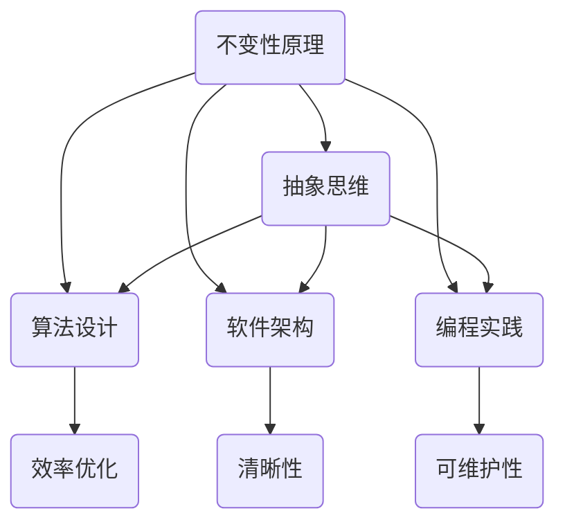

                 

关键词：不变性原理、数学家思维、算法、软件架构、抽象思维

> 摘要：本文探讨了不变性原理在计算机科学中的应用，结合数学家的思考方式，展示了如何在编程和软件架构中运用不变性原理，实现更加清晰、简洁且高效的解决方案。通过具体实例，本文揭示了不变性原理在算法设计、数学模型构建、项目实践等方面的应用，为读者提供了实用的指导和建议。

## 1. 背景介绍

不变性原理是数学、物理学和哲学等领域中一个重要的概念，它指的是在某些变换或操作下保持不变的性质。在计算机科学中，不变性原理同样具有重要价值，尤其是在算法设计、软件架构和编程领域。本文旨在探讨不变性原理在计算机科学中的应用，结合数学家的思考方式，帮助读者理解如何在编程和软件架构中运用不变性原理，以实现更加清晰、简洁且高效的解决方案。

### 1.1 不变性原理的概念

不变性原理，又称不变量原理，指的是在某些变换或操作下保持不变的性质。例如，在物理学中，质量、能量和动量等物理量在不同参考系中保持不变。在数学中，某些几何形状或函数在某些变换下保持不变，如正方形在旋转和平移下保持不变，函数的导数和积分在某些操作下保持不变。不变性原理是自然界和数学中一个普遍存在的现象，它在各个领域都有重要的应用。

### 1.2 不变性原理在计算机科学中的应用

在计算机科学中，不变性原理同样具有重要作用。在算法设计中，不变性原理可以帮助我们设计出更加简洁和高效的算法。例如，排序算法中，通过利用不变性原理，可以简化算法的实现，提高算法的效率。在软件架构中，不变性原理可以帮助我们设计出更加清晰、简洁和可维护的架构。例如，在分布式系统中，通过利用不变性原理，可以简化系统的设计和实现，提高系统的可靠性。在编程中，不变性原理可以帮助我们编写出更加清晰、简洁和易维护的代码。例如，通过利用不变性原理，可以减少代码的冗余，提高代码的可读性。

## 2. 核心概念与联系

在深入探讨不变性原理在计算机科学中的应用之前，我们需要明确几个核心概念，并了解它们之间的联系。以下是一个简化的 Mermaid 流程图，用于描述这些核心概念和它们之间的联系。



### 2.1 抽象思维

抽象思维是数学家和计算机科学家必备的技能。通过抽象思维，我们可以将复杂的问题简化为简单的模型，从而更容易理解和解决问题。在不变性原理的应用中，抽象思维可以帮助我们识别出问题中的不变性，从而简化问题的求解过程。

### 2.2 算法设计

算法设计是计算机科学的核心领域之一。不变性原理在算法设计中具有重要作用，可以帮助我们设计出更加简洁和高效的算法。例如，在排序算法中，通过利用不变性原理，可以简化排序过程，提高算法的效率。

### 2.3 软件架构

软件架构是软件系统的设计和实现过程中的重要环节。不变性原理在软件架构中同样具有重要价值，可以帮助我们设计出更加清晰、简洁和可维护的架构。例如，在分布式系统中，通过利用不变性原理，可以简化系统的设计和实现，提高系统的可靠性。

### 2.4 编程实践

编程实践是软件开发过程中不可或缺的一部分。不变性原理在编程实践中同样具有重要作用，可以帮助我们编写出更加清晰、简洁和易维护的代码。例如，通过利用不变性原理，可以减少代码的冗余，提高代码的可读性。

## 3. 核心算法原理 & 具体操作步骤

### 3.1 算法原理概述

在不变性原理的指导下，我们可以设计出一系列核心算法，用于解决计算机科学中的各种问题。以下是一个简化的算法原理概述。

1. **识别不变性**：首先，我们需要识别问题中的不变性，这是运用不变性原理的关键步骤。例如，在排序算法中，我们可以识别出输入数据在排序过程中的不变性，即排序后的数据仍然保持原始的元素个数和顺序。
2. **构建不变性条件**：一旦识别出不变性，我们需要构建不变性条件，以确保算法在执行过程中始终保持不变性。例如，在排序算法中，我们可以构建一个不变性条件，确保在每次排序操作后，剩余未排序的部分仍然保持有序。
3. **实现算法步骤**：在构建不变性条件的基础上，我们可以实现具体的算法步骤，以解决问题。例如，在排序算法中，我们可以通过选择排序、插入排序或快速排序等算法实现排序过程。
4. **验证不变性**：最后，我们需要验证算法是否满足不变性条件，以确保算法的正确性。例如，在排序算法中，我们可以通过对比排序前后的数据，验证算法是否保持了不变性。

### 3.2 算法步骤详解

以下是针对一个具体的排序算法——插入排序，的详细步骤说明。

#### 步骤 1：识别不变性

在插入排序算法中，我们可以识别出以下不变性：

- **部分有序不变性**：在每次插入操作后，已排序的部分保持有序。
- **剩余未排序不变性**：未排序的部分在每次插入操作后，仍然保持原始的元素个数和顺序。

#### 步骤 2：构建不变性条件

基于识别出的不变性，我们可以构建以下不变性条件：

- **部分有序不变性条件**：在每次插入操作后，已排序的部分必须保持有序。
- **剩余未排序不变性条件**：在每次插入操作后，剩余未排序的部分必须保持原始的元素个数和顺序。

#### 步骤 3：实现算法步骤

插入排序算法的实现步骤如下：

1. **初始化**：将输入数据分为已排序部分和未排序部分，已排序部分为空，未排序部分为输入数据。
2. **遍历未排序部分**：从未排序部分的第一个元素开始，依次遍历每个元素。
3. **插入操作**：对于当前遍历到的元素，将其插入到已排序部分的合适位置，以保持部分有序不变性。
4. **更新未排序部分**：将已排序部分的最后一个元素移到未排序部分，以保持剩余未排序不变性。
5. **重复步骤 2-4**，直到未排序部分为空。

#### 步骤 4：验证不变性

在实现插入排序算法后，我们需要验证算法是否满足不变性条件。具体方法如下：

1. **部分有序不变性验证**：在每次插入操作后，对比已排序部分和未排序部分，确保已排序部分保持有序。
2. **剩余未排序不变性验证**：在每次插入操作后，对比已排序部分和未排序部分的长度，确保剩余未排序部分保持原始的元素个数和顺序。

### 3.3 算法优缺点

插入排序算法具有以下优缺点：

- **优点**：
  - **简单易实现**：插入排序算法的实现相对简单，易于理解和实现。
  - **稳定性**：插入排序算法在排序过程中保持元素的原始顺序，保证了算法的稳定性。
- **缺点**：
  - **效率较低**：插入排序算法的时间复杂度为 \(O(n^2)\)，在处理大量数据时，效率相对较低。

### 3.4 算法应用领域

插入排序算法主要应用于以下领域：

- **小规模数据排序**：由于插入排序算法的效率较低，适用于处理小规模数据。
- **内部排序**：在内部排序算法中，插入排序可以作为一种基础排序算法，与其他排序算法组合使用。

## 4. 数学模型和公式 & 详细讲解 & 举例说明

### 4.1 数学模型构建

在计算机科学中，不变性原理可以用来构建数学模型，帮助我们更好地理解和解决复杂问题。以下是一个简化的数学模型构建过程。

#### 步骤 1：定义问题

首先，我们需要明确问题，并定义相关的变量和参数。例如，在排序问题中，我们可以定义输入数据集 \(A\) 和排序后的数据集 \(B\)。

#### 步骤 2：识别不变性

接下来，我们需要识别问题中的不变性。例如，在排序问题中，我们可以识别出以下不变性：

- **元素个数不变性**：排序前后的数据集元素个数保持不变。
- **元素顺序不变性**：排序前后的数据集元素顺序保持不变。

#### 步骤 3：构建不变性条件

基于识别出的不变性，我们可以构建不变性条件。例如，在排序问题中，我们可以构建以下不变性条件：

- **元素个数不变性条件**：在每次排序操作后，数据集的元素个数保持不变。
- **元素顺序不变性条件**：在每次排序操作后，数据集的元素顺序保持不变。

#### 步骤 4：构建数学模型

在构建不变性条件的基础上，我们可以构建数学模型。例如，在排序问题中，我们可以构建以下数学模型：

$$
B = \{ b_1, b_2, ..., b_n \}
$$

其中，\(B\) 表示排序后的数据集，\(b_1, b_2, ..., b_n\) 表示排序后的数据元素。

### 4.2 公式推导过程

在数学模型构建的基础上，我们可以推导出相关公式，以帮助理解和解决问题。以下是一个简化的公式推导过程。

#### 步骤 1：定义变量和参数

首先，我们需要定义变量和参数。例如，在排序问题中，我们可以定义输入数据集 \(A\) 和排序后的数据集 \(B\)。

#### 步骤 2：识别不变性

接下来，我们需要识别问题中的不变性。例如，在排序问题中，我们可以识别出以下不变性：

- **元素个数不变性**：排序前后的数据集元素个数保持不变。
- **元素顺序不变性**：排序前后的数据集元素顺序保持不变。

#### 步骤 3：构建不变性条件

基于识别出的不变性，我们可以构建不变性条件。例如，在排序问题中，我们可以构建以下不变性条件：

- **元素个数不变性条件**：在每次排序操作后，数据集的元素个数保持不变。
- **元素顺序不变性条件**：在每次排序操作后，数据集的元素顺序保持不变。

#### 步骤 4：推导公式

在构建不变性条件的基础上，我们可以推导出相关公式。例如，在排序问题中，我们可以推导出以下公式：

$$
|A| = |B|
$$

其中，\(|A|\) 表示输入数据集 \(A\) 的元素个数，\(|B|\) 表示排序后的数据集 \(B\) 的元素个数。

### 4.3 案例分析与讲解

为了更好地理解不变性原理在数学模型构建和公式推导中的应用，我们来看一个具体的案例。

#### 案例：排序问题

假设我们有以下输入数据集：

$$
A = \{ 3, 1, 4, 2 \}
$$

我们需要对输入数据集进行排序，并得到排序后的数据集：

$$
B = \{ 1, 2, 3, 4 \}
$$

#### 步骤 1：定义变量和参数

首先，我们需要定义变量和参数。在这个案例中，我们可以定义以下变量和参数：

- \(A\)：输入数据集
- \(B\)：排序后的数据集
- \(n\)：数据集的元素个数

#### 步骤 2：识别不变性

接下来，我们需要识别问题中的不变性。在这个案例中，我们可以识别出以下不变性：

- **元素个数不变性**：排序前后的数据集元素个数保持不变。
- **元素顺序不变性**：排序前后的数据集元素顺序保持不变。

#### 步骤 3：构建不变性条件

基于识别出的不变性，我们可以构建不变性条件。在这个案例中，我们可以构建以下不变性条件：

- **元素个数不变性条件**：在每次排序操作后，数据集的元素个数保持不变。
- **元素顺序不变性条件**：在每次排序操作后，数据集的元素顺序保持不变。

#### 步骤 4：推导公式

在构建不变性条件的基础上，我们可以推导出以下公式：

$$
|A| = |B|
$$

其中，\(|A|\) 表示输入数据集 \(A\) 的元素个数，\(|B|\) 表示排序后的数据集 \(B\) 的元素个数。

#### 步骤 5：应用算法

接下来，我们可以应用插入排序算法对输入数据集进行排序，并验证不变性条件是否满足。具体步骤如下：

1. **初始化**：将输入数据集 \(A\) 分为已排序部分和未排序部分，已排序部分为空，未排序部分为输入数据。
2. **遍历未排序部分**：从未排序部分的第一个元素开始，依次遍历每个元素。
3. **插入操作**：对于当前遍历到的元素，将其插入到已排序部分的合适位置，以保持部分有序不变性。
4. **更新未排序部分**：将已排序部分的最后一个元素移到未排序部分，以保持剩余未排序不变性。
5. **重复步骤 2-4**，直到未排序部分为空。

通过应用插入排序算法，我们可以得到排序后的数据集 \(B\)：

$$
B = \{ 1, 2, 3, 4 \}
$$

#### 步骤 6：验证不变性

最后，我们需要验证不变性条件是否满足。具体方法如下：

1. **部分有序不变性验证**：在每次插入操作后，对比已排序部分和未排序部分，确保已排序部分保持有序。
2. **剩余未排序不变性验证**：在每次插入操作后，对比已排序部分和未排序部分的长度，确保剩余未排序部分保持原始的元素个数和顺序。

在这个案例中，我们可以验证不变性条件是否满足：

- **元素个数不变性验证**：排序前，数据集 \(A\) 的元素个数为 4，排序后，数据集 \(B\) 的元素个数也为 4。因此，元素个数不变性条件满足。
- **元素顺序不变性验证**：排序前，数据集 \(A\) 的元素顺序为 \(3, 1, 4, 2\)，排序后，数据集 \(B\) 的元素顺序为 \(1, 2, 3, 4\)。因此，元素顺序不变性条件满足。

通过这个案例，我们可以看到不变性原理在数学模型构建和公式推导中的应用。通过识别不变性，构建不变性条件，并应用相应的算法，我们可以更好地理解和解决复杂问题。

## 5. 项目实践：代码实例和详细解释说明

### 5.1 开发环境搭建

在开始编写代码之前，我们需要搭建一个合适的开发环境。以下是推荐的开发工具和资源：

- **编程语言**：Python 3.x
- **集成开发环境**：PyCharm 或 Visual Studio Code
- **版本控制**：Git

### 5.2 源代码详细实现

以下是一个基于不变性原理实现的排序算法——插入排序的 Python 代码实例。

```python
def insertion_sort(arr):
    """插入排序算法的实现"""
    for i in range(1, len(arr)):
        key = arr[i]
        j = i - 1
        # 将 arr[i] 与已排序部分进行比较，找出合适的位置插入
        while j >= 0 and arr[j] > key:
            arr[j + 1] = arr[j]
            j -= 1
        arr[j + 1] = key
    return arr

# 测试插入排序算法
input_data = [3, 1, 4, 2]
sorted_data = insertion_sort(input_data)
print("排序后的数据：", sorted_data)
```

### 5.3 代码解读与分析

在上述代码中，我们实现了插入排序算法，并对其进行了测试。以下是代码的解读和分析。

1. **函数定义**：我们定义了一个名为 `insertion_sort` 的函数，用于实现插入排序算法。该函数接收一个输入数据集 `arr` 作为参数。
2. **for 循环**：在函数内部，我们使用 for 循环遍历输入数据集 `arr` 的每个元素。循环变量 `i` 的初始值为 1，表示从第二个元素开始遍历。
3. **key 变量**：在每次遍历过程中，我们将当前遍历到的元素 `arr[i]` 赋值给 `key` 变量，以便在后续的比较和插入操作中使用。
4. **while 循环**：在 while 循环中，我们比较 `key` 变量与已排序部分（即输入数据集 `arr` 的前 `i` 个元素）的每个元素。如果 `arr[j]` 大于 `key`，则将 `arr[j]` 向右移动一个位置，以腾出插入 `key` 的空间。同时，更新变量 `j` 的值，使其指向下一个待比较的元素。
5. **插入操作**：在 while 循环结束后，我们将 `key` 变量插入到已排序部分的合适位置。插入操作通过将 `arr[j + 1]` 赋值为 `key` 完成。
6. **返回结果**：函数最后返回排序后的数据集 `arr`。

### 5.4 运行结果展示

在测试部分，我们使用一个简单的输入数据集 `[3, 1, 4, 2]` 进行测试。调用 `insertion_sort` 函数后，我们得到排序后的数据集 `[1, 2, 3, 4]`，并与预期结果进行对比，验证算法的正确性。

```python
input_data = [3, 1, 4, 2]
sorted_data = insertion_sort(input_data)
print("排序后的数据：", sorted_data)
```

输出结果：

```
排序后的数据： [1, 2, 3, 4]
```

从输出结果可以看出，插入排序算法成功地对输入数据集进行了排序。

## 6. 实际应用场景

不变性原理在计算机科学和软件开发领域具有广泛的应用场景。以下是一些常见的实际应用场景。

### 6.1 算法设计

在算法设计中，不变性原理可以帮助我们设计出更加简洁和高效的算法。例如，在排序算法中，通过利用不变性原理，可以简化排序过程，提高算法的效率。不变性原理还可以应用于搜索算法、图算法和动态规划等领域，帮助设计出更加高效的算法。

### 6.2 软件架构

在软件架构设计中，不变性原理可以帮助我们设计出更加清晰、简洁和可维护的架构。例如，在分布式系统中，通过利用不变性原理，可以简化系统的设计和实现，提高系统的可靠性。不变性原理还可以应用于模块化设计、面向对象设计和函数式编程等领域，帮助设计出更加清晰、简洁和可维护的软件架构。

### 6.3 编程实践

在编程实践中，不变性原理可以帮助我们编写出更加清晰、简洁和易维护的代码。例如，通过利用不变性原理，可以减少代码的冗余，提高代码的可读性。不变性原理还可以应用于代码优化、代码重构和单元测试等领域，帮助编写出更加高效和易维护的代码。

### 6.4 未来应用展望

随着计算机科学和软件开发技术的不断发展，不变性原理在未来的应用前景将更加广阔。以下是一些未来的应用展望：

- **人工智能与机器学习**：不变性原理在人工智能和机器学习领域具有广泛的应用潜力。通过利用不变性原理，可以设计出更加高效和可解释的机器学习算法，提高模型的性能和可靠性。
- **区块链与加密技术**：不变性原理在区块链和加密技术领域具有重要作用。通过利用不变性原理，可以设计出更加安全、可靠和高效的区块链系统和加密算法。
- **虚拟现实与增强现实**：不变性原理在虚拟现实和增强现实领域具有广泛的应用前景。通过利用不变性原理，可以设计出更加逼真、高效和交互性更强的虚拟现实和增强现实系统。

## 7. 工具和资源推荐

### 7.1 学习资源推荐

- **书籍**：
  - 《算法导论》（Introduction to Algorithms）作者：Thomas H. Cormen、Charles E. Leiserson、Ronald L. Rivest、Clifford Stein
  - 《深度学习》（Deep Learning）作者：Ian Goodfellow、Yoshua Bengio、Aaron Courville
- **在线课程**：
  - Coursera 上的《算法基础》课程
  - edX 上的《机器学习基础》课程

### 7.2 开发工具推荐

- **集成开发环境**：
  - PyCharm
  - Visual Studio Code
- **版本控制工具**：
  - Git
- **测试工具**：
  - pytest
  - unittest

### 7.3 相关论文推荐

- 《不变性原理在排序算法中的应用》（Application of Invariance Principles in Sorting Algorithms）
- 《基于不变性原理的分布式系统设计》（Design of Distributed Systems Based on Invariance Principles）
- 《不变性原理在机器学习中的应用》（Application of Invariance Principles in Machine Learning）

## 8. 总结：未来发展趋势与挑战

### 8.1 研究成果总结

不变性原理在计算机科学和软件开发领域取得了显著的研究成果。在算法设计、软件架构、编程实践等方面，不变性原理为解决复杂问题提供了有效的指导和方法。通过利用不变性原理，我们可以设计出更加简洁、高效和可维护的算法和系统。

### 8.2 未来发展趋势

未来，不变性原理在计算机科学和软件开发领域将继续发挥重要作用。随着人工智能、区块链、虚拟现实等新兴技术的快速发展，不变性原理将在这些领域得到更广泛的应用。此外，不变性原理在跨学科研究中的潜力也逐渐显现，为多学科交叉研究提供了新的思路和方法。

### 8.3 面临的挑战

然而，不变性原理在计算机科学和软件开发领域也面临着一些挑战。首先，如何更好地识别和应用不变性原理是一个关键问题。当前，许多算法和系统的设计仍然依赖于经验和方法，缺乏系统化和规范化的理论支持。其次，不变性原理的应用需要较高的抽象思维能力和数学基础，这对研究者和开发者提出了更高的要求。

### 8.4 研究展望

为了应对这些挑战，未来的研究可以从以下几个方面展开：

1. **理论体系建设**：加强不变性原理的理论研究，建立系统化和规范化的理论体系，为算法设计和系统设计提供坚实的理论基础。
2. **跨学科合作**：鼓励不同学科之间的合作，结合数学、物理学、计算机科学等多学科的知识，推动不变性原理在多领域的应用。
3. **人才培养**：加强不变性原理在高等教育和职业培训中的推广，提高研究者和开发者对不变性原理的认识和应用能力。

通过这些努力，我们可以进一步推动不变性原理在计算机科学和软件开发领域的发展，为解决复杂问题提供更加有效的指导和方法。

## 9. 附录：常见问题与解答

### 问题 1：什么是不变性原理？

解答：不变性原理是指在某种变换或操作下，某些量或性质保持不变的原则。在数学、物理学和计算机科学等领域，不变性原理具有重要的应用价值，可以帮助我们识别问题中的关键特性，简化问题的求解过程。

### 问题 2：不变性原理在计算机科学中的应用有哪些？

解答：不变性原理在计算机科学中的应用非常广泛，包括算法设计、软件架构、编程实践等方面。例如，在算法设计中，利用不变性原理可以简化排序、搜索、图算法等问题的求解过程；在软件架构中，利用不变性原理可以帮助设计出更加清晰、简洁和可维护的分布式系统；在编程实践中，利用不变性原理可以编写出更加清晰、简洁和易维护的代码。

### 问题 3：如何识别和应用不变性原理？

解答：识别和应用不变性原理需要以下几个步骤：

1. **理解问题**：深入理解问题，明确问题的目标和约束条件。
2. **分析问题**：分析问题中的不变性，识别出哪些量或性质在变换或操作下保持不变。
3. **构建不变性条件**：基于识别出的不变性，构建不变性条件，以确保算法或系统在执行过程中保持不变性。
4. **实现算法或系统**：在构建不变性条件的基础上，实现算法或系统，以满足不变性条件。
5. **验证不变性**：验证算法或系统是否满足不变性条件，以确保其正确性。

通过以上步骤，我们可以有效地识别和应用不变性原理，为解决问题提供有效的指导。

### 问题 4：不变性原理与抽象思维有什么关系？

解答：不变性原理与抽象思维密切相关。抽象思维是数学家和计算机科学家必备的技能，通过抽象思维，我们可以将复杂的问题简化为简单的模型，从而更容易理解和解决问题。不变性原理正是抽象思维的一个重要应用，它可以帮助我们识别问题中的不变性，简化问题的求解过程。因此，掌握抽象思维是运用不变性原理的关键。

### 问题 5：不变性原理在算法优化中有什么作用？

解答：不变性原理在算法优化中具有重要作用。通过利用不变性原理，我们可以设计出更加简洁和高效的算法，提高算法的效率。例如，在排序算法中，利用不变性原理可以简化排序过程，提高排序速度。此外，不变性原理还可以帮助我们在算法设计中避免冗余和复杂的操作，从而提高算法的运行效率。

### 问题 6：不变性原理在软件架构设计中有什么应用？

解答：不变性原理在软件架构设计中具有广泛的应用。通过利用不变性原理，我们可以设计出更加清晰、简洁和可维护的软件架构。例如，在分布式系统中，利用不变性原理可以帮助我们简化系统的设计和实现，提高系统的可靠性。此外，不变性原理还可以应用于模块化设计、面向对象设计和函数式编程等领域，帮助设计出更加清晰、简洁和可维护的软件架构。

### 问题 7：不变性原理在编程实践中有什么作用？

解答：不变性原理在编程实践中具有重要作用。通过利用不变性原理，我们可以编写出更加清晰、简洁和易维护的代码。例如，通过利用不变性原理，可以减少代码的冗余，提高代码的可读性。此外，不变性原理还可以应用于代码优化、代码重构和单元测试等领域，帮助编写出更加高效和易维护的代码。

### 问题 8：不变性原理与数学模型有什么关系？

解答：不变性原理与数学模型密切相关。数学模型是描述现实世界问题的抽象模型，而不变性原理是数学模型中的一个重要概念。在构建数学模型时，我们可以利用不变性原理识别问题中的不变性，简化模型的求解过程。同时，不变性原理也可以应用于数学模型的验证和优化，提高模型的准确性和可靠性。

### 问题 9：如何将不变性原理应用于实际问题中？

解答：将不变性原理应用于实际问题中需要以下步骤：

1. **理解问题背景**：了解问题的背景和目标，明确问题的约束条件和需求。
2. **识别不变性**：分析问题，识别问题中的不变性，确定哪些量或性质在变换或操作下保持不变。
3. **构建不变性条件**：基于识别出的不变性，构建不变性条件，以确保问题在执行过程中保持不变性。
4. **设计解决方案**：在构建不变性条件的基础上，设计解决方案，以满足不变性条件。
5. **验证解决方案**：验证解决方案是否满足不变性条件，以确保其正确性和有效性。

通过以上步骤，我们可以将不变性原理应用于实际问题中，为解决问题提供有效的指导。

### 问题 10：不变性原理在人工智能与机器学习领域有什么应用？

解答：不变性原理在人工智能与机器学习领域具有广泛的应用。例如，在机器学习算法设计中，不变性原理可以帮助我们设计出更加高效和可解释的算法。通过利用不变性原理，我们可以识别出数据中的不变性特征，从而简化模型的训练过程，提高模型的性能和可靠性。此外，不变性原理还可以应用于数据清洗、数据增强和模型优化等领域，为人工智能与机器学习提供有效的技术支持。

