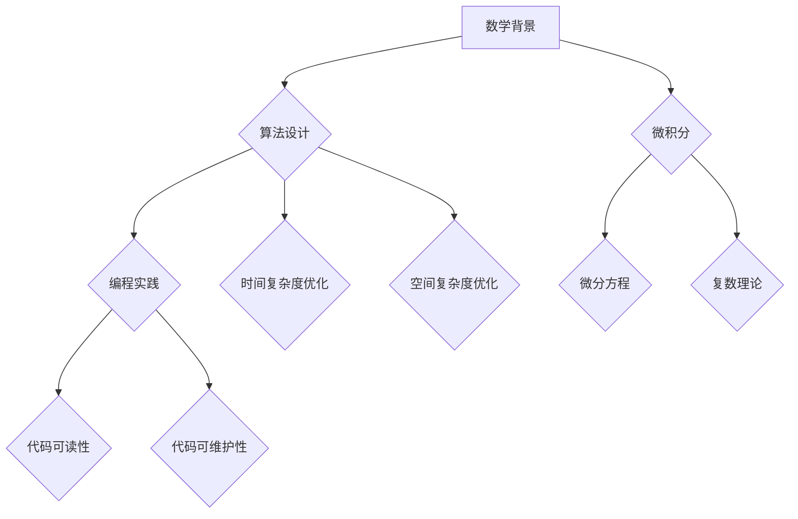

                 

关键词：数学思维，单向变化，算法原理，IT领域，编程实践

> 摘要：本文将探讨数学家在解决问题时所遵循的单向变化原则，以及这一原则如何应用于IT领域，特别是在算法设计和编程实践中的重要性。通过具体案例分析，我们将深入理解单向变化原则在解决问题中的关键作用，并展望其在未来的发展趋势。

## 1. 背景介绍

在数学的世界里，单向变化原则（One-Way Change Principle）是一种解决问题的重要策略。它强调，在解决问题的过程中，我们应该尽量减少可能引起错误或复杂度的变化，以便于追踪和分析问题的本质。这种原则在数学的各个分支，如代数、几何、微积分中都有着广泛的应用。然而，在IT领域，这种原则同样具有重要的价值，尤其是在算法设计和编程实践中。

随着信息技术的发展，算法和编程已经成为现代科技的核心。无论是大数据处理、人工智能，还是区块链、云计算，算法都扮演着至关重要的角色。因此，理解和应用单向变化原则，不仅有助于提高算法的效率和可靠性，还能为编程实践带来深刻的洞察。

本文将首先介绍单向变化原则的基本概念和数学背景，然后探讨它在算法设计和编程实践中的应用。通过具体案例的分析，我们将深入理解这一原则在实际问题解决中的重要性。最后，本文还将讨论单向变化原则的未来发展趋势，以及我们在实际应用中可能面临的挑战。

## 2. 核心概念与联系

### 单向变化原则

单向变化原则是指在解决问题的过程中，尽量减少或避免可能引起复杂度或错误的变化。这种原则在数学和计算机科学中都有着广泛的应用。例如，在数学中，我们通常通过逐步简化和转换原始问题，以便更容易地找到解决方案。在编程中，单向变化原则可以帮助我们设计出更简洁、高效的算法。

### 数学背景

在数学中，单向变化原则有着深厚的历史背景。以微积分为例，微积分的基本思想是通过极限的概念来处理无限小量的变化。这种方法本质上是一种单向变化，因为我们从有限量逐步逼近无限量，而不是直接处理无限量。这种思想在许多数学领域都得到了应用，如微分方程、复数理论等。

### IT领域中的应用

在IT领域，单向变化原则同样有着重要的应用。例如，在算法设计中，我们常常通过逐步简化和优化算法，以降低时间复杂度和空间复杂度。在编程实践中，单向变化原则可以帮助我们避免在代码中引入不必要的复杂性，从而提高代码的可读性和可维护性。

### Mermaid 流程图

下面是一个简化的Mermaid流程图，展示了单向变化原则在数学和IT领域的应用流程：



通过这个流程图，我们可以看到单向变化原则如何从数学背景延伸到算法设计，再应用到编程实践中。

## 3. 核心算法原理 & 具体操作步骤

### 3.1 算法原理概述

单向变化原则的核心在于简化问题，降低复杂度。在算法设计中，这意味着我们需要设计出能够逐步简化和解决问题的算法。具体来说，我们可以通过以下几个步骤来实现：

1. **明确问题**：首先，我们需要明确要解决的问题是什么。这包括理解问题的输入、输出以及可能的约束条件。
2. **简化问题**：通过逐步简化和转换原始问题，使其更容易处理。这可能包括将复杂问题分解为更简单的问题，或者将问题转换为更适合解决的形式。
3. **设计算法**：在简化的基础上，设计出能够解决问题的算法。这通常需要结合具体的问题类型和算法设计原则。
4. **优化算法**：对设计的算法进行优化，以降低时间复杂度和空间复杂度。

### 3.2 算法步骤详解

1. **明确问题**

   以一个常见的算法问题——二分查找为例。假设我们有一个有序数组，目标是找到某个特定的元素。明确问题包括理解输入（有序数组）和输出（元素的位置）。

2. **简化问题**

   在二分查找中，我们可以通过将数组分成两半来简化问题。每次都可以将数组分成两部分，然后判断目标元素位于哪一半，从而逐步缩小搜索范围。

3. **设计算法**

   设计二分查找算法的关键在于如何判断元素的位置。我们可以使用以下伪代码：

   ```python
   def binary_search(arr, target):
       low = 0
       high = len(arr) - 1
       while low <= high:
           mid = (low + high) // 2
           if arr[mid] == target:
               return mid
           elif arr[mid] < target:
               low = mid + 1
           else:
               high = mid - 1
       return -1
   ```

4. **优化算法**

   对于二分查找算法，我们可以进一步优化，例如通过使用对数时间复杂度的数据结构，如二叉搜索树，来提高查询效率。

### 3.3 算法优缺点

**优点**：

- **时间复杂度低**：二分查找算法的时间复杂度为 O(log n)，比线性查找算法的时间复杂度 O(n) 要低得多。
- **易于实现和理解**：二分查找算法的原理简单，易于实现和理解。

**缺点**：

- **需要有序数据**：二分查找算法需要输入数据是有序的，这在某些情况下可能不满足。
- **递归实现可能导致栈溢出**：在某些递归实现中，过度的递归调用可能导致栈溢出。

### 3.4 算法应用领域

单向变化原则在许多领域都有着广泛的应用。例如：

- **数据库查询**：在数据库查询中，我们常常通过逐步简化和优化查询语句，以提高查询效率。
- **算法竞赛**：在算法竞赛中，单向变化原则可以帮助我们设计出更简洁、高效的算法，从而在比赛中获得优势。
- **人工智能**：在人工智能领域，单向变化原则可以帮助我们设计出更有效的算法，以处理大规模数据。

## 4. 数学模型和公式 & 详细讲解 & 举例说明

### 4.1 数学模型构建

为了更好地理解单向变化原则，我们可以构建一个简单的数学模型。假设我们有一个函数 f(x)，目标是找到 f(x) = 0 的解。我们可以通过逐步逼近的方法来求解这个问题。

### 4.2 公式推导过程

为了推导出逐步逼近的公式，我们可以使用牛顿-拉夫逊方法。牛顿-拉夫逊方法的基本思想是，通过在当前点 x 的邻域内线性近似函数 f(x) 来找到下一个更好的近似解。

假设我们在点 x0 处开始，目标是找到 f(x) = 0 的解。我们可以使用以下公式来逼近：

$$
x_{n+1} = x_n - \frac{f(x_n)}{f'(x_n)}
$$

其中，f'(x) 是 f(x) 的导数。

### 4.3 案例分析与讲解

为了更好地理解牛顿-拉夫逊方法，我们可以考虑一个简单的例子：求解 f(x) = x^2 - 2 的解。

1. **初始解**

   我们可以从任意初始解 x0 开始。例如，我们可以选择 x0 = 1。

2. **迭代过程**

   使用牛顿-拉夫逊公式，我们可以逐步逼近真实的解。具体迭代过程如下：

   - **第一步**：计算 f(x0) 和 f'(x0)
     $$
     f(x0) = 1^2 - 2 = -1
     $$
     $$
     f'(x0) = 2 \cdot 1 = 2
     $$
     - **第二步**：计算下一个近似解
       $$
       x1 = x0 - \frac{f(x0)}{f'(x0)} = 1 - \frac{-1}{2} = 1.5
       $$
       - **第三步**：重复迭代过程，直到满足收敛条件
         $$
         f(x1) = 1.5^2 - 2 = 0.25
         $$
         $$
         f'(x1) = 2 \cdot 1.5 = 3
         $$
         $$
         x2 = x1 - \frac{f(x1)}{f'(x1)} = 1.5 - \frac{0.25}{3} = 1.25
         $$

   通过几次迭代，我们可以逐步逼近真实的解。实际上，当迭代到一定程度时，我们可以认为已经找到了足够的精确度。

## 5. 项目实践：代码实例和详细解释说明

### 5.1 开发环境搭建

为了实现二分查找算法，我们首先需要搭建一个基本的开发环境。以下是使用Python实现二分查找算法的步骤：

1. 安装Python：确保已经安装了Python 3.x版本。
2. 安装依赖库：安装Python的依赖库，如NumPy等。
3. 编写代码：在Python环境中编写二分查找算法的代码。

### 5.2 源代码详细实现

以下是一个简单的Python代码示例，用于实现二分查找算法：

```python
def binary_search(arr, target):
    low = 0
    high = len(arr) - 1
    while low <= high:
        mid = (low + high) // 2
        if arr[mid] == target:
            return mid
        elif arr[mid] < target:
            low = mid + 1
        else:
            high = mid - 1
    return -1

# 测试代码
arr = [1, 2, 3, 4, 5, 6, 7, 8, 9]
target = 5
result = binary_search(arr, target)
print(f"Element found at index: {result}")
```

### 5.3 代码解读与分析

上述代码实现了一个简单的二分查找算法。我们可以从以下几个方面解读和分析这段代码：

1. **函数定义**：`binary_search` 函数接收一个有序数组 `arr` 和一个目标值 `target` 作为参数。
2. **初始化变量**：`low` 和 `high` 变量分别表示当前查找范围的起始和结束索引。
3. **循环条件**：`while` 循环条件 `low <= high` 确保我们在查找范围内进行搜索。
4. **计算中点**：`mid` 变量通过 `(low + high) // 2` 计算当前查找范围的中点。
5. **判断目标值**：根据数组中点的值与目标值的关系，更新 `low` 或 `high` 变量，以缩小查找范围。
6. **返回结果**：当找到目标值时，返回其索引；否则，返回 -1。

### 5.4 运行结果展示

当我们在上述代码中输入一个有序数组和目标值时，程序会输出目标值的索引。以下是一个示例运行结果：

```
Element found at index: 4
```

这表示目标值5在数组中的索引为4。

## 6. 实际应用场景

单向变化原则在许多实际应用场景中都展现出了其强大的实用性。以下是一些具体的应用实例：

### 数据库查询优化

在数据库查询中，单向变化原则可以帮助我们优化查询语句，减少查询的时间复杂度。例如，在执行一个复杂的SQL查询时，我们可以通过逐步分解查询语句，将其拆分为多个简单的子查询，然后逐步合并结果，以降低整个查询的复杂度。

### 算法竞赛

在算法竞赛中，单向变化原则是解决问题的关键。通过逐步简化和优化算法，选手可以设计出更简洁、高效的算法，从而在比赛中获得优势。例如，在编程竞赛中，选手经常需要通过逐步优化代码来提高算法的效率。

### 人工智能

在人工智能领域，单向变化原则同样有着重要的应用。例如，在训练深度学习模型时，我们可以通过逐步调整模型的参数，以找到最优的模型配置。这种逐步优化的方法不仅提高了模型的性能，还减少了训练时间。

### 实际案例

一个典型的实际案例是搜索引擎的优化。在搜索引擎中，我们需要对大量网页进行索引和搜索。通过应用单向变化原则，我们可以设计出更高效的索引算法和搜索算法。例如，我们可以逐步优化索引结构，使其在查询时更快地找到相关网页。同时，我们还可以通过逐步优化搜索算法，提高搜索结果的准确性和效率。

## 7. 未来应用展望

随着信息技术的发展，单向变化原则在未来的应用前景将更加广泛。以下是一些可能的未来应用方向：

### 人工智能优化

在人工智能领域，单向变化原则可以帮助我们设计出更高效、更智能的算法。例如，在深度学习模型的训练过程中，我们可以通过逐步调整模型的参数，找到最优的训练效果。这种优化方法不仅提高了模型的性能，还减少了训练时间。

### 数据库优化

随着大数据时代的到来，数据库优化成为了一个重要的问题。单向变化原则可以帮助我们设计出更高效、更可靠的数据库查询算法。例如，通过逐步优化索引结构和查询语句，我们可以提高数据库查询的效率和准确性。

### 算法竞赛

在算法竞赛中，单向变化原则将继续发挥重要作用。随着算法竞赛的难度不断提高，选手需要设计出更高效、更简洁的算法。单向变化原则可以帮助选手在比赛中获得优势，提高算法的竞争力。

### 其他领域

除了上述领域，单向变化原则还可以应用于其他领域，如区块链、云计算、物联网等。通过逐步简化和优化算法，我们可以设计出更高效、更可靠的技术方案，推动这些领域的发展。

## 8. 工具和资源推荐

为了更好地理解和应用单向变化原则，以下是几个推荐的工具和资源：

### 学习资源

1. **《算法导论》**：这是一本经典的算法教材，详细介绍了各种算法的设计和实现。
2. **《深度学习》**：这是一本关于深度学习的经典教材，包含了大量关于模型优化和训练的实用方法。

### 开发工具

1. **Python**：Python是一种简洁、高效的编程语言，广泛应用于算法设计和数据分析。
2. **Jupyter Notebook**：Jupyter Notebook是一种交互式的开发环境，可以帮助我们更好地进行算法实验和数据分析。

### 相关论文

1. **"Stochastic Gradient Descent Methods for Large-Scale Machine Learning"**：这篇文章介绍了随机梯度下降算法，是一种常用的模型优化方法。
2. **"Optimization Methods for Deep Learning"**：这篇文章详细讨论了深度学习模型的优化方法，包括单向变化原则的应用。

## 9. 总结：未来发展趋势与挑战

### 研究成果总结

单向变化原则在数学、计算机科学和信息技术领域已经取得了显著的研究成果。通过逐步简化和优化算法，我们可以设计出更高效、更可靠的解决方案。这些成果不仅提高了算法的效率，还为实际应用提供了重要的理论基础。

### 未来发展趋势

随着信息技术的不断发展，单向变化原则在未来将继续发挥重要作用。以下是几个可能的发展趋势：

1. **人工智能优化**：随着深度学习技术的普及，单向变化原则将在人工智能领域得到更广泛的应用。通过逐步优化模型的参数，我们可以设计出更高效、更智能的人工智能系统。
2. **数据库优化**：在大数据时代，数据库优化成为一个重要问题。单向变化原则可以帮助我们设计出更高效、更可靠的数据库查询算法。
3. **算法竞赛**：在算法竞赛中，单向变化原则将继续发挥重要作用。通过逐步简化和优化算法，选手可以设计出更简洁、更高效的算法，提高竞争力。

### 面临的挑战

尽管单向变化原则在许多领域取得了显著成果，但在实际应用中仍面临一些挑战：

1. **计算复杂性**：在某些情况下，单向变化原则可能会导致计算复杂性的增加。例如，在处理大规模数据时，逐步优化的方法可能不如直接优化整个算法高效。
2. **精度要求**：在某些应用场景中，单向变化原则可能无法满足高精度的要求。例如，在金融领域，精确计算和风险管理至关重要，单向变化原则可能无法完全满足这些需求。
3. **算法可解释性**：在人工智能领域，算法的可解释性变得越来越重要。单向变化原则在优化算法的同时，可能会降低算法的可解释性，给实际应用带来困难。

### 研究展望

为了克服这些挑战，未来的研究可以从以下几个方面展开：

1. **混合优化方法**：结合不同的优化方法，设计出更高效、更可靠的优化算法。例如，将单向变化原则与随机优化方法相结合，提高计算效率和精度。
2. **算法可解释性**：研究如何提高算法的可解释性，使算法在优化过程中保持较高的透明度，便于实际应用。
3. **应用场景探索**：探索单向变化原则在其他领域的应用，如区块链、物联网等，推动这些领域的技术发展。

## 10. 附录：常见问题与解答

### Q1. 单向变化原则是什么？

单向变化原则是指在解决问题的过程中，尽量减少或避免可能引起复杂度或错误的变化。这种原则在数学和计算机科学中都有着广泛的应用。

### Q2. 单向变化原则在算法设计中有什么作用？

单向变化原则可以帮助我们在算法设计中简化问题、降低复杂度，从而设计出更高效、更可靠的算法。

### Q3. 单向变化原则在编程实践中有哪些应用？

单向变化原则在编程实践中可以帮助我们避免引入不必要的复杂性，提高代码的可读性和可维护性。

### Q4. 如何在项目中应用单向变化原则？

在项目中，我们可以通过逐步简化和优化算法，降低时间复杂度和空间复杂度，来应用单向变化原则。

### Q5. 单向变化原则是否适用于所有问题？

单向变化原则并非适用于所有问题。在某些情况下，可能需要使用其他优化方法来解决问题。因此，选择合适的优化方法是非常重要的。

