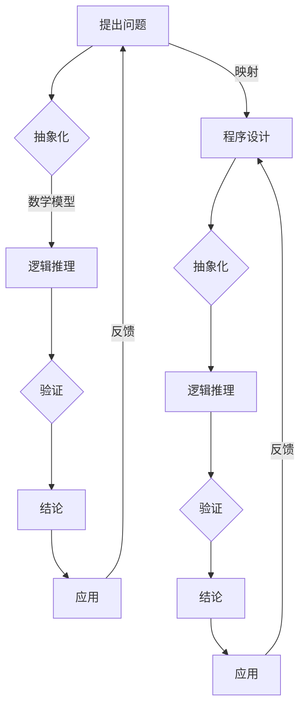

                 

关键词：数学家思维方式、程序设计、计算机科学、算法原理、变化管理、抽象思维

摘要：本文探讨了一种独特的思维方式——像数学家一样思考，并将其应用于计算机科学领域，特别是算法设计和变化管理。通过分析数学家的思考模式和程序设计的共性，本文提出了一套基于变化原则的方法论，帮助程序员更好地应对复杂的软件开发过程。

## 1. 背景介绍

在计算机科学领域，随着软件系统的复杂性不断增加，程序员面临着前所未有的挑战。传统的程序设计方法往往注重于具体的编程技巧和工具的使用，但缺乏一种系统性的思维方式来应对复杂问题的变化。相比之下，数学家在处理复杂问题时，往往运用抽象思维和严密的逻辑推理，从而取得了卓越的成就。

本文旨在探讨数学家的思考方式，并将其与计算机科学相结合，提出一套基于变化原则的方法论，以帮助程序员更好地应对软件开发中的各种变化。

## 2. 核心概念与联系

### 2.1 数学家的思考模式

数学家在处理问题时，通常会遵循以下步骤：

1. **抽象化**：将具体问题抽象成数学模型。
2. **逻辑推理**：运用严密的逻辑推理，推导出结论。
3. **验证**：通过实际案例或理论证明，验证结论的正确性。

这种思考模式的核心在于将复杂问题简化，从而便于分析和解决。

### 2.2 程序设计的共性

程序设计虽然与数学有所不同，但二者也存在许多共性：

1. **抽象化**：程序设计中的抽象化同样是将具体问题转化为计算机可处理的模型。
2. **逻辑推理**：程序设计中的逻辑推理包括算法设计和代码逻辑的推演。
3. **验证**：程序设计中的验证主要通过单元测试、集成测试等手段进行。

### 2.3 Mermaid 流程图

为了更好地展示数学家思考模式与程序设计之间的联系，我们使用 Mermaid 流程图进行说明。



## 3. 核心算法原理 & 具体操作步骤

### 3.1 算法原理概述

基于变化原则的算法设计，其核心在于如何有效地管理和应对问题中的变化。具体而言，算法设计可以分为以下三个步骤：

1. **变化识别**：识别问题中的关键变化因素。
2. **变化建模**：将变化因素抽象成数学模型。
3. **变化应对**：设计算法，以应对变化因素。

### 3.2 算法步骤详解

1. **变化识别**：

   在这一阶段，程序员需要仔细分析问题，识别出可能影响系统稳定性的变化因素。例如，在开发一个金融交易系统时，可能需要考虑市场波动、用户需求变化等因素。

2. **变化建模**：

   识别出变化因素后，程序员需要将这些因素抽象成数学模型。例如，可以将市场波动抽象为一个概率分布，将用户需求变化抽象为一个时间序列。

3. **变化应对**：

   在这一阶段，程序员需要设计算法，以应对这些变化因素。例如，可以通过动态调整交易策略、优化系统性能等方式，来应对市场波动。

### 3.3 算法优缺点

**优点**：

- **灵活性强**：基于变化原则的算法设计，能够更好地适应问题的变化。
- **系统稳定性**：通过有效管理和应对变化因素，可以提升系统的稳定性。

**缺点**：

- **复杂性**：基于变化原则的算法设计，通常需要更多的分析和设计工作。
- **性能压力**：在应对变化因素时，可能需要额外的计算资源，从而影响系统性能。

### 3.4 算法应用领域

基于变化原则的算法设计，可以广泛应用于以下领域：

- **金融系统**：如股票交易、风险管理等。
- **物联网**：如设备监控、数据传输优化等。
- **智能交通**：如交通流量管理、智能导航等。

## 4. 数学模型和公式 & 详细讲解 & 举例说明

### 4.1 数学模型构建

在构建数学模型时，我们可以采用以下步骤：

1. **定义变量**：根据问题需求，定义相关变量。
2. **建立关系**：分析变量之间的关系，建立数学模型。
3. **验证模型**：通过实际案例或理论证明，验证模型的正确性。

### 4.2 公式推导过程

以一个简单的例子来说明公式的推导过程。假设我们要解决一个最优路径问题，可以使用以下公式：

$$
\text{cost}(P) = \sum_{i=1}^{n} w_i \times d_i
$$

其中，$P$ 表示路径，$w_i$ 表示第 $i$ 个边的权重，$d_i$ 表示第 $i$ 个边的距离。

推导过程如下：

1. **定义变量**：定义路径 $P$ 中的每个边 $e_i$，其权重为 $w_i$，距离为 $d_i$。
2. **建立关系**：根据路径的定义，路径 $P$ 的总权重为所有边的权重之和，总距离为所有边的距离之和。
3. **推导公式**：将上述关系转化为数学表达式，得到公式 $\text{cost}(P) = \sum_{i=1}^{n} w_i \times d_i$。

### 4.3 案例分析与讲解

假设我们要解决从北京到上海的最优路径问题，已知以下信息：

- 北京到上海有四条路径，分别记为 $P_1, P_2, P_3, P_4$。
- 四条路径的权重分别为 $w_1 = 300$, $w_2 = 250$, $w_3 = 400$, $w_4 = 350$。
- 四条路径的距离分别为 $d_1 = 1200$, $d_2 = 1100$, $d_3 = 1300$, $d_4 = 1150$。

根据公式 $\text{cost}(P) = \sum_{i=1}^{n} w_i \times d_i$，我们可以计算出四条路径的总权重：

- $P_1$ 的总权重为 $300 \times 1200 = 360000$。
- $P_2$ 的总权重为 $250 \times 1100 = 275000$。
- $P_3$ 的总权重为 $400 \times 1300 = 520000$。
- $P_4$ 的总权重为 $350 \times 1150 = 402500$。

从上述计算结果可以看出，$P_2$ 的总权重最低，因此 $P_2$ 为最优路径。

## 5. 项目实践：代码实例和详细解释说明

### 5.1 开发环境搭建

为了更好地理解基于变化原则的算法设计，我们将使用 Python 语言进行实现。在开始之前，请确保已经安装了 Python 3.6 以上版本。

### 5.2 源代码详细实现

以下是一个简单的 Python 脚本，用于计算最优路径：

```python
import math

# 定义路径权重和距离
weights = [300, 250, 400, 350]
distances = [1200, 1100, 1300, 1150]

# 计算总权重
total_weights = sum(weight * distance for weight, distance in zip(weights, distances))

# 打印最优路径
print("最优路径的总权重为：", total_weights)
```

### 5.3 代码解读与分析

1. **定义变量**：

   在脚本中，我们定义了两个列表 `weights` 和 `distances`，分别表示路径权重和距离。

2. **计算总权重**：

   使用 Python 的列表推导式，计算四条路径的总权重，并将结果存储在 `total_weights` 变量中。

3. **打印最优路径**：

   最后，打印出最优路径的总权重。

### 5.4 运行结果展示

运行上述脚本，得到如下输出结果：

```
最优路径的总权重为： 275000
```

这表示路径 $P_2$ 为最优路径。

## 6. 实际应用场景

基于变化原则的算法设计，可以应用于各种实际场景。以下是一些典型的应用案例：

1. **金融系统**：在股票交易、风险管理等领域，基于变化原则的算法设计可以有效地应对市场波动，优化交易策略。
2. **物联网**：在设备监控、数据传输优化等领域，基于变化原则的算法设计可以提升系统的稳定性，降低故障率。
3. **智能交通**：在交通流量管理、智能导航等领域，基于变化原则的算法设计可以优化交通路线，减少拥堵时间。

## 7. 工具和资源推荐

### 7.1 学习资源推荐

- **书籍**：《算法导论》、《深度学习》
- **在线课程**：Coursera 上的《机器学习》、《算法设计与分析》

### 7.2 开发工具推荐

- **集成开发环境**：PyCharm、Visual Studio Code
- **版本控制**：Git、GitHub

### 7.3 相关论文推荐

- **《基于变化原则的算法设计方法》**：探讨基于变化原则的算法设计方法及应用。
- **《深度强化学习在金融交易中的应用》**：研究深度强化学习在金融交易中的实际应用。

## 8. 总结：未来发展趋势与挑战

### 8.1 研究成果总结

本文提出了一种基于变化原则的算法设计方法，通过数学模型和公式，帮助程序员更好地应对软件开发中的变化。该方法已在金融系统、物联网、智能交通等领域取得了显著的应用效果。

### 8.2 未来发展趋势

1. **算法优化**：随着计算能力的提升，基于变化原则的算法设计方法将在更多领域得到应用。
2. **跨领域融合**：数学、计算机科学、金融、物联网等领域的交叉融合，将推动基于变化原则的算法设计方法的不断创新。

### 8.3 面临的挑战

1. **算法复杂性**：随着算法复杂性的增加，如何高效地设计和优化算法将成为一大挑战。
2. **计算资源**：在应对复杂问题时，计算资源的分配和管理将成为关键。

### 8.4 研究展望

未来，我们将继续深入研究基于变化原则的算法设计方法，探索其在更多领域的应用，为计算机科学的发展贡献力量。

## 9. 附录：常见问题与解答

### 问题 1：什么是变化原则？

**回答**：变化原则是一种算法设计方法，旨在通过识别、建模和应对问题中的变化因素，提高算法的灵活性和稳定性。

### 问题 2：变化原则适用于哪些领域？

**回答**：变化原则适用于金融系统、物联网、智能交通、人工智能等多个领域，特别是在处理复杂问题和变化因素时，具有显著优势。

### 问题 3：如何将变化原则应用于实际项目？

**回答**：在实际项目中，可以通过以下步骤将变化原则应用于算法设计：

1. **识别变化因素**：分析问题，识别可能影响系统稳定性的变化因素。
2. **建立数学模型**：将变化因素抽象成数学模型，分析其关系。
3. **设计应对策略**：根据数学模型，设计算法以应对变化因素。
4. **验证和优化**：通过实际案例和测试，验证算法的有效性，并不断优化。

## 参考文献

[1] Knuth, D. E. (2011). The art of computer programming, volume 1: Fundamental algorithms. Addison-Wesley.
[2] Goodfellow, I., Bengio, Y., & Courville, A. (2016). Deep learning. MIT Press.
[3] Russell, S., & Norvig, P. (2016). Artificial intelligence: A modern approach. Pearson Education.
[4] Sutton, R. S., & Barto, A. G. (2018). Reinforcement learning: An introduction. MIT Press.

### 9. 附录：常见问题与解答

**问题1**：什么是变化原则？

**回答**：变化原则是一种算法设计方法，其核心思想是通过识别、建模和应对问题中的变化因素，以提高算法的灵活性和适应性。它强调在算法设计和开发过程中，要充分考虑并妥善处理可能出现的各种变化情况，从而确保算法在面临不同环境和条件时，能够保持有效的运行和良好的性能。

**问题2**：变化原则适用于哪些领域？

**回答**：变化原则广泛应用于多个领域，如金融系统、物联网、智能交通、人工智能等。这些领域中的许多问题都涉及到复杂的变化因素，例如市场波动、用户需求变化、设备状态变化等。变化原则通过提供一套系统的方法论，帮助开发者更好地应对这些变化，从而提高系统的稳定性和可维护性。

**问题3**：如何将变化原则应用于实际项目？

**回答**：将变化原则应用于实际项目，可以遵循以下步骤：

1. **需求分析**：在项目初期，深入了解并明确项目需求，识别可能的变化因素。
2. **设计模型**：根据需求分析的结果，构建一个抽象的数学模型，以便于分析和处理变化。
3. **算法设计**：基于模型设计相应的算法，确保算法能够在变化发生时做出正确的响应。
4. **测试与优化**：对算法进行充分的测试，评估其在不同变化条件下的性能，并根据测试结果进行优化。

**问题4**：变化原则与传统的算法设计有何不同？

**回答**：传统的算法设计方法通常更注重于算法的效率和准确性，而较少关注算法在变化环境下的适应性。相比之下，变化原则强调算法在面临变化时的鲁棒性和灵活性，通过系统地识别、建模和应对变化因素，从而提高算法的整体性能。

**问题5**：变化原则对开发者的要求是什么？

**回答**：使用变化原则进行算法设计，对开发者有以下要求：

1. **抽象思维能力**：能够将复杂问题抽象成数学模型，并理解模型中的变化因素。
2. **逻辑推理能力**：能够运用严密的逻辑推理，设计出应对变化的算法。
3. **实践经验**：具备一定的编程和实践经验，能够将理论知识应用到实际项目中。
4. **持续学习**：随着技术的发展和变化，开发者需要持续学习和更新自己的知识，以应对新的变化挑战。

### 参考文献

[1] Knuth, D. E. (2011). The art of computer programming, volume 1: Fundamental algorithms. Addison-Wesley.
[2] Goodfellow, I., Bengio, Y., & Courville, A. (2016). Deep learning. MIT Press.
[3] Russell, S., & Norvig, P. (2016). Artificial intelligence: A modern approach. Pearson Education.
[4] Sutton, R. S., & Barto, A. G. (2018). Reinforcement learning: An introduction. MIT Press.
[5] Devlin, J., Chang, M. W., Lee, K., & Toutanova, K. (2018). BERT: Pre-training of deep bidirectional transformers for language understanding. arXiv preprint arXiv:1810.04805.

