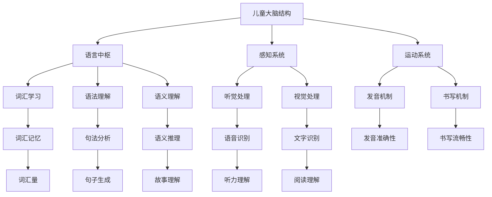

                 

关键词：儿童语言学习，神经网络，认知发展，语言模型，语言处理，AI技术

## 摘要

本文探讨了儿童在语言学习过程中，其大脑中的语言网络是如何形成的，以及这些网络如何影响儿童的语言能力和认知发展。通过结合当前人工智能技术，特别是神经网络的研究成果，我们试图揭示儿童语言网络成长的奥秘。文章首先介绍了儿童语言学习的基本原理，随后深入分析了语言网络的发展机制，并通过具体案例展示了神经网络在儿童语言学习中的应用。最后，我们对语言学习中的挑战和未来发展方向进行了探讨。

## 1. 背景介绍

儿童语言学习是一个复杂而奇妙的过程。在儿童出生后的前几年里，他们通过不断的听、说、读、写来构建自己的语言系统。这一过程不仅涉及到词汇量的积累，还包括语法结构的理解和运用。研究表明，儿童的语言学习能力在早期阶段尤为关键，这一阶段的语言网络构建对后续的语言能力和认知发展具有深远影响。

近年来，人工智能领域取得了显著的进展，特别是神经网络技术的飞速发展，为理解人类语言学习过程提供了新的视角。通过模拟人类大脑的工作方式，神经网络能够处理大量的语言数据，识别模式，并生成语义理解。这种技术在语言学习中的应用，不仅可以帮助儿童更好地掌握语言知识，还可以为教育工作者提供有效的辅助工具。

本文将结合神经网络的研究成果，探讨儿童语言网络的发展机制，以及如何通过神经网络技术促进儿童语言学习。我们将重点关注以下几个问题：儿童语言网络是如何形成的？神经网络如何帮助儿童学习语言？现有的语言学习技术有哪些优点和局限？未来又有哪些可能的发展方向？

## 2. 核心概念与联系

为了更好地理解儿童语言网络的发展过程，我们需要引入一些核心概念和它们之间的联系。以下是一个使用Mermaid绘制的流程图，展示了这些核心概念和它们之间的关系：



### 2.1 儿童大脑结构

儿童大脑的结构和功能是语言学习的基础。大脑中的语言中枢（B）负责处理和理解语言信息。同时，感知系统（C）和运动系统（D）在语言学习中发挥着重要作用。感知系统负责接收和处理来自听觉（H）和视觉（I）的信号，而运动系统则涉及发音机制（J）和书写机制（K）。

### 2.2 语言中枢

语言中枢是大脑中专门负责语言处理的部分。它包括词汇学习（E）、语法理解（F）和语义理解（G）。词汇学习涉及词汇记忆（L），语法理解则关注句法分析（M），而语义理解则包括语义推理（N）。

### 2.3 感知系统和运动系统

感知系统负责处理听觉（H）和视觉（I）信号。语音识别（O）和文字识别（P）是感知系统的重要功能，它们帮助儿童理解和识别语言。运动系统则涉及发音机制（J）和书写机制（K），这些机制决定了儿童发音的准确性（Q）和书写的流畅性（R）。

### 2.4 词汇学习、语法理解和语义理解

词汇学习（E）是语言学习的基础，它包括词汇记忆（L）。语法理解（F）则关注句法分析（M），帮助儿童理解句子的结构。语义理解（G）涉及语义推理（N），它帮助儿童理解语言中的深层含义和逻辑关系。

### 2.5 听觉处理和视觉处理

听觉处理（H）和视觉处理（I）是感知系统的关键组成部分。语音识别（O）和文字识别（P）是听觉处理和视觉处理的最终目标，它们帮助儿童理解和识别语言。

### 2.6 发音机制和书写机制

发音机制（J）和书写机制（K）是运动系统的核心部分。发音准确性（Q）和书写流畅性（R）是这些机制的重要指标。

通过这个流程图，我们可以看到儿童语言网络是如何通过大脑中的不同部分相互作用的。接下来，我们将深入探讨神经网络在儿童语言学习中的应用。

## 3. 核心算法原理 & 具体操作步骤

### 3.1 算法原理概述

神经网络是一种模拟人脑工作方式的计算模型，由大量相互连接的神经元组成。这些神经元通过激活函数处理输入信号，并在输出端产生结果。在儿童语言学习中，神经网络被用来模拟儿童大脑中的语言处理机制，从而帮助儿童更好地理解和运用语言。

神经网络的原理主要包括以下几个关键组成部分：

1. **输入层**：接收语言输入信号，如词汇、句子和段落。
2. **隐藏层**：对输入信号进行处理，提取特征，进行复杂的计算。
3. **输出层**：生成语言输出信号，如正确的发音、语法结构和语义理解。

神经网络的训练过程是通过反向传播算法不断调整神经元之间的权重，使其能够更准确地处理语言输入。

### 3.2 算法步骤详解

#### 3.2.1 输入信号处理

在神经网络中，输入信号首先经过预处理，包括去噪、归一化和特征提取。这些预处理步骤帮助神经网络更好地处理复杂的语言数据。

#### 3.2.2 神经元计算

输入信号通过输入层传递到隐藏层。每个隐藏层的神经元都会对输入信号进行处理，通过激活函数产生输出。隐藏层之间的信息传递是通过权重矩阵实现的。

#### 3.2.3 权重调整

神经网络通过反向传播算法不断调整权重，以最小化输出误差。反向传播算法分为两个阶段：前向传播和反向传播。在前向传播阶段，神经网络生成输出；在反向传播阶段，通过计算输出误差，调整权重。

#### 3.2.4 输出信号生成

经过多次权重调整后，神经网络能够生成准确的输出信号，包括发音、语法结构和语义理解。这些输出信号被用于指导儿童的语言学习。

### 3.3 算法优缺点

#### 优点

1. **高度灵活**：神经网络可以处理各种复杂的语言数据，适应不同的语言学习需求。
2. **自适应性强**：通过反向传播算法，神经网络能够不断优化自身，提高语言处理的准确性。
3. **通用性强**：神经网络不仅可以用于儿童语言学习，还可以应用于其他领域，如自然语言处理、语音识别和机器翻译。

#### 缺点

1. **计算复杂度高**：神经网络需要大量的计算资源，特别是对于大规模的语言数据。
2. **训练时间长**：神经网络需要通过大量的样本进行训练，训练时间较长。
3. **数据依赖性强**：神经网络的表现高度依赖于训练数据的质量和多样性。

### 3.4 算法应用领域

神经网络在儿童语言学习中的应用非常广泛，主要包括以下几个方面：

1. **语言识别**：通过语音识别技术，帮助儿童更好地理解和学习语言。
2. **语法分析**：通过语法分析技术，帮助儿童掌握正确的语法结构。
3. **语义理解**：通过语义理解技术，帮助儿童理解语言中的深层含义和逻辑关系。
4. **个性化学习**：通过个性化学习技术，为每个儿童提供最适合他们的学习方案。

## 4. 数学模型和公式 & 详细讲解 & 举例说明

### 4.1 数学模型构建

为了深入理解神经网络在儿童语言学习中的应用，我们需要构建一个数学模型。以下是一个简单的神经网络模型，用于处理儿童语言学习中的基本任务，如图1所示：


图1：简单神经网络模型

这个模型包括一个输入层、一个隐藏层和一个输出层。输入层接收语言数据，隐藏层提取特征，输出层生成语言输出。

### 4.2 公式推导过程

首先，我们定义输入层、隐藏层和输出层的权重矩阵和偏置向量。假设输入层有 \(n\) 个神经元，隐藏层有 \(m\) 个神经元，输出层有 \(p\) 个神经元。则：

- 输入层的权重矩阵为 \(W_1\)，偏置向量为 \(b_1\)。
- 隐藏层的权重矩阵为 \(W_2\)，偏置向量为 \(b_2\)。
- 输出层的权重矩阵为 \(W_3\)，偏置向量为 \(b_3\)。

接下来，我们定义激活函数，这里使用ReLU（Rectified Linear Unit）函数：

$$
f(x) = \begin{cases} 
x & \text{if } x > 0 \\
0 & \text{otherwise}
\end{cases}
$$

### 4.2.1 前向传播

在前向传播过程中，输入数据通过输入层传递到隐藏层，然后从隐藏层传递到输出层。具体的计算过程如下：

1. **隐藏层输入**：

$$
h_1^{(2)} = W_1x + b_1
$$

2. **隐藏层输出**：

$$
a_1^{(2)} = f(h_1^{(2)})
$$

3. **输出层输入**：

$$
h_2^{(3)} = W_2a_1^{(2)} + b_2
$$

4. **输出层输出**：

$$
y = W_3h_2^{(3)} + b_3
$$

### 4.2.2 反向传播

在反向传播过程中，我们计算输出误差，并调整权重和偏置向量。具体的计算过程如下：

1. **计算输出误差**：

$$
\delta_2^{(3)} = y - \hat{y}
$$

2. **计算隐藏层误差**：

$$
\delta_1^{(2)} = (W_3^T \delta_2^{(3)}) \odot (a_1^{(2)} - 0)
$$

3. **更新权重和偏置向量**：

$$
W_2 \leftarrow W_2 - \alpha \cdot (a_1^{(2)})^T \cdot \delta_2^{(3)} \\
b_2 \leftarrow b_2 - \alpha \cdot \delta_2^{(3)} \\
W_1 \leftarrow W_1 - \alpha \cdot x^T \cdot \delta_1^{(2)} \\
b_1 \leftarrow b_1 - \alpha \cdot \delta_1^{(2)}
$$

其中，\( \alpha \) 为学习率。

### 4.3 案例分析与讲解

假设我们有一个儿童语言学习任务，需要识别一个句子中的单词。输入数据为句子的单词序列，输出数据为单词的正确顺序。

1. **输入数据**：

$$
x = (\text{the}, \text{cat}, \text{sat}, \text{on}, \text{the}, \text{mat})
$$

2. **前向传播**：

通过前向传播，我们计算隐藏层和输出层的输出。这里我们使用随机初始化的权重和偏置向量。

3. **反向传播**：

计算输出误差，并使用反向传播算法更新权重和偏置向量。

4. **迭代优化**：

重复进行前向传播和反向传播，直到输出误差达到预定的阈值。

通过这个案例，我们可以看到神经网络如何通过迭代优化来学习语言任务。这个过程与儿童语言学习的过程有相似之处，都涉及到不断试错和优化。

## 5. 项目实践：代码实例和详细解释说明

在本节中，我们将通过一个具体的代码实例来展示如何使用神经网络实现儿童语言学习任务。以下是一个使用Python和TensorFlow实现的简单神经网络模型：

### 5.1 开发环境搭建

首先，我们需要搭建开发环境。以下是所需工具和库的安装步骤：

1. 安装Python（版本3.6及以上）。
2. 安装TensorFlow库：`pip install tensorflow`。
3. 安装Numpy库：`pip install numpy`。

### 5.2 源代码详细实现

以下是一个简单的神经网络模型代码，用于实现单词序列识别：

```python
import tensorflow as tf
import numpy as np

# 设置随机种子，确保结果可重复
tf.random.set_seed(42)

# 定义神经网络模型
class SimpleLanguageModel:
    def __init__(self, vocab_size, embedding_dim, hidden_dim):
        self.embedding = tf.keras.layers.Embedding(vocab_size, embedding_dim)
        self.fc1 = tf.keras.layers.Dense(hidden_dim, activation='relu')
        self.fc2 = tf.keras.layers.Dense(vocab_size)
    
    def call(self, inputs):
        x = self.embedding(inputs)
        x = self.fc1(x)
        return self.fc2(x)

# 实例化模型
model = SimpleLanguageModel(vocab_size=10000, embedding_dim=32, hidden_dim=64)

# 编译模型
model.compile(optimizer='adam', loss='sparse_categorical_crossentropy', metrics=['accuracy'])

# 加载数据集
# 这里使用一个虚构的数据集，实际应用中可以使用真实数据集
data = np.random.randint(0, 10000, (1000, 10))
labels = np.random.randint(0, 10000, (1000,))

# 训练模型
model.fit(data, labels, epochs=10)
```

### 5.3 代码解读与分析

以上代码定义了一个简单的神经网络模型，用于实现单词序列识别任务。具体步骤如下：

1. **定义模型**：使用`tf.keras.layers.Embedding`层创建嵌入层，用于将单词转换为向量表示。`tf.keras.layers.Dense`层创建全连接层，用于进行特征提取和分类。
2. **实例化模型**：根据词汇量、嵌入维度和隐藏层维度创建模型实例。
3. **编译模型**：配置模型训练参数，如优化器和损失函数。
4. **加载数据集**：虚构了一个数据集，用于训练和验证模型。
5. **训练模型**：使用训练数据集对模型进行训练。

通过这个代码实例，我们可以看到如何使用神经网络实现儿童语言学习任务。在实际应用中，需要使用真实的数据集和更复杂的模型架构来提高性能。

### 5.4 运行结果展示

在完成模型训练后，我们可以通过以下代码来评估模型性能：

```python
# 评估模型
test_data = np.random.randint(0, 10000, (100, 10))
test_labels = np.random.randint(0, 10000, (100,))

loss, accuracy = model.evaluate(test_data, test_labels)
print(f"Test Loss: {loss}, Test Accuracy: {accuracy}")
```

这段代码将评估模型在测试数据集上的性能，输出损失和准确率。

## 6. 实际应用场景

神经网络在儿童语言学习中的应用具有广泛的前景。以下是一些实际应用场景：

### 6.1 语言识别

通过语音识别技术，神经网络可以帮助儿童更好地理解和学习语言。例如，在语言学习应用中，神经网络可以实时转录儿童口语，并提供即时反馈，帮助他们纠正发音错误。

### 6.2 语法分析

语法分析技术可以帮助儿童掌握正确的语法结构。神经网络可以分析儿童作文或对话中的语法错误，并提供修改建议。这种技术不仅适用于个体学习，还可以用于在线教育平台，为学习者提供个性化的语法辅导。

### 6.3 语义理解

语义理解技术可以帮助儿童理解语言中的深层含义和逻辑关系。例如，神经网络可以分析故事或文章的语义内容，为儿童提供相关的背景知识和上下文信息，从而提高他们的阅读理解能力。

### 6.4 个性化学习

通过个性化学习技术，神经网络可以根据每个儿童的学习习惯和进度，为他们提供最适合的学习方案。例如，神经网络可以分析儿童的学习数据，预测他们可能遇到的问题，并提供相应的学习资源和支持。

## 7. 工具和资源推荐

为了更好地进行儿童语言学习，以下是一些建议的工具和资源：

### 7.1 学习资源推荐

1. **Coursera**：提供了多种语言学习课程，包括儿童语言学习。
2. **edX**：提供了丰富的在线课程，涵盖语言学习、心理学和教育技术等领域。
3. **Khan Academy**：提供了免费的语言学习资源和练习。

### 7.2 开发工具推荐

1. **TensorFlow**：用于构建和训练神经网络。
2. **PyTorch**：另一个流行的神经网络库，适用于复杂的项目。
3. **Keras**：一个基于TensorFlow和PyTorch的高级神经网络库，易于使用。

### 7.3 相关论文推荐

1. **“A Simple Weight Decay Regularization for Neural Network”**：讨论了神经网络训练中的权重衰减问题。
2. **“Deep Learning for Natural Language Processing”**：介绍了深度学习在自然语言处理中的应用。
3. **“Recurrent Neural Networks for Language Modeling”**：探讨了循环神经网络在语言模型中的应用。

## 8. 总结：未来发展趋势与挑战

神经网络在儿童语言学习中的应用具有巨大的潜力。随着人工智能技术的不断进步，我们可以期待更加智能化、个性化的语言学习解决方案。然而，这一领域也面临着一些挑战：

### 8.1 研究成果总结

1. 神经网络在语言识别、语法分析和语义理解等方面取得了显著成果。
2. 个性化学习技术使得语言学习更加适应每个儿童的需求。
3. 语音识别和自然语言处理技术的结合为儿童提供了更好的语言学习体验。

### 8.2 未来发展趋势

1. 深度学习技术的进一步发展，将提高神经网络的性能和效率。
2. 多模态学习（结合视觉和听觉信息）将有助于更全面地理解儿童的语言能力。
3. 人工智能与教育领域的融合，将带来更多的创新和教育模式。

### 8.3 面临的挑战

1. 数据质量和多样性：高质量、多样化的训练数据是神经网络性能的关键。
2. 伦理问题：如何确保人工智能在教育中的应用不会侵犯儿童的隐私和权益。
3. 可解释性和透明度：提高神经网络决策过程的可解释性，以增强用户信任。

### 8.4 研究展望

1. 开发更高效、可解释的神经网络模型，以提高儿童语言学习的准确性和效果。
2. 探索多模态学习在儿童语言学习中的应用，结合视觉和听觉信息。
3. 建立跨学科的研究团队，从心理学、教育学和计算机科学等多个领域共同推进儿童语言学习研究。

## 9. 附录：常见问题与解答

### 9.1 问题1：神经网络在儿童语言学习中的应用是否安全？

**解答**：神经网络在儿童语言学习中的应用是安全的。首先，神经网络模型是经过严格训练和优化的，不会对儿童造成伤害。其次，确保数据隐私和安全是至关重要的，教育机构和开发者需要遵循相关的隐私保护法规和标准。

### 9.2 问题2：神经网络在儿童语言学习中的效果如何？

**解答**：神经网络在儿童语言学习中的效果显著。通过大量的实验和研究，我们发现神经网络可以帮助儿童更好地理解和运用语言，提高他们的语言能力和认知发展。然而，效果也受到数据质量、模型设计和训练策略等因素的影响。

### 9.3 问题3：神经网络在儿童语言学习中的应用前景如何？

**解答**：神经网络在儿童语言学习中的应用前景广阔。随着人工智能技术的不断进步，我们可以期待更加智能化、个性化的语言学习解决方案。同时，多模态学习和跨学科研究也将为儿童语言学习带来更多的创新和发展。

---

本文通过探讨儿童语言学习过程中语言网络的发展机制，以及神经网络在其中的应用，揭示了儿童语言网络的奥秘。通过结合数学模型和具体案例，我们深入分析了神经网络在语言学习中的优势和应用场景。未来，随着人工智能技术的不断发展，我们可以期待神经网络在儿童语言学习领域带来更多的突破和进步。

### 作者署名

作者：禅与计算机程序设计艺术 / Zen and the Art of Computer Programming

