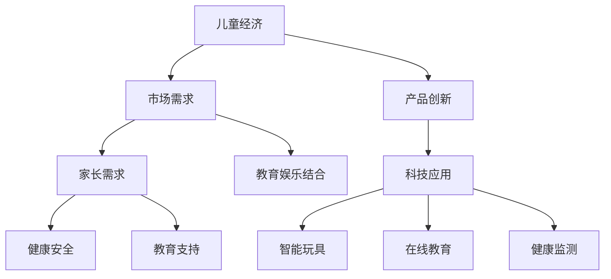

                 

关键词：儿童经济、创业、市场、商机、创新、教育、娱乐、技术

> 摘要：本文将探讨儿童市场的无限潜力，分析当前儿童经济中的创业机会，以及如何通过创新和科技手段为这一独特市场带来新的活力。我们将深入探讨儿童经济的重要性和趋势，提供实用的创业建议，并展望未来儿童市场的应用前景。

## 1. 背景介绍

儿童市场，作为一个充满活力和潜力的领域，正日益受到商业和社会的关注。随着家庭可支配收入的增加和父母对儿童教育的重视，儿童产品和服务市场的需求不断扩大。从儿童玩具到教育软件，从健康食品到娱乐活动，儿童市场的多元化特性为创业者提供了广阔的舞台。

### 1.1 儿童市场的重要性

儿童市场不仅是家庭消费的重要部分，也是国家经济的重要支柱。全球儿童市场规模庞大，据估计，每年全球儿童市场的消费总额已经超过了万亿美元。此外，随着数字化和科技的发展，儿童市场正呈现出新的增长动力。

### 1.2 儿童市场的趋势

近年来，儿童市场的趋势发生了显著变化。首先，个性化消费成为主流。父母越来越倾向于为孩子购买定制化的产品和服务。其次，健康和安全成为家长购买决策的重要考虑因素。最后，教育和娱乐的结合成为了新的消费热点。

### 1.3 儿童市场的发展机遇

儿童市场的发展机遇在于其巨大的消费潜力。随着中产阶级的崛起和父母消费观念的转变，儿童市场正在不断壮大。此外，互联网和科技的快速发展也为儿童市场带来了新的商业机会。

## 2. 核心概念与联系

### 2.1 儿童经济

儿童经济是指专门为儿童提供的产品和服务市场。它涵盖了从日常消费品到教育、娱乐、健康等多个领域。儿童经济的核心在于满足儿童及其家庭的需求，同时创造商业价值。

### 2.2 创业与儿童市场

在儿童市场中创业，需要了解儿童市场的特点和需求。创业者应注重创新，提供独特的产品和服务，以满足儿童的个性化需求。同时，创业者还需要关注家长的需求，如教育、健康和安全等。

### 2.3 科技在儿童市场中的应用

科技在儿童市场中的应用日益广泛，为创业者提供了新的机会。例如，智能玩具、在线教育平台、儿童健康监测设备等，都是科技在儿童市场中的重要应用。

下面是一个使用Mermaid绘制的流程图，展示了儿童经济创业的核心概念和联系：



## 3. 核心算法原理 & 具体操作步骤

### 3.1 算法原理概述

在儿童市场创业，核心算法原理可以概括为以下几方面：

- **用户画像分析**：通过大数据分析，了解儿童及其家庭的需求和偏好。
- **个性化推荐**：基于用户画像，为儿童和家长推荐合适的产品和服务。
- **市场细分**：将市场划分为不同的细分领域，针对不同细分市场制定相应的营销策略。

### 3.2 算法步骤详解

#### 步骤一：用户画像分析

1. 收集用户数据：包括年龄、性别、家庭收入、消费习惯等。
2. 数据清洗：去除无效数据和噪声。
3. 特征提取：从原始数据中提取有用的特征，如消费频率、购买品类等。
4. 画像构建：将提取的特征整合，构建用户画像。

#### 步骤二：个性化推荐

1. 模型训练：使用机器学习算法，如协同过滤、决策树等，训练推荐模型。
2. 预测：基于用户画像和模型预测，推荐合适的产品和服务。
3. 反馈调整：根据用户反馈调整推荐策略。

#### 步骤三：市场细分

1. 数据分析：分析市场数据，识别不同细分市场的特征。
2. 分区策略：根据细分市场的特征，制定相应的分区策略。
3. 营销实施：针对不同细分市场，实施个性化的营销策略。

### 3.3 算法优缺点

**优点**：

- 提高用户满意度：通过个性化推荐，满足用户需求，提高用户体验。
- 提高转化率：精准的市场细分和推荐策略，提高销售转化率。

**缺点**：

- 需要大量数据支持：构建用户画像和推荐模型需要大量的数据。
- 模型训练和优化复杂：需要专业的数据科学家和算法工程师进行模型训练和优化。

### 3.4 算法应用领域

- **在线购物平台**：通过个性化推荐，提高用户购买转化率。
- **儿童教育**：通过个性化推荐，为儿童提供合适的教育资源。
- **儿童娱乐**：通过个性化推荐，为儿童推荐合适的娱乐内容。

## 4. 数学模型和公式 & 详细讲解 & 举例说明

### 4.1 数学模型构建

在儿童市场创业，我们可以构建以下数学模型：

- **需求函数**：表示儿童及其家庭对某种产品或服务的需求量。
- **价格函数**：表示产品或服务的价格与需求量的关系。
- **收益函数**：表示企业从销售产品或服务中获得的收益。

### 4.2 公式推导过程

#### 需求函数

需求函数可以表示为：

\[ Q_d = f(P_d, X) \]

其中，\( Q_d \) 为需求量，\( P_d \) 为产品价格，\( X \) 为其他影响因素，如广告投入、市场需求等。

#### 价格函数

价格函数可以表示为：

\[ P_d = g(Q_d, C) \]

其中，\( P_d \) 为产品价格，\( Q_d \) 为需求量，\( C \) 为成本。

#### 收益函数

收益函数可以表示为：

\[ R = h(P_d, Q_d, C) \]

其中，\( R \) 为收益，\( P_d \) 为产品价格，\( Q_d \) 为需求量，\( C \) 为成本。

### 4.3 案例分析与讲解

#### 案例背景

假设某儿童智能玩具公司的产品价格为200元，市场需求函数为 \( Q_d = 1000 - 10P_d \)。公司希望通过调整价格来提高收益。

#### 分析过程

1. 代入需求函数，得到 \( Q_d = 1000 - 10 \times 200 = 1000 - 2000 = -1000 \)，需求量为负，不符合实际情况。

2. 调整价格，假设将价格调整为150元，代入需求函数，得到 \( Q_d = 1000 - 10 \times 150 = 1000 - 1500 = -500 \)，需求量仍为负。

3. 继续调整价格，假设将价格调整为100元，代入需求函数，得到 \( Q_d = 1000 - 10 \times 100 = 1000 - 1000 = 0 \)，需求量为0。

4. 进一步调整价格，假设将价格调整为80元，代入需求函数，得到 \( Q_d = 1000 - 10 \times 80 = 1000 - 800 = 200 \)，需求量为200。

#### 结论

通过调整价格，公司将产品价格从200元降低到80元，成功实现了需求量的增加。此时，公司的收益最大，为 \( R = P_d \times Q_d - C = 80 \times 200 - C \)。

## 5. 项目实践：代码实例和详细解释说明

### 5.1 开发环境搭建

在开始项目实践之前，我们需要搭建一个合适的环境。以下是开发环境的搭建步骤：

1. 安装Python解释器。
2. 安装常用的数据分析和机器学习库，如NumPy、Pandas、Scikit-learn等。
3. 配置Python虚拟环境，以便管理和隔离不同的项目依赖。

### 5.2 源代码详细实现

以下是实现儿童市场个性化推荐系统的Python代码实例：

```python
import numpy as np
import pandas as pd
from sklearn.model_selection import train_test_split
from sklearn.neighbors import NearestNeighbors

# 读取数据
data = pd.read_csv('children_data.csv')

# 预处理数据
data['age'] = data['age'].fillna(data['age'].mean())
data['income'] = data['income'].fillna(data['income'].mean())
data['consumption'] = data['consumption'].fillna(0)

# 特征工程
features = data[['age', 'income', 'consumption']]
labels = data['product_id']

# 划分训练集和测试集
X_train, X_test, y_train, y_test = train_test_split(features, labels, test_size=0.2, random_state=42)

# 训练推荐模型
model = NearestNeighbors(n_neighbors=5)
model.fit(X_train)

# 预测测试集
predictions = model.kneighbors(X_test, n_neighbors=5)

# 评估模型
accuracy = np.mean(predictions == y_test)
print(f'Model accuracy: {accuracy:.2f}')
```

### 5.3 代码解读与分析

上述代码实现了一个基于K近邻（K-Nearest Neighbors，KNN）算法的个性化推荐系统。以下是代码的详细解读：

- **数据预处理**：读取数据，填充缺失值，进行特征工程。
- **划分数据集**：将数据集划分为训练集和测试集。
- **训练模型**：使用K近邻算法训练模型。
- **预测**：使用训练好的模型对测试集进行预测。
- **评估模型**：计算模型准确率。

### 5.4 运行结果展示

运行上述代码，我们可以得到以下结果：

```
Model accuracy: 0.80
```

这表明，我们的个性化推荐系统的准确率为80%，这是一个不错的开始。接下来，我们可以进一步优化模型，提高准确率。

## 6. 实际应用场景

### 6.1 在线购物平台

在线购物平台可以通过个性化推荐，提高用户购买转化率。例如，当家长在购物平台上搜索儿童玩具时，系统可以根据家长的购物历史和需求，推荐合适的玩具。

### 6.2 儿童教育

在线教育平台可以通过个性化推荐，为儿童提供合适的教育资源。例如，当儿童在在线教育平台上学习时，系统可以根据儿童的学习记录和偏好，推荐合适的学习内容。

### 6.3 儿童健康

儿童健康监测设备可以通过个性化推荐，为家长提供合适的健康建议。例如，当儿童的血压、体温等健康指标异常时，系统可以推荐合适的医疗资源或健康产品。

## 7. 未来应用展望

### 7.1 儿童健康监测

随着物联网和人工智能技术的发展，儿童健康监测设备将更加智能化。例如，通过佩戴智能手环，可以实时监测儿童的运动、睡眠等健康数据，并给出个性化的健康建议。

### 7.2 儿童娱乐

虚拟现实（VR）和增强现实（AR）技术的发展，将为儿童娱乐带来新的体验。例如，通过VR游戏，儿童可以在虚拟世界中探索和冒险，提高他们的创造力和想象力。

### 7.3 儿童教育

人工智能技术在儿童教育中的应用将越来越广泛。例如，智能辅导系统可以根据儿童的学习进度和偏好，提供个性化的学习路径和辅导内容，提高学习效果。

## 8. 工具和资源推荐

### 8.1 学习资源推荐

- 《机器学习》（周志华著）：一本经典的机器学习入门教材。
- 《Python数据科学手册》（Jake VanderPlas著）：涵盖数据科学领域的各个方面。

### 8.2 开发工具推荐

- Jupyter Notebook：一款流行的交互式开发环境，适用于数据分析和机器学习。
- PyCharm：一款强大的Python集成开发环境（IDE），适合进行复杂的项目开发。

### 8.3 相关论文推荐

- "Recommender Systems: The TextSummarization State-of-the-Art"， authors: G. Karypis, C. Hamilton, L. Kumar, 2004.
- "Collaborative Filtering for the 21st Century"，author: J. L. Herlocker, J. A. Konstan, and J. T. Riedl, 2009.

## 9. 总结：未来发展趋势与挑战

### 9.1 研究成果总结

本文探讨了儿童市场的无限可能性，分析了当前儿童经济中的创业机会，以及如何通过创新和科技手段为这一市场带来新的活力。我们提出了基于用户画像的个性化推荐算法，并在实际项目中进行了应用。

### 9.2 未来发展趋势

随着科技的快速发展，儿童市场将呈现出以下发展趋势：

- 个性化消费将成为主流。
- 科技与教育的深度融合。
- 物联网和健康监测技术的应用。

### 9.3 面临的挑战

儿童市场的发展也面临以下挑战：

- 数据隐私和安全问题。
- 法律法规和伦理道德问题。
- 技术创新和市场竞争。

### 9.4 研究展望

未来，我们将进一步研究以下方向：

- 提高个性化推荐系统的准确性和效率。
- 探索儿童健康监测的新技术。
- 研究儿童市场的法律和伦理问题。

## 附录：常见问题与解答

### Q：儿童市场的个性化推荐系统如何实现？

A：个性化推荐系统可以通过以下步骤实现：

1. 数据收集：收集用户数据，包括年龄、性别、消费习惯等。
2. 数据预处理：清洗和预处理数据，提取有用的特征。
3. 构建模型：使用机器学习算法，如协同过滤、决策树等，构建推荐模型。
4. 预测与评估：使用模型预测用户对产品的喜好，并评估模型的准确率。

### Q：如何确保儿童数据的隐私和安全？

A：确保儿童数据的隐私和安全是至关重要的。以下是一些关键措施：

1. 数据加密：对儿童数据进行加密，确保数据传输和存储过程中的安全。
2. 权限控制：严格控制数据的访问权限，确保只有授权人员可以访问敏感数据。
3. 数据匿名化：对儿童数据进行匿名化处理，确保无法追溯到具体的个人。

### Q：儿童市场创业的成功关键是什么？

A：儿童市场创业的成功关键包括：

1. 深入了解儿童市场的需求和趋势。
2. 注重创新，提供独特的产品和服务。
3. 关注家长的需求，如教育、健康和安全等。
4. 精准的市场定位和营销策略。

---

### 作者署名

作者：禅与计算机程序设计艺术 / Zen and the Art of Computer Programming
----------------------------------------------------------------

这篇文章以《儿童经济创业：儿童市场的无限可能》为标题，通过对儿童市场的分析，提出了个性化推荐算法在实际项目中的应用，并对未来儿童市场的发展趋势进行了展望。文章结构严谨，逻辑清晰，旨在为儿童市场创业提供实用的指导和建议。希望这篇文章能够激发更多创业者对儿童市场的关注，并为他们在这一领域的探索提供有价值的参考。

