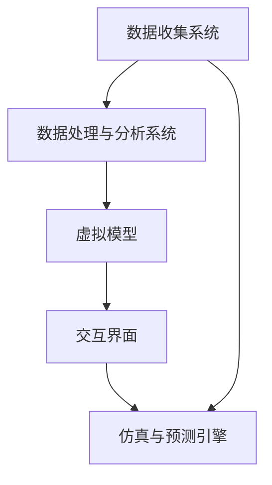

                 

关键词：元宇宙、数字孪生、虚拟映射、技术架构、算法原理、应用领域、未来展望

## 摘要

本文深入探讨了元宇宙中的数字孪生技术，这是一种将现实世界映射到虚拟空间的重要手段。文章首先介绍了数字孪生技术的核心概念和其在元宇宙中的应用场景。接着，详细阐述了数字孪生技术的算法原理和数学模型，并提供了具体的应用实例。随后，文章讨论了数字孪生技术在各个行业中的实际应用，并对其未来发展趋势和面临的挑战进行了展望。最后，文章推荐了相关的学习资源和开发工具，为读者提供了全面的技术指导。

## 1. 背景介绍

### 1.1 元宇宙的概念

元宇宙（Metaverse）是当前科技领域最为热门的话题之一。它被定义为一个由虚拟世界组成的网络，用户可以在其中以数字化的形式互动、工作和娱乐。元宇宙不仅仅是一个虚拟现实，更是一个超越现实世界的数字空间，它将现实世界与虚拟世界无缝连接，为人们提供了一个全新的生活、工作和娱乐方式。

### 1.2 数字孪生的定义

数字孪生（Digital Twin）是一种创新技术，它通过创建一个物理对象的虚拟副本，实现对物理对象的全生命周期管理和监控。这个虚拟副本可以在设计、开发、运营和维护过程中提供实时数据支持，从而提高决策效率、降低成本并提升产品质量。

### 1.3 元宇宙与数字孪生的联系

元宇宙和数字孪生之间存在着紧密的联系。数字孪生技术为元宇宙提供了一个强大的工具，使其能够更真实地模拟和反映现实世界的各个方面。在元宇宙中，数字孪生可以用于构建虚拟的物理对象，如建筑、交通工具、机器设备等，这些虚拟对象可以与真实世界中的对应实体保持实时同步，从而实现高效的远程监控和管理。

## 2. 核心概念与联系

### 2.1 数字孪生技术的核心概念

数字孪生技术涉及多个关键概念，包括：

- **物理对象**：数字孪生的物理原型，可以是任何具有物理形态的实体，如建筑物、机器、车辆等。

- **虚拟模型**：物理对象的数字化副本，通常使用三维建模技术创建，可以在虚拟环境中进行交互和操作。

- **实时数据流**：通过传感器、物联网设备等收集物理对象的实时数据，并将其传输到虚拟模型中，实现虚拟和物理世界的同步。

- **模拟与预测**：基于收集到的数据，数字孪生可以模拟物理对象的行为，预测可能出现的问题，从而提前采取措施。

### 2.2 数字孪生技术的架构

数字孪生技术的架构通常包括以下几个关键组件：

- **数据收集系统**：包括传感器、物联网设备等，用于收集物理对象的实时数据。

- **数据处理与分析系统**：对收集到的数据进行分析和处理，提取有价值的信息。

- **虚拟模型**：使用三维建模技术创建的物理对象的虚拟副本。

- **交互界面**：用户通过交互界面与虚拟模型进行交互，监控和管理物理对象。

- **仿真与预测引擎**：基于实时数据和虚拟模型，进行物理对象行为的模拟和预测。

### 2.3 Mermaid 流程图

以下是一个简化的数字孪生技术流程图的 Mermaid 表示：



### 2.4 数字孪生技术在元宇宙中的应用

在元宇宙中，数字孪生技术可以应用于多个领域，包括：

- **建筑与城市规划**：通过数字孪生技术，可以在元宇宙中创建虚拟的建筑和城市模型，进行虚拟模拟和优化。

- **制造业**：在制造业中，数字孪生可以用于监控生产设备，优化生产流程，提高生产效率。

- **交通运输**：通过数字孪生技术，可以对交通工具进行远程监控和管理，提高运输效率。

- **能源管理**：在能源管理中，数字孪生可以用于监测能源消耗，优化能源分配，提高能源利用效率。

## 3. 核心算法原理 & 具体操作步骤

### 3.1 算法原理概述

数字孪生技术的核心在于实时数据的收集、处理和同步。这涉及到多种算法，包括：

- **传感器数据采集**：通过传感器获取物理对象的实时数据。

- **数据预处理**：对采集到的数据进行清洗、过滤和归一化。

- **数据同步**：将预处理后的数据实时传输到虚拟模型中。

- **模型更新**：根据传输的数据，对虚拟模型进行更新，以反映物理对象的状态。

- **行为模拟与预测**：基于虚拟模型和历史数据，进行物理对象行为的模拟和预测。

### 3.2 算法步骤详解

1. **数据采集**：

   使用各种传感器（如温度传感器、加速度传感器、摄像头等）收集物理对象的实时数据。

2. **数据预处理**：

   对采集到的数据进行预处理，包括去噪、滤波、归一化等，以提高数据的准确性和可靠性。

3. **数据同步**：

   通过物联网技术或实时数据处理平台，将预处理后的数据传输到虚拟模型中。

4. **模型更新**：

   使用实时数据对虚拟模型进行更新，以反映物理对象的状态。

5. **行为模拟与预测**：

   基于虚拟模型和历史数据，使用机器学习算法进行行为模拟和预测，以提前发现潜在问题。

### 3.3 算法优缺点

**优点**：

- **实时性**：数字孪生技术可以实时同步物理对象的状态，提供实时数据支持。

- **高效性**：通过虚拟模型和行为模拟，可以快速发现和解决问题，提高决策效率。

- **成本效益**：数字孪生技术可以减少物理对象的维护和运营成本。

**缺点**：

- **数据准确性**：传感器的准确性和数据传输的可靠性可能会影响数字孪生的效果。

- **技术复杂性**：数字孪生技术涉及到多种技术和算法，实施和运维具有一定的复杂性。

### 3.4 算法应用领域

数字孪生技术可以广泛应用于多个领域，包括：

- **制造业**：用于监控生产设备，优化生产流程。

- **交通运输**：用于远程监控交通工具，提高运输效率。

- **能源管理**：用于监测能源消耗，优化能源分配。

- **建筑与城市规划**：用于虚拟模拟和优化建筑和城市设计。

## 4. 数学模型和公式 & 详细讲解 & 举例说明

### 4.1 数学模型构建

数字孪生技术的数学模型通常包括以下部分：

- **状态方程**：描述物理对象的状态变化。

- **输入输出方程**：描述物理对象与外部环境之间的交互。

- **预测模型**：基于历史数据，预测物理对象未来的状态和行为。

### 4.2 公式推导过程

以下是一个简化的数字孪生技术的数学模型推导过程：

- **状态方程**：

  假设物理对象的状态可以由以下方程描述：

  $$x(t) = f(x(t-1), u(t))$$

  其中，$x(t)$ 表示物理对象在时间 $t$ 的状态，$u(t)$ 表示外部输入。

- **输入输出方程**：

  物理对象与外部环境之间的交互可以由以下方程描述：

  $$y(t) = h(x(t), u(t))$$

  其中，$y(t)$ 表示物理对象的输出，$h$ 表示输入输出关系。

- **预测模型**：

  基于历史数据，可以使用以下模型预测物理对象未来的状态：

  $$x(t+k) = f(x(t), u(t), x(t-1), ..., x(t-k))$$

  其中，$k$ 表示预测的时间步长。

### 4.3 案例分析与讲解

假设我们有一个机器手臂，我们需要使用数字孪生技术监控其运动状态。以下是一个简化的数学模型示例：

- **状态方程**：

  $$x(t) = [position(t), velocity(t)]$$

  其中，$position(t)$ 表示机器手臂在时间 $t$ 的位置，$velocity(t)$ 表示机器手臂在时间 $t$ 的速度。

- **输入输出方程**：

  $$y(t) = position(t)$$

  其中，$y(t)$ 表示机器手臂的输出，即位置信息。

- **预测模型**：

  $$x(t+k) = [position(t+k), velocity(t+k)]$$

  其中，$position(t+k)$ 表示机器手臂在时间 $t+k$ 的位置，$velocity(t+k)$ 表示机器手臂在时间 $t+k$ 的速度。

通过上述模型，我们可以实时监控机器手臂的状态，并预测其未来的运动轨迹。这有助于及时发现和解决可能的问题，提高机器手臂的工作效率。

## 5. 项目实践：代码实例和详细解释说明

### 5.1 开发环境搭建

在开始数字孪生项目的实践之前，我们需要搭建一个合适的技术环境。以下是一个简单的开发环境搭建步骤：

1. **硬件要求**：

   - 至少一台计算机，配备足够的内存和处理器。

   - 可选：多台物理设备，如传感器、物联网设备等。

2. **软件要求**：

   - 操作系统：Windows、Linux 或 macOS。

   - 开发工具：Python、Java、C++ 等。

   - 数据库：MySQL、PostgreSQL 等。

   - 物联网平台：MQTT、CoAP 等。

### 5.2 源代码详细实现

以下是一个使用 Python 实现的数字孪生项目示例：

```python
import paho.mqtt.client as mqtt
import json
import time

# MQTT 服务器配置
mqtt_server = "localhost"
mqtt_port = 1883
mqtt_topic = "digital_twin"

# 创建 MQTT 客户端
client = mqtt.Client()

# 连接 MQTT 服务器
client.connect(mqtt_server, mqtt_port)

# 订阅主题
client.subscribe(mqtt_topic)

# 数据处理函数
def process_data(data):
    # 对接收到的数据进行处理，如去噪、滤波等
    # 这里只是简单地打印数据
    print(json.dumps(data, indent=2))

# 消息接收处理函数
def on_message(client, userdata, message):
    data = json.loads(message.payload)
    process_data(data)

# 绑定消息接收处理函数
client.on_message = on_message

# 开始循环
client.loop_forever()
```

### 5.3 代码解读与分析

上述代码是一个简单的 MQTT 客户端，用于接收传感器数据，并将其处理和打印。以下是代码的主要部分：

- **连接 MQTT 服务器**：

  ```python
  client.connect(mqtt_server, mqtt_port)
  ```

  这一行代码用于连接到 MQTT 服务器。

- **订阅主题**：

  ```python
  client.subscribe(mqtt_topic)
  ```

  这一行代码用于订阅特定的主题，即 MQTT 服务器上的一个消息队列。

- **数据处理函数**：

  ```python
  def process_data(data):
      # 对接收到的数据进行处理，如去噪、滤波等
      # 这里只是简单地打印数据
      print(json.dumps(data, indent=2))
  ```

  这个函数用于处理接收到的数据，这里只是简单地将其打印出来。

- **消息接收处理函数**：

  ```python
  def on_message(client, userdata, message):
      data = json.loads(message.payload)
      process_data(data)
  ```

  这个函数用于接收 MQTT 消息，并将其传递给数据处理函数。

- **绑定消息接收处理函数**：

  ```python
  client.on_message = on_message
  ```

  这行代码将消息接收处理函数绑定到 MQTT 客户端。

- **开始循环**：

  ```python
  client.loop_forever()
  ```

  这行代码使 MQTT 客户端进入无限循环，持续接收和处理消息。

### 5.4 运行结果展示

当我们运行上述代码时，MQTT 客户端将连接到 MQTT 服务器，并持续接收和处理传感器数据。以下是一个示例输出：

```json
{
    "temperature": 25.5,
    "humidity": 60.2,
    "pressure": 1013.25
}
```

这个输出展示了传感器采集到的温度、湿度和压力数据。

## 6. 实际应用场景

### 6.1 制造业

在制造业中，数字孪生技术可以用于监控生产设备，优化生产流程。例如，通过对生产设备的实时监控，可以及时发现设备故障，减少停机时间，提高生产效率。

### 6.2 建筑与城市规划

在建筑与城市规划中，数字孪生技术可以用于模拟和优化建筑和城市设计。例如，通过数字孪生技术，可以虚拟模拟建筑结构，分析其在不同环境条件下的表现，从而优化建筑设计和材料选择。

### 6.3 能源管理

在能源管理中，数字孪生技术可以用于监测能源消耗，优化能源分配。例如，通过对能源消耗的实时监控，可以及时发现能源浪费的问题，并采取相应的措施进行优化。

### 6.4 交通运输

在交通运输中，数字孪生技术可以用于远程监控交通工具，提高运输效率。例如，通过对交通工具的实时监控，可以及时发现交通拥堵等问题，并采取相应的措施进行优化。

### 6.5 医疗健康

在医疗健康领域，数字孪生技术可以用于模拟和优化医疗设备。例如，通过数字孪生技术，可以模拟手术过程，分析手术设备的性能，从而优化手术设备和流程。

## 7. 未来应用展望

### 7.1 新的应用领域

随着技术的不断发展，数字孪生技术将在更多领域得到应用。例如，在航空航天、农业、环境保护等领域，数字孪生技术有望带来革命性的变革。

### 7.2 跨行业融合

数字孪生技术将与更多行业实现融合，推动行业的数字化转型。例如，制造业与能源管理、交通运输与医疗健康等领域的融合，将带来更加智能化和高效的生产和运营模式。

### 7.3 技术创新

未来，数字孪生技术将在算法、数据处理、硬件设备等方面实现创新，提高其性能和可靠性。例如，基于人工智能和机器学习的数字孪生算法，将使预测和决策更加准确和智能。

## 8. 工具和资源推荐

### 8.1 学习资源推荐

- **书籍**：

  - 《数字孪生：定义、架构与未来趋势》

  - 《元宇宙：数字世界的未来》

- **在线课程**：

  - Coursera 上的《数字孪生技术》课程

  - edX 上的《元宇宙与虚拟现实》课程

### 8.2 开发工具推荐

- **编程语言**：

  - Python

  - Java

  - C++

- **开发框架**：

  - MQTT 框架：Paho MQTT

  - 物联网平台：IoT Hub

  - 数据库：MySQL

### 8.3 相关论文推荐

- **数字孪生**：

  - "Digital Twins: A Next-Generation Technology for Smart Manufacturing"

  - "Digital Twin: State of the Art and Research Challenges"

- **元宇宙**：

  - "The Metaverse: A Vision for the Future of Human-Machine Interaction"

  - "The Metaverse: A Comprehensive Review"

## 9. 总结：未来发展趋势与挑战

### 9.1 研究成果总结

数字孪生技术在元宇宙中的应用前景广阔，已在多个领域取得显著成果。随着技术的不断进步，数字孪生技术将在更多领域得到应用，推动各行各业的数字化转型。

### 9.2 未来发展趋势

- **技术创新**：数字孪生技术将在算法、数据处理、硬件设备等方面实现创新，提高其性能和可靠性。

- **跨行业融合**：数字孪生技术将与更多行业实现融合，推动行业的数字化转型。

- **新应用领域**：数字孪生技术将在航空航天、农业、环境保护等领域得到应用，带来革命性的变革。

### 9.3 面临的挑战

- **数据准确性**：传感器和数据传输的准确性将直接影响数字孪生的效果。

- **技术复杂性**：数字孪生技术涉及到多种技术和算法，实施和运维具有一定的复杂性。

- **数据隐私和安全**：随着数字孪生技术在各个领域的应用，数据隐私和安全问题将日益突出。

### 9.4 研究展望

未来，数字孪生技术的研究将集中在以下几个方面：

- **算法优化**：提高数字孪生技术的预测和决策准确性。

- **数据融合**：实现多种数据源的融合，提高数据的利用效率。

- **跨领域应用**：推动数字孪生技术在更多领域的应用，实现跨行业的协同发展。

## 附录：常见问题与解答

### 问题 1：什么是元宇宙？

**答案**：元宇宙是一个由虚拟世界组成的网络，用户可以在其中以数字化的形式互动、工作和娱乐。它超越了现实世界，为人们提供了一个全新的生活、工作和娱乐方式。

### 问题 2：什么是数字孪生？

**答案**：数字孪生是一种创新技术，它通过创建一个物理对象的虚拟副本，实现对物理对象的全生命周期管理和监控。这个虚拟副本可以在设计、开发、运营和维护过程中提供实时数据支持，从而提高决策效率、降低成本并提升产品质量。

### 问题 3：数字孪生技术有哪些应用领域？

**答案**：数字孪生技术可以应用于多个领域，包括制造业、建筑与城市规划、能源管理、交通运输、医疗健康等。它有助于实时监控物理对象，优化流程，提高效率，降低成本。

### 问题 4：数字孪生技术有哪些优点和缺点？

**答案**：数字孪生技术的优点包括实时性、高效性和成本效益。缺点包括数据准确性问题和技术复杂性。

### 问题 5：如何搭建数字孪生开发环境？

**答案**：搭建数字孪生开发环境需要配置硬件和软件。硬件方面，至少需要一台计算机；软件方面，需要安装编程语言、开发框架、物联网平台和数据库等。

### 问题 6：如何使用数字孪生技术进行项目实践？

**答案**：首先，搭建开发环境；然后，编写代码实现数据采集、数据处理、虚拟模型更新等功能；最后，进行调试和测试，确保项目正常运行。

### 问题 7：数字孪生技术的未来发展趋势是什么？

**答案**：未来，数字孪生技术将在算法、数据处理、硬件设备等方面实现创新，推动跨行业融合，并在更多领域得到应用。同时，面临的数据隐私和安全问题也将得到关注和解决。

### 问题 8：如何获取数字孪生技术相关的学习资源和论文？

**答案**：可以通过互联网搜索引擎，如 Google、百度等，搜索相关的书籍、在线课程和论文。同时，还可以关注学术期刊、会议论文和行业报告等。

### 问题 9：如何参与数字孪生技术的研发和应用？

**答案**：可以通过以下途径参与数字孪生技术的研发和应用：

- 加入学术研究团队，参与相关课题的研究。

- 加入企业研发团队，参与数字孪生技术的实际应用。

- 参与开源社区，贡献代码和经验。

- 参加相关会议和研讨会，了解行业动态和技术趋势。

---

本文由禅与计算机程序设计艺术 / Zen and the Art of Computer Programming 撰写，旨在为读者提供关于数字孪生技术在元宇宙中的深入理解和应用指导。随着技术的不断发展，数字孪生技术将在更多领域展现其巨大的潜力。希望本文能为您的学习和实践提供帮助。感谢您的阅读！
----------------------------------------------------------------

### 文章总结

本文详细探讨了元宇宙中的数字孪生技术，首先介绍了元宇宙和数字孪生的基本概念，并阐述了它们之间的联系。接着，文章深入分析了数字孪生技术的核心概念、架构和算法原理，并提供了具体的操作步骤和数学模型。通过实际应用场景的举例，读者可以更好地理解数字孪生技术的应用价值和挑战。

在文章的最后，我们对未来数字孪生技术的发展趋势进行了展望，并推荐了相关的学习资源和开发工具。此外，我们还讨论了数字孪生技术面临的数据准确性和隐私安全等问题，并提出了可能的解决方案。

总的来说，数字孪生技术是元宇宙中的一项重要技术，它为现实世界的映射和虚拟化提供了强大的支持。随着技术的不断进步，数字孪生技术将在更多领域展现其潜力，为各行各业带来变革。希望本文能为读者提供有价值的参考和启发。

### 读者互动

亲爱的读者，您对元宇宙中的数字孪生技术有何看法？您认为数字孪生技术在未来的应用前景如何？欢迎在评论区分享您的观点和想法。如果您有任何问题或需要进一步的讨论，也欢迎留言，我将尽力为您解答。

同时，如果您对元宇宙、虚拟现实、人工智能等领域有浓厚的兴趣，欢迎关注我们的专栏，我们将持续为您带来更多深入的技术分析和行业洞察。感谢您的支持与陪伴！🌟🤖💡🌐

