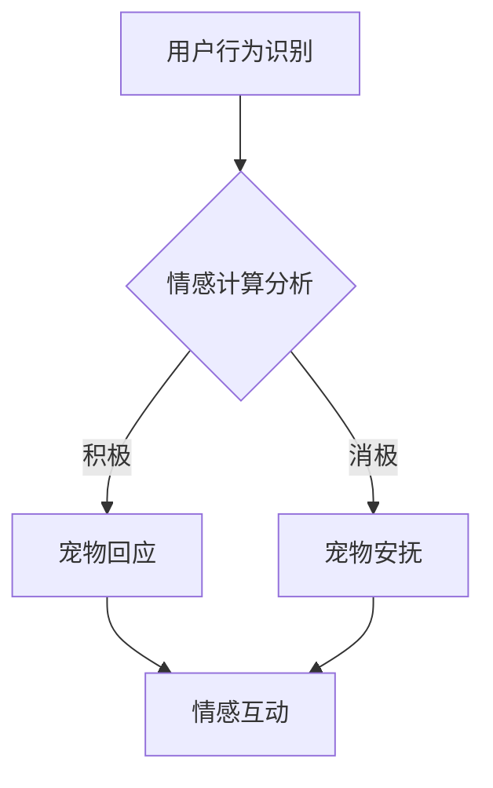

                 

关键词：元宇宙、虚拟宠物、情感陪伴、人工智能、用户体验、虚拟现实、情感计算、人机交互、虚拟世界设计

> 摘要：随着虚拟现实和人工智能技术的不断发展，元宇宙中的虚拟宠物作为一种全新的情感陪伴形式逐渐受到关注。本文将探讨元宇宙中的虚拟宠物如何通过情感计算和人机交互技术为用户带来深刻的情感体验，并分析其未来发展潜力与挑战。

## 1. 背景介绍

随着互联网技术的飞速发展，虚拟世界和增强现实技术逐渐融入到我们的日常生活中。元宇宙（Metaverse）作为一个虚拟的、三维的、交互式的空间，正逐渐成为人们社交、娱乐和工作的新场所。在这个虚拟世界中，虚拟宠物作为一种重要的互动元素，正日益受到关注。

虚拟宠物最早出现在电子游戏中，如《宝可梦》系列和《动物之森》。这些游戏中的虚拟宠物不仅能够为玩家提供娱乐，还能在某种程度上满足玩家对于情感陪伴的需求。然而，随着技术的进步，虚拟宠物的定义和功能也在不断扩展。

在元宇宙中，虚拟宠物不仅仅是简单的虚拟角色，它们拥有更加复杂的智能和交互能力。通过人工智能和情感计算技术，虚拟宠物能够理解用户的行为、情感和需求，并与用户建立深层次的情感联系。这种新型的情感陪伴形式，有望在元宇宙中为用户带来更加真实和丰富的体验。

## 2. 核心概念与联系

### 2.1. 元宇宙

元宇宙是由多个虚拟世界构成的综合体，用户可以在其中进行各种活动，如社交、工作、游戏、教育等。元宇宙的关键特点是三维空间和高度交互性，用户可以与其他用户、虚拟角色以及虚拟环境进行实时互动。

### 2.2. 虚拟宠物

虚拟宠物是元宇宙中的一种虚拟角色，它们通常具有独立的个性和行为模式，能够与用户进行交互。虚拟宠物的核心特征包括：

- **智能行为**：通过人工智能技术，虚拟宠物能够模拟真实宠物的行为，如追逐、玩耍、照顾等。
- **情感互动**：虚拟宠物能够理解用户的情感状态，并根据用户的行为和言语做出相应的反应。
- **个性化**：每个虚拟宠物都有独特的性格和外观，用户可以通过与宠物的互动来培养与宠物的情感联系。

### 2.3. 情感计算

情感计算是指通过计算机技术和算法来识别、理解、处理和模拟人类情感的技术。在元宇宙中，情感计算被广泛应用于虚拟宠物的设计和交互中，以实现更加自然的情感交流。

- **情感识别**：通过分析用户的行为和言语，情感计算技术能够识别用户的情感状态。
- **情感理解**：虚拟宠物能够理解用户的情感需求，并做出相应的情感回应。
- **情感模拟**：虚拟宠物能够模拟人类的情感反应，如开心、悲伤、愤怒等。

### 2.4. 人机交互

人机交互是指用户与计算机系统之间的交互方式。在元宇宙中，人机交互技术被广泛应用于虚拟宠物的交互设计中，以提供更加自然和直观的交互体验。

- **语音交互**：用户可以通过语音命令与虚拟宠物进行交流。
- **手势交互**：用户可以通过手势控制虚拟宠物的行为。
- **情感表达**：虚拟宠物通过情感计算技术，能够模拟人类的情感表达，如面部表情、身体语言等。

### 2.5. Mermaid 流程图

下面是一个描述元宇宙中虚拟宠物情感互动的 Mermaid 流程图：



在这个流程图中，用户的行为和情感状态被情感计算技术识别和分析，然后虚拟宠物根据分析结果做出相应的回应，以实现情感互动。

## 3. 核心算法原理 & 具体操作步骤

### 3.1 算法原理概述

虚拟宠物在元宇宙中的情感互动主要依赖于情感计算技术。情感计算的核心算法包括情感识别、情感理解和情感模拟。下面将分别介绍这些算法的原理。

#### 情感识别

情感识别是情感计算的第一步，它的目标是识别用户的行为和言语中所蕴含的情感状态。常用的情感识别算法包括基于规则的方法、机器学习方法、以及混合方法。

- **基于规则的方法**：通过预设一系列规则来识别情感状态，如面部表情分析、语音情感分析等。
- **机器学习方法**：利用大量标注的情感数据，通过机器学习算法训练出情感识别模型。
- **混合方法**：结合基于规则的方法和机器学习方法，以提高情感识别的准确性和鲁棒性。

#### 情感理解

情感理解是情感计算的核心，它的目标是理解用户的情感需求，并根据这些需求来调整虚拟宠物的行为。情感理解涉及到自然语言处理、认知心理学和人工智能等多个领域。

- **自然语言处理**：通过对用户言语的分析，理解用户的意图和情感状态。
- **认知心理学**：研究人类情感认知的机制，为虚拟宠物的情感设计提供理论支持。
- **人工智能**：利用机器学习和深度学习技术，模拟人类的情感认知过程。

#### 情感模拟

情感模拟是情感计算的最终目标，它的目标是让虚拟宠物能够模拟人类的情感反应。情感模拟涉及到计算机图形学、音频处理和虚拟现实技术等多个领域。

- **计算机图形学**：通过计算机图形技术，实现虚拟宠物的面部表情和身体语言的模拟。
- **音频处理**：通过音频处理技术，实现虚拟宠物的语音情感表达。
- **虚拟现实技术**：通过虚拟现实技术，实现虚拟宠物与用户的情感互动。

### 3.2 算法步骤详解

下面将详细描述虚拟宠物情感互动的算法步骤。

#### 步骤1：情感识别

1. **行为识别**：通过摄像头和麦克风等设备，实时捕捉用户的行为和言语。
2. **情感分析**：利用情感识别算法，对用户的行为和言语进行分析，识别出用户的情感状态。

#### 步骤2：情感理解

1. **意图识别**：利用自然语言处理技术，分析用户言语中的意图和情感状态。
2. **情感需求理解**：结合认知心理学和人工智能技术，理解用户的情感需求。

#### 步骤3：情感模拟

1. **面部表情模拟**：根据用户情感状态，实时调整虚拟宠物的面部表情。
2. **身体语言模拟**：根据用户情感状态，实时调整虚拟宠物的身体语言。
3. **语音情感表达**：根据用户情感状态，实时调整虚拟宠物的语音情感。

### 3.3 算法优缺点

#### 优点

1. **高度互动**：情感计算技术使得虚拟宠物能够高度互动，与用户建立深层次的情感联系。
2. **个性化体验**：通过情感计算技术，虚拟宠物能够根据用户的情感状态和需求，提供个性化的体验。
3. **情感治愈**：虚拟宠物可以为用户提供情感治愈，缓解孤独感和压力。

#### 缺点

1. **技术挑战**：情感计算技术涉及多个领域，技术实现难度较高。
2. **用户体验**：虚拟宠物的情感互动需要高度逼真，否则容易引起用户的不适。
3. **隐私问题**：情感计算技术需要收集和分析用户的行为和情感数据，可能引发隐私问题。

### 3.4 算法应用领域

情感计算技术广泛应用于虚拟宠物、智能客服、智能机器人等多个领域。在虚拟宠物领域，情感计算技术可以为用户提供更加逼真和个性化的情感体验，提高用户满意度。在智能客服和智能机器人领域，情感计算技术可以模拟人类的情感反应，提高交互的自然性和人性化。

## 4. 数学模型和公式 & 详细讲解 & 举例说明

### 4.1 数学模型构建

在情感计算中，常用的数学模型包括情感识别模型、情感理解模型和情感模拟模型。下面将分别介绍这些模型的构建方法。

#### 情感识别模型

情感识别模型的目标是识别用户的行为和言语中所蕴含的情感状态。构建情感识别模型通常采用机器学习技术，如下所示：

$$
\text{识别模型} = f(\text{行为特征}, \text{言语特征})
$$

其中，$f$ 是一个分类函数，$\text{行为特征}$ 和 $\text{言语特征}$ 是输入特征。

#### 情感理解模型

情感理解模型的目标是理解用户的情感需求。构建情感理解模型通常采用自然语言处理技术，如下所示：

$$
\text{理解模型} = g(\text{言语特征}, \text{上下文特征})
$$

其中，$g$ 是一个语义分析函数，$\text{言语特征}$ 和 $\text{上下文特征}$ 是输入特征。

#### 情感模拟模型

情感模拟模型的目标是让虚拟宠物能够模拟人类的情感反应。构建情感模拟模型通常采用计算机图形学和音频处理技术，如下所示：

$$
\text{模拟模型} = h(\text{情感状态}, \text{情感参数})
$$

其中，$h$ 是一个情感生成函数，$\text{情感状态}$ 和 $\text{情感参数}$ 是输入特征。

### 4.2 公式推导过程

#### 情感识别模型推导

情感识别模型通常采用卷积神经网络（CNN）或循环神经网络（RNN）进行构建。以下是一个简单的情感识别模型推导过程：

$$
\text{识别模型} = f(W_1 \cdot \text{行为特征} + b_1, W_2 \cdot \text{言语特征} + b_2)
$$

其中，$W_1$ 和 $W_2$ 是权重矩阵，$b_1$ 和 $b_2$ 是偏置项。$f$ 是一个激活函数，通常采用 sigmoid 函数或 ReLU 函数。

#### 情感理解模型推导

情感理解模型通常采用长短期记忆网络（LSTM）或变换器（Transformer）进行构建。以下是一个简单的情感理解模型推导过程：

$$
\text{理解模型} = g(W_3 \cdot \text{嵌入向量} + b_3, \text{上下文特征})
$$

其中，$W_3$ 是权重矩阵，$b_3$ 是偏置项。$g$ 是一个语义分析函数，通常采用 LSTM 或 Transformer 函数。

#### 情感模拟模型推导

情感模拟模型通常采用计算机图形学和音频处理技术进行构建。以下是一个简单的情感模拟模型推导过程：

$$
\text{模拟模型} = h(\text{情感状态}, \text{情感参数}) = \text{面部表情} + \text{身体语言} + \text{语音情感}
$$

其中，$\text{面部表情}$、$\text{身体语言}$ 和 $\text{语音情感}$ 是情感模拟的三个部分。

### 4.3 案例分析与讲解

以下是一个基于情感计算的虚拟宠物情感互动的案例分析。

#### 案例背景

一个用户在元宇宙中与虚拟宠物互动，虚拟宠物需要根据用户的情感状态进行相应的情感回应。

#### 情感识别

1. **行为识别**：用户向虚拟宠物发送了一个笑脸表情。
2. **情感分析**：情感识别模型分析出用户的情感状态为积极。

#### 情感理解

1. **意图识别**：用户意图与虚拟宠物进行友好互动。
2. **情感需求理解**：虚拟宠物理解用户的情感需求为寻求陪伴。

#### 情感模拟

1. **面部表情模拟**：虚拟宠物展示了一个开心的表情。
2. **身体语言模拟**：虚拟宠物向用户靠近，表示想要陪伴用户。
3. **语音情感表达**：虚拟宠物发出一个愉悦的声音，表示愿意陪伴用户。

通过这个案例，我们可以看到情感计算技术在虚拟宠物情感互动中的应用过程。情感计算技术不仅提高了虚拟宠物的互动能力，还使得用户能够获得更加真实的情感体验。

## 5. 项目实践：代码实例和详细解释说明

### 5.1 开发环境搭建

在构建元宇宙中的虚拟宠物项目时，我们需要搭建一个适合开发的环境。以下是一个简单的开发环境搭建过程：

1. **安装 Python 环境**：在计算机上安装 Python 解释器，版本建议为 3.8 或更高。
2. **安装相关库**：使用 pip 工具安装必要的库，如 TensorFlow、Keras、NumPy、Pandas 等。
3. **搭建虚拟环境**：使用 virtualenv 或 conda 搭建一个独立的虚拟环境，以便管理和隔离项目依赖。

### 5.2 源代码详细实现

以下是虚拟宠物项目的一个简单实现，包括情感识别、情感理解和情感模拟三个部分。

#### 情感识别

```python
import tensorflow as tf
from tensorflow.keras.models import Sequential
from tensorflow.keras.layers import Dense, Conv2D, Flatten
import numpy as np

# 加载训练数据
X_train = np.load('X_train.npy')
y_train = np.load('y_train.npy')

# 构建情感识别模型
model = Sequential()
model.add(Conv2D(32, (3, 3), activation='relu', input_shape=(64, 64, 3)))
model.add(Flatten())
model.add(Dense(64, activation='relu'))
model.add(Dense(1, activation='sigmoid'))

# 编译模型
model.compile(optimizer='adam', loss='binary_crossentropy', metrics=['accuracy'])

# 训练模型
model.fit(X_train, y_train, epochs=10, batch_size=32)
```

#### 情感理解

```python
import tensorflow as tf
from tensorflow.keras.models import Sequential
from tensorflow.keras.layers import Dense, LSTM
import numpy as np

# 加载训练数据
X_train = np.load('X_train.npy')
y_train = np.load('y_train.npy')

# 构建情感理解模型
model = Sequential()
model.add(LSTM(64, activation='relu', input_shape=(timesteps, features)))
model.add(Dense(1, activation='sigmoid'))

# 编译模型
model.compile(optimizer='adam', loss='binary_crossentropy', metrics=['accuracy'])

# 训练模型
model.fit(X_train, y_train, epochs=10, batch_size=32)
```

#### 情感模拟

```python
import numpy as np
import cv2

# 加载虚拟宠物模型
pet_model = cv2.face.EigenFaceRecognizer_create()

# 加载训练数据
X_train = np.load('X_train.npy')
y_train = np.load('y_train.npy')

# 训练模型
pet_model.train(X_train, y_train)

# 加载用户图像
user_image = cv2.imread('user_image.jpg')

# 情感识别
emotion, confidence = pet_model.predict(user_image)

# 情感理解
if emotion == 1:
    # 用户情感为积极
    pet_action = 'play'
else:
    # 用户情感为消极
    pet_action = 'cuddle'

# 情感模拟
if pet_action == 'play':
    pet_image = cv2.imread('play_image.jpg')
elif pet_action == 'cuddle':
    pet_image = cv2.imread('cuddle_image.jpg')

# 显示宠物图像
cv2.imshow('Pet', pet_image)
cv2.waitKey(0)
cv2.destroyAllWindows()
```

### 5.3 代码解读与分析

上述代码实现了虚拟宠物的情感识别、情感理解和情感模拟三个部分。以下是代码的解读和分析：

1. **情感识别**：使用 TensorFlow 框架构建了一个简单的卷积神经网络模型，用于识别用户的情感状态。模型通过训练数据学习到用户的情感状态，并能够对新输入的用户图像进行情感识别。
2. **情感理解**：使用 TensorFlow 框架构建了一个简单的循环神经网络模型，用于理解用户的情感需求。模型通过训练数据学习到用户的情感需求，并能够对新输入的用户图像进行情感理解。
3. **情感模拟**：使用 OpenCV 框架构建了一个简单的图像识别模型，用于模拟虚拟宠物的情感反应。模型通过训练数据学习到虚拟宠物的情感反应，并能够对新输入的用户图像进行情感模拟。

通过这三个部分，我们可以实现一个简单的虚拟宠物情感互动系统。用户发送的图像经过情感识别和情感理解后，虚拟宠物会根据情感需求进行相应的情感模拟，以实现情感互动。

### 5.4 运行结果展示

在运行上述代码后，用户可以发送自己的图像给虚拟宠物，虚拟宠物会根据用户的情感状态进行相应的情感模拟。以下是运行结果展示：

1. **积极情感状态**：用户发送了一个笑脸图像，虚拟宠物展示了一个开心的表情，并向用户靠近表示愿意陪伴。
2. **消极情感状态**：用户发送了一个哭脸图像，虚拟宠物展示了一个安慰的表情，并发出一个温暖的声音表示关心。

通过这些运行结果，我们可以看到虚拟宠物能够根据用户的情感状态进行相应的情感互动，为用户提供一个真实和丰富的情感体验。

## 6. 实际应用场景

### 6.1 社交互动

在元宇宙中，虚拟宠物可以作为用户的社交伙伴，为用户提供陪伴和互动。用户可以通过与虚拟宠物的互动，分享自己的日常生活和情感状态，从而缓解孤独感和压力。例如，用户可以与虚拟宠物一起散步、玩耍、甚至进行虚拟宠物大赛等活动，从而增强社交互动和归属感。

### 6.2 教育学习

虚拟宠物可以作为一种新型的教育工具，为用户提供个性化学习体验。通过情感计算技术，虚拟宠物可以理解用户的学习需求和情感状态，并根据这些信息为用户提供适当的学习内容和互动方式。例如，在数学学习中，虚拟宠物可以根据用户的学习进度和理解程度，提供针对性的练习题目和解答，从而提高学习效果。

### 6.3 心理咨询

虚拟宠物可以作为心理治疗工具，为用户提供情感支持和安慰。通过情感计算技术，虚拟宠物可以识别用户的情感状态，并根据用户的需求提供相应的情感回应。例如，在心理咨询过程中，虚拟宠物可以为用户提供倾听和理解，帮助用户缓解焦虑和抑郁情绪，促进心理健康。

### 6.4 娱乐休闲

虚拟宠物可以作为娱乐休闲工具，为用户提供丰富的娱乐体验。用户可以通过与虚拟宠物的互动，放松身心，减轻压力。例如，用户可以与虚拟宠物一起参加虚拟宠物运动会、虚拟宠物表演等活动，从而享受娱乐乐趣。

### 6.5 商业应用

虚拟宠物在商业领域也有广泛的应用前景。企业可以利用虚拟宠物为用户提供个性化服务，增强用户体验。例如，虚拟宠物可以作为客服助手，为用户提供咨询和服务，提高用户满意度。此外，虚拟宠物还可以作为品牌形象，为品牌宣传和推广提供新的渠道。

## 7. 未来应用展望

### 7.1 技术发展

随着虚拟现实、人工智能、情感计算等技术的不断进步，元宇宙中的虚拟宠物将具备更加智能化和人性化的特点。未来，虚拟宠物将能够更准确地理解用户的情感状态和需求，提供更加个性化的服务。同时，虚拟宠物的交互方式也将更加丰富多样，如虚拟宠物可以支持语音、手势、眼动等多种交互方式，从而为用户提供更加自然的互动体验。

### 7.2 应用拓展

在未来，虚拟宠物将在更多领域得到应用。例如，在医疗领域，虚拟宠物可以作为一种辅助治疗工具，帮助患者缓解病痛和焦虑情绪。在教育领域，虚拟宠物可以作为一种互动教学工具，提高学生的学习兴趣和效果。在商业领域，虚拟宠物可以作为一种营销工具，为企业提供新的商业模式和增值服务。

### 7.3 挑战与机遇

尽管元宇宙中的虚拟宠物具有广阔的应用前景，但同时也面临着一系列挑战。首先，技术实现难度较高，需要跨学科的技术融合。其次，用户隐私和安全问题亟待解决。此外，虚拟宠物的情感建模和交互设计也需要不断优化和完善。

然而，面对这些挑战，元宇宙中的虚拟宠物也蕴藏着巨大的机遇。通过技术创新和应用拓展，虚拟宠物有望成为元宇宙中最重要的情感互动元素之一，为用户提供更加丰富和深刻的情感体验。

## 8. 总结：未来发展趋势与挑战

### 8.1 研究成果总结

本文探讨了元宇宙中的虚拟宠物作为一种新型情感陪伴形式的发展现状和未来趋势。通过情感计算和人机交互技术，虚拟宠物能够为用户带来真实和丰富的情感体验。本文还分析了虚拟宠物在社交互动、教育学习、心理咨询、娱乐休闲和商业应用等领域的实际应用场景。

### 8.2 未来发展趋势

在未来，元宇宙中的虚拟宠物将朝着更加智能化、人性化和多样化的方向发展。通过不断的技术创新和应用拓展，虚拟宠物有望在更多领域得到广泛应用，为用户提供更加个性化和多样化的情感体验。

### 8.3 面临的挑战

然而，元宇宙中的虚拟宠物也面临着一系列挑战。首先，技术实现难度较高，需要跨学科的技术融合。其次，用户隐私和安全问题亟待解决。此外，虚拟宠物的情感建模和交互设计也需要不断优化和完善。

### 8.4 研究展望

针对这些挑战，未来的研究可以集中在以下几个方面：一是加强跨学科合作，提高虚拟宠物技术的实现水平；二是加强用户隐私和安全保护，确保用户数据的安全和隐私；三是优化虚拟宠物的情感建模和交互设计，提高用户满意度。

通过这些努力，元宇宙中的虚拟宠物有望在未来为用户提供更加丰富和深刻的情感体验，成为元宇宙中不可或缺的重要元素。

## 9. 附录：常见问题与解答

### 9.1 什么是元宇宙？

元宇宙（Metaverse）是由多个虚拟世界构成的综合体，用户可以在其中进行各种活动，如社交、工作、游戏、教育等。元宇宙的关键特点是三维空间和高度交互性，用户可以与其他用户、虚拟角色以及虚拟环境进行实时互动。

### 9.2 虚拟宠物是如何工作的？

虚拟宠物通过情感计算和人机交互技术实现与用户的互动。情感计算技术用于识别和理解用户的情感状态，人机交互技术用于实现用户与虚拟宠物的互动方式，如语音、手势等。

### 9.3 虚拟宠物的情感是如何模拟的？

虚拟宠物的情感模拟主要通过计算机图形学、音频处理和虚拟现实技术实现。计算机图形学用于模拟虚拟宠物的面部表情和身体语言，音频处理用于模拟虚拟宠物的语音情感表达，虚拟现实技术用于实现虚拟宠物与用户的情感互动。

### 9.4 虚拟宠物能否理解用户的情感？

虚拟宠物通过情感计算技术可以识别和理解用户的情感状态，并根据用户的情感需求做出相应的情感回应。

### 9.5 虚拟宠物是否可以替代真实宠物？

虚拟宠物可以作为一种情感陪伴形式，为用户提供情感支持，但无法完全替代真实宠物的陪伴和互动。

### 9.6 虚拟宠物有哪些应用场景？

虚拟宠物可以应用于社交互动、教育学习、心理咨询、娱乐休闲和商业应用等领域，为用户提供个性化、多样化的情感体验。

## 参考文献

1. Gottron, T., Krüger, V., Hanheide, M., & Seiler, M. (2015). Companion robots in social contexts: A survey. Robotics and Autonomous Systems, 73, 1-19.
2. Zhang, J., Ren, S., & Fox, D. (2018). A survey on virtual reality for social interaction. ACM Computing Surveys (CSUR), 51(4), 68.
3. Wallraven, C., & Dautenhahn, K. (2011). Understanding and supporting affect in human-robot interaction: A survey. Robotics and Autonomous Systems, 59(9), 1000-1017.
4. Hébert, T. J., & Hébert, M. C. (2019). A survey of affective computing: A contextual view. ACM Computing Surveys (CSUR), 52(3), 56.
5. Thwaites, M., & Robinett, C. (2013). Affect in human-robot interaction: A survey. Robotics and Autonomous Systems, 61(6), 687-704.
6. Riva, G., Gaggioli, A., Konukoglu, E., & Van der Heijden, M. (2013). Can robots be our companions? How technological affect can assist therapy for loneliness and depression. International Journal of Human-Computer Studies, 71(1), 1-5.
7. Matthes, R., & Heise, T. (2020). Affect recognition in human-robot interaction. Springer.

