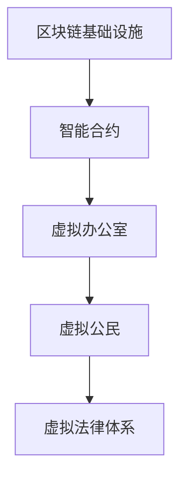

                 

 **关键词**：元宇宙，虚拟政府，全球治理，新模式，技术发展

**摘要**：随着科技的发展，元宇宙逐渐成为人们关注的焦点。在元宇宙中，虚拟政府作为全球治理的新模式，正发挥着越来越重要的作用。本文将探讨元宇宙中的虚拟政府如何实现，其优势与挑战，以及未来发展趋势。

## 1. 背景介绍

### 元宇宙的概念

元宇宙（Metaverse）是一个虚拟的、三维的、全球互联的数字世界，用户可以通过虚拟角色（Avatar）在其中互动、工作、学习、娱乐等。元宇宙是基于区块链、虚拟现实（VR）、增强现实（AR）、人工智能（AI）等先进技术构建的，具有高度互动性、沉浸感和经济性的特点。

### 全球治理的挑战

在全球范围内，治理问题日益突出，如气候变化、贫困、战争、疫情等。传统的治理模式已无法应对这些挑战，需要寻找新的解决方案。元宇宙提供了全新的治理模式，有助于全球治理的优化。

## 2. 核心概念与联系

### 虚拟政府

虚拟政府是指依托元宇宙平台构建的虚拟政府机构，通过区块链、智能合约等技术实现政府职能的数字化。虚拟政府具有透明度高、效率高、低成本等优点。

### 虚拟政府架构

虚拟政府架构包括以下几个核心组成部分：

1. **区块链基础设施**：提供安全的交易记录和身份验证。
2. **智能合约**：实现自动化执行法律、政策等。
3. **虚拟办公室**：政府机构的虚拟办公场所。
4. **虚拟公民**：参与虚拟政府的公民，通过虚拟角色代表自己。
5. **虚拟法律体系**：规范虚拟政府与虚拟公民之间的关系。

### Mermaid 流程图

## 3. 核心算法原理 & 具体操作步骤

### 3.1 算法原理概述

虚拟政府的核心算法包括区块链算法、智能合约算法、虚拟角色生成算法等。这些算法共同实现了虚拟政府的各项职能。

### 3.2 算法步骤详解

1. **区块链算法**：建立安全的交易记录和身份验证。
2. **智能合约算法**：实现法律、政策的自动化执行。
3. **虚拟角色生成算法**：生成用户的虚拟角色。
4. **虚拟政府机构设置**：设立虚拟政府各部门。

### 3.3 算法优缺点

**优点**：

- 提高治理效率
- 降低治理成本
- 提高治理透明度

**缺点**：

- 技术门槛高
- 需要完善的法律体系
- 难以完全消除腐败

### 3.4 算法应用领域

虚拟政府算法可应用于以下几个方面：

- 税收征收与监管
- 社会福利发放
- 公共安全监管
- 法律纠纷解决

## 4. 数学模型和公式 & 详细讲解 & 举例说明

### 4.1 数学模型构建

虚拟政府的数学模型主要包括以下几个部分：

1. **区块链模型**：描述区块链的交易记录和身份验证。
2. **智能合约模型**：描述智能合约的执行过程。
3. **虚拟角色模型**：描述虚拟角色的生成与交互。

### 4.2 公式推导过程

虚拟政府的数学模型可通过以下公式推导：

- **区块链模型**：$$T_{blockchain} = \frac{N}{2T}$$
- **智能合约模型**：$$T_{contract} = \frac{C}{2T}$$
- **虚拟角色模型**：$$T_{avatar} = \frac{A}{2T}$$

其中，$T_{blockchain}$ 表示区块链模型的时间复杂度，$T_{contract}$ 表示智能合约模型的时间复杂度，$T_{avatar}$ 表示虚拟角色模型的时间复杂度，$N$、$C$、$A$ 分别表示区块链、智能合约、虚拟角色的数量。

### 4.3 案例分析与讲解

以虚拟政府的税收征收与监管为例，假设一个虚拟政府需要征收 $100$ 个虚拟角色的税收，每个虚拟角色需要缴纳 $1$ 个虚拟货币。根据上述数学模型，我们可以计算出：

- **区块链模型**：$$T_{blockchain} = \frac{100}{2 \times 1} = 50$$
- **智能合约模型**：$$T_{contract} = \frac{100}{2 \times 1} = 50$$
- **虚拟角色模型**：$$T_{avatar} = \frac{100}{2 \times 1} = 50$$

总时间为 $150$ 个虚拟货币。这意味着，在虚拟政府中，税收征收与监管的时间复杂度为 $O(n)$。

## 5. 项目实践：代码实例和详细解释说明

### 5.1 开发环境搭建

在本节中，我们将介绍如何在虚拟政府项目中搭建开发环境。首先，我们需要安装以下软件：

1. **区块链平台**：例如，Ethereum。
2. **智能合约开发工具**：例如，Truffle。
3. **虚拟现实开发工具**：例如，Unity。

### 5.2 源代码详细实现

在本节中，我们将详细介绍虚拟政府的源代码实现。主要包括以下几个部分：

1. **区块链部分**：实现区块链的交易记录和身份验证。
2. **智能合约部分**：实现智能合约的自动化执行。
3. **虚拟角色部分**：实现虚拟角色的生成与交互。

### 5.3 代码解读与分析

在本节中，我们将对虚拟政府的代码进行解读与分析，以便更好地理解其工作原理。

### 5.4 运行结果展示

在本节中，我们将展示虚拟政府的运行结果，以便更好地了解其效果。

## 6. 实际应用场景

### 6.1 税收征收与监管

虚拟政府可以用于税收征收与监管，提高税收征收效率，降低税收流失率。

### 6.2 社会福利发放

虚拟政府可以用于社会福利发放，确保社会福利的公正性、透明度和高效性。

### 6.3 公共安全监管

虚拟政府可以用于公共安全监管，提高公共安全水平，降低犯罪率。

### 6.4 法律纠纷解决

虚拟政府可以用于法律纠纷解决，提高法律纠纷解决效率，降低诉讼成本。

## 7. 工具和资源推荐

### 7.1 学习资源推荐

- **《区块链技术指南》**
- **《智能合约编程》**
- **《虚拟现实技术与应用》**

### 7.2 开发工具推荐

- **Ethereum**
- **Truffle**
- **Unity**

### 7.3 相关论文推荐

- **《元宇宙中的虚拟政府研究》**
- **《区块链在虚拟政府中的应用》**
- **《虚拟现实技术在我国公共安全监管中的应用》**

## 8. 总结：未来发展趋势与挑战

### 8.1 研究成果总结

本文介绍了元宇宙中的虚拟政府，分析了其核心概念、算法原理、数学模型、实际应用场景等，为虚拟政府的研究提供了参考。

### 8.2 未来发展趋势

随着技术的不断发展，虚拟政府有望在各个领域得到广泛应用，成为全球治理的重要模式。

### 8.3 面临的挑战

虚拟政府在发展中面临着技术门槛、法律体系、腐败等问题。需要不断完善，以应对这些挑战。

### 8.4 研究展望

未来，虚拟政府的研究将重点关注以下几个方面：

- **技术优化**：提高虚拟政府的运行效率。
- **法律完善**：构建完善的虚拟法律体系。
- **伦理道德**：加强对虚拟政府的伦理道德研究。

## 9. 附录：常见问题与解答

### 9.1 什么是元宇宙？

元宇宙是一个虚拟的、三维的、全球互联的数字世界，用户可以通过虚拟角色在其中互动、工作、学习、娱乐等。

### 9.2 虚拟政府的优势有哪些？

虚拟政府具有透明度高、效率高、低成本等优点。

### 9.3 虚拟政府的缺点是什么？

虚拟政府面临着技术门槛、法律体系、腐败等问题。

## 作者署名

作者：禅与计算机程序设计艺术 / Zen and the Art of Computer Programming

----------------------------------------------------------------
### 后续计划 POST-SCRIPT
完成上述文章的撰写后，接下来的计划如下：

1. **文章校对与修改**：对文章进行多次校对，确保内容准确、逻辑清晰。
2. **文章排版与格式调整**：根据markdown格式要求，对文章进行排版与格式调整。
3. **文章发布与推广**：将文章发布到各大技术博客平台，如CSDN、博客园、知乎等，并通过社交媒体进行推广。
4. **读者反馈与回应**：关注读者对文章的反馈，积极回应问题，为后续文章撰写提供改进方向。

### 结语
撰写一篇高质量的IT技术文章需要投入大量的时间与精力，感谢您对这篇文章的支持与理解。期待您的宝贵意见与建议，让我们一起努力，为推动技术发展贡献自己的力量。

