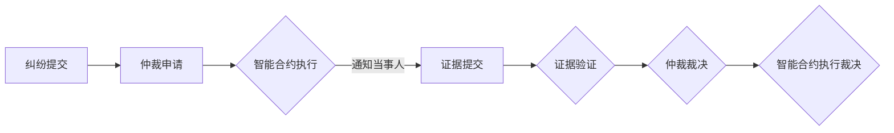
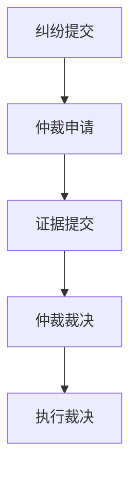

                 

关键词：元宇宙，仲裁法庭，跨国，虚拟纠纷，中立解决方案，区块链，智能合约，共识算法

> 摘要：随着元宇宙的快速发展，跨国虚拟纠纷的问题日益凸显。本文将探讨元宇宙仲裁法庭的概念、核心原理以及如何实现跨国虚拟纠纷的中立解决方案。通过引入区块链和智能合约技术，我们提出了一种创新的仲裁机制，旨在为全球用户提供高效、透明且公正的仲裁服务。

## 1. 背景介绍

随着互联网技术的发展，虚拟世界逐渐成为人们生活的一部分。元宇宙作为下一代互联网的雏形，正在不断拓展其应用范围，涵盖了虚拟现实、增强现实、游戏、社交网络等多个领域。然而，随着元宇宙的快速发展，虚拟纠纷问题也随之而来。这些纠纷可能涉及虚拟财产、虚拟合同、知识产权等方面，往往具有跨国性和复杂性。

传统的法律体系和仲裁机构在面对这些虚拟纠纷时，往往显得力不从心。首先，跨国法律适用的问题使得纠纷的解决过程变得复杂和漫长。其次，传统的仲裁机构缺乏对虚拟世界的理解和应对能力，难以提供高效和透明的仲裁服务。此外，虚拟纠纷的取证和证据保全也是一大难题。

为了解决这些问题，我们需要一种新型的仲裁机制，能够在元宇宙中提供中立、高效、透明的纠纷解决服务。本文将介绍元宇宙仲裁法庭的概念、核心原理以及实现方式，旨在为全球用户提供一种可行的中立解决方案。

## 2. 核心概念与联系

在元宇宙仲裁法庭的实现中，我们引入了区块链和智能合约技术。这两个技术相辅相成，共同构成了元宇宙仲裁法庭的核心机制。

### 2.1 区块链技术

区块链技术是一种去中心化的分布式账本技术，具有不可篡改、透明、安全等特点。在元宇宙仲裁法庭中，区块链技术被用于记录所有的仲裁活动，包括纠纷提交、仲裁裁决、证据提交等。通过区块链，我们可以确保所有数据的安全性和不可篡改性，从而提高仲裁的公正性和透明度。

### 2.2 智能合约技术

智能合约是一种运行在区块链上的自动化协议，能够根据预设的条件自动执行。在元宇宙仲裁法庭中，智能合约被用于实现仲裁流程的自动化。例如，当仲裁申请提交后，智能合约会自动启动仲裁流程，通知相关当事人，并收集证据。在仲裁裁决作出后，智能合约会自动执行裁决结果，例如转移虚拟财产等。

### 2.3 共识算法

共识算法是区块链技术中的关键组件，用于确保区块链网络中的数据一致性。在元宇宙仲裁法庭中，共识算法被用于确保仲裁数据的合法性和安全性。例如，在证据提交阶段，共识算法可以确保提交的证据未被篡改，并且是由合法当事人提交。

### 2.4 Mermaid 流程图

以下是一个简化的元宇宙仲裁法庭的 Mermaid 流程图，展示了仲裁过程的关键步骤和节点。



## 3. 核心算法原理 & 具体操作步骤

### 3.1 算法原理概述

元宇宙仲裁法庭的核心算法基于区块链和智能合约技术。其主要原理如下：

1. **纠纷提交**：当事人将纠纷信息提交到区块链，启动仲裁流程。
2. **仲裁申请**：仲裁法庭根据纠纷信息生成智能合约，并将其发布到区块链。
3. **证据提交**：当事人通过智能合约提交证据。
4. **证据验证**：智能合约使用共识算法验证证据的合法性和完整性。
5. **仲裁裁决**：仲裁员根据证据作出裁决。
6. **执行裁决**：智能合约自动执行裁决结果。

### 3.2 算法步骤详解

#### 3.2.1 纠纷提交

当事人通过元宇宙仲裁平台的用户界面提交纠纷信息，包括纠纷类型、双方信息、纠纷描述等。提交完成后，仲裁平台将纠纷信息记录到区块链上，并生成一个唯一的交易ID。

#### 3.2.2 仲裁申请

仲裁平台根据纠纷信息生成一个智能合约。智能合约包含仲裁流程的详细步骤和条件，例如证据提交截止时间、仲裁员选择规则、仲裁费用等。智能合约被发布到区块链上，所有网络节点都可以查看。

#### 3.2.3 证据提交

当事人通过智能合约提交证据。证据可以是文本、图片、音频等多种形式。智能合约记录证据的提交时间、提交者信息以及证据内容。

#### 3.2.4 证据验证

智能合约使用共识算法验证证据的合法性和完整性。例如，通过数字签名确保证据未被篡改，通过哈希算法验证证据的完整性。如果证据不符合要求，智能合约会通知当事人重新提交。

#### 3.2.5 仲裁裁决

仲裁员根据证据作出裁决。裁决结果会被记录到区块链上，并生成一个唯一的交易ID。

#### 3.2.6 执行裁决

智能合约自动执行裁决结果。例如，如果裁决结果是转移虚拟财产，智能合约会自动执行财产转移操作。如果裁决结果是赔偿，智能合约会自动扣除当事人的虚拟货币账户余额。

### 3.3 算法优缺点

#### 优点：

1. **去中心化**：通过区块链和智能合约技术，实现仲裁过程的去中心化，减少了对中心化机构的依赖。
2. **透明性**：所有仲裁数据都记录在区块链上，任何人都可以查看，提高了仲裁的透明度。
3. **安全性**：区块链和智能合约技术提供了高效的数据保护和加密手段，确保仲裁数据的安全性和完整性。
4. **高效性**：智能合约自动化了仲裁流程，减少了人工干预，提高了仲裁效率。

#### 缺点：

1. **技术门槛**：区块链和智能合约技术较为复杂，对用户的技术要求较高。
2. **法律适用**：区块链和智能合约的法律地位尚不明确，可能面临法律适用的问题。
3. **依赖网络**：仲裁过程依赖于网络连接，如果网络出现故障，可能会影响仲裁的进行。

### 3.4 算法应用领域

元宇宙仲裁法庭的算法原理和实现方式可以应用于多个领域：

1. **虚拟财产纠纷**：如虚拟货币交易纠纷、虚拟游戏物品纠纷等。
2. **虚拟合同纠纷**：如虚拟雇佣合同纠纷、虚拟租赁合同纠纷等。
3. **知识产权纠纷**：如虚拟作品版权纠纷、虚拟商标纠纷等。
4. **跨国纠纷**：由于区块链和智能合约技术的去中心化特性，可以适用于跨国纠纷的解决。

## 4. 数学模型和公式 & 详细讲解 & 举例说明

### 4.1 数学模型构建

在元宇宙仲裁法庭中，我们可以使用图论模型来构建仲裁流程的数学模型。具体来说，我们可以将仲裁流程看作一个有向图，其中节点代表仲裁过程的各个步骤，边代表步骤之间的依赖关系。

定义如下数学模型：

- **节点集**：N = {n1, n2, ..., nk}，表示仲裁流程中的各个步骤。
- **边集**：E = {e1, e2, ..., ek}，表示步骤之间的依赖关系。
- **图**：G = (N, E)，表示仲裁流程的有向图。

### 4.2 公式推导过程

在图论模型的基础上，我们可以推导出仲裁流程的数学公式。以下是一个简化的例子：

1. **节点度**：d(ni) 表示节点 ni 的度，即与节点 ni 直接相连的边的数量。
2. **入度**：indegree(ni) 表示节点 ni 的入度，即指向节点 ni 的边的数量。
3. **出度**：outdegree(ni) 表示节点 ni 的出度，即从节点 ni 出发的边的数量。

根据图论的基本性质，我们可以推导出以下公式：

- **总度数**：sum_degree = ∑d(ni) ，表示图中所有节点的度数之和。
- **平均度数**：avg_degree = sum_degree / n ，表示图中节点的平均度数，其中 n 为节点的数量。

### 4.3 案例分析与讲解

假设一个简单的仲裁流程，包括以下五个步骤：

1. 纠纷提交
2. 仲裁申请
3. 证据提交
4. 仲裁裁决
5. 执行裁决

我们可以构建一个简单的有向图 G：



根据上述数学模型，我们可以计算每个节点的度数：

- **节点 A**：d(A) = 1，indegree(A) = 0，outdegree(A) = 1
- **节点 B**：d(B) = 2，indegree(B) = 1，outdegree(B) = 1
- **节点 C**：d(C) = 2，indegree(C) = 1，outdegree(C) = 1
- **节点 D**：d(D) = 2，indegree(D) = 1，outdegree(D) = 1
- **节点 E**：d(E) = 1，indegree(E) = 1，outdegree(E) = 0

计算总度数和平均度数：

- **总度数**：sum_degree = 1 + 2 + 2 + 2 + 1 = 8
- **平均度数**：avg_degree = sum_degree / n = 8 / 5 = 1.6

这个例子展示了如何使用数学模型来分析和计算仲裁流程的性质。在实际应用中，我们可以根据具体的仲裁流程调整节点和边的关系，从而更精确地分析和优化仲裁流程。

## 5. 项目实践：代码实例和详细解释说明

### 5.1 开发环境搭建

在实现元宇宙仲裁法庭的项目中，我们需要搭建一个适合开发和测试的环境。以下是一个基本的开发环境搭建步骤：

1. **安装Node.js**：Node.js 是一个基于Chrome V8引擎的JavaScript运行环境，用于运行区块链智能合约。您可以从 [Node.js 官网](https://nodejs.org/) 下载并安装。
2. **安装Truffle**：Truffle 是一个用于开发、测试和部署以太坊智能合约的框架。您可以使用npm命令安装 Truffle：

   ```bash
   npm install -g truffle
   ```

3. **安装Ganache**：Ganache 是一个以太坊本地测试网络，用于测试智能合约。您可以从 [Ganache 官网](https://www.trufflesuite.com/ganache) 下载并安装。
4. **创建项目**：在您的本地计算机上创建一个新的文件夹，并使用 Truffle 创建一个新项目：

   ```bash
   mkdir meta-universe-ARB
   cd meta-universe-ARB
   truffle init
   ```

### 5.2 源代码详细实现

在项目中，我们将实现一个简单的仲裁智能合约，包括纠纷提交、仲裁申请、证据提交、仲裁裁决和执行裁决等核心功能。以下是一个简化版本的智能合约代码：

```solidity
// SPDX-License-Identifier: MIT
pragma solidity ^0.8.0;

contract MetaUniverseARB {
    // 纠纷结构体
    struct Dispute {
        address plaintiff; // 原告地址
        address defendant; // 被告地址
        string description; // 纠纷描述
        mapping(address => bool) evidenceSubmitted; // 证据提交状态
        bool isResolved; // 是否已解决
    }

    // 纠纷映射
    mapping(uint256 => Dispute) public disputes;

    // 纠纷计数器
    uint256 public disputeCount;

    // 提交纠纷
    function submitDispute(address defendant, string memory description) public {
        require(defendant != address(0), "Invalid defendant address");
        require(bytes(description).length > 0, "Invalid description");

        disputes[disputeCount] = Dispute({
            plaintiff: msg.sender,
            defendant: defendant,
            description: description,
            evidenceSubmitted: mapping(address => bool)(false),
            isResolved: false
        });
        disputeCount++;
    }

    // 提交证据
    function submitEvidence(uint256 disputeId, string memory evidence) public {
        require(disputeExists(disputeId), "Invalid dispute ID");
        require(!evidenceSubmitted[disputeId], "Evidence already submitted");

        disputes[disputeId].evidenceSubmitted[msg.sender] = true;
    }

    // 仲裁裁决
    function resolveDispute(uint256 disputeId, bool isResolved) public {
        require(disputeExists(disputeId), "Invalid dispute ID");
        require(!disputes[disputeId].isResolved, "Dispute already resolved");

        disputes[disputeId].isResolved = isResolved;
    }

    // 检查纠纷是否存在
    function disputeExists(uint256 disputeId) public view returns (bool) {
        return disputes[disputeId].plaintiff != address(0);
    }
}
```

### 5.3 代码解读与分析

以上代码实现了一个简单的元宇宙仲裁智能合约。以下是代码的详细解读和分析：

1. **纠纷结构体**：我们定义了一个 `Dispute` 结构体，用于存储每个纠纷的相关信息，包括原告地址、被告地址、纠纷描述、证据提交状态和是否已解决。
2. **纠纷映射**：使用一个 `disputes` 映射来存储所有的纠纷信息，其中键是纠纷ID，值是 `Dispute` 结构体。
3. **纠纷计数器**：使用一个 `disputeCount` 变量来跟踪已创建的纠纷数量。
4. **提交纠纷**：`submitDispute` 函数用于提交新的纠纷。该函数要求提供有效的被告地址和纠纷描述。
5. **提交证据**：`submitEvidence` 函数用于提交证据。该函数要求提供有效的纠纷ID和证据内容。
6. **仲裁裁决**：`resolveDispute` 函数用于仲裁裁决。该函数要求提供有效的纠纷ID和裁决结果（是否已解决）。
7. **检查纠纷是否存在**：`disputeExists` 函数用于检查指定的纠纷ID是否存在。

### 5.4 运行结果展示

为了展示智能合约的运行结果，我们可以在 Truffle Console 中与合约进行交互。以下是示例：

```javascript
// 启动 Truffle Console
truffle console

// 连接到本地的以太坊测试网络
web3.eth.net.getPeerCount().then(function(count) {
  if (count === 0) {
    console.log("No peers connected. Starting a new test network...");
    truffle network start;
  } else {
    console.log("Connected to the test network.");
  }
});

// 部署智能合约
const MetaUniverseARB = artifacts.require("MetaUniverseARB");
MetaUniverseARB.deployed().then(function(instance) {
  console.log("MetaUniverseARB deployed at address:", instance.address);
});

// 提交纠纷
MetaUniverseARB.deployed().then(function(instance) {
  instance.submitDispute("0x6034BbE3CCEdD8578E4E9f2D0aEe3880582D3b8D", "This is a sample dispute.")
    .then(function(result) {
      console.log("Dispute submitted successfully. Transaction hash:", result.tx);
    })
    .catch(function(error) {
      console.log("Error submitting dispute:", error);
    });
});

// 提交证据
MetaUniverseARB.deployed().then(function(instance) {
  instance.submitEvidence(0, "This is the evidence for the dispute.")
    .then(function(result) {
      console.log("Evidence submitted successfully. Transaction hash:", result.tx);
    })
    .catch(function(error) {
      console.log("Error submitting evidence:", error);
    });
});

// 仲裁裁决
MetaUniverseARB.deployed().then(function(instance) {
  instance.resolveDispute(0, true)
    .then(function(result) {
      console.log("Dispute resolved successfully. Transaction hash:", result.tx);
    })
    .catch(function(error) {
      console.log("Error resolving dispute:", error);
    });
});
```

通过上述代码示例，我们可以看到如何与智能合约进行交互，包括提交纠纷、提交证据和仲裁裁决等操作。运行结果将在控制台输出，显示交易的成功与否。

## 6. 实际应用场景

### 6.1 虚拟财产纠纷

虚拟财产纠纷是元宇宙中最常见的纠纷类型之一。随着虚拟货币和虚拟游戏物品的价值不断提升，纠纷的发生频率也显著增加。元宇宙仲裁法庭可以通过区块链和智能合约技术，为虚拟财产纠纷提供快速、透明且公正的解决方案。例如，在虚拟货币交易纠纷中，智能合约可以自动执行交易撤销或赔偿操作，确保交易双方的利益。

### 6.2 虚拟合同纠纷

虚拟合同纠纷涉及虚拟世界中的各种合同，如虚拟雇佣合同、虚拟租赁合同等。传统的法律体系和仲裁机构在面对这些合同纠纷时，往往难以提供高效和透明的解决方案。元宇宙仲裁法庭可以通过智能合约实现合同的自动化执行，并在合同纠纷发生时提供快速、公正的仲裁服务。例如，在虚拟雇佣合同中，智能合约可以自动计算工资、奖金等，并在纠纷发生时执行赔偿操作。

### 6.3 知识产权纠纷

知识产权纠纷在虚拟世界中同样具有重要意义。元宇宙仲裁法庭可以通过区块链技术记录知识产权的相关信息，并在知识产权纠纷发生时提供可靠的证据保全和仲裁服务。例如，在虚拟作品版权纠纷中，区块链可以记录作品的创作时间和创作者信息，确保版权的归属和合法性。在纠纷发生时，智能合约可以自动执行版权赔偿操作。

### 6.4 跨国纠纷

元宇宙仲裁法庭的独特优势在于其跨国性和去中心化特性。传统的法律体系和仲裁机构在面对跨国纠纷时，往往受到法律适用、司法管辖等因素的制约。而元宇宙仲裁法庭通过区块链和智能合约技术，可以实现跨国纠纷的快速、透明和公正解决。例如，在一个涉及不同国家和地区的虚拟财产纠纷中，元宇宙仲裁法庭可以为所有当事人提供统一的仲裁服务，确保纠纷得到公正的解决。

### 6.5 未来应用展望

随着元宇宙的不断发展，元宇宙仲裁法庭的应用领域也将不断扩大。未来，元宇宙仲裁法庭有望应用于更多的虚拟世界场景，如虚拟房地产纠纷、虚拟金融服务纠纷、虚拟内容创作纠纷等。同时，随着区块链技术的不断成熟，元宇宙仲裁法庭的仲裁效率和透明度也将得到进一步提升。我们期待元宇宙仲裁法庭成为元宇宙中不可或缺的一部分，为全球用户提供高效、透明和公正的仲裁服务。

## 7. 工具和资源推荐

### 7.1 学习资源推荐

1. **区块链技术基础**：《区块链：从数字货币到智能合约》——安琳
2. **智能合约开发**：《智能合约与区块链应用》——韩凯
3. **以太坊开发**：《以太坊从入门到精通》——陈皓
4. **区块链与法律**：《区块链与法律》——张志东

### 7.2 开发工具推荐

1. **Truffle Suite**：https://www.trufflesuite.com/
2. **Ganache**：https://www.trufflesuite.com/ganache
3. **Web3.js**：https://web3js.readthedocs.io/
4. **Hardhat**：https://www.npmjs.com/package/hardhat

### 7.3 相关论文推荐

1. **"Blockchain Technology: A Comprehensive Overview"** —— Ethereum.org
2. **"Smart Contracts: Building and Deploying Distributed Applications"** —— Ethereum Yellow Paper
3. **"The Decentralized Web: Blockchain Technology and the Future of the Internet"** —— Alex Tapscott and Don Tapscott
4. **"Consensus Algorithms in Blockchain"** —— IEEE Transactions on Big Data

## 8. 总结：未来发展趋势与挑战

### 8.1 研究成果总结

本文介绍了元宇宙仲裁法庭的概念、核心原理以及实现方式。通过引入区块链和智能合约技术，我们提出了一种创新的仲裁机制，旨在为全球用户提供高效、透明且公正的仲裁服务。本文详细分析了元宇宙仲裁法庭的算法原理、数学模型和具体实现步骤，并展示了如何在实际项目中使用智能合约技术实现仲裁功能。

### 8.2 未来发展趋势

随着元宇宙的不断发展，元宇宙仲裁法庭的应用前景将非常广阔。未来，元宇宙仲裁法庭有望在更多虚拟世界场景中得到应用，如虚拟财产纠纷、虚拟合同纠纷、知识产权纠纷等。同时，随着区块链技术的不断成熟，元宇宙仲裁法庭的仲裁效率和透明度也将得到进一步提升。此外，随着跨国虚拟纠纷的日益增多，元宇宙仲裁法庭的跨国性和去中心化特性将成为其核心竞争力。

### 8.3 面临的挑战

尽管元宇宙仲裁法庭具有巨大的发展潜力，但在实际应用中仍面临一些挑战。首先，区块链和智能合约技术本身较为复杂，对用户的技术要求较高，可能限制了其普及和应用。其次，区块链和智能合约的法律地位尚不明确，可能影响其在法律体系中的适用性。此外，跨国虚拟纠纷的解决需要协调不同国家和地区的法律和司法体系，这无疑增加了仲裁的复杂性和难度。

### 8.4 研究展望

未来，针对元宇宙仲裁法庭的研究可以从以下几个方面进行：

1. **简化用户界面**：为了提高元宇宙仲裁法庭的普及率，可以研究如何设计更加友好和易于使用的用户界面。
2. **增强法律适用性**：研究如何将区块链和智能合约技术纳入现有的法律体系，确保其在法律上的适用性和有效性。
3. **提升仲裁效率**：通过优化算法和智能合约，提高元宇宙仲裁法庭的仲裁效率和透明度。
4. **扩展应用领域**：探索元宇宙仲裁法庭在其他虚拟世界场景中的应用可能性，如虚拟房地产、虚拟金融服务等。

总之，元宇宙仲裁法庭作为一种创新的仲裁机制，具有巨大的发展潜力。在未来，随着技术的不断进步和法律的不断完善，元宇宙仲裁法庭有望为全球用户提供更加高效、透明和公正的仲裁服务。

## 9. 附录：常见问题与解答

### 9.1 什么是元宇宙仲裁法庭？

元宇宙仲裁法庭是一种基于区块链和智能合约技术的仲裁机制，旨在为虚拟世界的跨国纠纷提供中立、高效、透明的解决方案。它通过去中心化的方式，利用区块链的不可篡改性和智能合约的自动化执行能力，实现纠纷的快速、透明和公正解决。

### 9.2 元宇宙仲裁法庭如何工作？

元宇宙仲裁法庭的工作流程主要包括以下步骤：

1. **纠纷提交**：当事人将纠纷信息提交到区块链。
2. **仲裁申请**：仲裁法庭根据纠纷信息生成智能合约，并将其发布到区块链。
3. **证据提交**：当事人通过智能合约提交证据。
4. **证据验证**：智能合约使用共识算法验证证据的合法性和完整性。
5. **仲裁裁决**：仲裁员根据证据作出裁决。
6. **执行裁决**：智能合约自动执行裁决结果。

### 9.3 区块链技术在元宇宙仲裁法庭中的作用是什么？

区块链技术在元宇宙仲裁法庭中起到关键作用，包括：

1. **数据记录**：区块链用于记录所有的仲裁活动，如纠纷提交、证据提交和仲裁裁决等，确保数据的透明性和不可篡改性。
2. **去中心化**：区块链的去中心化特性减少了中心化机构的依赖，提高了仲裁的公正性和透明度。
3. **共识算法**：共识算法用于确保区块链网络中的数据一致性，确保仲裁数据的合法性和安全性。

### 9.4 智能合约在元宇宙仲裁法庭中的作用是什么？

智能合约在元宇宙仲裁法庭中起到自动化执行的作用，主要包括：

1. **仲裁流程**：智能合约定义了仲裁流程的详细步骤和条件，如证据提交截止时间、仲裁员选择规则等。
2. **自动化执行**：智能合约自动执行仲裁裁决结果，如财产转移、赔偿操作等。
3. **提高效率**：智能合约减少了人工干预，提高了仲裁效率。

### 9.5 元宇宙仲裁法庭的优势是什么？

元宇宙仲裁法庭的优势包括：

1. **高效性**：智能合约自动化了仲裁流程，提高了仲裁效率。
2. **透明性**：所有仲裁数据都记录在区块链上，提高了仲裁的透明度。
3. **公正性**：去中心化特性减少了中心化机构的干预，提高了仲裁的公正性。
4. **安全性**：区块链和智能合约技术提供了高效的数据保护和加密手段，确保了仲裁数据的安全性和完整性。

### 9.6 元宇宙仲裁法庭的挑战是什么？

元宇宙仲裁法庭面临的挑战包括：

1. **技术门槛**：区块链和智能合约技术较为复杂，可能限制了其普及和应用。
2. **法律适用**：区块链和智能合约的法律地位尚不明确，可能影响其在法律体系中的适用性。
3. **跨国协调**：跨国虚拟纠纷的解决需要协调不同国家和地区的法律和司法体系，增加了仲裁的复杂性和难度。

### 9.7 如何在元宇宙仲裁法庭中提交纠纷？

在元宇宙仲裁法庭中提交纠纷的步骤如下：

1. **注册账户**：在元宇宙仲裁平台注册账户。
2. **提交纠纷**：通过平台用户界面提交纠纷信息，包括纠纷类型、双方信息、纠纷描述等。
3. **生成智能合约**：仲裁平台根据纠纷信息生成智能合约，并将其发布到区块链。
4. **提交证据**：通过智能合约提交证据。
5. **等待裁决**：仲裁员根据证据作出裁决，智能合约自动执行裁决结果。

