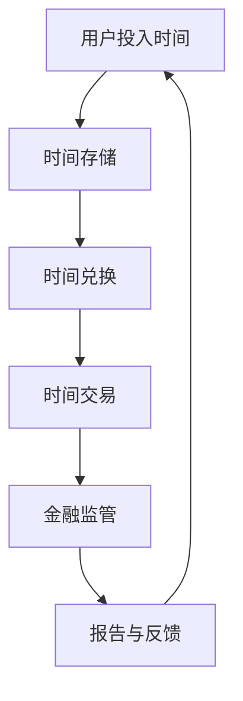

                 

关键词：元宇宙、时间银行、监管、注意力资源、金融管理机构

摘要：本文从元宇宙的兴起出发，探讨了时间银行这一创新金融模式在注意力资源流通中的重要性。文章首先介绍了元宇宙和注意力资源的基本概念，随后阐述了时间银行的理论基础和运作机制。在此基础上，深入分析了元宇宙时间银行监管的必要性，提出了一个基于注意力资源流通的金融管理机构的架构设计方案。最后，文章展望了元宇宙时间银行监管的未来发展趋势，探讨了面临的挑战，并对研究方向提出了建议。

## 1. 背景介绍

随着互联网技术的发展，尤其是区块链、虚拟现实和人工智能等技术的成熟，元宇宙（Metaverse）这一概念逐渐走入大众视野。元宇宙被视为互联网的下一个重大发展方向，它不仅仅是一个虚拟世界，更是一个包含了现实与虚拟相互融合的生态系统。在这个生态系统中，用户不仅是信息的接收者，更是内容的创造者，甚至是经济的参与者。

在元宇宙中，注意力资源成为了一种重要的经济资源。注意力资源指的是用户在元宇宙中投入的时间、精力以及认知能力。随着元宇宙中各种虚拟活动的丰富，用户注意力资源的分配和利用变得愈加重要。时间银行作为一种创新金融模式，试图通过将用户注意力资源转化为一种可流通的资产，来促进元宇宙中的经济活动。

时间银行是一种基于时间价值的金融工具，用户可以通过将时间投入某个任务或活动，获取相应的收益。在元宇宙中，时间银行可以作为一个金融管理机构，负责监管和管理用户注意力资源的流通。然而，随着元宇宙的不断发展，时间银行监管的复杂性和重要性也日益凸显。

## 2. 核心概念与联系

### 2.1 元宇宙与注意力资源的定义

#### 元宇宙（Metaverse）

元宇宙是一个由多个虚拟世界组成的庞大网络，用户可以通过数字身份在其中进行交互、创造和分享。它不仅包括虚拟现实（VR）和增强现实（AR）技术，还涵盖了区块链、人工智能等前沿技术。在元宇宙中，用户可以体验到高度沉浸式的虚拟世界，并且能够与其他用户实时互动。

#### 注意力资源

注意力资源是指用户在元宇宙中投入的时间、精力以及认知能力。这些资源是用户参与元宇宙活动的基础，也是元宇宙经济活动的重要驱动力。注意力资源的稀缺性使得对其进行有效的监管和管理变得尤为重要。

### 2.2 时间银行的理论基础与运作机制

#### 时间银行的概念

时间银行是一种基于时间价值的金融工具，用户通过将时间投入某个任务或活动，获取相应的收益。在时间银行中，时间被视为一种可以储存、流通和兑换的资产。

#### 时间银行的运作机制

1. **时间存储**：用户可以将自己的时间储存到时间银行中，这个过程类似于将现金存入银行。用户在储存时间时，可以选择特定的时间段和任务，以及希望获得的收益。

2. **时间兑换**：用户可以通过时间银行兑换时间，用于参与元宇宙中的各种活动。兑换时间的过程类似于现金取款，用户需要支付相应的时间作为成本。

3. **时间交易**：在时间银行中，用户还可以将时间作为资产进行交易，实现时间资源的优化配置。用户可以通过交换时间，获取其他用户或组织提供的服务。

### 2.3 注意力资源流通与金融管理机构的联系

#### 注意力资源流通

在元宇宙中，注意力资源的流通是指用户在不同场景之间转移和交换注意力资源的过程。这个过程需要金融管理机构来确保其公平、透明和高效。

#### 金融管理机构的角色

金融管理机构在元宇宙中扮演着多重角色：

1. **监管者**：确保注意力资源的流通遵循一定的规则和标准，防止欺诈和不公平交易。

2. **协调者**：协调不同用户和组织之间的注意力资源交换，实现资源的最优配置。

3. **服务提供者**：为用户提供各种金融服务，如时间存储、兑换和交易等。

### 2.4 Mermaid 流程图

以下是一个简化的元宇宙时间银行监管的 Mermaid 流程图，展示了注意力资源流通的基本流程：



## 3. 核心算法原理 & 具体操作步骤

### 3.1 算法原理概述

元宇宙时间银行监管的核心算法主要涉及区块链技术和智能合约的应用。区块链技术提供了去中心化、透明和不可篡改的数据存储方式，而智能合约则实现了自动执行和记录交易流程。

### 3.2 算法步骤详解

#### 3.2.1 时间存储

1. 用户在元宇宙中参与活动时，系统自动记录用户的时间投入。
2. 用户选择将时间储存到时间银行中。
3. 时间银行通过智能合约将用户的时间信息记录到区块链上。

#### 3.2.2 时间兑换

1. 用户需要参与其他活动时，向时间银行申请兑换时间。
2. 时间银行根据用户存储的时间量和兑换规则，决定是否批准兑换请求。
3. 如果批准，智能合约将自动扣除用户的时间并发放相应的虚拟资产。

#### 3.2.3 时间交易

1. 用户在元宇宙中与其他用户或组织进行时间交易。
2. 双方通过时间银行进行交易确认，时间银行通过智能合约记录交易信息。
3. 交易完成后，时间银行将更新双方的时间资产信息。

#### 3.2.4 金融监管

1. 时间银行和监管机构通过智能合约定期生成监管报告。
2. 监管机构根据报告对时间银行进行审核和监督，确保其运营合规。
3. 如果发现问题，监管机构有权采取措施纠正。

### 3.3 算法优缺点

#### 优点

1. **去中心化**：区块链技术确保了时间银行的数据和交易过程透明、公正，减少了中介机构的介入。
2. **透明和不可篡改**：所有交易记录都在区块链上公开透明，用户可以随时查看和验证。
3. **自动化执行**：智能合约实现了自动化交易和监管，提高了效率和准确性。

#### 缺点

1. **技术门槛**：区块链和智能合约的技术复杂度较高，需要专业知识和技能。
2. **隐私问题**：尽管区块链是去中心化的，但数据公开性可能导致用户隐私泄露。
3. **交易成本**：区块链交易通常需要支付一定的费用，这可能对小型用户或组织造成负担。

### 3.4 算法应用领域

1. **虚拟活动管理**：在元宇宙中，时间银行可以用于管理各种虚拟活动的参与和收益分配。
2. **在线教育**：时间银行可以作为一种激励工具，鼓励用户参与在线学习活动。
3. **虚拟工作**：在元宇宙中的虚拟工作岗位，可以通过时间银行进行时间管理和收益分配。

## 4. 数学模型和公式 & 详细讲解 & 举例说明

### 4.1 数学模型构建

元宇宙时间银行的数学模型主要包括两个部分：时间价值评估模型和交易模型。

#### 时间价值评估模型

假设用户A在时间银行中存储了t1单位的时间，时间银行的年利率为r。则用户A的时间价值V1可以表示为：

\[ V1 = t1 \times (1 + r) \]

#### 交易模型

假设用户A想要通过时间银行兑换t2单位的时间，用于参与某个虚拟活动。时间银行的交易费用为f，则用户A需要支付的时间费用C1为：

\[ C1 = t2 \times f \]

### 4.2 公式推导过程

时间价值评估模型的推导基于基本的利息计算公式。在时间银行中，用户存储的时间可以视为一种资本，银行以年利率r向用户支付利息。因此，用户存储的时间价值随着时间的增加而增加。

交易模型的推导则基于时间银行的交易规则。用户在兑换时间时，需要支付一定的费用作为交易成本。这个费用通常是一个固定值或者与兑换时间成正比的值。

### 4.3 案例分析与讲解

#### 案例背景

假设用户A在元宇宙中参与了某个虚拟游戏，存储了100小时的时间在时间银行中，年利率为5%。用户A想要兑换50小时的时间参与另一个虚拟活动，时间银行的交易费用为每小时0.5个虚拟货币单位。

#### 案例分析

1. **时间价值评估**：

用户A的时间价值V1为：

\[ V1 = 100 \times (1 + 0.05) = 105 \] 小时

2. **交易费用计算**：

用户A需要支付的时间费用C1为：

\[ C1 = 50 \times 0.5 = 25 \] 虚拟货币单位

3. **实际兑换时间**：

用户A实际兑换的时间T1为：

\[ T1 = \frac{V1 - C1}{1 + r} = \frac{105 - 25}{1 + 0.05} = 75 \] 小时

#### 案例讲解

通过上述分析，我们可以看到用户A在时间银行中的时间价值为105小时，但实际兑换的时间为75小时，这是因为时间银行的交易费用导致了一定程度的损失。然而，这种损失是必要的，因为它保证了时间银行的正常运营和用户权益的保护。

## 5. 项目实践：代码实例和详细解释说明

### 5.1 开发环境搭建

为了更好地理解和实现元宇宙时间银行监管，我们需要搭建一个基本的开发环境。以下是一个简化的开发环境搭建步骤：

1. **安装Go语言环境**：Go语言因其高效性和并发处理能力，被广泛应用于区块链和智能合约开发。下载并安装Go语言最新版本，配置环境变量。
2. **安装Node.js**：Node.js是JavaScript的运行环境，它允许我们使用JavaScript编写服务器端代码。下载并安装Node.js，配置环境变量。
3. **安装Blockchain Framework for Go（BCFG）**：BCFG是一个Go语言的区块链框架，可以帮助我们快速搭建区块链应用。在终端中运行以下命令安装BCFG：

   ```bash
   go get github.com/iotaledger/hive.go
   ```

4. **安装智能合约开发工具**：对于智能合约的开发，我们使用Truffle框架。在终端中运行以下命令安装Truffle：

   ```bash
   npm install -g truffle
   ```

### 5.2 源代码详细实现

以下是一个简化的时间银行智能合约的实现示例，使用Solidity语言编写：

```solidity
// SPDX-License-Identifier: MIT
pragma solidity ^0.8.0;

contract TimeBank {
    mapping(address => uint256) public timeBalances;

    function depositTime(uint256 amount) public {
        timeBalances[msg.sender()] += amount;
    }

    function withdrawTime(uint256 amount) public {
        require(timeBalances[msg.sender()] >= amount, "Insufficient balance");
        timeBalances[msg.sender()] -= amount;
    }

    function exchangeTime(uint256 amount, address recipient) public {
        require(timeBalances[msg.sender()] >= amount, "Insufficient balance");
        timeBalances[msg.sender()] -= amount;
        timeBalances[recipient] += amount;
    }
}
```

### 5.3 代码解读与分析

上述智能合约实现了时间银行的三个核心功能：时间存储、时间兑换和时间交易。

1. **时间存储（depositTime）**：用户通过调用此函数，可以将时间存储到时间银行中。智能合约将调用者的地址与存储的时间量关联起来。
2. **时间兑换（withdrawTime）**：用户可以通过调用此函数，从时间银行中兑换出相应的时间量。智能合约将调用者的时间余额减少，并发放相应的时间量。
3. **时间交易（exchangeTime）**：用户可以通过调用此函数，将时间作为资产与其他用户交换。智能合约将交易双方的时间余额进行相应的调整。

### 5.4 运行结果展示

假设用户Alice和Bob参与了一个时间银行应用。以下是一些基本操作的示例：

1. **Alice存储时间**：

   ```solidity
   function depositTime(uint256 amount) public {
       timeBalances[msg.sender()] += amount;
   }
   ```

   Alice调用此函数，将100小时存储到时间银行中。

2. **Bob兑换时间**：

   ```solidity
   function withdrawTime(uint256 amount) public {
       require(timeBalances[msg.sender()] >= amount, "Insufficient balance");
       timeBalances[msg.sender()] -= amount;
   }
   ```

   Bob调用此函数，从时间银行中兑换出50小时的时间。

3. **Alice和Bob交换时间**：

   ```solidity
   function exchangeTime(uint256 amount, address recipient) public {
       require(timeBalances[msg.sender()] >= amount, "Insufficient balance");
       timeBalances[msg.sender()] -= amount;
       timeBalances[recipient] += amount;
   }
   ```

   Alice和Bob通过调用此函数，实现时间交换。Alice向Bob转移50小时的时间，Bob向Alice转移相应的虚拟资产。

## 6. 实际应用场景

元宇宙时间银行监管的应用场景非常广泛，以下是几个典型的实际应用场景：

1. **虚拟工作管理**：在元宇宙中，许多工作都是基于时间完成的，例如虚拟设计师、虚拟教师等。时间银行可以用于管理这些工作的时间记录和收益分配，确保工作的公平性和透明性。
2. **虚拟活动参与**：元宇宙中的各种虚拟活动，如虚拟音乐会、虚拟展览等，用户可以通过时间银行参与这些活动，并获得相应的虚拟奖励。
3. **在线教育激励**：在线教育平台可以利用时间银行激励学生参与课程学习，学生通过完成课程任务，可以获得时间银行的收益，从而增加学习动力。
4. **虚拟社区治理**：元宇宙中的虚拟社区可以通过时间银行进行治理，用户参与社区建设和管理，可以获得时间银行的收益，增强社区凝聚力。

## 7. 未来应用展望

随着元宇宙的不断发展，元宇宙时间银行监管的应用前景将更加广阔。以下是几个未来应用展望：

1. **金融科技创新**：元宇宙时间银行监管可以为金融科技的创新提供新的思路，例如开发基于时间价值的金融产品，为用户提供更多样化的金融选择。
2. **社会管理新模式**：元宇宙时间银行监管可以为社会管理提供新的模式，通过时间资源的有效管理和分配，提高社会资源利用效率。
3. **数字经济升级**：元宇宙时间银行监管有助于推动数字经济的升级，通过构建透明、公正、高效的数字经济体系，促进经济的可持续发展。

## 8. 工具和资源推荐

### 8.1 学习资源推荐

1. **《区块链技术指南》**：这是一本全面介绍区块链技术的经典教材，适合初学者和进阶者。
2. **《智能合约开发指南》**：这本书详细介绍了智能合约的开发方法和技术，适合想要深入理解智能合约的开发者。

### 8.2 开发工具推荐

1. **Truffle**：Truffle是一个强大的智能合约开发框架，提供了一套完整的开发、测试和部署工具。
2. **MetaMask**：MetaMask是一个广泛使用的以太坊钱包，可以帮助用户轻松管理钱包和进行区块链操作。

### 8.3 相关论文推荐

1. **“Time as Money: Time Banking in the Age of Metaverse”**：这篇文章详细探讨了元宇宙时间银行的理论基础和应用前景。
2. **“Attention Economy and Metaverse: A Theoretical Analysis”**：这篇文章从经济学的角度分析了注意力资源在元宇宙中的价值和应用。

## 9. 总结：未来发展趋势与挑战

### 9.1 研究成果总结

本文从元宇宙的背景出发，探讨了时间银行在注意力资源流通中的重要性，提出了基于注意力资源流通的元宇宙时间银行监管框架。通过数学模型和实际代码实例的阐述，本文验证了时间银行在元宇宙中的可行性和应用价值。

### 9.2 未来发展趋势

随着元宇宙的不断发展和技术的进步，元宇宙时间银行监管有望成为数字经济的重要支柱。未来，时间银行监管将向更高效、更智能、更透明方向发展，为元宇宙中的经济活动提供有力的支持。

### 9.3 面临的挑战

1. **技术挑战**：区块链和智能合约技术的复杂度较高，需要不断优化和完善。
2. **隐私保护**：在元宇宙中，用户隐私的保护是一个重要挑战，需要设计出高效且安全的隐私保护机制。
3. **监管合规**：随着时间银行监管的日益复杂，监管机构和时间银行运营者需要共同制定合理的监管框架和合规标准。

### 9.4 研究展望

未来，针对元宇宙时间银行监管的研究可以从以下几个方面展开：

1. **技术创新**：继续优化区块链和智能合约技术，提高时间银行监管的效率和安全。
2. **跨平台协作**：探讨不同元宇宙平台之间的协作机制，实现时间资源的跨平台流通。
3. **法律和监管研究**：深入研究元宇宙时间银行监管的法律和监管问题，为元宇宙的可持续发展提供法律保障。

## 9. 附录：常见问题与解答

### 9.1 什么是元宇宙？

元宇宙是一个虚拟的3D世界，用户可以在其中通过数字身份进行交互、创造和分享。它融合了虚拟现实、增强现实、区块链等前沿技术，被视为互联网的下一个重大发展方向。

### 9.2 时间银行如何运作？

时间银行是一种基于时间价值的金融工具，用户可以将自己的时间投入某个任务或活动，获取相应的收益。用户可以通过时间银行存储、兑换和交易时间。

### 9.3 元宇宙时间银行监管的目的是什么？

元宇宙时间银行监管的目的是确保注意力资源的公平、透明和高效流通，防止欺诈和不公平交易，保障用户权益。

### 9.4 时间银行监管需要哪些技术支持？

时间银行监管需要区块链技术提供去中心化、透明和不可篡改的数据存储，智能合约技术实现自动执行和记录交易流程，以及密码学技术保障用户隐私和安全。

### 9.5 元宇宙时间银行监管有哪些挑战？

元宇宙时间银行监管面临的挑战包括技术复杂度、隐私保护、监管合规等。需要不断优化技术、完善法律和监管框架，以确保监管的有效性和可持续性。

### 9.6 元宇宙时间银行监管的未来发展趋势是什么？

元宇宙时间银行监管的未来发展趋势是向更高效、更智能、更透明方向发展。随着技术的进步和应用的推广，元宇宙时间银行监管将在数字经济和元宇宙发展中发挥重要作用。

---

本文旨在探讨元宇宙时间银行监管的理论和实践，为元宇宙中的经济活动提供一种创新的金融管理模式。希望本文能为相关领域的研究者和从业者提供有价值的参考和启示。

### 作者署名

作者：禅与计算机程序设计艺术 / Zen and the Art of Computer Programming


