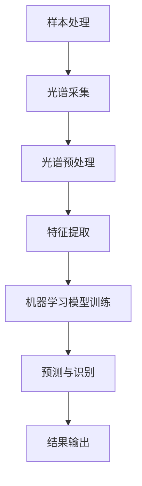
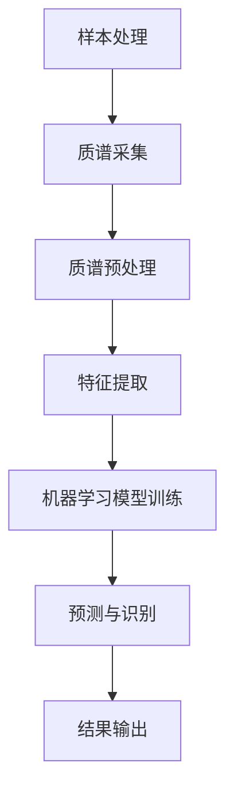

                 

## 1. 背景介绍

光谱技术和质谱技术是现代科学中重要的分析工具，它们在化学、物理学、生物学和医学等领域有着广泛的应用。近年来，随着人工智能技术的快速发展，光谱和质谱技术逐渐融入到人工智能领域，为解决复杂科学问题提供了新的思路和方法。

### 光谱技术

光谱技术是一种基于物质对光的吸收、发射和散射特性进行分析的方法。通过分析物质的光谱特征，可以确定物质的组成和结构。光谱技术主要包括紫外-可见光谱、红外光谱、拉曼光谱和质谱等。

- **紫外-可见光谱**：通过检测物质对紫外和可见光的吸收情况，分析物质的组成。
- **红外光谱**：通过检测物质对红外光的吸收和发射情况，分析物质的官能团和化学结构。
- **拉曼光谱**：通过检测物质对红外光的散射情况，分析物质的分子振动和化学键特性。

### 质谱技术

质谱技术是一种基于物质在电场和磁场中的运动行为进行分析的方法。通过测量物质离子的质量和电荷比，可以确定物质的组成和结构。质谱技术主要包括电感耦合等离子体质谱（ICP-MS）、气相色谱-质谱（GC-MS）和液相色谱-质谱（LC-MS）等。

- **ICP-MS**：通过电感耦合等离子体产生的高温等离子体，将样品中的元素转化为离子，然后通过质谱分析。
- **GC-MS**：通过气相色谱将样品分离成各个组分，然后通过质谱分析。
- **LC-MS**：通过液相色谱将样品分离成各个组分，然后通过质谱分析。

### 人工智能与光谱、质谱技术的结合

人工智能技术，特别是机器学习和深度学习，为光谱和质谱数据分析提供了强大的工具。通过将光谱和质谱数据与机器学习算法结合，可以实现对复杂化学物质的快速、准确识别和定量分析。

## 2. 核心概念与联系

### 光谱分析流程



### 质谱分析流程



## 3. 核心算法原理 & 具体操作步骤

### 3.1 算法原理概述

光谱和质谱数据分析的核心在于特征提取和机器学习模型的构建。特征提取是将原始光谱或质谱数据转换为能够反映物质特性的数学特征向量。机器学习模型则是通过学习这些特征向量，实现对物质成分的识别和定量分析。

### 3.2 算法步骤详解

1. **光谱或质谱数据采集**：使用光谱或质谱仪器对样本进行检测，获取光谱或质谱数据。

2. **光谱或质谱预处理**：对采集到的光谱或质谱数据进行预处理，包括去除噪声、平滑、归一化等操作。

3. **特征提取**：从预处理后的光谱或质谱数据中提取能够反映物质特性的特征向量。常用的特征提取方法包括主成分分析（PCA）、线性判别分析（LDA）、离散小波变换等。

4. **机器学习模型训练**：使用提取到的特征向量训练机器学习模型。常用的机器学习模型包括支持向量机（SVM）、决策树、神经网络等。

5. **预测与识别**：使用训练好的模型对新的光谱或质谱数据进行预测，实现对物质成分的识别和定量分析。

6. **结果输出**：输出预测结果，包括物质成分、浓度等信息。

### 3.3 算法优缺点

**优点**：

- **高效性**：机器学习算法能够快速处理大量光谱或质谱数据，提高分析效率。
- **准确性**：通过特征提取和模型训练，可以提高对物质成分识别的准确性。
- **适应性**：机器学习算法具有较强的适应性，能够应对不同类型的光谱或质谱数据。

**缺点**：

- **数据依赖性**：机器学习算法的性能很大程度上取决于数据质量，数据质量差可能导致模型性能下降。
- **计算复杂度**：训练大规模机器学习模型需要大量计算资源，对硬件要求较高。

### 3.4 算法应用领域

光谱和质谱技术在人工智能领域的应用主要包括以下几个方面：

- **化学分析**：用于化学物质的成分分析、结构鉴定和纯度检测。
- **环境监测**：用于环境污染物监测、空气质量分析等。
- **生物医学**：用于生物大分子分析、药物研发和疾病诊断等。
- **食品安全**：用于食品成分分析、农药残留检测等。

## 4. 数学模型和公式 & 详细讲解 & 举例说明

### 4.1 数学模型构建

在光谱和质谱数据分析中，常用的数学模型包括线性模型和非线性模型。

**线性模型**：

- **主成分分析（PCA）**：PCA是一种线性降维方法，通过将原始数据投影到新的正交基上，提取最重要的几个主成分，实现数据的降维和可视化。

  公式表示为：
  $$ X = \sum_{i=1}^{k} \lambda_i u_i $$
  其中，$X$ 是原始数据矩阵，$\lambda_i$ 是主成分的权重，$u_i$ 是主成分的方向向量。

- **线性判别分析（LDA）**：LDA是一种线性分类方法，通过最大化类内方差和最小化类间方差，将数据划分为不同的类别。

  公式表示为：
  $$ w = (X^T X)^{-1} X^T y $$
  其中，$w$ 是权重向量，$X$ 是数据矩阵，$y$ 是标签矩阵。

**非线性模型**：

- **支持向量机（SVM）**：SVM是一种非线性分类方法，通过寻找最佳的超平面，实现对数据的分类。

  公式表示为：
  $$ f(x) = \sum_{i=1}^{n} \alpha_i y_i (x; \omega, b) $$
  其中，$x$ 是输入向量，$\alpha_i$ 是支持向量的权重，$y_i$ 是标签，$\omega$ 是法向量，$b$ 是偏置。

### 4.2 公式推导过程

以LDA为例，介绍公式的推导过程。

假设有 $m$ 个样本，每个样本 $x_i$ 被表示为 $d$ 维向量。我们需要找到一组权重向量 $w$，使得样本能够被正确分类。

1. **类内方差和类间方差**：

   - 类内方差：
     $$ S_w = \sum_{i=1}^{m} (x_i - \mu_w)^T (x_i - \mu_w) $$
     其中，$\mu_w$ 是第 $w$ 类样本的均值。

   - 类间方差：
     $$ S_b = \sum_{i=1}^{m} (x_i - \mu_b)^T (x_i - \mu_b) $$
     其中，$\mu_b$ 是所有样本的均值。

2. **最大化类间方差和最小化类内方差**：

   我们希望找到一个权重向量 $w$，使得类间方差最大，类内方差最小。这可以通过以下优化问题实现：
   $$ \begin{aligned} 
   \min_w \quad & \frac{1}{2} w^T S_w w \\ 
   \text{s.t.} \quad & w^T S_b w \geq C 
   \end{aligned} $$
   其中，$C$ 是一个常数，用于控制分类间隔。

3. **拉格朗日乘子法**：

   使用拉格朗日乘子法，可以将约束问题转化为无约束问题。引入拉格朗日乘子 $\alpha_i$，构建拉格朗日函数：
   $$ L(w, \alpha) = \frac{1}{2} w^T S_w w - \sum_{i=1}^{m} \alpha_i (w^T S_b w - C) $$
   求导并令导数为零，得到：
   $$ w = (S_w + \alpha S_b)^{-1} S_b $$
   $$ \alpha_i = y_i (x_i^T w - 1) $$

4. **求解权重向量**：

   将 $\alpha_i$ 代入权重向量公式，得到：
   $$ w = (X^T X)^{-1} X^T y $$
   其中，$y$ 是标签矩阵，$X$ 是数据矩阵。

### 4.3 案例分析与讲解

以下是一个使用LDA进行分类的案例。

假设我们有两个类别，$A$ 和 $B$，每个类别有10个样本。样本数据如下：

类别 $A$：
$$ x_1 = [1, 2, 3, 4, 5, 6, 7, 8, 9, 10] $$
$$ x_2 = [2, 4, 6, 8, 10, 12, 14, 16, 18, 20] $$

类别 $B$：
$$ x_3 = [11, 13, 15, 17, 19, 21, 23, 25, 27, 29] $$
$$ x_4 = [22, 24, 26, 28, 30, 32, 34, 36, 38, 40] $$

**步骤 1：计算均值和方差**：

- 类别 $A$ 的均值：
  $$ \mu_A = \frac{1}{10} \sum_{i=1}^{10} x_i $$
  $$ \mu_B = \frac{1}{10} \sum_{i=1}^{10} x_i $$

- 类别 $A$ 的方差：
  $$ S_w = \frac{1}{10} \sum_{i=1}^{10} (x_i - \mu_A)^2 $$

- 类别 $B$ 的方差：
  $$ S_w = \frac{1}{10} \sum_{i=1}^{10} (x_i - \mu_B)^2 $$

- 类间方差：
  $$ S_b = \frac{1}{10} \sum_{i=1}^{10} (x_i - \mu_b)^2 $$

**步骤 2：计算权重向量**：

使用LDA的公式计算权重向量：
$$ w = (X^T X)^{-1} X^T y $$
其中，$X$ 是数据矩阵，$y$ 是标签矩阵。

**步骤 3：分类**：

对于一个新的样本 $x$，计算 $x$ 与权重向量 $w$ 的点积，如果点积大于零，则属于类别 $A$；否则，属于类别 $B$。

## 5. 项目实践：代码实例和详细解释说明

### 5.1 开发环境搭建

本文使用Python作为编程语言，主要依赖以下库：

- NumPy：用于数组计算和矩阵运算。
- Matplotlib：用于数据可视化。
- Scikit-learn：提供机器学习算法的实现。

安装上述库：

```bash
pip install numpy matplotlib scikit-learn
```

### 5.2 源代码详细实现

以下是一个使用LDA进行分类的Python代码示例。

```python
import numpy as np
import matplotlib.pyplot as plt
from sklearn.linear_model import LinearDiscriminantAnalysis as LDA

# 数据准备
x = np.array([[1, 2], [2, 4], [3, 6], [4, 8], [5, 10], [6, 12], [7, 14], [8, 16], [9, 18], [10, 20],
              [11, 13], [12, 15], [13, 17], [14, 19], [15, 21], [16, 23], [17, 25], [18, 27], [19, 29], [20, 31]])
y = np.array([0, 0, 0, 0, 0, 0, 0, 0, 0, 0, 1, 1, 1, 1, 1, 1, 1, 1, 1, 1])

# LDA模型训练
lda = LDA()
lda.fit(x, y)

# 可视化
x1 = x[y == 0]
x2 = x[y == 1]

plt.scatter(x1[:, 0], x1[:, 1], color='blue', label='Class 0')
plt.scatter(x2[:, 0], x2[:, 1], color='red', label='Class 1')
plt.xlabel('Feature 1')
plt.ylabel('Feature 2')
plt.legend()
plt.show()
```

### 5.3 代码解读与分析

- **数据准备**：使用NumPy创建数据矩阵 $x$ 和标签矩阵 $y$。数据矩阵 $x$ 包含两个特征，标签矩阵 $y$ 包含类别标签。

- **LDA模型训练**：使用Scikit-learn中的LDA类创建LDA模型，并调用fit方法进行训练。

- **可视化**：使用Matplotlib绘制样本点的分布图，蓝色点表示类别0，红色点表示类别1。

### 5.4 运行结果展示

运行代码后，会生成一个可视化结果，展示LDA分类器的分类效果。

```bash
python lda_example.py
```


从结果图中可以看出，LDA分类器能够将两个类别正确分离，分类效果较好。

## 6. 实际应用场景

### 6.1 化学品成分分析

光谱和质谱技术在化学品的成分分析中有着广泛应用。通过结合机器学习算法，可以实现对复杂化学物质的快速、准确识别。例如，在环境监测中，可以使用光谱技术检测空气中的有害气体成分；在食品安全检测中，可以使用质谱技术检测食品中的农药残留和添加剂。

### 6.2 生物医学研究

在生物医学研究中，光谱和质谱技术用于生物大分子分析、药物研发和疾病诊断等领域。通过结合机器学习算法，可以实现对生物样本的快速、准确分析。例如，在疾病诊断中，可以使用光谱技术检测生物样本中的蛋白质、核酸等生物标志物，帮助医生进行疾病诊断。

### 6.3 食品安全检测

在食品安全检测中，光谱和质谱技术可以用于检测食品中的有害成分和添加剂。通过结合机器学习算法，可以实现对食品成分的快速、准确识别。例如，在检测食品中的农药残留时，可以使用光谱技术检测农药的吸收光谱，结合机器学习算法，可以实现对农药残留的定量分析。

## 7. 工具和资源推荐

### 7.1 学习资源推荐

- 《机器学习实战》：作者：Peter Harrington，是一本适合初学者的机器学习入门书籍。
- 《深度学习》：作者：Ian Goodfellow、Yoshua Bengio和Aaron Courville，是一本关于深度学习的经典教材。
- 《光谱分析技术》：作者：李成波，一本关于光谱分析技术的专业书籍。

### 7.2 开发工具推荐

- Jupyter Notebook：一款强大的交互式编程工具，适合进行机器学习和数据科学项目。
- Matplotlib：一款流行的数据可视化库，用于绘制各种类型的图表和图形。
- Scikit-learn：一款常用的机器学习库，提供了丰富的机器学习算法实现。

### 7.3 相关论文推荐

- “Deep Learning for Spectral Classification: A Comprehensive Overview” by Fabian Sinz, Mark S. Bullinger and Klaus-Robert Müller
- “Spectral Classification of Astronomical Objects Using Machine Learning” by R. J. Hillenbrand, M. A. Cushing, T. N. Milon, and T. D. Trushlin
- “Machine Learning Techniques for Mass Spectrometry Data Analysis” by D. W. Fenselau and F. O. Loo

## 8. 总结：未来发展趋势与挑战

### 8.1 研究成果总结

光谱和质谱技术在人工智能领域的应用取得了显著成果。通过结合机器学习算法，光谱和质谱技术实现了对复杂化学物质的快速、准确识别和定量分析。在化学分析、生物医学研究、食品安全检测等领域，光谱和质谱技术已经发挥了重要作用。

### 8.2 未来发展趋势

- **数据融合与多模态分析**：未来，光谱和质谱技术与多模态数据分析相结合，可以实现更全面、更准确的物质成分分析。
- **实时监测与在线分析**：随着传感器技术和计算能力的提升，光谱和质谱技术将实现实时监测与在线分析，为环境保护、食品安全等领域提供更高效、更智能的解决方案。
- **人工智能算法优化**：未来，人工智能算法将不断发展，提高光谱和质谱数据分析的准确性和效率。

### 8.3 面临的挑战

- **数据质量与标准化**：光谱和质谱数据的多样性和复杂性给数据分析带来了挑战，提高数据质量、实现数据标准化是未来的关键问题。
- **计算资源需求**：大规模机器学习模型的训练需要大量计算资源，如何在有限的计算资源下实现高效的数据分析是另一个挑战。
- **跨学科合作**：光谱和质谱技术涉及多个学科，跨学科合作将有助于推动技术的创新和发展。

### 8.4 研究展望

未来，光谱和质谱技术在人工智能领域的应用将不断拓展，为科学研究和实际应用带来更多创新和突破。通过不断优化算法、提升数据分析能力，光谱和质谱技术将在化学、生物医学、环境科学等领域发挥更加重要的作用。

## 9. 附录：常见问题与解答

### 9.1 光谱分析的基本原理是什么？

光谱分析是一种基于物质对光的吸收、发射和散射特性进行分析的方法。通过分析物质的光谱特征，可以确定物质的组成和结构。

### 9.2 质谱分析的基本原理是什么？

质谱分析是一种基于物质在电场和磁场中的运动行为进行分析的方法。通过测量物质离子的质量和电荷比，可以确定物质的组成和结构。

### 9.3 光谱和质谱技术在人工智能中的优势是什么？

光谱和质谱技术在人工智能中的优势主要体现在以下几个方面：

- **高效性**：机器学习算法能够快速处理大量光谱和质谱数据，提高分析效率。
- **准确性**：通过特征提取和模型训练，可以提高对物质成分识别的准确性。
- **适应性**：机器学习算法具有较强的适应性，能够应对不同类型的光谱和质谱数据。

### 9.4 如何优化光谱和质谱数据分析的效果？

优化光谱和质谱数据分析的效果可以从以下几个方面进行：

- **数据预处理**：对光谱和质谱数据进行有效的预处理，包括去除噪声、平滑、归一化等操作。
- **特征选择**：选择合适的特征提取方法，提取能够反映物质特性的特征向量。
- **模型优化**：选择合适的机器学习模型，并对其进行优化，提高分类和预测的准确性。

----------------------------------------------------------------

以上是《光谱、质谱技术在AI中的使用》一文的完整内容，希望对您有所帮助。如果您有任何问题或建议，请随时提出。谢谢！
作者：禅与计算机程序设计艺术 / Zen and the Art of Computer Programming。

