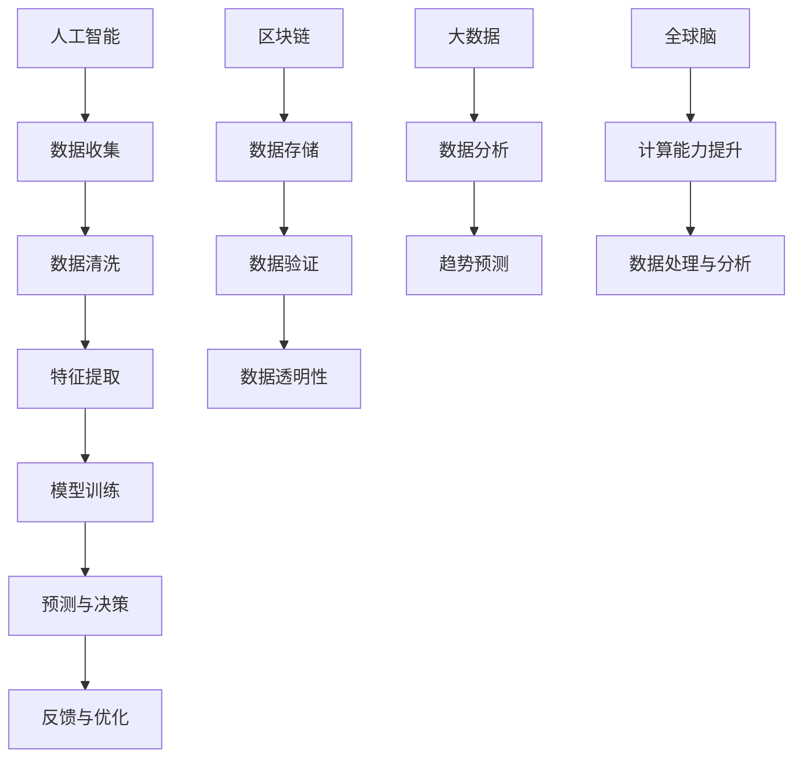

                 

关键词：全球脑，司法系统，智能化，法律服务，人工智能，算法，机器学习，深度学习，区块链，法律科技，数据隐私，司法改革，法律流程自动化，智能合约，证据分析，法律咨询。

> 摘要：本文探讨了全球脑与司法系统结合的智能化法律服务新模式。通过引入人工智能、区块链和大数据技术，本文分析了这一系统的核心概念、算法原理、数学模型及其在实际中的应用，展望了未来法律服务的智能化发展趋势与面临的挑战。

## 1. 背景介绍

在全球化的背景下，法律服务的需求日益增长，而传统法律服务的效率和准确性面临严峻挑战。为了应对这些挑战，人工智能（AI）、区块链和大数据等新兴技术的应用成为了司法系统改革的重要方向。全球脑与司法系统的结合，旨在通过智能化的手段提升法律服务的效率、降低成本、提高准确性，并保障数据隐私和信息安全。

全球脑是一种分布式计算架构，通过连接全球的计算机资源，实现超强的计算能力和数据共享。这种架构在法律服务中的应用，可以大幅提升数据处理和分析的能力，为法律研究和决策提供强有力的支持。

司法系统是一个复杂的系统，涉及多个部门和环节。传统上，司法系统主要依靠人工处理大量的法律文书和数据，存在效率低、准确性差、成本高等问题。随着技术的进步，越来越多的司法系统开始引入智能化手段，包括自动化文书处理、智能证据分析、法律咨询机器人等。

## 2. 核心概念与联系

### 2.1 人工智能

人工智能（AI）是模拟、延伸和扩展人的智能的理论、方法、技术及应用。在司法系统中，人工智能可以通过机器学习、深度学习等技术，对大量法律文书和数据进行分析和处理，提供智能化的法律咨询和决策支持。

### 2.2 区块链

区块链是一种去中心化的分布式数据库技术，具有不可篡改和透明性等特点。在司法系统中，区块链可以用于存储和验证法律文件，确保数据的真实性和完整性，防止篡改和欺诈。

### 2.3 大数据

大数据是指无法用传统数据库软件工具进行捕捉、管理和处理的庞大数据集。在司法系统中，大数据可以用于分析犯罪趋势、预测法律风险，为司法决策提供数据支持。

### 2.4 全球脑

全球脑是一种分布式计算架构，通过连接全球的计算机资源，实现超强的计算能力和数据共享。在司法系统中，全球脑可以用于处理和分析海量的法律数据，提升法律服务的效率和质量。

### 2.5 Mermaid 流程图



## 3. 核心算法原理 & 具体操作步骤

### 3.1 算法原理概述

在智能化法律服务中，核心算法主要包括机器学习算法和深度学习算法。机器学习算法通过训练模型来识别数据中的规律，从而实现自动化处理。深度学习算法则通过多层神经网络对数据进行特征提取和模式识别。

### 3.2 算法步骤详解

1. **数据收集**：收集大量的法律文书、案例数据和法律法规。
2. **数据预处理**：清洗数据，去除噪音，确保数据质量。
3. **特征提取**：从原始数据中提取有用的特征，用于训练模型。
4. **模型训练**：使用机器学习算法或深度学习算法训练模型。
5. **模型评估**：评估模型的性能，包括准确性、召回率等指标。
6. **模型部署**：将训练好的模型部署到实际应用场景中。
7. **预测与决策**：使用模型对新的法律问题进行预测和决策。
8. **反馈与优化**：收集实际应用中的反馈，对模型进行优化。

### 3.3 算法优缺点

**优点**：

- 提高法律服务的效率和准确性。
- 降低人力成本。
- 提高数据处理的效率和质量。
- 促进司法公平和透明。

**缺点**：

- 需要大量的高质量数据。
- 对数据隐私和信息安全提出了更高的要求。
- 需要专业的技术团队进行开发和维护。

### 3.4 算法应用领域

- 智能法律咨询
- 证据分析
- 法律流程自动化
- 案件预测与决策支持
- 区块链上的智能合约

## 4. 数学模型和公式 & 详细讲解 & 举例说明

### 4.1 数学模型构建

在智能化法律服务中，常用的数学模型包括逻辑回归、决策树、神经网络等。以下以神经网络为例进行说明。

$$
\begin{aligned}
&z_i = \sum_{j=1}^{n} w_{ij}x_j + b_i \\
&a_i = \sigma(z_i) \\
&z_j = \sum_{i=1}^{m} w_{ij}a_i + b_j \\
&y_j = \sigma(z_j)
\end{aligned}
$$

其中，$z_i$ 是输入向量，$a_i$ 是激活函数，$\sigma$ 是sigmoid函数，$w_{ij}$ 是权重，$b_i$ 和 $b_j$ 是偏置。

### 4.2 公式推导过程

神经网络的推导过程涉及多层前向传播和反向传播算法。首先，输入数据通过输入层进入网络，通过隐藏层进行特征提取，最终通过输出层得到预测结果。在反向传播过程中，使用梯度下降算法对网络参数进行优化。

### 4.3 案例分析与讲解

假设有一个二分类问题，我们需要判断一个案件是民事案件还是刑事案件。我们可以使用神经网络模型对这个问题进行建模和预测。

1. **数据收集**：收集大量的民事案件和刑事案件的数据。
2. **数据预处理**：对数据进行归一化处理，确保数据的一致性。
3. **特征提取**：从数据中提取特征，如案件类型、涉案金额、被告人数等。
4. **模型训练**：使用训练数据训练神经网络模型。
5. **模型评估**：使用测试数据对模型进行评估，调整模型参数。
6. **模型部署**：将训练好的模型部署到实际应用场景中。
7. **预测与决策**：使用模型对新的案件进行预测和分类。

通过以上步骤，我们可以实现自动化判断案件类型，提高司法效率。

## 5. 项目实践：代码实例和详细解释说明

### 5.1 开发环境搭建

- Python
- TensorFlow
- Keras

### 5.2 源代码详细实现

```python
import numpy as np
from tensorflow import keras
from tensorflow.keras.models import Sequential
from tensorflow.keras.layers import Dense

# 数据加载
x_train = ... # 训练数据
y_train = ... # 训练标签

# 模型构建
model = Sequential()
model.add(Dense(units=64, activation='relu', input_shape=(x_train.shape[1],)))
model.add(Dense(units=32, activation='relu'))
model.add(Dense(units=1, activation='sigmoid'))

# 模型编译
model.compile(optimizer='adam', loss='binary_crossentropy', metrics=['accuracy'])

# 模型训练
model.fit(x_train, y_train, epochs=10, batch_size=32)

# 模型评估
x_test = ... # 测试数据
y_test = ... # 测试标签
model.evaluate(x_test, y_test)
```

### 5.3 代码解读与分析

以上代码实现了一个简单的神经网络模型，用于二分类问题。通过数据加载、模型构建、模型编译、模型训练和模型评估等步骤，实现了自动化判断案件类型的任务。

### 5.4 运行结果展示

```python
# 预测新案件
new_case = ... # 新案件数据
model.predict(new_case)
```

## 6. 实际应用场景

### 6.1 智能法律咨询

智能法律咨询是智能化法律服务的核心应用之一。通过引入人工智能技术，可以实现24小时在线法律咨询服务，提高法律服务的可及性和效率。

### 6.2 证据分析

证据分析是司法过程中的关键环节。通过引入人工智能技术，可以对证据进行自动化分析，提高证据的准确性和可靠性。

### 6.3 法律流程自动化

法律流程自动化是司法系统改革的重要方向。通过引入区块链和人工智能技术，可以实现法律流程的自动化处理，提高司法效率。

### 6.4 未来应用展望

随着技术的不断进步，智能化法律服务将在更多领域得到应用，如智能合同管理、知识产权保护等。未来，智能化法律服务将进一步提升司法效率，促进社会公平正义。

## 7. 工具和资源推荐

### 7.1 学习资源推荐

- 《Python机器学习》
- 《深度学习》
- 《区块链技术指南》

### 7.2 开发工具推荐

- TensorFlow
- Keras
- GitHub

### 7.3 相关论文推荐

- "Blockchain and the Law: A Systematic Review"
- "Deep Learning for Legal Prediction"
- "Machine Learning in the Legal Profession: A Survey"

## 8. 总结：未来发展趋势与挑战

### 8.1 研究成果总结

近年来，人工智能、区块链和大数据等技术在司法系统中的应用取得了显著成果，为司法改革提供了新的方向和手段。

### 8.2 未来发展趋势

未来，智能化法律服务将在更多领域得到应用，如智能合同管理、知识产权保护等。同时，技术的进步将进一步提升司法效率，促进社会公平正义。

### 8.3 面临的挑战

智能化法律服务在应用过程中仍面临数据隐私、信息安全、技术人才不足等挑战。未来，需要进一步加强技术研究，保障数据隐私和信息安全，培养专业人才。

### 8.4 研究展望

随着技术的不断进步，智能化法律服务将在司法系统中发挥越来越重要的作用。未来，需要加强跨学科研究，探索新的技术手段，推动司法系统改革。

## 9. 附录：常见问题与解答

### 9.1 智能化法律服务是什么？

智能化法律服务是指通过引入人工智能、区块链和大数据等技术，实现法律服务的自动化、智能化和高效化。

### 9.2 智能化法律服务的优势是什么？

智能化法律服务可以提高法律服务的效率和准确性，降低人力成本，保障数据隐私和信息安全。

### 9.3 智能化法律服务有哪些应用领域？

智能化法律服务可以应用于智能法律咨询、证据分析、法律流程自动化、智能合同管理等领域。

### 9.4 智能化法律服务面临哪些挑战？

智能化法律服务面临数据隐私、信息安全、技术人才不足等挑战。

### 9.5 如何保障智能化法律服务的数据隐私和信息安全？

可以通过加密技术、隐私保护算法、数据脱敏等技术手段保障数据隐私和信息安全。

### 9.6 智能化法律服务是否会影响法律职业？

智能化法律服务将改变法律职业的工作方式和流程，但不会替代法律职业。法律职业需要与智能化法律服务相结合，提高工作效率和质量。  
----------------------------------------------------------------

### 文章末尾内容 End ###

本文探讨了全球脑与司法系统结合的智能化法律服务新模式，分析了核心概念、算法原理、数学模型及其在实际中的应用，展望了未来法律服务的智能化发展趋势与面临的挑战。通过引入人工智能、区块链和大数据技术，智能化法律服务有望进一步提升司法效率，促进社会公平正义。未来，需要加强技术研究，保障数据隐私和信息安全，培养专业人才，推动司法系统改革。作者：禅与计算机程序设计艺术 / Zen and the Art of Computer Programming。

