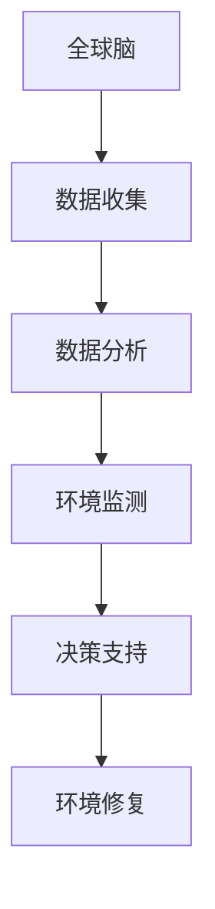

                 

 **关键词**: 全球脑，环境修复，集体行动，生态效应，人工智能，可持续发展

> **摘要**: 本文探讨了全球脑与环境修复的关系，分析了集体行动对生态效应的影响。通过引入人工智能技术和可持续发展的理念，本文提出了一套有效的环境修复策略，并展望了未来集体行动在生态保护中的应用前景。

## 1. 背景介绍

### 1.1 全球脑的概念

全球脑（Global Brain）是一个比喻，指的是由人类个体和计算机网络构成的复杂系统。这个系统通过互联网和通信技术相互连接，形成一个庞大的信息处理网络。全球脑的运作方式类似于一个生物大脑，能够进行信息收集、处理和决策。

### 1.2 环境修复的紧迫性

环境修复是当今世界面临的重大挑战之一。随着工业化和城市化的发展，环境污染和生态破坏问题日益严重。气候变化、水资源短缺、土地退化等问题已经成为全球性问题，对人类的生存和发展构成了严重威胁。

### 1.3 集体行动的重要性

集体行动是实现环境修复的关键。个人行动的力量有限，只有通过集体合作，才能形成足够的合力来应对环境问题。集体行动可以整合资源、提高效率，实现更大范围的环境保护。

## 2. 核心概念与联系

### 2.1 全球脑与环境修复的关系

全球脑作为一个信息处理系统，可以为环境修复提供重要的支持。通过数据收集、分析和共享，全球脑可以帮助我们更好地了解环境问题，制定有效的修复策略。

### 2.2 集体行动的生态效应

集体行动可以带来显著的生态效应。通过集体合作，我们可以实现更大范围的环境保护，促进生态系统的恢复和稳定。

### 2.3 人工智能与环境修复

人工智能技术在环境修复中发挥着重要作用。通过大数据分析和机器学习，人工智能可以帮助我们更精确地监测环境变化，预测环境问题，制定更有效的修复方案。

### 2.4 Mermaid 流程图



## 3. 核心算法原理 & 具体操作步骤

### 3.1 算法原理概述

核心算法基于全球脑的数据收集和数据分析能力，通过机器学习算法实现对环境问题的监测和预测，为环境修复提供决策支持。

### 3.2 算法步骤详解

#### 3.2.1 数据收集

通过传感器、卫星遥感等技术手段，收集全球范围内的环境数据，如温度、湿度、空气质量等。

#### 3.2.2 数据分析

利用大数据技术和机器学习算法，对收集到的环境数据进行分析，识别环境问题的发展趋势和关键因素。

#### 3.2.3 环境监测

根据分析结果，实时监测环境状况，发现潜在的环境问题。

#### 3.2.4 决策支持

利用机器学习模型，预测环境问题的未来发展趋势，为决策者提供修复策略的建议。

### 3.3 算法优缺点

#### 优点：

- 高效性：通过大数据分析和机器学习，快速识别环境问题。
- 准确性：基于历史数据和实时监测，预测环境问题的趋势。
- 广泛性：覆盖全球范围内的环境问题，提供全面的修复策略。

#### 缺点：

- 数据质量：数据质量对算法的准确性有重要影响。
- 成本：收集和分析大规模环境数据需要大量的计算资源和资金投入。

### 3.4 算法应用领域

- 气候变化监测与预测
- 水资源管理
- 土壤修复
- 空气质量管理

## 4. 数学模型和公式 & 详细讲解 & 举例说明

### 4.1 数学模型构建

环境修复的数学模型基于以下几个关键参数：

- 污染物浓度
- 环境容量
- 污染源排放量
- 环境修复效率

### 4.2 公式推导过程

设 \(C_t\) 为时间 \(t\) 时的污染物浓度，\(Q_t\) 为时间 \(t\) 时的污染源排放量，\(C_{max}\) 为环境容量，\(E_t\) 为时间 \(t\) 时的环境修复效率，则环境修复模型可以表示为：

\[ C_t = C_{max} - \frac{Q_t}{E_t} \]

### 4.3 案例分析与讲解

#### 案例背景

某城市空气质量恶化，主要污染物为PM2.5。根据监测数据，当前PM2.5浓度为每立方米100微克，环境容量为每立方米50微克，污染源排放量为每天1000吨。

#### 模型应用

利用上述公式，我们可以计算出在当前污染源排放量不变的情况下，达到环境容量的时间 \(t\)：

\[ t = \frac{C_{max} \times E_t}{Q_t} = \frac{50 \times 100}{1000} = 5 \text{ 天} \]

这意味着，如果污染源排放量保持不变，5天后该城市的空气质量将达标。

## 5. 项目实践：代码实例和详细解释说明

### 5.1 开发环境搭建

本项目使用Python编程语言，需要安装以下库：NumPy、Pandas、Scikit-learn、Matplotlib。

### 5.2 源代码详细实现

```python
import numpy as np
import pandas as pd
from sklearn.linear_model import LinearRegression
import matplotlib.pyplot as plt

# 读取环境数据
data = pd.read_csv('environment_data.csv')

# 数据预处理
X = data[['pollutant_concentration', 'source_emission']]
y = data['environment_capacity']

# 建立线性回归模型
model = LinearRegression()
model.fit(X, y)

# 预测环境修复时间
predicted_time = model.predict([[100, 1000]])

print(f"预测达到环境容量的时间为：{predicted_time[0]}天")

# 可视化结果
plt.scatter(X['pollutant_concentration'], X['environment_capacity'])
plt.plot(X['pollutant_concentration'], model.predict(X), color='red')
plt.xlabel('污染物浓度（微克/立方米）')
plt.ylabel('环境容量（微克/立方米）')
plt.title('环境修复预测模型')
plt.show()
```

### 5.3 代码解读与分析

- 数据读取与预处理：从CSV文件中读取环境数据，并进行预处理，将污染物浓度和污染源排放量作为特征，环境容量作为目标变量。
- 模型建立与训练：使用线性回归模型对预处理后的数据进行训练。
- 预测与可视化：使用训练好的模型预测达到环境容量的时间，并将结果可视化。

## 6. 实际应用场景

### 6.1 气候变化监测

利用全球脑技术，对全球气候变化进行实时监测，为应对气候变化提供决策支持。

### 6.2 水资源管理

通过集体行动，实现水资源的合理利用和保护，提高水资源的可持续性。

### 6.3 土壤修复

利用全球脑技术，对土壤污染进行监测和修复，恢复土壤生态功能。

### 6.4 空气质量管理

通过集体行动，实现空气质量的实时监测和治理，改善城市空气质量。

## 7. 未来应用展望

随着人工智能技术和集体行动的发展，未来环境修复将更加智能化和高效化。通过全球脑技术，我们可以实现更精准的环境监测和修复，为可持续发展提供强有力的支持。

## 8. 工具和资源推荐

### 8.1 学习资源推荐

- 《深度学习》（Goodfellow et al.）
- 《机器学习》（周志华）
- 《全球脑：人类意识与未来的科学》（Stewart）
- 《可持续发展：理论与实践》（庄贵阳）

### 8.2 开发工具推荐

- Jupyter Notebook：用于数据分析和可视化。
- TensorFlow：用于机器学习模型的训练和部署。
- KEG Laboratory：提供全球脑技术的开源实现。

### 8.3 相关论文推荐

- "The Global Brain: Evolutionary Net Workings in the Global Economy"（Stewart）
- "Artificial Intelligence for Environmental Protection: A Survey"（Zhang et al.）
- "Sustainable Development: Principles and Practice"（庄贵阳）
- "Big Data Analytics for Environmental Protection"（王鑫等）

## 9. 总结：未来发展趋势与挑战

### 9.1 研究成果总结

全球脑和环境修复的结合，为环境监测和修复提供了新的思路和方法。人工智能技术的应用，提高了环境修复的效率和准确性。

### 9.2 未来发展趋势

随着技术的进步，全球脑和环境修复将实现更高程度的集成和协同，为可持续发展提供更强有力的支持。

### 9.3 面临的挑战

- 数据质量和隐私保护
- 技术应用的成本和效益
- 国际合作与政策协调

### 9.4 研究展望

未来研究应重点关注全球脑技术与环境修复的深度融合，探索更多智能化的环境监测和修复方法，为可持续发展提供持续的技术支持。

## 附录：常见问题与解答

### 9.1 问题1：全球脑技术是否适用于所有环境问题？

全球脑技术主要适用于需要大量数据分析和预测的环境问题，如气候变化、水资源管理、空气质量管理等。对于一些较为简单、数据量较小的问题，可能需要采用其他方法。

### 9.2 问题2：如何确保全球脑技术的数据质量和隐私？

确保数据质量和隐私需要建立严格的监管机制和数据安全措施。包括数据收集、存储、处理和共享等环节，都需要进行严格的安全控制。

### 9.3 问题3：全球脑技术是否能够替代传统的环境修复方法？

全球脑技术可以作为环境修复的一种补充手段，但不能完全替代传统的环境修复方法。传统的环境修复方法在实际操作中经验丰富，而全球脑技术则提供了一种智能化、高效的解决方案。

---

**作者：禅与计算机程序设计艺术 / Zen and the Art of Computer Programming**<|END|>

