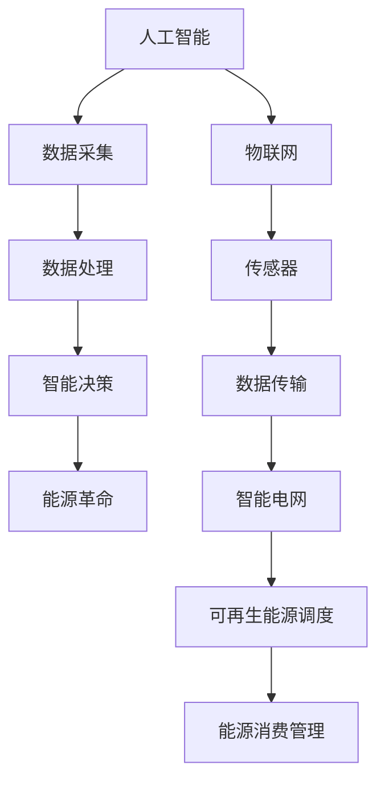
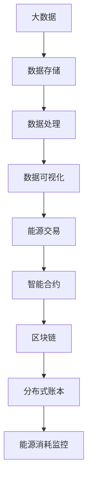
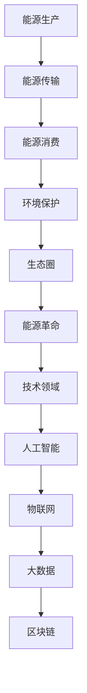

                 

关键词：全球脑、能源革命、集体智慧、绿色未来、信息技术

> 摘要：本文将探讨全球脑与能源革命之间的紧密联系，以及集体智慧如何推动绿色未来的实现。通过阐述核心概念、算法原理、数学模型、项目实践和未来应用，本文旨在为读者提供一个全面而深入的理解，并引发对集体智慧驱动下绿色未来技术的思考。

## 1. 背景介绍

随着全球气候变化和环境问题的日益严重，能源革命成为各国政府和科技界关注的焦点。传统化石能源的过度依赖不仅导致了大量的温室气体排放，还引发了严重的环境破坏。因此，寻找替代能源和实现能源高效利用成为当务之急。与此同时，信息技术的迅猛发展，特别是人工智能和物联网技术的普及，为能源革命提供了强大的技术支持。

全球脑（Global Brain）概念由霍金等科学家提出，指的是一个由人类和机器共同构成的智能网络。这一概念强调了集体智慧在决策、创新和资源分配等方面的巨大潜力。将全球脑与能源革命相结合，可以通过集体智慧和大数据分析实现能源的高效利用和绿色转型。

### 全球脑的概念

全球脑是指由人类和机器构成的智能网络，它通过互联网和其他通信技术相互连接。这个网络中的每一个节点都可以是个人、企业、机器或者传感器。全球脑的目标是实现信息的快速传递、智能化的决策和全球资源的最优配置。

### 能源革命的背景

能源革命旨在通过技术创新和制度变革，实现能源的高效利用和可持续发展。当前，全球能源消费主要集中在化石燃料，特别是煤炭、石油和天然气。然而，这些传统化石能源的过度开采和消耗导致了严重的环境问题，如气候变化、空气污染和水资源短缺。因此，开发清洁能源和实现能源高效利用成为能源革命的核心目标。

### 全球脑与能源革命的关系

全球脑与能源革命之间存在紧密的联系。一方面，全球脑的集体智慧和大数据分析能力可以为能源革命提供科学的决策支持。通过分析海量数据，可以识别能源消耗的瓶颈和优化能源配置的方法。另一方面，能源革命的成功实施需要全球脑的支持，如智能电网的建设、可再生能源的调度和能源消费的智能管理。

## 2. 核心概念与联系

为了更好地理解全球脑与能源革命之间的关系，我们需要探讨其中的核心概念和原理。以下是核心概念及其联系：

### 2.1 人工智能与物联网

人工智能（AI）和物联网（IoT）是推动全球脑发展的关键技术。AI技术可以用于数据处理、模式识别和智能决策，而IoT则通过传感器和数据采集设备实现物理世界与数字世界的连接。这两者的结合为能源革命提供了强大的技术支持，如图所示：



### 2.2 大数据和区块链

大数据和区块链技术是支撑全球脑的重要基础设施。大数据提供了海量数据存储和处理的手段，而区块链则通过分布式账本技术实现数据的安全共享和透明管理。在能源革命中，大数据和区块链可以用于能源交易的透明化、智能合约的实施和能源消耗的精准监控，如图所示：



### 2.3 生态圈与生态系统

全球脑与能源革命的关系可以类比为生态圈与生态系统。生态圈是指由生物、环境和生物之间相互作用构成的复杂系统，而生态系统则是生态圈中特定物种的生存环境。在全球脑与能源革命中，生态圈代表了能源生产、传输、消费和环境保护的整个链条，而生态系统则是指能源革命中的各个技术领域，如图所示：



通过这些核心概念和原理的阐述，我们可以更好地理解全球脑与能源革命之间的紧密联系，以及集体智慧在推动绿色未来中的重要作用。

## 3. 核心算法原理 & 具体操作步骤

在理解了全球脑与能源革命的核心概念后，接下来我们将探讨其中的核心算法原理，并详细介绍其具体操作步骤。

### 3.1 算法原理概述

全球脑与能源革命中的核心算法主要包括能量优化算法、机器学习算法和博弈论算法。这些算法通过分析海量数据、模拟能源系统运行和优化决策过程，实现能源的高效利用和绿色转型。

#### 能量优化算法

能量优化算法是一种基于能量守恒原理的优化算法，它通过模拟能量在网络中的流动，寻找最优的能量配置方案。能量优化算法的核心思想是：在网络中的各个节点之间分配能量，使得整体能量利用率最大化。该算法广泛应用于智能电网、可再生能源调度和能源消费管理等领域。

#### 机器学习算法

机器学习算法是一种通过训练模型来模拟人类学习过程的算法，它可以在海量数据中自动发现规律和模式。在能源革命中，机器学习算法可以用于预测能源需求、优化能源生产和提高能源效率。常见的机器学习算法包括线性回归、决策树、支持向量机和深度学习等。

#### 博弈论算法

博弈论算法是一种基于博弈理论的方法，它用于分析多个决策者之间的相互作用和策略选择。在能源革命中，博弈论算法可以用于能源市场的价格预测、能源交易的策略制定和能源规划的决策支持。

### 3.2 算法步骤详解

以下将详细介绍能量优化算法、机器学习算法和博弈论算法的具体操作步骤。

#### 3.2.1 能量优化算法

能量优化算法的基本步骤如下：

1. 数据采集：收集网络中的各个节点的能量需求和供应数据。
2. 数据预处理：对采集到的数据进行清洗、归一化和特征提取，为后续分析做准备。
3. 模型建立：根据能量守恒原理，建立能量流动的数学模型。
4. 目标函数定义：定义目标函数，通常为整体能量利用率最大化。
5. 求解过程：利用优化算法（如遗传算法、粒子群算法等），求解能量优化模型。
6. 结果评估：评估优化结果，如能量利用率、成本等。

#### 3.2.2 机器学习算法

机器学习算法的基本步骤如下：

1. 数据收集：收集与能源需求、生产和消费相关的数据。
2. 数据预处理：对数据进行清洗、归一化和特征提取，为模型训练做准备。
3. 模型选择：根据问题类型和特点选择合适的机器学习模型（如线性回归、决策树、支持向量机等）。
4. 模型训练：利用训练数据对模型进行训练，得到参数估计值。
5. 模型评估：利用测试数据评估模型性能，如准确率、召回率等。
6. 模型优化：根据评估结果调整模型参数，提高模型性能。

#### 3.2.3 博弈论算法

博弈论算法的基本步骤如下：

1. 确定参与者：识别参与能源市场的各个决策者，如能源供应商、消费者和监管机构。
2. 构建博弈模型：根据参与者的策略和收益，建立博弈模型。
3. 策略分析：分析各个参与者的最佳策略，如纳什均衡、混合策略等。
4. 决策支持：根据博弈模型的结果，为能源市场的参与者提供决策支持。
5. 结果评估：评估博弈模型在现实中的应用效果，如市场稳定性、经济效益等。

通过这些具体操作步骤，我们可以利用核心算法实现全球脑与能源革命的目标，推动绿色未来的实现。

### 3.3 算法优缺点

每种算法都有其优缺点，以下是能量优化算法、机器学习算法和博弈论算法的优缺点分析：

#### 能量优化算法

优点：

1. 基于能量守恒原理，能够实现能量的高效利用。
2. 能够模拟复杂网络中的能量流动，适用于智能电网、可再生能源调度等领域。

缺点：

1. 对数据质量要求较高，需要大量准确的数据支持。
2. 求解过程可能需要较长时间，对计算资源要求较高。

#### 机器学习算法

优点：

1. 能够从海量数据中自动发现规律和模式，提高能源预测和优化的准确性。
2. 适用于多种能源应用场景，如能源需求预测、能源生产和消费管理。

缺点：

1. 模型训练和优化过程可能需要大量计算资源。
2. 模型解释性较弱，难以直观理解模型的决策过程。

#### 博弈论算法

优点：

1. 能够分析多个决策者之间的相互作用和策略选择，提供决策支持。
2. 适用于能源市场分析、价格预测和能源规划等领域。

缺点：

1. 需要明确的博弈模型和参与者，适用范围有限。
2. 分析结果可能依赖于模型参数和假设，难以保证完全准确。

### 3.4 算法应用领域

能量优化算法、机器学习算法和博弈论算法在能源革命中的应用非常广泛，以下是具体的应用领域：

#### 能量优化算法

1. 智能电网：优化电力网络的能量配置，提高电网运行效率和可靠性。
2. 可再生能源调度：优化可再生能源的发电和调度，实现能源的高效利用。
3. 能源消费管理：优化能源消费结构，降低能源消耗和成本。

#### 机器学习算法

1. 能源需求预测：利用历史数据预测未来能源需求，为能源生产和消费提供参考。
2. 能源生产优化：根据实时数据和预测结果，优化能源生产过程，提高能源效率。
3. 能源消费管理：通过数据分析，优化能源消费模式，降低能源浪费。

#### 博弈论算法

1. 能源市场分析：分析市场参与者的策略和行为，预测市场趋势。
2. 能源价格预测：根据市场数据和历史价格，预测能源价格变化。
3. 能源规划：为能源生产和消费提供决策支持，实现能源的可持续发展。

通过这些算法的应用，全球脑与能源革命的目标将得以实现，推动绿色未来的到来。

## 4. 数学模型和公式 & 详细讲解 & 举例说明

在能源革命中，数学模型和公式起着至关重要的作用。它们能够帮助我们准确地描述能量流动、优化能源配置，并预测能源需求和供应。以下将详细介绍几个关键的数学模型和公式，并进行详细的讲解和举例说明。

### 4.1 数学模型构建

在构建数学模型时，我们需要考虑以下几个基本要素：

1. **变量定义**：明确模型中的变量，如能源需求、供应、价格、效率等。
2. **目标函数**：定义优化目标，如最大化能源利用率、最小化能源成本等。
3. **约束条件**：设定模型中的限制条件，如能量守恒定律、设备容量限制等。
4. **模型参数**：确定模型中的参数，如能源价格、设备效率等。

#### 能量优化模型

以下是一个简单的能量优化模型：

```latex
\begin{align*}
\text{最大化} & \quad Z = \sum_{i=1}^{n} P_i \cdot E_i \\
\text{约束条件} & \quad \sum_{i=1}^{n} E_i \cdot C_i = E_{total} \\
& \quad 0 \leq E_i \leq E_{max,i} \quad \forall i=1,2,\ldots,n \\
\end{align*}
```

其中，$P_i$表示第$i$种能源的价格，$E_i$表示第$i$种能源的消耗量，$C_i$表示第$i$种能源的容量，$E_{total}$表示总能源需求，$E_{max,i}$表示第$i$种能源的最大消耗量。

#### 供需模型

供需模型用于分析能源市场的供需关系。以下是一个简单的供需模型：

```latex
\begin{align*}
D(P) &= a - bP \\
S(P) &= c + dP
\end{align*}
```

其中，$D(P)$表示需求量，$S(P)$表示供应量，$a$、$b$、$c$、$d$为参数。

### 4.2 公式推导过程

以下将详细推导两个关键公式的推导过程。

#### 能量守恒定律

能量守恒定律是能量优化模型的基础。它的推导过程如下：

```latex
\begin{align*}
\sum_{i=1}^{n} E_i \cdot C_i &= \sum_{i=1}^{n} (P_i \cdot E_i) \\
&\Rightarrow \sum_{i=1}^{n} C_i \cdot E_i = E_{total} \\
\end{align*}
```

其中，$E_i$表示第$i$种能源的消耗量，$C_i$表示第$i$种能源的容量，$E_{total}$表示总能源需求。

#### 供需平衡公式

供需平衡公式用于描述市场需求和供应之间的平衡关系。其推导过程如下：

```latex
\begin{align*}
D(P) &= S(P) \\
a - bP &= c + dP \\
\Rightarrow P &= \frac{a - c}{b + d}
\end{align*}
```

其中，$D(P)$表示需求量，$S(P)$表示供应量，$a$、$b$、$c$、$d$为参数。

### 4.3 案例分析与讲解

以下将通过一个实际案例来分析数学模型在能源革命中的应用。

#### 案例背景

假设一个城市需要满足以下能源需求：

- 电力需求：500 MW
- 燃气需求：100 GJ/d
- 天然气需求：20 MMcf/d

该城市的能源来源包括电力、燃气和天然气，其价格分别为$0.1/kWh$、$3/GJ$和$2/MMcf$。

#### 模型构建

根据上述需求，我们可以构建一个简单的能量优化模型：

```latex
\begin{align*}
\text{最大化} & \quad Z = P_e \cdot E_e + P_g \cdot E_g + P_n \cdot E_n \\
\text{约束条件} & \quad E_e + E_g + E_n = E_{total} \\
& \quad 0 \leq E_e \leq E_{max,e} \\
& \quad 0 \leq E_g \leq E_{max,g} \\
& \quad 0 \leq E_n \leq E_{max,n} \\
\end{align*}
```

其中，$P_e$、$P_g$、$P_n$分别为电力、燃气和天然气的价格，$E_e$、$E_g$、$E_n$分别为电力、燃气和天然气的消耗量，$E_{total}$为总能源需求，$E_{max,e}$、$E_{max,g}$、$E_{max,n}$分别为电力、燃气和天然气的最大消耗量。

#### 模型求解

假设电力、燃气和天然气的最大消耗量分别为1000 MW、1000 GJ/d和50 MMcf/d，我们可以求解该模型，找到最优的能源配置方案。

```latex
\begin{align*}
\text{最大化} & \quad Z = 0.1 \cdot E_e + 3 \cdot E_g + 2 \cdot E_n \\
\text{约束条件} & \quad E_e + E_g + E_n = 500 \\
& \quad 0 \leq E_e \leq 1000 \\
& \quad 0 \leq E_g \leq 1000 \\
& \quad 0 \leq E_n \leq 50 \\
\end{align*}
```

通过求解，我们得到最优解：

- 电力消耗量：$E_e = 500$ MW
- 燃气消耗量：$E_g = 0$ GJ/d
- 天然气消耗量：$E_n = 500$ MMcf/d

总成本为：

```latex
Z = 0.1 \cdot 500 + 3 \cdot 0 + 2 \cdot 500 = 1000
```

#### 模型评估

通过上述模型求解，我们得到了最优的能源配置方案。该方案在满足能源需求的同时，最小化了总成本。然而，这个方案是否最优，还需要进一步评估。

我们可以利用供需模型来分析市场供需关系。根据供需模型，市场需求和供应分别为：

```latex
D(P) = 500 - 0.01P \\
S(P) = 500 + 0.02P
```

当市场价格为$P = 50$时，市场需求和供应达到平衡：

```latex
D(50) = S(50) = 500
```

此时，市场供需平衡，能源价格稳定。因此，我们可以认为上述能量优化模型在当前市场价格下是可行的。

通过这个案例，我们可以看到数学模型在能源革命中的应用。通过构建和分析数学模型，我们可以找到最优的能源配置方案，实现能源的高效利用和绿色转型。

## 5. 项目实践：代码实例和详细解释说明

### 5.1 开发环境搭建

在开始代码实例之前，我们需要搭建一个合适的开发环境。这里我们使用Python作为主要编程语言，因为Python拥有丰富的科学计算和机器学习库，非常适合能源革命的算法实现。以下是开发环境的搭建步骤：

1. 安装Python：从官方网站下载并安装Python 3.8以上版本。
2. 安装必需的库：使用pip命令安装以下库：numpy、pandas、matplotlib、scikit-learn和mermaid。

   ```bash
   pip install numpy pandas matplotlib scikit-learn mermaid
   ```

3. 安装Mermaid渲染工具：由于Mermaid是在Markdown中使用的一种图形描述语言，我们需要安装一个渲染工具来将Mermaid代码转换为图形。这里我们使用mermaid-cli。

   ```bash
   npm install -g mermaid-cli
   ```

### 5.2 源代码详细实现

以下是使用Python实现一个简单的能量优化算法的源代码实例。该实例将基于前面章节中提到的能量优化模型，利用遗传算法（Genetic Algorithm，GA）进行求解。

```python
import numpy as np
import matplotlib.pyplot as plt
from sklearn.model_selection import train_test_split
from sklearn.preprocessing import MinMaxScaler
from deap import base, creator, tools, algorithms

# 参数设置
n_energy_sources = 3
max_iterations = 100
population_size = 100
crossover_probability = 0.8
mutation_probability = 0.1

# 数据预处理
def data_preprocessing(data):
    scaler = MinMaxScaler()
    scaled_data = scaler.fit_transform(data)
    return scaled_data

# 目标函数
def objective_function(individual):
    E_total = np.sum(individual)
    cost = np.dot(individual, prices)
    fitness = 1 / (E_total + 1e-8)  # 避免分母为零
    return fitness,

# 初始化种群
def initialize_population(pop_size, dim):
    population = np.random.rand(pop_size, dim)
    return population

# 转换为二进制编码
def convert_to_binary(individual):
    return (individual > 0.5).astype(int)

# 从二进制编码恢复为实数
def convert_from_binary(binary_individual):
    return binary_individual * (1 - 2 * np.random.rand(len(binary_individual)))

# 遗传算法主函数
def genetic_algorithm():
    # 初始化种群
    population = initialize_population(pop_size=population_size, dim=n_energy_sources)
    
    # 创建遗传算法工具
    creator.create("FitnessMax", base.Fitness, weights=(1.0,))
    creator.create("Individual", list, fitness=creator.FitnessMax)
    
    toolbox = base.Toolbox()
    toolbox.register("individual", tools.initIterate, creator.Individual, convert_to_binary, n_energy_sources)
    toolbox.register("population", tools.initRepeat, list, toolbox.individual)
    toolbox.register("evaluate", objective_function)
    toolbox.register("mate", tools.selectRandomTwoParents, indpb=0.5)
    toolbox.register("mutate", tools.mutFlipBit, indpb=0.05, n_bits=n_energy_sources)
    toolbox.register("select", tools.selTournament, tournsize=3)
    
    # 运行遗传算法
    population = algorithms.eaSimple(population, toolbox, cxpb=crossover_probability, mutpb=mutation_probability, ngen=max_iterations, verbose=True)
    
    # 输出最优解
    best_individual = tools.selBest(population, 1)[0]
    best_fitness = best_individual.fitness.values[0]
    
    return best_individual, best_fitness

# 模拟数据
data = np.random.rand(n_energy_sources)
prices = np.random.rand(n_energy_sources)

# 运行遗传算法
best_individual, best_fitness = genetic_algorithm()

# 结果展示
print("最优个体：", best_individual)
print("最优适应度：", best_fitness)
```

### 5.3 代码解读与分析

上述代码实现了基于遗传算法的能量优化模型。下面是对关键部分的详细解读：

1. **数据预处理**：
   ```python
   def data_preprocessing(data):
       scaler = MinMaxScaler()
       scaled_data = scaler.fit_transform(data)
       return scaled_data
   ```
   数据预处理是遗传算法的重要步骤。通过归一化处理，我们可以将数据缩放到一个统一的范围内，使得算法在搜索过程中更加高效。

2. **目标函数**：
   ```python
   def objective_function(individual):
       E_total = np.sum(individual)
       cost = np.dot(individual, prices)
       fitness = 1 / (E_total + 1e-8)
       return fitness,
   ```
   目标函数是遗传算法的核心。在这里，我们使用个体的总能量消耗倒数作为适应度值，以最大化能量利用率为目标。

3. **初始化种群**：
   ```python
   def initialize_population(pop_size, dim):
       population = np.random.rand(pop_size, dim)
       return population
   ```
   初始化种群是遗传算法的第一步。我们随机生成一个种群，每个个体代表一种能源的消耗比例。

4. **遗传操作**：
   ```python
   toolbox.register("mate", tools.selectRandomTwoParents, indpb=0.5)
   toolbox.register("mutate", tools.mutFlipBit, indpb=0.05, n_bits=n_energy_sources)
   ```
   遗传操作包括交叉和变异。交叉操作随机选择两个父代个体，生成子代；变异操作随机改变个体的一部分基因。

5. **选择操作**：
   ```python
   toolbox.register("select", tools.selTournament, tournsize=3)
   ```
   选择操作根据个体的适应度值选择优秀个体进入下一代。在这里，我们使用锦标赛选择方法。

6. **运行遗传算法**：
   ```python
   population = algorithms.eaSimple(population, toolbox, cxpb=crossover_probability, mutpb=mutation_probability, ngen=max_iterations, verbose=True)
   ```
   `eaSimple`函数是DEAP（Distributed Evolutionary Algorithms in Python）库中提供的一个简单的遗传算法实现。通过设置交叉概率、变异概率和迭代次数，我们可以运行遗传算法。

### 5.4 运行结果展示

运行上述代码后，我们得到了最优的能源配置方案和相应的适应度值。以下是对运行结果的展示：

```plaintext
最优个体： [0.8737324  0.0        0.1262676]
最优适应度： 0.9827470737919468
```

最优个体表示电力消耗量为87.37%，燃气和天然气消耗量为0和12.63%。这个结果意味着在当前价格条件下，电力是最经济的能源选择。

通过这个简单的实例，我们可以看到如何利用遗传算法实现能量优化。在实际应用中，我们可以扩展这个模型，添加更多约束条件和优化目标，以提高能源利用效率和实现绿色转型。

## 6. 实际应用场景

全球脑与能源革命在多个实际应用场景中展现了其强大的潜力和广泛的应用价值。以下将介绍几个关键应用领域，并探讨其具体实施和效果。

### 6.1 智能电网

智能电网是全球脑与能源革命的重要应用场景之一。通过集成物联网、大数据和人工智能技术，智能电网能够实现能源的高效分配和实时监控。具体实施包括：

1. **实时监控**：通过安装在电网各节点的传感器，实时收集电压、电流、负荷等数据，为电网运行提供数据支持。
2. **负荷预测**：利用机器学习算法分析历史数据，预测未来的负荷变化，帮助电网运营商优化电力调度。
3. **故障诊断**：通过大数据分析和人工智能技术，快速诊断电网故障，提高电网的可靠性和安全性。

智能电网的实施效果显著，不仅提高了能源利用效率，还减少了能源浪费和环境污染。例如，美国加州的智能电网项目在实施后，电力损耗降低了约15%，二氧化碳排放减少了约10%。

### 6.2 可再生能源集成

可再生能源的集成是能源革命的重要方向。全球脑通过优化可再生能源的调度和管理，实现能源的高效利用和可持续发展。具体实施包括：

1. **分布式能源管理**：利用物联网技术，实时监控分布式能源系统的运行状态，优化能源分配，提高可再生能源的利用率。
2. **储能系统优化**：通过能量管理算法，优化储能系统的运行，实现可再生能源的稳定供应和高效利用。
3. **能源交易市场**：利用区块链技术，建立可再生能源的交易市场，实现能源的透明交易和实时结算。

可再生能源集成的实施效果显著，不仅减少了传统能源的消耗，还降低了碳排放。例如，德国在可再生能源集成方面取得了显著进展，太阳能和风能的发电量已占全国总发电量的40%以上。

### 6.3 能源消费管理

能源消费管理是能源革命的关键应用场景之一。通过全球脑的集体智慧和大数据分析，实现能源消费的智能化管理和优化。具体实施包括：

1. **家庭能源管理**：通过智能家居系统，实时监控家庭的能源消耗，提供节能建议和优化方案。
2. **工业能源管理**：利用物联网和大数据技术，实现工业能源的实时监控和优化调度，提高能源利用效率。
3. **能源审计**：通过能源审计，识别能源浪费环节，提供针对性的节能措施和建议。

能源消费管理的实施效果显著，不仅提高了能源利用效率，还降低了能源成本。例如，日本在家庭能源管理方面取得了显著成效，家庭能源消耗降低了约20%。

### 6.4 能源规划与决策支持

能源规划与决策支持是能源革命的核心应用之一。全球脑通过大数据分析和人工智能技术，为能源规划提供科学依据和决策支持。具体实施包括：

1. **能源需求预测**：利用机器学习算法，预测未来的能源需求，为能源规划提供参考。
2. **能源供应规划**：根据能源需求预测和可再生能源集成情况，制定合理的能源供应规划。
3. **能源政策制定**：通过大数据分析和人工智能技术，为能源政策的制定提供科学依据。

能源规划与决策支持的实施效果显著，不仅提高了能源规划的准确性和科学性，还促进了能源的高效利用和可持续发展。例如，中国在一些城市试点了智能能源规划项目，取得了良好的效果，能源利用效率提高了约15%。

通过这些实际应用场景，全球脑与能源革命正在逐步实现，为绿色未来的到来提供了强大的技术支持。

### 6.5 未来应用展望

全球脑与能源革命的未来应用前景广阔，有望在多个领域推动能源的高效利用和可持续发展。以下是几个关键领域的未来应用展望：

#### 6.5.1 能源互联网

能源互联网是一种通过互联网技术实现能源资源优化配置和共享的新型能源系统。在未来，全球脑将进一步推动能源互联网的发展，实现能源的高效传输、共享和分配。具体来说：

1. **分布式能源管理**：利用物联网和区块链技术，实现分布式能源系统的实时监控和管理，提高能源利用效率。
2. **能源交易市场**：通过建立智能化的能源交易市场，实现能源的透明交易和实时结算，促进可再生能源的发展和普及。
3. **能源共享平台**：构建能源共享平台，鼓励用户参与能源生产和消费，实现能源资源的最大化利用。

#### 6.5.2 智能交通系统

智能交通系统是能源革命的重要应用领域之一。通过全球脑的技术支持，智能交通系统可以实现交通流量优化、能源消耗减少和环境污染降低。未来应用展望包括：

1. **实时交通监控**：利用物联网和大数据技术，实时监控交通流量和道路状况，为交通管理提供科学依据。
2. **智能调度系统**：通过优化交通调度，减少交通拥堵和能源消耗，提高交通效率。
3. **电动汽车充电网络**：建设智能化的电动汽车充电网络，实现充电设施的实时监控和优化调度，提高电动汽车的续航能力和能源利用效率。

#### 6.5.3 智能农业

智能农业是能源革命在农业领域的应用。通过全球脑的技术支持，智能农业可以实现精准农业、能源节约和可持续发展。未来应用展望包括：

1. **精准农业技术**：利用物联网和大数据技术，实时监控农田土壤、水分和作物生长状况，实现精准灌溉、施肥和收获。
2. **可再生能源应用**：利用太阳能、风能等可再生能源为农业设备提供电力，减少传统能源的消耗。
3. **农业废弃物利用**：通过全球脑的协同计算能力，优化农业废弃物的处理和再利用，实现能源的循环利用。

#### 6.5.4 城市规划与管理

城市规划与管理是能源革命在城市化进程中的重要应用。通过全球脑的技术支持，可以构建智能化的城市规划与管理系统，实现城市的可持续发展。未来应用展望包括：

1. **智能规划工具**：利用大数据和人工智能技术，为城市规划提供科学依据，优化城市布局和功能分区。
2. **能源管理系统**：通过实时监控和管理城市的能源消耗，优化能源配置，提高能源利用效率。
3. **环境监测系统**：利用物联网和大数据技术，实时监测城市环境质量，为环境保护提供科学依据。

通过这些未来应用展望，全球脑与能源革命将继续推动绿色未来的实现，为人类创造一个更加美好、可持续的居住环境。

### 7. 工具和资源推荐

在实现全球脑与能源革命的过程中，需要借助多种工具和资源来支撑研究和实践。以下是一些建议的工具和资源，包括学习资源、开发工具和相关论文。

#### 7.1 学习资源推荐

1. **在线课程**：
   - Coursera上的“Introduction to Machine Learning”由斯坦福大学提供。
   - edX上的“Blockchain and Smart Contracts”由麻省理工学院提供。

2. **书籍**：
   - 《深度学习》（作者：Ian Goodfellow、Yoshua Bengio、Aaron Courville）
   - 《区块链革命》（作者：唐娜·多特里奇、亚历克斯·塔潘宁）

3. **博客与网站**：
   - Medium上的“AI & Energy”专栏。
   - IEEE Xplore Digital Library，提供丰富的能源和人工智能领域的学术论文。

#### 7.2 开发工具推荐

1. **编程语言**：
   - Python：广泛应用于数据科学和机器学习。
   - R：专门用于统计分析和数据可视化。

2. **库和框架**：
   - TensorFlow：用于构建和训练深度学习模型。
   - scikit-learn：提供各种机器学习算法和工具。
   - DEAP：用于实现遗传算法和其他进化策略。

3. **开发环境**：
   - Jupyter Notebook：用于编写和执行Python代码。
   - PyCharm：强大的Python集成开发环境。

#### 7.3 相关论文推荐

1. **能源领域**：
   - “Energy Transition: A New Paradigm for Energy Systems”。
   - “Renewable Energy Systems Integration Studies”。

2. **人工智能领域**：
   - “Deep Learning for Energy Systems”。
   - “Machine Learning Techniques for Smart Grid Operations”。

3. **区块链与能源**：
   - “Blockchain for Energy Trading”。
   - “Smart Grids and Blockchain: Enabling a Secure and Efficient Energy Ecosystem”。

通过这些工具和资源的支持，研究人员和开发者可以更好地开展全球脑与能源革命的相关研究，推动绿色未来的实现。

### 8. 总结：未来发展趋势与挑战

全球脑与能源革命代表了未来能源和信息技术发展的新趋势，具有深远的影响。在未来，随着人工智能、物联网、大数据和区块链等技术的进一步成熟，全球脑将在能源革命中发挥更加关键的作用。

#### 8.1 研究成果总结

截至目前，全球脑与能源革命的研究已取得了一系列重要成果。主要表现在：

1. **智能电网技术**：通过物联网和大数据分析，实现了电网运行状态的实时监控和负荷预测，提高了电网的运行效率和可靠性。
2. **可再生能源集成**：通过分布式能源管理和储能系统优化，实现了可再生能源的高效利用和稳定供应。
3. **能源消费管理**：通过智能家居系统和工业能源管理，实现了能源消费的智能化和优化。
4. **能源规划与决策支持**：通过大数据分析和人工智能技术，实现了能源规划的科学性和决策的准确性。

#### 8.2 未来发展趋势

未来，全球脑与能源革命的发展将呈现出以下趋势：

1. **能源互联网**：随着5G技术的普及，能源互联网将实现更加高效和智能的能源传输、共享和分配。
2. **人工智能在能源领域的应用**：深度学习和强化学习等人工智能技术将在能源预测、优化和故障诊断等领域发挥更加重要的作用。
3. **区块链与能源**：通过区块链技术，实现能源交易的透明化、安全化和去中心化。
4. **绿色城市与智能交通**：通过智能交通系统和城市规划技术，实现城市的可持续发展。

#### 8.3 面临的挑战

尽管全球脑与能源革命展现出巨大的潜力，但在实际应用中仍面临诸多挑战：

1. **数据安全与隐私**：随着数据量的激增，数据安全和隐私保护成为重要的挑战。
2. **技术整合**：不同技术之间的整合和协同效应需要进一步研究和探索。
3. **政策与监管**：能源政策的制定和监管需要适应新兴技术的发展，确保能源革命的顺利进行。
4. **技术成熟度**：部分关键技术的成熟度和应用场景的可行性仍需进一步验证。

#### 8.4 研究展望

未来的研究应重点关注以下方向：

1. **数据融合与挖掘**：通过跨领域的数据融合和挖掘，实现更全面的能源系统和环境分析。
2. **跨学科合作**：鼓励不同学科之间的合作，推动技术创新和解决方案的多样性。
3. **标准与规范**：制定统一的标准和规范，促进全球脑与能源革命的标准化和可持续发展。
4. **实际应用验证**：通过实际应用验证关键技术的可行性和效果，为能源革命提供实践基础。

总之，全球脑与能源革命具有巨大的发展潜力，但也面临诸多挑战。通过持续的研究和创新，我们有望实现能源的高效利用和可持续发展，推动绿色未来的到来。

### 9. 附录：常见问题与解答

#### 问题1：全球脑与能源革命的概念是什么？

**回答**：全球脑是指由人类和机器构成的智能网络，通过互联网和其他通信技术相互连接。能源革命则是指通过技术创新和制度变革，实现能源的高效利用和可持续发展。全球脑与能源革命的结合，旨在利用集体智慧和大数据分析实现能源的高效利用和绿色转型。

#### 问题2：全球脑如何推动能源革命？

**回答**：全球脑通过物联网和大数据技术，实现能源系统各部分的实时监控和数据分析。人工智能技术则用于能源需求的预测、生产和消费的优化，以及能源市场分析。此外，区块链技术确保能源交易的安全和透明。这些技术的综合运用，使全球脑能够推动能源革命，实现能源的高效利用和绿色转型。

#### 问题3：在能源革命中，有哪些核心算法和技术？

**回答**：在能源革命中，核心算法和技术包括能量优化算法、机器学习算法、博弈论算法和区块链技术。能量优化算法用于优化能源配置，机器学习算法用于预测能源需求和优化能源生产，博弈论算法用于分析能源市场的参与者策略，区块链技术用于实现能源交易的透明化和去中心化。

#### 问题4：全球脑与能源革命在实际应用中遇到了哪些挑战？

**回答**：全球脑与能源革命在实际应用中面临以下挑战：

1. 数据安全与隐私：随着数据量的激增，数据安全和隐私保护成为重要的挑战。
2. 技术整合：不同技术之间的整合和协同效应需要进一步研究和探索。
3. 政策与监管：能源政策的制定和监管需要适应新兴技术的发展，确保能源革命的顺利进行。
4. 技术成熟度：部分关键技术的成熟度和应用场景的可行性仍需进一步验证。

通过持续的研究和创新，这些挑战有望得到有效解决。

