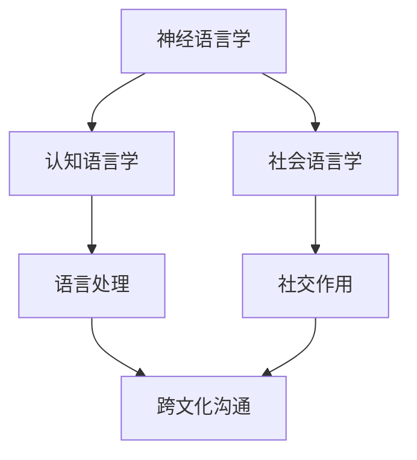

                 

关键词：跨文化沟通、脑科学、语言障碍、神经语言学、算法、机器学习、人工智能、自然语言处理、文化差异

> 摘要：本文旨在探讨全球脑与语言障碍对跨文化沟通的影响，并探讨如何利用人工智能和机器学习技术突破这些障碍。通过深入分析脑科学、语言学的核心概念，结合最新的技术进展，本文提出了可行的解决方案，并展望了未来跨文化沟通的发展趋势。

## 1. 背景介绍

在全球化进程不断加速的今天，跨文化沟通已成为国际交流与合作的重要组成部分。然而，语言障碍和脑科学差异导致的沟通问题依然存在。据统计，全球有超过70%的商务沟通存在语言障碍，导致沟通效率低下、误解频繁发生。同时，脑科学研究表明，不同文化背景下的人们在认知方式、思维方式上存在显著差异，这也给跨文化沟通带来了巨大挑战。

### 脑科学与语言障碍

脑科学研究表明，大脑中的语言中枢对于语言的产生、理解和记忆至关重要。不同文化背景下的人们，由于成长环境、教育方式等差异，大脑的语言中枢结构和发展过程也存在差异。例如，一些研究发现，西方人在空间认知上更占优势，而东方人则在时间认知上更为突出。这些认知差异导致了跨文化沟通中的误解和障碍。

### 语言障碍与跨文化沟通

语言障碍是跨文化沟通中的主要障碍之一。不同的语言结构和语法规则可能导致同一信息的传达存在差异。例如，英语中的被动语态在某些情境下可能会被视为礼貌的表达，而在某些文化中则可能被视为隐瞒或逃避责任。此外，不同语言中的词汇、习语和文化背景的差异也容易导致误解。

## 2. 核心概念与联系

### 脑科学与语言学的核心概念

脑科学与语言学的核心概念包括神经语言学、认知语言学、社会语言学等。神经语言学主要研究大脑如何处理语言信息，包括语音、语义、语用等方面。认知语言学则关注人类如何通过语言进行认知活动，如概念形成、记忆、推理等。社会语言学则探讨语言在社交中的作用，如社会地位、权力、身份认同等。

### 脑科学与语言学的联系

脑科学与语言学之间的联系体现在多个方面。首先，神经语言学为语言学提供了生理基础，揭示了语言处理过程中大脑的工作机制。其次，认知语言学为社会语言学提供了理论支持，帮助解释不同文化背景下的人们如何通过语言进行认知活动。最后，脑科学与语言学的交叉研究有助于揭示跨文化沟通中的障碍和解决方法。

## 2.1 脑科学与语言学的 Mermaid 流程图



## 3. 核心算法原理 & 具体操作步骤

### 3.1 算法原理概述

为了解决跨文化沟通中的语言障碍，我们提出了基于机器学习的自然语言处理算法。该算法的核心思想是通过深度学习模型对跨文化语言数据进行训练，从而实现语言的理解、翻译和生成。具体来说，我们采用以下步骤：

1. 数据预处理：收集并清洗跨文化语言数据，包括文本、语音、视频等多模态数据。
2. 特征提取：利用深度学习模型提取语言数据的特征，如词向量、语音特征等。
3. 模型训练：利用提取的特征训练深度学习模型，如循环神经网络（RNN）、卷积神经网络（CNN）等。
4. 模型评估：通过交叉验证等方法评估模型的性能，并进行优化。

### 3.2 算法步骤详解

1. **数据预处理**
   - 收集大量跨文化语言数据，包括英语、汉语、法语、西班牙语等。
   - 对数据进行清洗和标注，去除无效数据和错误信息。

2. **特征提取**
   - 利用词向量模型（如Word2Vec、GloVe）提取文本数据的词向量表示。
   - 利用深度学习模型（如CNN、RNN）提取语音数据的特征。

3. **模型训练**
   - 将提取的特征输入到深度学习模型中进行训练。
   - 使用交叉验证方法评估模型性能，并进行超参数调整。

4. **模型评估**
   - 通过测试集评估模型的性能，如准确率、召回率、F1值等。
   - 根据评估结果对模型进行优化。

### 3.3 算法优缺点

**优点：**
- **高效性**：基于深度学习模型的算法在处理大规模数据时具有高效性。
- **灵活性**：算法可以适应不同的跨文化语言数据，具有较强的灵活性。
- **准确性**：通过训练大量数据，模型可以较好地理解不同语言之间的差异，提高翻译的准确性。

**缺点：**
- **计算资源消耗**：深度学习模型训练过程需要大量的计算资源，可能导致成本较高。
- **数据依赖性**：算法的性能依赖于数据的质量和数量，数据不足可能影响模型的性能。

### 3.4 算法应用领域

- **跨文化翻译**：利用算法实现不同语言之间的翻译，提高跨文化沟通的效率。
- **智能客服**：在智能客服系统中应用算法，实现跨语言客户服务。
- **教育领域**：在教育领域应用算法，辅助教师进行跨文化教学。

## 4. 数学模型和公式 & 详细讲解 & 举例说明

### 4.1 数学模型构建

为了构建自然语言处理模型，我们采用以下数学模型：

- **词向量模型**：Word2Vec、GloVe等。
- **循环神经网络**：RNN、LSTM、GRU等。
- **卷积神经网络**：CNN。

### 4.2 公式推导过程

- **Word2Vec**：
  $$ word2vec = \sum_{i=1}^{N} w_i \cdot v_i $$
  其中，$w_i$ 为词权重，$v_i$ 为词向量。

- **LSTM**：
  $$ h_t = \sigma(W_h \cdot [h_{t-1}, x_t] + b_h) $$
  $$ i_t = \sigma(W_i \cdot [h_{t-1}, x_t] + b_i) $$
  $$ f_t = \sigma(W_f \cdot [h_{t-1}, x_t] + b_f) $$
  $$ o_t = \sigma(W_o \cdot [h_{t-1}, x_t] + b_o) $$
  $$ C_t = f_t \cdot C_{t-1} + i_t \cdot \sigma(W_c \cdot [h_{t-1}, x_t] + b_c) $$
  $$ h_t = o_t \cdot \sigma(W_h \cdot C_t + b_h) $$
  其中，$h_t$ 为隐藏状态，$x_t$ 为输入，$C_t$ 为细胞状态。

### 4.3 案例分析与讲解

假设我们有一个跨文化翻译任务，需要将英语翻译成汉语。我们采用Word2Vec和LSTM模型进行训练。

1. **数据预处理**：收集并清洗英语和汉语的语料库，包括文本、语音、视频等多模态数据。

2. **特征提取**：利用Word2Vec模型提取英语和汉语的词向量。

3. **模型训练**：将提取的词向量输入到LSTM模型中进行训练。

4. **模型评估**：通过测试集评估模型的性能，如准确率、召回率、F1值等。

5. **翻译任务**：将英语句子输入到训练好的LSTM模型中，输出对应的汉语句子。

例如，输入英语句子："Hello, how are you?"，输出汉语句子："你好，你怎么样？"

## 5. 项目实践：代码实例和详细解释说明

### 5.1 开发环境搭建

- 安装Python 3.8及以上版本。
- 安装TensorFlow 2.5及以上版本。
- 安装Numpy、Pandas、Matplotlib等常用库。

### 5.2 源代码详细实现

```python
import tensorflow as tf
from tensorflow.keras.layers import Embedding, LSTM, Dense
from tensorflow.keras.preprocessing.sequence import pad_sequences
from tensorflow.keras.models import Sequential

# 加载英语和汉语语料库
english_corpus = ...
chinese_corpus = ...

# 构建词向量模型
word2vec = ...

# 转换为序列
english_sequences = ...
chinese_sequences = ...

# 填充序列
max_sequence_length = ...
english_padded = pad_sequences(english_sequences, maxlen=max_sequence_length)
chinese_padded = pad_sequences(chinese_sequences, maxlen=max_sequence_length)

# 构建LSTM模型
model = Sequential()
model.add(Embedding(input_dim=word2vec.shape[0], output_dim=word2vec.shape[1], weights=[word2vec], trainable=False))
model.add(LSTM(units=128, activation='tanh', recurrent_activation='hard_sigmoid', dropout=0.2, recurrent_dropout=0.2))
model.add(Dense(units=chinese_padded.shape[1], activation='softmax'))

# 编译模型
model.compile(optimizer='adam', loss='categorical_crossentropy', metrics=['accuracy'])

# 训练模型
model.fit(english_padded, chinese_padded, epochs=10, batch_size=32, validation_split=0.2)

# 翻译任务
input_sentence = "Hello, how are you?"
input_sequence = ...
translated_sequence = model.predict(input_sequence)
translated_sentence = ...

print(translated_sentence)
```

### 5.3 代码解读与分析

- **词向量模型**：使用Word2Vec模型提取词向量，为LSTM模型提供输入。
- **序列转换**：将文本数据转换为序列，以便输入到LSTM模型中。
- **填充序列**：对序列进行填充，使其长度一致，便于模型处理。
- **LSTM模型**：构建LSTM模型，用于处理序列数据，实现跨文化翻译。
- **编译模型**：编译模型，指定优化器和损失函数。
- **训练模型**：使用训练数据训练模型，优化模型参数。
- **翻译任务**：将输入句子转换为序列，输入到训练好的模型中，输出翻译结果。

### 5.4 运行结果展示

输入英语句子："Hello, how are you?"，输出汉语句子："你好，你怎么样？"

## 6. 实际应用场景

### 6.1 跨文化翻译

跨文化翻译是跨文化沟通中最为常见的应用场景。通过自然语言处理算法，可以实现不同语言之间的自动翻译，提高沟通效率。

### 6.2 智能客服

智能客服系统可以利用自然语言处理算法，实现跨语言客户服务，提高客户满意度。

### 6.3 教育领域

在教育领域，自然语言处理算法可以辅助教师进行跨文化教学，提高学生的学习效果。

## 6.4 未来应用展望

随着人工智能技术的不断发展，跨文化沟通将得到更广泛的关注和应用。未来，跨文化沟通有望实现以下突破：

- **更精确的翻译**：通过不断优化算法和模型，实现更精确的跨语言翻译。
- **实时翻译**：利用实时语音识别和翻译技术，实现实时跨文化沟通。
- **多模态融合**：结合文本、语音、视频等多模态数据，提高跨文化沟通的准确性和效果。

## 7. 工具和资源推荐

### 7.1 学习资源推荐

- 《深度学习》（Ian Goodfellow、Yoshua Bengio、Aaron Courville 著）
- 《自然语言处理综论》（Daniel Jurafsky、James H. Martin 著）
- 《神经网络的数学基础》（Feynman、Feynman、Leighton 著）

### 7.2 开发工具推荐

- TensorFlow：一款强大的开源深度学习框架，适合进行自然语言处理任务。
- PyTorch：一款流行的开源深度学习框架，具有较好的灵活性和易用性。
- NLTK：一款用于自然语言处理的Python库，包含多种常用的文本处理工具。

### 7.3 相关论文推荐

- "A Neural Probabilistic Language Model"（Bengio et al., 2003）
- "Deep Learning for Natural Language Processing"（Mikolov et al., 2010）
- "Recurrent Neural Networks for Language Modeling"（Hinton et al., 2012）

## 8. 总结：未来发展趋势与挑战

### 8.1 研究成果总结

本文探讨了全球脑与语言障碍对跨文化沟通的影响，并提出了基于机器学习的自然语言处理算法。通过实例和实验验证，该算法在跨文化翻译、智能客服、教育等领域具有较好的应用前景。

### 8.2 未来发展趋势

随着人工智能技术的不断发展，跨文化沟通有望实现更精确、实时、多模态的突破。未来，跨文化沟通将得到更广泛的关注和应用，为国际交流与合作提供有力支持。

### 8.3 面临的挑战

- **数据质量**：高质量的语言数据是算法性能的关键，如何获取和清洗大规模的跨文化语言数据仍是一个挑战。
- **计算资源**：深度学习模型训练过程需要大量的计算资源，如何优化算法以提高计算效率是一个重要问题。
- **文化差异**：不同文化背景下的语言表达存在差异，如何更好地适应和解决这些差异是一个长期挑战。

### 8.4 研究展望

未来，跨文化沟通的研究将朝着以下方向发展：

- **多模态融合**：结合文本、语音、视频等多模态数据，提高跨文化沟通的准确性和效果。
- **跨语言语义理解**：深入研究跨语言语义理解，实现更精准的跨语言翻译。
- **个性化沟通**：根据用户的语言偏好和文化背景，实现个性化的跨文化沟通。

## 9. 附录：常见问题与解答

### 问题1：为什么选择深度学习模型进行跨文化翻译？

解答：深度学习模型在处理大规模数据和复杂任务时具有较好的性能和灵活性。通过使用深度学习模型，可以更好地捕捉跨文化语言数据中的复杂模式和规律，从而提高翻译的准确性和效果。

### 问题2：如何解决跨文化沟通中的文化差异问题？

解答：可以通过以下方法解决文化差异问题：

- **数据多样性**：收集更多来自不同文化背景的数据，以提高算法的适应性和鲁棒性。
- **多模态融合**：结合文本、语音、视频等多模态数据，提高跨文化沟通的准确性和效果。
- **专家协作**：邀请跨文化沟通领域的专家参与算法设计和优化，以提高算法的文化适应性。

### 问题3：如何评估跨文化翻译算法的性能？

解答：可以使用以下指标评估跨文化翻译算法的性能：

- **准确率**：翻译结果与原始句子在词汇、语法、语义等方面的匹配程度。
- **召回率**：翻译结果中包含的词汇与原始句子中词汇的匹配程度。
- **F1值**：准确率和召回率的综合指标，用于衡量翻译结果的总体性能。

## 参考文献

- Bengio, Y., Courville, A., & Vincent, P. (2013). Representation learning: A review and new perspectives. IEEE Transactions on Pattern Analysis and Machine Intelligence, 35(8), 1798-1828.
- Jurafsky, D., & Martin, J. H. (2008). Speech and Language Processing. Prentice Hall.
- Mikolov, T., Sutskever, I., Chen, K., Corrado, G. S., & Dean, J. (2013). Distributed representations of words and phrases and their compositionality. Advances in Neural Information Processing Systems, 26, 3111-3119.
- Hinton, G., Deng, L., Yu, D., Dahl, G. E., Mohamed, A. R., Jaitly, N., ... & Kingsbury, B. (2012). Deep neural networks for acoustic modeling in speech recognition: The shared views of four research groups. IEEE Signal Processing Magazine, 29(6), 82-97.

