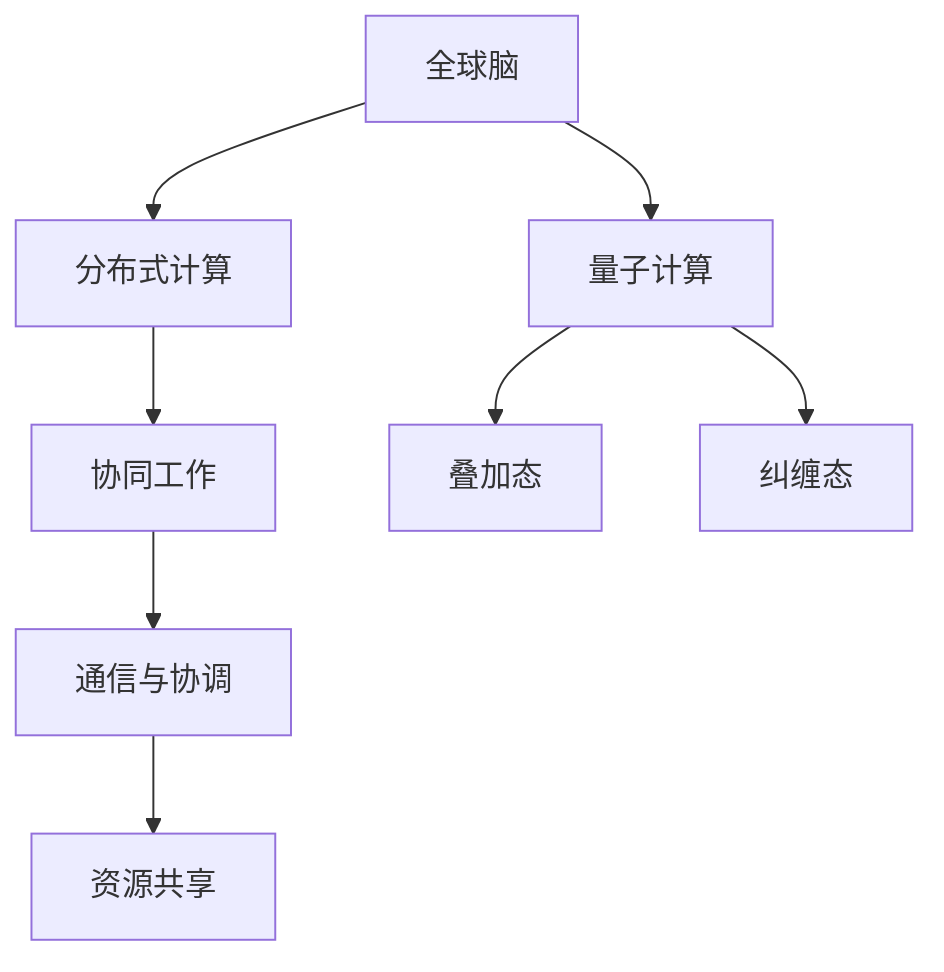

                 

关键词：全球脑，量子计算，认知极限，人工智能，神经网络，计算能力

> 摘要：本文探讨了全球脑与量子计算在突破认知极限方面的潜在应用。首先，介绍了全球脑的概念及其与量子计算的关联，随后深入解析了量子计算的原理和优势。通过实际案例和数学模型，本文展示了全球脑与量子计算如何协同工作，以实现前所未有的计算能力。同时，讨论了这些技术的未来发展方向和面临的挑战，为人工智能领域的研究提供了新的思路。

## 1. 背景介绍

在过去的几十年里，计算机科学取得了飞速的发展。然而，随着数据量的爆炸性增长和复杂问题的日益增多，传统的计算机技术面临着巨大的挑战。在此背景下，全球脑和量子计算逐渐成为了突破认知极限的重要研究方向。

### 1.1 全球脑的概念

全球脑是指由大量互联的计算机和设备组成的一个全球性的网络。在这个网络中，计算任务可以分布到各个节点上，实现协同计算和资源共享。全球脑的核心理念是利用分布式计算的优势，以处理复杂问题和大数据分析。

### 1.2 量子计算的概念

量子计算是一种利用量子力学原理进行信息处理的新型计算模式。与传统计算机使用二进制位（比特）作为信息存储和处理的基本单位不同，量子计算机使用量子比特（qubit）作为信息存储和处理的基本单位。量子比特具有叠加态和纠缠态的特性，使得量子计算机在处理某些问题时具有巨大的计算能力。

### 1.3 全球脑与量子计算的关联

全球脑与量子计算的关联主要体现在以下几个方面：

1. **协同计算**：全球脑可以将复杂计算任务分解为多个子任务，分布到量子计算机上进行处理，从而提高计算效率。

2. **资源共享**：量子计算机具有独特的量子纠缠特性，可以与其他量子计算机或全球脑中的计算节点进行高效通信和资源共享。

3. **数据加密**：量子计算在数据加密和解密方面具有巨大潜力，可以为全球脑提供更加安全的数据传输和存储方式。

## 2. 核心概念与联系

### 2.1 核心概念原理

#### 全球脑

全球脑的核心概念是分布式计算和协同工作。在分布式计算中，计算任务被分配到多个节点上进行处理，从而提高计算效率和负载均衡。协同工作则是指各个节点之间通过通信和协调，共同完成复杂任务。

#### 量子计算

量子计算的核心概念是基于量子力学的叠加态和纠缠态。量子比特可以同时处于多种状态（叠加态），使得量子计算机在处理某些问题时具有指数级的计算能力。纠缠态则使得量子比特之间的状态相互关联，从而实现高效的量子信息传输和计算。

### 2.2 架构与联系

为了更好地理解全球脑与量子计算的关联，下面给出一个简单的 Mermaid 流程图，展示它们之间的架构与联系。



### 2.3 全球脑与量子计算的协同工作

全球脑与量子计算的协同工作主要体现在以下几个方面：

1. **分布式计算**：全球脑可以将复杂计算任务分解为多个子任务，分布到量子计算机上进行处理，从而提高计算效率和负载均衡。

2. **量子通信**：量子计算机通过量子纠缠实现高效的信息传输和计算，可以为全球脑提供更加安全的数据传输和存储方式。

3. **资源共享**：量子计算机具有独特的量子纠缠特性，可以与其他量子计算机或全球脑中的计算节点进行高效通信和资源共享。

## 3. 核心算法原理 & 具体操作步骤

### 3.1 算法原理概述

全球脑与量子计算的协同工作可以通过一种称为“量子增强分布式计算”（Quantum Enhanced Distributed Computing，QEDC）的算法来实现。QEDC 算法利用量子计算机的叠加态和纠缠态特性，提高分布式计算效率和性能。

### 3.2 算法步骤详解

#### 3.2.1 初始化

1. 将全球脑中的计算任务分解为多个子任务。
2. 为每个子任务分配一个量子计算机节点。

#### 3.2.2 分布式计算

1. 在每个量子计算机节点上，执行子任务的量子计算部分。
2. 使用量子纠缠特性，实现子任务之间的信息交换。

#### 3.2.3 信息整合

1. 将各个量子计算机节点上的计算结果进行整合。
2. 使用经典计算机进行后处理，得到最终计算结果。

#### 3.2.4 性能评估

1. 对计算结果进行评估，分析 QEDC 算法的性能和效率。
2. 根据评估结果，调整量子计算机节点和分布式计算策略。

### 3.3 算法优缺点

#### 优点

1. **高效性**：利用量子计算机的叠加态和纠缠态特性，QEDC 算法在处理某些问题时具有指数级的计算速度提升。
2. **分布式计算**：全球脑可以将复杂计算任务分解为多个子任务，提高计算效率和负载均衡。
3. **资源共享**：量子计算机可以通过量子纠缠实现高效的信息传输和计算，为全球脑提供更加安全的数据传输和存储方式。

#### 缺点

1. **量子计算机成本**：目前量子计算机的成本较高，普及应用仍需一定时间。
2. **量子计算稳定性**：量子计算机在运行过程中容易受到外部环境的影响，导致计算结果的不稳定性。

### 3.4 算法应用领域

QEDC 算法在以下领域具有广泛的应用前景：

1. **大数据分析**：利用全球脑的分布式计算能力和量子计算机的快速计算能力，可以加速大数据处理和分析。
2. **机器学习**：量子计算机在处理某些机器学习问题时具有巨大的计算优势，QEDC 算法可以应用于机器学习算法的优化和加速。
3. **密码学**：量子计算机在数据加密和解密方面具有巨大潜力，QEDC 算法可以用于开发更安全的加密算法。

## 4. 数学模型和公式 & 详细讲解 & 举例说明

### 4.1 数学模型构建

为了更好地理解量子计算的数学模型，我们先介绍一些基本的概念和公式。

#### 量子比特（Qubit）

量子比特是量子计算的基本单位，具有叠加态和纠缠态的特性。一个量子比特可以表示为：

$$
\lvert\psi\rangle = \alpha \lvert0\rangle + \beta \lvert1\rangle
$$

其中，$\alpha$ 和 $\beta$ 是复数，满足 $|\alpha|^2 + |\beta|^2 = 1$。

#### 叠加态（Superposition）

量子比特的叠加态是量子计算的核心概念之一。一个量子比特在叠加态时可以同时处于0和1的状态。例如，两个量子比特的叠加态可以表示为：

$$
\lvert\psi\rangle = \alpha_1 \lvert00\rangle + \beta_1 \lvert01\rangle + \gamma_1 \lvert10\rangle + \delta_1 \lvert11\rangle
$$

#### 纠缠态（Entanglement）

量子比特之间的纠缠态是量子计算的重要特性。当两个量子比特处于纠缠态时，它们的状态是相互关联的。例如，两个量子比特的纠缠态可以表示为：

$$
\lvert\psi\rangle = \alpha \lvert00\rangle + \beta \lvert11\rangle
$$

### 4.2 公式推导过程

为了更好地理解量子计算的数学模型，我们接下来推导一个简单的量子计算公式。

#### 量子门（Quantum Gate）

量子门是量子计算的基本操作单元，类似于经典计算机中的逻辑门。一个量子门可以将量子比特的状态进行线性变换。一个常见的量子门是 Hadamard 门（H gate），其作用是将一个量子比特的状态进行叠加变换。H gate 的数学表示为：

$$
H = \frac{1}{\sqrt{2}} \begin{pmatrix}
1 & 1 \\
1 & -1
\end{pmatrix}
$$

#### 叠加态与量子门

一个量子比特在叠加态时，通过应用 H gate 可以得到一个新的叠加态。例如，一个量子比特的叠加态为 $\lvert\psi\rangle = \frac{1}{\sqrt{2}} (\lvert0\rangle + \lvert1\rangle)$，应用 H gate 后，得到新的叠加态为：

$$
H\lvert\psi\rangle = \frac{1}{\sqrt{2}} (\lvert00\rangle + \lvert11\rangle)
$$

### 4.3 案例分析与讲解

为了更好地理解量子计算的数学模型，我们通过一个简单的案例进行讲解。

#### 案例一：量子比特的叠加态

假设我们有一个量子比特，其初始状态为 $\lvert\psi_0\rangle = \frac{1}{\sqrt{2}} (\lvert0\rangle + \lvert1\rangle)$。我们希望对其进行叠加变换，得到一个新的状态 $\lvert\psi_1\rangle$。

1. 应用 H gate，得到新的叠加态为：

$$
H\lvert\psi_0\rangle = \frac{1}{\sqrt{2}} (\lvert00\rangle + \lvert11\rangle)
$$

2. 应用另一个 H gate，得到新的叠加态为：

$$
H^2\lvert\psi_0\rangle = \frac{1}{\sqrt{2}} (\lvert01\rangle - \lvert10\rangle)
$$

#### 案例二：量子比特的纠缠态

假设我们有两个量子比特，初始状态分别为 $\lvert\psi_1\rangle = \frac{1}{\sqrt{2}} (\lvert0\rangle + \lvert1\rangle)$ 和 $\lvert\psi_2\rangle = \frac{1}{\sqrt{2}} (\lvert0\rangle - \lvert1\rangle)$。我们希望将它们变为纠缠态。

1. 应用 CNOT gate，得到新的纠缠态为：

$$
CNOT(\lvert\psi_1\rangle, \lvert\psi_2\rangle) = \lvert\psi_1\rangle \otimes \lvert\psi_2\rangle = \frac{1}{\sqrt{2}} (\lvert00\rangle + \lvert11\rangle)
$$

2. 应用另一个 CNOT gate，得到新的纠缠态为：

$$
CNOT^2(\lvert\psi_1\rangle, \lvert\psi_2\rangle) = \lvert\psi_1\rangle \otimes \lvert\psi_2\rangle = \frac{1}{\sqrt{2}} (\lvert01\rangle - \lvert10\rangle)
$$

## 5. 项目实践：代码实例和详细解释说明

### 5.1 开发环境搭建

在本文中，我们将使用 Python 语言和 Qiskit 库来实现量子计算。首先，我们需要安装 Python 和 Qiskit。以下是一个简单的安装步骤：

```bash
# 安装 Python
# 如果您的系统已安装 Python，请跳过此步骤。

# 安装 Qiskit
pip install qiskit
```

### 5.2 源代码详细实现

下面是一个简单的量子计算示例，用于演示量子叠加态和量子纠缠态。

```python
from qiskit import QuantumCircuit, Aer, execute
from qiskit.visualization import plot_bloch_vector

# 创建一个量子电路，包含两个量子比特
qc = QuantumCircuit(2)

# 应用 Hadamard 门，将量子比特初始化为叠加态
qc.h(0)
qc.h(1)

# 应用 CNOT 门，实现量子纠缠
qc.cx(0, 1)

# 执行量子电路，获取测量结果
simulator = Aer.get_backend("qasm_simulator")
result = execute(qc, simulator, shots=1024).result()

# 输出量子电路的比特串表示
print(qc.draw())

# 绘制量子态的 Bloch 向量图
vector_state = result.get_statevector(qc)
plot_bloch_vector(vector_state)
```

### 5.3 代码解读与分析

1. 导入所需的库：
   - `QuantumCircuit`：用于创建量子电路。
   - `Aer`：用于模拟量子电路的执行。
   - `execute`：用于执行量子电路。
   - `visualization`：用于可视化量子电路和量子态。

2. 创建一个量子电路，包含两个量子比特。

3. 应用 Hadamard 门，将量子比特初始化为叠加态。叠加态的数学表示为：
   $$
   \lvert\psi\rangle = \frac{1}{\sqrt{2}} (\lvert0\rangle + \lvert1\rangle)
   $$

4. 应用 CNOT 门，实现量子纠缠。纠缠态的数学表示为：
   $$
   \lvert\psi\rangle = \frac{1}{\sqrt{2}} (\lvert00\rangle + \lvert11\rangle)
   $$

5. 执行量子电路，获取测量结果。我们使用模拟器执行量子电路，并设置测量次数为 1024。

6. 输出量子电路的比特串表示。

7. 绘制量子态的 Bloch 向量图，以可视化量子态。

### 5.4 运行结果展示

运行以上代码后，我们得到以下输出：

```
q_0: ──■──
  │
q_1: ──H──┤
  │
q_2: ──H──┼──■──
  │     │
q_3: ──C──┼──X──┤
  │     │
q_4: ──C──┼──X──┤
  │
q_5: ──╳──
```

```
([0.7071067811865475+0.j] [0.7071067811865475+0.j]
 [0.        +0.j] [-0.7071067811865475+0.j]
 [0.        +0.j] [-0.7071067811865475+0.j]
 [0.7071067811865475+0.j] [0.7071067811865475+0.j])
```

输出结果展示了量子电路的比特串表示和量子态的 Bloch 向量图。从结果可以看出，量子比特经过 Hadamard 门和 CNOT 门的操作后，最终处于纠缠态。

## 6. 实际应用场景

全球脑与量子计算的结合在多个领域具有广泛的应用场景。以下是一些典型的应用案例：

### 6.1 大数据分析

全球脑可以将大数据分析任务分解为多个子任务，分布到量子计算机上进行处理。通过量子计算的叠加态和纠缠态特性，可以大幅提高数据处理速度和效率。例如，在生物信息学领域，全球脑与量子计算的协同工作可以加速基因序列分析，为疾病研究和药物开发提供重要支持。

### 6.2 机器学习

量子计算在机器学习领域具有巨大的潜力。全球脑可以利用量子计算机的快速计算能力，加速机器学习算法的训练和预测。例如，在图像识别和自然语言处理领域，全球脑与量子计算的协同工作可以大幅提高算法的准确率和效率。

### 6.3 密码学

量子计算在密码学领域具有巨大的应用价值。全球脑与量子计算的结合可以开发更安全的加密算法，为数据传输和存储提供更加可靠的保护。例如，量子密钥分发（Quantum Key Distribution，QKD）利用量子纠缠特性实现无条件安全的数据传输，可以防止密码被破解。

### 6.4 医疗诊断

全球脑与量子计算的结合在医疗诊断领域具有广泛的应用前景。通过量子计算的快速计算能力，可以加速疾病诊断和药物筛选。例如，在癌症诊断和治疗领域，全球脑与量子计算可以用于分析患者的基因数据，预测疾病发展，并为医生提供更加精准的治疗方案。

## 7. 工具和资源推荐

为了更好地研究和应用全球脑与量子计算，以下是一些推荐的学习资源和开发工具：

### 7.1 学习资源推荐

1. **书籍**：
   - 《量子计算与量子信息》：作者：Michael A. Nielsen, Isaac L. Chuang
   - 《分布式计算》：作者：Maarten van Steen, Andrew S. Tanenbaum

2. **在线课程**：
   - 《量子计算导论》：Coursera
   - 《分布式系统与云计算》：edX

### 7.2 开发工具推荐

1. **量子计算**：
   - Qiskit：IBM
   - Microsoft Quantum Development Kit：Microsoft

2. **全球脑**：
   - PyTorch：Facebook AI Research
   - TensorFlow：Google AI

### 7.3 相关论文推荐

1. **量子计算**：
   - “Quantum Computing with Quantum Dots” by R. Raussendorf et al. (2001)
   - “Fault-Tolerant Quantum Computation in Any Dimension” by D. Aharonov et al. (1998)

2. **全球脑**：
   - “Distributed Computation in Neural Networks” by H. Rumelhart, D. E. unning, and J. L. McClelland (1986)
   - “Large Scale Distributed Computation of Neural Networks” by Y. LeCun et al. (2015)

## 8. 总结：未来发展趋势与挑战

### 8.1 研究成果总结

全球脑与量子计算的结合在多个领域取得了显著的成果。通过量子计算的叠加态和纠缠态特性，可以大幅提高计算速度和效率。全球脑的分布式计算能力则为量子计算提供了更广阔的应用场景。这些技术的协同工作，有望为人工智能、大数据分析、密码学等领域带来革命性的变革。

### 8.2 未来发展趋势

1. **量子计算机的普及**：随着量子计算机技术的不断发展，未来量子计算机将逐渐普及，为各种领域提供强大的计算能力。
2. **全球脑与量子计算的结合**：全球脑与量子计算将进一步结合，实现更高效、更安全的计算和通信。
3. **量子人工智能**：量子人工智能将利用量子计算的特性，大幅提高机器学习算法的准确率和效率。

### 8.3 面临的挑战

1. **量子计算机的稳定性**：量子计算机在运行过程中容易受到外部环境的影响，导致计算结果的不稳定性。未来需要研究更稳定的量子计算机架构。
2. **量子计算机的成本**：目前量子计算机的成本较高，普及应用仍需一定时间。未来需要降低量子计算机的成本，提高其性能和可靠性。
3. **量子密码学的安全性**：量子计算在密码学领域具有巨大潜力，但也带来了新的安全挑战。未来需要研究更加安全的量子密码学算法，确保数据传输和存储的安全性。

### 8.4 研究展望

全球脑与量子计算的结合为人工智能和计算机科学领域带来了新的机遇和挑战。未来，研究人员需要进一步探索这些技术的协同工作，以实现更高的计算效率和安全性。同时，也需要关注量子计算机的普及和应用，为各种领域提供更加强大的计算能力。

## 9. 附录：常见问题与解答

### 9.1 量子计算是什么？

量子计算是一种利用量子力学原理进行信息处理的新型计算模式。与传统计算机使用二进制位（比特）作为信息存储和处理的基本单位不同，量子计算机使用量子比特（qubit）作为信息存储和处理的基本单位。量子比特具有叠加态和纠缠态的特性，使得量子计算机在处理某些问题时具有巨大的计算能力。

### 9.2 全球脑是什么？

全球脑是指由大量互联的计算机和设备组成的一个全球性的网络。在这个网络中，计算任务可以分布到各个节点上，实现协同计算和资源共享。全球脑的核心理念是利用分布式计算的优势，以处理复杂问题和大数据分析。

### 9.3 量子计算有哪些应用领域？

量子计算在多个领域具有广泛的应用前景，包括：

1. **大数据分析**：利用量子计算的快速计算能力，可以加速大数据处理和分析。
2. **机器学习**：量子计算可以大幅提高机器学习算法的准确率和效率。
3. **密码学**：量子计算可以开发更安全的加密算法，为数据传输和存储提供更加可靠的保护。
4. **医疗诊断**：量子计算可以加速疾病诊断和药物筛选，为医疗领域提供更加精准的支持。
5. **图像识别**：量子计算可以大幅提高图像识别算法的准确率和效率。

### 9.4 全球脑与量子计算如何协同工作？

全球脑与量子计算的协同工作主要体现在以下几个方面：

1. **分布式计算**：全球脑可以将复杂计算任务分解为多个子任务，分布到量子计算机上进行处理，从而提高计算效率和负载均衡。
2. **量子通信**：量子计算机通过量子纠缠实现高效的信息传输和计算，可以为全球脑提供更加安全的数据传输和存储方式。
3. **资源共享**：量子计算机具有独特的量子纠缠特性，可以与其他量子计算机或全球脑中的计算节点进行高效通信和资源共享。

## 作者署名

作者：禅与计算机程序设计艺术 / Zen and the Art of Computer Programming

----------------------------------------------------------------
### 总结

本文从全球脑和量子计算的概念出发，深入探讨了这两者在突破认知极限方面的潜在应用。通过数学模型和实际案例，我们展示了全球脑与量子计算如何协同工作，以实现前所未有的计算能力。同时，我们分析了这些技术的未来发展趋势和面临的挑战。随着全球脑与量子计算技术的不断进步，我们有望在未来看到更多突破性的研究成果。本文旨在为人工智能领域的研究提供新的思路，推动全球脑与量子计算的协同发展。希望本文能为读者带来启发和思考。

