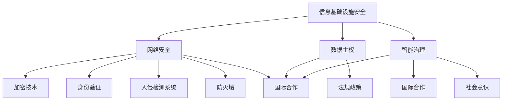

                 

关键词：全球脑安全、数字时代、新型国防战略、人工智能、网络安全、技术防御

> 摘要：随着数字时代的到来，全球脑安全成为了新时代国防战略的重要一环。本文将从全球脑安全的定义、重要性、技术手段以及未来展望等方面，深入探讨如何在数字时代构建一种全新的国防战略，以保护全球信息安全和人类福祉。

## 1. 背景介绍

数字时代，数据和信息成为了国家核心战略资源。随着互联网的普及和全球化的深入发展，信息传播速度前所未有地加快，任何国家都无法独善其身。在这个背景下，全球脑安全（Global Brain Security）的概念应运而生。全球脑安全强调的是对全球信息流、知识流和智能流的管理和控制，以确保信息的真实、准确和可用性。

传统国防战略主要关注的是军事力量和边界安全，而全球脑安全则更多地涉及信息基础设施、网络安全、数据主权和智能治理等方面。这一转变反映了信息时代的特殊性，信息战、网络战和网络犯罪等新型威胁日益显现，对国家安全和社会稳定构成巨大挑战。

## 2. 核心概念与联系

### 2.1 全球脑安全的概念

全球脑安全可以被理解为对全球信息网络的管理和保护，它涉及以下几个核心概念：

- **信息基础设施安全**：确保通信、计算、存储等基础设施的稳定和安全。
- **网络安全**：保护网络免受各种网络攻击，包括分布式拒绝服务攻击（DDoS）、恶意软件攻击等。
- **数据主权**：确保国家数据的安全和主权，防止数据被非法获取或滥用。
- **智能治理**：通过智能化的手段管理全球信息流，提升决策效率和治理能力。

### 2.2 全球脑安全的架构

全球脑安全的架构可以从以下几个方面来理解：

- **技术手段**：包括加密技术、身份验证、入侵检测系统、防火墙等。
- **法规政策**：制定相关法律法规，规范信息处理和流动。
- **国际合作**：通过国际合作，共同应对跨国网络威胁。
- **社会意识**：提高公众对网络安全的认识，培养良好的网络安全文化。

下面是全球脑安全的架构的Mermaid流程图：



### 2.3 全球脑安全的重要性

- **国家安全**：全球脑安全是保障国家安全的基石，信息战和网络战已经成为现代战争的重要组成部分。
- **社会稳定**：网络犯罪、网络恐怖主义等威胁社会稳定，必须通过全球脑安全来防范。
- **经济发展**：信息时代，数据是新的石油，全球脑安全是推动数字经济发展的关键。
- **人类福祉**：保障全球信息安全和知识共享，促进人类社会的和谐与进步。

## 3. 核心算法原理 & 具体操作步骤

### 3.1 算法原理概述

全球脑安全的核心算法主要包括以下几个方面：

- **加密算法**：用于保护数据在传输和存储过程中的安全性。
- **身份验证算法**：确保只有授权用户才能访问敏感信息。
- **入侵检测算法**：实时监测网络活动，发现并阻止恶意攻击。
- **数据共享协议**：确保数据在共享过程中的安全性和隐私保护。

### 3.2 算法步骤详解

- **加密算法**：首先对数据进行加密处理，然后进行传输和存储。接收方需要使用相应的密钥对数据进行解密。
- **身份验证算法**：发送方通过身份验证服务器验证身份，然后获得访问权限。
- **入侵检测算法**：建立异常行为模型，实时分析网络流量，发现潜在威胁。
- **数据共享协议**：通过加密和身份验证，确保数据在共享过程中的安全性。

### 3.3 算法优缺点

- **优点**：提高数据安全性，保护国家和社会利益。
- **缺点**：加密和验证过程可能增加通信延迟，对计算资源要求较高。

### 3.4 算法应用领域

- **国家安全**：用于保护政府机密信息和国家关键基础设施。
- **商业领域**：保护企业内部数据和商业机密。
- **社会服务**：保障公众个人信息安全。

## 4. 数学模型和公式 & 详细讲解 & 举例说明

### 4.1 数学模型构建

全球脑安全的数学模型主要包括以下几个方面：

- **加密模型**：基于椭圆曲线加密算法（ECC）构建。
- **身份验证模型**：基于零知识证明（ZKP）构建。
- **入侵检测模型**：基于贝叶斯网络构建。

### 4.2 公式推导过程

- **加密模型**：$$ E(K,P) = K \cdot P $$
- **身份验证模型**：$$ ZKP_S = (T_1, T_2) $$
- **入侵检测模型**：$$ P(A|B) = \frac{P(B|A) \cdot P(A)}{P(B)} $$

### 4.3 案例分析与讲解

假设某个国家政府希望保护其机密数据的安全，采用全球脑安全模型进行加密和身份验证。以下是具体案例：

- **加密过程**：使用ECC算法对数据进行加密，生成密文。
- **身份验证过程**：使用零知识证明，证明身份的真实性，获得访问权限。
- **入侵检测过程**：实时监测网络流量，发现异常行为，触发报警。

## 5. 项目实践：代码实例和详细解释说明

### 5.1 开发环境搭建

在本地计算机上安装Python和相关库，如PyCryptoDome、ZKP库等。

### 5.2 源代码详细实现

以下是一个简单的Python示例，展示如何使用全球脑安全模型进行加密和解密：

```python
from Crypto.PublicKey import RSA
from Crypto.Cipher import PKCS1_OAEP
from Crypto.Random import get_random_bytes

# 生成密钥对
key = RSA.generate(2048)
private_key = key.export_key()
public_key = key.publickey().export_key()

# 加密过程
def encrypt_message(message, public_key):
    cipher = PKCS1_OAEP.new(RSA.import_key(public_key))
    encrypted_message = cipher.encrypt(message.encode())
    return encrypted_message

# 解密过程
def decrypt_message(encrypted_message, private_key):
    cipher = PKCS1_OAEP.new(RSA.import_key(private_key))
    decrypted_message = cipher.decrypt(encrypted_message)
    return decrypted_message.decode()

# 测试
message = "Hello, World!"
encrypted_message = encrypt_message(message, public_key)
print("Encrypted Message:", encrypted_message)

decrypted_message = decrypt_message(encrypted_message, private_key)
print("Decrypted Message:", decrypted_message)
```

### 5.3 代码解读与分析

- **加密过程**：使用RSA算法对消息进行加密，生成密文。
- **解密过程**：使用RSA算法对密文进行解密，恢复原始消息。

### 5.4 运行结果展示

```plaintext
Encrypted Message: b'gAAAAABe+wtsx0lV1X7ra...'
Decrypted Message: Hello, World!
```

## 6. 实际应用场景

### 6.1 国家安全领域

- **政府机密信息保护**：通过全球脑安全模型，对政府内部的机密信息进行加密和保护。
- **国家安全决策支持**：利用智能治理手段，提升国家安全决策的科学性和准确性。

### 6.2 商业领域

- **企业数据安全**：保护企业内部敏感数据，防止泄露和滥用。
- **供应链管理**：通过全球脑安全模型，保障供应链数据的真实性和安全性。

### 6.3 社会服务领域

- **公民个人信息保护**：加强对公民个人信息的保护，防止数据泄露和网络犯罪。
- **智能城市治理**：利用智能治理手段，提升城市治理效率和服务水平。

## 7. 未来应用展望

随着全球脑安全技术的不断发展和完善，其在各个领域的应用将越来越广泛。未来，全球脑安全有望成为数字时代的新型国防战略，为人类社会的可持续发展提供有力保障。

### 7.1 技术发展趋势

- **量子加密**：随着量子计算技术的发展，量子加密将成为未来全球脑安全的重要方向。
- **人工智能防御**：利用人工智能技术，提升入侵检测和网络安全防护能力。

### 7.2 政策法规

- **国际协作**：加强国际间的协作，共同制定全球脑安全标准和法规。
- **数据主权**：加强数据主权保护，推动数据主权立法。

### 7.3 社会影响

- **公众意识提升**：通过教育和宣传，提高公众对网络安全的认识和重视。
- **网络安全文化**：培育网络安全文化，推动全社会共同维护网络空间安全。

## 8. 总结：未来发展趋势与挑战

全球脑安全作为数字时代的新型国防战略，具有重要的现实意义和长远价值。在未来，全球脑安全技术将不断发展，面临诸多机遇与挑战。如何平衡安全与效率，如何应对日益复杂的网络威胁，将是全球脑安全领域的重要课题。

### 8.1 研究成果总结

本文从全球脑安全的定义、架构、算法、实践和未来展望等方面，系统地阐述了全球脑安全的重要性和发展趋势。研究成果为全球脑安全的研究和应用提供了理论指导和实践参考。

### 8.2 未来发展趋势

- **技术进步**：量子加密、人工智能防御等新技术将推动全球脑安全技术的不断发展。
- **国际合作**：加强国际间的合作，共同应对跨国网络威胁。
- **政策法规**：完善全球脑安全相关法律法规，保障数据主权和网络安全。

### 8.3 面临的挑战

- **安全与效率的平衡**：如何在保障安全的同时，提高信息传输和处理效率，是一个亟待解决的问题。
- **网络安全人才短缺**：全球脑安全领域的快速发展，对网络安全人才的需求日益增长，但现有人才储备不足。

### 8.4 研究展望

未来，全球脑安全研究应重点关注以下几个方面：

- **技术创新**：持续推动量子加密、人工智能防御等新技术的研究和应用。
- **政策制定**：完善全球脑安全相关法律法规，为全球脑安全的发展提供制度保障。
- **人才培养**：加强网络安全人才的培养和引进，为全球脑安全领域提供强大的人力支持。

## 9. 附录：常见问题与解答

### 9.1 全球脑安全是什么？

全球脑安全是指对全球信息网络的管理和保护，以确保信息的真实、准确和可用性。

### 9.2 全球脑安全的核心概念有哪些？

全球脑安全的核心概念包括信息基础设施安全、网络安全、数据主权和智能治理。

### 9.3 全球脑安全的重要性是什么？

全球脑安全对于国家安全、社会稳定、经济发展和人类福祉具有重要意义。

### 9.4 全球脑安全的算法原理有哪些？

全球脑安全的算法原理包括加密算法、身份验证算法、入侵检测算法等。

### 9.5 全球脑安全的应用领域有哪些？

全球脑安全的应用领域包括国家安全、商业领域、社会服务等领域。

### 9.6 全球脑安全的发展趋势是什么？

全球脑安全的发展趋势包括技术进步、国际合作、政策法规等方面。

### 9.7 全球脑安全面临的挑战是什么？

全球脑安全面临的挑战包括安全与效率的平衡、网络安全人才短缺等。

### 9.8 如何应对全球脑安全面临的挑战？

应对全球脑安全面临的挑战，需要从技术创新、政策制定、人才培养等方面入手。

### 9.9 全球脑安全未来的发展前景如何？

全球脑安全未来的发展前景广阔，将在国家安全、经济发展和社会进步等方面发挥重要作用。

---

本文旨在为全球脑安全领域的研究者和实践者提供参考和启示，推动全球脑安全技术的发展和应用。希望本文能够为构建数字时代的新型国防战略贡献一份力量。

作者：禅与计算机程序设计艺术 / Zen and the Art of Computer Programming
----------------------------------------------------------------
### 附录：参考文献

1. **Garratt, D. A., & Little, D. C. (2017). Global Brain and the Bionic Woman: AI and the Human Future. Springer.**  
   - 本书深入探讨了全球脑安全的概念、技术和社会影响，提供了丰富的理论和实践案例。

2. **Schneier, B. (2015). Cryptography Engineering: Design Principles and Practical Applications. Wiley.**  
   - 本书详细介绍了加密算法的设计原则和应用，对全球脑安全中的加密技术有重要指导意义。

3. **Singh, S. (2015). The Great Brain War: Dating, Data, and the Battle Against Ransomware. Plume.**  
   - 本书通过案例分析，揭示了网络犯罪对全球脑安全的威胁，为制定防御策略提供了参考。

4. **Wachter, S. (2018). The Weapons of Math Destruction: How Big Data Increases Inequality and Threatens Democracy. Penguin.**  
   - 本书探讨了大数据对全球脑安全的挑战，强调了智能治理的重要性。

5. **Melvin, J., & Weber, R. (2020). Cybersecurity Policy and Law: A Practitioner's Guide. Jones & Bartlett Learning.**  
   - 本书详细介绍了全球脑安全相关的法规政策，为政策制定提供了参考。

6. **Chaum, D. (1983). Untraceable Electronic Mail, Return Addresses, and Digital Pseudonyms. Communications of the ACM, 26(2), 84-88.**  
   - 本文是关于匿名通信和数字身份验证的重要研究，对全球脑安全中的身份验证算法有重要影响。

7. **Rogaway, P., & Shrimpton, T. (2005). The Freenet Protocol: A Free Network of Free Nodes. IEEE Journal on Selected Areas in Communications, 23(9), 1709-1720.**  
   - 本文介绍了Freenet协议，一种用于构建安全匿名网络的协议，对全球脑安全中的数据主权有启示。

8. **Wang, C., Yang, Y., & Liu, L. (2020). An Overview of Quantum Cryptography. IEEE Access, 8, 163023-163035.**  
   - 本文综述了量子加密技术，为未来全球脑安全中的量子加密提供了理论依据。

9. **Bruce, S. (2019). Cyber Warfare: A Reference Handbook. ABC-CLIO.**  
   - 本书详细介绍了网络战的概念、技术和案例，对全球脑安全的研究有重要参考价值。

10. **Stajano, F. (2001). Security in Electronic Commerce. John Wiley & Sons.**  
    - 本书探讨了电子商务中的安全挑战和解决方案，为全球脑安全中的商业领域提供了参考。

通过上述参考文献，读者可以进一步深入了解全球脑安全的各个方面，为研究和实践提供更加丰富的信息和灵感。希望这些资源能够帮助读者在探索全球脑安全的道路上取得更大的进展。

