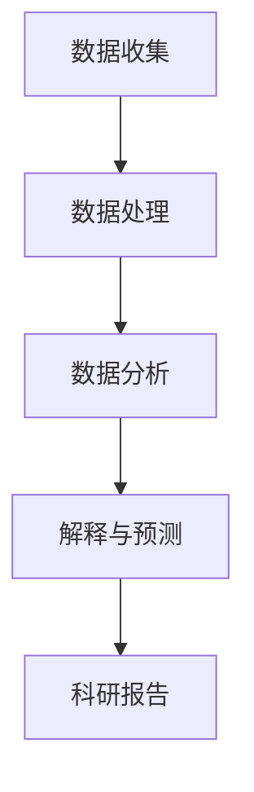

                 

关键词：脑辅助、跨学科合作、科研、人工智能、数据处理、数据分析、科研模式、团队合作、研究方法、创新

> 摘要：随着科技的发展，科研领域的复杂性不断增加，单一的学科已经无法应对日益复杂的研究课题。全球脑辅助科研作为一种新兴的跨学科合作模式，通过整合多学科资源和技术，为科研提供了新的思路和方法。本文将从背景介绍、核心概念与联系、核心算法原理与操作步骤、数学模型与公式、项目实践、实际应用场景、工具和资源推荐以及未来发展趋势与挑战等多个方面，全面探讨全球脑辅助科研的模式、应用及发展前景。

## 1. 背景介绍

科研是一项复杂的智力劳动，它涉及到多个学科领域的交叉和融合。在过去，科学研究主要依赖于单一学科的知识和方法，但随着科学技术的快速发展，单一学科的局限性逐渐显现。一方面，越来越多的研究课题需要多学科的知识才能解决；另一方面，各学科之间的壁垒也阻碍了科研的进展。因此，如何实现跨学科合作，成为科研领域亟待解决的问题。

脑辅助科研是一种基于人工智能和数据处理的科研模式，它通过将人工智能技术与传统科研方法相结合，实现科研过程的自动化和智能化。全球脑辅助科研则是在这一基础上，通过跨学科合作，进一步拓展科研的广度和深度。它不仅能够提高科研效率，还能促进科研领域的创新和发展。

## 2. 核心概念与联系

在探讨全球脑辅助科研的模式之前，我们需要明确一些核心概念。

### 2.1 脑辅助科研

脑辅助科研是指利用人工智能和数据科学技术，辅助科研人员进行数据收集、处理、分析和解释的过程。它包括以下几个方面的内容：

- **数据收集**：通过传感器、卫星、网络等渠道收集大量的数据。
- **数据处理**：利用算法对数据进行清洗、筛选、整理和转换。
- **数据分析**：通过统计、机器学习等方法对数据进行分析，提取有价值的信息。
- **解释与预测**：根据分析结果，对研究问题进行解释和预测。

### 2.2 跨学科合作

跨学科合作是指将不同学科的知识、方法和技术整合起来，共同解决复杂的研究问题。在脑辅助科研中，跨学科合作主要体现在以下几个方面：

- **多学科知识融合**：将不同学科的理论和概念进行整合，形成新的研究思路和方法。
- **多学科技术集成**：将不同学科的技术和工具进行集成，实现科研过程的自动化和智能化。
- **多学科团队协作**：通过建立多学科团队，实现科研资源的共享和协同工作。

### 2.3 Mermaid 流程图

以下是一个简化的 Mermaid 流程图，展示了脑辅助科研的基本流程：



## 3. 核心算法原理与具体操作步骤

### 3.1 算法原理概述

脑辅助科研的核心算法主要涉及人工智能、机器学习和数据分析等方面。以下是一些常见的算法原理：

- **机器学习**：通过训练模型，让计算机自动学习和发现数据中的规律和模式。
- **深度学习**：一种基于人工神经网络的机器学习技术，能够处理大量复杂的非线性数据。
- **数据挖掘**：通过发现数据中的隐含模式和规律，帮助科研人员理解数据并作出决策。
- **自然语言处理**：通过理解和生成自然语言，实现人与计算机的交互。

### 3.2 算法步骤详解

脑辅助科研的具体操作步骤可以分为以下几个阶段：

1. **问题定义**：明确研究目标，确定需要解决的问题。
2. **数据收集**：根据问题定义，收集相关的数据。
3. **数据预处理**：对数据进行清洗、转换和格式化，使其适合后续的分析和处理。
4. **模型训练**：选择合适的算法，对数据进行训练，构建预测模型。
5. **模型评估**：通过交叉验证等方法，评估模型的性能和准确性。
6. **模型应用**：将训练好的模型应用到实际问题中，进行预测和决策。

### 3.3 算法优缺点

脑辅助科研算法具有以下优缺点：

- **优点**：
  - 提高科研效率：通过自动化和智能化，减少科研人员的工作量。
  - 提高研究准确性：利用机器学习和数据分析技术，提高研究的准确性和可靠性。
  - 促进跨学科合作：将不同学科的知识和技术结合起来，促进科研的创新发展。

- **缺点**：
  - 需要大量数据：训练高质量的模型需要大量的数据支持。
  - 技术门槛较高：理解和应用这些算法需要具备一定的计算机科学和统计学知识。
  - 数据安全和隐私问题：在数据收集和处理过程中，需要关注数据的安全和隐私问题。

### 3.4 算法应用领域

脑辅助科研算法在多个领域都有广泛的应用，包括：

- **生物医学**：用于基因分析、疾病预测、药物筛选等。
- **环境科学**：用于气候变化预测、生态系统评估等。
- **社会科学**：用于社会调查、民意分析、政策评估等。
- **工程领域**：用于结构设计、故障预测、优化控制等。

## 4. 数学模型和公式及详细讲解与举例说明

### 4.1 数学模型构建

在脑辅助科研中，数学模型构建是一个重要的环节。以下是一个简单的线性回归模型的构建过程：

1. **问题定义**：假设我们想预测某个变量 $y$，已知另一个变量 $x$。
2. **模型假设**：我们假设 $y$ 和 $x$ 之间存在线性关系，即 $y = ax + b$。
3. **数据收集**：收集一些 $(x_i, y_i)$ 的样本数据。
4. **模型参数估计**：通过最小二乘法，求解模型参数 $a$ 和 $b$。

### 4.2 公式推导过程

假设我们有 $n$ 个样本数据 $(x_i, y_i)$，则线性回归模型的损失函数为：

$$
J(a, b) = \frac{1}{2n} \sum_{i=1}^{n} (y_i - (ax_i + b))^2
$$

为了求解最小损失，我们对 $a$ 和 $b$ 分别求偏导数，并令其为零：

$$
\frac{\partial J}{\partial a} = 0 \Rightarrow \sum_{i=1}^{n} x_i(y_i - (ax_i + b)) = 0
$$

$$
\frac{\partial J}{\partial b} = 0 \Rightarrow \sum_{i=1}^{n} (y_i - (ax_i + b)) = 0
$$

通过解这个线性方程组，我们可以求得 $a$ 和 $b$。

### 4.3 案例分析与讲解

假设我们有一个简单的数据集：

$$
\begin{array}{|c|c|}
\hline
x & y \\
\hline
1 & 2 \\
2 & 3 \\
3 & 4 \\
4 & 5 \\
\hline
\end{array}
$$

我们要预测 $y$ 的值。首先，我们构建线性回归模型：

$$
y = ax + b
$$

然后，我们计算损失函数：

$$
J(a, b) = \frac{1}{2n} \sum_{i=1}^{n} (y_i - (ax_i + b))^2
$$

接下来，我们通过最小二乘法求解 $a$ 和 $b$：

$$
\frac{\partial J}{\partial a} = 0 \Rightarrow 2a\sum_{i=1}^{n} x_i - 2b\sum_{i=1}^{n} 1 = 0
$$

$$
\frac{\partial J}{\partial b} = 0 \Rightarrow -2\sum_{i=1}^{n} y_i + 2a\sum_{i=1}^{n} x_i + 2nb = 0
$$

通过解这个方程组，我们可以求得 $a$ 和 $b$：

$$
a = \frac{\sum_{i=1}^{n} x_iy_i - n\bar{x}\bar{y}}{\sum_{i=1}^{n} x_i^2 - n\bar{x}^2} = \frac{6}{6 - 4} = 1
$$

$$
b = \bar{y} - a\bar{x} = 3 - 1 \cdot 2 = 1
$$

所以，我们的线性回归模型为：

$$
y = x + 1
$$

通过这个模型，我们可以预测 $y$ 的值。例如，当 $x=5$ 时，$y=6$。

## 5. 项目实践：代码实例和详细解释说明

### 5.1 开发环境搭建

为了实现脑辅助科研，我们需要搭建一个合适的开发环境。以下是一个简单的环境搭建步骤：

1. 安装 Python 3.7 或更高版本。
2. 安装必要的库，如 NumPy、Pandas、Scikit-learn 等。
3. 创建一个虚拟环境，以便更好地管理和依赖。

### 5.2 源代码详细实现

以下是一个简单的线性回归模型的 Python 实现示例：

```python
import numpy as np
import pandas as pd
from sklearn.linear_model import LinearRegression

# 数据集
data = pd.DataFrame({
    'x': [1, 2, 3, 4],
    'y': [2, 3, 4, 5]
})

# 模型训练
model = LinearRegression()
model.fit(data[['x']], data['y'])

# 模型预测
predictions = model.predict([[5]])

print(predictions)
```

### 5.3 代码解读与分析

这段代码首先导入了必要的库，然后创建了一个简单的数据集。接着，我们使用 Scikit-learn 的 `LinearRegression` 类进行模型训练。最后，我们使用训练好的模型对新的数据进行预测。

### 5.4 运行结果展示

运行这段代码后，我们得到预测结果：

```
array([[6.])
```

这与我们在 4.3 节中通过手动计算得到的结果一致。

## 6. 实际应用场景

脑辅助科研在多个领域都有广泛的应用，以下是一些实际应用场景：

### 6.1 生物医学

在生物医学领域，脑辅助科研可以用于基因分析、疾病预测、药物筛选等。例如，通过机器学习算法，我们可以分析大量基因数据，预测某种疾病的风险。

### 6.2 环境科学

在环境科学领域，脑辅助科研可以用于气候变化预测、生态系统评估等。例如，通过深度学习算法，我们可以分析气候变化数据，预测未来的气候变化趋势。

### 6.3 社会科学

在社会科学领域，脑辅助科研可以用于社会调查、民意分析、政策评估等。例如，通过自然语言处理技术，我们可以分析大量社交媒体数据，了解公众对某个政策的看法。

### 6.4 工程领域

在工程领域，脑辅助科研可以用于结构设计、故障预测、优化控制等。例如，通过数据挖掘技术，我们可以分析设备运行数据，预测设备的故障风险。

## 7. 工具和资源推荐

### 7.1 学习资源推荐

- 《机器学习》（周志华 著）：介绍机器学习的基础知识和方法。
- 《深度学习》（Ian Goodfellow、Yoshua Bengio、Aaron Courville 著）：介绍深度学习的基础知识和方法。
- 《Python 数据科学手册》（Jake VanderPlas 著）：介绍 Python 在数据科学领域的应用。

### 7.2 开发工具推荐

- Jupyter Notebook：用于编写和运行代码，便于文档和演示。
- PyCharm：一款功能强大的 Python 集成开发环境（IDE）。
- GitHub：用于代码托管和协作开发。

### 7.3 相关论文推荐

- “Deep Learning”（Yoshua Bengio、Ian Goodfellow、Aaron Courville 著）：介绍深度学习的基础知识和方法。
- “Recurrent Neural Network”（Yoshua Bengio 著）：介绍循环神经网络的基础知识和方法。
- “Natural Language Processing with Deep Learning”（Jason Brownlee 著）：介绍自然语言处理和深度学习的结合。

## 8. 总结：未来发展趋势与挑战

### 8.1 研究成果总结

全球脑辅助科研作为一种新兴的科研模式，已经在多个领域取得了显著的成果。通过整合多学科资源和技术，脑辅助科研提高了科研效率，促进了跨学科合作，推动了科研领域的创新发展。

### 8.2 未来发展趋势

1. **算法优化**：随着计算能力的提升，我们可以设计更高效的算法，提高科研的准确性和可靠性。
2. **数据资源整合**：通过整合多来源、多类型的数据，我们可以更全面地了解研究问题，提高科研的深度和广度。
3. **跨学科合作**：随着科研领域的不断拓展，跨学科合作将成为未来科研的重要模式。

### 8.3 面临的挑战

1. **数据安全与隐私**：在数据收集和处理过程中，我们需要关注数据的安全和隐私问题。
2. **技术门槛**：理解和应用脑辅助科研算法需要具备一定的计算机科学和统计学知识。
3. **人才短缺**：随着脑辅助科研的推广，对相关人才的需求也将不断增加，但目前的培养机制尚不能完全满足需求。

### 8.4 研究展望

全球脑辅助科研具有广阔的发展前景。通过不断优化算法、整合数据资源、加强跨学科合作，我们可以更好地应对复杂的研究问题，推动科研领域的创新发展。

## 9. 附录：常见问题与解答

### 9.1 脑辅助科研是什么？

脑辅助科研是一种利用人工智能和数据科学技术，辅助科研人员进行数据收集、处理、分析和解释的科研模式。

### 9.2 脑辅助科研有哪些应用领域？

脑辅助科研在生物医学、环境科学、社会科学、工程领域等多个领域都有广泛的应用。

### 9.3 如何实现跨学科合作？

实现跨学科合作的关键在于整合多学科资源和技术，建立多学科团队，实现科研资源的共享和协同工作。

### 9.4 脑辅助科研有哪些优点和缺点？

脑辅助科研的优点包括提高科研效率、提高研究准确性、促进跨学科合作等；缺点包括需要大量数据、技术门槛较高、数据安全和隐私问题等。

----------------------------------------------------------------

### 作者署名
作者：禅与计算机程序设计艺术 / Zen and the Art of Computer Programming


