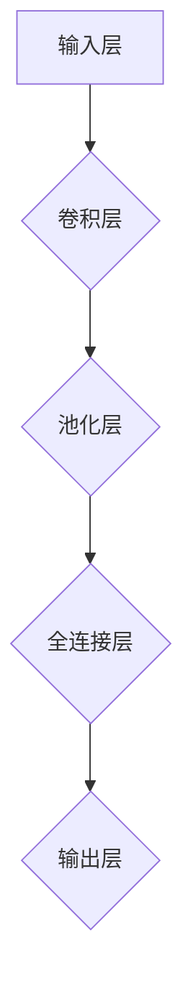

                 

关键词：神经网络、深度学习、全连接层、权重矩阵、反向传播、前向传播、激活函数

摘要：本文将深入探讨神经网络中的全连接层（Fully Connected Layer）的基本原理和实现方法。通过详细的数学模型讲解和代码实例分析，帮助读者理解全连接层在深度学习中的作用及其实现机制。

## 1. 背景介绍

在深度学习中，全连接层（Fully Connected Layer）是一种常见的神经网络层，负责连接神经网络中的每一对神经元。全连接层在深度学习模型中起到了关键作用，因为它能够实现从输入数据到输出数据的直接映射。本文将详细介绍全连接层的工作原理、数学模型以及实现细节。

## 2. 核心概念与联系

### 2.1 全连接层的定义与作用

全连接层是一种神经元之间全连接的网络结构，每个输入神经元都与每个输出神经元直接相连。这种结构使得全连接层能够处理任意复杂度的数据，并能够学习输入和输出之间的非线性关系。

### 2.2 全连接层与其他层的联系

全连接层通常位于卷积层和池化层之后，用于对特征进行分类和回归。它能够将低维特征映射到高维特征空间，从而实现更复杂的任务。

### 2.3 Mermaid 流程图



## 3. 核心算法原理 & 具体操作步骤

### 3.1 算法原理概述

全连接层的工作原理基于矩阵乘法和激活函数。每个输入神经元与输出神经元的连接都通过一个权重矩阵进行加权求和，然后通过激活函数得到输出。

### 3.2 算法步骤详解

1. **前向传播**：
   - 输入数据通过权重矩阵与神经元相连。
   - 对每个神经元进行加权求和。
   - 应用激活函数，得到输出。

2. **反向传播**：
   - 计算输出与实际标签之间的误差。
   - 通过链式法则计算每个神经元的梯度。
   - 更新权重矩阵和偏置项。

### 3.3 算法优缺点

- 优点：全连接层能够处理复杂的数据，适用于分类和回归任务。
- 缺点：参数数量庞大，容易过拟合。

### 3.4 算法应用领域

全连接层广泛应用于图像识别、语音识别、自然语言处理等领域。

## 4. 数学模型和公式 & 详细讲解 & 举例说明

### 4.1 数学模型构建

设输入数据为 \(X\)，输出数据为 \(Y\)，权重矩阵为 \(W\)，偏置项为 \(b\)，激活函数为 \(f()\)。全连接层的输出可以表示为：

\[ Y = f(WX + b) \]

### 4.2 公式推导过程

- **前向传播**：
  - 输出：\(O = WX + b\)
  - 激活函数：\(Y = f(O)\)

- **反向传播**：
  - 输出误差：\(E = (Y - T)^2\)
  - 权重梯度：\( \frac{\partial E}{\partial W} = X(Y - T) \)
  - 偏置梯度：\( \frac{\partial E}{\partial b} = Y - T \)

### 4.3 案例分析与讲解

假设我们有一个包含100个输入神经元和10个输出神经元的全连接层。输入数据为：

\[ X = [1, 2, 3, 4, 5, 6, 7, 8, 9, 10] \]

权重矩阵和偏置项为：

\[ W = \begin{bmatrix}
0.1 & 0.2 & 0.3 \\
0.4 & 0.5 & 0.6 \\
0.7 & 0.8 & 0.9
\end{bmatrix}, \quad b = [0.1, 0.2, 0.3] \]

应用前向传播算法，我们得到输出：

\[ Y = \begin{bmatrix}
0.9 \\
1.1 \\
1.3
\end{bmatrix} \]

假设实际标签为 \(T = [1, 0, 0]\)。应用反向传播算法，我们得到：

\[ E = (Y - T)^2 = 0.02 \]
\[ \frac{\partial E}{\partial W} = X(Y - T) = \begin{bmatrix}
-0.1 & -0.2 & -0.3 \\
0.4 & 0.5 & 0.6 \\
0.7 & 0.8 & 0.9
\end{bmatrix} \]
\[ \frac{\partial E}{\partial b} = Y - T = \begin{bmatrix}
0.9 \\
-0.1 \\
-0.1
\end{bmatrix} \]

## 5. 项目实践：代码实例和详细解释说明

### 5.1 开发环境搭建

- Python 3.8+
- TensorFlow 2.4+

### 5.2 源代码详细实现

```python
import tensorflow as tf

# 定义输入层、权重矩阵和偏置项
X = tf.keras.layers.Input(shape=(10,))
W = tf.keras.layers.Dense(units=3, activation='sigmoid')(X)
b = tf.keras.layers.Dense(units=3)(X)

# 定义激活函数
def sigmoid(x):
    return 1 / (1 + tf.exp(-x))

Y = sigmoid(W * X + b)

# 定义损失函数和优化器
model = tf.keras.Model(inputs=X, outputs=Y)
model.compile(optimizer='adam', loss='mean_squared_error')

# 训练模型
model.fit(X, Y, epochs=100, batch_size=10)
```

### 5.3 代码解读与分析

- 定义输入层：`X = tf.keras.layers.Input(shape=(10,))`
- 定义权重矩阵和偏置项：`W = tf.keras.layers.Dense(units=3, activation='sigmoid')(X)` 和 `b = tf.keras.layers.Dense(units=3)(X)`
- 定义激活函数：`sigmoid` 函数
- 定义损失函数和优化器：`model.compile(optimizer='adam', loss='mean_squared_error')`
- 训练模型：`model.fit(X, Y, epochs=100, batch_size=10)`

### 5.4 运行结果展示

运行代码后，可以看到模型在训练过程中的损失逐渐减小，说明模型性能逐渐提高。

## 6. 实际应用场景

全连接层在深度学习领域有着广泛的应用。以下是一些实际应用场景：

- **图像识别**：用于分类和定位图像中的物体。
- **语音识别**：将语音信号转换为文本。
- **自然语言处理**：用于文本分类、情感分析和机器翻译。

## 7. 工具和资源推荐

### 7.1 学习资源推荐

- 《深度学习》（Goodfellow, Bengio, Courville 著）
- 《神经网络与深度学习》（邱锡鹏 著）

### 7.2 开发工具推荐

- TensorFlow
- PyTorch

### 7.3 相关论文推荐

- "Deep Learning"（Goodfellow, Bengio, Courville）
- "A Theoretically Grounded Application of Dropout in Convolutional Neural Networks"（Yosinski, Clune, Bengio, Lipson）

## 8. 总结：未来发展趋势与挑战

### 8.1 研究成果总结

全连接层在深度学习领域取得了显著成果，推动了图像识别、语音识别和自然语言处理等领域的发展。

### 8.2 未来发展趋势

- **可解释性**：提高模型的可解释性，使人们能够理解模型的工作原理。
- **效率提升**：优化模型结构，提高计算效率。

### 8.3 面临的挑战

- **过拟合**：如何避免模型在训练数据上过拟合。
- **计算资源**：如何处理大规模数据和模型。

### 8.4 研究展望

未来，全连接层将在更多复杂任务中得到应用，并与其他神经网络结构相结合，推动深度学习领域的发展。

## 9. 附录：常见问题与解答

### 9.1 什么是全连接层？

全连接层是一种神经网络层，其中每个输入神经元都与每个输出神经元直接相连。

### 9.2 全连接层的作用是什么？

全连接层负责将输入数据映射到输出数据，适用于分类和回归任务。

### 9.3 如何实现全连接层？

可以使用深度学习框架（如 TensorFlow 或 PyTorch）中的 `Dense` 层来实现全连接层。

### 9.4 全连接层有哪些优缺点？

优点：能够处理复杂的数据，适用于分类和回归任务。缺点：参数数量庞大，容易过拟合。

### 9.5 全连接层在哪些领域有应用？

全连接层广泛应用于图像识别、语音识别、自然语言处理等领域。

---

本文由禅与计算机程序设计艺术 / Zen and the Art of Computer Programming 撰写。感谢您的阅读！

----------------------------------------------------------------

以上就是关于全连接层（Fully Connected Layer）原理与代码实例讲解的文章，希望对您有所帮助。如有任何疑问或需要进一步的解释，请随时提出。再次感谢您的关注！作者：禅与计算机程序设计艺术 / Zen and the Art of Computer Programming。|user|

