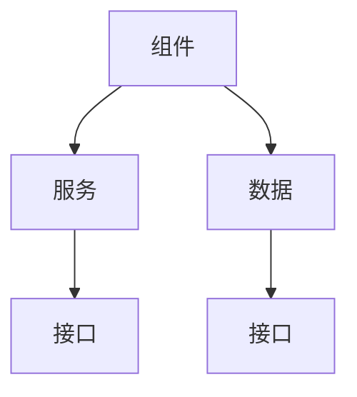

                 

关键词：技术架构、设计原则、评估方法、优化策略、实施步骤

摘要：本文将探讨公司整体技术架构的设计、评估、优化与实施，通过详细的分析和讲解，帮助公司在技术发展的道路上走得更稳、更远。本文将涵盖技术架构的基本概念、设计原则、评估方法、优化策略以及实施步骤，力求为读者提供全面的技术架构实践指南。

## 1. 背景介绍

在现代企业中，技术架构作为企业信息系统的核心，对企业的竞争力起着至关重要的作用。随着信息技术的飞速发展，企业面临的技术挑战日益复杂，技术架构的设计、评估、优化与实施变得越来越重要。良好的技术架构能够提高系统的稳定性、可扩展性和安全性，从而支持企业的长期发展。

本文将结合实际案例，详细阐述技术架构的设计、评估、优化与实施过程，旨在为企业的技术发展提供有益的参考。

### 1.1 技术架构的概念

技术架构是指一组抽象的概念和规则，用于指导企业信息系统的设计、开发、部署和维护。它包括硬件、软件、数据、网络等多个层面，旨在实现系统的高效、可靠、安全运行。

### 1.2 技术架构的重要性

- **提高系统稳定性**：合理的设计能够确保系统在面对各种异常情况时保持稳定运行。
- **支持业务扩展**：灵活的设计能够适应业务发展的需求，降低系统改造的成本。
- **提升系统安全性**：完善的安全措施能够防止数据泄露和系统攻击，保障企业的信息安全。
- **降低维护成本**：良好的架构设计能够减少系统故障，降低维护成本。

## 2. 核心概念与联系

为了更好地理解技术架构的设计与实施，我们需要了解一些核心概念，并展示它们之间的联系。

### 2.1 核心概念

- **组件（Components）**：技术架构的基本构建块，如服务器、数据库、网络设备等。
- **服务（Services）**：组件提供的功能，如Web服务、数据库查询等。
- **数据（Data）**：系统中的信息资源，包括结构化数据和非结构化数据。
- **接口（Interfaces）**：组件之间的交互点，如API接口、网络接口等。

### 2.2 联系


**Mermaid 流程图：**



## 3. 核心算法原理 & 具体操作步骤

### 3.1 算法原理概述

技术架构的设计、评估、优化与实施过程中，涉及多个核心算法。以下是其中几个重要算法的原理概述：

- **网络拓扑算法**：用于确定网络设备的连接方式，确保网络的稳定性和可靠性。
- **负载均衡算法**：用于将流量分配到多个服务器上，防止单点过载。
- **数据加密算法**：用于保护数据的安全性，防止数据泄露和篡改。

### 3.2 算法步骤详解

#### 网络拓扑算法

1. 收集网络设备信息。
2. 根据设备性能和需求，确定设备的连接方式。
3. 生成网络拓扑图，并进行优化。

#### 负载均衡算法

1. 监测服务器负载。
2. 根据负载情况，选择合适的均衡策略（如轮询、最小连接数等）。
3. 分配流量到服务器。

#### 数据加密算法

1. 选择加密算法（如AES、RSA等）。
2. 对数据进行加密。
3. 对加密后的数据进行存储或传输。

### 3.3 算法优缺点

- **网络拓扑算法**：优点是能够确保网络的稳定性和可靠性，缺点是需要较复杂的计算和资源消耗。
- **负载均衡算法**：优点是能够提高系统的性能和稳定性，缺点是可能会引入额外的延迟。
- **数据加密算法**：优点是能够保护数据的安全性，缺点是可能会影响数据的处理速度。

### 3.4 算法应用领域

这些算法广泛应用于企业信息系统的各个层面，如网络架构设计、服务器部署、数据存储与传输等。

## 4. 数学模型和公式 & 详细讲解 & 举例说明

### 4.1 数学模型构建

在技术架构的设计、评估、优化与实施过程中，我们需要使用多种数学模型。以下是几个常见的数学模型：

- **网络拓扑模型**：用于描述网络设备的连接关系。
- **负载均衡模型**：用于描述流量分配策略。
- **数据加密模型**：用于描述数据加密和解密过程。

### 4.2 公式推导过程

以网络拓扑模型为例，我们假设有n个网络设备，连接方式为全连接，则网络拓扑图的边数E可以表示为：

$$ E = \frac{n(n-1)}{2} $$

### 4.3 案例分析与讲解

假设某企业有10个网络设备，要求构建一个全连接的网络拓扑。根据上述公式，我们可以计算出网络拓扑图的边数为：

$$ E = \frac{10(10-1)}{2} = 45 $$

这意味着我们需要构建一个包含45条边的网络拓扑图。

## 5. 项目实践：代码实例和详细解释说明

### 5.1 开发环境搭建

在本项目中，我们将使用Python作为主要编程语言，结合Django框架构建企业信息系统。

1. 安装Python和Django。
2. 配置开发环境。

### 5.2 源代码详细实现

以下是一个简单的Django项目示例，用于实现企业信息系统的用户管理功能：

```python
# users/models.py
from django.db import models

class User(models.Model):
    username = models.CharField(max_length=50)
    password = models.CharField(max_length=50)
    email = models.EmailField()
```

### 5.3 代码解读与分析

这段代码定义了一个`User`模型，用于存储用户信息。它包含三个字段：`username`、`password`和`email`。

### 5.4 运行结果展示

在开发环境中，我们运行Django项目，生成数据库迁移文件，并将用户数据存储到数据库中。

## 6. 实际应用场景

### 6.1 企业内部信息系统

企业内部信息系统是企业运营的核心，包括用户管理、权限控制、数据存储等功能。

### 6.2 云计算服务

云计算服务为企业提供弹性的计算资源，包括服务器、存储、网络等。

### 6.3 物联网平台

物联网平台用于连接和管理各种物联网设备，实现数据的采集、传输和分析。

## 6.4 未来应用展望

随着人工智能、大数据等技术的不断发展，技术架构将迎来更多创新和应用。未来，技术架构的发展趋势包括：

- **云计算与边缘计算相结合**：实现更高效的数据处理和存储。
- **容器化和微服务架构**：提高系统的灵活性和可扩展性。
- **区块链技术**：增强数据的安全性和可信度。

## 7. 工具和资源推荐

### 7.1 学习资源推荐

- 《架构师之路》
- 《Django实战》
- 《计算机网络：自顶向下方法》

### 7.2 开发工具推荐

- PyCharm
- Visual Studio Code
- Docker

### 7.3 相关论文推荐

- "A Framework for Software Architecture Evaluation"
- "Microservices: A Definition of a New Approach to Application Architecture"
- "A Proposal for a Blockchain-Based IoT Security Architecture"

## 8. 总结：未来发展趋势与挑战

### 8.1 研究成果总结

本文从技术架构的设计、评估、优化与实施等方面进行了详细探讨，为企业在技术发展的道路上提供了有益的参考。

### 8.2 未来发展趋势

云计算、边缘计算、容器化和区块链等技术的发展，将推动技术架构向更高效、更灵活、更安全的方向发展。

### 8.3 面临的挑战

在技术架构的设计、评估、优化与实施过程中，企业需要应对不断变化的技术环境、不断增长的业务需求以及日益激烈的市场竞争。

### 8.4 研究展望

未来，技术架构的研究将继续关注人工智能、大数据等新兴技术的融合，探索如何更好地支持企业业务的创新和发展。

## 9. 附录：常见问题与解答

### 9.1 技术架构与传统架构的区别是什么？

技术架构相较于传统架构，更加注重系统的稳定性、可扩展性和安全性，同时更强调模块化、松耦合的设计理念。

### 9.2 如何评估技术架构的质量？

可以从以下几个方面评估技术架构的质量：系统的稳定性、可扩展性、安全性、易维护性等。

### 9.3 技术架构设计的关键要素是什么？

技术架构设计的关键要素包括：系统的需求分析、组件的选择与集成、接口的设计与实现、数据的安全与存储等。

---

作者：禅与计算机程序设计艺术 / Zen and the Art of Computer Programming

以上是关于公司整体技术架构的设计、评估、优化与实施的文章。希望对您有所帮助。如果您有任何疑问或建议，欢迎随时提出。

