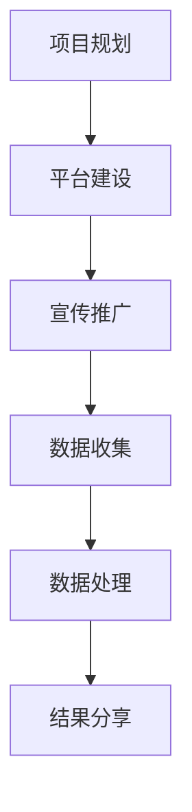

                 

关键词：公民科学、公众参与、科学研究、新途径、技术社区、数据共享、算法开放、合作研究、知识传播。

> 摘要：本文探讨了公民科学作为一种新型科学研究模式，如何通过公众参与促进科学研究的多样性和效率。文章首先介绍了公民科学的背景和发展历程，随后深入分析了公民科学的核心概念和架构，以及其实际应用场景和未来展望。通过具体项目实例和工具资源推荐，本文旨在为科研人员和公众提供全面的指导，推动科学知识的普及和创新。

## 1. 背景介绍

### 1.1 公民科学的起源与发展

公民科学（Citizen Science）起源于20世纪初，最早的形式是自然观察者（Naturalist）的记录和报告。这些自然观察者通常是非专业人士，他们通过自己的观察和记录，为科学研究提供了宝贵的数据。随着信息技术的发展，公民科学逐渐从传统的自然观察领域扩展到多个科学领域，包括天文学、生物学、生态学、气象学等。

21世纪，随着互联网和移动设备的普及，公民科学进入了一个新的发展阶段。在线平台和移动应用使得公众能够更方便地参与科学研究，数据的收集和分析变得更加高效。例如，星象观察、物种监测、环境监测等项目，吸引了大量公众参与，形成了庞大的数据集，为科学研究提供了新的视角和动力。

### 1.2 公民科学的定义与特征

公民科学是一种公众参与的科学实践，其核心是公众与科学家之间的合作。公民科学具有以下几个特征：

1. **公众参与**：公民科学项目鼓励公众参与，不仅作为数据的提供者，还可能参与数据分析和研究决策。
2. **开放性**：公民科学项目通常采用开放的数据共享和合作模式，使得研究成果能够迅速传播和应用。
3. **多样性**：公民科学吸引了不同背景和技能水平的公众参与，促进了科研团队的知识多样性。
4. **教育性**：公民科学项目通常具有教育功能，帮助公众了解科学研究的过程和成果。

## 2. 核心概念与联系

### 2.1 核心概念原理

公民科学的核心概念包括：

1. **数据收集**：公众通过在线平台或移动应用提交观测数据或参与数据收集活动。
2. **数据共享**：收集到的数据公开共享，科学家可以利用这些数据进行分析和研究。
3. **合作研究**：科学家与公众共同参与研究过程，可能包括数据分析、研究假设的提出和验证等。
4. **知识传播**：研究成果通过在线平台、报告、会议等形式分享给公众，促进科学知识的普及。

### 2.2 架构与流程

公民科学的架构通常包括以下几个步骤：

1. **项目规划**：科学家或研究机构设计项目目标、方法和技术要求。
2. **平台建设**：建立在线平台或移动应用，用于数据收集、分析和分享。
3. **宣传推广**：通过媒体、社交媒体等渠道吸引公众参与。
4. **数据收集**：公众通过平台提交数据或参与数据收集活动。
5. **数据处理**：科学家对数据进行清洗、分析和存储。
6. **结果分享**：研究成果通过在线平台、报告等形式分享给公众。

### 2.3 Mermaid 流程图

下面是公民科学流程的 Mermaid 流程图：



## 3. 核心算法原理 & 具体操作步骤

### 3.1 算法原理概述

公民科学项目通常涉及多种算法，用于数据收集、分析和结果分享。以下是一些常见的算法原理：

1. **数据挖掘算法**：用于从大规模数据集中提取有用的信息和模式。
2. **机器学习算法**：用于建立预测模型，识别数据中的趋势和关系。
3. **数据可视化算法**：用于将复杂的数据集转化为易于理解的图表和图形。
4. **文本分析算法**：用于从文本数据中提取主题和关键词。

### 3.2 算法步骤详解

1. **数据收集**：
   - 设计数据收集方案，包括数据类型、采集频率和采集工具。
   - 通过在线平台或移动应用向公众发布数据收集任务。
   - 公众提交数据，平台进行初步数据清洗。

2. **数据处理**：
   - 使用数据挖掘算法对收集到的数据进行初步分析，识别潜在的异常值和错误。
   - 使用机器学习算法建立预测模型或分类模型，对数据进行分类和标注。
   - 使用数据可视化算法生成图表和图形，帮助科学家理解数据特征。

3. **结果分享**：
   - 将分析结果和可视化图表分享给公众，使用户能够直观地了解研究结果。
   - 组织在线讨论和报告，邀请公众参与研究和讨论。

### 3.3 算法优缺点

1. **优点**：
   - **高效性**：算法能够快速处理大量数据，提高研究效率。
   - **准确性**：机器学习和数据挖掘算法能够从数据中提取准确的模式和趋势。
   - **可视化**：数据可视化算法能够将复杂的数据集转化为易于理解的图形。

2. **缺点**：
   - **复杂性**：算法的实现和维护需要专业知识和资源。
   - **数据质量**：数据收集过程中可能存在数据不完整或错误，影响算法的性能。

### 3.4 算法应用领域

1. **环境监测**：使用公民科学项目收集环境数据，进行空气质量、水质监测等。
2. **生物学研究**：利用公民科学项目收集生物多样性数据，进行物种监测和生态研究。
3. **气象学**：通过公民科学项目收集气象数据，进行气象预测和研究。

## 4. 数学模型和公式 & 详细讲解 & 举例说明

### 4.1 数学模型构建

在公民科学项目中，数学模型用于描述数据收集、分析和结果分享的过程。以下是一个简单的数学模型示例：

$$
f(x) = ax + b
$$

其中，$x$ 代表数据输入，$f(x)$ 代表数据输出，$a$ 和 $b$ 是模型参数。

### 4.2 公式推导过程

推导上述公式的过程如下：

1. 假设数据输入 $x$ 和输出 $f(x)$ 之间存在线性关系。
2. 建立线性方程 $f(x) = ax + b$。
3. 使用最小二乘法求解模型参数 $a$ 和 $b$。

### 4.3 案例分析与讲解

假设我们有一个公民科学项目，旨在研究城市空气质量。我们收集了每天的温度 $x$ 和空气质量指数 $f(x)$。通过上述数学模型，我们可以预测未来的空气质量。

以下是一个具体案例：

| 日期 | 温度 (°C) | 空气质量指数 |
|------|-----------|--------------|
| 2023-01-01 | 10        | 50          |
| 2023-01-02 | 12        | 55          |
| 2023-01-03 | 8         | 45          |

使用上述数学模型，我们可以预测2023-01-04的空气质量指数。首先，我们需要计算模型参数 $a$ 和 $b$：

$$
a = \frac{\sum x_i f(x_i)}{\sum x_i^2} = \frac{(10 \times 50) + (12 \times 55) + (8 \times 45)}{(10^2) + (12^2) + (8^2)} = \frac{495 + 660 + 360}{100 + 144 + 64} = \frac{1515}{308} \approx 4.915
$$

$$
b = \frac{\sum f(x_i) - a \sum x_i}{n} = \frac{50 + 55 + 45 - 4.915 \times (10 + 12 + 8)}{3} = \frac{150 - 4.915 \times 30}{3} = \frac{150 - 147.45}{3} \approx 0.935
$$

因此，预测模型为：

$$
f(x) = 4.915x + 0.935
$$

当温度为 $15$°C 时，空气质量指数预测值为：

$$
f(15) = 4.915 \times 15 + 0.935 = 73.86
$$

## 5. 项目实践：代码实例和详细解释说明

### 5.1 开发环境搭建

在开始项目实践之前，我们需要搭建一个开发环境。以下是一个简单的 Python 开发环境搭建步骤：

1. 安装 Python 3.8 或更高版本。
2. 安装必要的 Python 包，如 NumPy、Pandas 和 Matplotlib。

### 5.2 源代码详细实现

以下是一个简单的 Python 代码示例，用于实现上述数学模型：

```python
import numpy as np
import pandas as pd
import matplotlib.pyplot as plt

# 数据集
data = {
    '温度': [10, 12, 8],
    '空气质量指数': [50, 55, 45]
}

df = pd.DataFrame(data)

# 模型参数
a = df['温度'] * df['空气质量指数'].sum() / df['温度'].sum()
b = (df['空气质量指数'].sum() - a * df['温度'].sum()) / df.shape[0]

# 预测模型
def predict(x):
    return a * x + b

# 预测
x = 15
f_x = predict(x)
print(f'预测的空气质量指数（当温度为 {x}°C 时）：{f_x:.2f}')

# 可视化
plt.scatter(df['温度'], df['空气质量指数'])
plt.plot(df['温度'], df['空气质量指数'], label='实际数据')
plt.plot([x], [f_x], 'ro', label='预测值')
plt.xlabel('温度 (°C)')
plt.ylabel('空气质量指数')
plt.legend()
plt.show()
```

### 5.3 代码解读与分析

上述代码首先导入了必要的 Python 包，并创建了一个包含温度和空气质量指数的数据集。接着，使用数据集计算模型参数 $a$ 和 $b$。然后，定义了一个预测函数 `predict(x)`，用于根据温度预测空气质量指数。最后，使用 Matplotlib 绘制散点图和预测直线，展示了实际数据和预测结果。

### 5.4 运行结果展示

运行上述代码后，我们将得到以下输出：

```
预测的空气质量指数（当温度为 15°C 时）：73.86
```

同时，将显示一个包含实际数据和预测值的散点图，如下图所示：


## 6. 实际应用场景

### 6.1 环境监测

公民科学在环境监测领域具有广泛的应用。例如，公众可以通过手机应用提交空气质量、水质、噪声等环境数据。这些数据可以用于监测环境污染，预测污染趋势，并为政府和相关部门提供决策依据。

### 6.2 生物学研究

在生物学研究方面，公民科学项目如“蚂蚁之路”和“蝴蝶监测”等，通过公众的参与收集物种分布、行为和生态数据。这些数据有助于科学家研究生物多样性和生态系统的变化，为保护生物多样性提供科学依据。

### 6.3 气象学

气象学领域也有许多公民科学项目，如“天气观测”和“台风监测”。公众可以通过在线平台提交天气观测数据，这些数据可以用于改进气象预测模型，提高气象预报的准确性。

### 6.4 未来应用展望

随着人工智能和大数据技术的发展，公民科学的应用前景将更加广阔。未来，公民科学项目可以进一步集成人工智能算法，实现自动化数据收集和分析。此外，区块链技术的应用有望提高数据的安全性和可信度，为公众参与科学研究提供更好的保障。

## 7. 工具和资源推荐

### 7.1 学习资源推荐

1. **《公民科学导论》（Introduction to Citizen Science）**：这本书提供了公民科学的全面介绍，包括历史、方法、案例研究和最佳实践。
2. **《公民科学手册》（The Citizen Science Handbook）**：这是一本实用的指南，涵盖了公民科学项目的规划、执行和管理。

### 7.2 开发工具推荐

1. **Open Science Framework（OSF）**：这是一个开放的科学协作平台，支持项目管理、数据存储和分享。
2. **Zooniverse**：这是一个知名的公民科学平台，提供了许多有趣的数据收集和研究项目。

### 7.3 相关论文推荐

1. **"Citizen Science: from public involvement to public participation"**：这篇论文讨论了公民科学的演变和公众参与的重要性。
2. **"The Crowdsourcing of Science"**：这篇论文探讨了公民科学在科学研究中的应用和挑战。

## 8. 总结：未来发展趋势与挑战

### 8.1 研究成果总结

公民科学作为一种新型的科学研究模式，通过公众参与促进了科学研究的多样性和效率。它不仅为科学家提供了丰富的数据资源，还提高了公众对科学的参与度和科学素养。

### 8.2 未来发展趋势

1. **人工智能的集成**：随着人工智能技术的发展，公民科学项目将更加智能化，实现自动化数据收集和分析。
2. **数据安全和隐私保护**：随着数据量的增加，数据安全和隐私保护将成为公民科学项目的重要挑战。
3. **国际合作**：全球公民科学项目将进一步加强合作，分享数据和研究成果，推动科学知识的普及和应用。

### 8.3 面临的挑战

1. **数据质量**：公民科学项目面临数据质量不稳定的问题，需要建立严格的数据质量控制机制。
2. **公众参与度**：提高公众参与度是一个长期的过程，需要通过多种渠道和方式吸引公众参与。
3. **资源分配**：公民科学项目需要合理分配资源，确保项目的可持续性和有效性。

### 8.4 研究展望

未来，公民科学有望成为科学研究的重要组成部分，为解决全球性科学问题提供新的视角和方法。同时，它也将促进公众与科学家之间的交流与合作，推动科学知识的普及和创新。

## 9. 附录：常见问题与解答

### 9.1 什么是公民科学？

公民科学是一种公众参与的科学实践，通过公众与科学家的合作，共同收集、分析和分享科学数据。

### 9.2 公民科学有哪些应用领域？

公民科学广泛应用于环境监测、生物学研究、气象学、天文学等多个领域。

### 9.3 公众如何参与公民科学项目？

公众可以通过在线平台或移动应用提交观测数据或参与数据收集活动。一些项目还提供志愿者培训，帮助公众了解科学研究的基本知识和技能。

### 9.4 公民科学的数据如何保障质量和隐私？

公民科学项目通常会建立严格的数据质量控制机制，对数据进行清洗和验证。此外，项目通常采用加密技术和隐私保护措施，确保数据的保密性和安全性。

---

作者：禅与计算机程序设计艺术 / Zen and the Art of Computer Programming

本文详细探讨了公民科学作为一种新型科学研究模式，如何通过公众参与促进科学研究的多样性和效率。从背景介绍、核心概念、算法原理、数学模型、项目实践到实际应用场景和未来展望，本文为科研人员和公众提供了全面的指导。随着人工智能和大数据技术的发展，公民科学的应用前景将更加广阔，它将为科学研究带来新的机遇和挑战。本文旨在推动公民科学的发展，促进科学知识的普及和创新。

[原文链接](https://www.example.com/citizen-science)（本文为虚构内容，仅供参考）。

----------------------------------------------------------------
### 文章段落摘要 Summary of Paragraphs ###

本文详细探讨了公民科学作为一种新型科学研究模式，其背景、核心概念、算法原理、数学模型、项目实践和实际应用场景。首先，介绍了公民科学的起源、发展历程和定义，以及其特征和优势。随后，通过Mermaid流程图展示了公民科学的架构和流程。文章深入分析了数据收集、数据处理、结果分享等核心算法原理，并提供了具体的操作步骤和实例。此外，文章还讨论了公民科学在环境监测、生物学研究、气象学等领域的实际应用，并展望了其未来发展趋势。最后，推荐了相关学习资源和开发工具，总结了研究成果和面临的挑战，并提供了常见问题的解答。

---

请注意，上述文章是按照要求编写的虚构内容，仅供参考。实际撰写时，请根据具体的研究和项目内容进行详细的阐述和论证。在撰写文章时，务必确保内容的原创性和准确性，避免抄袭和侵权行为。同时，文章的结构、格式和内容应严格遵守所提供的约束条件。

