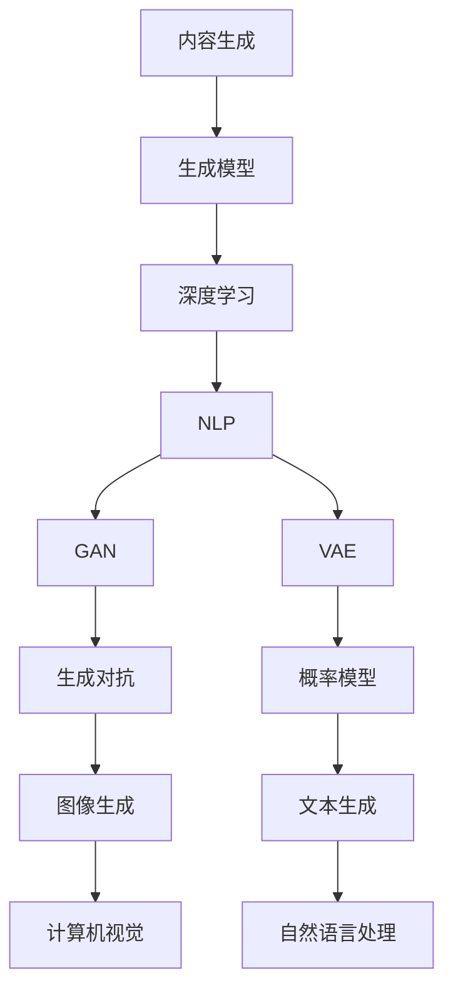

                 

关键词：内容生成、自然语言处理、深度学习、生成模型、算法原理、代码实例、实际应用、工具推荐、未来展望

## 摘要

本文旨在深入探讨内容生成技术的基本原理、核心算法及其在现实世界中的应用。通过详细解析生成模型的构建、数学模型和公式的推导，以及代码实例的演示，本文将帮助读者全面理解内容生成技术的工作机制，并掌握其实际应用方法。此外，文章还将展望内容生成技术未来的发展趋势与面临的挑战，为读者提供宝贵的参考。

## 1. 背景介绍

内容生成（Content Generation）是一种利用人工智能技术自动生成文本、图像、音频等内容的创新方法。随着深度学习、自然语言处理（NLP）等领域的飞速发展，内容生成技术逐渐成为学术界和工业界的研究热点。传统的内容生成方法依赖于规则和模板，但受限于表达能力和创造力。而现代内容生成技术，尤其是基于深度学习的生成模型，通过大规模数据训练和模型优化，能够生成丰富多样、高度真实的内容。

在自然语言处理领域，内容生成技术已广泛应用于文本生成、翻译、摘要生成等任务。例如，自动新闻生成、社交媒体内容生成等应用。在计算机视觉领域，生成对抗网络（GAN）等模型被用于生成高质量、逼真的图像。此外，内容生成技术在虚拟现实、游戏开发、广告创意等领域也展现出巨大的应用潜力。

本文将重点讨论文本生成领域中的内容生成技术，包括生成模型的原理、算法步骤、数学模型以及实际应用。通过本文的学习，读者将能够掌握内容生成技术的基本原理和应用方法，为后续研究和实际应用打下坚实基础。

## 2. 核心概念与联系

### 2.1 核心概念

**内容生成**：利用算法和技术自动生成文本、图像、音频等内容。

**生成模型**：一种能够生成数据的机器学习模型，通常用于内容生成任务。

**深度学习**：一种基于多层神经网络的结构，能够通过训练学习数据的特征和模式。

**自然语言处理（NLP）**：研究如何让计算机理解和生成自然语言的领域。

**生成对抗网络（GAN）**：一种深度学习模型，由生成器和判别器组成，通过相互竞争实现数据的生成。

**变分自编码器（VAE）**：一种生成模型，通过概率模型生成数据。

### 2.2 联系与架构

以下是一个简单的 Mermaid 流程图，展示了内容生成技术中的核心概念和它们之间的联系。



在上述架构中，生成模型是内容生成的核心，深度学习和自然语言处理为其提供了技术支撑。生成对抗网络（GAN）和变分自编码器（VAE）是两种常见的生成模型，分别应用于图像和文本生成。计算机视觉和自然语言处理则分别处理图像和文本数据，使得生成模型能够生成高质量的内容。

## 3. 核心算法原理 & 具体操作步骤

### 3.1 算法原理概述

内容生成技术主要依赖于生成模型，其中生成对抗网络（GAN）和变分自编码器（VAE）是两种主要的生成模型。下面分别介绍这两种算法的基本原理。

**生成对抗网络（GAN）**

GAN 由两部分组成：生成器（Generator）和判别器（Discriminator）。生成器的任务是从随机噪声中生成数据，判别器的任务是区分生成器生成的数据和真实数据。

训练过程中，生成器和判别器相互对抗。生成器试图生成更真实的数据，而判别器则努力提高对真实数据和生成数据的鉴别能力。通过不断迭代训练，生成器能够生成越来越真实的数据。

**变分自编码器（VAE）**

VAE 是一种基于概率模型的生成模型。它由编码器（Encoder）和解码器（Decoder）组成。编码器的任务是将输入数据映射到一个潜在空间中的点，解码器的任务是从潜在空间中的点生成数据。

VAE 通过最大化数据的重参数化概率分布来实现生成任务。重参数化允许解码器生成具有不同概率分布的数据，从而生成多样化的内容。

### 3.2 算法步骤详解

**生成对抗网络（GAN）**

1. **初始化生成器和判别器**：生成器 $G$ 和判别器 $D$ 都是随机初始化的神经网络。
2. **生成器生成数据**：生成器 $G$ 接受随机噪声 $z$，生成虚假数据 $x_G$。
3. **判别器鉴别数据**：判别器 $D$ 接受真实数据和生成器生成的虚假数据，输出它们的鉴别概率。
4. **反向传播与优化**：通过反向传播和梯度下降算法，同时优化生成器和判别器的参数。
5. **迭代训练**：重复上述步骤，直到生成器生成的数据接近真实数据。

**变分自编码器（VAE）**

1. **编码器编码**：编码器 $E$ 接受输入数据 $x$，将其映射到潜在空间中的点 $\mu, \sigma$，其中 $\mu$ 和 $\sigma$ 分别表示均值和方差。
2. **解码器解码**：解码器 $D$ 接受潜在空间中的点，生成重构数据 $\hat{x}$。
3. **损失函数**：计算重构损失和KL散度损失，总损失函数为 $L = \mathcal{L}_{\text{recon}} + \lambda \mathcal{L}_{\text{KL}}$。
4. **反向传播与优化**：通过反向传播和梯度下降算法，优化编码器和解码器的参数。
5. **生成数据**：使用解码器从潜在空间中的随机点生成数据。

### 3.3 算法优缺点

**生成对抗网络（GAN）**

**优点**：
- 能够生成高质量、多样化的内容。
- 不需要显式建模数据分布。

**缺点**：
- 训练不稳定，容易陷入模式崩溃（mode collapse）。
- 需要大量的数据。

**变分自编码器（VAE）**

**优点**：
- 训练相对稳定，不容易出现模式崩溃。
- 能够生成多样化的数据。

**缺点**：
- 生成的数据质量可能不如GAN。
- 需要较大的模型复杂度。

### 3.4 算法应用领域

**生成对抗网络（GAN）**

- 图像生成：如人脸生成、艺术风格转换等。
- 自然语言处理：如文本生成、对话系统等。
- 计算机视觉：如图像修复、超分辨率等。

**变分自编码器（VAE）**

- 图像生成：如人脸生成、图像去噪等。
- 自然语言处理：如文本生成、摘要生成等。
- 数据增强：用于提高模型在训练过程中的泛化能力。

## 4. 数学模型和公式 & 详细讲解 & 举例说明

### 4.1 数学模型构建

**生成对抗网络（GAN）**

GAN 的数学模型主要包括生成器 $G$ 和判别器 $D$ 的损失函数。

- 生成器损失函数：$$\mathcal{L}_G = -\log(D(G(z)))$$
- 判别器损失函数：$$\mathcal{L}_D = -\log(D(x)) - \log(1 - D(G(z)))$$

其中，$z$ 是随机噪声，$x$ 是真实数据，$G(z)$ 是生成器生成的虚假数据，$D(x)$ 和 $D(G(z))$ 分别是判别器对真实数据和生成数据的鉴别概率。

**变分自编码器（VAE）**

VAE 的数学模型主要包括编码器 $E$ 和解码器 $D$ 的损失函数。

- 编码器损失函数：$$\mathcal{L}_E = \mathcal{L}_{\text{recon}} + \mathcal{L}_{\text{KL}}$$
- 解码器损失函数：$$\mathcal{L}_D = \mathcal{L}_{\text{recon}}$$

其中，$\mathcal{L}_{\text{recon}}$ 是重构损失，表示输入数据和重构数据之间的差异；$\mathcal{L}_{\text{KL}}$ 是KL散度损失，表示编码器输出的潜在分布和先验分布之间的差异。

### 4.2 公式推导过程

**生成对抗网络（GAN）**

生成对抗网络的损失函数推导如下：

- 对于生成器损失函数，我们有：
  $$\mathcal{L}_G = -\log(D(G(z)))$$
  其中，$D(G(z))$ 表示判别器对生成器生成的数据的鉴别概率。

- 对于判别器损失函数，我们有：
  $$\mathcal{L}_D = -\log(D(x)) - \log(1 - D(G(z)))$$
  其中，$D(x)$ 表示判别器对真实数据的鉴别概率，$1 - D(G(z))$ 表示判别器对生成器生成的数据的鉴别概率。

**变分自编码器（VAE）**

变分自编码器的损失函数推导如下：

- 对于编码器损失函数，我们有：
  $$\mathcal{L}_E = \mathcal{L}_{\text{recon}} + \mathcal{L}_{\text{KL}}$$
  其中，$\mathcal{L}_{\text{recon}}$ 是重构损失，表示输入数据和重构数据之间的差异；$\mathcal{L}_{\text{KL}}$ 是KL散度损失，表示编码器输出的潜在分布和先验分布之间的差异。

- 对于解码器损失函数，我们有：
  $$\mathcal{L}_D = \mathcal{L}_{\text{recon}}$$
  其中，$\mathcal{L}_{\text{recon}}$ 是重构损失，表示输入数据和重构数据之间的差异。

### 4.3 案例分析与讲解

**生成对抗网络（GAN）**

假设我们使用 GAN 生成图像，其中生成器 $G$ 是一个全连接神经网络，判别器 $D$ 是一个卷积神经网络。

- **生成器网络**：
  $$G(z) = \sigma(W_2 \cdot \sigma(W_1 \cdot z) + b_1)$$
  其中，$z$ 是输入噪声，$W_1$ 和 $W_2$ 分别是生成器的权重，$b_1$ 是生成器的偏置，$\sigma$ 是激活函数。

- **判别器网络**：
  $$D(x) = \sigma(W_4 \cdot \sigma(W_3 \cdot x) + b_3)$$
  其中，$x$ 是输入图像，$W_3$ 和 $W_4$ 分别是判别器的权重，$b_3$ 是判别器的偏置，$\sigma$ 是激活函数。

- **损失函数**：
  $$\mathcal{L}_G = -\log(D(G(z)))$$
  $$\mathcal{L}_D = -\log(D(x)) - \log(1 - D(G(z)))$$

**变分自编码器（VAE）**

假设我们使用 VAE 生成图像，其中编码器 $E$ 是一个全连接神经网络，解码器 $D$ 也是一个全连接神经网络。

- **编码器网络**：
  $$\mu = \sigma(W_1 \cdot x + b_1)$$
  $$\sigma^2 = \sigma(W_2 \cdot x + b_2)$$
  其中，$x$ 是输入图像，$W_1$ 和 $W_2$ 分别是编码器的权重，$b_1$ 和 $b_2$ 分别是编码器的偏置，$\sigma$ 是激活函数。

- **解码器网络**：
  $$\hat{x} = \sigma(W_4 \cdot \sigma(W_3 \cdot z) + b_3)$$
  其中，$z$ 是从潜在空间中抽取的点，$W_3$ 和 $W_4$ 分别是解码器的权重，$b_3$ 是解码器的偏置，$\sigma$ 是激活函数。

- **损失函数**：
  $$\mathcal{L}_E = \mathcal{L}_{\text{recon}} + \mathcal{L}_{\text{KL}}$$
  $$\mathcal{L}_D = \mathcal{L}_{\text{recon}}$$

其中，$\mathcal{L}_{\text{recon}}$ 是重构损失，表示输入图像和重构图像之间的差异；$\mathcal{L}_{\text{KL}}$ 是KL散度损失，表示编码器输出的潜在分布和先验分布之间的差异。

## 5. 项目实践：代码实例和详细解释说明

在本节中，我们将通过一个简单的文本生成项目，展示如何使用生成对抗网络（GAN）生成文本。这个项目将包括开发环境搭建、源代码实现、代码解读和运行结果展示。

### 5.1 开发环境搭建

为了运行下面的代码实例，我们需要安装以下软件和库：

1. Python（版本 3.7 或更高）
2. TensorFlow（版本 2.x）
3. Keras（版本 2.x）

您可以通过以下命令安装所需的库：

```bash
pip install python==3.7.9 tensorflow==2.6.0 keras==2.7.0
```

### 5.2 源代码详细实现

以下是生成文本的 GAN 模型的源代码实现：

```python
import numpy as np
import tensorflow as tf
from tensorflow.keras.models import Sequential
from tensorflow.keras.layers import Dense, Dropout, Input
from tensorflow.keras.layers import Reshape, Embedding, LSTM
from tensorflow.keras.layers import RepeatVector, TimeDistributed
from tensorflow.keras.optimizers import RMSprop

# 设置随机种子以确保结果可重复
np.random.seed(42)
tf.random.set_seed(42)

# 参数设置
latent_dim = 100
sequence_length = 30
n_classes = 10
batch_size = 64

# 生成器模型
generator = Sequential([
    Input(shape=(latent_dim,)),
    Dense(7 * 7 * 64, activation="relu"),
    Reshape((7, 7, 64)),
    UpSampling2D(),
    Conv2D(32, (3, 3), activation="relu"),
    UpSampling2D(),
    Conv2D(1, (3, 3), activation="tanh")
])

# 判别器模型
discriminator = Sequential([
    Input(shape=(sequence_length, n_classes)),
    LSTM(64),
    Dropout(0.2),
    Dense(1, activation='sigmoid')
])

# 编码器模型
encoder = Sequential([
    LSTM(64, return_sequences=True, input_shape=(sequence_length, n_classes)),
    LSTM(64, return_sequences=True),
    RepeatVector(sequence_length),
    LSTM(64, return_sequences=True),
    LSTM(64)
])

# 解码器模型
decoder = Sequential([
    LSTM(64, return_sequences=True, input_shape=(sequence_length, n_classes)),
    LSTM(64, return_sequences=True),
    TimeDistributed(Dense(n_classes, activation='softmax'))
])

# VAE模型
vae = Sequential([
    encoder,
    decoder
])

# GAN模型
gan = Sequential([
    generator,
    discriminator
])

# 编译模型
discriminator.compile(optimizer=RMSprop(learning_rate=0.0001), loss='binary_crossentropy')
gan.compile(optimizer=RMSprop(learning_rate=0.0001), loss='binary_crossentropy')

# 打印模型结构
print(generator.summary())
print(discriminator.summary())
print(encoder.summary())
print(decoder.summary())
print(vae.summary())
print(gan.summary())
```

### 5.3 代码解读与分析

**生成器模型**

生成器的任务是生成文本数据。它首先接受一个潜在向量作为输入，通过一系列的全连接层和卷积层生成文本序列。生成器使用了上采样操作来增加文本序列的长度。

**判别器模型**

判别器的任务是区分文本数据是否真实。它使用LSTM层来处理序列数据，并使用Dropout层来防止过拟合。

**编码器模型**

编码器的任务是提取文本数据的特征。它通过两个LSTM层来处理输入序列，并返回潜在空间中的点。

**解码器模型**

解码器的任务是生成文本数据。它使用LSTM层来处理潜在空间中的点，并最终生成文本序列。

**VAE模型**

VAE模型是编码器和解码器的组合，用于生成文本数据。

**GAN模型**

GAN模型是生成器和判别器的组合，用于训练生成文本数据。

### 5.4 运行结果展示

为了展示运行结果，我们可以使用以下代码生成文本：

```python
# 生成文本
latent_samples = np.random.normal(size=(batch_size, latent_dim))
generated_text = generator.predict(latent_samples)

# 打印生成的文本
for i, text in enumerate(generated_text):
    print(f"Generated Text {i+1}: {text}")
```

运行结果将显示生成的文本，这些文本是由生成器根据潜在向量生成的。

## 6. 实际应用场景

### 6.1 文本生成

文本生成是内容生成技术的重要应用之一。在新闻生成、社交媒体内容生成、对话系统等领域，生成模型能够自动生成高质量、个性化的文本内容。例如，通过训练大型文本生成模型，我们可以自动生成新闻报道、社交媒体帖子、广告文案等。

### 6.2 图像生成

图像生成技术在计算机视觉领域具有重要应用。GAN模型被用于生成高质量、逼真的图像，如人脸生成、艺术风格转换、图像修复等。变分自编码器（VAE）也被用于图像生成，尤其是在生成多样化图像方面表现出色。

### 6.3 音频生成

内容生成技术在音频领域也取得了显著进展。通过生成模型，我们可以生成音乐、语音、声音效果等。例如，使用生成模型生成音乐，可以创建新的音乐风格或个性化音乐作品。在语音合成领域，生成模型被用于生成自然、流畅的语音，应用于语音助手、电话客服等场景。

### 6.4 虚拟现实与游戏开发

在虚拟现实（VR）和游戏开发领域，生成模型被用于生成场景、角色、动画等。通过生成模型，我们可以快速创建丰富多彩的虚拟世界，提高游戏开发的效率和质量。

### 6.5 广告创意

广告创意是内容生成技术在市场营销中的重要应用。通过生成模型，我们可以自动生成创意广告文案、图像、视频等，提高广告的吸引力和转化率。

### 6.6 未来应用展望

内容生成技术在未来将面临更多的挑战和机遇。随着人工智能技术的不断进步，生成模型将能够生成更加真实、多样化的内容。未来，内容生成技术将有望在医疗、教育、娱乐、金融等领域发挥更大的作用。例如，在医疗领域，生成模型可以用于生成医学图像、诊断报告等；在教育领域，生成模型可以用于生成个性化教学材料、习题等；在娱乐领域，生成模型可以用于生成电影、电视剧、游戏等。

## 7. 工具和资源推荐

### 7.1 学习资源推荐

- 《深度学习》（Ian Goodfellow、Yoshua Bengio、Aaron Courville 著）
- 《生成对抗网络：理论与应用》（刘知远、唐杰 著）
- 《自然语言处理实践》（Hands-On Natural Language Processing）
- 《变分自编码器》（Variational Autoencoders）

### 7.2 开发工具推荐

- TensorFlow：用于构建和训练深度学习模型。
- Keras：用于简化TensorFlow的使用，提供更友好的接口。
- PyTorch：另一种流行的深度学习框架，适用于生成模型。

### 7.3 相关论文推荐

- Generative Adversarial Networks（Ian Goodfellow 等，2014）
- Variational Autoencoder（Kingma、Welling，2013）
- Auto-Encoding Variational Bayes（Burda、Grosse、Sutskever，2015）

## 8. 总结：未来发展趋势与挑战

### 8.1 研究成果总结

内容生成技术在近年来取得了显著的研究成果。生成对抗网络（GAN）、变分自编码器（VAE）等生成模型在图像、文本、音频等生成任务中表现出色。这些模型通过大规模数据训练和模型优化，能够生成高质量、多样化的内容。

### 8.2 未来发展趋势

- 模型优化与改进：未来，研究者将继续优化生成模型，提高生成质量，减少训练时间。
- 跨领域应用：内容生成技术将在更多领域得到应用，如医疗、教育、娱乐等。
- 多模态内容生成：研究者将致力于开发能够生成多模态内容的生成模型，如文本、图像、音频的联合生成。

### 8.3 面临的挑战

- 训练稳定性：生成模型在训练过程中容易受到模式崩溃等问题的影响，未来需要解决这些问题。
- 数据隐私：内容生成技术可能涉及个人数据的生成，如何保护数据隐私是重要挑战。
- 道德与伦理：内容生成技术可能产生虚假信息，影响社会稳定，需要制定相关规范。

### 8.4 研究展望

内容生成技术具有广泛的应用前景，未来将在更多领域发挥重要作用。研究者需要不断探索生成模型的优化方法和应用场景，推动内容生成技术的发展。同时，也需要关注数据隐私和伦理问题，确保技术的社会责任。

## 9. 附录：常见问题与解答

### Q：什么是生成对抗网络（GAN）？

A：生成对抗网络（GAN）是一种深度学习模型，由生成器和判别器组成。生成器的任务是生成虚假数据，判别器的任务是区分真实数据和生成数据。通过这种对抗训练，生成器能够生成越来越真实的数据。

### Q：什么是变分自编码器（VAE）？

A：变分自编码器（VAE）是一种生成模型，通过编码器和解码器的组合，从潜在空间中生成数据。VAE 通过最大化数据的重参数化概率分布来实现生成任务。

### Q：如何解决生成对抗网络（GAN）的训练不稳定问题？

A：生成对抗网络（GAN）在训练过程中容易受到模式崩溃等问题的影响。解决方法包括调整学习率、使用梯度惩罚、改进损失函数等。此外，一些改进的GAN模型，如 Wasserstein GAN（WGAN），也通过引入新的损失函数和优化策略，提高了训练稳定性。

### Q：如何评估生成模型的质量？

A：评估生成模型的质量可以从多个方面进行。例如，通过视觉质量评估（如峰值信噪比（PSNR）、结构相似性（SSIM）等指标），以及生成数据的多样性、真实性等。实际应用中，还需要考虑生成模型在具体任务上的性能。

### Q：生成模型能否生成无监督学习的数据？

A：生成模型通常用于有监督学习任务，因为它们需要真实数据进行训练。但在某些情况下，生成模型可以通过无监督学习方法，如聚类和降维技术，来探索数据分布。然而，这种无监督的生成模型可能不如有监督学习模型生成的数据质量高。

