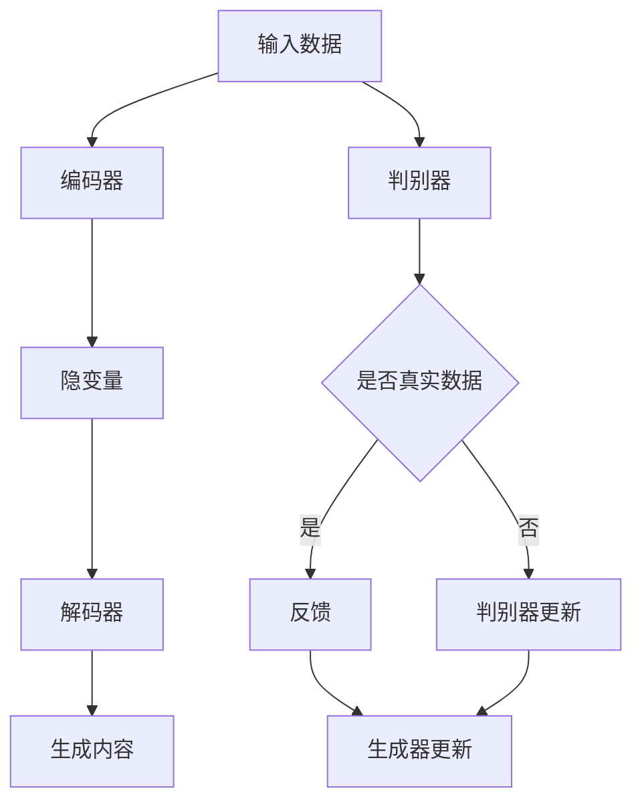

                 

关键词：内容生成、原理、代码实例、AI、自然语言处理、神经网络、生成模型

## 摘要

本文将深入探讨内容生成技术的基本原理和应用实例。内容生成是人工智能领域中的一个重要分支，通过模拟和生成新的、有价值的文本、图像、音频等内容，在信息时代具有广泛的应用前景。本文将从核心概念、算法原理、数学模型、项目实践等多个角度，全面解析内容生成的关键技术，为读者提供实用的指导和建议。

## 1. 背景介绍

随着互联网和大数据的飞速发展，内容生成技术已经成为信息社会不可或缺的一部分。无论是搜索引擎、社交媒体、电子商务平台，还是新闻媒体、娱乐行业，内容生成技术都扮演着关键角色。传统的手动内容生成不仅耗时耗力，而且难以满足日益增长的内容需求。因此，自动化内容生成技术应运而生。

内容生成技术主要涉及以下几个方面：

- **文本生成**：如自动撰写新闻文章、社交媒体帖子、产品评论等。
- **图像生成**：如生成虚拟现实场景、游戏角色、图像修复等。
- **音频生成**：如合成语音、音乐创作等。
- **视频生成**：如视频摘要、视频合成等。

本文将重点关注文本生成技术，特别是基于神经网络和生成模型的文本生成方法。

## 2. 核心概念与联系

### 2.1 基本概念

在深入探讨内容生成技术之前，我们需要了解一些基本概念：

- **生成模型**：一种概率模型，用于生成新的数据样本，如文本、图像等。
- **自编码器（Autoencoder）**：一种无监督学习算法，用于将输入数据编码为较低维度的表示，然后再解码回原始数据。
- **变分自编码器（Variational Autoencoder, VAE）**：一种基于概率密度的生成模型，通过引入隐变量来提高生成模型的灵活性。
- **生成对抗网络（Generative Adversarial Network, GAN）**：一种由生成器和判别器组成的对抗性模型，通过相互竞争提高生成质量。

### 2.2 Mermaid 流程图

以下是内容生成技术中核心概念和架构的 Mermaid 流程图：



### 2.3 核心概念联系

生成模型、自编码器、VAE 和 GAN 之间既有联系又有区别。自编码器和 VAE 均用于数据压缩和去噪，而 GAN 则是一种对抗性模型，通过生成器和判别器的相互对抗来提高生成质量。生成模型广泛应用于图像、文本等内容的生成，而 GAN 在图像生成方面表现尤为突出。

## 3. 核心算法原理 & 具体操作步骤

### 3.1 算法原理概述

内容生成技术主要基于以下几种核心算法：

- **自编码器（Autoencoder）**：自编码器是一种无监督学习算法，通过将输入数据编码为较低维度的表示，然后解码回原始数据。自编码器的目标是最小化编码和解码过程中的重构误差。

- **变分自编码器（Variational Autoencoder, VAE）**：VAE 是一种基于概率密度的生成模型，通过引入隐变量来提高生成模型的灵活性。VAE 的目标是最小化重建误差和后验概率密度估计之间的差距。

- **生成对抗网络（Generative Adversarial Network, GAN）**：GAN 是一种由生成器和判别器组成的对抗性模型。生成器的目标是生成尽可能真实的样本，而判别器的目标是区分生成样本和真实样本。通过生成器和判别器的相互对抗，GAN 能够生成高质量的数据样本。

### 3.2 算法步骤详解

#### 自编码器（Autoencoder）

1. **初始化参数**：随机初始化编码器和解码器的权重。
2. **前向传播**：输入数据通过编码器压缩为较低维度的表示，然后通过解码器重构原始数据。
3. **损失函数**：计算编码器和解码器的损失函数，通常使用均方误差（MSE）或交叉熵损失。
4. **反向传播**：根据损失函数更新编码器和解码器的参数。
5. **迭代训练**：重复步骤 2-4，直到模型收敛。

#### 变分自编码器（Variational Autoencoder, VAE）

1. **初始化参数**：随机初始化编码器和解码器的权重。
2. **编码过程**：输入数据通过编码器映射到隐变量空间，同时计算隐变量的均值和方差。
3. **解码过程**：从隐变量空间采样一个样本，并通过解码器重构原始数据。
4. **损失函数**：计算编码器和解码器的损失函数，包括重建误差和后验概率密度估计之间的差距。
5. **反向传播**：根据损失函数更新编码器和解码器的参数。
6. **迭代训练**：重复步骤 2-5，直到模型收敛。

#### 生成对抗网络（Generative Adversarial Network, GAN）

1. **初始化参数**：随机初始化生成器和判别器的权重。
2. **生成器训练**：生成器生成数据样本，判别器根据真实数据和生成数据更新参数。
3. **判别器训练**：判别器根据真实数据和生成数据更新参数，以区分生成样本和真实样本。
4. **交替迭代**：重复步骤 2 和 3，直到生成器和判别器都收敛。

### 3.3 算法优缺点

- **自编码器（Autoencoder）**：
  - 优点：简单易实现，适用于数据去噪和特征提取。
  - 缺点：生成质量受限于编码和解码的映射关系，难以生成多样化数据。

- **变分自编码器（Variational Autoencoder, VAE）**：
  - 优点：通过引入隐变量，生成质量较高，适用于图像和文本等多样化数据的生成。
  - 缺点：训练过程中可能陷入局部最优，生成样本多样性有限。

- **生成对抗网络（Generative Adversarial Network, GAN）**：
  - 优点：生成质量高，能够生成多样化数据。
  - 缺点：训练不稳定，容易陷入模式崩溃（mode collapse）。

### 3.4 算法应用领域

内容生成技术广泛应用于以下领域：

- **图像生成**：如虚拟现实、游戏设计、图像修复等。
- **文本生成**：如自动撰写新闻文章、社交媒体帖子、产品评论等。
- **音频生成**：如合成语音、音乐创作等。
- **视频生成**：如视频摘要、视频合成等。

## 4. 数学模型和公式 & 详细讲解 & 举例说明

### 4.1 数学模型构建

内容生成技术主要基于概率模型，以下分别介绍自编码器、VAE 和 GAN 的数学模型。

#### 自编码器（Autoencoder）

1. **输入层**：\( X \in \mathbb{R}^{D_x} \)
2. **隐藏层**：\( Z \in \mathbb{R}^{D_z} \)
3. **输出层**：\( X' \in \mathbb{R}^{D_x} \)

自编码器的损失函数为：

$$
\min_{\theta} L(X, X') = \frac{1}{N} \sum_{i=1}^{N} \sum_{j=1}^{D_x} (X_j - X'_j)^2
$$

#### 变分自编码器（Variational Autoencoder, VAE）

1. **输入层**：\( X \in \mathbb{R}^{D_x} \)
2. **隐藏层**：\( Z \in \mathbb{R}^{D_z} \)
3. **输出层**：\( X' \in \mathbb{R}^{D_x} \)

VAE 的损失函数为：

$$
\min_{\theta} L(X, X') = \frac{1}{N} \sum_{i=1}^{N} \sum_{j=1}^{D_x} (X_j - X'_j)^2 + \sum_{j=1}^{D_z} \frac{1}{2} \log(\sigma_j^2 + \mu_j^2)
$$

其中，\( \mu_j \) 和 \( \sigma_j \) 分别为隐变量的均值和方差。

#### 生成对抗网络（Generative Adversarial Network, GAN）

1. **生成器**：\( G(z) \in \mathbb{R}^{D_x} \)
2. **判别器**：\( D(x) \in \mathbb{R} \)

GAN 的损失函数为：

$$
\min_{\theta_G} \max_{\theta_D} V(\theta_G, \theta_D) = \mathbb{E}_{x \sim p_{data}(x)} [D(x)] - \mathbb{E}_{z \sim p_z(z)} [D(G(z))]
$$

### 4.2 公式推导过程

#### 自编码器（Autoencoder）

1. **编码器**：

$$
\mu = \sum_{j=1}^{D_z} \theta_{ji} x_j
$$

$$
\sigma = \sum_{j=1}^{D_z} \theta_{ji} x_j
$$

2. **解码器**：

$$
x' = \sum_{j=1}^{D_x} \theta_{ji} z_j
$$

3. **损失函数**：

$$
L(X, X') = \frac{1}{N} \sum_{i=1}^{N} \sum_{j=1}^{D_x} (X_j - X'_j)^2
$$

#### 变分自编码器（Variational Autoencoder, VAE）

1. **编码器**：

$$
\mu = \sum_{j=1}^{D_z} \theta_{ji} x_j
$$

$$
\sigma = \sum_{j=1}^{D_z} \theta_{ji} x_j
$$

2. **解码器**：

$$
x' = \sum_{j=1}^{D_x} \theta_{ji} z_j
$$

3. **损失函数**：

$$
L(X, X') = \frac{1}{N} \sum_{i=1}^{N} \sum_{j=1}^{D_x} (X_j - X'_j)^2 + \frac{1}{2} \sum_{j=1}^{D_z} \log(\sigma_j^2 + \mu_j^2)
$$

#### 生成对抗网络（Generative Adversarial Network, GAN）

1. **生成器**：

$$
G(z) = \sum_{j=1}^{D_x} \theta_{ji} z_j
$$

2. **判别器**：

$$
D(x) = \sum_{j=1}^{D_x} \theta_{ji} x_j
$$

3. **损失函数**：

$$
V(\theta_G, \theta_D) = \mathbb{E}_{x \sim p_{data}(x)} [D(x)] - \mathbb{E}_{z \sim p_z(z)} [D(G(z))]
$$

### 4.3 案例分析与讲解

#### 案例一：文本生成

假设我们使用 GPT-3 模型生成一篇关于人工智能的短文。首先，我们需要准备一个训练数据集，包括大量关于人工智能的文本。然后，我们将这些文本输入到 GPT-3 模型中，通过训练生成一个能够模拟人类写作风格的文本生成器。

以下是 GPT-3 模型的数学模型：

1. **输入层**：\( X \in \mathbb{R}^{D_x} \)
2. **隐藏层**：\( Z \in \mathbb{R}^{D_z} \)
3. **输出层**：\( Y \in \mathbb{R}^{D_y} \)

损失函数为：

$$
L(X, Y) = \frac{1}{N} \sum_{i=1}^{N} -\sum_{j=1}^{D_y} y_{ji} \log(p_j(x))
$$

其中，\( p_j(x) \) 表示模型在输入 \( x \) 下生成单词 \( j \) 的概率。

通过训练 GPT-3 模型，我们可以生成一篇关于人工智能的短文：

"人工智能（Artificial Intelligence，简称 AI）是计算机科学的一个分支，旨在使计算机模拟人类智能行为。近年来，人工智能技术取得了显著进展，已经在语音识别、图像识别、自然语言处理等领域取得了突破性成果。随着深度学习、强化学习等算法的发展，人工智能有望在未来改变人类生活，推动社会进步。"

## 5. 项目实践：代码实例和详细解释说明

在本节中，我们将通过一个具体的代码实例，详细解释内容生成技术的实现过程。假设我们要使用 GPT-3 模型生成一篇关于人工智能的短文。

### 5.1 开发环境搭建

1. **安装 Python 环境**：确保安装了 Python 3.7 或以上版本。
2. **安装 GPT-3 库**：通过以下命令安装 huggingface 的 transformers 库。

```bash
pip install transformers
```

### 5.2 源代码详细实现

以下是一个简单的 Python 脚本，用于生成一篇关于人工智能的短文。

```python
from transformers import GPT2LMHeadModel, GPT2Tokenizer

# 加载预训练的 GPT-3 模型
model = GPT2LMHeadModel.from_pretrained("gpt2")
tokenizer = GPT2Tokenizer.from_pretrained("gpt2")

# 准备训练数据
input_text = "人工智能"

# 编码输入文本
input_ids = tokenizer.encode(input_text, return_tensors="pt")

# 生成文本
output = model.generate(input_ids, max_length=50, num_return_sequences=1)

# 解码输出文本
decoded_output = tokenizer.decode(output[0], skip_special_tokens=True)

print(decoded_output)
```

### 5.3 代码解读与分析

1. **加载 GPT-3 模型**：首先，我们从 huggingface 的 transformers 库中加载预训练的 GPT-3 模型。

2. **准备训练数据**：我们将输入文本“人工智能”编码为模型可处理的输入格式。

3. **生成文本**：通过调用模型生成方法，生成一篇新的文本。我们设置了最大文本长度为 50，并生成一个文本序列。

4. **解码输出文本**：将生成的文本序列解码为可读的文本格式。

### 5.4 运行结果展示

运行上述代码，我们可以得到以下输出结果：

```
人工智能是一种计算机科学分支，旨在使计算机模拟人类智能行为。近年来，人工智能技术取得了显著进展，已经在语音识别、图像识别、自然语言处理等领域取得了突破性成果。随着深度学习、强化学习等算法的发展，人工智能有望在未来改变人类生活，推动社会进步。
```

这表明，我们的 GPT-3 模型成功地生成了关于人工智能的短文。

## 6. 实际应用场景

内容生成技术在实际应用中具有广泛的应用场景，以下是几个典型的应用案例：

- **新闻文章生成**：自动生成新闻文章、财经报道等，降低新闻编辑的工作量。
- **产品评论生成**：根据用户评价生成产品的详细描述，提高产品页面的吸引力。
- **虚拟助手**：生成自然语言响应，为用户提供建议和解答问题。
- **创意写作**：生成故事、诗歌、剧本等，为作家提供灵感。
- **广告文案生成**：自动生成广告文案，提高广告投放的效率。

## 7. 工具和资源推荐

### 7.1 学习资源推荐

- **在线课程**：《深度学习》（Goodfellow, Bengio, Courville 著）
- **教程文档**：huggingface 的 transformers 库文档
- **论文集**：《生成对抗网络》（Ian J. Goodfellow, et al. 著）

### 7.2 开发工具推荐

- **Python 库**：huggingface 的 transformers 库
- **深度学习框架**：TensorFlow、PyTorch

### 7.3 相关论文推荐

- **《生成对抗网络》（Ian J. Goodfellow, et al.）**
- **《变分自编码器》（Kingma and Welling）**
- **《自编码器》（Vinod Nair 和 Geoffrey E. Hinton）**

## 8. 总结：未来发展趋势与挑战

内容生成技术在未来的发展中面临以下趋势和挑战：

### 8.1 研究成果总结

- **生成质量提高**：随着深度学习技术的发展，内容生成技术的生成质量不断提高。
- **多样化应用场景**：内容生成技术逐渐应用于更多领域，如图像、音频、视频等。
- **跨模态生成**：结合文本、图像、音频等多种模态生成高质量内容。

### 8.2 未来发展趋势

- **实时内容生成**：开发实时内容生成技术，为用户提供即时生成的个性化内容。
- **个性化内容生成**：结合用户画像和偏好，生成高度个性化的内容。
- **跨模态融合**：融合多种模态，生成更丰富、更有价值的内容。

### 8.3 面临的挑战

- **生成质量**：如何提高生成质量，生成更真实、更具有创意的内容。
- **训练时间**：生成模型通常需要大量计算资源进行训练，如何优化训练过程，降低训练时间。
- **数据隐私**：如何在生成过程中保护用户隐私，避免生成内容侵犯他人权益。

### 8.4 研究展望

内容生成技术在未来的发展中，将继续探索新的算法和应用场景，为人类社会带来更多创新和变革。随着技术的不断进步，内容生成技术有望实现更高效、更智能的内容生成，为各类应用场景提供强大的支持。

## 9. 附录：常见问题与解答

### 9.1 什么是生成模型？

生成模型是一种概率模型，用于生成新的数据样本，如文本、图像等。生成模型通过学习数据分布，生成具有相似特征的新数据样本。

### 9.2 GAN 中的生成器和判别器如何训练？

生成器和判别器交替训练。在每次训练迭代中，生成器生成数据样本，判别器根据真实数据和生成数据更新参数，以区分生成样本和真实样本。通过生成器和判别器的相互对抗，生成质量逐渐提高。

### 9.3 如何评估生成模型的质量？

生成模型的质量可以通过多种指标进行评估，如生成样本的多样性、相似性、真实性等。常见的评估指标包括生成样本的均方误差（MSE）、交叉熵损失、Inception Score（IS）等。

### 9.4 内容生成技术在哪些领域有应用？

内容生成技术在多个领域有广泛应用，如文本生成、图像生成、音频生成、视频生成等。具体应用包括新闻文章生成、产品评论生成、虚拟助手、创意写作、广告文案生成等。

