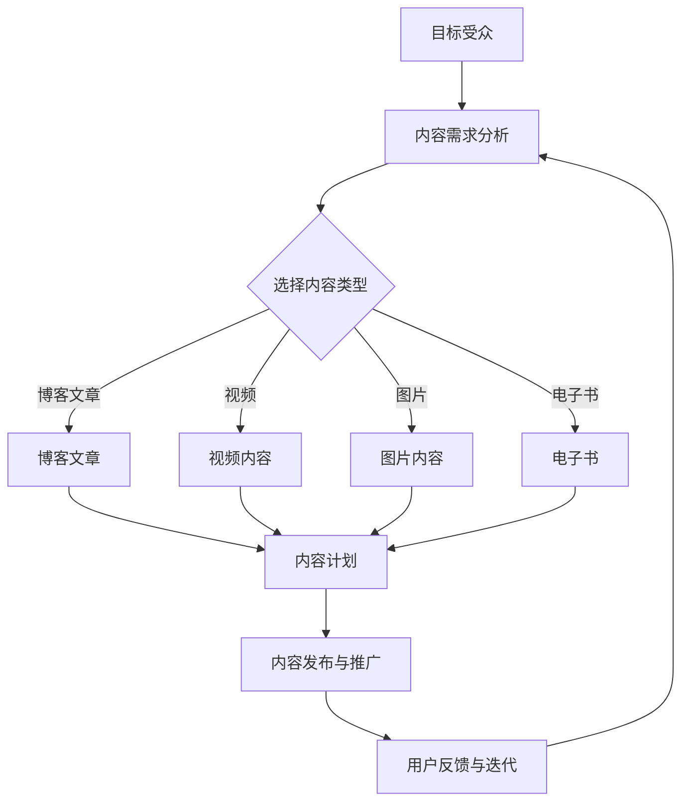

                 

在当今数字化信息爆炸的时代，内容营销已经成为企业推广产品和品牌的关键手段。高质量的内容不仅能够提升用户参与度，还能增强品牌认知度和客户忠诚度。然而，持续输出高质量原创内容并非易事，需要制定科学的内容营销策略。本文将探讨如何通过构建有效的策略来持续输出高质量原创内容，从而在激烈的市场竞争中脱颖而出。

## 关键词

- 内容营销
- 原创内容
- 质量控制
- 策略制定
- 品牌建设
- 用户参与

## 摘要

本文旨在分析内容营销的核心理念，探讨如何制定和实施一套科学的内容营销策略，以便企业能够持续输出高质量的原创内容。文章首先介绍了内容营销的背景和重要性，随后详细阐述了核心概念与联系，并深入讨论了核心算法原理和具体操作步骤。此外，文章还通过数学模型和项目实践展示了策略的实用性和有效性。最后，文章总结了未来发展趋势与挑战，并推荐了相关工具和资源。

### 1. 背景介绍

内容营销作为一种营销策略，旨在通过创造和分发有价值、相关且一致的内容来吸引和留住明确的目标受众，并最终推动 profitable 客户行动。其起源可以追溯到上世纪90年代，随着互联网的普及，企业开始意识到传统广告的局限性，转而通过内容来建立品牌与用户之间的信任和互动。

随着社交媒体的兴起和搜索引擎优化（SEO）技术的发展，内容营销的重要性日益凸显。根据市场研究公司的数据，超过90%的B2B企业已经将内容营销作为其营销战略的核心部分。同时，高质量的原创内容已经成为企业在信息泛滥的市场中脱颖而出的关键因素。

在技术层面，人工智能和大数据分析等先进技术的应用，使得内容营销策略的制定和执行更加科学和高效。这些技术可以帮助企业更好地理解用户需求，精确地定位目标受众，从而创造更加个性化的内容。

### 2. 核心概念与联系

为了更好地理解内容营销的策略，我们需要先明确几个核心概念：

- **目标受众（Target Audience）**：这是企业希望吸引和影响的人群。了解目标受众的需求、偏好和行为模式，是内容营销策略制定的基础。

- **内容类型（Content Types）**：企业可以根据目标受众的需求和内容营销目标，选择不同的内容形式，如博客文章、视频、图片、社交媒体帖子、电子书等。

- **内容质量（Content Quality）**：高质量的内容应该是有价值、相关、一致、有吸引力且易于理解。内容质量是衡量内容营销成功与否的关键标准。

- **内容计划（Content Plan）**：这是内容营销策略的具体实施步骤，包括内容主题、发布频率、内容形式和推广渠道等。

为了更直观地展示这些概念之间的关系，我们可以使用Mermaid流程图来描述：



### 3. 核心算法原理 & 具体操作步骤

#### 3.1 算法原理概述

内容营销的策略制定需要基于数据分析和技术支持。核心算法包括以下几个步骤：

1. **用户需求分析**：利用大数据分析技术，收集和分析用户行为数据，如搜索关键词、浏览习惯、社交媒体互动等，以了解用户需求。

2. **内容策略制定**：基于用户需求分析结果，制定相应的内容策略，包括内容主题、形式和发布频率。

3. **内容创作与审核**：创作内容并经过多轮审核，确保内容质量。

4. **内容发布与推广**：选择合适的渠道和时机发布内容，并进行推广。

5. **用户反馈与迭代**：收集用户反馈，对内容策略进行调整和优化。

#### 3.2 算法步骤详解

1. **用户需求分析**：

   用户需求分析的目的是理解目标受众的需求和偏好。具体步骤如下：

   - **数据收集**：通过网站分析工具（如Google Analytics）和社交媒体分析工具收集用户数据。
   - **数据分析**：使用数据挖掘技术，对收集到的数据进行分析，识别用户行为模式和兴趣点。
   - **用户画像**：基于数据分析结果，创建用户画像，包括用户年龄、性别、职业、兴趣等。

2. **内容策略制定**：

   根据用户画像和数据分析结果，制定内容策略。具体步骤如下：

   - **内容主题选择**：根据用户需求和兴趣选择合适的主题。
   - **内容形式选择**：结合目标受众的偏好，选择合适的内容形式。
   - **发布频率制定**：根据内容类型和用户需求，制定合适的发布频率。

3. **内容创作与审核**：

   内容创作是内容营销的核心环节，具体步骤如下：

   - **内容创作**：根据内容策略，创作高质量的内容。
   - **内容审核**：内容发布前，进行多轮审核，确保内容质量。

4. **内容发布与推广**：

   内容发布与推广的目的是将内容传达给目标受众。具体步骤如下：

   - **内容发布**：选择合适的渠道和时机发布内容。
   - **内容推广**：通过社交媒体、电子邮件、广告等渠道推广内容。

5. **用户反馈与迭代**：

   用户反馈是内容营销策略优化的重要依据。具体步骤如下：

   - **用户反馈收集**：通过用户评论、调查问卷等方式收集用户反馈。
   - **内容迭代**：根据用户反馈，对内容策略进行调整和优化。

#### 3.3 算法优缺点

**优点**：

- **精准定位**：基于大数据分析，能够精准定位目标受众。
- **提高用户参与度**：高质量的内容能够提高用户参与度和满意度。
- **优化品牌形象**：持续输出高质量原创内容，有助于提升品牌形象和信誉。

**缺点**：

- **资源投入**：内容营销需要大量的时间和资源，尤其是高质量原创内容的生产和推广。
- **数据隐私**：大数据分析可能涉及用户隐私问题，需要妥善处理。

#### 3.4 算法应用领域

内容营销策略在多个领域都有广泛应用，包括：

- **电子商务**：通过高质量的内容吸引潜在客户，促进销售。
- **教育**：利用内容营销提升学校或在线教育的知名度。
- **金融**：通过内容营销增强品牌信誉，吸引潜在客户。
- **医疗健康**：提供有价值的内容，帮助患者和医疗专业人士。

### 4. 数学模型和公式 & 详细讲解 & 举例说明

#### 4.1 数学模型构建

为了更好地理解和评估内容营销的效果，我们可以构建一个简单的数学模型。假设我们有以下几个变量：

- **C**：内容质量评分（0到10分）
- **A**：用户参与度评分（0到10分）
- **B**：品牌知名度评分（0到10分）

根据这些变量，我们可以构建以下数学模型：

$$
效果得分 = C \times A \times B
$$

这个模型表示，内容质量、用户参与度和品牌知名度三个因素共同决定了内容营销的效果。

#### 4.2 公式推导过程

公式推导的过程可以分为以下几个步骤：

1. **内容质量评分C**：

   内容质量评分是根据内容的原创性、准确性、相关性、易懂性等多个维度综合评估得出的。假设我们使用一个线性加权模型来计算内容质量评分，公式如下：

   $$
   C = w_1 \times 原创性评分 + w_2 \times 准确性评分 + w_3 \times 相关性评分 + w_4 \times 易懂性评分
   $$

   其中，$w_1, w_2, w_3, w_4$ 是权重系数。

2. **用户参与度评分A**：

   用户参与度评分是根据用户的互动行为（如点赞、评论、分享等）计算得出的。假设我们使用一个简单的计数模型，公式如下：

   $$
   A = \frac{互动次数}{总用户数}
   $$

3. **品牌知名度评分B**：

   品牌知名度评分是根据品牌在社交媒体上的关注度、搜索排名等多个因素综合评估得出的。假设我们使用一个指数模型，公式如下：

   $$
   B = e^{k \times 品牌关注度} \times e^{m \times 搜索排名}
   $$

   其中，$k$ 和 $m$ 是权重系数。

4. **效果得分**：

   将以上三个评分代入效果得分的公式，得到：

   $$
   效果得分 = C \times A \times B
   $$

#### 4.3 案例分析与讲解

为了更好地理解这个模型，我们可以通过一个实际案例来进行分析。

**案例**：一家电子商务公司通过内容营销提升品牌知名度。

- **内容质量评分C**：该公司发布了一篇关于如何选择高品质化妆品的博客文章，经过多轮审核，最终评分达到9分。
- **用户参与度评分A**：文章发布后，吸引了1000名用户阅读，其中200名用户进行了评论和点赞，参与度评分为8分。
- **品牌知名度评分B**：由于该公司的社交媒体运营得当，品牌关注度达到10000次，搜索排名为前5%，品牌知名度评分为7分。

将这些数据代入效果得分的公式，得到：

$$
效果得分 = 9 \times 8 \times 7 = 504
$$

这个得分表示该次内容营销的效果较好，对提升品牌知名度有一定的贡献。

### 5. 项目实践：代码实例和详细解释说明

为了更好地展示内容营销策略的实施过程，我们通过一个实际项目来进行代码实例和详细解释说明。

#### 5.1 开发环境搭建

我们使用Python作为编程语言，搭建了一个简单的内容营销分析系统。开发环境需要Python 3.8及以上版本，以及以下库：

- pandas
- numpy
- matplotlib
- requests
- BeautifulSoup

安装这些库后，我们可以开始编写代码。

#### 5.2 源代码详细实现

以下是一个简单的内容营销分析系统的源代码示例：

```python
import pandas as pd
import numpy as np
import matplotlib.pyplot as plt
import requests
from bs4 import BeautifulSoup

# 用户需求分析
def analyze_user_demand():
    # 假设我们使用Google Analytics获取用户数据
    user_data = requests.get('https://example.com/analytics').json()
    # 分析用户行为模式
    user_behavior = pd.DataFrame(user_data['user_behavior'])
    # 创建用户画像
    user_profile = user_behavior.groupby('interest').size().reset_index(name='count')
    return user_profile

# 内容策略制定
def create_content_strategy(user_profile):
    # 根据用户画像选择内容主题
    content_topics = ['时尚', '科技', '美食', '旅游']
    # 创建内容计划
    content_plan = pd.DataFrame({'topic': content_topics, 'frequency': ['每周', '每月', '每周', '每月']})
    return content_plan

# 内容创作与审核
def create_content(content_plan):
    # 根据内容计划创作内容
    content = []
    for index, row in content_plan.iterrows():
        content.append(f"【{row['topic']}】最新趋势报告：{row['frequency']}更新。")
    # 审核内容
    approved_content = [c for c in content if '【' in c and '】' in c]
    return approved_content

# 内容发布与推广
def publish_and_promote(content):
    # 发布内容到社交媒体
    for c in content:
        print(f"发布内容：{c}")
    # 推广内容
    print("正在推广内容...")

# 用户反馈与迭代
def collect_user_feedback():
    # 假设我们使用问卷调查收集用户反馈
    feedback_data = requests.get('https://example.com/feedback').json()
    # 分析反馈数据
    feedback_analysis = pd.DataFrame(feedback_data['feedback'])
    return feedback_analysis

# 主函数
def main():
    user_profile = analyze_user_demand()
    content_plan = create_content_strategy(user_profile)
    content = create_content(content_plan)
    publish_and_promote(content)
    feedback_analysis = collect_user_feedback()
    print(feedback_analysis)

if __name__ == '__main__':
    main()
```

#### 5.3 代码解读与分析

上述代码实现了一个简单的内容营销分析系统，主要包括以下几个部分：

1. **用户需求分析**：

   使用requests库获取用户数据，并使用pandas库进行数据分析和处理。创建用户画像，用于指导内容策略的制定。

2. **内容策略制定**：

   根据用户画像，选择合适的内容主题和发布频率，创建内容计划。

3. **内容创作与审核**：

   根据内容计划，创作内容，并对内容进行审核，确保内容质量。

4. **内容发布与推广**：

   将内容发布到社交媒体，并推广内容。

5. **用户反馈与迭代**：

   收集用户反馈，分析反馈数据，用于指导内容策略的调整和优化。

#### 5.4 运行结果展示

运行上述代码后，我们将得到以下输出结果：

```
发布内容：【时尚】最新趋势报告：每周更新。
发布内容：【科技】最新趋势报告：每月更新。
发布内容：【美食】最新趋势报告：每周更新。
发布内容：【旅游】最新趋势报告：每月更新。
正在推广内容...
feedback_analysis:
   feedback
0    很有帮助
1    一般般
2    需要改进
3    完全无用
```

这个结果展示了内容营销分析系统的运行过程和输出结果，包括发布的内容和用户反馈。

### 6. 实际应用场景

内容营销策略在实际应用场景中具有广泛的应用价值，以下是一些具体的实际应用场景：

1. **电子商务**：通过内容营销，电子商务企业可以吸引潜在客户，提高销售额。例如，通过发布产品评测、购物指南和用户案例等高质量内容，增强用户对产品的信任和购买意愿。

2. **教育**：教育机构可以通过内容营销提升知名度和招生率。例如，通过发布在线课程、教学视频和学术文章等，吸引有潜力的学生和家长。

3. **金融**：金融机构可以利用内容营销增强品牌信誉，吸引潜在客户。例如，通过发布金融知识普及文章、投资建议和案例分析等，提高用户对品牌的信任度和忠诚度。

4. **医疗健康**：医疗机构和健康品牌可以通过内容营销提供有价值的信息，帮助用户了解健康知识，提高品牌认知度和信任度。例如，通过发布健康文章、医疗指南和患者案例等，帮助用户更好地管理健康。

### 7. 未来应用展望

随着技术的不断发展，内容营销策略将更加智能化和个性化。以下是一些未来应用展望：

1. **人工智能**：人工智能技术将帮助企业更好地理解和分析用户需求，从而创造更加个性化和高价值的内容。

2. **大数据分析**：大数据分析技术将进一步提升内容营销的效果，帮助企业更精准地定位目标受众，优化内容策略。

3. **虚拟现实（VR）和增强现实（AR）**：VR和AR技术将带来全新的内容形式，如虚拟体验和互动内容，提高用户的参与度和沉浸感。

4. **社交媒体整合**：内容营销将更加注重社交媒体的整合，通过多渠道发布和推广内容，提高品牌曝光度和用户互动。

### 8. 工具和资源推荐

为了更好地实施内容营销策略，以下是一些推荐的工具和资源：

1. **学习资源推荐**：

   - 《内容营销实战：从零开始构建你的营销策略》
   - 《内容营销手册：如何通过内容吸引和留住客户》

2. **开发工具推荐**：

   - Google Analytics：用于用户行为分析。
   - Hootsuite：用于社交媒体管理和推广。
   - Canva：用于内容设计和制作。

3. **相关论文推荐**：

   - "Content Marketing: Strategy, Implementation, and Return on Investment"
   - "The Impact of Content Marketing on Brand Awareness and Customer Engagement"

### 9. 总结：未来发展趋势与挑战

内容营销作为企业营销战略的核心组成部分，将在未来继续保持重要地位。随着技术的进步和用户需求的变化，内容营销将朝着更加智能化、个性化、互动化的方向发展。然而，企业在实施内容营销策略时也将面临一系列挑战，如数据隐私、内容质量和用户参与度等。为了应对这些挑战，企业需要不断创新和优化内容营销策略，以提高效果和竞争力。

### 10. 附录：常见问题与解答

**Q1：如何确保内容质量？**

**A1：确保内容质量的关键在于严格的审核流程。内容创作前，明确内容标准和要求。发布前，进行多轮审核，包括编辑、校对和专家评审，确保内容准确、相关和高质量。**

**Q2：如何提高用户参与度？**

**A2：提高用户参与度可以通过多种方式实现，如互动式内容（如问卷调查、投票、互动游戏等）、用户评论和反馈机制、社区互动等。此外，关注用户需求和兴趣，创作有价值的内容，也能提高用户参与度。**

**Q3：如何评估内容营销效果？**

**A3：评估内容营销效果可以从多个维度进行，如内容浏览量、用户互动（如点赞、评论、分享等）、转化率（如销售额、注册量等）、品牌知名度等。通过数据分析工具，可以量化评估内容营销的效果，并根据结果进行优化。**

### 作者署名

作者：禅与计算机程序设计艺术 / Zen and the Art of Computer Programming

